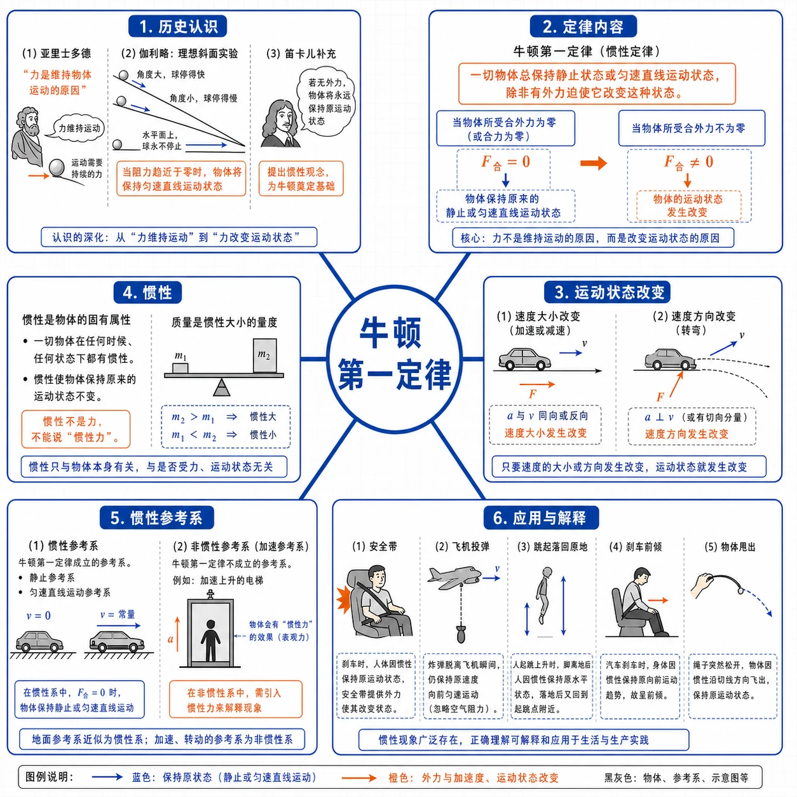
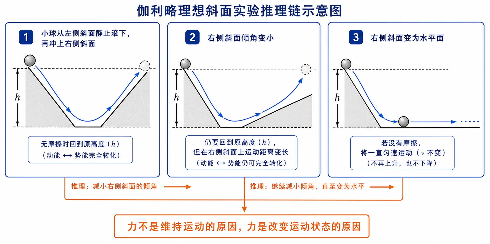
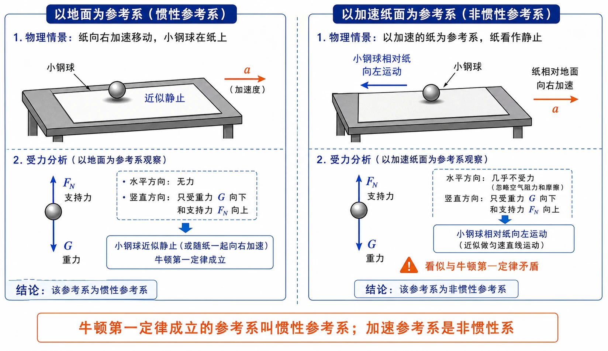

# 4.1 牛顿第一定律

<!-- 图片描述：本节整体知识信息结构图。中心主题为“牛顿第一定律”，向外分为六个分支：历史认识（亚里士多德“力维持运动”、伽利略理想斜面实验、笛卡儿补充）、定律内容（一切物体总保持静止或匀速直线运动状态，除非力迫使它改变）、运动状态改变（速度大小改变、速度方向改变）、惯性（一切物体固有属性、不是力、质量是惯性大小的量度）、惯性参考系（牛顿第一定律成立的参考系、加速参考系是非惯性系）、应用与解释（安全带、飞机投弹、跳起落回原地、刹车前倾）。白色或浅网格背景，黑灰物体和斜面轮廓，蓝色表示运动或保持原状态，橙色表示力、加速度和关键结论。 -->

## 本节学习目标

学完本节，需要能做到：

- 说明亚里士多德“力维持运动”观点为什么来自经验误导。
- 理解伽利略理想斜面实验的事实、推理和科学方法价值。
- 准确表述牛顿第一定律，知道它也叫惯性定律。
- 理解“运动状态改变”指速度大小或速度方向改变。
- 理解惯性是一切物体固有的属性，质量是惯性大小的量度。
- 会用惯性解释安全带、飞机投弹、跳起落回原地等情境。
- 初步知道惯性参考系和非惯性参考系的区别。

## 核心知识点讲解

### 一、知识对象与物理情境

本节研究的问题是：运动和力到底是什么关系？

日常经验容易让人得到这样的判断：推车时车会动，不推车时车会停，所以似乎“物体运动必须有力维持”。滑冰运动员不用力后会慢慢停下来，也好像支持这种判断。

但这条“明显可见的线索”其实是错误判断。车停下来不是因为没有力维持，而是因为摩擦力和空气阻力在改变它的运动状态。本节的核心问题可以概括为：

$$
\text{力是维持运动的原因，还是改变运动状态的原因？}
$$

### 二、核心概念与物理意义

#### 1. 运动状态

运动状态由速度描述。只要满足下列任意一条，运动状态就发生了改变：

- 速度大小改变。
- 速度方向改变。

例如：汽车加速、刹车，是速度大小改变；汽车转弯，是速度方向改变；平抛运动中物体速度大小和方向都在改变。它们都属于运动状态改变。

#### 2. 惯性

物体保持原来静止状态或匀速直线运动状态的性质，叫作惯性。

理解惯性时要注意几点：

- 惯性是物体固有的属性，一切物体都有惯性。
- 惯性不是一种力。不能说“受到惯性作用”或“惯性力使物体运动”。
- 惯性大小只由质量决定，与速度、受力、运动状态无关。

#### 3. 质量

质量可以从两个角度理解：

- 表示物体所含物质的多少。
- 是物体惯性大小的量度。

质量越大，物体保持原有运动状态的能力越强，运动状态越难改变。例如用同样方式抛掷两块石头使其获得相同速度，质量大的石头需要的力更大；让摆动的大沙袋停下来比让小球停下来更费力。

质量是标量，只有大小没有方向。在国际单位制中，质量单位是千克，符号为 $\text{kg}$。

### 三、关键规律、公式与适用条件

牛顿第一定律的内容是：

> 一切物体总保持匀速直线运动状态或静止状态，除非作用在它上面的力迫使它改变这种状态。

它揭示的运动和力关系是：

- 力不是维持物体运动状态的原因。
- 力是改变物体运动状态的原因。
- 如果物体不受力或所受合力为零，它将保持静止或匀速直线运动状态。

适用条件：牛顿第一定律只在惯性参考系中成立。

牛顿第一定律描述的是一种理想状态。现实中物体总会和周围物体有相互作用，完全不受力的物体不存在。所以牛顿第一定律不能用一个真实实验直接验证，而是在实验事实基础上通过理想化推理得到。

### 四、典型模型与分析方法

#### 1. 伽利略理想斜面实验

伽利略认为把人们引入歧途的是摩擦。他注意到：小球沿斜面向下滚时速度增大，向上滚时速度减小，于是猜想沿水平面滚动时速度应不增不减。但实际水平面上小球仍会慢慢停下，伽利略把这归因于摩擦。

为了说明观点，他设计了理想实验：

1. 小球沿一个斜面从静止滚下，再冲上另一个斜面。
2. 如果没有摩擦，小球会到达原来的高度。
3. 第二个斜面倾角减小时，小球仍要到达原来的高度，但运动距离更长。
4. 当第二个斜面变为水平面时，小球为了达到原高度将永远运动下去。
5. 结论：如果没有阻力，运动物体将保持匀速直线运动；力不是维持运动的原因。

<!-- 图片描述：伽利略理想斜面实验推理链示意图。画面分三栏：第一栏画小球从左侧斜面静止滚下，再冲上右侧斜面，标注“无摩擦时回到原高度”；第二栏画右斜面倾角变小，标注“仍要回到原高度，运动距离变长”；第三栏画右侧变为水平面，蓝色水平箭头无限延伸，标注“若没有摩擦，将一直匀速运动”。底部橙色结论框写“力不是维持运动的原因，力是改变运动状态的原因”。白色或浅网格背景，黑灰斜面和小球轮廓，蓝色表示运动路径，橙色表示关键推理和结论。 -->

这个实验的价值不在于“能直接做出来”，而在于把实际中难以完全消除的摩擦力理想化地去掉，从而抓住运动规律的本质。它是一种以真实实验为基础、再用逻辑推理得到结论的科学方法。

#### 2. 笛卡儿的补充

笛卡儿进一步完善了这个思想：如果运动中的物体没有受到力的作用，它将继续以同一速度沿同一直线运动，既不会停下来，也不会偏离原来的方向。他还认为这应该成为一个原理，是整个自然观的基石。

#### 3. 惯性现象分析模型

解释惯性现象通常按四步走：

1. 确定研究对象。
2. 说明研究对象原来的运动状态。
3. 说明由于惯性，研究对象要保持这种状态。
4. 结合其他物体受力情况，说明最终结果。

例如急刹车时乘客前倾：乘客原来随车向前运动；汽车减速；乘客由于惯性仍向前保持原运动状态；所以乘客相对汽车向前倾。

### 五、图像、实验与数据理解

#### 1. 频闪照片与理想实验

伽利略斜面实验的频闪照片能帮助我们观察小球在斜面上的运动过程：相邻频闪位置间距在加速段越来越大，在减速段越来越小。这些事实支持“无摩擦时小球能到达原高度”的推理。

注意：频闪照片本身不是“理想实验”，它只是为理想化推理提供实验事实。

#### 2. 拉纸与小钢球实验

桌面上放一张纸和一个小钢球，球静止在纸面上。迅速拉动纸的一边：

- 以地面为参考系：小钢球几乎不动，仍保持静止。它水平方向几乎不受力，符合牛顿第一定律。
- 以加速运动的纸为参考系：小钢球相对纸面向后运动，运动状态似乎在改变，但水平方向并没有力作用，与牛顿第一定律“矛盾”。

这个“矛盾”说明：牛顿第一定律是否成立，与所选参考系有关。

<!-- 图片描述：惯性参考系与非惯性参考系对比图。左栏标题“以地面为参考系”：黑灰桌面、纸和小钢球，纸向右加速移动，小钢球标蓝色“近似静止”，并标出它只受重力和支持力；右栏标题“以加速纸面为参考系”：纸看作静止，小钢球相对纸向左运动，水平方向却几乎不受力，标注“看似与牛顿第一定律矛盾”。底部橙色结论框写“牛顿第一定律成立的参考系叫惯性参考系；加速参考系是非惯性系”。 -->

### 六、题型应用与迁移

解本节题目时可以按下面路径思考：

| 情境类型 | 思考路径 |
| --- | --- |
| 物体停下或减速 | 先找阻力，不要说“没有力所以停下” |
| 力和运动关系判断 | 用“力改变运动状态”作答 |
| 安全带、投弹、跳起落回原地 | 先说原运动状态，再说惯性保持，最后说结果 |
| 惯性大小比较 | 只看质量，不看速度、受力或运动状态 |
| 拉纸小球、加速车厢 | 注意牛顿第一定律只在惯性参考系中成立 |

## 重点梳理

### 重点 1：亚里士多德观点为什么错

亚里士多德根据“推则动、不推则停”的日常现象，得出“必须有力作用在物体上，物体才能运动”的结论。这种观点把阻力作用下的现象误当成普遍规律，没有看到摩擦才是物体停下的原因。

### 重点 2：伽利略理想实验的价值

伽利略理想实验不是凭空想象，而是以真实实验为基础，再用逻辑推理得出：没有摩擦时，运动物体可以一直运动下去。它揭示了“力不是维持运动的原因”，并提出把实际实验理想化的重要研究方法。

### 重点 3：牛顿第一定律

力是改变运动状态的原因，不是维持运动状态的原因。物体不受力或合力为零时，保持静止或匀速直线运动状态。

### 重点 4：惯性和质量

惯性是一切物体固有的属性，不是力。质量是惯性大小的量度：质量越大，惯性越大，运动状态越难改变。

### 重点 5：惯性参考系

牛顿第一定律不是在任何参考系中都成立。能使不受力物体保持静止或匀速直线运动的参考系叫惯性参考系；加速运动的参考系是非惯性系。

## 难点突破

### 难点 1：滑冰运动员不用力后停下，是否与牛顿第一定律矛盾

不矛盾。牛顿第一定律说的是不受力或合力为零时物体保持匀速直线运动。滑冰运动员停下是因为受到冰面摩擦力和空气阻力，合力不为零，运动状态被改变。

### 难点 2：为什么牛顿第一定律不能直接用实验验证

现实中不存在完全不受力的物体，也不可能把所有阻力彻底消除。牛顿第一定律是在实验事实基础上经过理想化推理得到的规律。

### 难点 3：速度越大，惯性越大吗

不是。惯性大小只由质量决定。高速汽车更难停下，是因为速度变化量大，刹车过程需要更长时间或更大作用力，不是因为惯性随速度变大。

### 难点 4：加速纸面参考系中为什么会出现“矛盾”

以加速纸面为参考系时，小球相对纸面运动状态改变，但水平方向几乎不受力，与牛顿第一定律矛盾。换成地面参考系后，小球近似保持静止，矛盾消失。这说明牛顿第一定律只在惯性参考系中成立。

### 难点 5：为什么不能说“受到惯性作用”

惯性是物体本身具有的性质，不是外界施加的作用，也不是一种力。正确的说法是“由于惯性”“因为物体具有惯性”。

## 例题讲解

### 例题 1：解释安全带

**题目**：汽车急刹车时，乘客为什么会向前倾？为什么规定乘坐小型车辆必须系好安全带？

**分析**：急刹车时汽车速度迅速减小，乘客原来随车向前运动。由于惯性，乘客要保持原来的向前运动状态。

**步骤**：

1. 研究对象：乘客。
2. 原运动状态：随汽车向前运动。
3. 急刹车后：汽车减速，乘客因惯性继续向前。
4. 安全带作用：给乘客向后的力，使乘客随车减速。

**答案**：乘客向前倾是惯性现象。安全带能在急刹车或碰撞时给乘客作用力，使其随车减速，减少伤害。

### 例题 2：飞机投弹

**题目**：飞机水平飞行时，如果目标在飞机正下方才投下炸弹，能击中目标吗？

**分析**：炸弹离开飞机时具有与飞机相同的水平速度，离开后由于惯性保持水平运动，同时在重力作用下下落。

**答案**：不能击中目标。炸弹会落在目标前方。若要击中目标，应在目标到达飞机正下方之前提前投弹。

### 例题 3：地球自转与跳起落回原地

**题目**：地球由西向东自转，向上跳起后为什么还落在原地附近，而不是落到原地的西边？

**分析**：人跳起前已经随地球一起由西向东运动。跳起后，人在水平方向几乎不受力，由于惯性仍保持原来的水平运动状态。

**答案**：人和地面具有相同的水平速度，跳起后由于惯性仍保持原水平运动，所以落回原地附近。

### 例题 4：判断惯性说法

**题目**：“汽车速度越大，刹车后越难停下来，说明速度越大，惯性越大。”这句话对吗？

**分析**：惯性大小只由质量决定，与速度无关。速度越大时需要改变的速度量更大，所以刹车距离更长，但惯性没有因为速度增大而增大。

**答案**：不对。惯性只由质量决定。同一辆汽车无论速度快慢，惯性都相同。

### 例题 5：向上抛出的物体

**题目**：一位同学说，向上抛出的物体在空中向上运动时，肯定受到了向上的作用力，否则它不可能向上运动。这个结论错在哪里？

**分析**：物体离手时具有一定向上速度。离手后若忽略空气阻力，物体只受重力，重力方向向下，使物体速度逐渐减小。物体能继续向上运动，是由于惯性，不是因为受到向上的力。

**答案**：错在认为向上运动必须受向上的力。物体由于惯性继续向上运动，重力只改变它的运动状态，使其速度越来越小。

## 易错点整理

### 易错点 1：认为力维持运动

**常见错误表现**：看到物体停下，就说“没有力所以停了”。

**错因分析**：把阻力作用下的现象当成普遍规律。

**正确处理**：力是改变运动状态的原因，不是维持运动的原因。物体停下是阻力改变了它的运动状态。

### 易错点 2：把惯性说成力

**常见错误表现**：说“受到惯性作用”或“惯性力使物体向前”。

**错因分析**：把惯性和力混淆。

**正确处理**：惯性是物体固有属性，不是力。应说“由于惯性”。

### 易错点 3：认为运动物体才有惯性

**常见错误表现**：说“静止物体没有惯性”。

**错因分析**：把惯性和运动状态绑定。

**正确处理**：一切物体都有惯性，无论运动还是静止。

### 易错点 4：认为速度越大惯性越大

**常见错误表现**：说“高速汽车惯性大，所以难停”。

**错因分析**：把惯性大小和速度混淆。

**正确处理**：惯性只与质量有关。难停是因为速度变化量大。

### 易错点 5：忽略牛顿第一定律的适用参考系

**常见错误表现**：在加速参考系中直接套用牛顿第一定律。

**错因分析**：不知道定律只在惯性参考系中成立。

**正确处理**：先判断参考系。地面或相对地面匀速直线运动的物体可近似看作惯性参考系。

## 考点考证点整理

### 考点一：力和运动关系辨析

- 出题思路：用推车、滑冰、抛体、刹车等情境，要求判断“力是否维持运动”。
- 关键条件：看物体是否受到阻力，合力是否为零。
- 解答要点：写出“力不是维持运动的原因，力是改变运动状态的原因”；停下或减速是阻力作用的结果。
- 易扣分点：写成“物体没有力就不能运动”，或只说“因为惯性”而不说明阻力作用。

### 考点二：伽利略理想斜面实验

- 出题思路：给出斜面实验过程或频闪图，要求补全推理或说明科学方法。
- 关键条件：无摩擦、回到原高度、第二斜面倾角逐渐减小、水平面极限情形。
- 解答要点：按“回到原高度 → 斜面越缓距离越长 → 水平时一直运动”组织答案，并指出这是把实际实验理想化的方法。
- 易扣分点：把理想实验当作可直接完成的真实实验；漏写“无摩擦”条件。

### 考点三：牛顿第一定律内容和惯性

- 出题思路：考查定律表述、惯性概念、运动状态改变的含义。
- 关键条件：静止、匀速直线运动、速度大小改变、速度方向改变、质量。
- 解答要点：定律要包含“总保持静止或匀速直线运动状态”和“除非力迫使它改变”；惯性是一切物体的固有属性，质量量度惯性。
- 易扣分点：把惯性说成力；把惯性大小和速度、受力大小联系起来。

### 考点四：惯性现象解释

- 出题思路：用安全带、投弹、跳起落回原地、急刹车前倾等情境考查。
- 关键条件：物体原来的运动状态、外力如何改变运动状态、研究对象是谁。
- 解答要点：先写原运动状态，再写由于惯性保持原状态，最后结合外力说明结果。
- 易扣分点：只写“因为惯性”四个字，没有说明保持什么运动状态。

### 考点五：惯性参考系

- 出题思路：以拉纸和小钢球、加速车厢等情境考查牛顿第一定律的适用参考系。
- 关键条件：参考系是否加速、物体水平方向是否受力、相对哪个参考系观察。
- 解答要点：在惯性参考系中，不受力物体保持静止或匀速直线运动；加速参考系是非惯性系，定律不直接成立。
- 易扣分点：忽略参考系，或在非惯性系中直接套用牛顿第一定律。

## 练习题

### 基础训练

1. 牛顿第一定律的内容是什么？它揭示了运动和力的什么关系？
2. 什么是惯性？惯性是不是一种力？
3. 怎样描述惯性的大小？质量越大的物体，惯性怎样变化？
4. “运动状态改变”指什么？请举出两个运动状态改变的例子。
5. 牛顿第一定律描述的是一种理想状态，为什么它不能用实验直接验证？

### 巩固训练

6. 飞机水平飞行时投下炸弹，如果目标在飞机正下方才投弹，能击中目标吗？为什么？
7. 地球由西向东自转。向上跳起后，为什么还落在原地附近，而不是落到原地的西边？
8. 汽车急刹车时乘客为什么会向前倾？为什么乘坐小型车辆必须系好安全带？
9. 一位同学说，向上抛出的物体在空中向上运动时肯定受到向上的力，否则不可能向上运动。这个结论错在哪里？
10. 滑冰运动员停止蹬冰后会逐渐停下，这是否说明“力是维持运动的原因”？请解释。

### 提升训练

11. 伽利略在理想斜面实验中提出：如果另一个斜面的倾角减小至 $0^\circ$，小球为达到原来的高度将永远运动下去。请说明他得到这个结论的理由。
12. 判断下列关于惯性的说法是否正确，并说明理由。
    - 汽车速度越大，刹车后越难停下来，表明物体速度越大，惯性越大。
    - 汽车转弯后前进方向发生改变，表明速度方向改变，其惯性也随之改变。
    - 被抛出的小球，尽管速度大小和方向都改变了，但惯性不变。
    - 要使速度相同的沙袋在相同时间内停下来，对大沙袋用力比对小沙袋用力大，表明质量大的物体惯性大。
13. 桌面上放一张纸和一个小钢球，球静止在纸面上。迅速拉动纸的一边，小钢球相对桌面的位置几乎不变，但相对纸面却向相反方向运动。分别以地面和加速纸面为参考系说明现象，并指出哪个是惯性参考系。

## 练习题答案

### 基础训练答案

1. 一切物体总保持匀速直线运动状态或静止状态，除非作用在它上面的力迫使它改变这种状态。它揭示：力不是维持物体运动状态的原因，而是改变物体运动状态的原因。

2. 物体保持原来静止状态或匀速直线运动状态的性质叫惯性。惯性不是力，是物体固有的属性。

3. 用质量描述惯性大小。质量越大，物体保持原有运动状态的能力越强，惯性越大。

4. 运动状态改变指速度大小或速度方向改变。例如汽车加速时速度大小改变，汽车转弯时速度方向改变。

5. 现实中不存在完全不受力的物体，阻力也不可能完全消除。牛顿第一定律是在实验事实基础上经过理想化推理得到的规律，不能靠一个真实实验直接验证。

### 巩固训练答案

6. 不能击中目标。炸弹离开飞机时具有与飞机相同的水平速度，离开后由于惯性继续保持水平运动，同时在重力作用下下落，因此会落在目标前方。要击中目标，应在到达目标正上方之前提前投弹。

7. 人跳起前已经随地球一起由西向东运动。跳起后人在水平方向几乎不受力，由于惯性仍保持原来的水平运动状态，与地面水平速度相同，所以仍落回原地附近。

8. 急刹车时汽车速度迅速减小，乘客原来随车向前运动，由于惯性要保持原来的向前运动状态，所以向前倾。系好安全带后，安全带能在急刹车或碰撞时给乘客作用力，使其随车减速，减少伤害。

9. 错在认为向上运动必须受到向上的力。物体离手时具有向上的速度，离手后由于惯性继续向上运动；若忽略空气阻力，物体只受重力，重力方向向下，使物体速度逐渐减小。所以物体能向上运动是由于惯性，而不是受到向上的力。

10. 不说明“力是维持运动的原因”。运动员停下是因为受到冰面摩擦力和空气阻力，这些力改变了运动员的运动状态。如果没有阻力，运动员将保持匀速直线运动。

### 提升训练答案

11. 在无摩擦条件下，小球从一个斜面滚下后能冲上另一个斜面并到达原高度。当另一斜面倾角减小时，为到达原高度，小球运动距离变长。当倾角减小到 $0^\circ$ 成为水平面时，小球无法通过上升达到原高度，只能一直运动下去。这说明没有阻力时，运动物体会保持匀速直线运动。

12. （1）错误。惯性只由质量决定。速度越大时需要改变的速度量更大，所以刹车更难，但惯性没有因为速度增大而增大。

（2）错误。速度方向改变不说明惯性改变，质量不变则惯性不变。

（3）正确。小球质量不变，惯性不变。

（4）正确。相同时间内使速度相同的大沙袋停下需要更大的力，说明质量大的物体惯性大。

13. 以地面为参考系：纸被迅速拉走，小钢球水平方向几乎不受力，仍保持静止，与牛顿第一定律一致。地面可近似看作惯性参考系。

以加速纸面为参考系：纸面看作静止，小钢球相对纸面反向运动，运动状态似乎在改变，但水平方向并没有力作用，与牛顿第一定律“矛盾”。

所以加速运动的纸面是非惯性参考系，牛顿第一定律不直接成立；地面是惯性参考系，牛顿第一定律成立。
