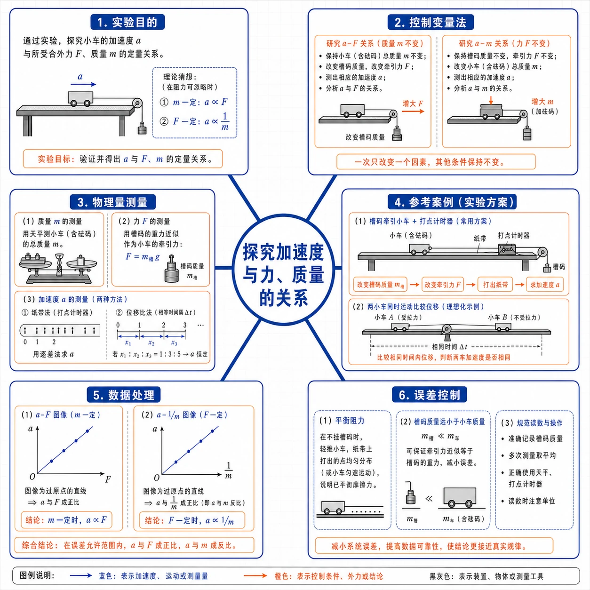
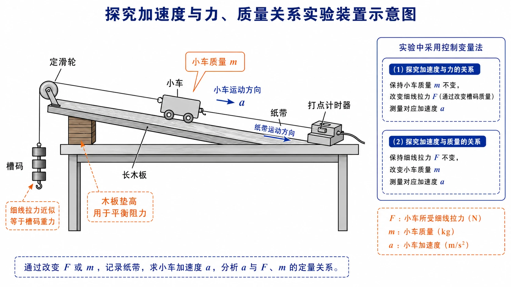
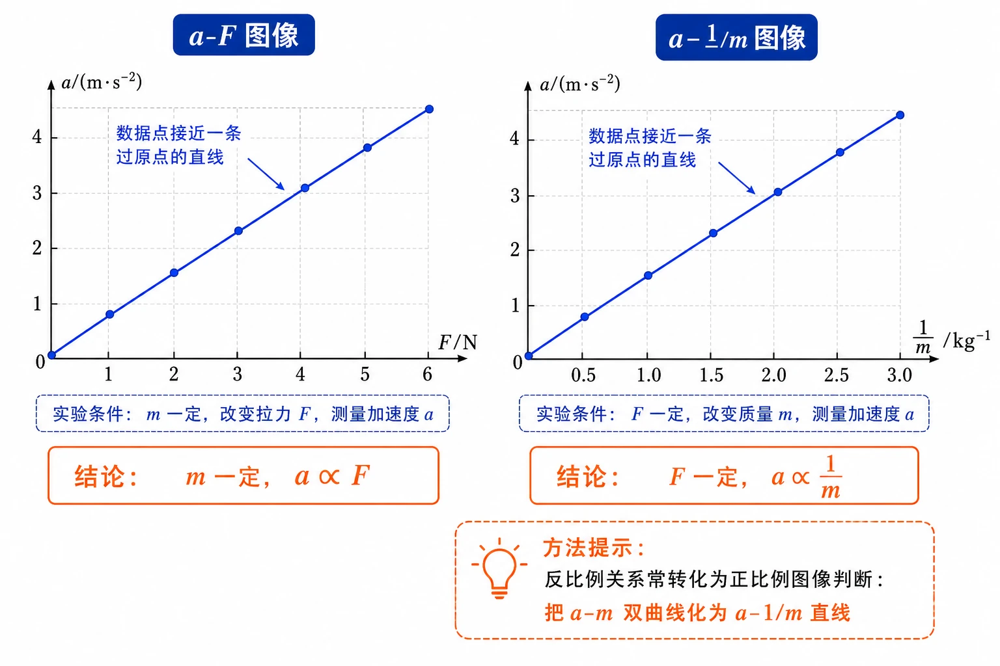

# 4.2 实验：探究加速度与力、质量的关系

<!-- 图片描述：本节整体知识信息结构图。中心主题为“探究加速度与力、质量的关系”，向外分为六个分支：实验目的（找 $a$ 与 $F$、$m$ 的定量关系）、控制变量法（研究 $a$-$F$ 时 $m$ 不变；研究 $a$-$m$ 时 $F$ 不变）、物理量测量（质量用天平、力用槽码重力近似、加速度用纸带或位移比）、参考案例（槽码牵引小车+打点计时器；两小车同时运动比较位移）、数据处理（$a$-$F$ 图像判断正比；$a$-$\frac{1}{m}$ 图像把反比转化为正比）、误差控制（平衡阻力、槽码质量远小于小车质量、规范读数）。白色或浅网格背景，黑灰实验装置和坐标轴，蓝色表示力和加速度，橙色表示质量、控制变量和关键结论。 -->

## 本节学习目标

学完本节，需要能做到：

- 理解为什么要探究加速度 $a$ 与合力 $F$、质量 $m$ 之间的定量关系。
- 掌握控制变量法：研究 $a$ 与 $F$ 时保持 $m$ 不变，研究 $a$ 与 $m$ 时保持 $F$ 不变。
- 知道槽码牵引小车、打点计时器、纸带等基本实验装置。
- 理解平衡阻力、槽码质量远小于小车质量、用纸带测加速度等实验要点。
- 会用 $a=\dfrac{2x}{t^2}$、纸带逐差法或位移比方法测量或比较加速度。
- 会用 $a-F$ 图像判断 $a$ 与 $F$ 成正比；会用 $a-\dfrac{1}{m}$ 图像把反比关系转化为正比关系判断。
- 能处理实验数据表，进行分组、补全和图像作图。

## 核心知识点讲解

### 一、知识对象与物理情境

加速度描述物体运动状态变化的快慢。上一节已经知道，力是改变运动运动状态的原因，质量越大的物体运动状态越难改变。这说明，物体的加速度应当同时与受到的合力和物体质量有关。

本实验要回答的核心问题是：

$$
a、F、m\text{ 三者之间有什么定量关系？}
$$

如果一个物理量同时受多个因素影响，直接研究整体关系会非常困难。物理实验中常采用控制变量法：先固定一部分因素，只让其中一个因素变化，研究它与目标量的关系。

### 二、核心概念与定义

#### 1. 控制变量法

研究某个物理量 $y$ 与另外两个变量 $x_1$、$x_2$ 的关系时，先固定 $x_2$ 不变，研究 $y$ 与 $x_1$ 的定量关系；再固定 $x_1$ 不变，研究 $y$ 与 $x_2$ 的关系。这就是控制变量法。

本实验分两步：

| 步骤 | 控制条件 | 改变量 | 研究关系 |
| --- | --- | --- | --- |
| 1 | 小车质量 $m$ 不变 | 拉力 $F$ | $a$ 与 $F$ 的关系 |
| 2 | 拉力 $F$ 不变 | 小车质量 $m$ | $a$ 与 $m$ 的关系 |

#### 2. 实验中的力 $F$

实验中作用力 $F$ 应理解为小车所受合力。为使合力可测、可控，常用方法有两种：

- 平衡阻力：把木板一端垫高，使小车在不受牵引时能拖动纸带沿木板匀速运动。平衡阻力后，小车所受合力就近似等于细线拉力。
- 用槽码牵引：当槽码质量远小于小车质量时，细线拉力近似等于槽码所受重力。

#### 3. 三类被测物理量

本实验要测量三个物理量：

| 物理量 | 测量方法 |
| --- | --- |
| 质量 $m$ | 用天平称量；通过在小车上增减钩码改变小车质量 |
| 力 $F$ | 平衡阻力后用槽码重力近似；也可用力传感器 |
| 加速度 $a$ | 用位移和时间公式、纸带或位移比方法 |

### 三、关键规律、公式与适用条件

#### 1. 用位移和时间求加速度

如果小车从静止开始做匀加速直线运动，由位移公式：

$$
x=\frac{1}{2}at^2
$$

得到：

$$
a=\frac{2x}{t^2}
$$

这种方法需要同时测位移 $x$ 和时间 $t$。

#### 2. 用位移比比较加速度

若两辆小车都从静止开始运动，并且运动时间相同，则：

$$
\frac{a_1}{a_2}=\frac{x_1}{x_2}
$$

这说明：在比较加速度关系时，可以把测量加速度转化为测量位移。参考案例 2 正是利用两辆小车同时开始、同时停止来满足运动时间相等的条件。

#### 3. 用纸带求加速度（逐差法）

打点计时器在纸带上打出等时间间隔的点。若相邻计数点之间有 $n$ 个打点间隔，相邻计数点时间为：

$$
T'=nT
$$

其中 $T$ 是打点周期，电源频率为 $50\ \text{Hz}$ 时 $T=0.02\ \text{s}$。

若纸带上连续相等时间 $T'$ 内的位移依次为 $x_1$、$x_2$、$x_3$、$x_4$、$x_5$、$x_6$，则加速度可用逐差法：

$$
a=\frac{(x_4+x_5+x_6)-(x_1+x_2+x_3)}{9T'^2}
$$

这种方法能减小读数误差，是纸带题常用方法。

#### 4. 实验最终规律

$$
m\text{ 一定时，}a\propto F
$$

$$
F\text{ 一定时，}a\propto\frac{1}{m}
$$

这两个结论就是下一节牛顿第二定律 $F=ma$ 的实验基础。

### 四、典型模型与过程分析

#### 1. 参考案例 1：槽码牵引小车 + 打点计时器

实验步骤：

1. 把木板一端垫高，调节倾角，使小车在不受牵引时能拖动纸带沿木板匀速运动，从而平衡阻力。
2. 安装小车、纸带、打点计时器、滑轮、细线和槽码。
3. 保持小车质量不变，改变槽码个数，得到不同拉力下的纸带。
4. 保持槽码不变，在小车上增减重物，得到不同质量下的纸带。
5. 处理纸带，计算各次实验的加速度。
6. 用图像法判断 $a-F$ 和 $a-m$ 的关系。

<!-- 图片描述：探究加速度与力、质量关系实验装置示意图。画一块一端垫高的长木板，木板上放小车，小车后端连纸带，纸带穿过打点计时器；小车前端通过细线绕过木板高端的定滑轮连接槽码。蓝色箭头标出小车运动方向和纸带运动方向，橙色标注“木板垫高用于平衡阻力”“小车质量 $m$”“细线拉力近似等于槽码重力”。右侧用小框列出两组控制变量：$m$ 不变改变 $F$；$F$ 不变改变 $m$。白色背景，黑灰实验装置轮廓。 -->

#### 2. 参考案例 2：两小车同时运动比较位移

把两辆相同的小车放在水平木板上，前端各系一条细线，通过滑轮各挂一个小盘，盘中放不同重物。两小车后端各系一条细线，用一个物体（例如黑板擦）同时按住或释放。抬起物体，两小车同时开始运动；按下物体，两小车同时停止。

由于两小车运动时间相同，且初速度都为 $0$，由 $x=\frac{1}{2}at^2$ 可得：

$$
\frac{a_1}{a_2}=\frac{x_1}{x_2}
$$

这种方法不必算出每个加速度的具体数值，只需比较位移即可。

### 五、图像、实验与数据理解

#### 1. $a-F$ 图像判断正比

研究 $a$ 与 $F$ 的关系时，以 $F$ 为横轴、$a$ 为纵轴描点。如果数据点大致分布在过原点的直线附近，说明小车质量一定时，加速度 $a$ 与合力 $F$ 成正比。

#### 2. $a-\dfrac{1}{m}$ 图像判断反比

研究 $a$ 与 $m$ 的关系时，经验告诉我们，相同拉力下质量越大加速度越小。这可能是 $a$ 与 $m$ 成反比，也可能是 $a$ 与 $m^2$ 成反比或其他更复杂关系。从最简单的猜想入手，先检验 $a$ 是否与 $m$ 成反比。

直接作 $a-m$ 图像时，若为反比关系，图线是双曲线，很难直观判断。若把横轴换成 $\dfrac{1}{m}$，作 $a-\dfrac{1}{m}$ 图像：如果结果是过原点的直线，就说明 $a$ 与 $\dfrac{1}{m}$ 成正比，即 $a$ 与 $m$ 成反比。

<!-- 图片描述：$a-F$ 与 $a-\frac{1}{m}$ 图像判断实验结论对比图。左图横轴 $F/\text{N}$、纵轴 $a/(\text{m}\cdot\text{s}^{-2})$，数据点接近一条过原点的蓝色直线，标注“$m$ 一定，$a\propto F$”。右图横轴 $\frac{1}{m}/\text{kg}^{-1}$、纵轴 $a/(\text{m}\cdot\text{s}^{-2})$，数据点接近过原点蓝色直线，标注“$F$ 一定，$a\propto\frac{1}{m}$”。右下角橙色提示框写“反比例关系常转化为正比例图像判断：把 $a-m$ 双曲线化为 $a-\frac{1}{m}$ 直线”。 -->

#### 3. 数据表分组方法

当一张表里同时混合了“探究 $a$ 与 $F$ 关系”和“探究 $a$ 与 $m$ 关系”的实验数据时，按控制变量分组：

- 把质量相同、拉力不同的几组数据归入“$a$ 与 $F$ 关系”表。
- 把拉力相同、质量不同的几组数据归入“$a$ 与 $m$ 关系”表。
- 若个别加速度数据模糊不清，可分别用 $a\propto F$ 和 $a\propto\dfrac{1}{m}$ 推算补全。

### 六、题型应用与迁移

本节题目常考三类能力：

| 题型 | 关键点 |
| --- | --- |
| 实验设计 | 控制哪些量，改变哪些量，如何平衡阻力 |
| 数据处理 | 由纸带求加速度；由混合表格拆分 $a-F$ 和 $a-m$ 数据 |
| 图像判断 | 根据 $a-F$、$a-\frac{1}{m}$ 图像得出正比或反比结论 |

## 重点梳理

### 重点 1：控制变量法是本实验的灵魂

加速度同时受合力和质量影响。如果不控制变量，就无法判断加速度变化到底由哪个因素引起。

研究 $a$ 与 $F$ 关系时控制 $m$ 不变；研究 $a$ 与 $m$ 关系时控制 $F$ 不变。

### 重点 2：平衡阻力的目的和方法

平衡阻力的目的是让小车所受合力近似等于细线拉力。方法是把木板一端垫高，让小车在不受牵引时能拖动纸带沿木板匀速运动。

判断标准：小车能拖着纸带匀速运动，说明重力沿斜面分量与阻力平衡。

### 重点 3：槽码质量要远小于小车质量

槽码和小车一起加速运动，细线拉力并不严格等于槽码重力。只有槽码质量远小于小车质量时，才可近似认为：

$$
F_{\text{拉}}\approx G_{\text{槽码}}
$$

否则拉力小于槽码重力，会产生系统误差。

### 重点 4：反比关系要化为正比图像判断

判断 $a$ 与 $m$ 是否成反比，不直接看 $a-m$ 曲线，而作 $a-\dfrac{1}{m}$ 图像。若为过原点直线，则 $a$ 与 $m$ 成反比。

## 难点突破

### 难点 1：为什么要平衡阻力

小车运动时受到摩擦力和纸带阻力。如果不平衡阻力，小车所受合力是细线拉力减去阻力：

$$
F_{\text{合}}=F_{\text{拉}}-F_{\text{阻}}
$$

这样即使质量一定，$a-F_{\text{拉}}$ 图像也可能不过原点（在 $F$ 轴上有正截距），影响实验结论。

### 难点 2：为什么槽码质量要远小于小车质量

设小车质量为 $M$，槽码质量为 $m_0$。槽码和小车以同一加速度运动，由整体法和隔离法可推出细线拉力：

$$
F_{\text{拉}}=\frac{M}{M+m_0}\,G_{\text{槽码}}
$$

只有当 $m_0\ll M$ 时，$\dfrac{M}{M+m_0}\approx1$，才有 $F_{\text{拉}}\approx G_{\text{槽码}}$。

### 难点 3：为什么研究 $a$ 与 $m$ 要作 $a-\dfrac{1}{m}$ 图像

如果 $a$ 与 $m$ 成反比，$a-m$ 图像是双曲线，仅凭肉眼很难判断是不是双曲线，更难判断是否过特定点。把横轴换成 $\dfrac{1}{m}$ 后，反比关系变成正比关系，过原点的直线更容易识别。

### 难点 4：实验点不在一条直线上怎么办

真实实验存在读数误差、摩擦残余、纸带摩擦、释放操作等误差。作图时应根据数据点的整体趋势画一条拟合直线，使数据点大致均匀分布在直线两侧，不应把所有点机械地用折线连起来。

### 难点 5：为什么位移比可以代替加速度比

两辆小车同时开始同时停止，运动时间 $t$ 相同。若初速度都为 $0$，则 $x=\frac{1}{2}at^2$，所以 $x\propto a$，位移比等于加速度比。

## 例题讲解

### 例题 1：由位移和时间求加速度

**题目**：小车从静止开始做匀加速直线运动，$3.0\ \text{s}$ 内位移为 $4.5\ \text{m}$，求小车加速度。

**分析**：已知初速度为 $0$，可用 $a=\dfrac{2x}{t^2}$。

**步骤**：

$$
a=\frac{2x}{t^2}=\frac{2\times4.5}{3.0^2}=\frac{9}{9}=1.0\ \text{m/s}^2
$$

**答案**：小车加速度为 $1.0\ \text{m/s}^2$。

### 例题 2：纸带逐差法求加速度

**题目**：用打点计时器研究小车运动。电源频率 $50\ \text{Hz}$，纸带上每相邻两个计数点之间还有 $4$ 个点未画出。测得连续 6 段相等时间内的位移为 $x_1=3.20\ \text{cm}$、$x_2=6.70\ \text{cm}$、$x_3=7.21\ \text{cm}$、$x_4=7.72\ \text{cm}$、$x_5=8.23\ \text{cm}$、$x_6=8.74\ \text{cm}$。求小车加速度。

**分析**：相邻两个计数点之间还有 $4$ 个点未画出，所以相邻计数点之间有 $5$ 个打点间隔：

$$
T'=5T=5\times0.02\ \text{s}=0.10\ \text{s}
$$

**步骤**：用逐差法：

$$
a=\frac{(x_4+x_5+x_6)-(x_1+x_2+x_3)}{9T'^2}
$$

代入数据（注意把厘米换算为米）：

$$
(x_4+x_5+x_6)=(7.72+8.23+8.74)\times10^{-2}=24.69\times10^{-2}\ \text{m}
$$

$$
(x_1+x_2+x_3)=(3.20+6.70+7.21)\times10^{-2}=17.11\times10^{-2}\ \text{m}
$$

$$
a=\frac{(24.69-17.11)\times10^{-2}}{9\times0.10^2}\ \text{m/s}^2
$$

$$
a=\frac{7.58\times10^{-2}}{0.09}\ \text{m/s}^2\approx0.84\ \text{m/s}^2
$$

**答案**：小车加速度约为 $0.84\ \text{m/s}^2$。

**反思**：纸带题要注意“两个计数点间还有几个点未画出”对应的间隔数；逐差法能减小读数误差。

### 例题 3：位移比法比较加速度

**题目**：两辆小车从静止同时开始运动，同时停止。测得两车位移分别为 $0.40\ \text{m}$ 和 $0.60\ \text{m}$，求加速度之比。

**分析**：两车运动时间相同，初速度均为 $0$，所以 $\dfrac{a_1}{a_2}=\dfrac{x_1}{x_2}$。

**步骤**：

$$
\frac{a_1}{a_2}=\frac{x_1}{x_2}=\frac{0.40}{0.60}=\frac{2}{3}
$$

**答案**：加速度之比为 $2:3$。

### 例题 4：$a-\dfrac{1}{m}$ 图像判断

**题目**：保持小车所受拉力不变，改变小车质量 $m$，测得多组加速度 $a$ 的数据。以 $\dfrac{1}{m}$ 为横轴、$a$ 为纵轴描点，发现数据点大致分布在过原点的直线附近。这说明了什么？

**答案**：说明 $a$ 与 $\dfrac{1}{m}$ 成正比，也就是在合力一定时，加速度 $a$ 与质量 $m$ 成反比。

### 例题 5：混合数据表分组

**题目**：某同学把“探究加速度与力的关系”和“探究加速度与质量的关系”两个实验的数据都记录在同一张表中，数据按加速度大小排列。怎样把这些数据拆分到两个表中？若个别加速度数据模糊不清，应如何补全？

**分析**：按控制变量分组。质量相同、拉力不同的数据归入“探究加速度与力的关系”表；拉力相同、质量不同的数据归入“探究加速度与质量的关系”表。

**答案**：分组后，“探究加速度与力的关系”表中应满足质量相同，加速度随拉力增大而正比增大；“探究加速度与质量的关系”表中应满足拉力相同，加速度与 $\dfrac{1}{m}$ 成正比。模糊数据可分别用 $a\propto F$（同质量）和 $a\propto\dfrac{1}{m}$（同拉力）的规律推算补全。

## 易错点整理

### 易错点 1：忘记控制变量

**常见错误表现**：同时改变 $F$ 和 $m$。

**错因分析**：没有抓住控制变量法。

**正确处理**：每次只让一个自变量变化，另一个保持不变。

### 易错点 2：未平衡阻力

**常见错误表现**：直接把槽码重力当作合力，不垫高木板。

**错因分析**：忽略摩擦力和纸带阻力。

**正确处理**：垫高木板，让小车不受牵引时能拖纸带匀速运动；之后细线拉力才近似等于合力。

### 易错点 3：槽码质量不满足远小于条件

**常见错误表现**：用大槽码配轻小车。

**错因分析**：此时细线拉力明显小于槽码重力。

**正确处理**：保证槽码质量远小于小车质量，必要时用力传感器直接测拉力。

### 易错点 4：研究 $a$ 与 $m$ 只作 $a-m$ 图像

**常见错误表现**：看到曲线就说没规律。

**错因分析**：不会把反比转化为正比。

**正确处理**：作 $a-\dfrac{1}{m}$ 图像，用过原点直线判断反比关系。

### 易错点 5：纸带计数点时间算错

**常见错误表现**：把“两个计数点间有 $4$ 个点未画出”当作 $4T$。

**错因分析**：少数了两个相邻计数点之间的打点间隔数。

**正确处理**：相邻两个计数点之间有 $n$ 个未画出的点时，相邻计数点间共有 $n+1$ 个打点间隔，时间为 $(n+1)T$。

### 易错点 6：机械连点

**常见错误表现**：把所有数据点用折线连起来。

**错因分析**：不理解实验误差。

**正确处理**：根据整体趋势画拟合直线，让数据点大致均匀分布在直线两侧。

## 考点考证点整理

### 考点一：控制变量法

- 出题思路：给出实验目的，要求判断保持什么不变、改变什么、测量什么。
- 关键条件：研究 $a$-$F$ 时 $m$ 不变；研究 $a$-$m$ 时 $F$ 不变。
- 解答要点：明确控制变量对象，说明只让一个自变量变化。
- 易扣分点：把“保持质量不变”和“保持拉力不变”说反。

### 考点二：实验装置与平衡阻力

- 出题思路：给出槽码牵引小车装置，问为什么垫高木板、怎样判断阻力已平衡。
- 关键条件：小车不受牵引时能拖动纸带沿木板匀速运动。
- 解答要点：平衡阻力后，小车所受合力近似等于细线拉力；判断依据是小车能匀速运动。
- 易扣分点：说成“消除所有阻力”；漏写“拖动纸带”。

### 考点三：纸带求加速度

- 出题思路：给纸带、计数点和频率，要求求速度或加速度。
- 关键条件：电源频率、相邻计数点之间有几个打点间隔、位移单位换算。
- 解答要点：先求计数点时间，再由逐差法或图像法求加速度。
- 易扣分点：计数点时间间隔算错；厘米未换成米。

### 考点四：$a-F$ 图像和 $a-\dfrac{1}{m}$ 图像

- 出题思路：给数据或图像，要求判断正比或反比关系。
- 关键条件：图像是否过原点；横轴是 $m$ 还是 $\dfrac{1}{m}$。
- 解答要点：$a-F$ 过原点直线说明 $a\propto F$；$a-\dfrac{1}{m}$ 过原点直线说明 $a\propto\dfrac{1}{m}$，即 $a$ 与 $m$ 成反比。
- 易扣分点：把 $a-m$ 曲线误判为正比；不会把反比化为正比。

### 考点五：实验误差和近似条件

- 出题思路：问图像不过原点、拉力近似条件、数据点偏离直线原因。
- 关键条件：阻力是否平衡、槽码质量比例、纸带摩擦和读数误差。
- 解答要点：指出误差来源，并说明改进方法，如充分平衡阻力、减小槽码质量比例、规范读数。
- 易扣分点：只写“实验误差”而不说具体来源。

## 练习题

### 基础训练

1. 本实验的研究对象通常是什么？需要测量哪三个物理量？
2. 控制变量法在本实验中怎样使用？写出两组控制条件。
3. 为什么要平衡阻力？怎样判断阻力已被平衡？
4. 为什么要求槽码质量远小于小车质量？
5. 写出 $a=\dfrac{2x}{t^2}$ 的推导过程，并说明它的适用条件。

### 巩固训练

6. 小车从静止开始做匀加速直线运动，$2.0\ \text{s}$ 内位移为 $1.6\ \text{m}$，求加速度。
7. 两辆小车从静止同时开始运动，同时停止，位移分别为 $0.40\ \text{m}$ 和 $0.60\ \text{m}$。求加速度之比。
8. 打点计时器电源频率为 $50\ \text{Hz}$。纸带上两个相邻计数点之间还有 $4$ 个点未画出，相邻计数点之间的时间间隔是多少？
9. 保持小车质量不变，得到 $a-F$ 图像是一条过原点的直线，说明什么？
10. 保持拉力不变，得到 $a-\dfrac{1}{m}$ 图像是一条过原点的直线，说明什么？为什么不直接看 $a-m$ 图像？

### 提升训练

11. 用打点计时器研究小车运动，电源频率 $50\ \text{Hz}$，纸带上每相邻两个计数点之间还有 $4$ 个点未画出。测得连续 $6$ 段相等时间内的位移依次为 $3.20\ \text{cm}$、$6.70\ \text{cm}$、$7.21\ \text{cm}$、$7.72\ \text{cm}$、$8.23\ \text{cm}$、$8.74\ \text{cm}$。用逐差法求小车加速度。
12. 某同学把“探究加速度与力的关系”和“探究加速度与质量的关系”两个实验的数据混在同一张表中：
    
    | $F/\text{N}$ | $m/\text{kg}$ | $a/(\text{m}\cdot\text{s}^{-2})$ |
    | --- | --- | --- |
    | $0.29$ | $0.86$ | $0.34$ |
    | $0.14$ | $0.36$ | $0.39$ |
    | $0.29$ | $0.61$ | $0.48$ |
    | $0.19$ | $0.36$ | $0.53$ |
    | $0.24$ | $0.36$ | (待补) |
    | $0.29$ | $0.41$ | $0.71$ |
    | $0.29$ | $0.36$ | $0.81$ |
    | $0.34$ | $0.36$ | $0.94$ |
    
    把这些数据拆分成“探究加速度与力的关系”表（$m$ 相同）和“探究加速度与质量的关系”表（$F$ 相同），并补出空缺的加速度值。
13. 保持小车所受拉力不变，改变小车质量 $m$，得到下列数据。请说明怎样用图像判断 $a$ 与 $m$ 的关系。
    
    | $m/\text{kg}$ | $0.25$ | $0.40$ | $0.50$ | $0.71$ | $1.00$ |
    | --- | --- | --- | --- | --- | --- |
    | $a/(\text{m}\cdot\text{s}^{-2})$ | $0.62$ | $0.40$ | $0.32$ | $0.24$ | $0.15$ |

14. 某次实验得到 $a-F$ 图像不过原点，而在 $F$ 轴上有正截距，可能原因是什么？

## 练习题答案

### 基础训练答案

1. 研究对象通常是小车。需要测量质量 $m$、合力 $F$、加速度 $a$。

2. 研究 $a$ 与 $F$ 关系时，保持小车质量 $m$ 不变，只改变拉力 $F$；研究 $a$ 与 $m$ 关系时，保持拉力 $F$ 不变，只改变小车质量 $m$。

3. 平衡阻力的目的是让小车所受合力近似等于细线拉力。判断方法是：小车不受牵引时能拖动纸带沿木板匀速运动，说明阻力已被重力的沿斜面分量平衡。

4. 槽码和小车一起加速运动，细线拉力并不严格等于槽码重力。只有槽码质量远小于小车质量时，才可近似认为 $F_{\text{拉}}\approx G_{\text{槽码}}$。

5. 由 $x=\dfrac{1}{2}at^2$ 解出 $a$：

$$
a=\frac{2x}{t^2}
$$

适用条件：初速度为 $0$ 的匀加速直线运动。

### 巩固训练答案

6. 加速度：

$$
a=\frac{2x}{t^2}=\frac{2\times1.6}{2.0^2}=\frac{3.2}{4}=0.80\ \text{m/s}^2
$$

7. 加速度之比等于位移之比：

$$
a_1:a_2=x_1:x_2=0.40:0.60=2:3
$$

8. 相邻两个计数点之间还有 $4$ 个点未画出，说明相邻计数点之间共有 $5$ 个打点间隔：

$$
T'=5T=5\times0.02\ \text{s}=0.10\ \text{s}
$$

9. 说明小车质量一定时，加速度 $a$ 与合力 $F$ 成正比，即 $a\propto F$。

10. 说明拉力一定时，$a$ 与 $\dfrac{1}{m}$ 成正比，也就是 $a$ 与 $m$ 成反比。不直接看 $a-m$ 图像，是因为反比关系的图线是双曲线，肉眼难以判断；化为 $a-\dfrac{1}{m}$ 图像后，过原点直线更容易识别。

### 提升训练答案

11. 相邻计数点时间间隔：

$$
T'=5T=0.10\ \text{s}
$$

逐差法：

$$
a=\frac{(x_4+x_5+x_6)-(x_1+x_2+x_3)}{9T'^2}
$$

$$
(x_4+x_5+x_6)=(7.72+8.23+8.74)\times10^{-2}=24.69\times10^{-2}\ \text{m}
$$

$$
(x_1+x_2+x_3)=(3.20+6.70+7.21)\times10^{-2}=17.11\times10^{-2}\ \text{m}
$$

$$
a=\frac{(24.69-17.11)\times10^{-2}}{9\times0.10^2}\ \text{m/s}^2\approx0.84\ \text{m/s}^2
$$

12. 把数据按控制变量拆分。

“探究加速度与力的关系”表（保持 $m=0.36\ \text{kg}$ 不变）：

| $F/\text{N}$ | $0.14$ | $0.19$ | $0.24$ | $0.29$ | $0.34$ |
| --- | --- | --- | --- | --- | --- |
| $a/(\text{m}\cdot\text{s}^{-2})$ | $0.39$ | $0.53$ | (待补) | $0.81$ | $0.94$ |

由 $m$ 相同时 $a\propto F$：

$$
\frac{a}{0.24}=\frac{0.81}{0.29}
$$

$$
a\approx0.24\times\frac{0.81}{0.29}\approx0.67\ \text{m/s}^2
$$

“探究加速度与质量的关系”表（保持 $F=0.29\ \text{N}$ 不变）：

| $m/\text{kg}$ | $0.36$ | $0.41$ | $0.61$ | $0.86$ |
| --- | --- | --- | --- | --- |
| $a/(\text{m}\cdot\text{s}^{-2})$ | $0.81$ | $0.71$ | $0.48$ | $0.34$ |

可由 $a\propto\dfrac{1}{m}$ 检验：$am$ 的乘积近似相等，例如：

$$
0.81\times0.36\approx0.292
$$

$$
0.71\times0.41\approx0.291
$$

$$
0.48\times0.61\approx0.293
$$

$$
0.34\times0.86\approx0.292
$$

乘积近似为常数，说明 $a$ 与 $m$ 成反比。所以待补的加速度值约为 $0.67\ \text{m/s}^2$。

13. 把 $m$ 取倒数作为横轴，作 $a-\dfrac{1}{m}$ 图像：

| $\dfrac{1}{m}/\text{kg}^{-1}$ | $4.00$ | $2.50$ | $2.00$ | $1.41$ | $1.00$ |
| --- | --- | --- | --- | --- | --- |
| $a/(\text{m}\cdot\text{s}^{-2})$ | $0.62$ | $0.40$ | $0.32$ | $0.24$ | $0.15$ |

在坐标系中描点。如果数据点大致落在过原点的直线上，说明 $a$ 与 $\dfrac{1}{m}$ 成正比，即 $a$ 与 $m$ 成反比。

14. $F$ 轴上有正截距，说明只有当拉力增大到某一值后小车才开始获得加速度。最可能原因是阻力没有被完全平衡：小车要先克服残余阻力，剩余的拉力才产生加速度。改进方法是重新调节木板倾角，使小车在不受牵引时能拖动纸带匀速运动。
