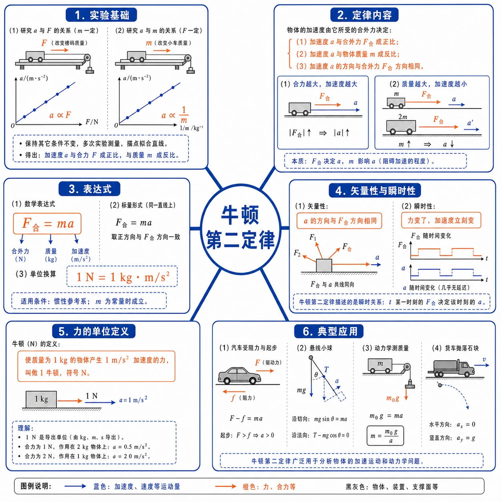
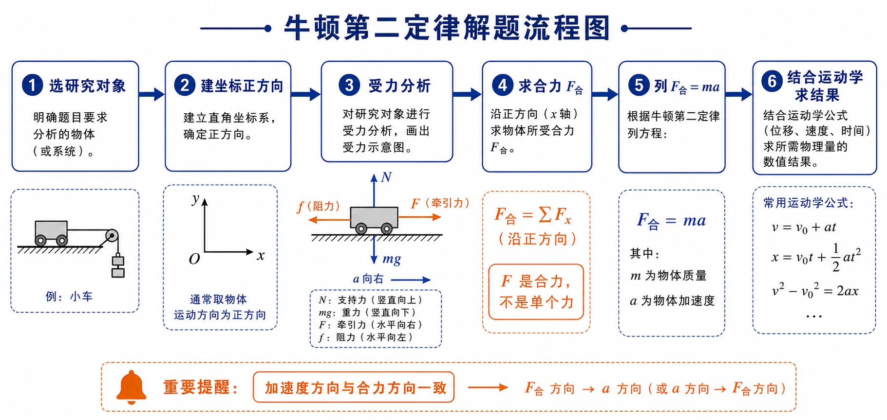
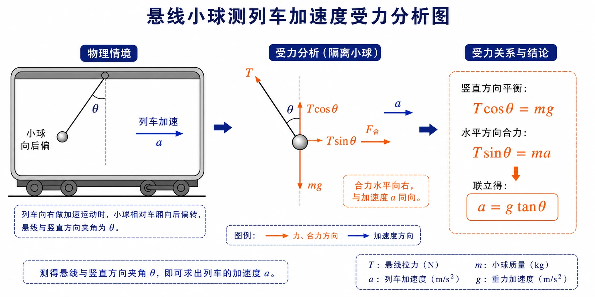

## 相关知识

[[4.1 牛顿第一定律]]
[[4.2 实验：探究加速度与力、质量的关系]]
[[4.4 力学单位制]]
[[4.5 牛顿运动定律的应用]]
[[4.6 超重和失重]]
[[第四章 运动和力的关系 复习与提高]]
[[第四章 运动和力的关系 学习导图]]

# 4.3 牛顿第二定律

<!-- 图片描述：本节整体知识信息结构图。中心主题为“牛顿第二定律”，向外分为六个分支：实验基础（$a\propto F$、$a\propto\frac{1}{m}$，多次实验拟合直线）、定律内容（加速度与合力成正比、与质量成反比、方向与合力同向）、表达式（$F_{\text{合}}=ma$、$1\ \text{N}=1\ \text{kg}\cdot\text{m/s}^2$）、矢量性与瞬时性（加速度方向与合力方向一致、力变加速度变）、力的单位定义（$1\ \text{N}$ 使 $1\ \text{kg}$ 物体产生 $1\ \text{m/s}^2$ 加速度）、典型应用（汽车阻力与起步、悬线小球、动力学测质量、货车石块）。白色或浅网格背景，黑灰坐标轴和物体轮廓，蓝色表示运动量，橙色表示力、合力与关键结论。 -->

## 本节学习目标

学完本节，需要能做到：

- 理解牛顿第二定律是从大量实验事实推广出的一般规律。
- 准确表述牛顿第二定律，写出表达式 $F_{\text{合}}=ma$。
- 知道式中的 $F$ 指物体所受合力，不是某个单独的力。
- 理解加速度方向与合力方向相同，知道定律的矢量性和瞬时性。
- 知道 $1\ \text{N}=1\ \text{kg}\cdot\text{m/s}^2$ 的来源。
- 会用牛顿第二定律分析汽车阻力与起步、悬线小球、动力学测质量等问题。
- 能按“选对象—建坐标—受力分析—求合力—列方程—检查”的流程解题。

## 核心知识点讲解

### 一、知识对象与物理情境

上节实验已经发现：小车加速度 $a$ 与所受拉力 $F$ 成正比，与小车质量 $m$ 成反比。本节要回答的问题是：这个结论是否适用于任何物体？

赛车质量小、动力大，容易获得较大加速度；货车质量大，相同牵引力下加速度小。这些生活现象都和加速度—力—质量三者关系有关。如果多次实验数据都拟合为过原点的直线，并且由这个关系推出的新结论也与事实一致，那么这个规律就可以上升为定律。

### 二、核心概念与定义

#### 1. 牛顿第二定律的内容

物体加速度的大小跟它受到的作用力成正比，跟它的质量成反比，加速度的方向跟作用力的方向相同。

注意三点：

- 式中 $F$ 指物体所受**合力**，不是某一个单独的力。
- 加速度方向与合力方向相同，不一定与速度方向相同。
- 加速度和合力是瞬时对应关系：合力变化，加速度同时变化；合力为零，加速度同时为零。

#### 2. 力的单位

牛顿第二定律可写成：

$$
F=kma
$$

其中 $k$ 是比例系数，数值取决于 $F$、$m$、$a$ 单位的选取。

在国际单位制中，质量的单位取千克（$\text{kg}$），加速度的单位取米每二次方秒（$\text{m/s}^2$），并规定：

> 使质量为 $1\ \text{kg}$ 的物体产生 $1\ \text{m/s}^2$ 加速度的力，称为 $1\ \text{N}$。

这样就有：

$$
1\ \text{N}=1\ \text{kg}\cdot\text{m/s}^2
$$

此时比例系数 $k=1$，牛顿第二定律简化为：

$$
F=ma
$$

#### 3. 质量的进一步理解

质量不仅是物体所含物质的多少，还可以从惯性角度理解：在确定的作用力下，质量越大，物体运动状态变化越慢，加速度越小。所以质量是物体惯性大小的量度。

### 三、关键规律、公式与适用条件

牛顿第二定律可写作：

$$
a\propto\frac{F_{\text{合}}}{m}
$$

在国际单位制中：

$$
F_{\text{合}}=ma
$$

各量含义：

| 符号 | 物理意义 | 单位 | 方向属性 |
| --- | --- | --- | --- |
| $F_{\text{合}}$ | 物体所受合力 | $\text{N}$ | 矢量 |
| $m$ | 物体质量 | $\text{kg}$ | 标量 |
| $a$ | 物体加速度 | $\text{m/s}^2$ | 矢量，方向与合力同向 |

适用条件：

- 牛顿第二定律只在惯性参考系中成立。
- 公式描述的是合力与加速度的瞬时对应关系。
- 当物体受到多个力时，必须先求合力，再代入公式。

### 四、典型模型与过程分析

使用牛顿第二定律解题的一般步骤：

1. 选研究对象。
2. 明确运动方向，建立坐标正方向。
3. 对研究对象进行受力分析。
4. 求合力（或在坐标轴方向分别求合力）。
5. 根据 $F_{\text{合}}=ma$ 列方程。
6. 检查单位、方向和结果是否合理。

<!-- 图片描述：牛顿第二定律解题流程图。流程框依次连接“选研究对象”→“建坐标正方向”→“受力分析”→“求合力 $F_{\text{合}}$”→“列 $F_{\text{合}}=ma$”→“结合运动学求结果”。在“受力分析”旁画小车受牵引力和阻力示意，在“求合力”旁用橙色标注“$F$ 是合力，不是单个力”。底部提醒“加速度方向与合力方向一致”。白色或浅网格背景，蓝色表示运动量，橙色表示力。 -->

常见模型：

| 模型 | 受力特点 | 解法要点 |
| --- | --- | --- |
| 水平面匀加速 | 牵引力、阻力、重力、支持力 | 水平方向 $F_{\text{合}}=ma$ |
| 取消动力滑行 | 只受阻力（含重力、支持力平衡） | 用运动学求 $a$，再求阻力 |
| 多力互成角度 | 用平行四边形或正交分解 | 先求合力，再求 $a$ |
| 悬线小球加速 | 重力、绳拉力，合力水平 | 分解拉力，列两个方向方程 |
| 太空测质量 | 已知拉力，测加速度 | $m=F/a$ |

### 五、图像、实验与数据理解

#### 1. $a-F$ 图像和定律的可信度

多次实验得到的 $a-F$ 数据点都会有偏差。但如果每次实验的数据都能拟合成直线，并且这些直线与坐标轴的交点都十分接近原点，那么实际规律很可能就是 $a\propto F$。

科学定律不是一次实验的简单总结。只有当由实验结论推出的新结果都与事实一致时，结论才能上升为定律。所以科学前辈在根据有限实验事实宣布某定律时，既需要谨慎，也需要勇气。

#### 2. 悬线小球受力图

列车加速时，车厢顶部悬挂的小球会向后偏一定角度并相对车厢保持静止。此时小球具有与列车相同的水平加速度。

设悬线与竖直方向夹角为 $\theta$，小球质量为 $m$。重力 $mg$ 竖直向下，绳拉力 $T$ 沿绳方向。把拉力分解：

- 竖直方向：$T\cos\theta=mg$
- 水平方向：$T\sin\theta=ma$

两式相除得：

$$
a=g\tan\theta
$$

<!-- 图片描述：悬线小球测列车加速度受力分析图。画车厢顶部悬挂的小球，悬线与竖直方向夹角 $\theta$。小球受重力 $mg$ 竖直向下、绳拉力 $T$ 沿绳方向。把拉力分解为水平分量 $T\sin\theta$ 和竖直分量 $T\cos\theta$，用橙色标注合力水平指向右侧，与加速度 $a$ 同向。右侧给出关系：$T\cos\theta=mg$、$T\sin\theta=ma$，推出 $a=g\tan\theta$。白色背景，蓝色表示加速度，橙色表示力和合力。 -->

#### 3. 动力学方法测质量

在太空失重环境中，天平无法测质量。根据牛顿第二定律 $F=ma$，给物体施加已知恒力 $F$，测出加速度 $a$，就可以求出质量：

$$
m=\frac{F}{a}
$$

中国航天员曾在中国空间站的天宫课堂中演示过这种方法：用质量测量仪产生恒定拉力，用光栅测速装置测出复位速度和时间，从而计算加速度和质量。

### 六、题型应用与迁移

本节题型可分四类：

| 题型 | 关键思路 |
| --- | --- |
| 已知力求加速度 | 先求合力，再代入 $a=F_{\text{合}}/m$ |
| 已知运动求力 | 先用运动学公式求 $a$，再求 $F_{\text{合}}$ 或未知力 |
| 多力共同作用 | 用平行四边形定则或正交分解求合力 |
| 同一加速度系统（悬线小球、货车石块） | 各部分加速度相同，逐个分析受力 |

## 重点梳理

### 重点 1：$F_{\text{合}}=ma$ 中 $F$ 是合力

不能把牵引力、拉力、重力等单个力直接代入。如果物体同时受到多个力，必须先求合力。

### 重点 2：加速度方向与合力方向相同

加速度方向由合力方向决定，不由速度方向决定。合力与速度同向时加速，反向时减速，成角度时速度方向改变。

### 重点 3：合力为零时加速度为零

物体所受合力为零时，加速度为零，物体保持静止或匀速直线运动。这就是牛顿第一定律描述的状态。

### 重点 4：$1\ \text{N}$ 的定义

使 $1\ \text{kg}$ 物体产生 $1\ \text{m/s}^2$ 加速度的力，定义为 $1\ \text{N}$，所以：

$$
1\ \text{N}=1\ \text{kg}\cdot\text{m/s}^2
$$

### 重点 5：质量是惯性大小的量度

在相同合力下，质量越大，加速度越小，运动状态越难改变，惯性越大。

## 难点突破

### 难点 1：很小的力一定能产生加速度吗

如果这个力不是合力，就不一定。用力提很重的箱子却提不动，是因为箱子还受到重力、支持力等作用，最终合力仍为零。牛顿第二定律中的 $F$ 是合力。

### 难点 2：为什么加速度方向与速度方向不一定相同

速度描述物体当前怎样运动，加速度描述速度怎样改变。合力与速度同向时物体加速，反向时减速，成角度时速度方向改变。

### 难点 3：为什么定律建立需要谨慎

单次实验有误差。只有大量实验和观察事实都支持 $a\propto F$、$a\propto\dfrac{1}{m}$，并且由此推出的新结论也与事实一致，结论才能成为定律。

### 难点 4：悬线小球为什么用 $a=g\tan\theta$

小球与列车保持相对静止，所以小球的加速度与列车相同，方向水平。小球受重力和绳拉力，合力方向水平。把拉力沿水平和竖直方向分解，竖直分量平衡重力，水平分量产生加速度，联立得到 $a=g\tan\theta$。

### 难点 5：货车加速时石块周围对石块的合力

装满石块的货车加速前进时，石块随车一起加速。把石块看作研究对象，它受到周围接触物对它的作用力，这些力的合力提供加速度，因此合力大小为 $ma$，方向与货车加速度方向相同。

## 例题讲解

### 例题 1：汽车阻力和起步加速度

**题目**：质量为 $1100\ \text{kg}$ 的汽车在平直路面上测试。当速度达到 $100\ \text{km/h}$ 时取消动力，经过 $70\ \text{s}$ 停下。汽车受到的阻力是多少？重新起步加速时牵引力为 $2000\ \text{N}$，产生的加速度是多少？假设阻力不变。

**分析**：取消动力后，汽车水平方向只受阻力。重新起步后，汽车受牵引力和阻力。取汽车运动方向为 $x$ 轴正方向。

**步骤**：

取消动力后：

$$
v_0=100\ \text{km/h}=27.8\ \text{m/s}
$$

$$
a_1=\frac{0-v_0}{t}=\frac{-27.8}{70}\approx-0.397\ \text{m/s}^2
$$

阻力：

$$
F_{\text{阻}}=ma_1=1100\times(-0.397)\approx-437\ \text{N}
$$

阻力大小约 $437\ \text{N}$，方向与运动方向相反。

重新起步后合力：

$$
F_{\text{合}}=F_{\text{牵}}+F_{\text{阻}}=2000-437=1563\ \text{N}
$$

加速度：

$$
a_2=\frac{F_{\text{合}}}{m}=\frac{1563}{1100}\approx1.42\ \text{m/s}^2
$$

**答案**：汽车受到的阻力大小约 $437\ \text{N}$，方向与运动方向相反；重新起步加速度约 $1.42\ \text{m/s}^2$，方向与运动方向相同。

**反思**：取消动力不是“没有力”，而是水平方向只剩阻力；阻力方向与运动方向相反，所以代入符号后为负值。

### 例题 2：悬线小球测列车加速度

**题目**：列车启动时，车厢顶部用细线悬挂的小球偏过一定角度并相对车厢静止。若悬线与竖直方向夹角为 $\theta$，求列车加速度。

**分析**：小球与列车保持相对静止，加速度与列车相同，方向水平。

**方法一 合成法**：小球受重力 $G=mg$ 和拉力 $T$，二者合力方向水平。

$$
F_{\text{合}}=G\tan\theta=mg\tan\theta
$$

由牛顿第二定律：

$$
a=\frac{F_{\text{合}}}{m}=g\tan\theta
$$

**方法二 正交分解法**：建立水平、竖直坐标。把拉力 $T$ 分解：

$$
T\cos\theta=mg
$$

$$
T\sin\theta=ma
$$

两式相除：

$$
a=g\tan\theta
$$

**答案**：列车加速度大小为 $g\tan\theta$，方向水平向前。

### 例题 3：手推车撤去推力后的加速度

**题目**：平直路面上质量为 $30\ \text{kg}$ 的手推车，在受到 $60\ \text{N}$ 水平推力时做加速度为 $1.5\ \text{m/s}^2$ 的匀加速直线运动。如果撤去推力，车的加速度大小和方向如何？

**分析**：先由推力作用下的运动情况求阻力，再求撤去推力后的加速度。

**步骤**：

推力作用时：

$$
F_{\text{合}}=ma=30\times1.5=45\ \text{N}
$$

设阻力为 $F_{\text{阻}}$，则：

$$
F_{\text{合}}=F_{\text{推}}-F_{\text{阻}}
$$

$$
45=60-F_{\text{阻}}
$$

$$
F_{\text{阻}}=15\ \text{N}
$$

撤去推力后，水平方向只受阻力：

$$
a'=\frac{F_{\text{阻}}}{m}=\frac{15}{30}=0.5\ \text{m/s}^2
$$

**答案**：撤去推力后，车的加速度大小为 $0.5\ \text{m/s}^2$，方向与运动方向相反。

### 例题 4：互成角度两力的加速度

**题目**：光滑水平桌面上有一个质量为 $2\ \text{kg}$ 的物体，在水平方向受到两个互成 $90^\circ$、大小均为 $14\ \text{N}$ 的力。求物体加速度的大小和方向。

**分析**：两力垂直，用勾股定理求合力。

**步骤**：

$$
F_{\text{合}}=\sqrt{14^2+14^2}=14\sqrt2\ \text{N}
$$

$$
a=\frac{F_{\text{合}}}{m}=\frac{14\sqrt2}{2}=7\sqrt2\ \text{m/s}^2
$$

方向沿两力夹角的角平分线。

**答案**：加速度大小为 $7\sqrt2\ \text{m/s}^2$（约 $9.9\ \text{m/s}^2$），方向沿两力夹角的角平分线。

## 易错点整理

### 易错点 1：把单个力当作合力

**常见错误表现**：直接用牵引力或推力代入 $F=ma$。

**错因分析**：忽略其他力，特别是阻力和摩擦力。

**正确处理**：先做受力分析，求合力，再代入公式。

### 易错点 2：不规定正方向

**常见错误表现**：列方程时正负号混乱。

**错因分析**：没有建立坐标和正方向。

**正确处理**：每次列方程前先规定正方向，与正方向同向取正，反向取负。

### 易错点 3：忘记单位换算

**常见错误表现**：把 $100\ \text{km/h}$ 直接代入公式。

**错因分析**：速度、力、质量单位不统一。

**正确处理**：把速度换算为 $\text{m/s}$。例如 $100\ \text{km/h}\approx27.8\ \text{m/s}$。

### 易错点 4：认为速度方向就是加速度方向

**常见错误表现**：物体减速时仍把加速度方向画成与速度同向。

**错因分析**：把加速度和速度混淆。

**正确处理**：加速度方向与合力方向相同。减速时合力与速度反向，加速度也与速度反向。

### 易错点 5：悬线小球当作平衡状态

**常见错误表现**：认为小球静止，合力为零。

**错因分析**：小球相对车厢静止，但相对地面有水平加速度。

**正确处理**：小球与列车有相同加速度，合力水平，大小为 $ma$。

## 考点考证点整理

### 考点一：牛顿第二定律内容

- 出题思路：直接考定律表述或给实验结论要求写公式。
- 关键条件：合力、质量、加速度、方向。
- 解答要点：写出 $F_{\text{合}}=ma$，说明加速度方向与合力方向相同。
- 易扣分点：把 $F$ 写成某一个力，没有说明合力。

### 考点二：由运动求受力

- 出题思路：给速度、时间、位移等运动量，先求加速度，再求力。
- 关键条件：初末速度、时间、质量、正方向。
- 解答要点：先用运动学公式求 $a$，再用 $F_{\text{合}}=ma$ 求合力或未知力。
- 易扣分点：未统一单位，或漏写力的方向。

### 考点三：多个力的合力

- 出题思路：给水平面、斜面或互成角度的力，要求求加速度。
- 关键条件：各力方向、夹角、是否光滑、是否有阻力。
- 解答要点：先作受力分析并求合力，再代入牛顿第二定律。
- 易扣分点：把两个力大小直接相加，忽略方向。

### 考点四：悬线小球与动力学测量

- 出题思路：利用偏角、已知力和加速度测未知量。
- 关键条件：小球相对车厢静止、合力水平、加速度相同。
- 解答要点：分解拉力，列 $T\cos\theta=mg$ 和 $T\sin\theta=ma$。
- 易扣分点：把小球当作平衡状态，漏掉水平加速度。

### 考点五：力的单位与质量理解

- 出题思路：考 $1\ \text{N}$ 的定义、质量是惯性量度。
- 关键条件：国际单位制中 $1\ \text{N}=1\ \text{kg}\cdot\text{m/s}^2$。
- 解答要点：使 $1\ \text{kg}$ 物体产生 $1\ \text{m/s}^2$ 加速度的力为 $1\ \text{N}$。
- 易扣分点：把 $1\ \text{N}$ 写成 $1\ \text{kg}\cdot\text{m/s}$。

## 练习题

### 基础训练

1. 写出牛顿第二定律的内容和表达式。式中 $F$ 指什么？
2. $1\ \text{N}$ 是怎样定义的？写出 $1\ \text{N}$ 与 $\text{kg}$、$\text{m/s}^2$ 的关系。
3. 物体所受合力为 $6\ \text{N}$，质量为 $2\ \text{kg}$，加速度多大？方向怎样确定？
4. 为什么说质量是物体惯性大小的量度？
5. 物体所受合力为零时，它的运动状态怎样？

### 巩固训练

6. 从牛顿第二定律知道，无论怎样小的力都可以使物体产生加速度。可是用力提一个很重的箱子却提不动。这跟牛顿第二定律是否矛盾？怎样解释？
7. 甲、乙两辆小车放在水平桌面上，在相同拉力作用下，甲车加速度为 $1.5\ \text{m/s}^2$，乙车加速度为 $4.5\ \text{m/s}^2$。若不考虑阻力，甲车质量是乙车的几倍？
8. 一个物体受到的合力为 $4\ \text{N}$ 时，产生加速度 $2\ \text{m/s}^2$。若该物体加速度变为 $6\ \text{m/s}^2$，它受到的合力是多大？
9. 光滑水平桌面上有一个质量为 $2\ \text{kg}$ 的物体，在水平方向受到两个互成 $90^\circ$、大小均为 $14\ \text{N}$ 的力。求物体加速度的大小和方向。
10. 平直路面上质量为 $30\ \text{kg}$ 的手推车，受到 $60\ \text{N}$ 水平推力时做加速度为 $1.5\ \text{m/s}^2$ 的匀加速直线运动。撤去推力后，车的加速度大小和方向如何？

### 提升训练

11. 质量为 $1100\ \text{kg}$ 的汽车在平直路面上测试。当速度达到 $100\ \text{km/h}$ 时取消动力，经过 $70\ \text{s}$ 停下。汽车受到的阻力是多少？重新起步加速时牵引力为 $2000\ \text{N}$，产生的加速度是多少？假设阻力不变。
12. 列车启动时，车厢顶部用细线悬挂的小球偏过一定角度并相对车厢静止。若悬线与竖直方向夹角为 $\theta$，求列车加速度。
13. 一辆装满石块的货车在平直道路上以加速度 $a$ 向前加速运动。货箱中石块 $B$ 的质量为 $m$。求石块 $B$ 周围与它接触的物体对石块 $B$ 作用力的合力。
14. 在太空失重环境中，如何用牛顿第二定律测量物体质量？写出测量原理。

## 练习题答案

### 基础训练答案

1. 物体加速度的大小跟它受到的合力成正比，跟它的质量成反比，加速度的方向跟合力方向相同。表达式：

$$
F_{\text{合}}=ma
$$

式中 $F$ 指物体所受合力。

2. 使质量为 $1\ \text{kg}$ 的物体产生 $1\ \text{m/s}^2$ 加速度的力，定义为 $1\ \text{N}$。所以：

$$
1\ \text{N}=1\ \text{kg}\cdot\text{m/s}^2
$$

3. 加速度：

$$
a=\frac{F_{\text{合}}}{m}=\frac{6}{2}=3\ \text{m/s}^2
$$

方向与合力方向相同。

4. 在相同合力作用下，质量越大的物体加速度越小，运动状态越难改变，惯性越大。所以质量是物体惯性大小的量度。

5. 合力为零时加速度为零，物体保持静止或匀速直线运动状态。

### 巩固训练答案

6. 不矛盾。很小的力能使物体产生加速度的前提是这个力是合力。提箱子时，箱子还受到重力和支持力等作用，这些力的合力仍为零，所以箱子不动。

7. 相同拉力下 $a\propto\dfrac{1}{m}$，所以：

$$
\frac{m_{\text{甲}}}{m_{\text{乙}}}=\frac{a_{\text{乙}}}{a_{\text{甲}}}=\frac{4.5}{1.5}=3
$$

甲车质量是乙车的 $3$ 倍。

8. 先求质量：

$$
m=\frac{F}{a}=\frac{4}{2}=2\ \text{kg}
$$

再求新合力：

$$
F'=ma'=2\times6=12\ \text{N}
$$

9. 两力垂直，合力：

$$
F_{\text{合}}=\sqrt{14^2+14^2}=14\sqrt2\ \text{N}
$$

加速度：

$$
a=\frac{F_{\text{合}}}{m}=\frac{14\sqrt2}{2}=7\sqrt2\ \text{m/s}^2
$$

方向沿两力夹角的角平分线。

10. 推力作用时：

$$
F_{\text{合}}=ma=30\times1.5=45\ \text{N}
$$

阻力：

$$
F_{\text{阻}}=F_{\text{推}}-F_{\text{合}}=60-45=15\ \text{N}
$$

撤去推力后：

$$
a'=\frac{F_{\text{阻}}}{m}=\frac{15}{30}=0.5\ \text{m/s}^2
$$

方向与运动方向相反。

### 提升训练答案

11. 取汽车运动方向为正方向：

$$
v_0=100\ \text{km/h}\approx27.8\ \text{m/s}
$$

取消动力后：

$$
a_1=\frac{0-27.8}{70}\approx-0.397\ \text{m/s}^2
$$

阻力：

$$
F_{\text{阻}}=ma_1=1100\times(-0.397)\approx-437\ \text{N}
$$

阻力大小约 $437\ \text{N}$，方向与运动方向相反。

重新起步后合力：

$$
F_{\text{合}}=F_{\text{牵}}-F_{\text{阻}}=2000-437=1563\ \text{N}
$$

加速度：

$$
a_2=\frac{1563}{1100}\approx1.42\ \text{m/s}^2
$$

12. 小球与列车保持相对静止，加速度与列车相同。设小球质量为 $m$，悬线与竖直方向夹角为 $\theta$。

把拉力 $T$ 分解：

$$
T\cos\theta=mg
$$

$$
T\sin\theta=ma
$$

两式相除：

$$
a=g\tan\theta
$$

列车加速度大小为 $g\tan\theta$，方向水平向前。

13. 石块 $B$ 随货车一起以加速度 $a$ 向前加速。把石块 $B$ 作为研究对象，它受到周围接触物对它的作用力的合力提供加速度，因此合力大小为 $ma$，方向与货车加速度方向相同。

14. 在太空中物体完全失重，天平无法使用。根据 $F=ma$，给物体施加已知恒力 $F$，测出物体在该力作用下的加速度 $a$，就可以求出质量：

$$
m=\frac{F}{a}
$$

例如用恒定拉力装置产生已知力 $F$，用测速装置测出物体速度随时间的变化求出 $a$，再代入公式求质量。
