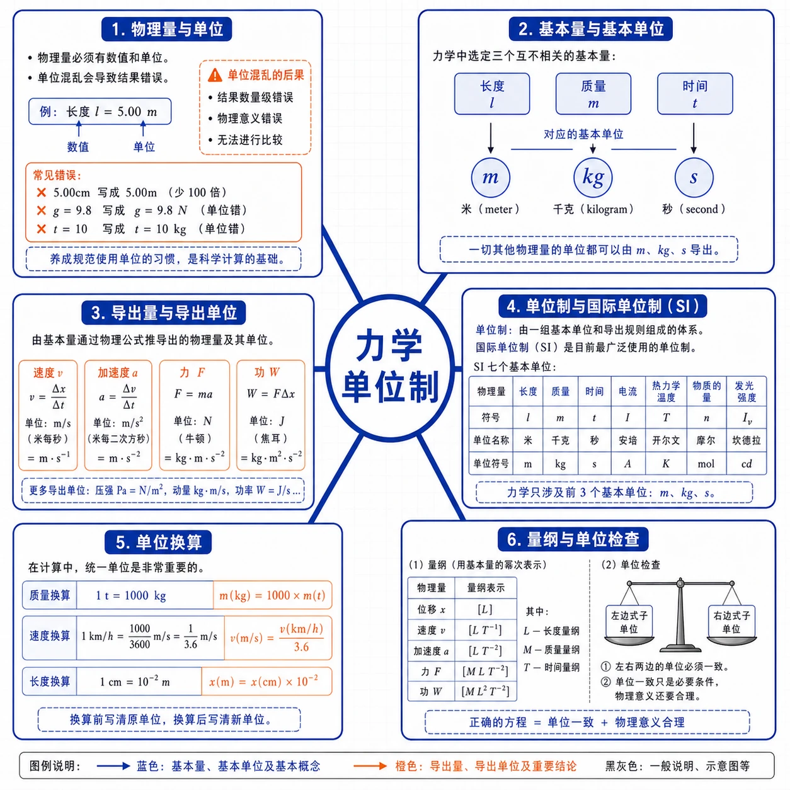
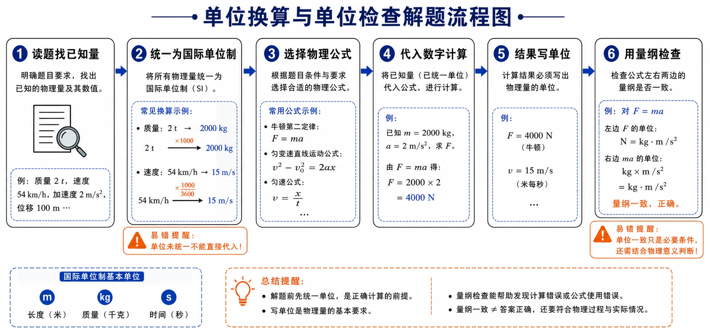
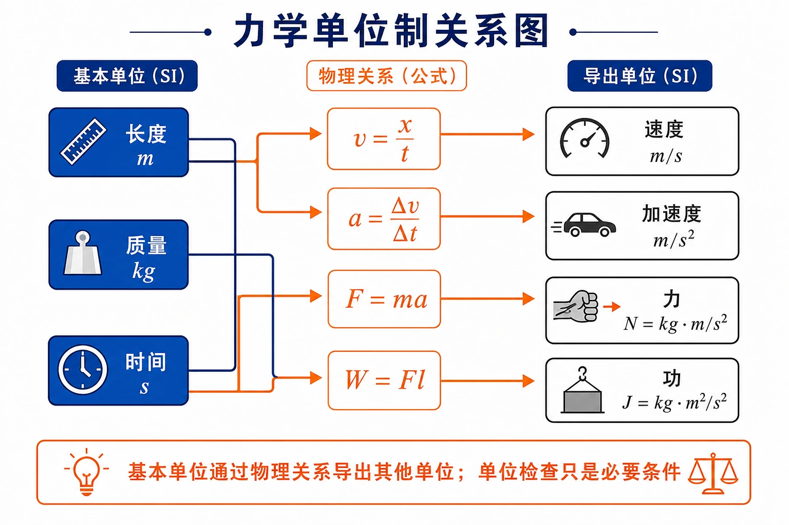

## 相关知识

[[4.1 牛顿第一定律]]
[[4.2 实验：探究加速度与力、质量的关系]]
[[4.3 牛顿第二定律]]
[[4.5 牛顿运动定律的应用]]
[[4.6 超重和失重]]
[[第四章 运动和力的关系 复习与提高]]
[[第四章 运动和力的关系 学习导图]]

# 4.4 力学单位制

<!-- 图片描述：本节整体知识信息结构图。中心主题为“力学单位制”，向外分为六个分支：物理量与单位（数值加单位，单位混乱导致错误）、基本量与基本单位（力学选长度、质量、时间；对应 m、kg、s）、导出量与导出单位（由公式推出 m/s、m/s²、N、J 等）、单位制与国际单位制（SI，七个基本单位）、单位换算（t→kg、km/h→m/s、cm→m）、量纲与单位检查（左右两边单位必须一致，单位一致只是必要条件）。白色或浅网格背景，黑灰框线和坐标轴，蓝色表示基本单位，橙色表示导出单位和关键公式。 -->

## 本节学习目标

学完本节，需要能做到：

- 理解物理量由数值和单位共同表示，单位混乱会导致结果错误。
- 知道基本量、基本单位、导出量、导出单位和单位制的含义。
- 知道国际单位制（SI）的基本思想，掌握力学中的三个基本单位 $\text{m}$、$\text{kg}$、$\text{s}$。
- 了解国际单位制的七个基本量和基本单位。
- 会由物理公式推导速度、加速度、力、功等导出单位与基本单位的关系。
- 会在动力学计算前统一单位，并用单位（量纲）检查公式是否可能正确。

## 核心知识点讲解

### 一、知识对象与物理情境

计量大象质量常用吨（$\text{t}$），计量人的质量却用千克（$\text{kg}$）；自由落体加速度 $g$ 的单位可写作 $\text{m/s}^2$，也可写作 $\text{N/kg}$。这些现象说明：同一个物理量可以用不同单位表示，但如果单位混乱，计算结果就会出错。物理学必须建立统一的单位制。

本节要解决的问题是：物理量的单位有什么规则？哪些单位是最基础的？怎样用基本单位导出其他单位？

### 二、核心概念与定义

#### 1. 基本量和基本单位

在物理学中，只要选定几个物理量的单位，就能利用物理量之间的关系推导出其他物理量的单位。这些被选定的物理量叫作基本量，它们相应的单位叫作基本单位。

力学范围内，规定长度、质量、时间为三个基本量，对应的基本单位是米（$\text{m}$）、千克（$\text{kg}$）、秒（$\text{s}$）。

#### 2. 导出量和导出单位

由基本量根据物理关系推导出来的其他物理量叫作导出量，推导出来的相应单位叫作导出单位。

例如，由位移和时间推出速度，速度是导出量，单位 $\text{m/s}$ 是导出单位；由牛顿第二定律推出力，力是导出量，单位 $\text{N}$ 是导出单位。

#### 3. 单位制和国际单位制

基本单位和导出单位一起组成一个单位制。

不同地区使用不同单位制，会带来不便。1960 年第 11 届国际计量大会制订了一种国际通用的、包括一切计量领域的单位制，叫作国际单位制（法文 Le Système International d'Unités），简称 SI。

国际单位制共有七个基本量和基本单位。力学范围内只用前三个；热学、电磁学、光学等学科还要再加上另外四个基本量和基本单位，才能导出其他物理量的单位。

| 物理量 | 符号 | 单位名称 | 单位符号 |
| --- | --- | --- | --- |
| 长度 | $l$ | 米 | $\text{m}$ |
| 质量 | $m$ | 千克 | $\text{kg}$ |
| 时间 | $t$ | 秒 | $\text{s}$ |
| 电流 | $I$ | 安[培] | $\text{A}$ |
| 热力学温度 | $T$ | 开[尔文] | $\text{K}$ |
| 物质的量 | $n$ | 摩[尔] | $\text{mol}$ |
| 发光强度 | $I_v$ | 坎[德拉] | $\text{cd}$ |

### 三、关键规律、公式与适用条件

#### 1. 由公式推出导出单位

物理公式既确定物理量之间的关系，也确定物理量单位之间的关系。

由 $v=\dfrac{\Delta x}{\Delta t}$：若 $\Delta x$ 用 $\text{m}$，$\Delta t$ 用 $\text{s}$，速度单位为：

$$
\text{m/s}
$$

由 $a=\dfrac{\Delta v}{\Delta t}$：加速度单位为：

$$
\frac{\text{m/s}}{\text{s}}=\text{m/s}^2
$$

由牛顿第二定律 $F=ma$：力的单位为：

$$
\text{N}=\text{kg}\cdot\text{m/s}^2
$$

由功 $W=Fl$：功的单位为：

$$
\text{J}=\text{N}\cdot\text{m}=\text{kg}\cdot\text{m}^2/\text{s}^2
$$

#### 2. $1\ \text{N}$ 的定义

使质量为 $1\ \text{kg}$ 的物体产生 $1\ \text{m/s}^2$ 加速度的力，规定为 $1\ \text{N}$：

$$
1\ \text{N}=1\ \text{kg}\cdot\text{m/s}^2
$$

#### 3. $g$ 的两种单位写法等价

由 $G=mg$，$g$ 可写成 $\text{N/kg}$；由 $F=ma$ 又有：

$$
1\ \text{N/kg}=1\ \text{m/s}^2
$$

所以 $g=9.8\ \text{N/kg}=9.8\ \text{m/s}^2$。

#### 4. 统一单位后可在数字计算中省略单位

题中已知量的单位都用国际单位制表示时，计算结果也是国际单位制。在统一单位后，数字计算过程中可以不写各量后面的单位，只在结果后写出正确单位。

但前提是：所有已知量都已经统一为国际单位制。

### 四、典型模型与过程分析

#### 1. 单位换算流程

动力学计算中常见的单位换算：

| 原单位 | 目标单位 | 换算关系 |
| --- | --- | --- |
| $\text{t}$ | $\text{kg}$ | $1\ \text{t}=1000\ \text{kg}$ |
| $\text{g}$ | $\text{kg}$ | $1\ \text{g}=10^{-3}\ \text{kg}$ |
| $\text{cm}$ | $\text{m}$ | $1\ \text{cm}=10^{-2}\ \text{m}$ |
| $\text{km/h}$ | $\text{m/s}$ | $1\ \text{km/h}=\dfrac{1}{3.6}\ \text{m/s}$ |
| $\text{km}$ | $\text{m}$ | $1\ \text{km}=1000\ \text{m}$ |

常用速度换算：$36\ \text{km/h}=10\ \text{m/s}$，$54\ \text{km/h}=15\ \text{m/s}$，$72\ \text{km/h}=20\ \text{m/s}$。

#### 2. 单位检查法

给一个字母公式，判断是否可能正确：

1. 写出每个物理量的单位。
2. 按公式进行单位乘除和幂运算。
3. 看左右两边单位是否一致。
4. 单位不一致一定错误；单位一致只是必要条件，公式是否正确还要看物理关系。

<!-- 图片描述：单位换算与单位检查解题流程图。画一条从左到右的物理计算流程：读题找已知量 → 统一为国际单位制（如 $2\ \text{t}\to2000\ \text{kg}$、$54\ \text{km/h}\to15\ \text{m/s}$）→ 选择物理公式（如 $F=ma$、$v^2-v_0^2=2ax$）→ 代入数字计算 → 结果写单位 → 用量纲检查左右两边是否一致。每一步用黑灰流程框表示，蓝色标出基本单位 $\text{m}$、$\text{kg}$、$\text{s}$，橙色标出易错提醒“单位未统一不能直接代入”“单位一致只是必要条件”。白色或浅网格背景，物理学习流程图风格。 -->

<!-- 图片描述：力学单位制关系图。左侧三个蓝色基础节点为“长度 $\text{m}$”“质量 $\text{kg}$”“时间 $\text{s}$”，用橙色箭头指向右侧的导出单位：速度 $\text{m/s}$、加速度 $\text{m/s}^2$、力 $\text{N}=\text{kg}\cdot\text{m/s}^2$、功 $\text{J}=\text{kg}\cdot\text{m}^2/\text{s}^2$。每个箭头上标出对应的物理公式 $v=x/t$、$a=\Delta v/\Delta t$、$F=ma$、$W=Fl$。底部橙色提示框写“基本单位通过物理关系导出其他单位；单位检查只是必要条件”。白色背景，黑灰框线。 -->

### 五、图像、实验与数据理解

#### 1. 用圆锥体积公式理解单位检查

圆锥体积公式应是 $V=\dfrac{1}{3}\pi R^2h$。若误写成 $V=\dfrac{1}{3}\pi R^3h$，从单位上看：

$$
R^3h\rightarrow\text{m}^3\cdot\text{m}=\text{m}^4
$$

体积单位应为 $\text{m}^3$，因此 $V=\dfrac{1}{3}\pi R^3h$ 不可能是正确的体积公式。这就是用单位（量纲）检查公式的典型例子。

#### 2. 基本单位的现代定义

国际单位制的七个基本单位现在都建立在不变的自然常数基础上：

- 秒：铯-133 原子基态两个超精细能级之间跃迁辐射的 $9\,192\,631\,770$ 个周期持续时间。
- 米：光在真空中 $\dfrac{1}{299\,792\,458}\ \text{s}$ 时间间隔内所经路径的长度。
- 千克：2019 年起由普朗克常量 $h$ 及米、秒定义。

这样规定保证了 SI 单位的长期稳定性和通用性。

### 六、题型应用与迁移

本节题型主要有两类：

| 题型 | 方法 |
| --- | --- |
| 动力学计算题 | 先把所有已知量化为国际单位，再代入公式，最后写出结果单位 |
| 公式判断题 | 用单位（量纲）检查左右两边是否一致 |

## 重点梳理

### 重点 1：力学三个基本量和基本单位

| 基本量 | 基本单位 |
| --- | --- |
| 长度 | 米（$\text{m}$） |
| 质量 | 千克（$\text{kg}$） |
| 时间 | 秒（$\text{s}$） |

注意：$\text{N}$、$\text{J}$ 都是导出单位，不是基本单位。

### 重点 2：常见导出单位与基本单位的关系

$$
\text{N}=\text{kg}\cdot\text{m/s}^2
$$

$$
\text{J}=\text{N}\cdot\text{m}=\text{kg}\cdot\text{m}^2/\text{s}^2
$$

### 重点 3：计算前先统一单位

国际单位制下用 $F=ma$ 时，质量必须用 $\text{kg}$，不能直接代入 $\text{g}$ 或 $\text{t}$。速度必须用 $\text{m/s}$，不能用 $\text{km/h}$。

### 重点 4：单位检查是必要条件

单位一致不能保证公式正确，但单位不一致公式一定错误。

## 难点突破

### 难点 1：为什么 $\text{N/kg}$ 和 $\text{m/s}^2$ 等价

由 $1\ \text{N}=1\ \text{kg}\cdot\text{m/s}^2$：

$$
1\ \text{N/kg}=\frac{1\ \text{kg}\cdot\text{m/s}^2}{\text{kg}}=1\ \text{m/s}^2
$$

所以重力加速度 $g$ 既可写作 $9.8\ \text{N/kg}$，也可写作 $9.8\ \text{m/s}^2$。

### 难点 2：计算时为什么可以省略单位

只有当所有已知量都已统一为国际单位制后，数字计算过程中才可暂时省略单位，并在结果后写出正确单位。若单位未统一就省略，结果会出错。

### 难点 3：单位检查能证明公式正确吗

不能。单位一致只是必要条件。例如某公式两边单位都是 $\text{m/s}$，也不一定就是正确的速度公式，还要看物理关系是否成立。

### 难点 4：为什么 $\text{N}$ 不是基本单位

力是通过牛顿第二定律 $F=ma$ 由质量、长度、时间推导出来的，所以 $\text{N}$ 是导出单位。力学中只有 $\text{m}$、$\text{kg}$、$\text{s}$ 是基本单位。

## 例题讲解

### 例题 1：先换算单位再求运动

**题目**：光滑水平桌面上有一个静止的物体，质量是 $700\ \text{g}$，在 $1.4\ \text{N}$ 的水平恒力作用下开始运动。求 $5\ \text{s}$ 末物体的速度和 $5\ \text{s}$ 内的位移。

**分析**：物体在水平方向受恒力，做初速度为 $0$ 的匀加速直线运动。先用牛顿第二定律求加速度，再用运动学公式求速度和位移。注意质量必须换算为 $\text{kg}$。

**步骤**：

$$
m=700\ \text{g}=0.7\ \text{kg}
$$

由 $F=ma$：

$$
a=\frac{F}{m}=\frac{1.4}{0.7}\ \text{m/s}^2=2\ \text{m/s}^2
$$

$5\ \text{s}$ 末速度：

$$
v=at=2\times5\ \text{m/s}=10\ \text{m/s}
$$

$5\ \text{s}$ 内位移：

$$
x=\frac{1}{2}at^2=\frac{1}{2}\times2\times25\ \text{m}=25\ \text{m}
$$

**答案**：$5\ \text{s}$ 末物体的速度为 $10\ \text{m/s}$，方向与恒力方向相同；$5\ \text{s}$ 内位移为 $25\ \text{m}$，方向与运动方向相同。

**反思**：若直接用 $700\ \text{g}$ 代入 $a=F/m$，会得到 $a=0.002\ \text{m/s}^2$，结果是错的。所以单位统一是计算正确的前提。

### 例题 2：单位检查公式

**题目**：判断 $V=\dfrac{1}{3}\pi R^3h$ 是否可能是圆锥的体积公式（$R$ 为底面半径，$h$ 为高）。

**分析**：$R$ 和 $h$ 都是长度，单位为 $\text{m}$。

**步骤**：

$$
R^3h\rightarrow\text{m}^3\cdot\text{m}=\text{m}^4
$$

体积单位应为 $\text{m}^3$，但右边单位为 $\text{m}^4$，两边单位不一致。

**答案**：该公式不可能正确。正确的圆锥体积公式应为：

$$
V=\frac{1}{3}\pi R^2h
$$

此时 $R^2h$ 单位为 $\text{m}^3$，与体积单位一致。

### 例题 3：导出功的单位

**题目**：功 $W=Fl$，功的单位是焦耳（$\text{J}$）。导出 $\text{J}$ 与 $\text{m}$、$\text{kg}$、$\text{s}$ 之间的关系。

**分析**：力的单位是 $\text{N}=\text{kg}\cdot\text{m/s}^2$，长度单位是 $\text{m}$。

**步骤**：

$$
\text{J}=\text{N}\cdot\text{m}=\text{kg}\cdot\text{m/s}^2\cdot\text{m}=\text{kg}\cdot\text{m}^2/\text{s}^2
$$

**答案**：

$$
1\ \text{J}=1\ \text{kg}\cdot\text{m}^2/\text{s}^2
$$

### 例题 4：汽车刹车滑行距离

**题目**：质量为 $2\ \text{t}$ 的汽车在水平公路上以 $54\ \text{km/h}$ 匀速行驶。紧急刹车时制动力为 $1.2\times10^4\ \text{N}$，汽车要滑行多远才能停下来？

**分析**：先换算单位，再由牛顿第二定律求加速度，最后由运动学公式求滑行距离。

**步骤**：

$$
m=2\ \text{t}=2000\ \text{kg}
$$

$$
v_0=54\ \text{km/h}=15\ \text{m/s}
$$

加速度大小：

$$
a=\frac{F}{m}=\frac{1.2\times10^4}{2000}\ \text{m/s}^2=6\ \text{m/s}^2
$$

方向与运动方向相反。由 $v^2-v_0^2=2ax$，$v=0$：

$$
0-15^2=2\times(-6)\times x
$$

$$
x=\frac{225}{12}\ \text{m}=18.75\ \text{m}
$$

**答案**：汽车要滑行 $18.75\ \text{m}$ 才能停下来。

## 易错点整理

### 易错点 1：质量单位不换算

**常见错误表现**：把 $700\ \text{g}$ 或 $2\ \text{t}$ 直接代入 $F=ma$。

**错因分析**：没有把质量统一为 $\text{kg}$。

**正确处理**：$700\ \text{g}=0.7\ \text{kg}$；$2\ \text{t}=2000\ \text{kg}$。

### 易错点 2：速度单位不换算

**常见错误表现**：把 $72\ \text{km/h}$ 当成 $72\ \text{m/s}$。

**错因分析**：忘记换算。

**正确处理**：$1\ \text{m/s}=3.6\ \text{km/h}$，所以 $72\ \text{km/h}=20\ \text{m/s}$。

### 易错点 3：把导出单位当基本单位

**常见错误表现**：把 $\text{N}$ 或 $\text{J}$ 列为力学基本单位。

**错因分析**：把经常使用的单位当成基本单位。

**正确处理**：力学基本单位只有 $\text{m}$、$\text{kg}$、$\text{s}$；$\text{N}$、$\text{J}$ 都是导出单位。

### 易错点 4：单位检查只看字母不看幂次

**常见错误表现**：判断 $R^3h$ 时只看到都是长度单位就认为正确。

**错因分析**：没有计算幂次。

**正确处理**：要算出总幂次。$R^3h$ 单位是 $\text{m}^4$，不是 $\text{m}^3$。

### 易错点 5：单位一致就认定公式正确

**常见错误表现**：看到两边单位一致就断定公式正确。

**错因分析**：不理解单位检查只是必要条件。

**正确处理**：单位不一致一定错；单位一致还要看物理关系是否成立。

## 考点考证点整理

### 考点一：基本单位和导出单位

- 出题思路：要求判断哪些是基本单位，哪些是导出单位。
- 关键条件：力学范围内基本单位是 $\text{m}$、$\text{kg}$、$\text{s}$。
- 解答要点：长度、质量、时间是基本量；速度、加速度、力、功为导出量。
- 易扣分点：把 $\text{N}$、$\text{J}$ 当作力学基本单位。

### 考点二：单位换算

- 出题思路：动力学计算中混用 $\text{g}$、$\text{t}$、$\text{km/h}$。
- 关键条件：是否使用国际单位制。
- 解答要点：先换算，再代入公式。
- 易扣分点：$72\ \text{km/h}$ 误当成 $72\ \text{m/s}$。

### 考点三：导出单位推导

- 出题思路：要求由公式推出 $\text{N}$、$\text{J}$ 与基本单位的关系。
- 关键条件：$F=ma$、$W=Fl$。
- 解答要点：

$$
\text{N}=\text{kg}\cdot\text{m/s}^2
$$

$$
\text{J}=\text{N}\cdot\text{m}=\text{kg}\cdot\text{m}^2/\text{s}^2
$$

- 易扣分点：漏掉时间平方；漏写 $\text{N}=\text{kg}\cdot\text{m/s}^2$ 这一步。

### 考点四：单位检查公式

- 出题思路：给一个字母公式，判断是否可能正确。
- 关键条件：左右两边单位是否一致。
- 解答要点：先写各量单位，再乘除合成判断。
- 易扣分点：认为单位一致就一定正确；只看字母不看幂次。

### 考点五：国际单位制的基本单位

- 出题思路：考查 SI 七个基本量、基本单位。
- 关键条件：长度、质量、时间、电流、热力学温度、物质的量、发光强度。
- 解答要点：列出七个基本量和对应单位。
- 易扣分点：漏掉电流、温度、物质的量或发光强度。

## 练习题

### 基础训练

1. 物理量的测量结果由哪两部分组成？为什么必须建立统一的单位制？
2. 什么是基本量、基本单位？力学范围内有哪三个基本量和基本单位？
3. 什么是导出量、导出单位？举出两个导出量的例子。
4. 国际单位制（SI）共有几个基本量？写出它们的名称。
5. 写出 $1\ \text{N}$ 的定义，并用 $\text{kg}$、$\text{m}$、$\text{s}$ 表示 $\text{N}$。

### 巩固训练

6. 把下列单位换算为国际单位制中的单位：
   - $2\ \text{t}$
   - $500\ \text{g}$
   - $72\ \text{km/h}$
   - $5\ \text{cm}$
7. 为什么 $g$ 可以写成 $9.8\ \text{N/kg}$，也可以写成 $9.8\ \text{m/s}^2$？
8. 一辆速度为 $4\ \text{m/s}$ 的自行车，在水平公路上匀减速滑行 $40\ \text{m}$ 后停止。自行车和人的总质量为 $100\ \text{kg}$，自行车受到的阻力是多少？
9. 一艘在太空飞行的宇宙飞船，开动推进器后受到的推力是 $900\ \text{N}$，开动 $3\ \text{s}$ 时间，速度增加了 $0.9\ \text{m/s}$。飞船的质量是多少？
10. 功 $W=Fl$，功的单位是焦耳（$\text{J}$）。请由此导出 $\text{J}$ 与 $\text{m}$、$\text{kg}$、$\text{s}$ 的关系。

### 提升训练

11. 一辆以 $10\ \text{m/s}$ 速度行驶的汽车，刹车后经 $2\ \text{s}$ 停下。汽车质量为 $4\ \text{t}$，汽车所受阻力是多少？
12. 一辆质量为 $2\ \text{t}$ 的汽车在水平公路上以 $54\ \text{km/h}$ 匀速行驶。紧急刹车时制动力为 $1.2\times10^4\ \text{N}$，汽车要滑行多远才能停下来？
13. 判断下列公式是否可能正确，并说明理由（其中 $v$ 为速度、$a$ 为加速度、$x$ 为位移、$t$ 为时间、$F$ 为力、$m$ 为质量）：
    - $v=\sqrt{ax}$
    - $F=\dfrac{m}{a}$
    - $t=\dfrac{x}{a}$
14. 某同学由公式得到一个结果，单位为 $\text{kg}\cdot\text{m}^2/\text{s}$。这个结果可能表示的物理量是力、功、加速度还是其他？请说明。

## 练习题答案

### 基础训练答案

1. 物理量的测量结果由数值和单位两部分组成。不同地区使用不同单位制会带来不便，单位混乱会导致计算结果错误，所以必须建立统一的单位制。

2. 被选作基础的物理量叫基本量，对应单位叫基本单位。力学范围内三个基本量是长度、质量、时间；基本单位是米（$\text{m}$）、千克（$\text{kg}$）、秒（$\text{s}$）。

3. 由基本量根据物理关系推导出的物理量叫导出量，对应单位叫导出单位。例如速度（$\text{m/s}$）、加速度（$\text{m/s}^2$）、力（$\text{N}$）、功（$\text{J}$）都是导出量。

4. 国际单位制共有七个基本量：长度、质量、时间、电流、热力学温度、物质的量、发光强度。

5. 使质量为 $1\ \text{kg}$ 的物体产生 $1\ \text{m/s}^2$ 加速度的力规定为 $1\ \text{N}$：

$$
1\ \text{N}=1\ \text{kg}\cdot\text{m/s}^2
$$

### 巩固训练答案

6. （1）$2\ \text{t}=2000\ \text{kg}$。

（2）$500\ \text{g}=0.5\ \text{kg}$。

（3）$72\ \text{km/h}=\dfrac{72}{3.6}\ \text{m/s}=20\ \text{m/s}$。

（4）$5\ \text{cm}=0.05\ \text{m}$。

7. 由 $G=mg$，$g$ 可写成 $\text{N/kg}$。由 $1\ \text{N}=1\ \text{kg}\cdot\text{m/s}^2$，有：

$$
1\ \text{N/kg}=1\ \text{m/s}^2
$$

所以两种写法等价。

8. 由 $v^2-v_0^2=2ax$，$v=0$：

$$
0-4^2=2a\times40
$$

$$
a=-0.2\ \text{m/s}^2
$$

阻力：

$$
F=ma=100\times(-0.2)=-20\ \text{N}
$$

阻力大小为 $20\ \text{N}$，方向与运动方向相反。

9. 加速度：

$$
a=\frac{\Delta v}{\Delta t}=\frac{0.9}{3}=0.3\ \text{m/s}^2
$$

由 $F=ma$：

$$
m=\frac{F}{a}=\frac{900}{0.3}=3000\ \text{kg}
$$

飞船质量为 $3000\ \text{kg}$。

10. 由 $W=Fl$，力的单位 $\text{N}=\text{kg}\cdot\text{m/s}^2$，长度单位 $\text{m}$：

$$
\text{J}=\text{N}\cdot\text{m}=\text{kg}\cdot\text{m/s}^2\cdot\text{m}=\text{kg}\cdot\text{m}^2/\text{s}^2
$$

所以：

$$
1\ \text{J}=1\ \text{kg}\cdot\text{m}^2/\text{s}^2
$$

### 提升训练答案

11. 单位换算：

$$
m=4\ \text{t}=4000\ \text{kg}
$$

加速度：

$$
a=\frac{0-10}{2}=-5\ \text{m/s}^2
$$

阻力：

$$
F=ma=4000\times(-5)=-2.0\times10^4\ \text{N}
$$

阻力大小为 $2.0\times10^4\ \text{N}$，方向与运动方向相反。

12. 单位换算：

$$
m=2\ \text{t}=2000\ \text{kg},\qquad v_0=54\ \text{km/h}=15\ \text{m/s}
$$

加速度大小：

$$
a=\frac{F}{m}=\frac{1.2\times10^4}{2000}=6\ \text{m/s}^2
$$

方向与运动方向相反。由 $v^2-v_0^2=2ax$，$v=0$：

$$
0-15^2=2\times(-6)x
$$

$$
x=\frac{225}{12}\ \text{m}=18.75\ \text{m}
$$

汽车要滑行 $18.75\ \text{m}$ 才能停下来。

13. （1）$\sqrt{ax}$ 单位：

$$
\sqrt{(\text{m/s}^2)\cdot\text{m}}=\sqrt{\text{m}^2/\text{s}^2}=\text{m/s}
$$

与速度单位一致，公式 $v=\sqrt{ax}$ 可能正确。

（2）$\dfrac{m}{a}$ 单位：

$$
\frac{\text{kg}}{\text{m/s}^2}=\text{kg}\cdot\text{s}^2/\text{m}
$$

力的单位是 $\text{kg}\cdot\text{m/s}^2$，与左边不一致，所以 $F=\dfrac{m}{a}$ 不可能正确。正确的应该是 $F=ma$。

（3）$\dfrac{x}{a}$ 单位：

$$
\frac{\text{m}}{\text{m/s}^2}=\text{s}^2
$$

时间单位是 $\text{s}$，与左边不一致，所以 $t=\dfrac{x}{a}$ 不可能正确。

14. 力的单位是 $\text{kg}\cdot\text{m/s}^2$，功的单位是 $\text{kg}\cdot\text{m}^2/\text{s}^2$，加速度的单位是 $\text{m/s}^2$，都与 $\text{kg}\cdot\text{m}^2/\text{s}$ 不一致。$\text{kg}\cdot\text{m}^2/\text{s}$ 实际上是动量单位 $\text{kg}\cdot\text{m/s}$ 乘以长度 $\text{m}$，对应于“角动量”或“作用量”类物理量。所以这个结果不可能是力、功或加速度。
