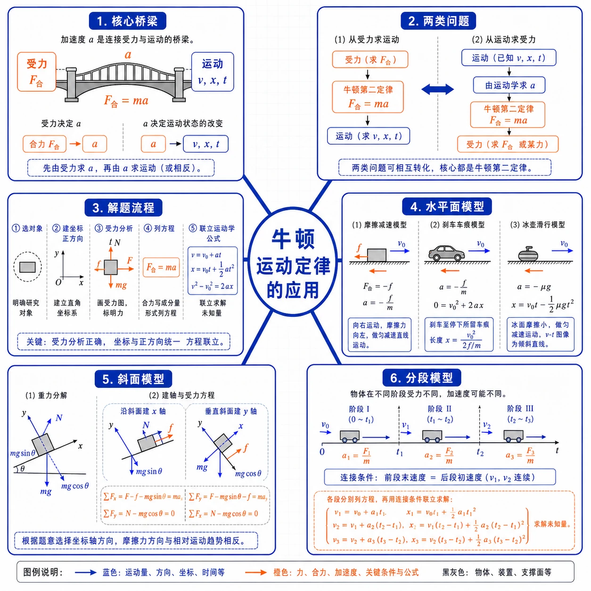
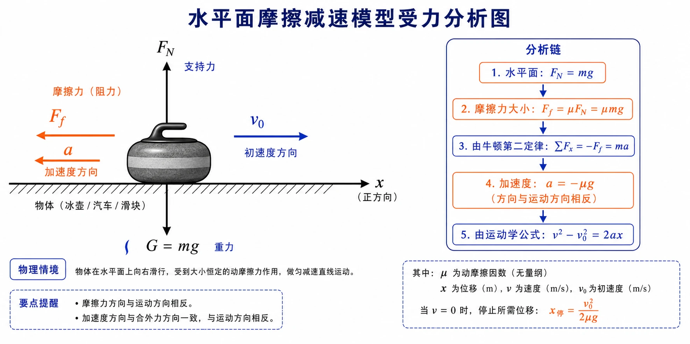
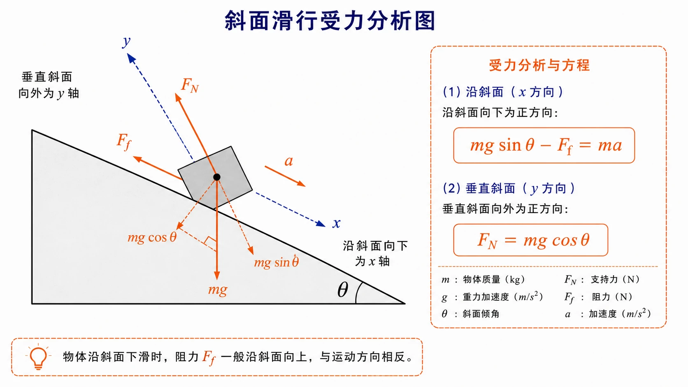

## 相关知识

[[4.1 牛顿第一定律]]
[[4.2 实验：探究加速度与力、质量的关系]]
[[4.3 牛顿第二定律]]
[[4.4 力学单位制]]
[[4.6 超重和失重]]
[[第四章 运动和力的关系 复习与提高]]
[[第四章 运动和力的关系 学习导图]]

# 4.5 牛顿运动定律的应用

<!-- 图片描述：本节整体知识信息结构图。中心主题为“牛顿运动定律的应用”，向外分为六个分支：核心桥梁（加速度 $a$ 连接受力与运动）、两类问题（从受力求运动、从运动求受力）、解题流程（选对象→建坐标→受力分析→列 $F_{\text{合}}=ma$→联立运动学公式）、水平面模型（摩擦减速、刹车车痕、冰壶滑行）、斜面模型（重力分解、沿斜面和垂直斜面建轴）、分段模型（前段末速度=后段初速度，各段加速度可能不同）。白色或浅网格背景，黑灰坐标轴和物体轮廓，蓝色表示运动量，橙色表示力和加速度。 -->

## 本节学习目标

学完本节，需要能做到：

- 理解牛顿第二定律是连接受力情况和运动情况的桥梁。
- 掌握“从受力确定运动情况”和“从运动情况确定受力”两类基本问题。
- 会把受力分析、$F_{\text{合}}=ma$ 和匀变速直线运动公式结合起来解题。
- 会处理水平面摩擦减速、斜面滑行、分段运动等典型情境。
- 能完整分析冰壶滑行、滑雪者下滑、气囊逃生、刹车车痕等应用问题。
- 理解分段运动中“前一段末速度等于后一段初速度”的衔接关系。

## 核心知识点讲解

### 一、知识对象与物理情境

列车进站要准确停靠在对应车门位置；冰壶运动员用毛刷摩擦冰面来调节冰壶滑行距离；汽车刹车后在路面留下车痕，由车痕长度可以反推动摩擦因数。这些问题都需要把“力”和“运动”联系起来。

牛顿第二定律 $F_{\text{合}}=ma$ 确定了运动和力的关系，使我们能够把物体的运动情况与受力情况联系起来。加速度 $a$ 是连接力和运动的桥梁。

### 二、核心概念与定义

动力学问题可分为两类：

| 类型 | 已知 | 求解 | 路径 |
| --- | --- | --- | --- |
| 第一类 | 受力情况 | 运动情况 | 受力分析 → $F_{\text{合}}$ → $a$ → 运动学公式 |
| 第二类 | 运动情况 | 受力情况 | 运动学公式 → $a$ → $F_{\text{合}}$ → 未知力 |

无论哪一类，加速度 $a$ 都是桥梁。求出加速度后，力和运动就相互打通了。

### 三、关键规律、公式与适用条件

#### 1. 从受力确定运动情况

步骤：

1. 选研究对象。
2. 建立坐标系，规定正方向。
3. 受力分析，求合力。
4. 由 $F_{\text{合}}=ma$ 求加速度。
5. 用运动学公式求速度、位移或时间。

常用运动学公式：

$$
v=v_0+at
$$

$$
x=v_0t+\frac{1}{2}at^2
$$

$$
v^2-v_0^2=2ax
$$

#### 2. 从运动情况确定受力

步骤：

1. 选研究对象。
2. 由运动学公式求加速度。
3. 受力分析。
4. 由 $F_{\text{合}}=ma$ 求未知力。

#### 3. 水平面摩擦减速模型

物体在水平面上滑动时，若只受滑动摩擦力，且 $F_N=mg$：

$$
F_f=\mu F_N=\mu mg
$$

由牛顿第二定律：

$$
a=\frac{F_f}{m}=-\mu g
$$

即加速度大小只与动摩擦因数和 $g$ 有关，与物体质量无关。

### 四、典型模型与过程分析

#### 1. 水平面摩擦减速模型

冰壶被投出后，水平方向主要受滑动摩擦力，方向与运动方向相反，做匀减速直线运动。汽车刹车后在路面上滑行也是同类问题。

<!-- 图片描述：水平面摩擦减速模型受力分析图。画水平地面上的物体（冰壶或汽车）向右滑行，蓝色箭头 $v_0$ 标注初速度方向向右，橙色箭头 $F_f$ 沿地面向左，黑色箭头 $F_N$ 竖直向上、$G=mg$ 竖直向下。旁边列出分析链：$F_f=\mu mg$ → $a=-\mu g$ → $v^2-v_0^2=2ax$。白色背景，黑灰物体和地面轮廓。 -->

若外界条件使动摩擦因数改变（如冰壶前方被毛刷摩擦后 $\mu$ 减小），加速度随之改变，此时要分段处理。

#### 2. 斜面滑行模型

物体在斜面上运动时，常沿斜面和垂直斜面建立坐标轴。把重力 $G=mg$ 分解：

- 沿斜面方向：$mg\sin\theta$
- 垂直斜面方向：$mg\cos\theta$

沿斜面方向列牛顿第二定律方程：

$$
mg\sin\theta-F_f=ma
$$

垂直斜面方向列平衡方程：

$$
F_N-mg\cos\theta=0
$$

<!-- 图片描述：斜面滑行受力分析图。画倾角为 $\theta$ 的斜面和沿斜面下滑的物体，建立沿斜面向下为 $x$ 轴、垂直斜面向外为 $y$ 轴的坐标系。重力 $mg$ 竖直向下，分解为沿斜面向下的 $mg\sin\theta$ 和垂直斜面向内的 $mg\cos\theta$；支持力 $F_N$ 垂直斜面向外；阻力 $F_f$ 沿斜面向上；加速度 $a$ 沿斜面向下。旁边列出方程 $mg\sin\theta-F_f=ma$ 和 $F_N=mg\cos\theta$。 -->

#### 3. 分段运动模型

当运动过程中受力情况发生变化时，加速度也随之改变，必须分段处理。关键衔接条件是：前一段的末速度等于后一段的初速度。

典型情境：

- 冰壶滑行 $10\ \text{m}$ 后开始刷冰，动摩擦因数改变。
- 汽车先加速再刹车。
- 物体先在一种接触面上运动，再进入另一种接触面。

分段问题的一般步骤：

1. 按受力变化分段。
2. 每段分别求加速度。
3. 前一段末速度作为后一段初速度。
4. 各段位移相加得总位移。

### 五、图像、实验与数据理解

#### 1. 两类问题的对称性

从受力求运动和从运动求受力是互逆的两个方向。无论走哪个方向，都必须经过加速度这个中间环节。做题时先判断题目属于哪一类，再决定是先用牛顿第二定律还是先用运动学公式。

#### 2. 刹车车痕推摩擦因数

汽车在水平路面上刹车后，车轮抱死滑行。由车痕长度（位移 $x$）、刹车前速度 $v_0$ 和末速度 $v=0$，可先求加速度：

$$
a=\frac{0-v_0^2}{2x}
$$

再由 $a=-\mu g$ 求动摩擦因数：

$$
\mu=\frac{|a|}{g}
$$

这就是用牛顿运动定律检测路面摩擦性能的原理。

#### 3. 气囊逃生斜面

民航客机紧急出口的气囊构成一个斜面。人沿气囊滑下时受重力、支持力和阻力。已知斜面高度、长度和阻力大小，可以用斜面模型求人滑至底端的速度。

### 六、题型应用与迁移

动力学应用题要始终坚持四条原则：

1. 不画受力图不列动力学方程。
2. 受力改变就分段。
3. 每段内部确认加速度是否恒定。
4. 前后段用末速度、位移或时间衔接。

| 题型 | 关键方法 |
| --- | --- |
| 水平面摩擦减速 | $a=-\mu g$，与质量无关 |
| 斜面滑行 | 沿斜面和垂直斜面建轴，分解重力 |
| 分段运动 | 各段加速度不同，用末速度衔接 |
| 刹车车痕 | 由位移和速度反推加速度和 $\mu$ |
| 多力合成后求运动 | 先用平行四边形定则求合力 |

## 重点梳理

### 重点 1：加速度是连接力和运动的桥梁

无论从力求运动还是从运动求力，都必须经过加速度。求出加速度后，力和运动之间的关系就建立起来了。

### 重点 2：两类问题的解题路径

- 从受力求运动：$F_{\text{合}}\rightarrow a\rightarrow v,x,t$
- 从运动求受力：$v,x,t\rightarrow a\rightarrow F_{\text{合}}\rightarrow$ 未知力

### 重点 3：斜面问题要分解重力

斜面上通常 $F_N=mg\cos\theta$，不是 $mg$。沿斜面方向的重力分力为 $mg\sin\theta$。

### 重点 4：分段运动不能混用加速度

匀变速公式只适用于加速度恒定的单一过程。受力改变时加速度改变，必须分段处理。

## 难点突破

### 难点 1：为什么要分段

匀变速公式只适用于加速度恒定的过程。刷冰后摩擦因数改变、撤去拉力后合力改变、电梯启动和制动加速度不同，都要分段处理。每段加速度可能不同，不能全程套用同一个加速度。

### 难点 2：斜面上为什么不能写 $F_N=mg$

支持力只平衡重力垂直斜面的分量。斜面倾角为 $\theta$ 时：

$$
F_N=mg\cos\theta
$$

只有 $\theta=0$（水平面）时才有 $F_N=mg$。

### 难点 3：已知运动求受力为什么不能直接从力入手

如果阻力或未知力不能直接由条件给出（如题目没有提供动摩擦因数），就先利用运动学信息（位移、时间、速度等）求加速度，再用牛顿第二定律反推合力或未知力。

### 难点 4：水平面摩擦减速中加速度为什么与质量无关

物体在水平面上只受滑动摩擦力时：

$$
F_f=\mu mg
$$

$$
a=\frac{F_f}{m}=\frac{\mu mg}{m}=\mu g
$$

质量 $m$ 被约去，所以加速度大小只取决于 $\mu$ 和 $g$。

### 难点 5：滑雪者受到的阻力方向

滑雪者沿山坡向下滑行，阻力（包括摩擦力和空气阻力）的方向与运动方向相反，即沿斜面向上。在列方程时，阻力写在沿斜面方程中，取负号。

## 例题讲解

### 例题 1：冰壶滑行距离（从受力求运动）

**题目**：运动员以 $3.4\ \text{m/s}$ 的速度投出冰壶，冰壶在水平冰面上自由滑行。冰壶和冰面的动摩擦因数为 $0.02$，取 $g=10\ \text{m/s}^2$。冰壶能滑行多远？

**读题**：冰壶在水平面上只受滑动摩擦力，做匀减速直线运动。

**步骤**：

设冰壶质量为 $m$，取运动方向为正方向。

滑动摩擦力：

$$
F_f=-\mu_1 mg=-0.02\times10\times m=-0.2m
$$

加速度：

$$
a_1=\frac{F_f}{m}=-\mu_1 g=-0.2\ \text{m/s}^2
$$

由 $v^2-v_0^2=2a_1 x_1$，$v=0$：

$$
0-3.4^2=2\times(-0.2)\times x_1
$$

$$
x_1=\frac{3.4^2}{0.4}\ \text{m}=\frac{11.56}{0.4}\ \text{m}=28.9\ \text{m}
$$

**答案**：冰壶滑行了 $28.9\ \text{m}$。

**反思**：冰壶加速度 $a=-\mu g$，与冰壶质量无关。

### 例题 2：冰壶刷冰后多滑行多少（分段运动）

**题目**：运动员仍以 $3.4\ \text{m/s}$ 的速度投出冰壶。冰壶自由滑行 $10\ \text{m}$ 后，队友开始在前方刷冰，动摩擦因数变为原来的 $90\%$。冰壶比第一次多滑行了多少距离？取 $g=10\ \text{m/s}^2$。

**分析**：分两段处理。第一段 $\mu_1=0.02$，滑行 $10\ \text{m}$ 后速度为 $v_{10}$；第二段 $\mu_2=0.9\mu_1=0.018$。

**步骤**：

第一段加速度 $a_1=-0.2\ \text{m/s}^2$。滑行 $10\ \text{m}$ 后：

$$
v_{10}^2=v_0^2+2a_1 x_{10}=3.4^2+2\times(-0.2)\times10
$$

$$
v_{10}^2=11.56-4=7.56
$$

第二段加速度：

$$
a_2=-\mu_2 g=-0.018\times10=-0.18\ \text{m/s}^2
$$

由 $0-v_{10}^2=2a_2 x_2$：

$$
x_2=\frac{-v_{10}^2}{2a_2}=\frac{-7.56}{2\times(-0.18)}=\frac{7.56}{0.36}=21\ \text{m}
$$

第二次总滑行距离：

$$
x_{\text{总}}=10+21=31\ \text{m}
$$

比第一次多滑行：

$$
31-28.9=2.1\ \text{m}
$$

**答案**：冰壶比第一次多滑行了 $2.1\ \text{m}$。

**反思**：分段问题的关键是前一段末速度等于后一段初速度。

### 例题 3：滑雪者对雪面的压力和阻力（从运动求受力）

**题目**：一位滑雪者，人与装备的总质量为 $75\ \text{kg}$，以 $2\ \text{m/s}$ 的初速度沿山坡匀加速直线滑下，山坡倾角为 $30^\circ$，在 $5\ \text{s}$ 时间内滑下 $60\ \text{m}$。求滑雪者对雪面的压力及滑雪者受到的阻力。取 $g=10\ \text{m/s}^2$。

**分析**：不知道动摩擦因数和阻力，不能直接从力求解。先由运动学公式求加速度，再列牛顿第二定律方程。

**步骤**：

先求加速度。由 $x=v_0t+\dfrac{1}{2}at^2$：

$$
60=2\times5+\frac{1}{2}a\times25
$$

$$
60=10+12.5a
$$

$$
a=4\ \text{m/s}^2
$$

沿斜面和垂直斜面建坐标轴。

$y$ 方向（垂直斜面）：

$$
F_N=mg\cos30^\circ=75\times10\times0.866\approx650\ \text{N}
$$

$x$ 方向（沿斜面向下为正）：

$$
mg\sin30^\circ-F_f=ma
$$

$$
F_f=m(g\sin30^\circ-a)=75\times(5-4)=75\ \text{N}
$$

由牛顿第三定律，滑雪者对雪面的压力大小等于雪面对滑雪者的支持力大小，为 $650\ \text{N}$，方向垂直斜面向下。

**答案**：滑雪者对雪面的压力大小为 $650\ \text{N}$，方向垂直斜面向下；滑雪者受到的阻力大小为 $75\ \text{N}$，方向沿斜面向上。

### 例题 4：气囊滑行速度

**题目**：民航客机紧急出口的气囊构成一条斜面。机舱口下沿距地面 $3.2\ \text{m}$，气囊斜面长度为 $6.5\ \text{m}$。一个质量为 $60\ \text{kg}$ 的人沿气囊滑下时所受阻力为 $240\ \text{N}$。人滑至气囊底端时的速度是多少？取 $g=10\ \text{m/s}^2$。

**分析**：先求斜面倾角的正弦值，再沿斜面列牛顿第二定律方程。

**步骤**：

斜面高度 $h=3.2\ \text{m}$，斜面长 $L=6.5\ \text{m}$：

$$
\sin\theta=\frac{h}{L}=\frac{3.2}{6.5}
$$

沿斜面方向（向下为正）：

$$
mg\sin\theta-F_f=ma
$$

$$
60\times10\times\frac{3.2}{6.5}-240=60a
$$

$$
\frac{1920}{6.5}-240=60a
$$

$$
295.4-240=60a
$$

$$
a=\frac{55.4}{60}\approx0.92\ \text{m/s}^2
$$

人从静止开始滑行，由 $v^2=2aL$：

$$
v=\sqrt{2\times0.92\times6.5}\approx\sqrt{11.96}\approx3.5\ \text{m/s}
$$

**答案**：人滑至气囊底端时的速度约为 $3.5\ \text{m/s}$。

### 例题 5：刹车车痕推摩擦因数

**题目**：汽车以 $54\ \text{km/h}$ 的速度在水平直道上行驶，突然紧急刹车，车轮抱死后在路面上滑行直至停下。测得车痕长度为 $17.2\ \text{m}$。求路面和轮胎之间的动摩擦因数。取 $g=10\ \text{m/s}^2$。

**分析**：先换算单位，由位移和速度求加速度，再由 $a=-\mu g$ 求 $\mu$。

**步骤**：

$$
v_0=54\ \text{km/h}=15\ \text{m/s}
$$

由 $v^2-v_0^2=2ax$，$v=0$：

$$
0-15^2=2a\times17.2
$$

$$
a=\frac{-225}{34.4}\approx-6.54\ \text{m/s}^2
$$

水平面刹车：

$$
|a|=\mu g
$$

$$
\mu=\frac{6.54}{10}\approx0.654
$$

**答案**：路面和轮胎之间的动摩擦因数约为 $0.65$。

## 易错点整理

### 易错点 1：未选研究对象就列式

**常见错误表现**：直接写方程，不明确研究哪个物体。

**错因分析**：受力分析必须针对确定的研究对象。

**正确处理**：先写“以某物体为研究对象”，再画受力图、列方程。

### 易错点 2：把摩擦力方向写反

**常见错误表现**：物体减速时把摩擦力方向写成与加速度方向相同。

**错因分析**：滑动摩擦力方向与相对运动方向相反，不是与加速度方向相反。

**正确处理**：滑动摩擦力总是与相对滑动方向相反；加速度方向由合力方向决定。

### 易错点 3：斜面问题误写 $F_N=mg$

**常见错误表现**：在斜面上直接写支持力等于重力。

**错因分析**：重力方向竖直向下，支持力垂直斜面，二者方向不同。

**正确处理**：斜面上 $F_N=mg\cos\theta$。

### 易错点 4：分段题把前一段加速度用于后一段

**常见错误表现**：刷冰前后用同一个加速度计算全程位移。

**错因分析**：动摩擦因数改变后加速度也改变。

**正确处理**：分段列方程，各段用各自的加速度，前段末速度作为后段初速度。

### 易错点 5：只求数值不说明方向

**常见错误表现**：求出力或加速度后只写数字。

**错因分析**：力和加速度都是矢量。

**正确处理**：写出大小后说明方向，或在建立坐标时说明正方向。

## 考点考证点整理

### 考点一：从受力求运动

- 出题思路：给摩擦因数、拉力、质量等，求速度、位移或时间。
- 关键条件：合力方向、摩擦力表达式、初速度。
- 解答要点：受力分析 → $F_{\text{合}}$ → $a$ → 运动学公式。
- 易扣分点：不分清合力和单个力；忘记规定正方向。

### 考点二：从运动求受力

- 出题思路：给位移、时间、初速度，要求求阻力或压力。
- 关键条件：运动过程是否匀变速，坐标方向。
- 解答要点：先由运动学求 $a$，再用 $F_{\text{合}}=ma$ 求未知力。
- 易扣分点：直接套摩擦公式而忽略题目没有给动摩擦因数。

### 考点三：分段运动

- 出题思路：刷冰、撤力、变摩擦、分阶段加速制动。
- 关键条件：每段受力是否改变，前后段速度衔接。
- 解答要点：逐段列方程，前一段末速度作后一段初速度。
- 易扣分点：全程只用一个加速度。

### 考点四：斜面动力学

- 出题思路：斜面滑行、气囊滑梯、斜面拉力。
- 关键条件：倾角、重力分解、支持力方向、阻力方向。
- 解答要点：沿斜面和垂直斜面建轴，分别列方程。
- 易扣分点：把重力直接代替沿斜面分力；支持力写成 $mg$。

### 考点五：刹车车痕与摩擦检测

- 出题思路：由车痕长度和初速度反推动摩擦因数。
- 关键条件：末速度为零、水平面 $a=-\mu g$、单位换算。
- 解答要点：先由运动学求 $a$，再由 $\mu=|a|/g$ 求 $\mu$。
- 易扣分点：速度未换算为 $\text{m/s}$；忘记 $a$ 为负值。

## 练习题

### 基础训练

1. 牛顿运动定律应用中，什么物理量是连接力和运动的桥梁？
2. 从受力确定运动情况的解题步骤是什么？从运动确定受力情况的步骤是什么？
3. 物体在水平面上只受滑动摩擦力时，加速度大小为什么与质量无关？
4. 斜面上物体的支持力一般写成什么？为什么不写成 $mg$？
5. 分段运动问题中，前后两段用什么物理量衔接？

### 巩固训练

6. 质量为 $20\ \text{kg}$ 的物体静止在光滑水平面上。给它施加两个大小均为 $50\ \text{N}$、互成 $60^\circ$ 角的水平力，求 $3\ \text{s}$ 末速度和 $3\ \text{s}$ 内位移。
7. 一辆汽车以 $54\ \text{km/h}$ 的速度在水平直道上行驶时紧急刹车，车轮抱死后滑行 $17.2\ \text{m}$ 停下。求路面和轮胎之间的动摩擦因数。取 $g=10\ \text{m/s}^2$。
8. 运动员以 $3.4\ \text{m/s}$ 的速度投出冰壶，冰壶与冰面动摩擦因数为 $0.02$。冰壶能滑行多远？取 $g=10\ \text{m/s}^2$。

### 提升训练

9. 冰壶以 $3.4\ \text{m/s}$ 的速度被投出后，先自由滑行 $10\ \text{m}$，队友随后刷冰使动摩擦因数变为原来的 $90\%$。冰壶比不刷冰时多滑行了多少距离？取 $g=10\ \text{m/s}^2$。
10. 滑雪者人与装备总质量为 $75\ \text{kg}$，以 $2\ \text{m/s}$ 初速度沿倾角 $30^\circ$ 的山坡匀加速滑下，$5\ \text{s}$ 内滑下 $60\ \text{m}$。求滑雪者对雪面的压力和受到的阻力。取 $g=10\ \text{m/s}^2$。
11. 民航客机紧急出口的气囊斜面：机舱口下沿距地面 $3.2\ \text{m}$，气囊长 $6.5\ \text{m}$。质量 $60\ \text{kg}$ 的人沿气囊滑下时所受阻力为 $240\ \text{N}$，求人滑至底端时的速度。取 $g=10\ \text{m/s}^2$。
12. 一辆货车运载着圆柱形光滑空油桶。车厢底部一层油桶平整排列并固定，上层只有一只油桶 $C$，自由摆放在两固定油桶 $A$、$B$ 之间（三个桶截面圆心构成等边三角形，$A$、$B$ 在下方左右，$C$ 在上方）。当货车以加速度 $a$ 向左加速时，$A$ 对 $C$ 和 $B$ 对 $C$ 的支持力分别怎样变化？当加速度增大到何值时，桶 $C$ 恰好脱离 $A$？取 $g=10\ \text{m/s}^2$。

## 练习题答案

### 基础训练答案

1. 加速度 $a$ 是连接力和运动的桥梁。无论从力求运动还是从运动求力，都要先求加速度。

2. 从受力确定运动：受力分析 → 求合力 $F_{\text{合}}$ → 由 $F_{\text{合}}=ma$ 求 $a$ → 用运动学公式求 $v$、$x$、$t$。

   从运动确定受力：由运动学公式求 $a$ → 受力分析 → 由 $F_{\text{合}}=ma$ 求未知力。

3. 物体在水平面上只受滑动摩擦力时：

$$
F_f=\mu mg
$$

$$
a=\frac{F_f}{m}=\frac{\mu mg}{m}=\mu g
$$

质量 $m$ 被约去，所以加速度大小只与 $\mu$ 和 $g$ 有关。

4. 斜面上 $F_N=mg\cos\theta$。因为重力方向竖直向下，而支持力垂直斜面，二者方向不同。支持力只平衡重力垂直斜面的分量。

5. 前一段的末速度等于后一段的初速度。

### 巩固训练答案

6. 两力合力（$60^\circ$ 角平分线方向）：

$$
F_{\text{合}}=2\times50\times\cos30^\circ=100\times0.866=86.6\ \text{N}
$$

加速度：

$$
a=\frac{F_{\text{合}}}{m}=\frac{86.6}{20}=4.33\ \text{m/s}^2
$$

$3\ \text{s}$ 末速度：

$$
v=at=4.33\times3\approx13.0\ \text{m/s}
$$

$3\ \text{s}$ 内位移：

$$
x=\frac{1}{2}at^2=\frac{1}{2}\times4.33\times9\approx19.5\ \text{m}
$$

方向沿两力夹角的角平分线。

7. 单位换算：$v_0=54\ \text{km/h}=15\ \text{m/s}$。

由 $v^2-v_0^2=2ax$，$v=0$：

$$
a=\frac{-15^2}{2\times17.2}=\frac{-225}{34.4}\approx-6.54\ \text{m/s}^2
$$

由 $|a|=\mu g$：

$$
\mu=\frac{6.54}{10}\approx0.654
$$

路面和轮胎之间的动摩擦因数约为 $0.65$。

8. 加速度：

$$
a=-\mu g=-0.02\times10=-0.2\ \text{m/s}^2
$$

由 $v^2-v_0^2=2ax$，$v=0$：

$$
x=\frac{-v_0^2}{2a}=\frac{-3.4^2}{2\times(-0.2)}=\frac{11.56}{0.4}=28.9\ \text{m}
$$

冰壶滑行了 $28.9\ \text{m}$。

### 提升训练答案

9. 第一段：$a_1=-0.2\ \text{m/s}^2$，滑行 $10\ \text{m}$ 后：

$$
v_{10}^2=3.4^2+2\times(-0.2)\times10=11.56-4=7.56
$$

第二段：$\mu_2=0.9\times0.02=0.018$：

$$
a_2=-0.018\times10=-0.18\ \text{m/s}^2
$$

$$
x_2=\frac{-v_{10}^2}{2a_2}=\frac{-7.56}{2\times(-0.18)}=\frac{7.56}{0.36}=21\ \text{m}
$$

总距离 $10+21=31\ \text{m}$，比不刷冰（$28.9\ \text{m}$）多滑行 $2.1\ \text{m}$。

10. 先求加速度。由 $x=v_0t+\dfrac{1}{2}at^2$：

$$
60=2\times5+\frac{1}{2}a\times25
$$

$$
a=4\ \text{m/s}^2
$$

垂直斜面方向：

$$
F_N=mg\cos30^\circ=75\times10\times0.866\approx650\ \text{N}
$$

沿斜面方向：

$$
F_f=m(g\sin30^\circ-a)=75\times(5-4)=75\ \text{N}
$$

由牛顿第三定律，滑雪者对雪面的压力大小为 $650\ \text{N}$，方向垂直斜面向下。滑雪者受到的阻力大小为 $75\ \text{N}$，方向沿斜面向上。

11. 斜面倾角满足 $\sin\theta=\dfrac{3.2}{6.5}$。

沿斜面方向：

$$
mg\sin\theta-F_f=ma
$$

$$
60\times10\times\frac{3.2}{6.5}-240=60a
$$

$$
295.4-240=60a
$$

$$
a\approx0.92\ \text{m/s}^2
$$

人从静止滑下 $6.5\ \text{m}$：

$$
v=\sqrt{2aL}=\sqrt{2\times0.92\times6.5}\approx3.5\ \text{m/s}
$$

人滑至底端时的速度约为 $3.5\ \text{m/s}$。

12. 设每个桶截面半径为 $r$，$A$、$B$ 圆心连线在正下方，$C$ 在上方，$AC$ 连线与水平方向成 $30^\circ$ 角（等边三角形排列），$BC$ 连线也与水平方向成 $30^\circ$ 角。

$A$ 对 $C$ 的支持力 $F_{NA}$ 沿 $AC$ 方向（由 $A$ 指向 $C$，即斜向右上），$B$ 对 $C$ 的支持力 $F_{NB}$ 沿 $BC$ 方向（由 $B$ 指向 $C$，即斜向左上）。

以 $C$ 为研究对象，建立水平向左为 $x$ 轴正方向、竖直向上为 $y$ 轴正方向的坐标系。

$y$ 方向：

$$
F_{NA}\sin30^\circ+F_{NB}\sin30^\circ=mg
$$

$x$ 方向：

$$
F_{NB}\cos30^\circ-F_{NA}\cos30^\circ=ma
$$

由 $y$ 方向方程：

$$
F_{NA}+F_{NB}=\frac{mg}{\sin30^\circ}=2mg
$$

由 $x$ 方向方程：

$$
F_{NB}-F_{NA}=\frac{ma}{\cos30^\circ}=\frac{2ma}{\sqrt3}
$$

解得：

$$
F_{NA}=mg-\frac{ma}{\sqrt3}
$$

$$
F_{NB}=mg+\frac{ma}{\sqrt3}
$$

（1）汽车向左加速时，$A$ 对 $C$ 的支持力 $F_{NA}$ 减小，$B$ 对 $C$ 的支持力 $F_{NB}$ 增大。

（2）桶 $C$ 脱离 $A$ 时 $F_{NA}=0$：

$$
mg-\frac{ma}{\sqrt3}=0
$$

$$
a=\sqrt3\,g=\sqrt3\times10\approx17.3\ \text{m/s}^2
$$

当加速度增大到约 $17.3\ \text{m/s}^2$ 时，桶 $C$ 脱离 $A$。
