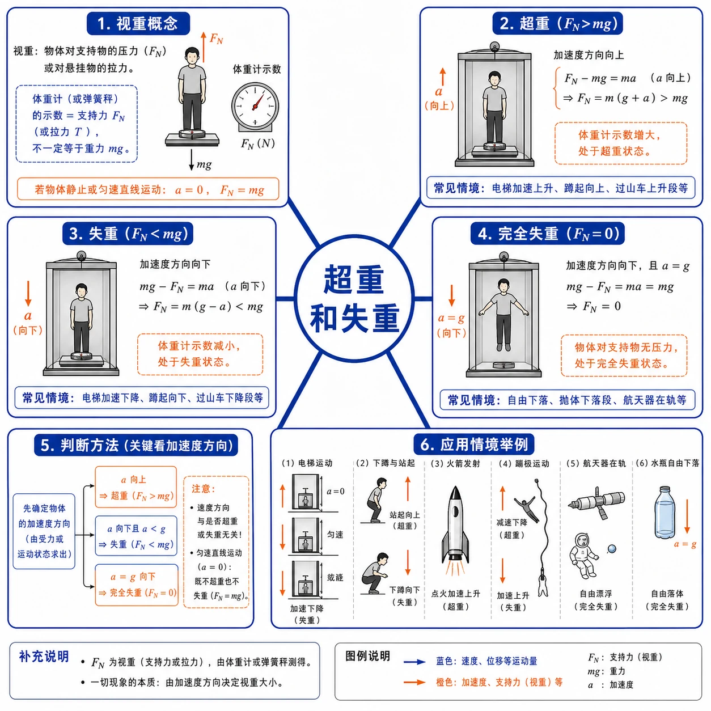
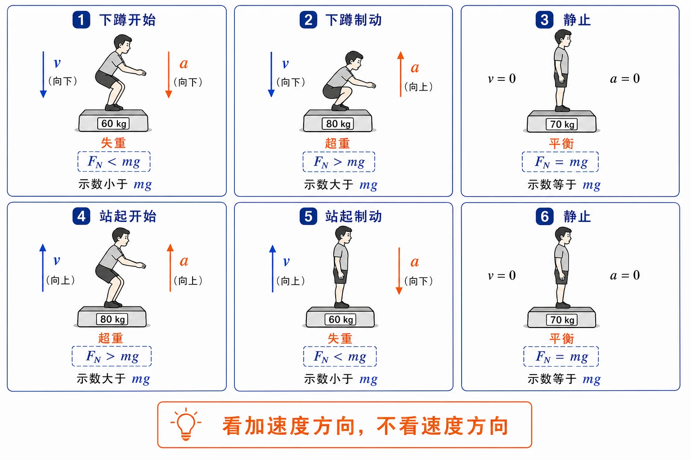
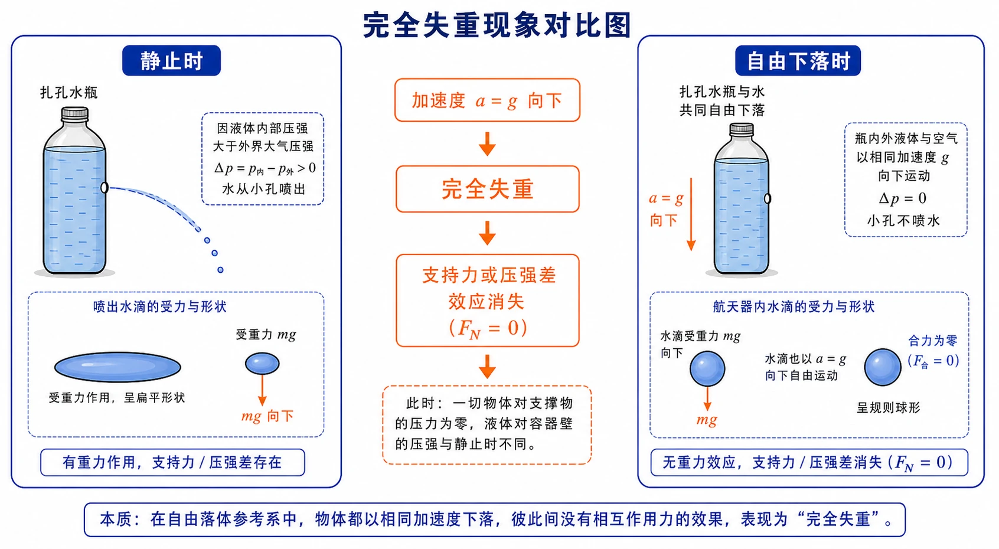

## 相关知识

[[4.1 牛顿第一定律]]
[[4.2 实验：探究加速度与力、质量的关系]]
[[4.3 牛顿第二定律]]
[[4.4 力学单位制]]
[[4.5 牛顿运动定律的应用]]
[[第四章 运动和力的关系 复习与提高]]
[[第四章 运动和力的关系 学习导图]]

# 4.6 超重和失重

<!-- 图片描述：本节整体知识信息结构图。中心主题为“超重和失重”，向外分为六个分支：视重概念（体重计示数=支持力/压力，不一定等于重力）、超重（加速度向上，$F_N>m g$）、失重（加速度向下，$F_N<mg$）、完全失重（$a=g$ 向下，$F_N=0$）、判断方法（看加速度方向，不看速度方向）、应用情境（电梯、下蹲站起、火箭发射、蹦极、航天器、水瓶自由下落）。白色或浅网格背景，黑灰体重计和人轮廓，蓝色表示速度方向，橙色表示加速度方向和支持力变化。 -->

## 本节学习目标

学完本节，需要能做到：

- 理解体重计示数本质上反映的是支持力或压力，不一定等于重力。
- 理解超重、失重、完全失重的概念和产生条件。
- 会根据加速度方向判断超重或失重。
- 会用牛顿第二定律计算电梯加速、减速时的支持力或压力。
- 会分析下蹲、站起过程中体重计示数的变化。
- 能解释水瓶自由下落不喷水、航天器内水球呈球形、火箭发射时航天员承受较大压力等现象。

## 核心知识点讲解

### 一、知识对象与物理情境

站在体重计上向下蹲，你会发现：在下蹲过程中，体重计的示数先变小，后变大，再变小，最后保持某一数值不变。为什么体重计的示数会变化？

测量重力的常用方法是：把物体放在测力计上，让它处于静止状态，这时物体所受重力与测力计对物体的拉力或支持力大小相等，测力计的示数反映重力大小。但当物体加速运动时，测力计的示数就不再等于重力了。本节要研究的就是这种“示数不等于重力”的现象。

### 二、核心概念与定义

#### 1. 视重

体重计的示数反映的是人对体重计的压力大小。根据牛顿第三定律，人对体重计的压力与体重计对人的支持力 $F_N$ 大小相等、方向相反。所以体重计示数等于支持力 $F_N$ 的大小，这称为视重。

视重不一定等于物体的真实重力 $mg$。

#### 2. 超重

物体对支持物的压力（或对悬挂物的拉力）大于物体所受重力的现象，叫作超重。

此时视重大于重力：$F_N>mg$。

#### 3. 失重

物体对支持物的压力（或对悬挂物的拉力）小于物体所受重力的现象，叫作失重。

此时视重小于重力：$F_N<mg$。

#### 4. 完全失重

如果物体对支持物（或悬挂物）完全没有作用力，这种现象叫作完全失重状态。

此时 $F_N=0$。

### 三、关键规律、公式与适用条件

#### 1. 超重和失重的判断依据

取竖直向上为坐标轴正方向，人对体重计的压力为 $F_N'$，体重计对人的支持力为 $F_N$。由牛顿第三定律，$|F_N'|=|F_N|$。

由牛顿第二定律：

$$
F_N-mg=ma
$$

| 加速度方向 | 公式 | 视重与重力比较 | 状态 |
| --- | --- | --- | --- |
| 向上（$a>0$） | $F_N=m(g+a)$ | $F_N>mg$ | 超重 |
| 向下（$a<0$），$|a|<g$ | $F_N=m(g-|a|)$ | $F_N<mg$ | 失重 |
| 向下（$a=-g$） | $F_N=0$ | $F_N=0$ | 完全失重 |
| $a=0$ | $F_N=mg$ | $F_N=mg$ | 正常 |

#### 2. 完全失重的条件

当物体以加速度 $a=g$ 竖直向下运动时（如自由落体运动），由 $F_N=m(g-a)$ 得 $F_N=0$。物体对支持物完全没有压力，进入完全失重状态。

完全失重在航天器绕地球运行时也会发生。航天器和其中物体都在地球引力作用下做绕地运动，加速度等于当地的重力加速度，因此舱内物体处于完全失重状态。

### 四、典型模型与过程分析

#### 1. 判断超重失重的核心法则

判断超重还是失重，关键是看加速度方向，不是速度方向：

- 加速度向上 → 超重。
- 加速度向下 → 失重。
- 加速度为零（静止或匀速直线运动）→ 正常，不超重不失重。

<!-- 图片描述：下蹲和站起过程中的超重失重判断图。画面分六个阶段，每个阶段画人和体重计简图，蓝色箭头表示速度 $v$，橙色箭头表示加速度 $a$。第一阶段：下蹲开始，$v$ 向下 $a$ 向下，示数小于 $mg$（失重）；第二阶段：下蹲制动，$v$ 向下 $a$ 向上，示数大于 $mg$（超重）；第三阶段：静止，示数等于 $mg$；第四阶段：站起开始，$v$ 向上 $a$ 向上，示数大于 $mg$（超重）；第五阶段：站起制动，$v$ 向上 $a$ 向下，示数小于 $mg$（失重）；第六阶段：静止，示数等于 $mg$。底部橙色框写“看加速度方向，不看速度方向”。白色背景，黑灰人形和体重计轮廓。 -->

#### 2. 下蹲过程

1. 开始向下加速：加速度向下，失重，示数变小。
2. 接近最低点时向下减速：加速度向上，超重，示数变大。
3. 静止后：加速度为零，示数恢复正常。

#### 3. 站起过程

1. 开始向上加速：加速度向上，超重，示数变大。
2. 接近最高点时向上减速：加速度向下，失重，示数变小。
3. 静止后：加速度为零，示数恢复正常。

#### 4. 电梯运动

| 电梯运动 | 加速度方向 | 状态 |
| --- | --- | --- |
| 启动上升（加速上升） | 向上 | 超重 |
| 匀速上升 | 零 | 正常 |
| 减速上升（快到楼层） | 向下 | 失重 |
| 启动下降（加速下降） | 向下 | 失重 |
| 匀速下降 | 零 | 正常 |
| 减速下降（快到楼层） | 向上 | 超重 |

### 五、图像、实验与数据理解

#### 1. 力传感器 $F$-$t$ 图像

用力传感器代替体重计，可以在计算机上直接得到示数随时间变化的图线。读图时，要把示数与正常重力 $mg$ 比较：

- 图线低于 $mg$ 水平线：失重。
- 图线高于 $mg$ 水平线：超重。
- 图线等于 $mg$：正常。

下蹲过程图线特征：先下降到 $mg$ 以下，再上升到 $mg$ 以上，最后回到 $mg$ 水平线。

站起过程图线特征：先上升到 $mg$ 以上，再下降到 $mg$ 以下，最后回到 $mg$ 水平线。

#### 2. 水瓶自由下落实验

在盛水塑料瓶壁上扎一个小孔，静止时水会从小孔喷出。但释放水瓶让它自由下落时，水不再从小孔流出。

原因是：自由下落时，水和瓶都以加速度 $g$ 下落，处于完全失重状态。小孔内外不再形成通常的压强差，所以水不会喷出。

#### 3. 航天器中的完全失重现象

航天器在太空轨道上绕地球运行时，舱内物体处于完全失重状态。此时：

- 物体漂浮在空中。
- 液滴呈球形（表面张力使其收缩成球形，没有重力使其变形）。
- 气泡在液体中不会上浮（没有浮力效应）。

<!-- 图片描述：完全失重现象对比图。左栏标题“静止时”：画扎孔水瓶，水从小孔喷出，旁边画液滴受重力呈扁平形状。右栏标题“自由下落时”：水瓶和水共同以 $g$ 下落，小孔不喷水，旁边画航天器内呈球形的漂浮水滴。中间用橙色箭头标注“加速度 $a=g$ 向下 → 完全失重 → 支持力或压强差效应消失”。白色背景，黑灰物体轮廓，蓝色表示水和液体。 -->

### 六、题型应用与迁移

超重失重题的解题步骤：

1. 选研究对象。
2. 画重力 $mg$ 和支持力（或拉力）$F_N$。
3. 判断加速度方向。
4. 规定正方向，由牛顿第二定律列方程。
5. 若题目问“压力”或“示数”，用牛顿第三定律说明压力大小等于支持力大小。

| 题型 | 关键点 |
| --- | --- |
| 电梯加速/减速 | 看加速度方向，列 $F_N-mg=ma$ |
| 下蹲/站起 | 分阶段看加速度方向 |
| 火箭发射 | 向上加速，超重，$F_N=m(g+a)$ |
| 自由落体/航天器 | $a=g$ 向下，完全失重，$F_N=0$ |
| 蹦极 | 自由下落段完全失重，弹性绳减速段超重 |
| 传感器图像 | 图线与 $mg$ 比较判断超重/失重 |

## 重点梳理

### 重点 1：视重不等于重力

体重计示数是支持力或压力大小（视重），不一定等于重力。只有在静止或匀速直线运动时，视重才等于重力。

### 重点 2：判断超重失重看加速度方向

- 加速度向上：超重。
- 加速度向下：失重。
- 与速度方向无关。

### 重点 3：超重和失重时重力不变

物体受到的重力 $mg$ 不随运动状态改变。超重和失重改变的是视重（压力或拉力），不是重力本身。

### 重点 4：完全失重时仍有重力

完全失重时物体仍受重力作用，且重力提供向下的加速度 $g$。只是物体对支持物或悬挂物没有压力或拉力。

### 重点 5：匀速运动时正常

无论匀速上升还是匀速下降，加速度为零，视重等于重力，既不超重也不失重。

## 难点突破

### 难点 1：向上运动一定超重吗

不一定。向上减速时，加速度方向向下，是失重。

例如电梯快到目标楼层时正在上升但减速，此时加速度向下，人处于失重状态。

### 难点 2：向下运动一定失重吗

不一定。向下减速时，加速度方向向上，是超重。

例如电梯快到一楼时正在下降但减速，此时加速度向上，人处于超重状态。

### 难点 3：完全失重是不是没有重力

不是。完全失重时物体仍受重力，且重力提供向下的加速度。只是物体对支持物或悬挂物没有压力或拉力。

在航天器中，物体和航天器一起在地球引力作用下运动，重力恰好提供了维持绕地运动所需的加速度，所以舱内表现为完全失重。

### 难点 4：蹦极过程中超重失重怎样变化

蹦极下降过程分三个阶段：

1. 弹性绳拉直前：自由落体，完全失重。
2. 弹性绳拉直后继续下降但还在加速（加速度小于 $g$）：失重。
3. 弹性绳拉直后减速下降（加速度向上）：超重。

最低点速度为零时，弹性绳拉力最大，超重最明显。

### 难点 5：火箭发射时航天员承受多大压力

火箭发射时向上的加速度很大。如果加速度为 $n g$（$n$ 倍重力加速度），则支持力：

$$
F_N=m(g+a)=m(g+ng)=(n+1)mg
$$

航天员要承受 $(n+1)$ 倍自身体重的压力。

## 例题讲解

### 例题 1：电梯加速上升

**题目**：某人质量为 $60\ \text{kg}$，站在电梯内水平地板上。电梯以 $0.25\ \text{m/s}^2$ 的加速度匀加速上升，求人对电梯的压力。

**分析**：人受重力 $mg$ 和地板支持力 $F_N$，加速度向上。取竖直向上为正方向。

**步骤**：

由牛顿第二定律：

$$
F_N-mg=ma
$$

$$
F_N=m(g+a)=60\times(9.8+0.25)=60\times10.05=603\ \text{N}
$$

由牛顿第三定律，人对电梯地板的压力大小等于地板对人的支持力大小：

$$
F_N'=F_N=603\ \text{N}
$$

**答案**：人对电梯的压力大小为 $603\ \text{N}$，方向竖直向下。此时 $F_N>mg$，出现超重现象。

### 例题 2：电梯加速下降

**题目**：质量为 $50\ \text{kg}$ 的人随电梯以 $2\ \text{m/s}^2$ 的加速度加速下降。取 $g=10\ \text{m/s}^2$，求人对电梯地板的压力，并判断状态。

**分析**：加速度向下。取竖直向下为正方向。

**步骤**：

$$
mg-F_N=ma
$$

$$
F_N=m(g-a)=50\times(10-2)=50\times8=400\ \text{N}
$$

**答案**：人对电梯地板的压力大小为 $400\ \text{N}$，方向竖直向下。$F_N=400\ \text{N}<mg=500\ \text{N}$，处于失重状态。

### 例题 3：巨型娱乐器械

**题目**：巨型娱乐器械的座舱从 $76\ \text{m}$ 高处由静止释放，做自由落体运动。到离地 $28\ \text{m}$ 时开始制动并匀减速，到地面刚好停下。某人质量为 $50\ \text{kg}$，取 $g=10\ \text{m/s}^2$。求座舱在离地 $50\ \text{m}$ 和离地 $15\ \text{m}$ 位置时，人对座舱的压力。

**分析**：座舱经历两个阶段。

第一阶段：从 $76\ \text{m}$ 高处到离地 $28\ \text{m}$，自由落体，加速度为 $g$ 向下，完全失重。

第二阶段：从离地 $28\ \text{m}$ 到地面，匀减速下降，加速度向上，超重。需要先求制动加速度。

**步骤**：

离地 $50\ \text{m}$ 时仍在自由落体阶段，加速度为 $g$ 向下：

$$
F_N=m(g-g)=0
$$

人对座舱压力为 $0$，处于完全失重。

离地 $15\ \text{m}$ 时在制动阶段。先求制动加速度。

自由落体下落高度：$76-28=48\ \text{m}$。到离地 $28\ \text{m}$ 处速度：

$$
v^2=2g\times48=2\times10\times48=960
$$

制动段位移 $28\ \text{m}$，末速度为零：

$$
0-v^2=2a\times28
$$

$$
a=\frac{-960}{56}\approx-17.1\ \text{m/s}^2
$$

即制动加速度大小约 $17.1\ \text{m/s}^2$，方向向上。

离地 $15\ \text{m}$ 时人在制动阶段，加速度向上：

$$
F_N=m(g+a)=50\times(10+17.1)=50\times27.1=1355\ \text{N}
$$

**答案**：离地 $50\ \text{m}$ 时人对座舱压力为 $0$（完全失重）；离地 $15\ \text{m}$ 时人对座舱压力约为 $1355\ \text{N}$（超重）。

### 例题 4：火箭发射时的超重

**题目**：火箭发射时某阶段加速度达到 $3.5g$。平时重力为 $10\ \text{N}$ 的体内脏器在该阶段需要的支持力多大？

**分析**：火箭向上加速，加速度向上，超重。

**步骤**：

$$
a=3.5g
$$

支持力：

$$
F_N=m(g+a)=m(g+3.5g)=4.5mg
$$

由 $mg=10\ \text{N}$：

$$
F_N=4.5\times10=45\ \text{N}
$$

**答案**：脏器需要的支持力为 $45\ \text{N}$。

### 例题 5：用测力计估测电梯加速度

**题目**：用悬挂重物的测力计估测电梯加速度。电梯上升过程中，加速时测力计读数为 $G_1$，减速时读数为 $G_2$。设加速和减速过程加速度大小相同。求电梯加速度的大小。

**分析**：设重物质量为 $m$，加速度大小为 $a$。

加速上升时（超重）：

$$
G_1-mg=ma
$$

减速上升时（失重）：

$$
mg-G_2=ma
$$

两式相加：

$$
G_1-G_2=2ma
$$

两式相加还可得：

$$
G_1+G_2=2mg
$$

所以 $mg=\dfrac{G_1+G_2}{2}$，代入：

$$
a=\frac{G_1-G_2}{2m}=\frac{G_1-G_2}{G_1+G_2}\,g
$$

**答案**：电梯加速度大小为 $\dfrac{G_1-G_2}{G_1+G_2}\,g$。

## 易错点整理

### 易错点 1：把超重理解成重力变大

**常见错误表现**：说“超重时人的重力变大了”。

**错因分析**：混淆了视重和真实重力。

**正确处理**：超重时重力 $mg$ 不变，变的是视重（压力或拉力）。

### 易错点 2：把失重理解成没有重力

**常见错误表现**：说“失重时物体不受重力”。

**错因分析**：混淆了支持力为零和重力为零。

**正确处理**：失重时物体仍受重力，只是视重小于重力。完全失重时视重为零，但重力仍存在。

### 易错点 3：只看运动方向不看加速度方向

**常见错误表现**：看到“向上运动”就说超重。

**错因分析**：用速度方向代替加速度方向。

**正确处理**：向上减速时加速度向下，是失重。判断超重失重只看加速度方向。

### 易错点 4：忘记体重计示数对应支持力

**常见错误表现**：把体重计示数直接当成重力。

**错因分析**：不理解体重计测量原理。

**正确处理**：体重计示数反映的是人对体重计的压力，等于体重计对人的支持力大小。

### 易错点 5：匀速运动误判

**常见错误表现**：匀速上升时说“超重”，匀速下降时说“失重”。

**错因分析**：只看运动方向。

**正确处理**：匀速运动时加速度为零，视重等于重力，既不超重也不失重。

## 考点考证点整理

### 考点一：超重失重概念判断

- 出题思路：给电梯、下蹲、蹦极、火箭、自由落体等情境，要求判断状态。
- 关键条件：加速度方向。
- 解答要点：加速度向上超重，向下失重，$a=g$ 向下完全失重。
- 易扣分点：只看速度方向，不看加速度方向。

### 考点二：体重计示数计算

- 出题思路：给质量、加速度和 $g$，求压力或支持力。
- 关键条件：正方向、加速度方向、研究对象。
- 解答要点：对人列牛顿第二定律 $F_N-mg=ma$，再由牛顿第三定律得到压力大小。
- 易扣分点：把人对体重计的压力和体重计对人的支持力方向混淆。

### 考点三：完全失重现象解释

- 出题思路：水瓶自由下落不喷水、航天器水球、气泡不上浮等。
- 关键条件：物体和周围液体共同以 $g$ 下落或绕地运动。
- 解答要点：完全失重时支持力或压强差效应消失，不是重力消失。
- 易扣分点：写成“没有重力”。

### 考点四：传感器图像

- 出题思路：给力传感器 $F$-$t$ 图像，判断哪个阶段超重或失重。
- 关键条件：图线与 $mg$ 的相对大小。
- 解答要点：$F>mg$ 超重，$F<mg$ 失重，$F=mg$ 正常。
- 易扣分点：不标出正常重力基准线 $mg$。

### 考点五：多阶段运动中的超重失重

- 出题思路：蹦极、巨型器械、电梯启动→匀速→制动全过程。
- 关键条件：每个阶段的加速度方向。
- 解答要点：分段判断，自由落体段完全失重，减速制动段超重。
- 易扣分点：全程只用一个状态描述。

## 练习题

### 基础训练

1. 体重计的示数反映的是什么物理量？它一定等于人的重力吗？
2. 什么是超重？什么是失重？什么是完全失重？
3. 判断超重还是失重，应该看速度方向还是加速度方向？
4. 物体匀速上升时，处于超重、失重还是正常状态？为什么？
5. 完全失重时，物体还受重力吗？支持力是多少？

### 巩固训练

6. 某人质量为 $60\ \text{kg}$，站在电梯内。电梯以 $0.25\ \text{m/s}^2$ 的加速度匀加速上升。取 $g=9.8\ \text{m/s}^2$，求人对电梯地板的压力。
7. 质量为 $50\ \text{kg}$ 的人随电梯以 $2\ \text{m/s}^2$ 加速下降。取 $g=10\ \text{m/s}^2$，求人对电梯地板的压力，并判断处于什么状态。
8. 盛水塑料瓶壁上扎有小孔，静止时水会喷出。释放水瓶让它自由下落时，水不再从小孔流出。为什么？
9. 火箭发射时某阶段加速度达到 $3.5g$。平时重力为 $10\ \text{N}$ 的体内脏器在该阶段需要的支持力多大？
10. 一个人站在力传感器上完成“站起”动作。描述站起过程中力传感器示数怎样变化，并说明每个阶段是超重还是失重。

### 提升训练

11. 巨型娱乐器械座舱从 $76\ \text{m}$ 高处释放，到离地 $28\ \text{m}$ 时开始制动并匀减速，到地面刚好停下。某人质量 $50\ \text{kg}$，取 $g=10\ \text{m/s}^2$。求座舱到离地 $50\ \text{m}$ 和离地 $15\ \text{m}$ 位置时人对座舱的压力。
12. 蹦极运动员从高处跳下。弹性绳拉直前做自由落体运动；绳拉直后在缓冲作用下下降速度先增加再减小到零。分析整个下降过程中哪些阶段失重、哪些阶段超重。
13. 用悬挂重物的测力计估测电梯加速度。电梯上升时加速阶段测力计读数为 $G_1$，减速阶段读数为 $G_2$，且加速和减速过程加速度大小相同。推导电梯加速度的表达式。
14. 航天器在太空轨道上绕地球运行时，舱内液滴呈球形，气泡在液体中不会上浮。用完全失重的观点解释这两个现象。

## 练习题答案

### 基础训练答案

1. 体重计示数反映的是人对体重计的压力大小，等于体重计对人的支持力大小。它不一定等于重力，只有在静止或匀速直线运动时才等于重力。

2. 超重：物体对支持物的压力或拉力大于重力。失重：物体对支持物的压力或拉力小于重力。完全失重：物体对支持物或悬挂物完全没有作用力，$F_N=0$。

3. 应该看加速度方向。加速度向上为超重，向下为失重，与速度方向无关。

4. 正常状态。匀速上升时加速度为零，$F_N=mg$，视重等于重力，既不超重也不失重。

5. 完全失重时物体仍受重力，重力提供向下的加速度 $g$。支持力为零。

### 巩固训练答案

6. 加速度向上。取竖直向上为正方向：

$$
F_N-mg=ma
$$

$$
F_N=m(g+a)=60\times(9.8+0.25)=603\ \text{N}
$$

由牛顿第三定律，人对电梯地板的压力大小为 $603\ \text{N}$，方向竖直向下。

7. 加速度向下。取竖直向下为正方向：

$$
mg-F_N=ma
$$

$$
F_N=m(g-a)=50\times(10-2)=400\ \text{N}
$$

人对电梯地板的压力大小为 $400\ \text{N}$。$F_N=400\ \text{N}<mg=500\ \text{N}$，处于失重状态。

8. 自由下落时，水和瓶都以加速度 $g$ 下落，处于完全失重状态。小孔内外不再形成通常的压强差，所以水不会喷出。

9. 火箭加速度 $a=3.5g$ 向上。支持力：

$$
F_N=m(g+a)=m(g+3.5g)=4.5mg
$$

由 $mg=10\ \text{N}$：

$$
F_N=4.5\times10=45\ \text{N}
$$

脏器需要的支持力为 $45\ \text{N}$。

10. 站起过程分两个阶段：

第一阶段：人开始向上加速，加速度向上，力传感器示数大于 $mg$，处于超重。

第二阶段：人接近站直时向上减速，加速度向下，力传感器示数小于 $mg$，处于失重。

最后静止，示数恢复为 $mg$。

### 提升训练答案

11. 离地 $50\ \text{m}$ 时仍在自由落体阶段，完全失重：

$$
F_N=0
$$

人对座舱压力为 $0$。

制动阶段加速度计算：

自由落体下落 $76-28=48\ \text{m}$，到离地 $28\ \text{m}$ 处：

$$
v^2=2g\times48=2\times10\times48=960
$$

制动位移 $28\ \text{m}$，末速度为零：

$$
a=\frac{-v^2}{2\times28}=\frac{-960}{56}\approx-17.1\ \text{m/s}^2
$$

制动加速度大小约 $17.1\ \text{m/s}^2$，方向向上。

离地 $15\ \text{m}$ 时在制动阶段：

$$
F_N=m(g+a)=50\times(10+17.1)=50\times27.1=1355\ \text{N}
$$

人对座舱压力约为 $1355\ \text{N}$。

12. 蹦极下降过程分三个阶段：

（1）弹性绳拉直前：自由落体，加速度为 $g$ 向下，完全失重。

（2）弹性绳拉直后继续下降但仍在加速（加速度小于 $g$，方向向下）：失重。

（3）弹性绳拉直后减速下降（速度向下，加速度向上）：超重。

最低点速度为零时，弹性绳拉力最大，超重最明显。

13. 设重物质量为 $m$，加速度大小为 $a$。

加速上升（超重）：

$$
G_1-mg=ma\quad\cdots(1)
$$

减速上升（失重）：

$$
mg-G_2=ma\quad\cdots(2)
$$

$(1)+(2)$：

$$
G_1+G_2=2mg
$$

所以：

$$
m=\frac{G_1+G_2}{2g}
$$

$(1)-(2)$：

$$
G_1-G_2=2ma
$$

代入 $m$：

$$
a=\frac{G_1-G_2}{2m}=\frac{(G_1-G_2)g}{G_1+G_2}
$$

电梯加速度大小为 $\dfrac{G_1-G_2}{G_1+G_2}\,g$。

14. 航天器绕地球运行时，舱内物体处于完全失重状态。

（1）液滴呈球形：完全失重时，液体不再受重力作用而变形，表面张力使液滴收缩成表面积最小的形状，即球形。

（2）气泡不上浮：通常气泡在液体中上浮是因为浮力大于重力，浮力来自液体内部的压强差。完全失重时，液体内部不再因重力产生压强差，浮力消失，气泡不再上浮。
