# 1.1 细胞是生命活动的基本单位

## 知识关系导航

- 所属章节：[[章首 学习导图|第一章 走近细胞]]
- 后续知识点：[[1.2 细胞的多样性和统一性#原核细胞与真核细胞|原核细胞和真核细胞]]；先明确“细胞是生命系统”，再比较细胞的具体结构。
- 递进知识点：[[1.2 细胞的多样性和统一性#高倍显微镜观察的标准流程|高倍显微镜观察细胞]]；本节提出细胞的基本地位，下一节通过观察和比较获得结构证据。
- 相关知识点：[[章首 学习导图#5. 基础与应用：从细胞学说到合成生物学|从细胞学说到合成生物学]]；细胞学说把研究视角引向细胞内部。

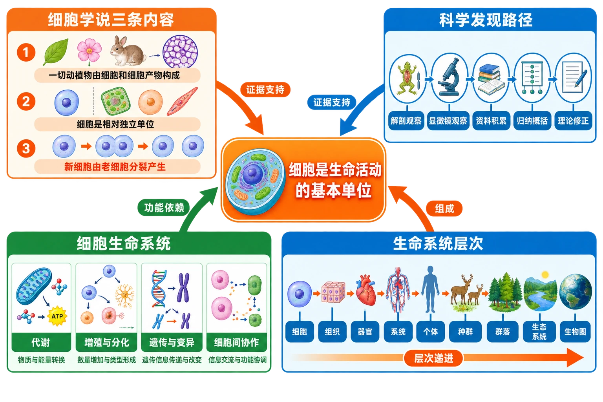
<!-- 图片描述：补充知识图（非教材原图）——本节整体知识信息结构图。中心节点为“细胞是生命活动的基本单位”，向左上展开“细胞学说三条内容：一切动植物由细胞和细胞产物构成、细胞是相对独立单位、新细胞由老细胞分裂产生”；向右上展开“科学发现路径：解剖观察→显微镜观察→资料积累→归纳概括→理论修正”；向左下展开“细胞生命系统：代谢、增殖与分化、遗传与变异、细胞间协作”；向右下展开“生命系统层次：细胞→组织→器官→系统→个体→种群→群落→生态系统→生物圈”。箭头分别标注“证据支持”“功能依赖”“组成”或“层次递进”；绿色表示细胞结构与生命过程，蓝色表示观察证据和科学方法，橙色突出“基本单位”“由老细胞产生”等结论。画面采用白底教材信息图，不加入装饰性人物或卡通图标，用于帮助学生先建立全节主线。 -->

## 本节学习目标

学完本节后，应能够：

1. 准确说出细胞学说的三条核心内容，并说明其对生物学发展的意义。
2. 按“观察对象—技术进步—证据积累—归纳概括—修正完善”的链条分析细胞学说的建立过程。
3. 区分完全归纳法与不完全归纳法，知道不完全归纳结论的可信性和局限性。
4. 从独立生活、细胞代谢、增殖分化、遗传变异和细胞协作等角度解释“生命活动离不开细胞”。
5. 按结构和功能依赖关系写出生命系统的层次，并判断某个对象是否属于生命系统。
6. 能从显微图、反射过程图、生命系统层次图和材料信息中提取证据，完成判断、比较和解释。

## 核心知识点讲解

### 一、知识对象与生命情境

教材以体细胞克隆猴为导入。克隆猴之间具有相同或高度相同的遗传背景，因而可减少实验动物遗传差异对药物实验的干扰。这一情境提示：许多宏观生命现象——生长、发育、疾病、遗传、药物反应——最终都要追溯到细胞以及细胞内的遗传物质和生命活动。

“走近细胞”不是把细胞当作孤立的小物体观察，而是要回答三个层次的问题：

- 细胞与生物体是什么关系？
- 不同生物的细胞为什么既相似又不同？
- 细胞怎样独立完成活动，又怎样在多细胞生物体内协同工作？

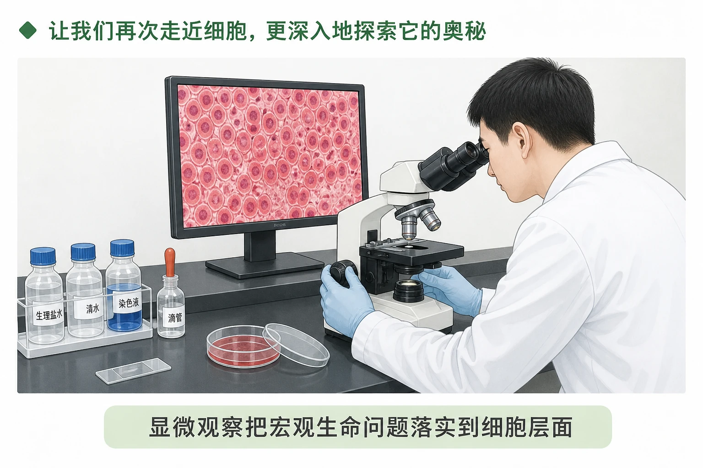
<!-- 图片描述：教材章首源图重绘——“研究人员使用显微镜观察细胞”。横向写实场景：右侧研究人员身穿白色实验服，俯身通过双目显微镜观察；显微镜位于画面中央，显示屏呈现红色组织或细胞显微图像；左侧保留试剂瓶、滴管、培养皿等实验台物品。不得改画为克隆猴，也不添加原图没有的DNA、药效数据或对照组。画面上方可保留教材引导语“让我们再次走近细胞，更深入地探索它的奥秘”，并在图下注明“显微观察把宏观生命问题落实到细胞层面”。此图用于承接章首克隆猴文字材料与后续细胞研究主题。 -->

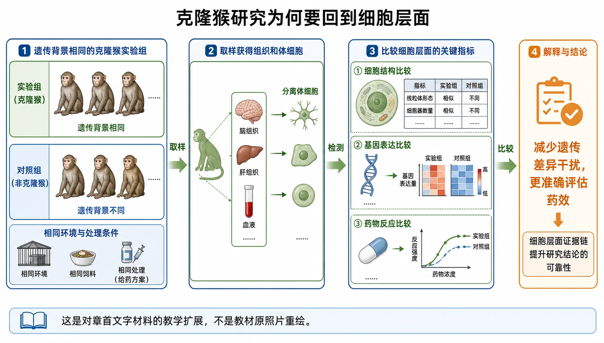
<!-- 图片描述：补充知识图（非教材原图）——“克隆猴研究为何要回到细胞层面”。从左到右设置三层证据链：遗传背景相同的克隆猴实验组→取样获得组织和体细胞→比较细胞结构、基因表达与药物反应；两组实验动物使用相同环境和处理条件，橙色框突出“减少遗传差异干扰，更准确评估药效”。蓝色表示实验设计与对照，绿色表示动物、组织和细胞，箭头标注“取样”“检测”“比较”“解释”。图下注明“这是对章首文字材料的教学扩展，不是教材原照片重绘”。 -->

### 二、核心概念与结构功能

#### 1. 细胞学说的三条核心内容

| 内容 | 具体含义 | 解决的核心问题 |
|---|---|---|
| 一切动植物由细胞和细胞产物构成 | 细胞是动植物体结构的共同基础；细胞产物也参与构成生物体 | 生物体由什么构成 |
| 细胞是相对独立的单位 | 每个细胞具有自身的生命活动，同时又在整体中承担分工并与其他细胞合作 | 细胞能否独立生活、如何参与整体功能 |
| 新细胞由老细胞分裂产生 | 细胞不是凭空从无机环境中连续产生，而有先前细胞作为来源 | 新细胞怎样产生、生物体怎样生长发育 |

这里的“相对独立”不能理解为“每个细胞都能独立完成整个生物体的所有功能”。单细胞生物的一个细胞就是一个完整个体；多细胞生物中的细胞通常高度分化，独立性和整体性同时存在。

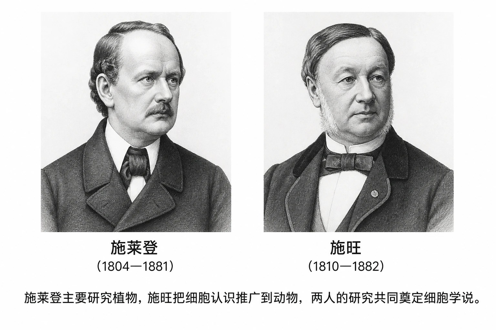
<!-- 图片描述：教材图1-1源图重绘——“施莱登和施旺”。左右并列两幅黑白历史肖像，左侧为施莱登，右侧为施旺；保持19世纪人物服饰、半身像构图和朴素灰度质感，人物下方分别标注中文姓名与生卒年，不加入时间轴、显微镜、植物组织或动物组织等原图没有的元素。图下另设一句解释：“施莱登主要研究植物，施旺把细胞认识推广到动物，两人的研究共同奠定细胞学说。”图片用于人物辨认，并与正文中的研究贡献对应。 -->

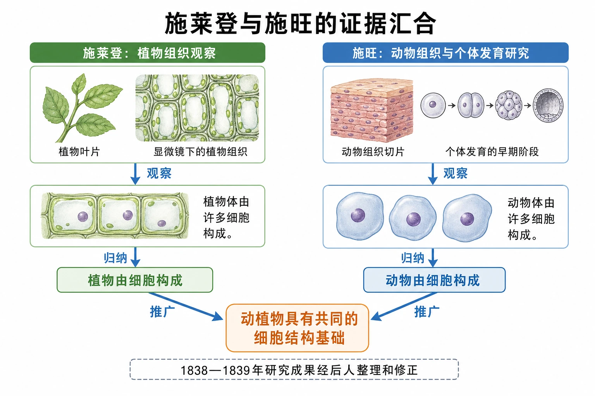
<!-- 图片描述：补充知识图（非教材原图）——“施莱登与施旺的证据汇合”。左栏为“施莱登：植物组织观察→植物由细胞构成”，右栏为“施旺：动物组织与个体发育研究→动物由细胞构成”，两条蓝色证据箭头汇聚到中央橙色结论框“动植物具有共同的细胞结构基础”。箭头写明“观察”“归纳”“推广”，底部标注“1838—1839年研究成果经后人整理和修正”。用于解释两位科学家如何从不同对象得到统一理论。 -->

#### 2. 细胞学说的意义

细胞学说的价值不只在于记住三句话，而在于它改变了生物学的研究框架：

1. **统一结构基础**：动物和植物虽然形态、生活方式不同，但都以细胞为基本结构单位，揭示生物界具有统一性。
2. **统一研究对象**：解剖学、生理学、胚胎学等学科可以围绕细胞这一共同基础相互联系，推动生物学形成和发展。
3. **统一生命活动解释**：生长、发育、生殖、遗传和变异等问题，都可以进一步追问细胞的结构、代谢、分裂和遗传物质。
4. **连接进化思想**：若新细胞来自先前细胞，现代细胞便与远古细胞存在连续的历史联系；细胞学说为理解生物进化提供了重要基础。

这类似于原子论在化学中的作用：原子论把物质现象归结到原子层面，细胞学说把生命现象的重要问题引向细胞层面。

#### 3. “细胞是基本的生命系统”的含义

系统是彼此相互作用、相互依赖的组分按照一定规律结合而成的整体。细胞内部有多种结构和物质，它们相互配合，使细胞能够维持相对稳定并完成生命活动，因此细胞不是简单的“装有物质的袋子”，而是一个有组织、有功能、有边界的生命系统。

“基本”有两层含义：

- **生命活动的最小基本单位**：除病毒等没有细胞结构的生物性实体外，生物体的结构和功能以细胞为基础。
- **更高层次生命系统的构成基础**：组织由细胞组成，器官由不同组织组成，个体由器官或器官系统组成；更高层次的种群、群落和生态系统也依赖细胞的生命活动。

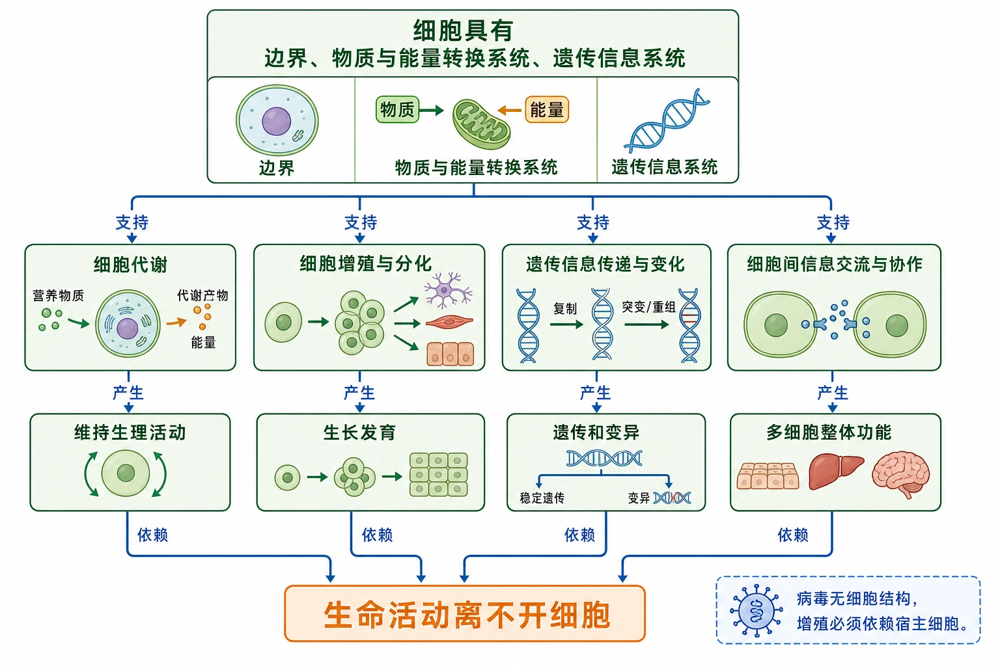
<!-- 图片描述：补充知识图（非教材原图）——“细胞为什么是基本生命系统”的因果链。起点为“细胞具有边界、物质与能量转换系统、遗传信息系统”，分成四条平行路径：“细胞代谢→维持生理活动”“细胞增殖与分化→生长发育”“遗传信息传递与变化→遗传和变异”“细胞间信息交流与协作→多细胞整体功能”，最终汇聚为橙色结论框“生命活动离不开细胞”。绿色节点表示生命过程，蓝色箭头标注“支持”“产生”或“依赖”，右下角加注“病毒无细胞结构，增殖必须依赖宿主细胞”。用于把教材结论还原为可解释的证据链。 -->

### 三、关键过程、规律与调控机制

#### 1. 细胞学说建立的历史链条

##### （1）从人体解剖到组织层次

1543年，维萨里通过大量尸体解剖研究揭示了人体在器官水平的结构；比夏进一步指出器官由组织构成。此时的研究对象还停留在肉眼可见的器官和组织层次，但已经出现了“生物体具有层次结构”的认识。

##### （2）显微镜打开细胞世界

1665年，罗伯特·胡克观察木栓组织，看到许多规则小室，并把它们命名为“cell”。需要注意：胡克看到的主要是木栓死细胞留下的细胞壁结构，并非今天意义上完整的活细胞。

之后，列文虎克观察到细菌、红细胞和精子等不同对象；马尔比基观察到细胞壁、细胞质等微细结构。观察资料大量增加，但“看见很多细胞”不等于“已经形成细胞学说”，还需要理论归纳。

##### （3）观察与归纳结合

施莱登观察花粉、胚珠和柱头，发现这些植物结构都由细胞构成且含有细胞核，由此提出植物体由细胞构成、细胞是植物体基本单位、新细胞从老细胞产生等观点。施旺受其启发，研究动物细胞形成和个体发育，提出动物体同样由细胞构成，动物个体发育从受精卵这一单细胞开始，从而把植物和动物统一起来。

##### （4）在修正中前进

施莱登关于新细胞产生机制的具体解释并不正确，他曾认为新细胞可从细胞核长出或像结晶一样在细胞质中形成。耐格里通过观察植物分生区发现新细胞来自细胞分裂；其他学者观察到动物受精卵分裂。1858年魏尔肖总结为“细胞通过分裂产生新细胞”。

这说明科学理论具有两个特征：核心方向可能正确，但具体机制仍会被新证据修正；“修正”不是对科学的否定，而是科学可靠性不断增强的过程。

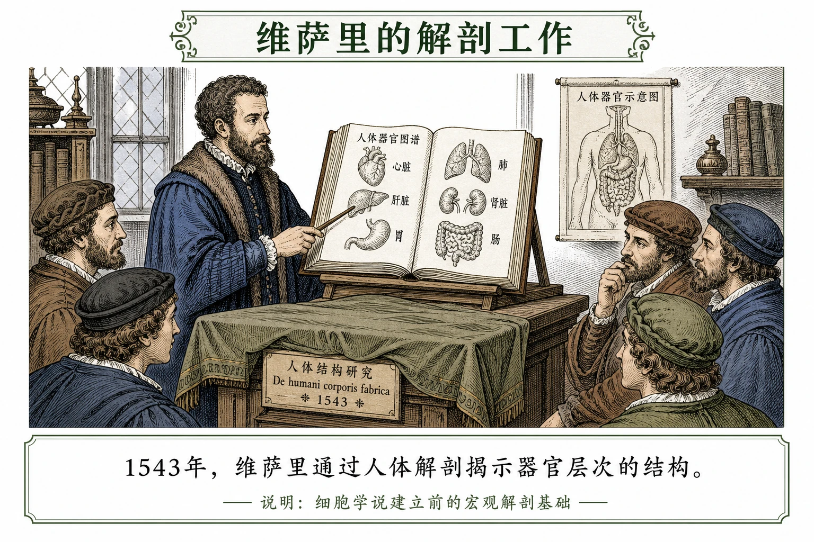
<!-- 图片描述：教材科学史源图重绘①——“维萨里的解剖工作”。保持历史版画风格：解剖学者站在解剖台旁进行人体结构观察，周围有旁观者或学生；突出当时研究停留在器官层次，不添加现代显微镜或细胞结构标签。图下注明“1543年，维萨里通过人体解剖揭示器官层次的结构”。用于说明细胞学说建立前的宏观解剖基础。 -->

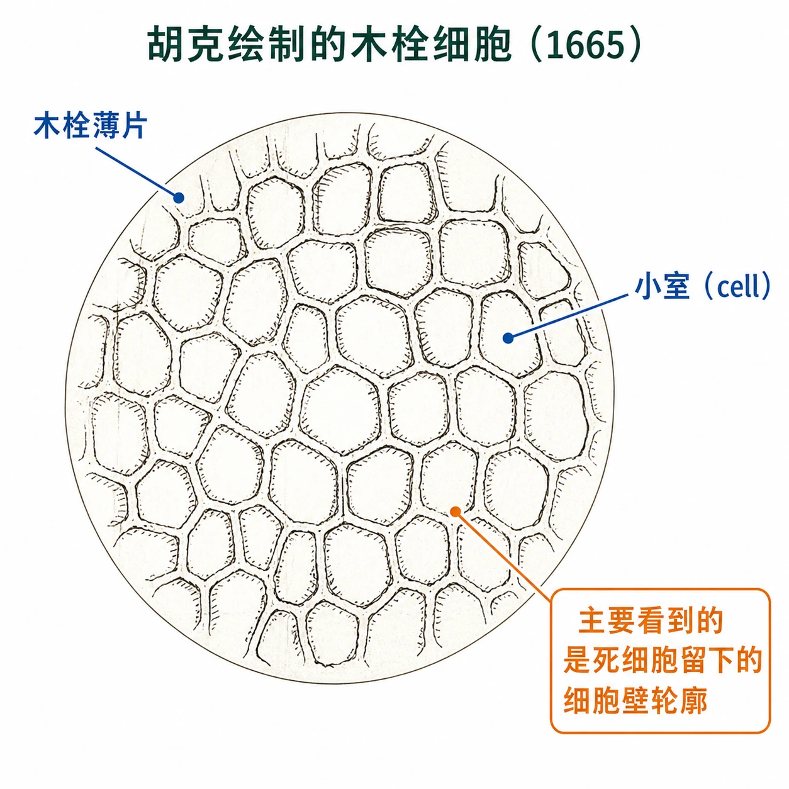
<!-- 图片描述：教材科学史源图重绘②——“胡克绘制的木栓细胞”。忠实表现蜂窝状、彼此相邻的不规则小室，线条保持17世纪手绘观察记录质感；标注“木栓薄片”“小室（cell）”“主要看到的是死细胞留下的细胞壁轮廓”，不要画细胞核、细胞质或完整活细胞。用于区分胡克的真实观察对象与现代细胞模式图。 -->

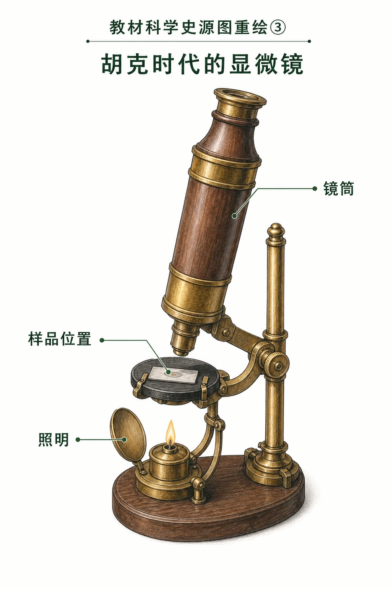
<!-- 图片描述：教材科学史源图重绘③——“胡克时代的显微镜”。纵向绘制早期复合显微镜：顶部目镜和镜筒、下方物镜、样品托架、照明装置与支架清晰可辨；保留木质或黄铜器械的历史外观，各部件只标注“镜筒”“样品位置”“照明”，不改成现代双目显微镜。用于解释观察技术进步如何拓展研究尺度。 -->

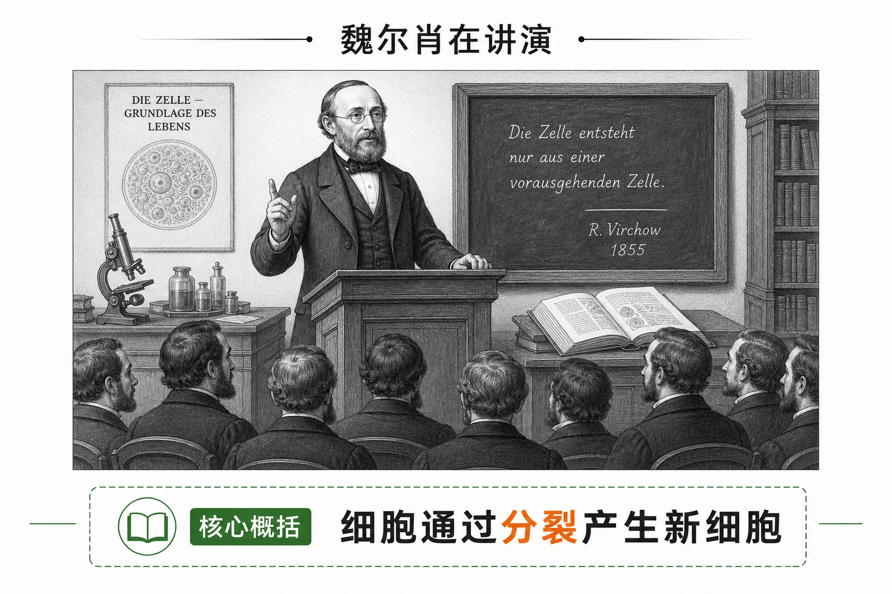
<!-- 图片描述：教材科学史源图重绘④——“魏尔肖在讲演”。保持历史黑白场景：魏尔肖位于讲台或实验展示区，面向听众讲授，背景体现19世纪学术报告环境；下方标注其核心概括“细胞通过分裂产生新细胞”，不要把未出现在原图中的分裂过程直接叠加到人物画面。用于对应细胞学说的修正环节。 -->

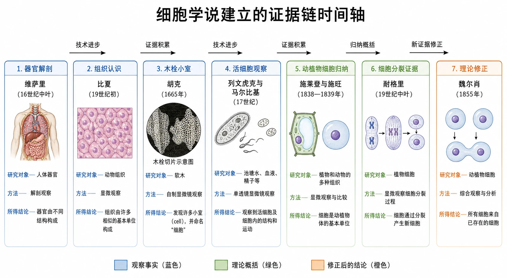
<!-- 图片描述：补充知识图（非教材原图）——“细胞学说建立的证据链时间轴”。按“器官解剖→组织认识→木栓小室→活细胞观察→动植物细胞归纳→细胞分裂证据→理论修正”排列维萨里、比夏、胡克、列文虎克与马尔比基、施莱登与施旺、耐格里、魏尔肖。每个节点只写“研究对象—方法—所得结论”，节点间箭头分别标注“技术进步”“证据积累”“归纳概括”“新证据修正”。蓝色为观察事实，绿色为理论概括，橙色为修正后的结论。用于训练科学史材料题，不能替代上述四张教材源图。 -->

#### 2. 单细胞与多细胞生命活动

- 单细胞生物只有一个细胞，但这个细胞可以完成营养、运动、呼吸、排出代谢废物、生长和分裂等基本活动。
- 多细胞生物中的细胞会发生分化，形成形态和功能不同的细胞；这些细胞通常不能单独完成整个个体的全部生命活动，而要通过组织、器官和系统的协作完成整体功能。
- “细胞相对独立”与“细胞相互依赖”并不矛盾：前者说明细胞具有自己的生命活动，后者说明细胞处在组织化的生命系统中。

以缩手反射为例：皮肤中的感受器细胞接受刺激，传入神经元传递兴奋，中枢神经系统中的神经元进行联系和处理，传出神经元把信息传给肌肉细胞，肌肉收缩使手迅速缩回。这个过程不是某一个细胞单独完成的，而是多个细胞按照方向明确的通路协作完成。

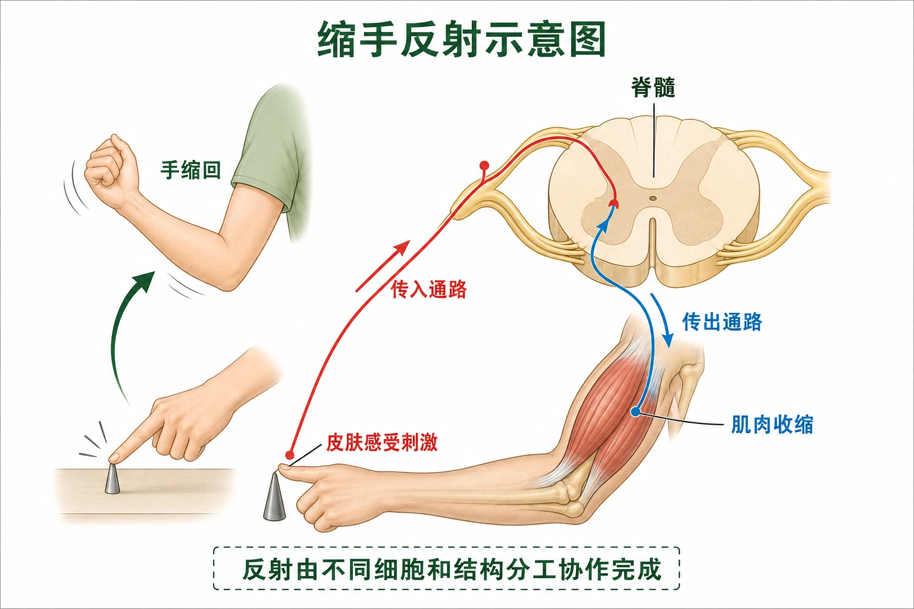
<!-- 图片描述：教材图1-2源图重绘——“缩手反射示意图”。保留原图三部分：左侧人物手指接触尖锐刺激并迅速屈臂，右侧放大脊髓横断面与上肢神经通路，下方保留手部局部；红色箭头表示由皮肤向脊髓传入的信息方向，蓝色箭头表示由脊髓向上肢肌肉传出的信息方向，箭头必须连续并与原图方向一致。只标注“皮肤感受刺激”“传入通路”“脊髓”“传出通路”“肌肉收缩”“手缩回”，不在源图内虚构可辨认的单个中间神经元。图旁解释“反射由不同细胞和结构分工协作完成”，用于支持多细胞生物整体功能依赖细胞协作。 -->

#### 3. 生命系统的结构层次

按由低到高的典型结构层次可写为：

> 细胞 → 组织 → 器官 → 系统（器官系统）→ 个体 → 种群 → 群落 → 生态系统 → 生物圈

教材图示重点强调以下关系：

| 层次 | 组成或判定 | 示例 | 关键关系 |
|---|---|---|---|
| 细胞 | 具有生命活动的基本结构单位 | 叶的表皮细胞、心肌细胞 | 最基本生命系统 |
| 组织 | 形态相似、结构和功能相同或相近的细胞联合 | 保护组织、肌肉组织、神经组织 | 细胞分工协作 |
| 器官 | 多种组织按一定次序联合形成 | 叶、心脏 | 多种组织共同完成较复杂功能 |
| 系统 | 多个器官相互联系、协同完成特定功能 | 血液循环系统、消化系统 | 器官之间的分工协作 |
| 个体 | 多个器官或器官系统组成的完整生物体 | 冷箭竹、大熊猫 | 能独立进行较完整生命活动 |
| 种群 | 一定空间内同种生物所有个体 | 同一片竹林中的冷箭竹 | 同种个体共同构成 |
| 群落 | 一定空间内所有种群的集合 | 池塘生物群落 | 不同种群相互作用 |
| 生态系统 | 群落与无机环境相互作用 | 池塘生态系统 | 生物与非生物环境共同构成 |
| 生物圈 | 地球上所有生态系统的总和 | 全球生物圈 | 最大层次的生命系统 |

层次之间不是简单的“越大越高级”：更高层次的功能来自低层次组分的相互作用，但不能把高层次的特征直接等同于某一个组分的特征。

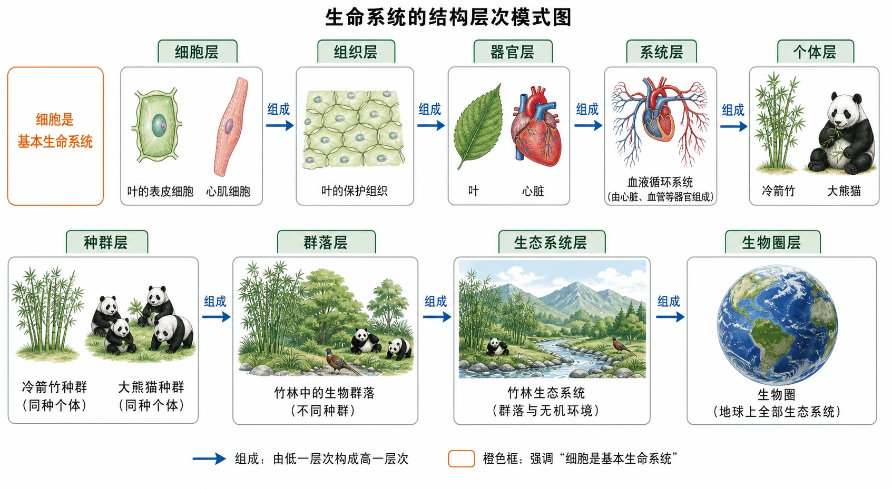
<!-- 图片描述：教材图1-3源图组重绘——“生命系统的结构层次模式图”。按教材原有多面板顺序组织，不把它改成单纯流程图：细胞层显示“叶的表皮细胞”和“心肌细胞”；组织层显示多个叶表皮细胞组成“叶的保护组织”；器官层分别显示“叶”和“心脏”；系统层显示由心脏、血管等器官组成的“血液循环系统”；个体层显示一株“冷箭竹”和一只“大熊猫”；更高层次依次表现同种个体组成种群、不同种群组成群落、群落与无机环境组成生态系统、地球上全部生态系统组成生物圈。相邻面板之间用箭头并标注“组成”，每个面板下写清对象名称，不把植物不存在的“系统层次”强行接入冷箭竹支线。绿色表示生物对象，蓝色表示组成关系，橙色框标出“细胞是基本生命系统”。用于识别层次、实例和组成关系。 -->

### 四、典型模型与分析方法

#### 1. 归纳法

归纳法是由一系列具体事实推出一般结论的思维方法。

| 类型 | 证据范围 | 结论特点 | 示例 |
|---|---|---|---|
| 完全归纳法 | 考察对象的全部情况 | 若观察无误，结论范围与证据一致，可靠性高 | 观察所有类型的植物细胞都含细胞核后作出结论 |
| 不完全归纳法 | 只考察部分情况 | 由部分推整体，结论可能可信但存在例外 | 观察花粉、胚珠、柱头后概括植物细胞具有共同结构 |

科学研究常使用不完全归纳法，因为研究对象数量巨大、情况复杂，不可能观察全部对象。使用时要做到：

1. 样本尽量具有代表性，不能只选支持观点的材料。
2. 观察对象尽量多样，覆盖不同结构、环境和功能类型。
3. 结论范围不能超过证据支持范围太多。
4. 保留可被新证据修正的开放性，不能把“目前未发现例外”写成绝对不可推翻。

#### 2. 生命系统题的判定流程

遇到“某对象是不是生命系统”或“属于哪一层次”的题，可按以下路径：

1. **先判断对象是否有生命活动**：原子、分子等即使是系统，也不是生命系统；病毒没有细胞结构，不能直接套用细胞层次的定义。
2. **再找组成单位**：单个细胞、多种细胞、多种组织、多器官、同种个体、不同种群或生物—环境关系分别对应不同层次。
3. **最后看功能关系**：是否存在相互作用、相互依赖和整体功能，决定其是不是“系统”以及属于哪一层次。

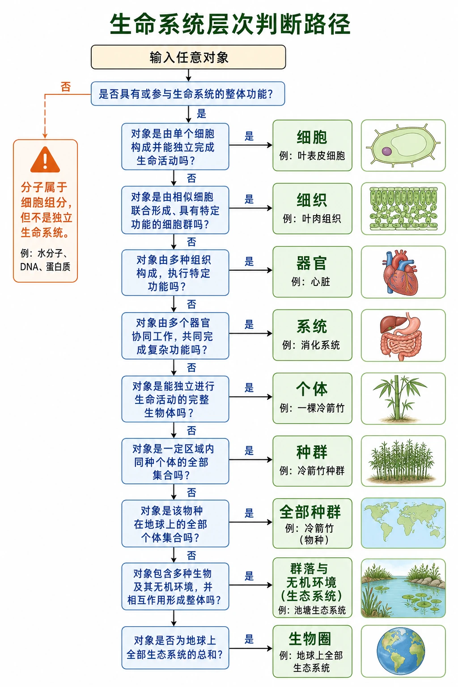
<!-- 图片描述：补充知识图（非教材原图）——“生命系统层次判断路径”。输入任意对象后依次判断：是否具有或参与生命系统的整体功能→对象是单个细胞、相似细胞群、多种组织、多个器官、一个完整生物体、一定区域内同种个体、全部种群，还是群落与无机环境→对应细胞、组织、器官、系统、个体、种群、群落、生态系统；“地球上全部生态系统”指向生物圈。每个出口配叶表皮细胞、心脏、冷箭竹种群、池塘生态系统等例子。蓝色为判断条件，绿色为层次结果，橙色警示“分子属于细胞组分，但不是独立生命系统”。用于训练分类与理由表达。 -->

### 五、图表、实验与证据链

#### 1. 问题探讨：大熊猫与冷箭竹

教材用“大熊猫吃冷箭竹”创设跨物种情境。两者外形和生活方式差异显著，但都由细胞构成。若要提供证据，应：

- 分别取大熊猫和冷箭竹的代表性组织，制作切片或临时装片。
- 用显微镜观察，记录细胞边界、细胞质、细胞核等结构。
- 采用多种组织和重复观察，避免只观察单一部位造成片面结论。
- 以观察图、照片、标注和文字记录作为可复核证据，而不是只说“教材这样讲”。

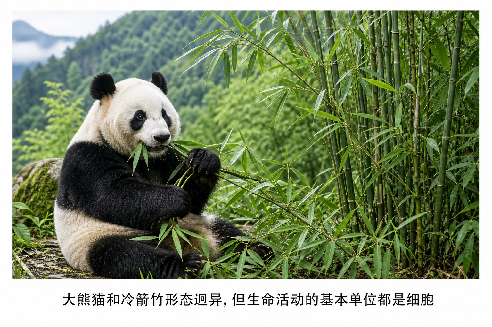
<!-- 图片描述：教材“问题探讨”源图重绘——“大熊猫吃冷箭竹”。忠实绘制自然环境中的大熊猫取食竹叶或竹枝，画面以动物和冷箭竹的宏观形态为主体；仅在图下注明“大熊猫和冷箭竹形态迥异，但生命活动的基本单位都是细胞”，不在照片中添加教材原图没有的显微视野、细胞核或取样流程。图片用于提出“如何取得二者都由细胞构成的证据”这一问题。 -->

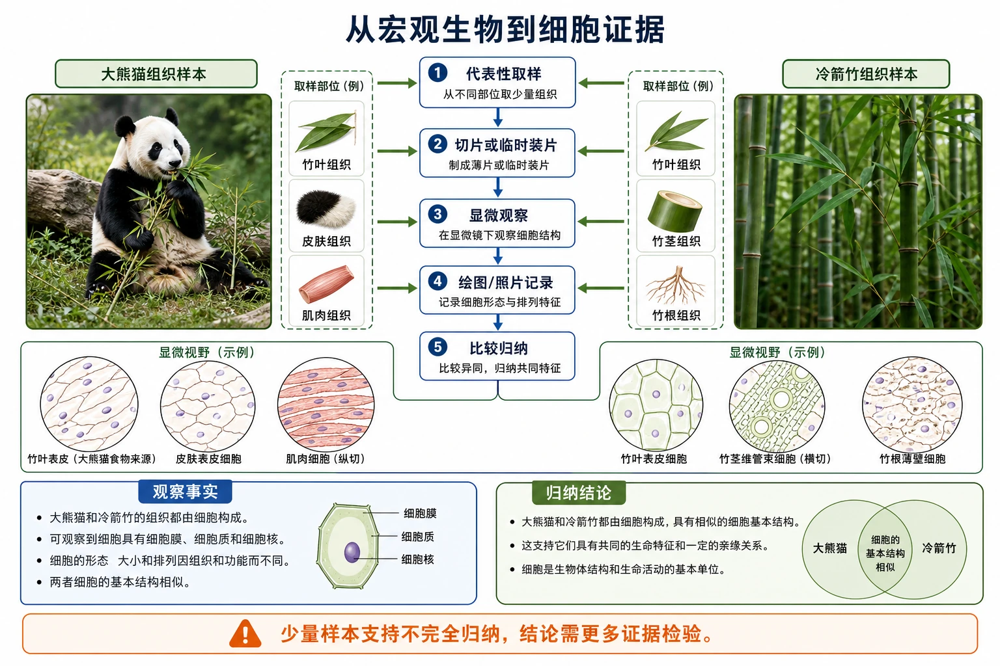
<!-- 图片描述：补充知识图（非教材原图）——“从宏观生物到细胞证据”。左右分别为大熊猫组织样本和冷箭竹组织样本，中间按“代表性取样→切片或临时装片→显微观察→绘图/照片记录→比较归纳”连接；显微视野只标注实际可观察的细胞轮廓、排列和经适当处理可见的细胞核，不把所有细胞都画成相同形态。下方设置“观察事实”与“归纳结论”两栏，橙色警示“少量样本支持不完全归纳，结论需更多证据检验”。用于回答问题探讨中的取证方法。 -->

#### 2. 教材讨论中的科学性判断

“施莱登和施旺观察了部分动植物组织，却归纳出所有动植物由细胞构成”属于不完全归纳。判断结论是否可信，要看：证据是否来自多个代表性对象、是否有不同研究者和技术重复、是否与后续大量观察相符、是否允许新证据修正。不能仅用“观察了部分所以一定错误”，也不能用“结论后来正确所以当时不需要证据”来替代证据分析。

#### 3. 病毒材料的证据边界

病毒一般由核酸和蛋白质组成，没有完整细胞结构，不能独立进行代谢、合成蛋白质和繁殖。它必须进入宿主细胞，利用宿主细胞的物质、能量和酶系统完成增殖。因此，“病毒没有细胞结构”与“病毒的生活离不开细胞”应同时保留。

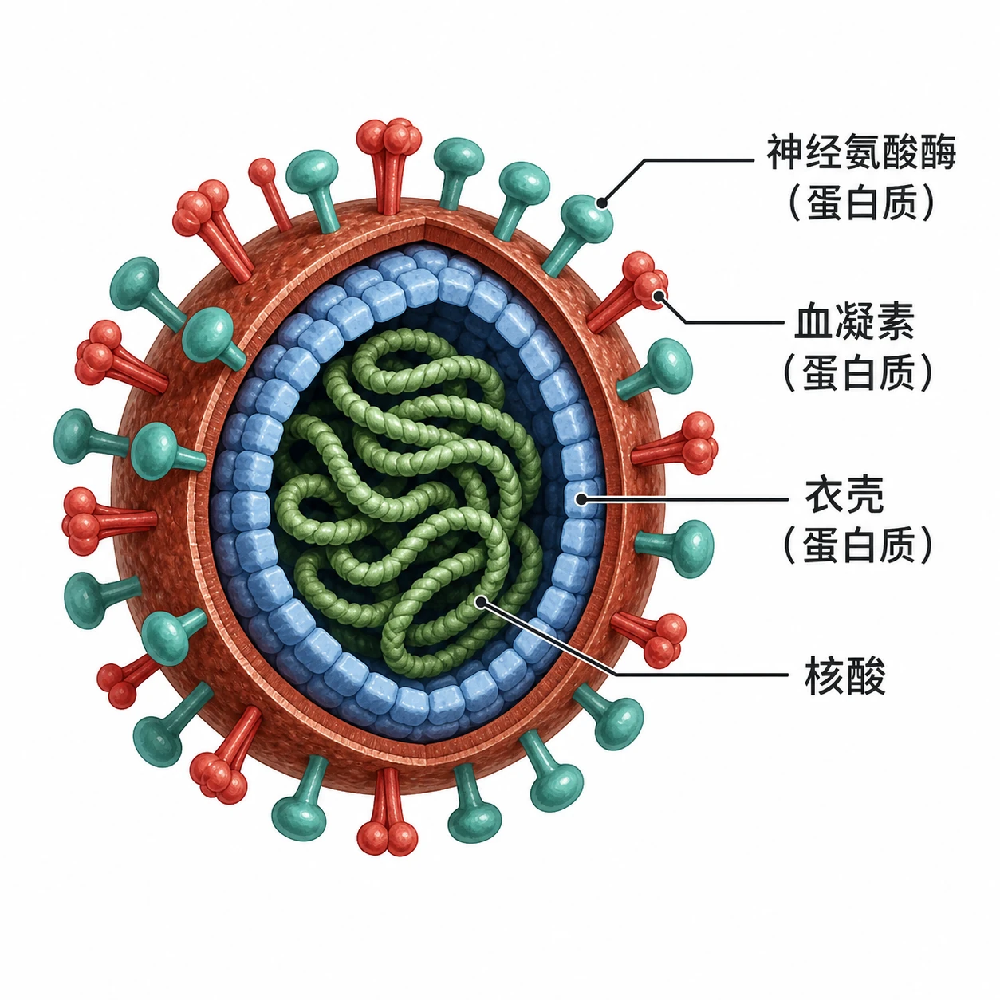
<!-- 图片描述：教材“某种病毒模式图”源图重绘。绘制近球形、有包膜的病毒剖面：内部盘曲结构标注“核酸”，核酸外侧壳层标注“衣壳（蛋白质）”，外表面两类不同形态的突起分别标注“神经氨酸酶（蛋白质）”和“血凝素（蛋白质）”；引线端点必须准确落在相应结构上。保持白底、红褐色包膜、青绿色和红色表面突起的教材式三维结构图，不在该源图中加入宿主细胞或复制流程。用于识别病毒由核酸和蛋白质等构成、没有细胞结构。 -->

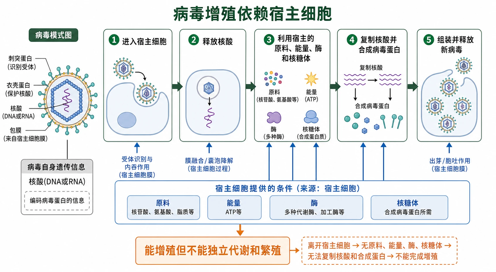
<!-- 图片描述：补充知识图（非教材原图）——“病毒增殖依赖宿主细胞”。左端为上述病毒模式图，依次连接“进入宿主细胞→释放核酸→利用宿主的原料、能量、酶和核糖体→复制核酸并合成病毒蛋白→组装并释放新病毒”；宿主提供的条件用蓝色框，病毒自身遗传信息用灰色，橙色结论框写“能增殖但不能独立代谢和繁殖”。箭头必须标注物质或过程来源，用于解释病毒生活为何离不开细胞。 -->

### 六、题型应用与迁移

常见题型可概括为：

1. **概念判断题**：辨别细胞学说内容、生命系统层次和“细胞相对独立”的含义。
2. **科学史材料题**：按时间顺序提取观察、证据、理论和修正，说明技术进步与科学发现的关系。
3. **层次匹配题**：根据组成单位和相互作用判断细胞、组织、器官、系统、个体、种群、群落、生态系统、生物圈。
4. **实验与证据题**：说明如何证明生物由细胞构成，分析观察对象、样本代表性、重复和结论边界。
5. **综合解释题**：从细胞代谢、细胞增殖分化、遗传物质和细胞协作四个角度解释生命活动离不开细胞。

## 重点梳理

### 1. 细胞学说三句话

“动植物由细胞和细胞产物构成；细胞是相对独立的单位；新细胞由老细胞分裂产生。”答题时要避免把第三条错写成“新细胞从老细胞的细胞核中长出来”。

### 2. 细胞与生命活动的对应关系

| 生命现象 | 细胞层面的依据 |
|---|---|
| 生理活动 | 细胞代谢 |
| 生长发育 | 细胞增殖和分化 |
| 遗传变异 | 细胞内遗传物质的传递和变化 |
| 反射和运动 | 多种细胞的信息传递与协同 |

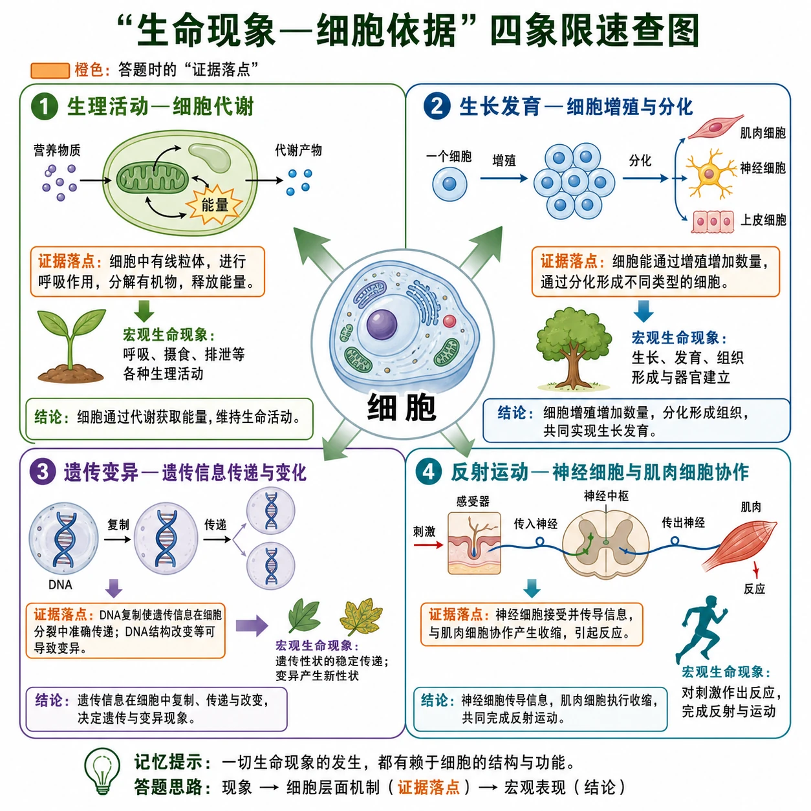
<!-- 图片描述：补充知识图（非教材原图）——“生命现象—细胞依据”四象限速查图。中心为“细胞”，四个象限依次为“生理活动—细胞代谢”“生长发育—细胞增殖与分化”“遗传变异—遗传信息传递与变化”“反射运动—神经细胞与肌肉细胞协作”；每个象限配一个简洁示意和一句完整结论，箭头从细胞层面指向宏观生命现象，橙色标出答题时的“证据落点”。用于考前快速回忆和组织解释题答案。 -->

### 3. 生命系统层次的关键词

“同种个体”对应种群；“不同种群”对应群落；“群落+无机环境”对应生态系统；“所有生态系统”对应生物圈。生态系统中包含非生命的物质和成分，但整个生态系统仍可作为生命系统研究对象。

## 难点突破

### 难点一：相对独立不等于完全独立

单细胞生物的一个细胞可以完成全部基本生命活动；多细胞生物的细胞一般只能完成分工后的部分功能。判断时要看题目对象：草履虫可作为一个独立个体，人体心肌细胞不能独立完成呼吸、消化、运动等全部活动，但仍具有自身代谢和对整体功能的作用。

### 难点二：系统与生命系统的区别

原子、分子可以有相互作用，因而在一定意义上可以称为系统；但它们没有生命活动，不是生命系统。判定“生命系统”必须同时有系统性和生命性。

### 难点三：为什么细胞学说阐明生物界统一性而不是抹去多样性

细胞学说揭示“共同的基本结构和来源”，说明统一性；它并不否认不同细胞的形态、结构和功能差异。统一性是底层共同规律，多样性是具体结构和功能的分化，二者可以同时成立。

### 难点四：不完全归纳如何写出严谨结论

不要写“观察几个样本就能证明所有情况都如此”。应写成：“根据多个具有代表性的观察对象，可以归纳出较可靠的普遍规律；但由于未覆盖全部对象，仍需接受新证据检验，并注意潜在例外。”

## 例题讲解

### 例题1：细胞学说判断

**题目**：下列说法中，符合细胞学说的是（ ）。

- A. 人体每个细胞都能单独完成全部生命活动
- B. 新细胞由老细胞的细胞核直接长出
- C. 动植物体都由细胞和细胞产物构成
- D. 细胞只对自身生命活动有意义，与整体无关

**分析**：先逐项对照细胞学说三条内容。A把“相对独立”扩大为“完全独立”；B是历史上曾出现但后来被修正的错误机制；D否认细胞对整体的作用。只有C与第一条一致。

**答案**：C。

**反思**：看到“独立”要检查是否被偷换成“完全独立”；看到“新细胞产生”要想到“分裂”，而不是“从细胞核长出”。

### 例题2：生命系统层次

**题目**：一片池塘中，所有鲫鱼组成的集合、池塘中全部生物、池塘中全部生物及其无机环境，分别属于什么生命系统层次？

**分析**：

1. 先看组成对象：所有鲫鱼是同种生物的多个个体，属于种群。
2. 池塘中全部生物包含多种生物种群，属于群落。
3. 群落加阳光、水、温度、无机盐等无机环境，属于生态系统。

**答案**：种群、群落、生态系统。

**反思**：题目出现“所有”并不自动等于生物圈，必须看是所有同种个体、所有种群，还是所有生态系统。

### 例题3：科学史证据推理

**题目**：科学家观察了花粉、胚珠和柱头，发现它们都由细胞构成，于是提出植物体由细胞构成。该推理属于哪种归纳？如何评价？

**提取信息**：观察对象只有部分植物结构，结论却推广到植物体整体。

**判断方法**：证据范围小于结论范围，因此是不完全归纳法。

**规范作答**：这种方法在科学研究中常用，结论具有一定可信性，但由于没有观察所有类型的植物细胞，仍可能存在例外；需要更多具有代表性的观察和后续证据检验。

## 易错点整理

| 易错点 | 错误表现 | 纠正方式 |
|---|---|---|
| 把细胞学说写成“所有生命都由细胞构成” | 忽略病毒没有细胞结构 | 教材表述通常为除病毒等外，生物体以细胞为基本单位；病毒生活依赖细胞 |
| 把“相对独立”写成“完全独立” | 认为人体每个细胞都能完成所有生命活动 | 区分单细胞个体与多细胞生物的分化细胞 |
| 把新细胞来源写成“细胞核长出” | 把施莱登早期错误观点当作现代理论 | 现代结论是新细胞由先前存在的细胞分裂产生 |
| 把群落和生态系统混淆 | 只看到“池塘里的生物”就选生态系统 | 有无无机环境是关键区分 |
| 认为科学理论一经提出就不能修改 | 忽视耐格里、魏尔肖的修正 | 科学结论需以证据为基础并接受检验和完善 |

## 考点考证点整理

### 考点一：细胞学说的内容和意义

- 出题思路：给出若干表述或科学史材料，要求判断是否符合细胞学说，或说明细胞学说为何成为生物学基础。
- 关键条件：抓住“动植物”“细胞和细胞产物”“相对独立”“新细胞由老细胞分裂产生”四组关键词。
- 解答要点：先写三条内容，再从动植物共同结构基础、生物界统一性、生命活动研究进入细胞水平等角度写意义。
- 易扣分点：把“新细胞由老细胞分裂产生”写成“由细胞核产生”；把“相对独立”写成“完全独立”；只写“很重要”而不说明具体意义。

### 考点二：细胞学说建立过程中的科学方法

- 出题思路：按时间顺序给出解剖、显微观察和理论修正材料，要求概括科学发现特点。
- 关键条件：区分观察事实、归纳结论和后来修正的机制；注意显微镜等技术对证据获取的作用。
- 解答要点：写出重视观察和实证、由具体事实归纳一般规律、科学交流促进理论形成、理论在新证据下修正完善。
- 易扣分点：只罗列人名年份，不说明证据与结论的关系；把早期错误解释当成细胞学说最终内容。

### 考点三：生命系统结构层次

- 出题思路：给出自然情境、图片或对象集合，判断其所属层次并说明理由。
- 关键条件：看对象的组成单位和相互作用；“同种”“不同种”“无机环境”“所有生态系统”是高频关键词。
- 解答要点：写出层次名称，并补充“由何组成、怎样相互作用、形成何种整体功能”。
- 易扣分点：混淆种群与群落、群落与生态系统；漏写系统中的无机环境；把个体和器官混为一谈。

### 考点四：病毒与细胞的关系

- 出题思路：给出病毒结构图或生活史，要求说明病毒是否属于细胞、为什么依赖细胞。
- 关键条件：病毒一般由核酸和蛋白质组成，没有细胞结构，缺乏独立代谢和繁殖所需的完整系统。
- 解答要点：写出病毒必须进入宿主细胞，利用宿主细胞提供的原料、能量、酶和场所完成核酸复制、蛋白质合成和组装。
- 易扣分点：只写“病毒很小所以要寄生”；把“没有细胞结构”误写成“没有遗传物质”。

## 练习题

### 一、教材问题探讨与思考讨论

1. **教材问题探讨**：如何为“大熊猫和冷箭竹都是由细胞构成的”提供正确且充分的证据？
2. **细胞学说建立过程讨论**：科学家如何通过证据说明动植物体由细胞构成？不完全归纳的结论是否可信？细胞学说主要阐明细胞多样性还是生物界统一性？科学发现有哪些特点？
3. **从细胞视角看生命世界**：说明叶表皮细胞、心肌细胞、光合作用细胞、运输氧的细胞和生殖细胞分别承担什么功能；解释生物圈碳氧平衡与所有生物细胞生命活动的关系。

### 二、教材练习与应用

4. 判断下列事实或证据是否支持细胞是生命活动的基本单位：草履虫能运动和分裂；人体发育离不开细胞分裂和分化；离体叶绿体在一定条件下释放氧气；抓握物体需要神经细胞和肌肉细胞协调配合。
5. 下列与细胞学说不相符的是（ ）。

A. 动植物由细胞构成反映生物界统一性  B. 动植物有共同结构基础  C. 人体每个细胞都能单独完成各项生命活动  D. 新细胞通过已存在细胞分裂产生

6. 观察人体皮肤纵切片和迎春花叶横切片，写出尽可能多的细胞名称及可能功能，比较动物细胞和植物细胞的共同点与区别，并说明皮肤和叶为什么都是器官。

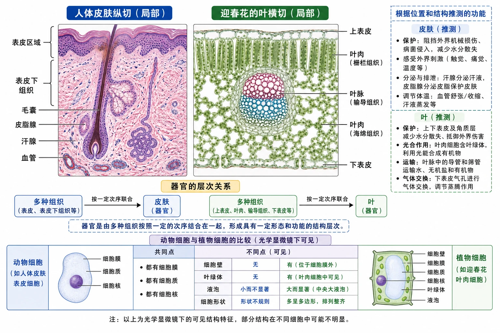
<!-- 图片描述：教材练习源图组重绘——“人体皮肤纵切（局部）”与“迎春花的叶横切（局部）”。左右并列保留两张光学显微切片的真实层状纹理和颜色：左图标出表皮区域、表皮下组织与可辨认的毛囊等结构；右图标出上表皮、叶肉、叶脉或输导组织、下表皮。用实线引线标“图中可直接辨认的结构”，用虚线框另列“根据位置和结构推测的功能”：保护、光合作用、运输等，避免把推测写成直接观察事实。底部用关系式“多种组织按一定次序联合→器官”解释皮肤和叶的器官层次，并列出动物细胞与植物细胞的可见共同点和差异。 -->

7. 用不完全归纳法观察菠菜、天竺葵和柳树的叶肉细胞都有叶绿体。说明该结论的可信性和使用不完全归纳法时的注意事项。
8. 病毒没有细胞结构，为什么生活离不开细胞？
9. 如果新细胞可以一直从无机环境中自然发生，细胞学说是否仍能支持生物进化观点？

### 三、迁移训练

10. 一片森林中“所有松树”“森林中全部生物”“森林中全部生物及阳光、空气、土壤”分别属于什么层次？写出判断依据。

## 练习题答案

1. 分别从两种生物取代表性组织，制作切片或临时装片，用显微镜观察并记录细胞边界、细胞质、细胞核等结构；应观察多个部位、重复实验并保存图像或记录，以提高证据的代表性和可复核性。
2. 解答应形成“解剖揭示器官→组织认识→显微镜观察细胞→资料积累→施莱登、施旺归纳→耐格里和魏尔肖用分裂证据修正”的链条。不完全归纳的结论具有一定可信性，但存在例外可能，需要后续检验。细胞学说突出动物和植物共同的细胞基础，主要阐明生物界统一性，同时不否认细胞多样性。科学发现重视观察实证、需要归纳概括、依赖技术进步，并在新证据下修正完善。
3. 叶表皮细胞主要保护叶片；心肌细胞有节律收缩，参与泵血；叶肉细胞进行光合作用；红细胞运输氧；精子和卵细胞参与有性生殖。碳氧平衡涉及植物细胞光合作用、动物和微生物细胞呼吸以及分解者等多类细胞的物质交换，因此与所有生物细胞的生命活动都有关。
4. （1）支持，草履虫一个细胞即可运动和分裂；（2）支持，发育依赖细胞分裂、分化；（3）不能单独充分支持“细胞是生命活动基本单位”，因为叶绿体是细胞器，且离体条件下的局部功能不等同于完整生命活动；（4）支持，多种细胞协作完成整体运动功能。
5. C。细胞学说强调细胞具有相对独立性和对整体的作用，不等于人体每个细胞都能独立完成全部生命活动。
6. 皮肤可观察到表皮细胞、结缔组织细胞等，具有保护、连接、感受等功能；叶可观察表皮细胞、叶肉细胞、输导组织细胞等，具有保护、光合作用和运输功能。共同点是都有细胞膜、细胞质和遗传物质集中区域等基本结构；区别包括植物细胞通常有细胞壁、叶绿体和较大的液泡，动物细胞通常没有细胞壁和叶绿体。皮肤和叶都由多种组织按一定次序联合，具有特定功能，所以是器官。
7. 这是不完全归纳，结论有一定可信性但不能保证覆盖所有植物、所有叶片和所有细胞。应扩大样本类型和数量、保持样本代表性、重复观察并保留对例外情况的开放态度。
8. 病毒缺少独立代谢、蛋白质合成和复制所需的完整结构系统，必须进入宿主细胞，利用宿主细胞的原料、能量、酶和场所完成增殖。
9. 若细胞可不断从无机环境自然发生，细胞之间的连续来源关系会被破坏，现代细胞与远古细胞的谱系联系难以由“新细胞来自老细胞”解释，细胞学说对生物进化连续性的支持会明显减弱。但这不等于进化观点必然不能成立，还需结合遗传、变异和化石等证据判断。
10. 所有松树是种群；森林中全部生物是群落；森林中全部生物及阳光、空气、土壤是生态系统。判断依据分别是同种个体集合、多个种群集合、群落与无机环境相互作用形成整体。
