# 1.2 细胞的多样性和统一性

## 知识关系导航

- 所属章节：[[章首 学习导图|第一章 走近细胞]]
- 前置知识点：[[1.1 细胞是生命活动的基本单位#细胞是基本的生命系统|细胞是基本的生命系统]]；先认识细胞的基本地位，再观察其具体结构。
- 前置实验方法：[[1.2 细胞的多样性和统一性#高倍显微镜观察的标准流程|高倍显微镜观察流程]]。
- 递进知识点：[[章末 生物科技进展 人工合成生命的探索#真核细胞染色体的重设计|原核细胞、真核细胞与合成生物学]]；细胞分类是理解人工改造生命系统的基础。
- 相关知识点：[[1.1 细胞是生命活动的基本单位#归纳法|归纳法]]；本节实验也要求从多个细胞的观察事实归纳共同结构和差异。

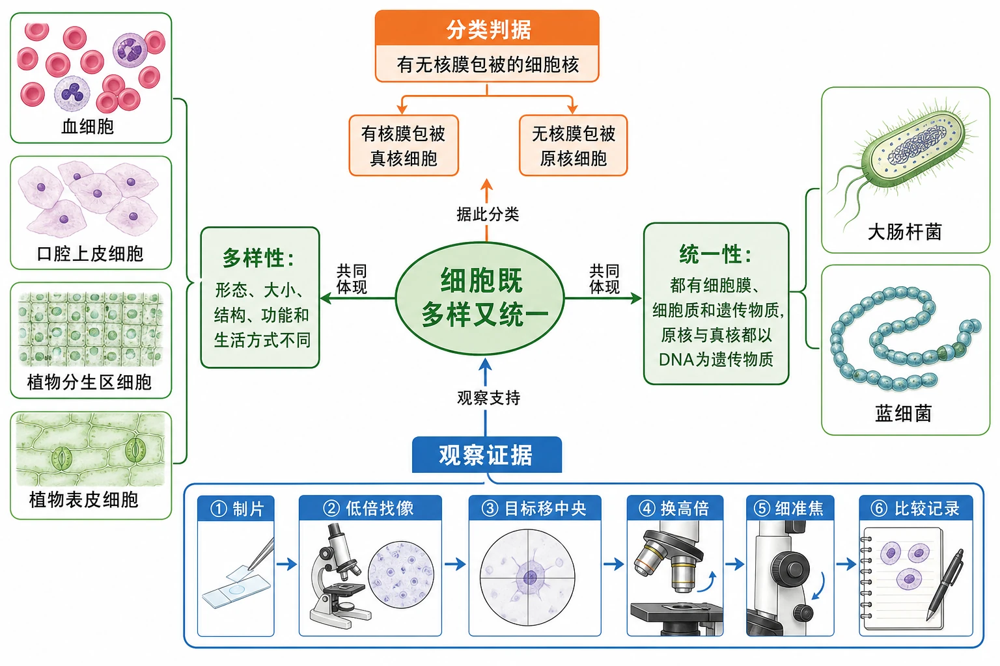
<!-- 图片描述：补充知识图（非教材原图）——本节整体知识信息结构图。中心为“细胞既多样又统一”，左支为“多样性：形态、大小、结构、功能和生活方式不同”，右支为“统一性：都有细胞膜、细胞质和遗传物质，原核与真核都以DNA为遗传物质”，下支为“观察证据：制片→低倍找像→目标移中央→换高倍→细准焦→比较记录”，上支为“分类判据：有无核膜包被的细胞核”。旁侧只放教材涉及的血细胞、口腔上皮细胞、植物分生区细胞、植物表皮细胞、大肠杆菌和蓝细菌小图。绿色表示细胞结构，蓝色表示实验操作，橙色突出分类判据；箭头写清“观察支持”“据此分类”“共同体现”。 -->

## 本节学习目标

学完本节后，应能够：

1. 根据材料和显微图描述细胞的形态、结构、大小和功能差异，并解释结构与功能相适应。
2. 熟练写出高倍显微镜观察细胞的关键步骤、操作顺序和注意事项。
3. 用“有无以核膜为界限的细胞核”区分原核细胞和真核细胞，避免用有无细胞壁、能否光合作用等非根本标准判断。
4. 说出蓝细菌的结构、营养方式、生态影响和与一般细菌的联系。
5. 从细胞膜、细胞质、遗传物质和生命活动基础说明细胞统一性，同时说明差异来源。
6. 能处理显微照片、结构模式图、实验流程图、分类题和实验评价题。

## 核心知识点讲解

### 一、知识对象与生命情境

细胞的多样性首先表现在外形和功能上：神经细胞有长的突起，肌肉细胞适于收缩，红细胞适于运输氧，植物叶肉细胞含有叶绿体并适于光合作用。不同形态不是“随意变化”，而是细胞在遗传信息、发育分化和生活环境影响下形成的结构—功能适应。

细胞的统一性表现在：不同细胞虽然大小、形状和内部结构复杂程度不同，但一般都有细胞膜、细胞质和遗传物质；原核细胞和真核细胞都以DNA作为遗传物质。这种统一性是细胞学说和生物界统一性的具体结构基础。

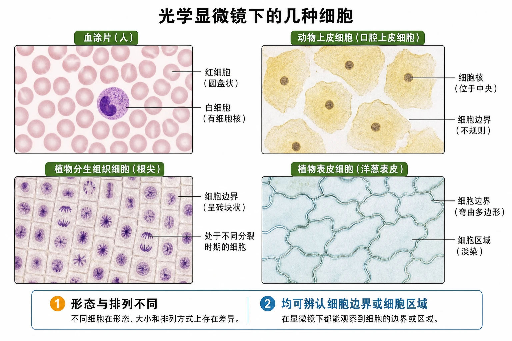
<!-- 图片描述：教材“光学显微镜下的几种细胞”源图重绘。严格保持四宫格显微照片：左上为血涂片，大量粉红色圆盘状红细胞之间可见一个染色较深、带细胞核的白细胞；右上为淡黄色染色的动物上皮细胞，轮廓不规则且中央细胞核较明显；左下为植物分生组织细胞，细胞呈砖块状排列，可见处于不同分裂时期的深染染色体；右下为植物表皮细胞，细胞轮廓弯曲或多边形，排列紧密。每格仅标注从图像可直接识别的对象和特征，不标酵母菌、蓝细菌或遗传物质集中区域。底部比较“形态与排列不同”和“均可辨认细胞边界或细胞区域”，用于从真实观察证据引出细胞多样性。 -->

### 二、核心概念与结构功能

#### 1. 原核细胞与真核细胞

科学家根据细胞内有无**以核膜为界限的细胞核**，把细胞分为两大类：

| 比较项目 | 原核细胞 | 真核细胞 |
|---|---|---|
| 典型生物 | 细菌、蓝细菌、支原体等原核生物 | 植物、动物、真菌等真核生物 |
| 细胞核 | 没有核膜包被的成形细胞核 | 有核膜包被的成形细胞核 |
| 遗传物质存在形式 | DNA位于拟核等区域，通常没有染色体形态的细胞核结构 | DNA主要位于细胞核染色质/染色体中，也可存在于某些细胞器 |
| 细胞器 | 内部结构相对简单，不具有典型膜性细胞器系统 | 具有较复杂的细胞器和内膜系统 |
| 基本共同结构 | 细胞膜、细胞质、DNA等 | 细胞膜、细胞质、DNA等 |
| 生活方式 | 可自养或异养；不同类群差异大 | 可自养或异养；单细胞和多细胞均有 |

“原核”的“原”不是“原始、低等”的简单同义词，“真核”的“真”也不是“更高级”的价值判断。它们首先是细胞核结构的分类术语；进化联系需要结合更多证据，不能只凭字面推断。

#### 2. 蓝细菌的结构和生活方式

蓝细菌属于细菌，是原核生物。其细胞含有藻蓝素和叶绿素，可以进行光合作用，是自养生物；细菌中的许多其他种类营腐生或寄生生活，是异养生物。

蓝细菌细胞通常具有细胞壁、细胞膜和细胞质，没有核膜包被的细胞核，也没有由细胞核定义的染色体结构；环状DNA位于细胞内的拟核区域。

蓝细菌的直径通常比一般细菌大，但多数仍不能用肉眼分辨单个细胞。当蓝细菌以大量细胞群体存在时，才可能被肉眼观察到水华等现象。

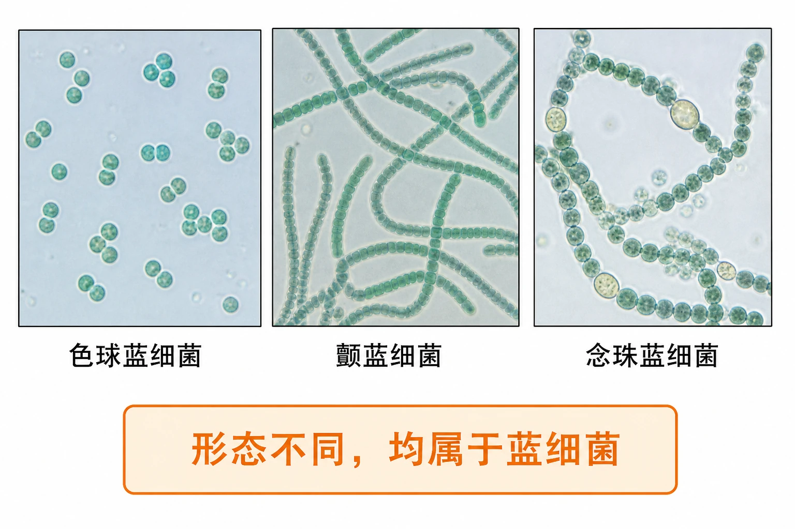
<!-- 图片描述：教材图1-4源图组重绘——“几种蓝细菌”。按原图分为三个显微照片对象：色球蓝细菌表现为分散、成对或小群聚集的近球形细胞；颤蓝细菌表现为由许多短圆柱状细胞连续排列形成的不分枝丝状体；念珠蓝细菌表现为念珠状细胞链，链中可见个别大小或颜色不同的细胞。分别在照片旁标注“色球蓝细菌”“颤蓝细菌”“念珠蓝细菌”，保留显微照片质感和实际形态，不添加原照片不可见的细胞膜、拟核、环状DNA、叶绿素或藻蓝素位置。下方用橙色结论框写“形态不同，均属于蓝细菌”，用于观察同一类原核生物内部的形态多样性。 -->

#### 3. 水华与发菜保护

淡水水域污染导致水体富营养化，蓝细菌和绿藻等大量繁殖，形成水华。水华会影响水质和水生动物生活。答题时要形成完整因果链：

> 水体污染/营养盐增加 → 水体富营养化 → 蓝细菌等大量繁殖 → 水华 → 水质下降并影响水生生物

发菜也是蓝细菌，因过度采挖破坏草地和荒漠生态，已列入国家重点保护生物。这个材料说明：认识细胞并不只是显微镜知识，也可以联系环境保护和生物多样性保护。

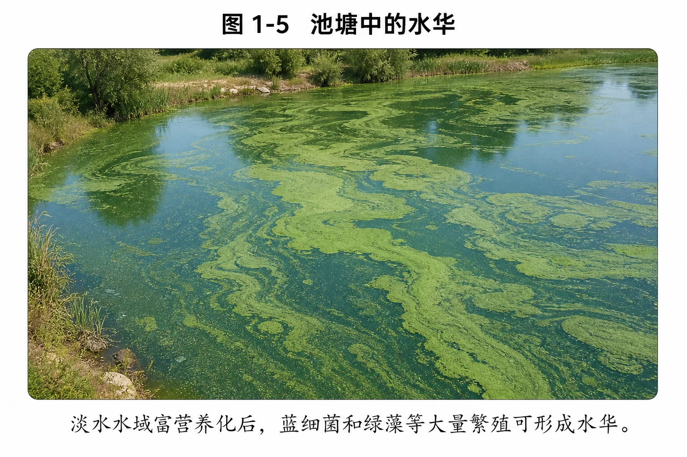
<!-- 图片描述：教材图1-5源图重绘——“池塘中的水华”。写实俯视或斜俯视池塘水面，大面积蓝绿色藻类聚集形成不均匀漂浮层，仍可看见部分水面和岸边环境；图下注明“淡水水域富营养化后，蓝细菌和绿藻等大量繁殖可形成水华”。不要在源图中加入氮磷箭头、溶解氧曲线、发菜或治理图标。图片用于让学生识别水华的宏观现象，并联系蓝细菌以细胞群体大量存在时可被肉眼观察。 -->

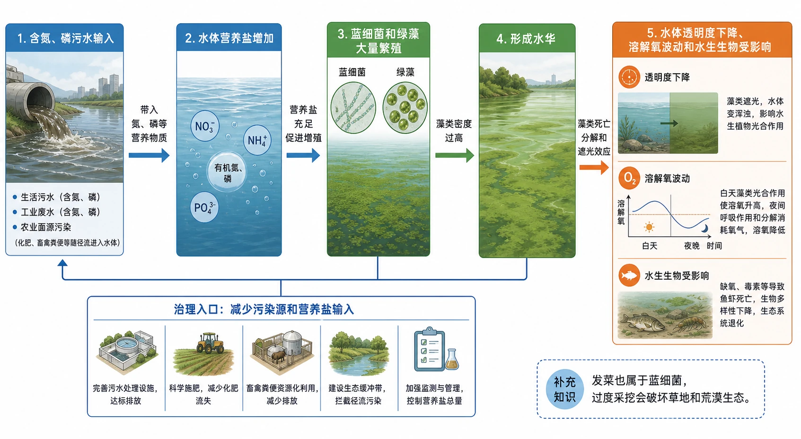
<!-- 图片描述：补充知识图（非教材原图）——“水体富营养化与水华形成的因果链”。从左到右为“含氮、磷污水输入→水体营养盐增加→蓝细菌和绿藻大量繁殖→形成水华→水体透明度下降、溶解氧波动和水生生物受影响”，每条箭头标注因果关系；下方另设“减少污染源和营养盐输入”治理入口。蓝色表示水环境，绿色表示藻类增殖，橙色表示生态后果。右下角以文字补充“发菜也属于蓝细菌，过度采挖会破坏草地和荒漠生态”，但不虚构教材没有提供的发菜照片。 -->

### 三、关键过程、规律与调控机制

#### 1. 高倍显微镜观察的标准流程

教材实验的核心顺序是：

1. **调亮视野**：转动反光镜，使光线适宜、视野明亮。
2. **低倍镜找像**：先用低倍物镜观察，找到清晰目标。
3. **目标移中央**：把要放大的目标移到视野中央。显微镜成倒像，移动玻片的方向与目标在视野中的移动方向相反；实际操作以“目标向中央移动”为准。
4. **换高倍物镜**：转动转换器换成高倍镜，换镜时不要直接用手扳动物镜。
5. **细准焦调焦**：只用细准焦螺旋调节焦距，使图像清晰；高倍下视野变暗、范围变小、观察到的细节增多。

临时装片的制备还包括取材、滴液、展平、盖盖玻片和必要时染色。盖盖玻片时应使其一侧先接触液滴，再缓慢放下，以减少气泡；材料太厚、气泡过多或染色过深都会影响观察。

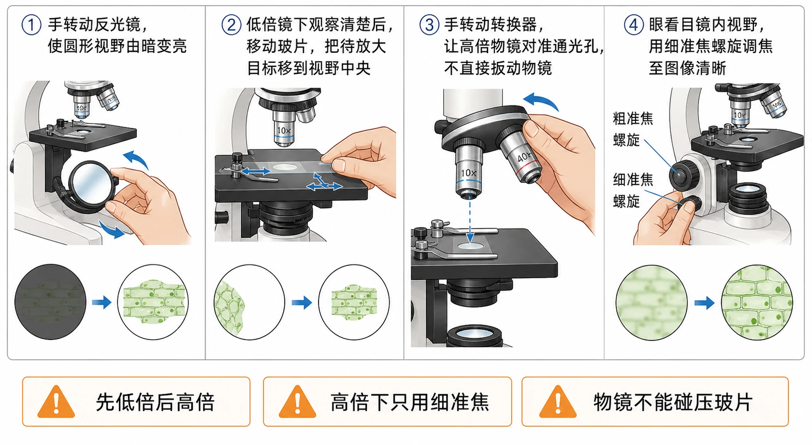
<!-- 图片描述：教材高倍显微镜操作源图组重绘——步骤①至④。四格横向编号：①手转动反光镜，使圆形视野由暗变亮；②低倍镜下观察清楚后，移动玻片，把待放大目标移到视野中央；③手转动转换器，让高倍物镜对准通光孔，不直接扳动物镜；④眼看目镜内视野，用细准焦螺旋调焦至图像清晰。每格保留显微镜局部操作手势和对应视野小图，步骤文字与教材一致。底部另列三条橙色警示：“先低倍后高倍”“高倍下只用细准焦”“物镜不能碰压玻片”。用于形成准确、可执行的操作顺序。 -->

#### 2. 显微镜成像与观察结果判断

显微镜下看到的是倒像。判断玻片移动方向时，应以目标在视野中实际移动到中央为目标，而不是凭肉眼想象“玻片向目标方向移动”。

低倍镜适合找目标、观察整体分布和确定位置；高倍镜适合观察细胞内部细节。换高倍后通常视野变暗、可见范围变小、细胞数目减少但单个细胞变大。若高倍下找不到目标，通常不是“目标消失”，而是低倍时没有将目标准确移至中央，或换镜时发生了位置偏移。

#### 3. 细胞差异的来源

细胞形态结构差异来自多种因素：

- **遗传信息差异或表达差异**：决定细胞可形成何种结构和具有什么功能。
- **细胞分化**：同一多细胞生物中，不同细胞在发育过程中选择性表达基因，形成分工。
- **生活环境差异**：温度、光照、营养、渗透压和生物相互作用会影响细胞结构与生活方式。
- **功能需求差异**：运输、收缩、保护、光合作用和信息传递等功能，对细胞形态和内部结构提出不同要求。

### 四、典型模型与分析方法

#### 1. 原核/真核分类判定流程

看到某种细胞或生物的材料时，按以下顺序判断：

1. 找“核膜包被的细胞核”证据；有则是真核细胞，无则优先判断为原核细胞。
2. 不要把有无细胞壁作为主要依据，因为植物细胞、真菌细胞和许多原核细胞都可能有细胞壁。
3. 不要把能否光合作用作为依据，因为蓝细菌是原核自养生物，植物是真核自养生物。
4. 不要把单细胞/多细胞作为依据，因为真核生物既有单细胞的酵母、草履虫，也有多细胞植物和动物。
5. 若材料提到拟核、环状DNA、没有核膜包被的细胞核，通常指向原核细胞。

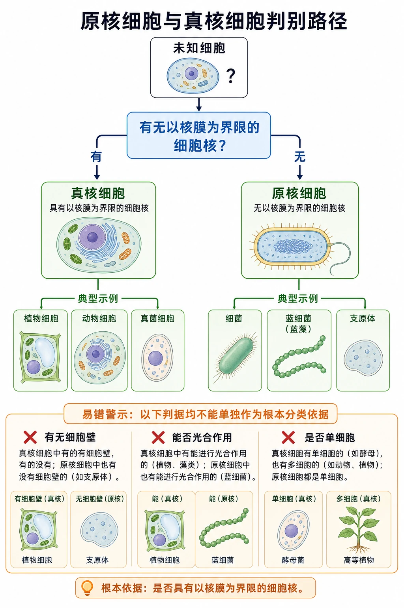
<!-- 图片描述：补充知识图（非教材原图）——“原核细胞与真核细胞判别路径”。起点为未知细胞，第一问加粗“有无以核膜为界限的细胞核？”；“有”指向真核细胞及植物、动物、真菌示例，“无”指向原核细胞及细菌、蓝细菌、支原体示例。下方设置三个错误判据并打叉：“有无细胞壁”“能否光合作用”“是否单细胞”均不能单独作为根本分类依据。蓝色为判断条件，绿色为分类结果，橙色为易错警示。 -->

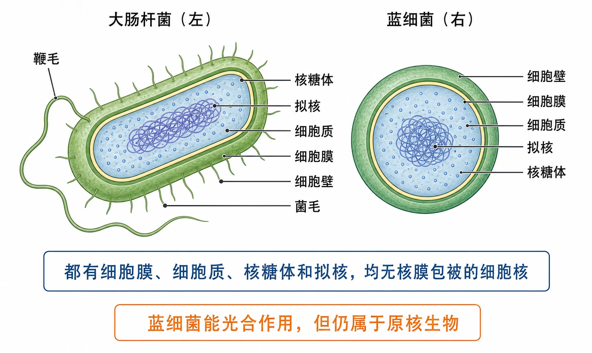
<!-- 图片描述：教材图1-6源图重绘——“大肠杆菌（左）和蓝细菌（右）细胞模式图”。左右并列两个剖面模型。左侧大肠杆菌保持杆状外形，严格标注原图中的“鞭毛、核糖体、拟核、细胞质、细胞膜、细胞壁、菌毛”；右侧蓝细菌保持近球形剖面，严格标注“细胞壁、细胞膜、细胞质、拟核、核糖体”。引线端点准确对应结构，拟核区域不画核膜，核糖体画为细小颗粒。不得在右图增加源图没有标出的叶绿素、藻蓝素或光合膜标签。两图底部用括号总结“都有细胞膜、细胞质、核糖体和拟核，均无核膜包被的细胞核”，橙色注记“蓝细菌能光合作用，但仍属于原核生物”。 -->

#### 2. 细胞多样性与统一性的双向论证

回答“为什么细胞既有多样性又有统一性”时，可以分成两条证据链：

- **统一性证据链**：都有细胞膜、细胞质和遗传物质；原核和真核都以DNA为遗传物质；新细胞来自先前细胞。
- **多样性证据链**：细胞形态、大小、结构和功能不同；原核与真核的核结构和内部系统不同；同一生物中细胞也因分化而不同。

最后落脚到结构功能关系：统一性说明生命有共同基础，多样性说明不同细胞对不同功能和环境形成适应。

### 五、图表、实验与证据链

#### 1. 实验变量与观察记录

本实验的自变量是观察材料/细胞种类，因变量是显微镜下观察到的形态、大小、排列、可见结构等特征，控制变量包括显微镜操作条件、放大倍数、光照、制片质量和观察记录标准。实验目的不是证明“所有细胞完全相同”，而是通过多种材料比较共同点和差异。

观察记录应至少包含：材料名称、制片类型、物镜倍数、视野亮度、细胞形态、排列方式、可见结构、推测功能和可能的误差来源。

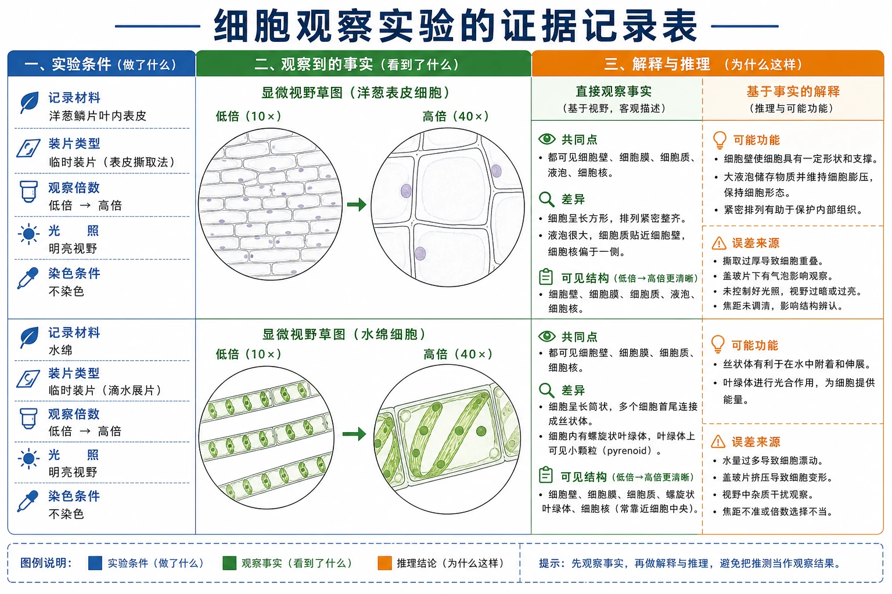
<!-- 图片描述：补充知识图（非教材原图）——“细胞观察实验的证据记录表”。左栏记录材料、装片类型、低倍/高倍、光照和染色条件；中栏为显微视野草图，要求画细胞轮廓、排列、可见结构并填写物镜倍数；右栏分成“直接观察事实”和“基于事实的解释”，依次填写共同点、差异、可能功能和误差来源。蓝色表示实验条件，绿色表示观察事实，橙色表示推理结论，用醒目分隔线防止把推测当成观察结果。 -->

#### 2. 电镜照片与普通光学显微镜观察的比较

教材用大肠杆菌扫描电镜照片和透射电镜照片补充说明：

- 扫描电镜更适合呈现样品表面形貌和立体感。
- 透射电镜通过电子束穿透样品，更适合观察内部超微结构的切面信息。
- 光学显微镜下能观察到的细节受分辨率限制，不能因为“看不到”就断言“没有”。

比较不同显微图时要先看技术和放大倍数，再看形态和结构，避免把制样方式造成的图像差异误判为细胞本身差异。

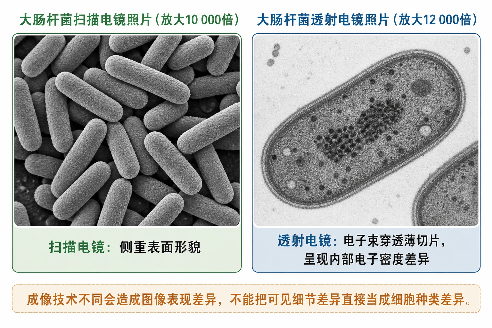
<!-- 图片描述：教材电镜照片源图组重绘——“大肠杆菌扫描电镜照片（放大10 000倍）”与“大肠杆菌透射电镜照片（放大12 000倍）”。左右并列：左图保留多个短杆状细胞的灰度表面立体感和聚集排列，标注“扫描电镜：侧重表面形貌”；右图保留单个或少量杆状细胞切面的灰度层次，标注“透射电镜：电子束穿透薄切片，呈现内部电子密度差异”。分别保留原放大倍数，不伪造统一比例尺，也不添加教材原图没有的光学显微镜第三面板。下方注明“成像技术不同会造成图像表现差异，不能把可见细节差异直接当成细胞种类差异”。 -->

#### 3. 支原体材料的结构分析

支原体是原核生物，结构比许多细菌更简单，通常没有细胞壁，具有细胞膜、细胞质和拟核等基本结构。与动物细胞比较，它没有核膜包被的细胞核和典型真核细胞器；与一般细菌比较，最突出区别是缺少细胞壁。判断支原体属于原核生物的根本依据仍然是没有核膜包被的细胞核，而不是“有没有细胞壁”。

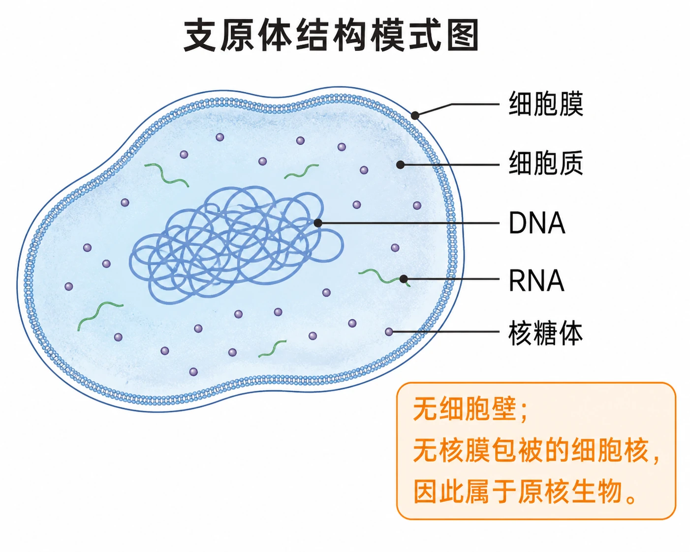
<!-- 图片描述：教材练习源图重绘——“支原体结构模式图”。绘制不规则椭圆形支原体剖面，严格保留并标注源图中的“细胞膜、细胞质、DNA、RNA、核糖体”；外侧只画细胞膜，不画细胞壁，DNA以内部盘曲细丝表示，核糖体以分散小颗粒表示。引线端点与结构准确对应，不把DNA区标成有核膜的细胞核。右下角增加不遮挡主体的橙色结论框：“无细胞壁；无核膜包被的细胞核，因此属于原核生物。”用于依据图中结构比较支原体、动物细胞和一般细菌。 -->

### 六、题型应用与迁移

1. **显微镜操作题**：排序、补步骤、找错误操作、解释高低倍视野变化。
2. **显微图判断题**：从轮廓、排列、可见细胞核/叶绿体、比例尺和放大倍数提取信息。
3. **原核真核分类题**：围绕核膜包被的细胞核这一根本依据判断，并补充结构差异。
4. **多样性与统一性解释题**：先列统一结构，再列形态功能差异，最后用结构与功能相适应解释。
5. **实验分析题**：写出自变量、因变量、控制变量、操作要点、观察事实和结论边界。
6. **社会情境题**：用富营养化—水华—生态影响链分析蓝细菌问题，联系保护发菜和生态保护。

## 重点梳理

### 1. 高倍显微镜四步操作

调亮视野 → 低倍找像 → 把目标移到中央 → 换高倍 → 细准焦调清晰。高倍下不能用粗准焦螺旋，不能直接扳动物镜，不能让镜头碰到玻片。

### 2. 原核与真核的根本区别

是否有**以核膜为界限的细胞核**。原核细胞没有成形的细胞核，DNA位于拟核等区域；真核细胞有核膜包被的细胞核。细胞壁、光合作用能力和是否单细胞都不是根本分类标准。

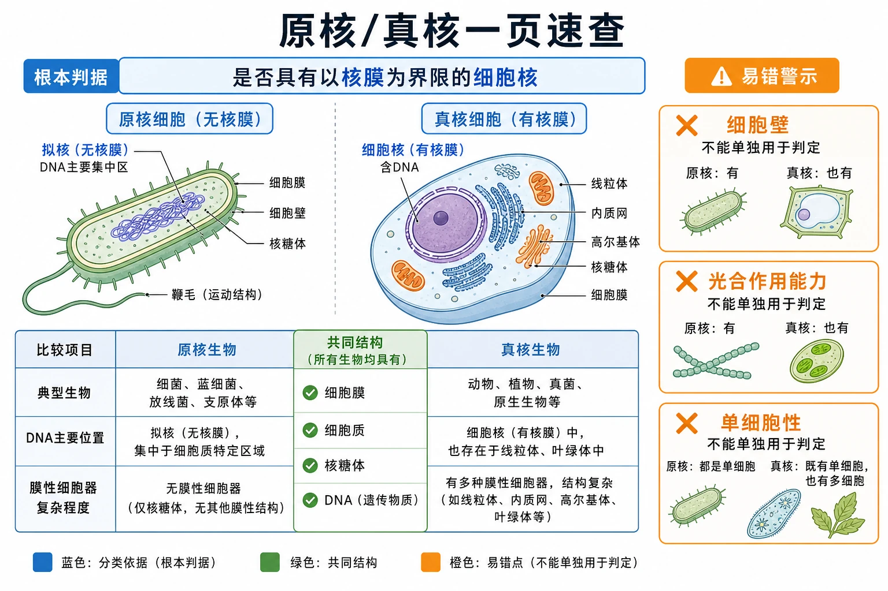
<!-- 图片描述：补充知识图（非教材原图）——“原核/真核一页速查”。上部突出根本判据“是否具有以核膜为界限的细胞核”；下部表格比较典型生物、DNA主要位置、膜性细胞器复杂程度和共同结构；右侧三个警示框写“细胞壁、光合作用能力、单细胞性均不能单独用于判定”。绿色表示共同结构，蓝色表示分类依据，橙色表示易错点，用于选择题前快速核对。 -->

### 3. 统一性与多样性

统一性是共同的结构和遗传基础；多样性是细胞形态、大小、结构和功能的差异。二者并不冲突，差异通常是结构与功能相适应、细胞分化和环境适应的结果。

## 难点突破

### 难点一：细菌没有细胞核吗？

准确表述是：细菌没有**由核膜包被的成形细胞核**，但有遗传物质，DNA位于拟核区域。不能写成“细菌没有DNA”或“细菌没有遗传信息”。

### 难点二：有细胞壁就一定是原核吗？

不是。植物细胞、真菌细胞等真核细胞也可有细胞壁；根本判据仍是核膜包被的细胞核。

### 难点三：蓝细菌为什么能光合作用却不是植物

能否光合作用只说明其具有相关色素和代谢能力，不决定细胞核类型。蓝细菌没有核膜包被的细胞核，属于原核生物；植物有成形细胞核，属于真核生物。

### 难点四：高倍镜下视野变暗怎么办

换高倍后可适当调节光源或反光镜，但应先确认目标已在低倍视野中央，再用细准焦调焦。不要在高倍下用粗准焦螺旋大幅调焦，避免镜头压片和损伤标本。

### 难点五：看不到细胞核能否判断是原核细胞

不能只凭“看不到”判断，因为可能是分辨率不足、染色不佳、焦面不合适或图像模糊。应寻找“没有核膜包被的细胞核”等结构证据，结合模式图、材料文字和观察条件综合判断。

## 例题讲解

### 例题1：原核与真核判断

**题目**：下列判断原核细胞和真核细胞的主要依据是（ ）。

A. 有无细胞壁  B. 能否进行光合作用  C. 有无以核膜为界限的细胞核  D. 是否为单细胞生物

**提取信息**：题目问“主要依据”，不是问任意差异。

**答案**：C。

**反思**：植物细胞有细胞壁，蓝细菌能光合作用，酵母是真核单细胞生物，因此A、B、D都不能作为根本标准。

### 例题2：高倍镜操作排序

**题目**：某同学用显微镜观察叶片细胞，正确操作顺序是什么？

**分析**：高倍镜不是用来“盲目找目标”的。正确顺序是先低倍找到并居中，再换高倍和细调。

**答案**：调亮视野→低倍观察找像→将目标移至视野中央→转动转换器换高倍→用细准焦螺旋调焦。

**反思**：若高倍下目标不见，先退回低倍重新找像并居中，不要随意大幅移动玻片或使用粗准焦。

### 例题3：支原体结构分析

**题目**：支原体没有细胞壁，但有细胞膜、细胞质和DNA。它属于哪类生物？与动物细胞相比有什么不同？

**信息提取**：没有细胞壁不能直接决定原核/真核；要看是否有核膜包被的细胞核。

**推理**：支原体没有成形细胞核，DNA位于拟核，故为原核生物。动物细胞有核膜包被的细胞核和典型真核细胞器；支原体没有这些结构，且无细胞壁。

**答案**：支原体属于原核生物；与动物细胞相比，它没有核膜包被的细胞核和典型真核细胞器，同时没有细胞壁，只有细胞膜、细胞质和拟核等基本结构。

## 易错点整理

| 易错点 | 错误表现 | 纠正方式 |
|---|---|---|
| 高倍镜下用粗准焦 | 图像忽然消失或压片 | 高倍下只用细准焦，换镜前目标必须居中 |
| 把“没有看到细胞核”当作“没有细胞核” | 忽略显微镜分辨率和染色条件 | 结合图像质量与结构证据判断 |
| 用细胞壁判断原核真核 | 把植物和真菌排除在真核外 | 根本标准是核膜包被的细胞核 |
| 用单细胞判断原核 | 认为所有单细胞生物都是原核 | 酵母、草履虫等单细胞生物是真核 |
| 把蓝细菌当成植物 | 看到叶绿素就按植物分类 | 蓝细菌有叶绿素但无成形细胞核，属于原核生物 |
| 把水华归因于水温单一变化 | 漏掉富营养化条件 | 写出污染/营养盐增加→大量繁殖→水华→生态影响 |

## 考点考证点整理

### 考点一：高倍显微镜使用

- 出题思路：给出错误操作、步骤排序或视野变化，要求纠正并解释原因。
- 关键条件：低倍找像、目标居中、再换高倍；高倍下细准焦；观察材料是否合适、是否有气泡。
- 解答要点：按“调亮→低倍找像→移中央→换高倍→细调”作答，并说明高倍视野范围变小、变暗、细节增多。
- 易扣分点：漏写目标居中；写高倍下用粗准焦；把“玻片移动方向”与“像移动方向”混淆；忽略盖片气泡。

### 考点二：原核细胞与真核细胞

- 出题思路：根据结构模式图、材料描述或生物名称进行分类并比较。
- 关键条件：有无核膜包被的细胞核、拟核、环状DNA、典型细胞器等信息。
- 解答要点：先写根本判据，再写共同结构和典型差异；若是蓝细菌、支原体等要联系具体结构。
- 易扣分点：用细胞壁、能否光合作用、单细胞性作主要标准；写“原核没有遗传物质”。

### 考点三：细胞的多样性和统一性

- 出题思路：根据显微照片比较不同细胞，要求归纳共同点、差异及差异原因。
- 关键条件：观察事实与解释要分开；差异要联系结构功能相适应、细胞分化和环境适应。
- 解答要点：统一性写细胞膜、细胞质、遗传物质和DNA；多样性写形态、大小、结构、功能及生活方式差异。
- 易扣分点：只写“都有细胞核”，排除原核细胞；只写结果不解释原因；把“统一”理解成“完全相同”。

### 考点四：水华与蓝细菌生态影响

- 出题思路：给出池塘污染、水华照片或生态保护材料，要求解释成因和后果。
- 关键条件：污染、富营养化、蓝细菌/绿藻大量繁殖、水质和水生生物受影响。
- 解答要点：使用完整因果链，并联系发菜保护和生态文明。
- 易扣分点：只写“蓝细菌太多”；不写富营养化；把水华等同于所有藻类都对生态完全有害。

## 练习题

### 一、教材探究与讨论

1. 说出高倍显微镜观察的步骤和要点。
2. 归纳所观察细胞的结构共同点和差异，分析差异原因。
3. 比较实验中观察到的细胞与大肠杆菌电镜照片的主要区别。
4. 解释“原核细胞”和“真核细胞”中“原”“真”的含义，并说明不能仅凭字面判断进化地位。

### 二、教材练习与应用

5. 判断：真菌和细菌都是原核生物；原核生物中既有自养生物又有异养生物；原核生物都是单细胞生物而真核生物既有单细胞也有多细胞。
6. 草履虫、衣藻、变形虫和细菌都为单细胞生物，它们共有的结构应选什么？

A. 细胞膜、细胞质、细胞核、液泡  B. 细胞壁、细胞膜、细胞质、细胞核  C. 细胞膜、细胞质、细胞核、染色体  D. 细胞膜、细胞质、储存遗传物质的场所

7. 根瘤菌与豆科植物共生，如何根据形态结构区分根瘤菌细胞与植物细胞？
8. 细胞为什么有统一性？多样性怎样产生？
9. 根据支原体模式图，比较支原体与动物细胞、一般细菌的区别，并判断其分类。

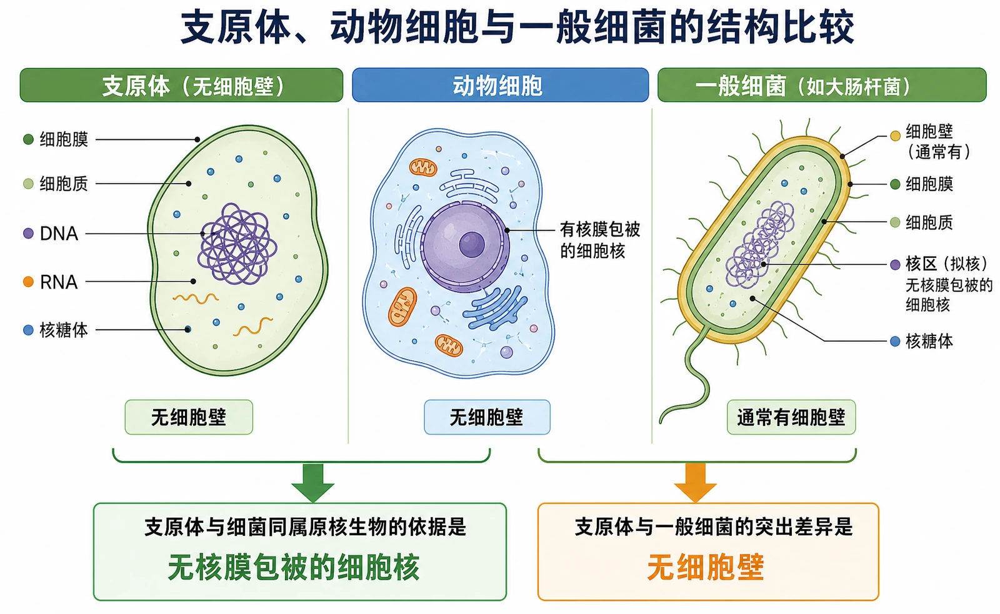
<!-- 图片描述：补充知识图（非教材原图）——“支原体、动物细胞与一般细菌的结构比较”。左栏引用正文中已重绘的支原体结构，列出“细胞膜、细胞质、DNA、RNA、核糖体、无细胞壁”；中栏为动物细胞简图，突出“有核膜包被的细胞核、无细胞壁”；右栏为一般细菌简图，突出“无核膜包被的细胞核、通常有细胞壁”。底部用两个判定箭头区分：“支原体与细菌同属原核生物的依据是无核膜包被的细胞核”，“支原体与一般细菌的突出差异是无细胞壁”。不得把源图重复冒充为第二张教材图片。 -->

### 三、迁移训练

10. 某显微图中细胞边界清楚但看不到细胞核，能否据此判断其为原核细胞？请给出严谨理由。
11. 设计一份观察记录表，比较酵母菌、水绵、保卫细胞和鱼红细胞的共同点与差异。

## 练习题答案

1. 调亮视野；低倍找像；将目标移到视野中央；换高倍；用细准焦螺旋调焦。高倍下不使用粗准焦，换镜时不直接扳动物镜，镜头不能碰压玻片；临时装片要避免气泡和材料过厚。
2. 共同点可写细胞膜、细胞质和遗传物质；真核细胞通常有成形细胞核，原核细胞没有。差异来自遗传信息和表达、细胞分化、生活环境及功能需求等。
3. 光学显微镜观察多为整体轮廓和较大结构，电镜放大倍数和分辨率更高；扫描电镜侧重表面立体形貌，透射电镜侧重内部切面结构。比较时要结合制样和成像技术，不能把“看不到”当成“没有”。
4. “原核”表示细胞没有核膜包被的成形细胞核，“真核”表示有核膜包被的成形细胞核。它们是结构分类术语，不等于简单的高低、先进与落后，进化关系需结合更多证据。
5. 错、对、错。真菌是真核生物；原核生物中既有蓝细菌等自养生物，也有腐生或寄生的异养生物；真核生物中也有酵母、草履虫等单细胞生物。
6. D。四类单细胞生物都具有细胞膜、细胞质和储存遗传物质的场所，但不一定都有核膜包被的细胞核、细胞壁或液泡。
7. 根瘤菌属于原核细胞，没有核膜包被的细胞核，DNA位于拟核，通常没有典型真核细胞器；植物细胞是真核细胞，有成形细胞核，通常有细胞壁、液泡，绿色植物细胞可能有叶绿体。应以核膜包被的细胞核为主要判断依据。
8. 统一性来自共同的细胞基本结构和遗传基础，原核与真核都以DNA为遗传物质；多样性来自细胞形态、结构和功能分化，以及遗传、环境和功能需求的共同作用。
9. 支原体无细胞壁、无成形细胞核，具有细胞膜、细胞质和拟核，属于原核生物；动物细胞有成形细胞核且无细胞壁；一般细菌通常有细胞壁但同样无成形细胞核。支原体与一般细菌的根本共同点是原核结构，突出差别是支原体通常无细胞壁。
10. 不能。看不到可能是分辨率不足、染色不佳、焦面不合适或图像模糊造成的。应结合是否有核膜包被的细胞核、材料文字、放大倍数和结构模式图综合判断。
11. 记录表应有材料、制片方式、放大倍数、细胞形态、排列、可见结构、是否有细胞壁/叶绿体/细胞核、功能推测和误差来源。共同点写细胞膜、细胞质和遗传物质；差异写细胞核、叶绿体、细胞形态和功能等，并区分观察事实与推断。
