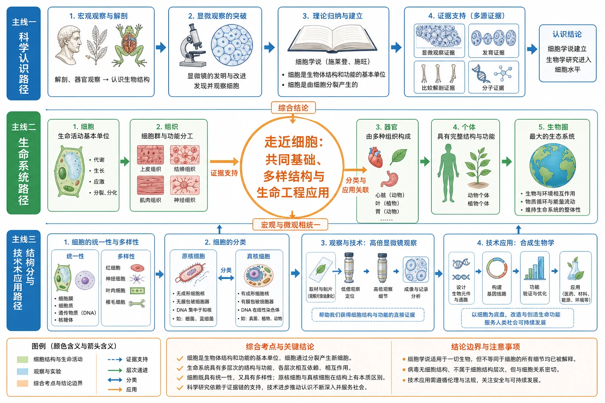
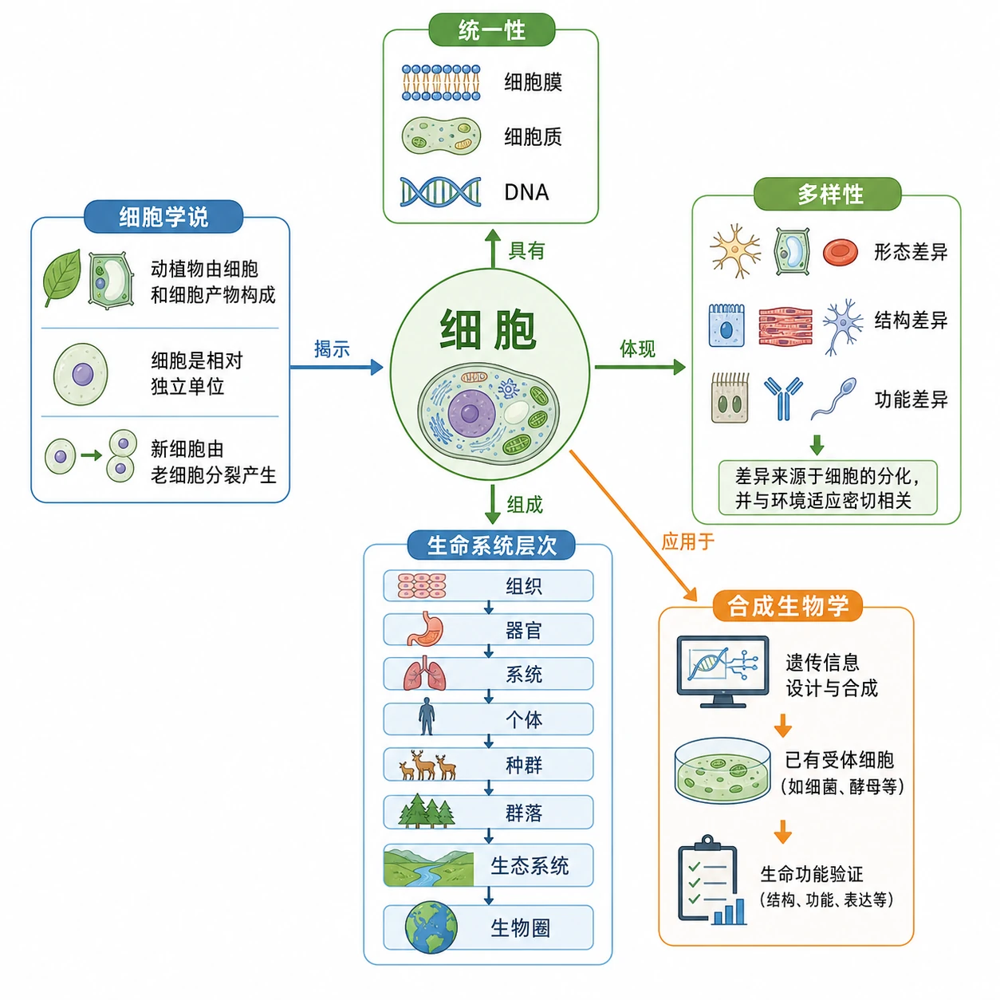
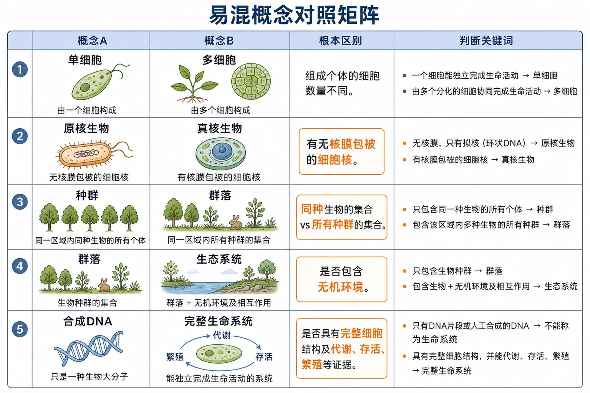
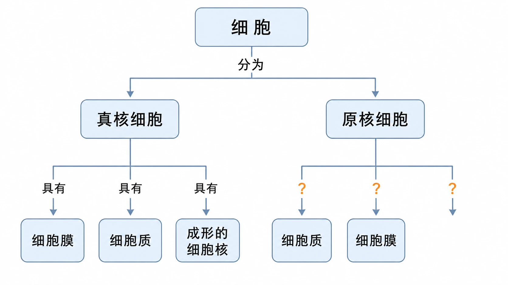
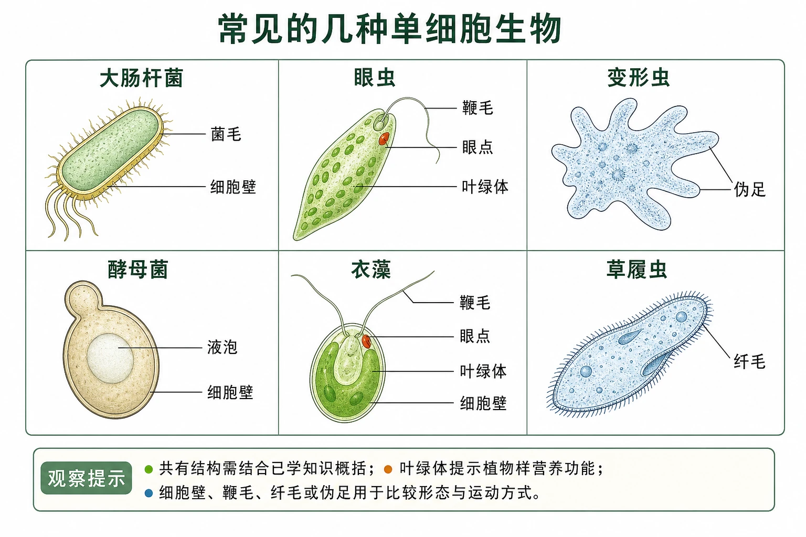
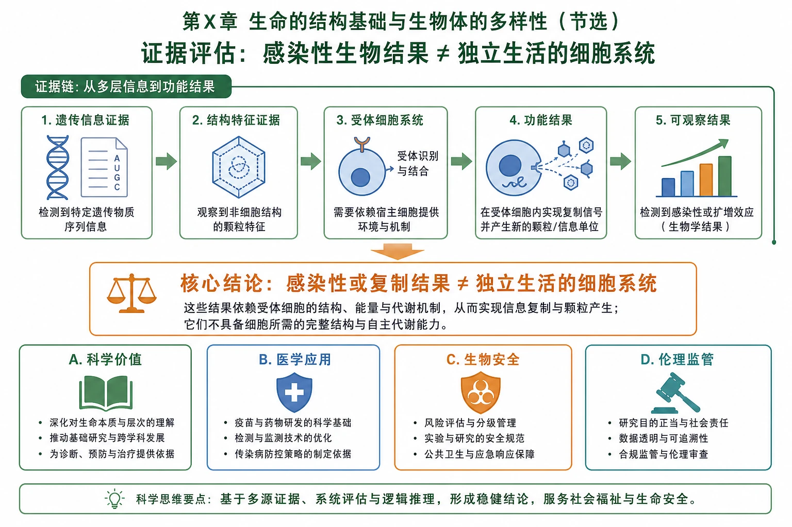

# 章末 整理与提升：走近细胞

## 知识关系导航

- 所属章节：[[章首 学习导图|第一章 走近细胞]]
- 小节一：[[1.1 细胞是生命活动的基本单位|1.1 细胞是生命活动的基本单位]]
- 小节二：[[1.2 细胞的多样性和统一性|1.2 细胞的多样性和统一性]]
- 拓展栏目：[[章末 生物科技进展 人工合成生命的探索|人工合成生命的探索]]

<!-- 图片描述：补充知识图（非教材原图）——本章综合提升图。中心主题为“走近细胞：共同基础、多样结构与生命工程应用”，三条主线并行：科学认识路径由解剖和显微观察进入细胞学说；生命系统路径由细胞经组织、器官和个体延伸到生物圈；结构分类与技术应用路径由细胞统一性和多样性引出原核/真核分类，再连接高倍显微镜观察与合成生物学。用箭头标出“证据支持、层次递进、分类、应用”关系；绿色表示细胞结构与生命活动，蓝色表示观察和实验，橙色表示综合考点与结论边界。 -->

## 本节学习目标

完成本章复习后，应能够：

1. 用一条主线解释“为什么生命活动离不开细胞”。
2. 将细胞学说、细胞多样性与统一性、原核真核分类和生命系统层次建立联系。
3. 独立完成显微镜操作题、图表判读题、科学史材料题、实验分析题和开放评价题。
4. 在答题时区分观察事实、科学推理和超出证据范围的结论。

## 核心知识点讲解

### 一、知识对象与生命情境

本章不是互相孤立的几个知识点，而是一条认识生命的递进路线：

> 先问生命由什么构成 → 用解剖和显微镜获得证据 → 归纳出细胞学说 → 认识细胞既统一又多样 → 用核膜包被的细胞核进行原核/真核分类 → 把细胞放回组织、个体和生态系统 → 进一步尝试人工设计和重构生命系统

### 二、核心概念与结构功能

#### 1. 本章核心概念关系

| 核心概念 | 关键词 | 与其他概念的关系 |
|---|---|---|
| 细胞学说 | 动植物由细胞构成；相对独立；新细胞由老细胞分裂产生 | 解释生物界统一性和细胞连续性 |
| 细胞是基本生命系统 | 代谢、增殖分化、遗传变异、协同 | 解释各层次生命系统以细胞为基础 |
| 细胞多样性 | 形态、结构、功能和生活方式差异 | 与分化、适应和环境有关 |
| 细胞统一性 | 细胞膜、细胞质、DNA等共同基础 | 与细胞学说和生物界统一性相联系 |
| 原核/真核 | 有无核膜包被的细胞核 | 是细胞结构分类的主要依据 |
| 合成生物学 | 基因/染色体设计、细胞重构、功能验证 | 把细胞知识迁移到生命工程实践 |

### 三、关键过程、规律与调控机制

#### 1. 三条复习主线

- **证据主线**：解剖观察→组织认识→显微镜观察→资料积累→科学归纳→理论修正。
- **结构层次主线**：细胞→组织→器官→系统→个体→种群→群落→生态系统→生物圈。
- **结构分类主线**：共同结构和DNA统一性→差异结构和功能→核膜包被的细胞核→原核与真核分类。

#### 2. 图像和材料的统一分析法

任何图、表、照片或材料，都可以按“对象—结构—功能—过程—证据—结论”六步分析：

1. 对象是什么，属于哪一层次？
2. 可直接观察到哪些结构或数据？
3. 这些结构如何支持功能？
4. 是否存在时间顺序或因果过程？
5. 证据来自什么技术、样本和对照？
6. 结论是否超出证据范围？

### 四、典型模型与分析方法

#### 1. 本章综合概念图

<!-- 图片描述：补充知识图（非教材原图）——本章综合概念图。中心节点“细胞”，向左连接“细胞学说”：动植物由细胞和细胞产物构成、细胞是相对独立单位、新细胞由老细胞分裂产生；向上连接“统一性”：细胞膜、细胞质、DNA；向右连接“多样性”：形态、结构、功能差异及其与分化和环境适应的关系；向下连接“生命系统层次”：组织、器官、系统、个体、种群、群落、生态系统、生物圈；右下连接“合成生物学”：遗传信息设计与合成→已有受体细胞→生命功能验证。每条线标注“揭示、具有、组成、依赖、应用于”等关系词。 -->

#### 2. 题型选择路径

- 问“共同结构/统一性”：先找细胞膜、细胞质、DNA，再看核膜和细胞器差异。
- 问“原核/真核”：直接找核膜包被的细胞核证据。
- 问“生命系统层次”：找同种、不同种、无机环境和所有生态系统等关键词。
- 问“高倍镜”：牢记低倍找像、目标居中、换高倍、细准焦。
- 问“科学发现”：按观察—证据—归纳—修正写，不只写人名。
- 问“人工合成生命”：区分遗传信息、细胞系统和生命功能证据。

### 五、图表、实验与证据链

本章的视觉证据可分为五类：

1. **科学史图像**：施莱登、施旺、胡克木栓细胞、维萨里解剖和魏尔肖讲演，服务“技术—观察—理论—修正”。
2. **生命过程图**：缩手反射，服务“多种细胞分工合作”。
3. **结构层次图**：叶表皮细胞、组织、叶/心脏、器官系统、个体、种群、群落、生态系统、生物圈，服务层次判断。
4. **显微与模式图**：高倍镜操作、蓝细菌、大肠杆菌、支原体、病毒，服务结构观察和分类。
5. **人工合成流程图**：必需基因/染色体设计、移植、表达和功能验证，服务生命边界判断。

图片阅读时必须区分“图中直接标出的事实”和“根据事实作出的推断”。例如在显微图中没有看到细胞核，不等于已经证明没有核膜包被的细胞核；必须考虑放大倍数、染色和分辨率。

### 六、题型应用与迁移

#### 1. 综合材料题通用作答模板

> 先判对象和层次 → 再找结构和功能证据 → 再写过程或因果链 → 最后给出有边界的结论

#### 2. 综合实验题通用作答模板

> 目的 → 材料 → 自变量 → 因变量 → 控制变量 → 操作步骤 → 观察事实 → 结论 → 误差与改进

## 重点梳理

### 1. 必背结论

- 细胞是生命活动的基本单位，也是最基本的生命系统。
- 动植物由细胞和细胞产物构成；细胞相对独立；新细胞由老细胞分裂产生。
- 细胞有统一的基本结构和遗传基础，也具有由分化、适应和功能需求造成的多样性。
- 原核与真核的根本区别是有无核膜包被的细胞核。
- 高倍显微镜：低倍找像、目标居中、换高倍、细准焦调清晰。
- 人工合成遗传信息不等于从无到有制造完整生命，生命功能必须在细胞系统中验证。

### 2. 易混对比

| 对比 | 一端 | 另一端 | 判断关键 |
|---|---|---|---|
| 单细胞/多细胞 | 一个细胞完成个体活动 | 多种分化细胞协作 | 看一个细胞是否就是完整个体 |
| 原核/真核 | 无核膜包被的细胞核 | 有核膜包被的细胞核 | 看核膜，不看细胞壁或光合作用 |
| 种群/群落 | 同种个体 | 不同种群 | 看物种组成 |
| 群落/生态系统 | 全部生物 | 全部生物+无机环境 | 看是否包括非生物环境 |
| 合成DNA/人工生命 | 遗传信息 | 能持续代谢和繁殖的完整系统 | 看是否有细胞系统和功能证据 |

<!-- 图片描述：补充知识图（非教材原图）——本章“易混概念对照矩阵”。五行分别比较单细胞/多细胞、原核/真核、种群/群落、群落/生态系统、合成DNA/完整生命系统；每行设置“概念A、概念B、根本区别、判断关键词”四列。原核/真核行用橙框突出“有无核膜包被的细胞核”，种群/群落行突出“同种/所有种群”，群落/生态系统行突出“是否包含无机环境”，合成DNA/完整生命系统行突出“是否具有完整细胞结构及代谢、存活、繁殖等证据”。 -->

## 难点突破

### 难点一：从“细胞是基本单位”推不出“细胞都能独立完成全部生命活动”

“基本单位”强调生命活动以细胞为基础，不代表每个细胞都能完成整个个体的所有功能。单细胞生物可以，人体心肌细胞、神经细胞等分化细胞不可以。

### 难点二：统一性与多样性必须同时作答

只写“都有细胞膜和细胞质”不完整；只写“细胞形态不同”也不完整。完整答案应先写共同结构/遗传基础，再写差异和结构功能相适应、分化、环境适应等原因。

### 难点三：图片证据不能脱离成像条件

显微图不是细胞的全部现实。观察结果受到放大倍数、分辨率、染色、制片和焦面影响。答题时先说“图中观察到”，再说“据此推测”，不要把推测写成直接观察事实。

### 难点四：开放评价题要有边界

关于人工合成生命，最高分答案通常不是绝对赞成或绝对反对，而是结合价值、风险和监管条件给出限定性结论，并说明材料依据。

## 例题讲解

### 例题1：综合选择题

**题目**：下列关于细胞和生命系统的叙述正确的是（ ）。

- A. 原核细胞没有DNA
- B. 有细胞壁的细胞一定是原核细胞
- C. 生态系统不含非生命成分
- D. 细胞是基本的生命系统

**答案**：D。

**分析**：A错，原核细胞有DNA；B错，植物和真菌等真核细胞可有细胞壁；C错，生态系统包括群落和无机环境；D符合本章主线。

### 例题2：显微镜与分类综合题

**题目**：某同学观察未知细胞，低倍下找到目标后未将其移到中央就直接换高倍，结果高倍下找不到目标。该操作错在哪里？若图中显示细胞边界但看不到细胞核，能否判定为原核细胞？

**答案**：换高倍前没有把目标移至视野中央，目标可能因视野范围变小而移出。仅凭看不到细胞核不能判定原核细胞，还需结合分辨率、染色、焦面及核膜结构证据。

### 例题3：综合材料题

**题目**：某研究将人工合成的遗传信息导入去DNA的支原体细胞，细胞可以繁殖。请从结构和功能角度说明该研究与细胞学说的联系。

**答案组织**：人工遗传信息必须在已有细胞结构和代谢系统中表达，说明细胞是生命活动的基本单位；受体细胞仍提供细胞膜、细胞质、核糖体和酶等条件，说明遗传信息与细胞结构共同决定生命活动；新细胞能够繁殖，也体现生命活动依赖细胞系统的连续运行，但不能据此把人工合成遗传信息直接等同于从无到有制造生命。

## 易错点整理

1. 把细胞学说三条内容和意义混为一谈：内容要准确，意义要说明对生物学研究框架的影响。
2. 把“细胞是基本生命系统”误读为“病毒是细胞”或“所有生命都必须有细胞结构”。
3. 用名称、大小、能否光合作用代替核膜包被细胞核进行原核真核判断。
4. 高倍镜下忘记目标居中，或误用粗准焦螺旋。
5. 生态系统层次题漏掉无机环境。
6. 人工合成生命开放题只写价值，不写安全、伦理和证据边界。

## 考点考证点整理

### 考点一：本章概念主线

- 出题思路：将细胞学说、结构层次、原核真核和人工合成材料放在同一情境中综合考查。
- 关键条件：细胞基本地位、共同结构、分类判据、层次关键词和功能证据。
- 解答要点：从对象、结构、功能、层次和证据边界逐层回答，避免只列概念。
- 易扣分点：知识点之间没有关系；把“细胞统一性”写成“所有细胞完全相同”。

### 考点二：图像、实验与证据

- 出题思路：给出显微图、过程图或实验操作图，要求识图、排序、纠错、推理。
- 关键条件：放大倍数、观察范围、核膜、细胞边界、样本和控制变量。
- 解答要点：先描述可观察事实，再说明结构功能关系和结论，写出必要操作顺序。
- 易扣分点：凭图像直觉越过技术条件；把“未观察到”写成“没有”。

### 考点三：生命系统层次综合判断

- 出题思路：用池塘、森林、人体或植物组织等材料考查层次匹配。
- 关键条件：同种/不同种、组织/器官、群落/无机环境、所有生态系统。
- 解答要点：写层次并说明组成与相互作用。
- 易扣分点：种群群落、群落生态系统混淆；忽视生态系统中的非生物成分。

### 考点四：人工合成生命的边界与评价

- 出题思路：给出基因、染色体、病毒或细胞改造材料，要求判断结论和评价研究。
- 关键条件：人工改变对象、受体细胞、代谢/存活/繁殖证据、风险和伦理。
- 解答要点：区分事实、推理和评价；结论不超过材料；提出安全监管条件。
- 易扣分点：把合成核酸等同于制造生命；开放题没有材料依据和条件限定。

## 练习题

### 一、教材复习与提高

1. 细胞学说为生物学奠基的主要原因是它揭示了（ ）。

A. 植物细胞与动物细胞的区别  B. 原核细胞和真核细胞的区别  C. 生物体结构的统一性  D. 生物界细胞的多样性

2. 判断沙眼衣原体是原核生物的主要依据是（ ）。

A. 有细胞壁  B. 有细胞膜  C. 没有线粒体  D. 没有以核膜包被的细胞核

3. 关于生命系统层次，下列错误的是（ ）。

A. 细胞是基本生命系统  B. 草履虫可看作基本生命系统  C. 被子植物和哺乳动物共有细胞、组织、器官、个体层次  D. 生态系统有非生命物质和成分，因此不属于生命系统

4. 细胞是生物体基本结构和功能单位。下列正确的是（ ）。

A. 原核细胞结构简单，所以没有多样性  B. 原核与真核没有统一性  C. 除病毒外，生物体以细胞为基本结构和功能单位  D. 新细胞从老细胞的细胞核中产生

5. 教材“复习与提高”第1题：分析细胞概念图，在原核细胞与“细胞质、细胞膜、成形的细胞核”三条连线旁的“？”处填写适当的连接词。

<!-- 图片描述：教材“复习与提高”第1题源图重绘——细胞概念图填空。保持原图的自上而下树状结构：顶端圆角节点“细胞”，向下通过已写出的关系词“分为”连接左侧“真核细胞”和右侧“原核细胞”；真核细胞下方三个分支的关系词均已写“具有”，分别连接“细胞膜、细胞质、成形的细胞核”；原核细胞下方三个分支分别连接“细胞质、细胞膜”，第三个分支不另设内容框，三个分支线上均保留“？”供填写关系词。所有节点为浅蓝色圆角矩形，连线为浅蓝灰色，问号用橙色强调。不得加入原图没有的“细胞学说、统一性、多样性、生命系统层次、合成生物学”等节点；图片用于填写原核细胞与三种结构之间的关系词并比较原核、真核细胞。 -->

6. 观察几种单细胞生物，回答：它们共有的结构是什么？哪种与绿色开花植物细胞结构和功能类似？哪种与哺乳动物细胞结构和功能类似？眼虫兼具植物和动物特征，从进化角度如何解释？

<!-- 图片描述：教材“复习与提高”第2题源图重绘——“常见的几种单细胞生物”。严格保留六个对象及原图标签：大肠杆菌标“菌毛、细胞壁”；眼虫标“鞭毛、眼点、叶绿体”；变形虫标“伪足”；酵母菌标“液泡、细胞壁”；衣藻标“鞭毛、眼点、叶绿体、细胞壁”；草履虫标“纤毛”。六幅小图按清晰网格排列，各引线准确落到对应结构，不增加原图未标出的细胞核或遗传物质区域。底部设置不遮挡图像的观察提示：“共有结构需结合已学知识概括；叶绿体提示植物样营养功能；细胞壁、鞭毛、纤毛或伪足用于比较形态与运动方式。” -->

7. 人工合成脊髓灰质炎病毒并感染小鼠成功，是否就是人工制造了生命？如何评价这类研究？

<!-- 图片描述：补充知识图（非教材原图；教材第3题只有文字材料）——“人工合成脊髓灰质炎病毒的证据与评价”。上方证据链依次为“人工合成病毒遗传物质→在适宜条件下获得感染性病毒→感染小鼠→出现脊髓灰质炎症状且毒性低于天然病毒”；旁侧单独画宿主细胞并以箭头说明“病毒复制和组装依赖宿主细胞的物质、能量与合成系统”。中央橙色结论框写“人工获得感染性病毒不等于制造可独立生活的细胞生命系统”。下方四栏为“科学价值、医学应用、生物安全、伦理与监管”，每栏只列评价角度，不预设简单赞成或否定。 -->

### 二、综合迁移

8. 某水域出现水华，同时研究者从水样中观察到无核膜包被细胞。请从生态过程、细胞分类和环境治理三个角度回答。
9. 某显微图中植物叶片细胞大小不一、排列紧密并具有共同基本结构。请解释多样性和统一性如何同时存在。
10. 设计一个论证框架，说明“新细胞由老细胞分裂产生”为什么既是细胞学说内容，也是理解生物进化连续性的基础。

## 练习题答案

1. C。细胞学说揭示动植物具有共同的细胞结构基础，体现生物体结构的统一性并推动生物学各分支形成共同基础。
2. D。原核生物没有以核膜包被的细胞核；细胞壁和细胞膜不能作为根本判断依据，缺少线粒体也不是教材规定的主要判据。
3. D。生态系统包含群落和无机环境，整体具有生命系统的结构与功能关系，不能因含非生命成分就排除在生命系统之外。
4. C。A错，原核细胞也有多样性；B错，原核与真核都具有细胞膜、细胞质和DNA等统一基础；D错，新细胞由老细胞分裂产生。
5. 三处依次填写“具有”“具有”“不具有”。原核细胞具有细胞质和细胞膜，但不具有成形的细胞核；真核细胞则具有细胞膜、细胞质和成形的细胞核。答题时应写表达结构关系的动词，不能只写“有/无”而忽略概念图句意。
6. 六种生物共有的基本结构可概括为细胞膜、细胞质和遗传物质。衣藻与绿色开花植物细胞的结构和功能较相似，因为具有细胞壁和叶绿体，能够进行光合作用；变形虫与哺乳动物细胞较相似，因为没有细胞壁和叶绿体，营养方式也不依赖光合作用。眼虫具有叶绿体、能光合作用，又具有鞭毛并能运动，说明植物和动物可能具有共同祖先，随后在进化中发生分化；生物特征之间存在连续性，不能只凭单一结构作绝对分类。
7. 不能简单等同于人工制造完整生命。病毒缺少细胞结构，人工合成其核酸并使其在宿主内产生感染性，说明遗传信息可以被人工构建并在宿主细胞中发挥作用，但仍依赖宿主细胞。研究可促进病毒学和医学发展，同时需关注生物安全、误用和伦理监管。
8. 生态过程：水体污染和营养盐增加导致富营养化，蓝细菌等大量繁殖形成水华，水质和水生动物生活受影响；细胞分类：无核膜包被的细胞属于原核细胞，蓝细菌虽能光合作用仍是原核生物；治理应减少污染源和氮磷输入、改善水体环境、监测蓝细菌群体并保护水生生态系统。
9. 共同基本结构体现统一性；大小、排列、细胞器和功能差异体现多样性。差异可由细胞分化、基因表达、环境和功能需求造成，结构与功能相适应。
10. 论证链：观察到细胞分裂产生两个新细胞→说明新细胞有先前细胞来源→个体生长发育可由细胞增殖和分化解释→现代细胞与远古细胞存在连续谱系联系→遗传信息在传递中发生变化并积累→为理解生物进化提供细胞层面的连续性基础。结论仍需与遗传、变异和化石等其他证据结合。
