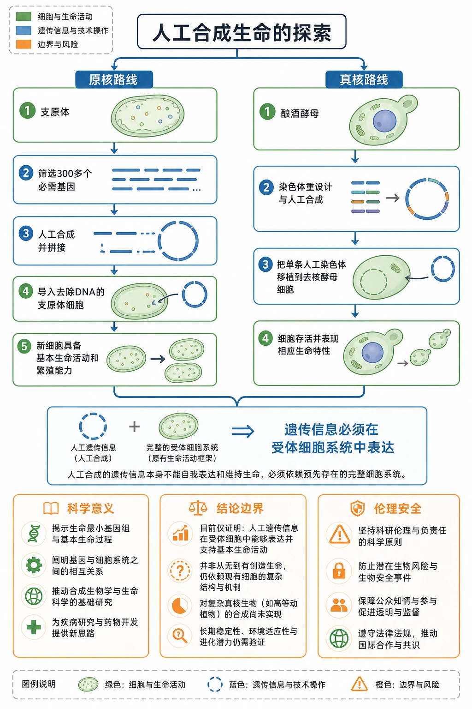
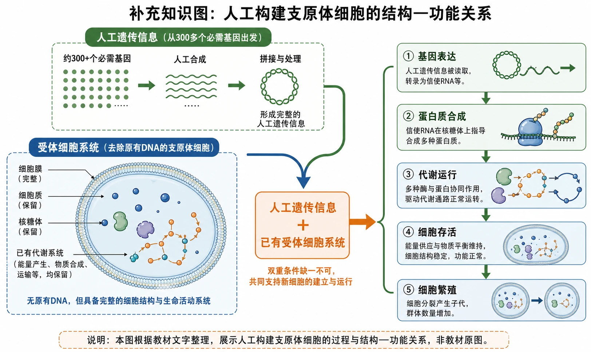
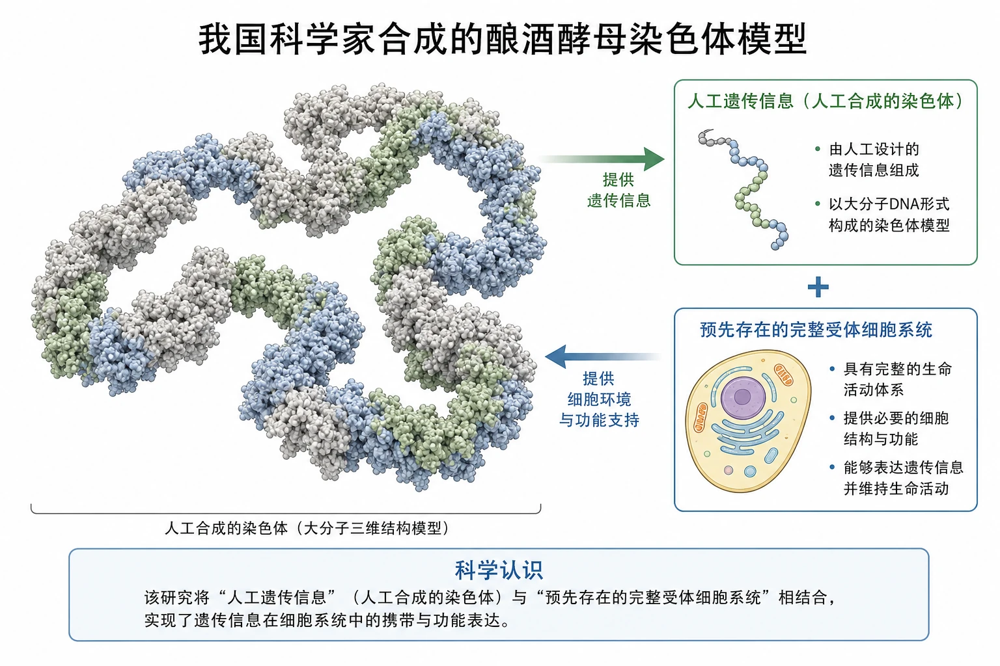
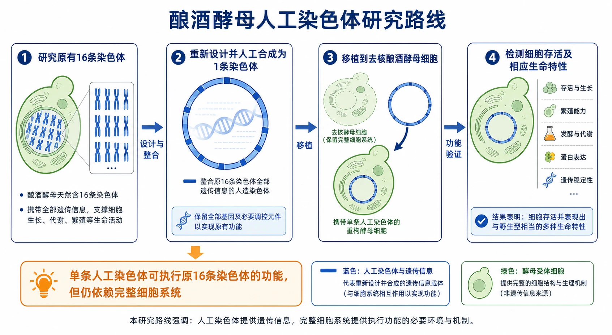
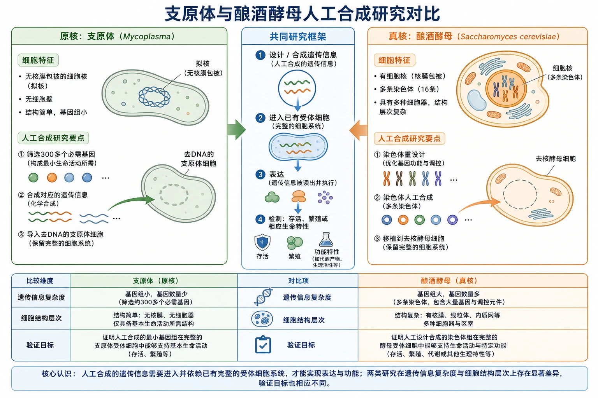
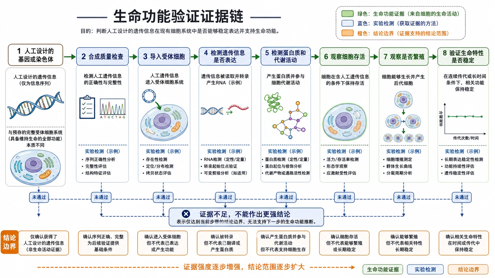
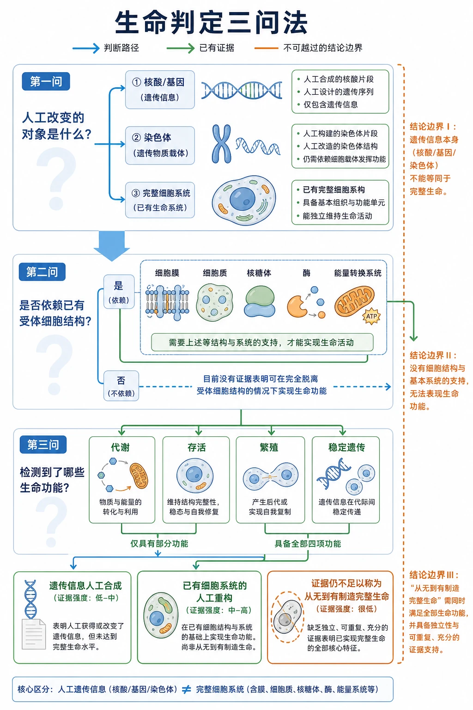
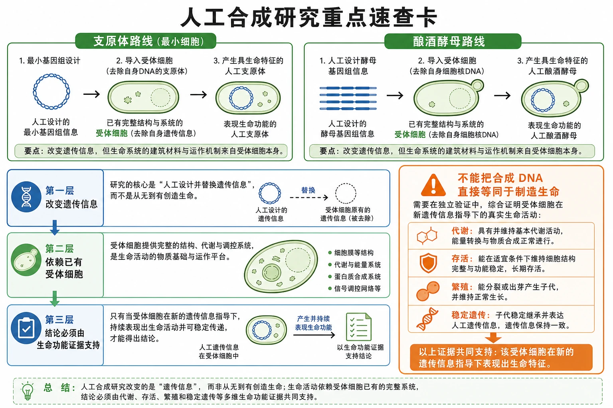

# 章末 生物科技进展：人工合成生命的探索

## 知识关系导航

- 所属章节：[[章首 学习导图|第一章 走近细胞]]
- 前置知识点：[[1.1 细胞是生命活动的基本单位#细胞是基本的生命系统|细胞是基本的生命系统]]；人工合成研究必须以能执行生命活动的细胞系统为载体。
- 前置知识点：[[1.2 细胞的多样性和统一性#原核细胞与真核细胞|原核细胞和真核细胞]]；支原体属于原核生物，酿酒酵母属于真核生物。
- 相关知识点：[[1.2 细胞的多样性和统一性#支原体材料的结构分析|支原体结构分析]]；本栏目把结构知识拓展到基因组和染色体层面。

<!-- 图片描述：补充知识图（非教材原图）——本栏目整体知识信息结构图。中心为“人工合成生命的探索”，左侧原核路线为“支原体→筛选300多个必需基因→人工合成并拼接→导入去除DNA的支原体细胞→新细胞具备基本生命活动和繁殖能力”；右侧真核路线为“酿酒酵母→染色体重设计与人工合成→把单条人工染色体移植到去核酵母细胞→细胞存活并表现相应生命特性”。两条路线共同汇聚到“遗传信息必须在受体细胞系统中表达”。下方设置科学意义、结论边界和伦理安全三个框；绿色表示细胞与生命活动，蓝色表示遗传信息和技术操作，橙色表示边界与风险。 -->

## 本节学习目标

学完本栏目后，应能够：

1. 复述支原体人工合成研究的基本技术路线，理解“必需基因”与细胞生命活动的关系。
2. 区分“人工合成遗传物质”“移植到已有细胞系统”和“从无到有创造完整生命”。
3. 比较原核支原体与真核酿酒酵母在人工合成研究中的不同层次和技术难度。
4. 从科学意义、技术限制、风险控制和伦理规范等角度评价人工合成生命研究。
5. 在材料题中区分事实、推理和价值判断，形成有证据、有边界的论证。

## 核心知识点讲解

### 一、知识对象与生命情境

“人工合成生命”听起来像是把生命从无机物中凭空制造出来，但教材材料实际上展示的是对已有生命系统的遗传信息进行筛选、设计、合成和替换。因此，必须把研究对象拆成三个层次：

- **遗传信息层**：合成、重设计或移植基因和染色体。
- **细胞结构层**：利用去除DNA但仍保留细胞膜、细胞质、酶系统和代谢环境的受体细胞。
- **生命功能层**：观察新系统能否存活、进行基本生命活动并繁殖。

只有当遗传信息能够在合适的细胞结构和环境中被表达，才可能产生可持续的生命活动。单独合成一段核酸，不等于合成了生命。

### 二、核心概念与结构功能

#### 1. 必需基因

支原体可能是最小、最简单的单细胞生物之一。科学家从其基因组中筛选出生命活动不可缺少的300多个基因，这些基因共同构成维持基本生命活动的最小遗传信息集合之一。

“必需”是相对于特定细胞环境、培养条件和生命功能而言的，不代表这些基因在所有生物、所有环境中都是唯一必需的。题目中如果要求严谨，应写“在给定条件下维持基本生命活动所必需”。

#### 2. 受体细胞与遗传信息

人工合成的基因被注入去掉DNA的支原体细胞中。受体细胞仍然提供细胞膜、细胞质、核糖体、酶、能量转换和物质运输等基础系统，人工合成的基因则提供新的遗传信息。二者共同作用，才可能使细胞恢复或获得基本生命活动。

<!-- 图片描述：补充知识图（非教材原图）——“人工构建支原体细胞的结构—功能关系”。左侧是去除原有DNA但保留细胞膜、细胞质、核糖体及已有代谢系统的支原体受体细胞；上方是从300多个必需基因出发，经“人工合成→拼接与处理”形成的遗传信息；两者通过箭头汇合，右侧依次表示“基因表达→蛋白质合成→代谢运行→细胞存活→细胞繁殖”。橙色双条件框写“人工遗传信息＋已有受体细胞系统”，并注明这是根据教材文字整理的过程图，不是教材原图。 -->

#### 3. 真核细胞染色体的重设计

酿酒酵母是真核生物，染色体位于核膜包被的细胞核中，细胞结构和调控系统比支原体复杂。教材介绍了从重新设计一条染色体、人工合成多条染色体，到把16条染色体功能压缩到1条人工染色体并移植到去核酵母细胞的探索。

该研究说明：人工设计可以改变遗传信息的组织形式，但细胞生命功能仍依赖完整的真核细胞结构、表达调控和代谢系统。研究的突破不等于“已经完全从无机物制造出任意真核生命”。

<!-- 图片描述：教材科技进展源图重绘——“我国科学家合成的酿酒酵母染色体模型”。忠实重绘源图中的单个三维大分子模型：整体为不规则弯曲、折叠并盘绕的棒状或链状空间结构，表面呈密集颗粒和沟槽质感，使用灰白、浅蓝和淡绿色表现不同区域；白色背景，保留科研模型的立体光照与复杂纹理。图题写“我国科学家合成的酿酒酵母染色体模型”。不得在这张源图中加入酵母细胞核、16条染色体、1条人工染色体、移植箭头或存活结果，因为这些属于正文文字信息而非原图可见内容。图片用于让学生识别研究对象是人工染色体模型。 -->

<!-- 图片描述：补充知识图（非教材原图）——“酿酒酵母人工染色体研究路线”。四格依次为“研究原有16条染色体→重新设计并人工合成为1条染色体→移植到去核酿酒酵母细胞→检测细胞存活及相应生命特性”，箭头标注“设计与整合”“移植”“功能验证”。蓝色表示染色体和遗传信息，绿色表示酵母受体细胞，橙色结论框写“单条人工染色体可执行原16条染色体的功能，但仍依赖完整细胞系统”。该图负责解释教材文字过程，与上一张源图分开。 -->

<!-- 图片描述：补充知识图（非教材原图）——“支原体与酿酒酵母人工合成研究对比”。左栏原核支原体：无核膜包被的细胞核、筛选300多个必需基因、导入去DNA支原体细胞；右栏真核酿酒酵母：有细胞核和多条染色体、染色体重设计与人工合成、移植到去核酵母细胞。中间共同框架为“设计/合成遗传信息→进入已有受体细胞→表达→检测存活、繁殖或相应生命特性”。底部比较遗传信息复杂度、细胞结构层次与验证目标，不使用“已从无到有制造生命”的表述。 -->

### 三、关键过程、规律与调控机制

#### 1. 支原体研究路线

可以把教材材料整理为以下过程：

1. 选择支原体这一结构相对简单、基因组较小的单细胞生物作为研究对象。
2. 研究其基因，筛选出维持基本生命活动不可缺少的基因。
3. 对这些基因进行人工合成、拼接和处理。
4. 将人工合成的遗传信息注入去掉DNA的支原体受体细胞。
5. 观察新细胞是否具有基本生命活动和繁殖能力。
6. 根据存活、代谢、繁殖和遗传稳定性等证据评价设计是否有效。

这是一条“信息设计—细胞重构—功能验证”的技术链，任何一环失败，都不能仅凭“DNA已合成”得出生命被人工制造的结论。

#### 2. 真核酵母研究路线

酿酒酵母研究更复杂，技术路线可概括为：

> 染色体功能分析 → 重新设计 → 分段人工合成 → 组装/移植 → 观察细胞存活与相应生命特性

“一条人工染色体执行原来16条染色体的功能”强调的是遗传信息组织和功能整合的突破，但不代表真核细胞的全部复杂调控已经被完全掌握。

<!-- 图片描述：补充知识图（非教材原图）——“生命功能验证证据链”。左端为人工设计的基因或染色体，依次经过“合成质量检查→导入受体细胞→检测遗传信息是否表达→检测蛋白质和代谢活动→观察细胞存活→观察是否繁殖→验证生命特性是否稳定”。每一步以箭头连接，并在失败节点旁标注“证据不足，不能作出更强结论”。绿色表示生命功能证据，蓝色表示实验检测，橙色表示结论边界，用于训练材料题的证据强度判断。 -->

### 四、典型模型与分析方法

#### 1. 判断“是否人工制造了生命”的三问法

面对类似材料，可以连续追问：

1. 人工改变的是什么？是基因、染色体，还是完整细胞结构？
2. 生命活动由什么系统完成？受体细胞是否仍然提供了原有的细胞结构和代谢系统？
3. 是否有功能证据？是否能存活、代谢、繁殖，并把相应特性稳定传递？

如果只是合成病毒核酸或某段DNA，不能直接等同于从无到有制造完整生命；如果是将人工遗传信息导入已有细胞，表述应更谨慎，如“人工构建了具有基本生命活动能力的细胞系统”或“人工改造了生命系统”。

<!-- 图片描述：补充知识图（非教材原图）——“生命判定三问法”。第一问“人工改变的对象是什么？”分为核酸/基因、染色体、完整细胞系统；第二问“是否依赖已有受体细胞结构？”旁列细胞膜、细胞质、核糖体、酶和能量转换系统；第三问“检测到了哪些生命功能？”分列代谢、存活、繁殖和稳定遗传。末端按证据强度输出“遗传信息人工合成”“已有细胞系统的人工重构”或“证据仍不足以称为从无到有制造完整生命”。蓝色表示判断路径，绿色表示已有证据，橙色表示不可越过的结论边界。 -->

#### 2. 材料题的事实—推理—评价三层作答

材料题不要把三类句子混在一起：

- **事实**：科学家合成了哪些基因或染色体，把它们移植到什么细胞，细胞是否存活和繁殖。
- **推理**：说明基因与细胞结构共同决定生命活动，人工设计可改变生命系统的遗传信息组织。
- **评价**：研究可能推动疾病研究、药物研发和基础生命科学，但需关注生物安全、生态风险、伦理边界和监管。

### 五、图表、实验与证据链

#### 1. 研究意义

- 认识维持生命活动所需的最小遗传信息和基本细胞系统。
- 研究基因功能及其组合关系，推进基因组学和合成生物学。
- 为药物研发、疾病模型、工业生物技术和定向改造生物提供基础。
- 通过设计—合成—验证，检验生命系统的结构与功能关系。

#### 2. 研究边界与风险

人工合成生命研究不能只用“能不能做”评价，还要问“是否安全、是否必要、谁来监管、可能造成什么生态后果”。应特别考虑：

- 合成生物体或遗传信息是否可能逃逸并影响生态系统。
- 人工改造是否会产生不可逆后果或被滥用。
- 实验是否有封闭条件、监测机制和应急预案。
- 研究成果的公开、专利、资源分配和生命伦理问题。

### 六、题型应用与迁移

1. **技术流程题**：按“基因筛选—合成—导入—表达—存活—繁殖”复述步骤。
2. **结构功能题**：说明受体细胞为什么不能被去掉，以及遗传信息和细胞系统如何协同。
3. **概念边界题**：区分合成核酸、人工改造细胞和从无到有制造完整生命。
4. **比较题**：比较原核支原体和真核酵母研究的细胞结构、遗传信息复杂度和技术难度。
5. **开放评价题**：从科学意义、技术限制、生物安全、伦理和监管提出有依据的观点。

## 重点梳理

### 1. 人工合成生命的核心逻辑

人工合成的遗传信息不能脱离细胞系统单独完成生命活动；生命表现来自遗传信息与细胞结构、代谢、表达和环境的协同。

### 2. 两条研究路线

| 路线 | 研究对象 | 关键操作 | 功能证据 | 认识边界 |
|---|---|---|---|---|
| 支原体 | 原核单细胞生物 | 筛选必需基因、合成并导入去DNA细胞 | 基本生命活动和繁殖 | 不是从无机物直接造出细胞 |
| 酿酒酵母 | 真核单细胞生物 | 染色体重设计、人工合成和移植 | 存活及相应生命特性 | 仍依赖完整真核细胞系统 |

<!-- 图片描述：补充知识图（非教材原图）——“人工合成研究重点速查卡”。上方用两条并列流程概括支原体路线与酿酒酵母路线，下方三层框总结“改变遗传信息”“依赖已有受体细胞”“结论必须由生命功能证据支持”。右侧橙色框写“不能把合成DNA直接等同于制造生命”，并列出代谢、存活、繁殖和稳定遗传四个验证维度。采用教材式白底、黑灰线、绿色细胞、蓝色遗传信息和橙色结论边界。 -->

### 3. 评价开放性研究的答题框架

表态不是答案主体。高质量作答应包含：

> 观点 → 材料事实 → 科学意义/潜在价值 → 风险与限制 → 安全和伦理条件 → 有边界的结论

## 难点突破

### 难点一：人工合成基因为什么不等于人工合成生命

基因只是遗传信息的一部分。生命活动还需要细胞膜维持边界、细胞质提供反应场所、核糖体合成蛋白质、酶催化代谢、能量系统维持运行以及能复制和表达的整体网络。只有把遗传信息放入合适的细胞系统并验证功能，才能讨论生命系统被重构。

### 难点二：为什么选择支原体作为起点

支原体是较小、较简单的单细胞生物，基因组和细胞结构相对简单，便于筛选必需基因和进行功能验证。但“简单”不等于“没有生命系统”，恰恰因为它仍能代谢和繁殖，才适合研究维持生命的最低条件。

### 难点三：为什么人工合成酵母染色体是重大突破但不是终点

真核细胞包含细胞核、多个染色体和复杂调控系统。重新设计一条或多条染色体并使其在酵母细胞中发挥功能，说明人类能在更复杂的遗传信息层面进行设计；但生命特性仍由整个细胞系统共同实现，不能据此宣称已经任意制造真核生命。

### 难点四：开放题如何既支持又不绝对化

可以支持研究的科学价值，同时提出安全和伦理条件；也可以强调风险，但不能否定所有研究。关键是把观点建立在材料事实和可检验条件上，避免只写“我赞成/我反对”。

## 例题讲解

### 例题1：技术路线与结论边界

**题目**：科学家筛选支原体中必需基因并人工合成，将其导入去掉DNA的支原体细胞，新细胞能进行基本生命活动并繁殖。该研究说明了什么？能否说科学家已经从无机物制造了生命？

**提取信息**：人工合成的是基因；受体仍是去掉DNA但保留细胞结构的支原体细胞；有存活和繁殖证据。

**推理**：遗传信息与细胞结构共同决定生命活动；人工设计的遗传信息能在受体细胞系统中表达并支持基本生命功能。

**结论**：不能简单说从无机物制造了完整生命，因为研究仍利用了已有的细胞结构和生命系统。更严谨的表述是人工构建或重构了具有基本生命活动能力的细胞系统。

### 例题2：支原体与酿酒酵母比较

**题目**：比较支原体必需基因研究和酿酒酵母人工染色体研究的共同点与不同点。

**答案组织**：

- 共同点：都对遗传信息进行人工设计或合成，并将其置于已有细胞系统中，通过观察存活和生命特性验证功能。
- 不同点：支原体是原核生物，结构和基因组相对简单，研究重点是筛选维持基本生命活动的必需基因；酿酒酵母是真核生物，有核膜包被的细胞核和多条染色体，研究涉及染色体重设计、合成和复杂调控，技术难度更高。

### 例题3：研究价值与伦理评价

**题目**：你是否赞成人工合成生命研究？

**规范作答**：原则上支持在严格监管和风险可控条件下开展研究。材料表明该研究可帮助认识必需基因、理解细胞生命活动并推动药物和生物技术发展；但人工改造的遗传信息可能带来生物安全、生态释放和伦理风险，因此应设置封闭实验、风险评估、全过程监测、应急预案和伦理审查。结论应是“支持有边界、有监管、有明确科学目的的研究”，而不是无条件支持或否定。

## 易错点整理

| 易错点 | 错误表现 | 纠正方式 |
|---|---|---|
| 把人工合成DNA等同于制造生命 | 忽略受体细胞和生命功能验证 | 分开遗传信息层、细胞结构层和功能层 |
| 认为去掉DNA后细胞什么都没有 | 忽略受体细胞保留的细胞膜、细胞质、核糖体和代谢系统 | 写清“去DNA但保留细胞系统” |
| 把“必需基因”理解成所有生命都通用 | 忽略特定细胞和培养条件 | 写“在特定条件下维持基本生命活动所必需” |
| 认为酵母染色体合成等于创造完整真核生物 | 忽略真核细胞整体调控 | 说明遗传信息仍需依赖完整细胞系统 |
| 开放题只有态度没有论据 | 只写赞成或反对 | 按事实—意义—风险—条件—结论作答 |

## 考点考证点整理

### 考点一：人工合成支原体的技术路线

- 出题思路：给出基因筛选、合成、移植和功能结果，要求排序、概括或解释。
- 关键条件：支原体较简单；筛选必需基因；合成拼接；导入去DNA受体细胞；观察基本生命活动和繁殖。
- 解答要点：写出“遗传信息设计—受体细胞重构—功能验证”三阶段，并说明受体细胞仍提供生命活动的基础系统。
- 易扣分点：漏写去DNA受体细胞；只写“合成基因后产生生命”；不写存活和繁殖等功能证据。

### 考点二：人工合成生命的概念边界

- 出题思路：给出人工合成病毒、基因或染色体的案例，要求判断是否人工制造生命。
- 关键条件：改变对象、是否利用已有细胞、是否具有完整生命活动和繁殖能力。
- 解答要点：区分合成遗传物质、改造细胞和从无到有制造完整生命；结论要与材料证据范围相匹配。
- 易扣分点：把“能感染/能复制核酸”直接等同于完整生命；使用“完全制造”这类超出材料的绝对表述。

### 考点三：合成生物学研究的意义与风险

- 出题思路：开放评价研究价值、是否支持研究或如何监管。
- 关键条件：科学价值包括认识生命、药物研发和生物技术；风险包括生物安全、生态影响、滥用和伦理。
- 解答要点：观点明确，有材料事实支撑，同时提出风险评估、封闭条件、伦理审查、监测和应急预案。
- 易扣分点：只谈意义不谈风险；只谈风险不谈研究价值；把个人态度当成完整论证。

## 练习题

1. 复述支原体人工合成研究的完整流程，并说明每一步的目的。
2. 为什么合成300多个必需基因后还要将其导入去DNA的支原体细胞？
3. 解释“人工合成遗传信息”“人工重构细胞系统”“从无到有制造完整生命”三者的区别。
4. 比较支原体和酿酒酵母人工合成研究的共同点和差异。
5. 2018年酿酒酵母人工合成单条染色体并移植到去核细胞后仍能存活，这一事实支持什么结论？不能支持什么结论？
6. 你是否赞成开展人工合成生命研究？请按“观点—事实—意义—风险—条件—结论”写一段答复。

## 练习题答案

1. 选择支原体→研究并筛选必需基因→人工合成、拼接和处理→导入去掉DNA的支原体受体细胞→观察基因是否表达、细胞是否存活→检测是否能进行基本生命活动和繁殖→评价设计效果。每一步分别对应对象选择、信息识别、遗传信息构建、细胞重构和功能验证。
2. 基因是遗传信息，不能脱离细胞结构独立完成生命活动。去DNA的受体细胞仍提供细胞膜、细胞质、核糖体、酶和能量系统，人工基因只有进入该系统并被表达，才能检验其生命功能。
3. 人工合成遗传信息是获得基因或染色体；人工重构细胞系统是把人工信息置于已有细胞结构和代谢系统中并使其运行；从无到有制造完整生命则意味着不依赖已有生命细胞，独立构建能够持续代谢、繁殖和遗传的完整系统。教材材料主要属于前两类，不能直接推出第三类。
4. 共同点是都对遗传信息进行人工设计或合成，并在已有细胞系统中验证功能。支原体为原核生物，结构和基因组相对简单，研究必需基因；酿酒酵母为真核生物，有细胞核和多条染色体，涉及染色体重设计，调控复杂度和技术难度更高。
5. 支持人工设计和合成的染色体可以在真核细胞中表达并维持一定生命特性，说明遗传信息组织可以被重新设计。不能据此说明已经从无机物制造完整真核生命，也不能说明只要合成一条染色体就能脱离细胞系统独立生活。
6. 示例：原则上赞成在严格监管和风险可控条件下开展。材料显示该研究能够帮助认识必需基因和细胞生命活动，并服务药物与生物技术；但遗传改造可能带来生物安全、生态释放和伦理风险。因此应实行封闭实验、风险评估、全过程监测、伦理审查和应急预案，支持有明确目的且风险可控的研究，而不是无条件支持。
