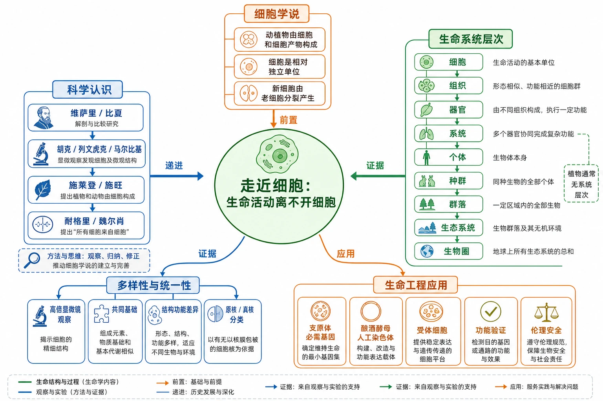

# 第一章 走近细胞｜章首学习导图

## 本章学习主线

本章围绕一个中心问题展开：**生命活动为什么离不开细胞？**

先从解剖学、显微镜和科学史证据中建立细胞学说，再把细胞放进生命系统的层级结构中；随后通过高倍显微镜观察，认识不同细胞的形态和功能差异，并用核膜包被的细胞核把细胞分为原核和真核两大类；最后把细胞结构与遗传信息的关系迁移到人工合成生命和合成生物学，理解设计遗传信息仍必须依赖完整的细胞系统。

<!-- 图片描述：补充知识图（非教材原图）——本章总知识结构图。中心主题“走近细胞：生命活动离不开细胞”，左侧分支为“科学认识”：维萨里/比夏→胡克/列文虎克/马尔比基→施莱登/施旺→耐格里/魏尔肖，箭头写“观察、归纳、修正”；上方分支为“细胞学说”：动植物由细胞和细胞产物构成、细胞是相对独立单位、新细胞由老细胞分裂产生；右侧分支为“生命系统层次”：细胞→组织→器官→系统→个体→种群→群落→生态系统→生物圈，并注明植物通常无系统层次；下方分支为“多样性与统一性”：高倍显微镜观察、共同基础、结构功能差异、原核/真核分类；最右下为“生命工程应用”：支原体必需基因、酿酒酵母人工染色体、受体细胞、功能验证和伦理安全。箭头分别标“前置、递进、证据、应用”；绿色表示生命结构与过程，蓝色表示观察和实验，橙色表示关键结论与边界。 -->

## 章节文件导航

### 第一节：细胞是生命活动的基本单位

[[1.1 细胞是生命活动的基本单位|进入 1.1 细胞是生命活动的基本单位]]

核心任务是回答“细胞为什么是生命活动的基本单位”：学习细胞学说三条内容、科学史建立过程、归纳法、细胞代谢/增殖分化/遗传变异/细胞协作与生命系统层次。

### 第二节：细胞的多样性和统一性

[[1.2 细胞的多样性和统一性|进入 1.2 细胞的多样性和统一性]]

核心任务是通过显微镜观察回答“细胞为什么既相似又不同”：掌握高倍镜操作，比较细胞结构，用核膜包被的细胞核区分原核与真核，理解蓝细菌、水华、支原体和电镜图像。

### 章末科技进展：人工合成生命的探索

[[章末 生物科技进展 人工合成生命的探索|进入 人工合成生命的探索]]

核心任务是把细胞学说和细胞结构知识迁移到合成生物学：理解必需基因、去DNA受体细胞、酿酒酵母人工染色体，以及“人工合成遗传信息”不等于“从无到有制造完整生命”的边界。

### 章末整理与提升

[[章末 整理与提升|进入 章末整理与提升]]

用于全章概念图、易混对比、综合题型、教材复习提高和跨小节迁移训练。

## 核心知识关系

### 1. 证据与理论：从观察到细胞学说

人体解剖先揭示器官和组织层次；显微镜让人们看见细胞；不同科学家不断积累细胞结构和形态资料；施莱登和施旺把植物、动物证据归纳为共同理论；耐格里和魏尔肖用细胞分裂证据修正新细胞来源。这个关系链说明科学发现不是单次观察的产物，而是技术进步、证据积累、归纳概括和理论修正共同作用的结果。

### 2. 结构与功能：细胞是基本生命系统

细胞内部各组分相互配合，才能完成代谢、增殖、分化、遗传和信息传递；多细胞生物中，不同细胞又通过分工协作形成组织、器官和器官系统。因此“细胞相对独立”与“细胞相互依赖”共同解释了生命系统的运行。

### 3. 统一与多样：从共同基础到结构分类

细胞膜、细胞质和DNA等共同基础体现统一性；形态、结构、大小、功能、生活方式和内部复杂程度的差异体现多样性。原核与真核的分类抓住“有无核膜包被的细胞核”这一核心结构差异，但不能因此否认两者在细胞膜、细胞质和DNA上的统一性。

### 4. 实验与结论：先事实，后推理

高倍显微镜实验提供“看到什么”的证据；结构与功能、分类和生命系统层次是“如何解释”的推理；细胞学说、细胞统一性和合成生物学结论必须与证据范围匹配。答题时始终区分观察事实、推理结论和可能的进一步假设。

### 5. 基础与应用：从细胞学说到合成生物学

支原体和酿酒酵母的人工合成研究把本章知识推进到应用层面：遗传信息可以被设计和合成，但它必须在已有或重构的细胞系统中表达，且要通过存活、代谢、繁殖等功能证据验证。应用研究同时引出安全、生态和伦理边界。

## 复习路径

1. 先背准细胞学说三条内容和原核/真核根本判据。
2. 再用“细胞代谢—增殖分化—遗传物质—细胞协作”解释生命活动离不开细胞。
3. 画出生命系统层次，并用“同种、不同种、无机环境、所有生态系统”做层次判断。
4. 练习高倍显微镜操作顺序，掌握低倍找像、目标居中、换高倍、细准焦。
5. 做显微图和结构模式图时，先记录观察事实，再解释结构功能。
6. 最后用人工合成生命材料题检验“遗传信息—细胞系统—生命功能—结论边界”四层推理。

## 本章高频考点索引

| 考点 | 主要承载文件 | 答题抓手 |
|---|---|---|
| 细胞学说三条内容与意义 | [[1.1 细胞是生命活动的基本单位#细胞学说的三条核心内容|1.1]] | 动植物、相对独立、分裂产生；统一基础和研究视角 |
| 科学发现的过程 | [[1.1 细胞是生命活动的基本单位#细胞学说建立的历史链条|1.1]] | 观察、证据、归纳、修正、技术进步 |
| 生命系统层次 | [[1.1 细胞是生命活动的基本单位#生命系统的结构层次|1.1]] | 同种/不同种/无机环境/所有生态系统 |
| 高倍显微镜 | [[1.2 细胞的多样性和统一性#高倍显微镜观察的标准流程|1.2]] | 低倍找像、目标居中、换高倍、细准焦 |
| 原核与真核 | [[1.2 细胞的多样性和统一性#原核细胞与真核细胞|1.2]] | 有无核膜包被的细胞核 |
| 水华和蓝细菌 | [[1.2 细胞的多样性和统一性#水华与发菜保护|1.2]] | 富营养化→大量繁殖→水华→生态影响 |
| 人工合成生命边界 | [[章末 生物科技进展 人工合成生命的探索#判断“是否人工制造了生命”的三问法|科技进展]] | 改变对象、受体细胞、功能证据 |

## 章末自检

- 我能否不用看书说出细胞学说三条内容，并解释第三条为什么与进化连续性有关？
- 我能否区分“相对独立”和“完全独立”？
- 我能否按实例写出九级生命系统层次，并说明每级组成？
- 我能否在显微镜下按正确顺序从低倍转高倍？
- 我能否只用“核膜包被的细胞核”判断原核与真核，而不被细胞壁、光合作用和单细胞性干扰？
- 我能否写出水华成因的完整因果链？
- 我能否解释为什么人工合成DNA、人工改造细胞和从无到有制造生命不是同一个结论？
