# 3.1 细胞膜的结构和功能

## 知识关系导航

- 所属章节：[[章首 学习导图|细胞的基本结构]]
- 后续应用：[[3.2 细胞器之间的分工合作#分泌蛋白的合成和运输|囊泡运输与膜融合]]
- 综合复习：[[章末 整理与提升#主线一：结构与功能相适应|结构与功能相适应]]

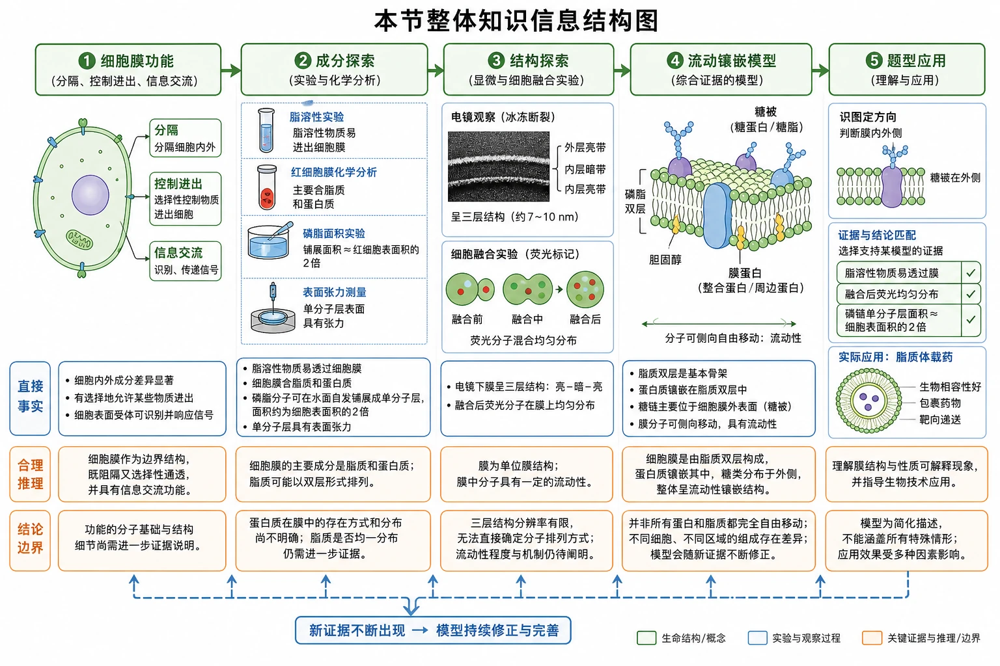
<!-- 图片描述：补充知识图（非教材原图）——“本节整体知识信息结构图”。横向五段流程：细胞膜功能（分隔、控制进出、信息交流）→成分探索（脂溶性实验、红细胞膜化学分析、磷脂面积实验、表面张力）→结构探索（电镜三层、细胞融合荧光）→流动镶嵌模型（磷脂双层、膜蛋白、糖被、流动性）→题型应用（识图定方向、证据与结论匹配、脂质体载药）；每段下列“直接事实—合理推理—结论边界”，箭头标明模型随新证据修正。采用高中教材式白底科学信息图，绿色为生命结构，蓝色为实验过程，橙色为关键证据和边界。 -->

## 本节学习目标

1. 说出细胞膜分隔环境、控制物质进出和进行细胞间信息交流的功能，并理解“控制是相对的”。
2. 根据磷脂的亲水头、疏水尾解释单层、双层和脂质体的形成。
3. 依据实验现象说明膜中含脂质、磷脂排成两层、膜蛋白能够运动。
4. 准确识别流动镶嵌模型中的内外侧、磷脂、膜蛋白、糖蛋白和糖脂。
5. 用“事实—推理—假说—新证据—修正”评价细胞膜模型的探索过程。

## 核心知识点讲解

### 一、知识对象与生命情境

#### 台盼蓝实验：先从“活细胞不着色”读出边界功能

教材显微图中，死细胞呈蓝色，活细胞基本不着色。直接事实是染液进入死细胞而未明显进入活细胞；合理推理是活细胞膜能控制台盼蓝进入，死亡后膜的控制能力丧失。不能把结论扩大成“活细胞膜阻止一切物质进入”。

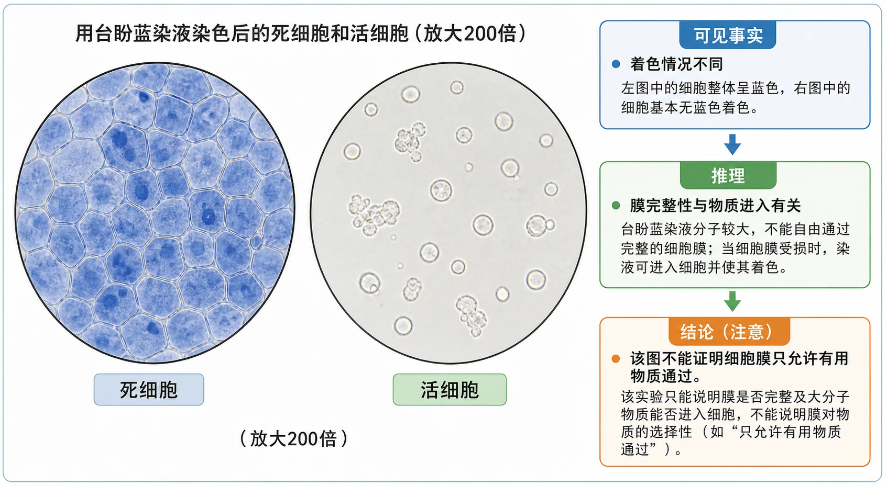
<!-- 图片描述：教材“问题探讨”源图重绘——“用台盼蓝染液染色后的死细胞和活细胞（放大200倍）”。保留左右并列的真实显微视野，左侧为成片、多边形且胞内呈蓝色的死细胞，右侧为散在、圆形或不规则且基本无蓝色着色的活细胞；底部分别标“死细胞”“活细胞”，保留放大200倍信息，不绘制显微图中不可见的内部细胞器。图旁教学解释区明确“可见事实：着色情况不同”“推理：膜完整性与物质进入有关”，并注明该图不能证明膜只允许有用物质通过。 -->

细胞膜也叫质膜，是细胞这个生命系统的边界。膜的出现使生命物质从原始环境中形成相对独立的系统。

#### 教材图3-1：原始海洋景观只能提供情境，不能当实验结果

图3-1是想象图，展示原始海洋环境。它帮助理解“没有边界就难以维持相对稳定的内部环境”，但并不是对生命起源过程的直接观测证据。

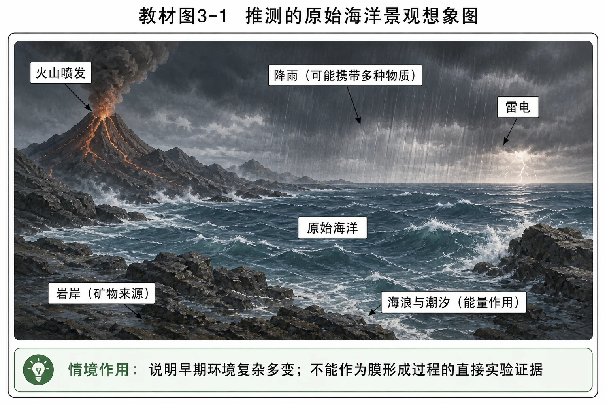
<!-- 图片描述：教材图3-1源图重绘——“推测的原始海洋景观想象图”。忠实呈现阴暗天空、降雨、海浪、火山或岩岸等原始地球海洋景观，保留“推测”“想象图”的图题性质；不添加细胞、磷脂双层或生命起源步骤。图下教学提示区写“情境作用：说明早期环境复杂多变；不能作为膜形成过程的直接实验证据”。 -->

### 二、核心概念与结构功能

#### 细胞膜的三项主要功能

1. **将细胞与外界环境分隔开**：形成相对独立的内部环境，是维持生命活动的前提。
2. **控制物质进出细胞**：营养物质进入、代谢废物排出、分泌物释放都受膜结构调控；有害物质和病原体仍可能进入，所以控制是相对的。
3. **进行细胞间的信息交流**：可通过化学信号与受体结合、相邻细胞膜接触、细胞间通道传递信息。

教材图3-2包含三种交流方式。读图时先找“信号从哪里来、靶细胞在哪里、是否接触、信息是否经通道传递”。

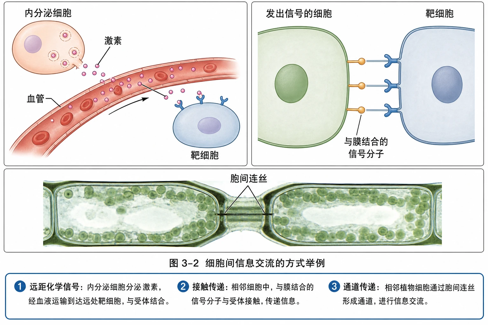
<!-- 图片描述：教材图3-2源图重绘——“细胞间信息交流的方式举例”。三面板布局：左上为内分泌细胞释放粉红色激素进入血管，随血液到达远处靶细胞并与膜表面受体结合；右上为相邻的发出信号细胞和靶细胞直接接触，膜结合信号分子与受体接触；下方为高等植物细胞显微照片式面板，标出胞间连丝，说明相邻细胞形成通道。忠实保留“内分泌细胞、激素、血管、靶细胞、发出信号的细胞、与膜结合的信号分子、胞间连丝”等标签与箭头；教学解释区只归纳“远距化学信号、接触传递、通道传递”，不补画教材未出现的胞内信号级联。 -->

### 三、关键过程、规律与调控机制

#### 磷脂为什么在水中形成双分子层

磷脂具有亲水头部和两条疏水尾部。在水中，亲水头朝向水，疏水尾避开水并彼此相对，因此形成内部疏水、两侧亲水的双分子层。这个排列不是“磷脂有意识选择”，而是分子结构和水环境共同作用的结果。

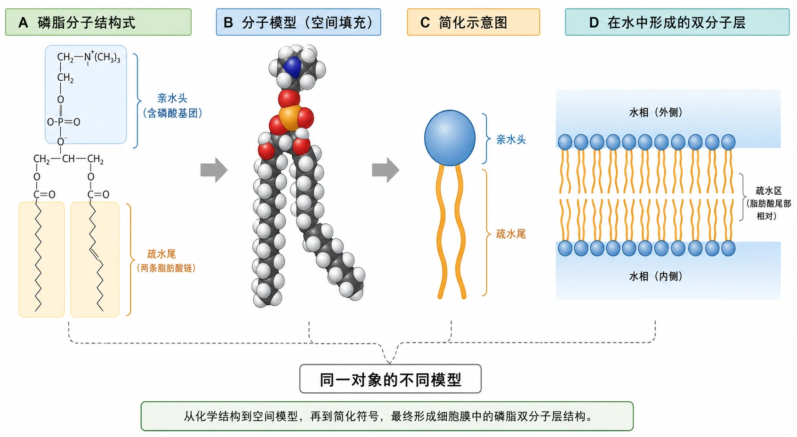
<!-- 图片描述：教材“磷脂分子系列图”源图组重绘——“磷脂分子结构式、分子模型、简化示意图和在水中形成的双分子层”。四面板横排：A按原图绘出磷脂结构式，明确含磷酸基团的亲水头与两条脂肪酸疏水尾；B保留球棍/空间填充模型，只显示实际分子形态；C用圆形头加两条线尾的简化符号；D为上下两排磷脂，亲水头朝向两侧水相、疏水尾在中间相对。使用统一引线将四种表达关联，图例写“同一对象的不同模型”；不添加膜蛋白或运输机制。该图帮助学生从化学结构过渡到膜的空间结构。 -->

#### 流动镶嵌模型

细胞膜主要由脂质和蛋白质组成，另有少量糖类。磷脂双分子层是基本支架；膜蛋白有的位于表面，有的嵌入，有的贯穿；大多数磷脂和许多蛋白质能够运动。细胞膜外表面的糖类可与蛋白质形成糖蛋白、与脂质形成糖脂，合称糖被，参与识别和信息传递。

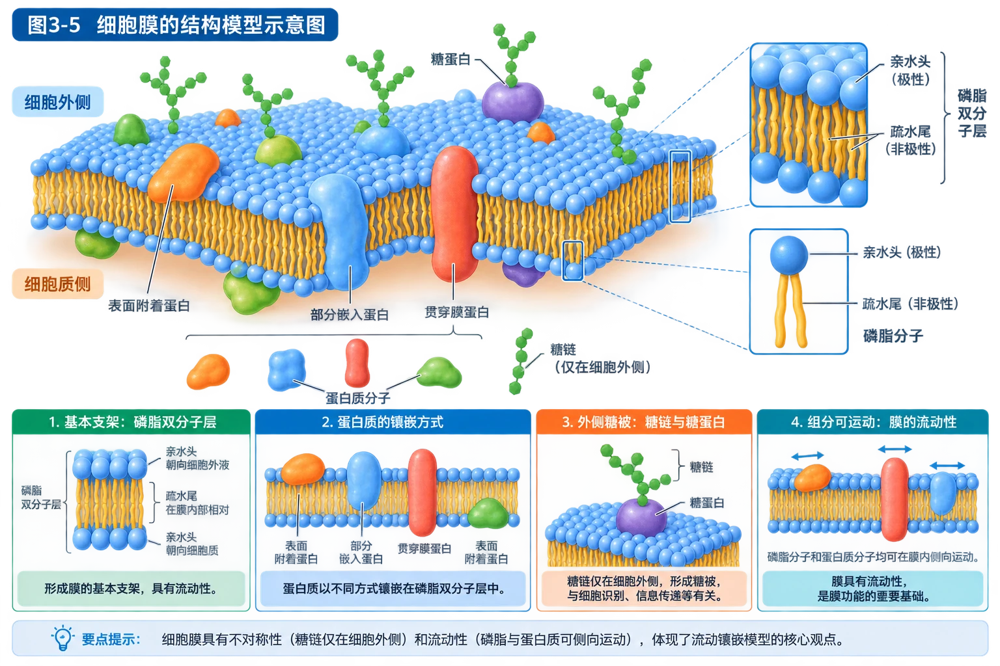
<!-- 图片描述：教材图3-5源图重绘——“细胞膜的结构模型示意图”。用透视加局部剖面的膜模型，完整呈现磷脂双分子层，球状亲水头朝向细胞外液和细胞质，疏水尾在膜内部相对；蛋白质分别画成表面附着、部分嵌入和贯穿膜三类；仅在细胞外侧绘制糖链并标出糖蛋白，保留“磷脂双分子层、磷脂分子、蛋白质分子、糖蛋白”等教材标签。用小型方向标注明“细胞外侧/细胞质侧”，但不添加原图没有的主动运输箭头。教学解释区分列“基本支架、镶嵌方式、外侧糖被、组分可运动”，帮助识别膜的不对称性和流动性。 -->

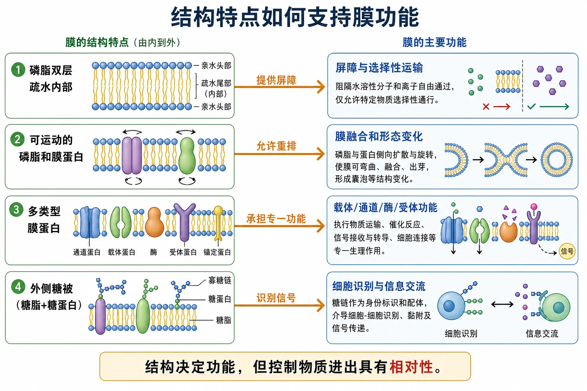
<!-- 图片描述：补充知识图（非教材原图）——“结构特点如何支持膜功能”。左侧依次列磷脂双层疏水内部、可运动的磷脂和膜蛋白、多类型膜蛋白、外侧糖被；右侧连接屏障与选择性运输、膜融合和形态变化、载体/通道/酶/受体功能、细胞识别与信息交流。每条箭头写“提供屏障”“允许重排”“承担专一功能”“识别信号”，底部注明“结构决定功能，但控制物质进出具有相对性”。 -->

### 四、典型模型与分析方法

#### 从证据到模型：结论强度要与证据匹配

| 证据 | 可支持的推理 | 不能直接证明 |
|---|---|---|
| 脂溶性物质更易穿膜 | 膜成分中可能含脂质 | 脂质的具体种类和排列方式 |
| 红细胞膜脂质单层面积约为细胞表面积2倍 | 磷脂在膜中很可能连续排成两层 | 蛋白质的分布和膜是否流动 |
| 电镜下暗—亮—暗三层 | 膜具有层次结构 | 所有膜都是静态“蛋白质—脂质—蛋白质”夹心结构 |
| 两种荧光膜蛋白由分区到均匀 | 膜蛋白可发生侧向运动，膜有流动性 | 所有膜蛋白在任何条件下都自由运动 |

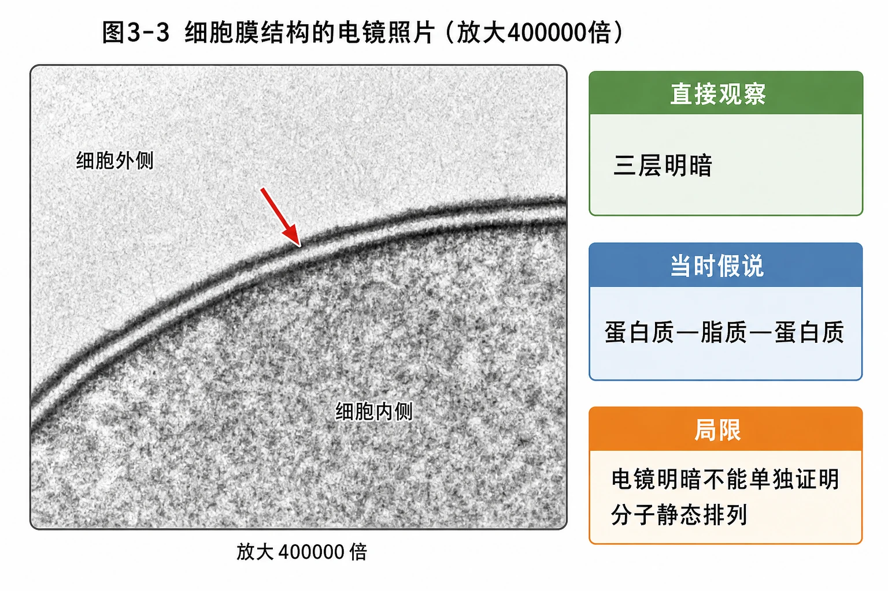
<!-- 图片描述：教材图3-3源图重绘——“细胞膜结构的电镜照片（放大400000倍）”。保留灰度电镜质感、弯曲膜边界和暗—亮—暗三层，红色箭头只指向原图强调的膜区域，标出放大400000倍；不把灰度层直接涂成磷脂和蛋白质。图旁分区写“直接观察：三层明暗”“当时假说：蛋白质—脂质—蛋白质”“局限：电镜明暗不能单独证明分子静态排列”。 -->

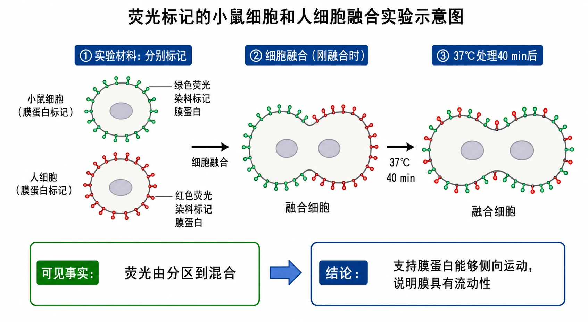
<!-- 图片描述：教材图3-4源图重绘——“荧光标记的小鼠细胞和人细胞融合实验示意图”。按从左到右三阶段绘制：小鼠细胞膜蛋白标绿色、人细胞膜蛋白标红色；刚融合时融合细胞两半分别为绿、红；37℃处理40 min后红绿荧光在整个膜上交错均匀分布。保留“细胞融合、37℃、40 min、绿色荧光染料标记膜蛋白、红色荧光染料标记膜蛋白、融合细胞”等标签；箭头标时间顺序。结果区写“可见事实：荧光由分区到混合”，结论区限定为“支持膜蛋白能够侧向运动，说明膜具有流动性”。 -->

### 五、图表、实验与证据链

科学模型不是终点。欧文顿的通透性实验提出“膜含脂质”的推测，红细胞膜化学分析确认磷脂和胆固醇，面积实验支持双层排列，电镜观察促成静态三层模型，细胞融合实验又迫使模型加入流动性。提出假说后必须用新的观察和实验检验，并随证据修正。

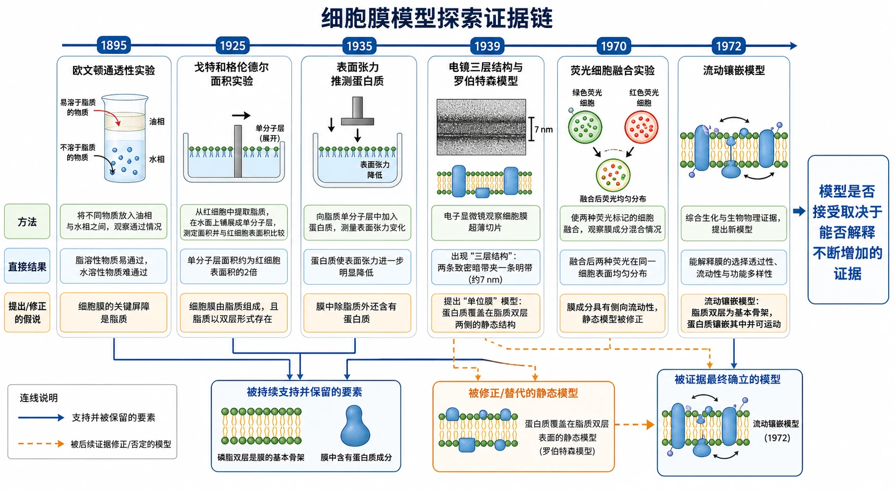
<!-- 图片描述：补充知识图（非教材原图）——“细胞膜模型探索证据链”。时间轴依次为1895欧文顿通透性实验、1925戈特和格伦德尔面积实验、1935表面张力推测蛋白质、1959电镜三层结构与罗伯特森模型、1970荧光细胞融合、1972流动镶嵌模型；每个节点分“方法—直接结果—提出/修正的假说”，用虚线连接被后续证据修正的静态模型，用实线连接仍被保留的磷脂双层和蛋白质成分。右侧醒目标注“模型是否接受取决于能否解释不断增加的证据”。 -->

### 六、题型应用与迁移

脂质体是由磷脂双分子层围成的封闭小泡。水溶性药物适合放在水相腔内，脂溶性药物适合位于双层疏水区；脂质体膜与细胞膜结构相似，可通过膜融合等方式递送药物。

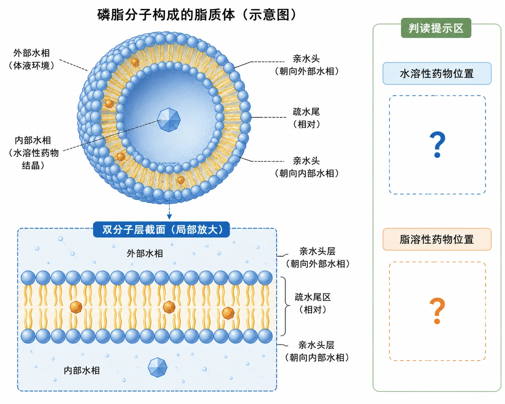
<!-- 图片描述：教材“拓展应用第2题”源图重绘——“磷脂分子构成的脂质体”。保留球形封闭脂质体和双分子层截面，双层的亲水头朝向外部水相与内部水相，疏水尾相对；水相腔内保留一个水溶性药物结晶符号，双层疏水区保留脂溶性药物符号，不在题图主体中标出答案文字。旁设独立判读提示区，用问号标示“水溶性药物位置”“脂溶性药物位置”，保持训练功能。 -->

## 重点梳理

- 功能：**分隔环境、控制物质进出、进行信息交流**。
- 成分：脂质和蛋白质为主，少量糖类；磷脂最丰富，动物细胞膜还含胆固醇。
- 结构：磷脂双分子层为基本支架，蛋白质以不同方式镶嵌，糖被位于外表面。
- 特性：结构上的流动性是物质运输、膜融合、生长、分裂和运动的重要基础。
- 方法：从图像事实出发，结论不能超出实验能够支持的范围。

## 难点突破

### 1. “选择性”不等于“只放行有用物质”

膜控制物质进出取决于分子性质、膜蛋白和细胞状态。某些有害物质、病毒和病菌仍能进入；因此应表述为“细胞膜对物质进出具有控制作用”，而不是绝对筛选。

### 2. 糖被如何判断细胞膜外侧

模式图中糖链只伸向细胞外侧。因此看到糖蛋白或糖脂的糖链，即可定位外侧；另一面是细胞质侧。题目若只给膜片段，可用这一特征定向。

### 3. 脂质面积实验为什么得到“两层”

提取的是完整红细胞膜中的脂质；在空气—水界面铺成单层后面积约为红细胞表面积的2倍，说明原膜中同样数量的脂质分成两层覆盖细胞表面。该推理依赖红细胞形态和膜材料较纯等实验条件。

## 例题讲解

### 例题：荧光融合实验能说明什么

**题目**：人、鼠细胞膜蛋白分别被红、绿荧光标记，融合后先各占半边，37℃ 40 min后两色均匀分布。能否据此说明所有膜蛋白都能自由运动？

**分析**：自变量是融合后的时间和温度条件，因变量是荧光分布。荧光混合说明被标记的膜蛋白发生了侧向移动，但实验没有逐个检测全部膜蛋白，也没有覆盖所有温度和细胞状态。

**答案**：实验支持细胞膜具有流动性、部分或许多膜蛋白能够运动；不能推出所有膜蛋白在任何条件下都能自由运动。

## 易错点整理

1. 把细胞膜写成“全透膜”或“绝对选择膜”——应写控制作用具有相对性。
2. 认为蛋白质固定在磷脂双层上——多数膜蛋白可以运动，也有蛋白受其他结构限制。
3. 把糖被画在两侧——教材范围内糖被位于细胞膜外表面。
4. 用电镜暗—亮—暗直接证明流动镶嵌模型——它只提供层次结构证据，流动性需要其他实验。
5. 认为水完全不能通过膜——疏水内部构成屏障，但水可通过膜或水通道蛋白跨膜运输。

## 考点考证点整理

### 考点一：流动镶嵌模型识图

- 出题思路：给膜剖面图，要求判断内外侧、成分、功能或运输方向。
- 关键条件：糖链所在侧、磷脂头尾朝向、蛋白质镶嵌方式。
- 解答要点：先定外侧，再认磷脂双层和膜蛋白，最后由结构联系屏障、运输、识别或膜融合。
- 易扣分点：把糖被放在细胞质侧；把膜蛋白说成全部贯穿或全部静止。

### 考点二：实验事实与结论匹配

- 出题思路：提供面积、荧光、通透性或电镜材料，判断能支持何种模型。
- 关键条件：实验直接测得的量、对照、温度和时间。
- 解答要点：按“直接结果→合理推理→结论边界”作答，不跨越证据。
- 易扣分点：把“支持”写成“完全证明”；忽略实验只能说明特定样品与条件。

### 考点三：结构与功能相适应

- 出题思路：以吞噬、分泌、细胞融合、识别或脂质体递药为情境。
- 关键条件：是否涉及膜形变、膜融合、膜蛋白专一性或疏水区。
- 解答要点：膜的流动性支持形变和融合；膜蛋白承担运输、受体等功能；磷脂双层决定水相和疏水物质的位置。
- 易扣分点：只写“细胞膜有选择透过性”而不对应题目中的具体结构。

## 练习题

1. **教材概念检测第1题**：判断并说明理由：①磷脂能运动而膜蛋白固定不动；②只有细胞需要的物质才能进入；③向细胞内注射物质后膜上会留下永久空洞。
2. **教材概念检测第2题**：下列叙述错误的是：A.脂溶性物质较易通过膜；B.膜内部疏水，所以水分子不能通过膜；C.膜蛋白有运输功能；D.细胞生长不支持静态膜模型。
3. **教材拓展应用第1题**：评价“细胞膜像窗纱”的类比，指出合理与不妥之处。
4. **教材拓展应用第2题**：解释脂质体中水溶性与脂溶性药物位置不同的原因，并推测药物进入细胞的方式。
5. **提升题**：某实验仅发现低温时荧光膜蛋白混合速度变慢。可以得出“低温使细胞膜完全不流动”吗？为什么？

## 练习题答案

1. ①错，膜中多数磷脂和许多蛋白质都能运动；②错，膜的控制是相对的，有害物质和病原体也可能进入；③错，膜具有流动性，注射造成的局部形变可通过膜组分重排恢复，不会必然留下永久空洞。
2. B。疏水区对水有屏障作用，但“不能通过”过于绝对；水可少量穿过膜，也可借助水通道蛋白运输。A、C、D均符合结构功能关系。
3. 合理处是二者都能形成边界并对物质进出有一定筛选；不妥处是窗纱孔径固定、结构静态，而细胞膜具有流动性，膜蛋白可对不同物质实施专一运输和信号识别。
4. 水溶性药物位于脂质体内部水相，脂溶性药物位于磷脂双层疏水区；脂质体可与细胞膜融合，或被细胞以胞吞等方式摄入后释放药物。答题须把推测写成可能机制，不能说只有一种途径。
5. 不能。实验只说明在给定条件下低温降低了被标记膜蛋白的移动速度，不能推出膜组分全部停止运动；还应控制细胞活性、标记方法并设置不同温度梯度。
