# 3.2 细胞器之间的分工合作

## 知识关系导航

- 所属章节：[[章首 学习导图|细胞的基本结构]]
- 前置结构：[[3.1 细胞膜的结构和功能#流动镶嵌模型|生物膜的流动镶嵌结构]]
- 后续控制：[[3.3 细胞核的结构和功能#细胞核为什么能成为控制中心|遗传信息对细胞活动的控制]]
- 综合训练：[[章末 整理与提升#主线二：细胞是统一的生命系统|细胞系统观]]

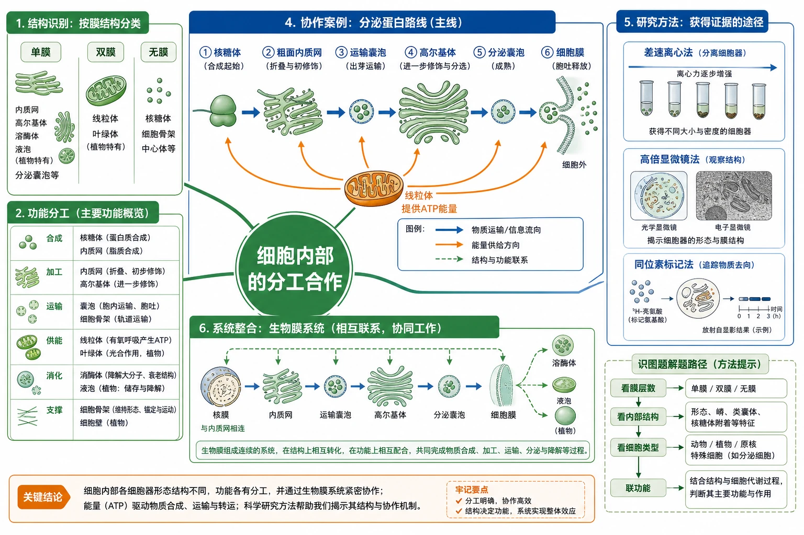
<!-- 图片描述：补充知识图（非教材原图）——“本节整体知识信息结构图”。中心为“细胞内部的分工合作”，一级分支包括：结构识别（单膜/双膜/无膜）、功能分工（合成、加工、运输、供能、消化、支撑）、研究方法（差速离心、高倍显微镜、同位素标记）、协作案例（分泌蛋白路线）、系统整合（生物膜系统）。分泌蛋白主线以粗箭头贯穿核糖体—粗面内质网—运输囊泡—高尔基体—分泌囊泡—细胞膜，并由线粒体以橙色箭头供能；右侧附识图题路径“看膜层数→看内部结构→看细胞类型→联功能”。白底教材式信息图，绿色为细胞器，蓝色为运输和实验，橙色为能量及关键结论。 -->

## 本节学习目标

1. 在动植物细胞亚显微结构图中识别主要细胞器，并从膜层数、内部结构和功能进行比较。
2. 解释差速离心法逐级分离颗粒的原理，理解所得沉淀通常不是绝对纯品。
3. 完成叶绿体与细胞质流动观察的材料选择、装片制作、镜头转换和结果解释。
4. 依据同位素标记时间序列写出分泌蛋白合成、加工、运输和分泌路线。
5. 说明生物膜系统的组成、结构联系和三方面功能，形成系统观。

## 核心知识点讲解

### 一、知识对象与生命情境

教材用C919制造部门类比细胞器的分工合作。照片能直接显示一架飞机，部门协作则来自文字情境；类比的价值是帮助理解“缺少关键环节会影响整体”，但细胞器不是有意识的社会部门。

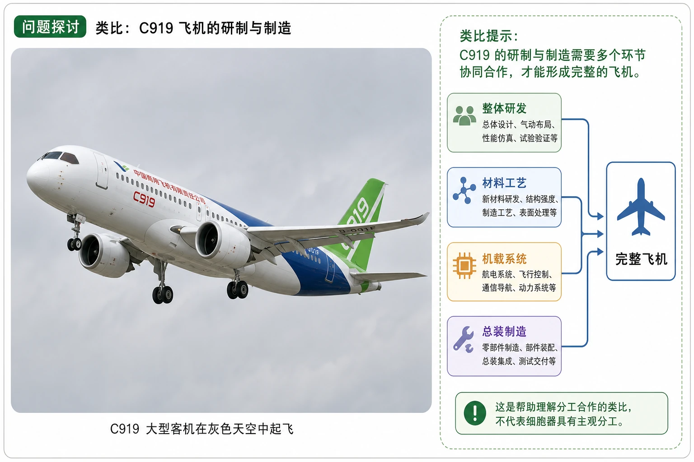
<!-- 图片描述：教材“问题探讨”源图重绘——“C919飞机”。忠实重绘灰色天空中起飞的C919客机照片构图，保留机身、机翼、发动机、起落架和绿色尾翼等可见外形，不在照片主体上添加细胞器或流程箭头。旁设独立类比提示区：整体研发、材料工艺、机载系统、总装制造四个文字节点汇入“完整飞机”，并明确标注“这是帮助理解分工合作的类比，不代表细胞器具有主观分工”。 -->

细胞质包括呈溶胶状的**细胞质基质**和分布其中的**细胞器**。细胞器形态和结构不同，承担的功能也不同；细胞质内还有由蛋白质纤维组成的细胞骨架。

### 二、核心概念与结构功能

#### 教材图3-6：动植物细胞亚显微结构总览

读图先定细胞类型，再认共有结构，最后用特有或典型结构比较。高等植物细胞通常可见细胞壁、叶绿体和大液泡；动物细胞常画有中心体，但这些判断要结合具体细胞类型，不能绝对化。

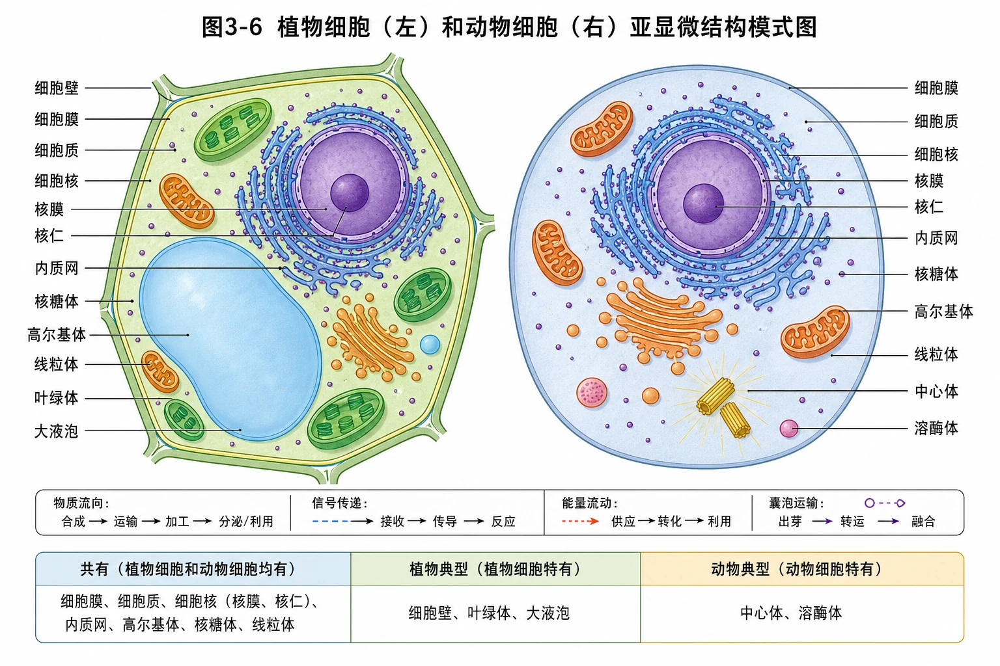
<!-- 图片描述：教材图3-6源图组重绘——“植物细胞（左）和动物细胞（右）亚显微结构模式图”。左右完整并列两幅剖面图：左侧植物细胞保留细胞壁、细胞膜、细胞质、细胞核、核膜、核仁、叶绿体、大液泡、线粒体、内质网、高尔基体、核糖体等；右侧动物细胞保留细胞膜、细胞质、细胞核、核膜、核仁、线粒体、内质网、高尔基体、核糖体、中心体、溶酶体等。所有中文引线准确落到对应结构，保留植物细胞近多边形、动物细胞近圆形的教材模式图特征；不把模式图当作真实比例图，不额外添加教材未标出的细胞器。底部设“共有/植物典型/动物典型”判读栏。 -->

#### 主要细胞结构比较

| 结构 | 膜结构 | 关键形态 | 主要功能与适应性 |
|---|---|---|---|
| 线粒体 | 双层膜 | 内膜向内折叠形成嵴 | 有氧呼吸主要场所；嵴增大酶附着面积，主要供能 |
| 叶绿体 | 双层膜 | 内有基粒等膜性结构 | 绿色植物细胞光合作用场所，制造有机物并转换能量 |
| 内质网 | 单层膜 | 管、泡、扁囊相连，腔相通 | 粗面内质网参与蛋白质合成加工；光面内质网无核糖体附着 |
| 高尔基体 | 单层膜 | 扁平囊堆叠，周围有囊泡 | 加工、分类、包装来自内质网的蛋白质 |
| 核糖体 | 无膜 | 两个亚基 | 合成蛋白质；可游离或附着于内质网 |
| 液泡 | 单层膜 | 植物成熟细胞中常较大 | 调节细胞内环境；细胞液含糖、盐、色素等；充盈时使细胞坚挺 |
| 溶酶体 | 单层膜 | 囊泡状，含多种水解酶 | 分解衰老损伤细胞器，参与清除病原体 |
| 中心体 | 无膜 | 两个互相垂直的中心粒及周围物质 | 与动物和低等植物细胞有丝分裂有关 |
| 细胞壁 | 非细胞器 | 位于植物细胞膜外，主要含纤维素和果胶 | 支持与保护 |

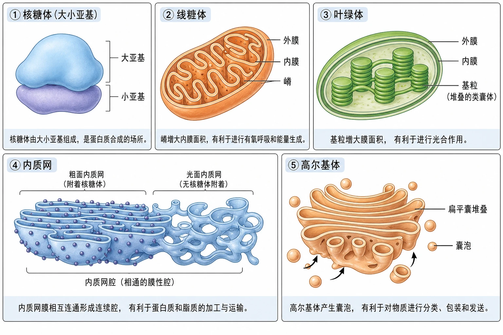
<!-- 图片描述：教材图3-6局部源图组重绘——“核糖体、线粒体、叶绿体、内质网和高尔基体结构放大图”。五面板按原教材单体模式图重绘：核糖体为大小亚基；线粒体标外膜、内膜和嵴；叶绿体标外膜、内膜及堆叠基粒；内质网呈相通的膜性管腔并区分有无核糖体附着区域；高尔基体呈弯曲扁平囊堆叠并伴随囊泡。每面板只保留原图可见结构和名称，不补画反应过程；下方分别用一句结构功能联系说明“嵴/基粒增大膜面积、内质网连续腔利于加工运输、高尔基体囊泡利于分类发送”。 -->

#### 细胞骨架

细胞骨架由蛋白质纤维组成，维持细胞形态，锚定和支撑细胞器，并与运动、分裂、分化、物质运输、能量转化和信息传递有关。

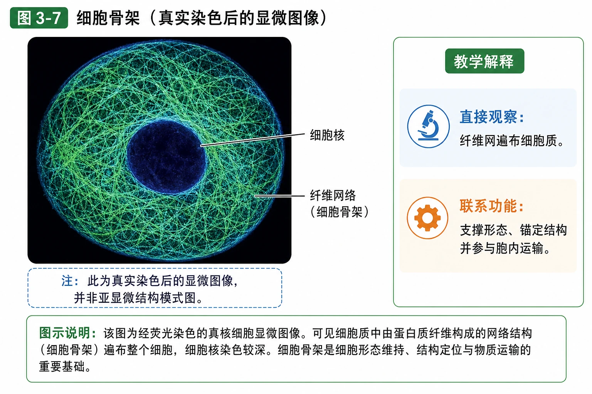
<!-- 图片描述：教材图3-7源图重绘——“细胞骨架”。保留教材显微照片的圆形细胞轮廓、深色细胞核和遍布细胞质的染色蛋白质纤维网，注明这是真实染色后的显微图像而非亚显微结构模式图；只标出可辨认的细胞核与纤维网络，不补画线粒体或囊泡轨道。教学解释区写“直接观察：纤维网遍布细胞质”“联系功能：支撑形态、锚定结构并参与胞内运输”，不由单张静态照片推出具体运动速度。 -->

### 三、关键过程、规律与调控机制

#### 分泌蛋白的合成和运输

分泌蛋白包括消化酶、抗体和一部分激素。其大致路线是：游离核糖体开始合成多肽链→核糖体与肽链转移到粗面内质网继续合成→蛋白质进入内质网腔加工、折叠→运输囊泡到高尔基体→进一步修饰、分类、包装→分泌囊泡与细胞膜融合→胞吐到细胞外。全过程需要能量，主要由线粒体提供。

教材的3、17、117 min图是时间序列证据。红点位置依次从粗面内质网转到高尔基体，再到细胞膜附近囊泡和胞外；这支持“物质沿路线转移”，不是说同一个固定细胞器整体移动。

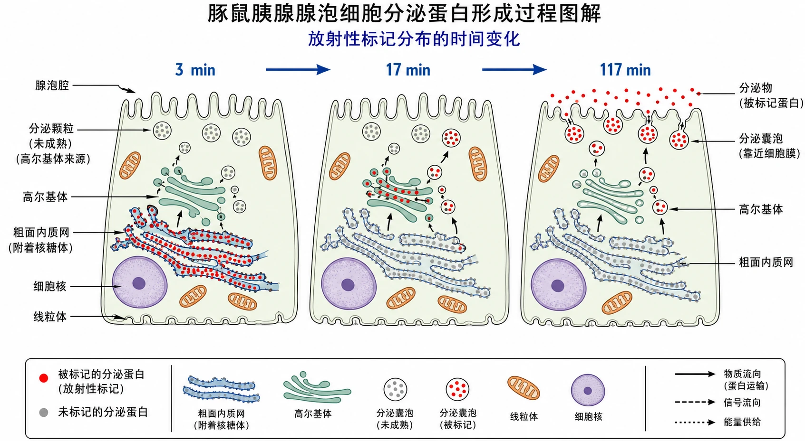
<!-- 图片描述：教材“豚鼠胰腺腺泡细胞分泌蛋白形成过程图解”源图组重绘——“3 min、17 min、117 min放射性标记分布”。三面板保持同一腺泡细胞构图和细胞核、粗面内质网、高尔基体、囊泡、线粒体等原图结构；3 min面板红点主要位于附着核糖体的内质网，17 min红点主要位于高尔基体，117 min红点主要位于靠近细胞膜的囊泡及胞外分泌物；灰点代表未标记分泌蛋白、红点代表被标记分泌蛋白，完整保留图例和时间。用蓝色时间箭头连接三面板，但不在源图主体中提前写出完整运输答案。 -->

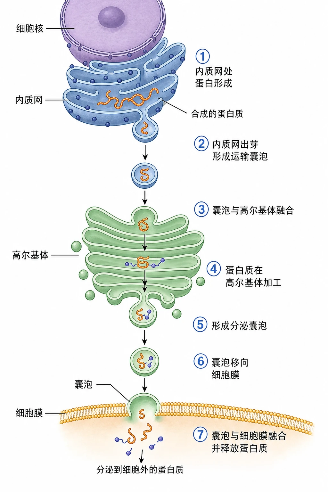
<!-- 图片描述：教材图3-8源图重绘——“分泌蛋白运到细胞外的过程示意图”。按原图纵向路线保留细胞核、内质网、高尔基体、囊泡和细胞膜，①至⑦顺序编号必须完整：内质网处蛋白形成、内质网出芽形成运输囊泡、囊泡与高尔基体融合、蛋白质在高尔基体加工、形成分泌囊泡、囊泡移向细胞膜、囊泡与膜融合并释放。中文标签至少包括细胞核、内质网、合成的蛋白质、高尔基体、囊泡；箭头只表示原图运输方向，不添加核内转录等教材图未画过程。 -->

#### 生物膜系统

细胞器膜、细胞膜和核膜等共同构成生物膜系统。核糖体、中心体等无膜细胞器不属于生物膜系统；细胞壁也不属于。其作用包括：维持相对稳定的内部环境并参与物质运输、能量转化和信息传递；为酶提供广阔附着面积；形成彼此分隔的区室，使多种反应高效、有序进行。

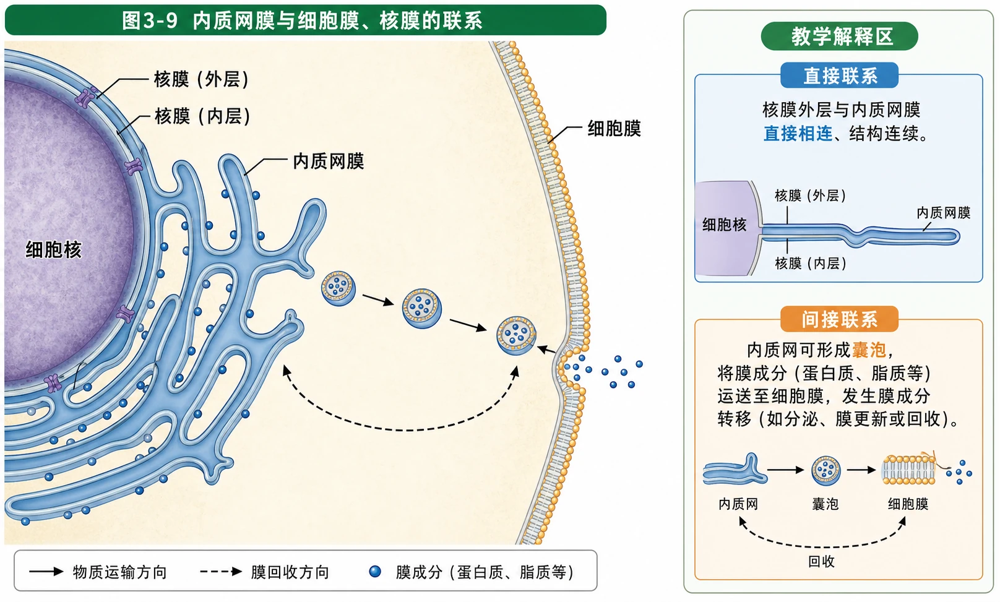
<!-- 图片描述：教材图3-9源图重绘——“内质网膜与细胞膜、核膜的联系”。保留细胞核局部、双层核膜、与外层核膜相连续的内质网膜及远端细胞膜，准确标“核膜、内质网膜、细胞膜”；保持原图中核膜与内质网膜直接连续、内质网与细胞膜空间邻近但不画成直接连续。旁设教学解释区区分“直接联系：核膜外层与内质网相连”“间接联系：内质网可经囊泡与细胞膜发生膜成分转移”。 -->

### 四、典型模型与分析方法

#### 差速离心法

先破坏细胞膜制成匀浆，低速离心使较大颗粒沉降，收集上清液后提高转速，使较小颗粒继续沉降，依次分离。沉降受颗粒大小、密度、形状、离心速度和时间共同影响，因此同一沉淀可能混有性质接近的结构。

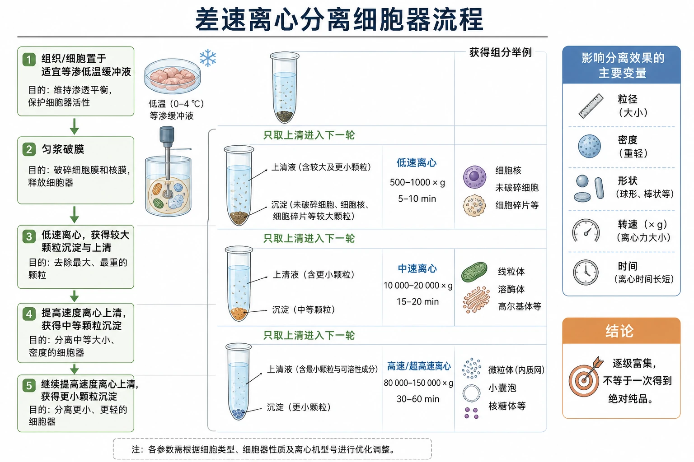
<!-- 图片描述：补充知识图（非教材原图）——“差速离心分离细胞器流程”。五步流程：组织/细胞置于适宜等渗低温缓冲液→匀浆破膜→低速离心获得较大颗粒沉淀与上清→提高速度离心上清获得中等颗粒→继续提高速度获得更小颗粒；每个离心管明确上清液和沉淀位置，箭头旁写“只取上清进入下一轮”。右侧变量框列粒径、密度、形状、转速、时间，结论框写“逐级富集，不等于一次得到绝对纯品”。 -->

#### 同位素标记法

同位素具有相同质子数、不同中子数。用物理性质特殊的同位素标记化合物，可追踪物质的去向和变化。分泌蛋白实验用$^3\mathrm{H}$标记亮氨酸；红点迁移反映含标记亮氨酸的蛋白质在不同结构间转移。

### 五、图表、实验与证据链

#### 高倍显微镜观察叶绿体和细胞质流动

材料要新鲜并保持活性；装片始终有水。先低倍找到目标并移至视野中央，再转高倍观察。叶绿体天然呈绿色，可作为观察对象；黑藻叶肉细胞中叶绿体的定向移动可作为细胞质流动的标志。

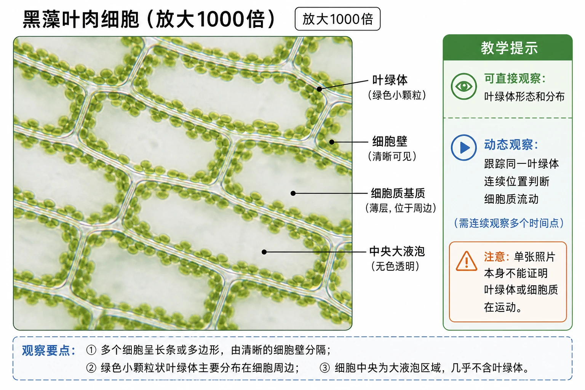
<!-- 图片描述：教材“高倍显微镜下黑藻的叶绿体”源图重绘——“黑藻叶肉细胞（放大1000倍）”。保留真实显微照片质感：多个长条或多边形细胞由清晰细胞壁分隔，绿色小颗粒状叶绿体主要分布于细胞边缘，注明放大1000倍；不把叶绿体画到中央大液泡区域，不添加显微图中看不见的线粒体、内质网或细胞核。教学提示区标“可直接观察：叶绿体形态和分布”“动态观察：跟踪同一叶绿体连续位置判断细胞质流动”，强调单张照片本身不能证明运动。 -->

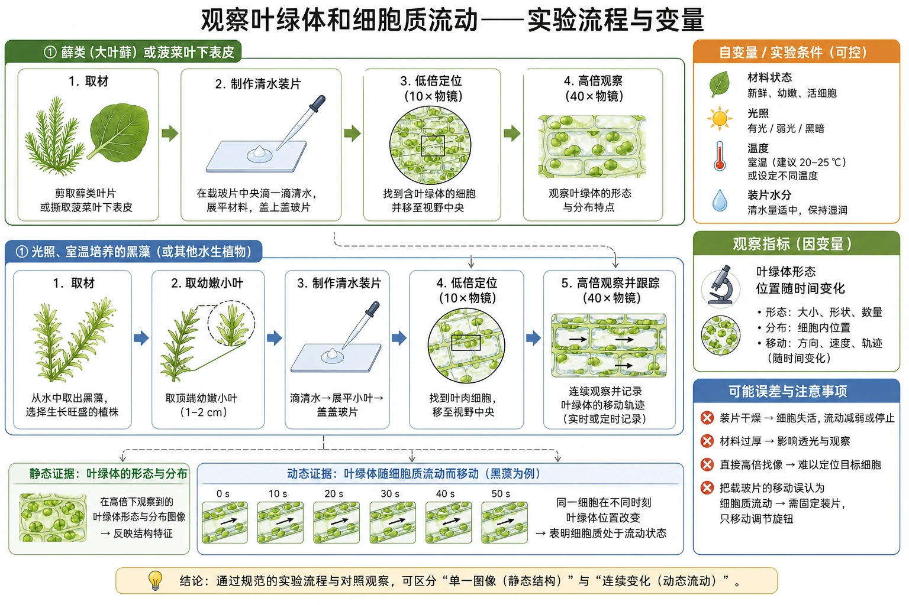
<!-- 图片描述：补充知识图（非教材原图）——“观察叶绿体和细胞质流动实验流程与变量”。上下两条平行流程：藓类/菠菜材料→清水装片→低倍定位→高倍观察叶绿体形态与分布；光照室温培养的黑藻→取幼嫩小叶→清水装片→低倍定位→高倍跟踪叶绿体移动。右侧列自变量/条件“材料状态、光照、温度、装片水分”，观察指标“叶绿体形态、位置随时间变化”，误差“装片干燥、材料过厚、直接高倍找像、把载玻片移动误认为胞质流动”。 -->

### 六、题型应用与迁移

识图题不要只背“车间”别名。先观察膜层数和内部结构：有嵴的双膜结构为线粒体，有基粒的双膜结构为叶绿体，扁囊堆叠并有囊泡的是高尔基体，网状膜腔且可附核糖体的是内质网。再结合细胞类型和材料功能验证。

教材练习给出两幅含错误的动植物细胞图，训练重点是：动物细胞不应画叶绿体；高等植物细胞一般不以中心体为典型结构；核糖体无膜且并非只在某一细胞出现；结构标签必须落到正确位置。

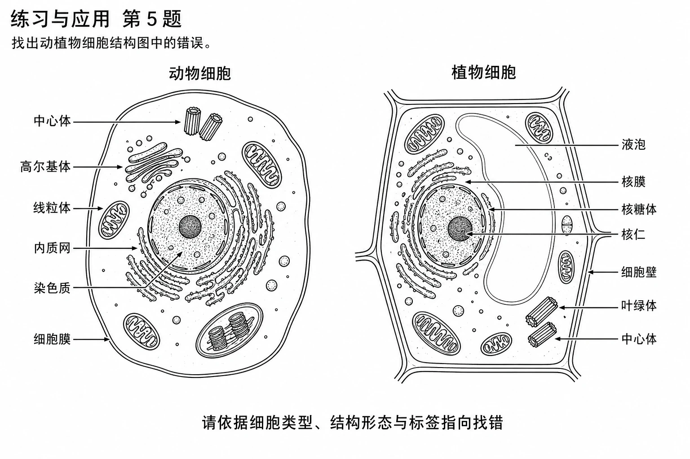
<!-- 图片描述：教材“练习与应用第5题”源图组重绘——“找出动植物细胞结构图中的错误”。左右保留原黑白线描题图及所有原始标签：动物细胞图标有中心体、高尔基体、线粒体、内质网、染色质、细胞膜并保留错误绘入的叶绿体样结构；植物细胞图标有液泡、核膜、核糖体、核仁、细胞壁、叶绿体并保留错误绘入的中心体。不得在源图重绘中圈错、改正或增加答案；图下注明“请依据细胞类型、结构形态与标签指向找错”。 -->

## 重点梳理

- 双层膜：线粒体、叶绿体；单层膜：内质网、高尔基体、液泡、溶酶体；无膜：核糖体、中心体。
- 分泌路线：核糖体→内质网→囊泡→高尔基体→囊泡→细胞膜→细胞外；线粒体主要供能。
- 生物膜系统包括细胞膜、核膜和各种细胞器膜，不包括无膜细胞器和细胞壁。
- 实验读图：时间变化追踪“物质去哪儿”，空间图识别“结构是什么”，活体显微观察强调材料活性。

## 难点突破

### 1. 游离核糖体与附着核糖体不是两种细胞器

它们都是核糖体，位置和所合成蛋白质的去向可能不同。教材描述的分泌蛋白先在游离核糖体开始合成，随后核糖体和肽链转移到粗面内质网继续合成。

### 2. 囊泡膜去了哪里

运输囊泡与高尔基体膜融合后成为高尔基体膜的一部分；分泌囊泡与细胞膜融合后成为细胞膜的一部分。膜的流动性为出芽和融合提供结构基础。

### 3. “生物膜”与“生物膜系统”

某一膜结构可称生物膜；生物膜系统是细胞内多种膜结构的整体。原核细胞只有细胞膜，没有教材定义的真核细胞生物膜系统。

## 例题讲解

### 例题：用时间序列判断分泌路线

**题目**：标记亮氨酸3 min出现在粗面内质网，17 min出现在高尔基体，117 min出现在细胞膜附近囊泡和胞外。写出路线并说明供能结构。

**分析**：按时间先后排列标记出现位置；亮氨酸进入蛋白质，故追踪的是分泌蛋白。囊泡完成结构间运输，线粒体主要供能。

**答案**：核糖体合成→粗面内质网合成、初步加工→运输囊泡→高尔基体进一步加工、分类和包装→分泌囊泡→与细胞膜融合并释放；能量主要来自线粒体。

## 易错点整理

1. 把细胞壁、核糖体列入生物膜系统。
2. 说高尔基体“合成”分泌蛋白——蛋白质由核糖体合成，高尔基体主要加工、分类和包装。
3. 说线粒体“提供能量”而不写“主要”——能量形式和过程表述要严谨。
4. 认为一次离心所得沉淀只有一种细胞器——差速离心是逐级富集。
5. 用单张黑藻照片证明细胞质流动——需要连续观察叶绿体位置变化。

## 考点考证点整理

### 考点一：细胞器识图与结构功能

- 出题思路：给局部模式图、电子显微图或细胞类型，判断细胞器和功能。
- 关键条件：膜层数、嵴、基粒、扁囊、囊泡、核糖体附着等。
- 解答要点：先写结构名称和判据，再写功能，最后联系结构适应性。
- 易扣分点：仅凭颜色判断；把叶绿体当作所有植物细胞都有。

### 考点二：分泌蛋白与同位素示踪

- 出题思路：给时间—放射性位置数据或缺失路线图。
- 关键条件：标记原料、最早和随后出现位置、胞外是否出现。
- 解答要点：按时间排序路线；核糖体负责合成，内质网和高尔基体负责加工运输，细胞膜胞吐，线粒体主要供能。
- 易扣分点：漏写囊泡或细胞膜；把放射性理解为细胞器本身产生。

### 考点三：生物膜系统

- 出题思路：判断组成、结构联系、膜面积和分区意义。
- 关键条件：题目对象是否有膜；是直接连续还是经囊泡间接联系。
- 解答要点：列明细胞膜、核膜、细胞器膜；说明稳定环境、酶附着和分区反应三项功能。
- 易扣分点：把所有细胞器都列入；把各种膜写成“成分和结构完全相同”。

### 考点四：显微观察实验

- 出题思路：考材料、装片、镜头转换、观察指标和异常原因。
- 关键条件：活材料、清水、先低后高、叶绿体作为标志。
- 解答要点：写清操作顺序和直接观察现象，再解释流动意义。
- 易扣分点：材料失水；高倍镜下直接找目标；把叶绿体主动运动等同于细胞质本身。

## 练习题

1. **教材概念检测第1题**：判断：①细胞质由细胞质基质和细胞器组成；②生物膜系统由具膜结构的细胞器构成。
2. **教材概念检测第2—4题**：分别判断水稻叶肉细胞与人口腔上皮细胞共有的细胞器、参与唾液淀粉酶合成分泌的细胞器、心肌细胞较腹肌细胞更多的细胞器。
3. **教材概念检测第5题**：依据源图找出动植物细胞图中的结构或标签错误，并说明判据。
4. **教材拓展应用**：提出“溶酶体膜为何不被内部水解酶分解”的假说，并说明如何验证。
5. **实验题**：观察黑藻细胞质流动时，为何要用幼嫩叶、保持装片有水并先低倍后高倍？
6. **章末迁移题**：具膜囊泡能与细胞膜融合，这一事实对两者膜成分和结构有何启示？

## 练习题答案

1. ①正确；②错误。生物膜系统还包括细胞膜和核膜，且无膜细胞器不属于该系统。
2. 共有的是高尔基体（A）；唾液淀粉酶路线涉及核糖体、内质网、高尔基体和线粒体（C）；心肌持续收缩耗能较多，线粒体更多（B）。
3. 应逐项核对：动物细胞图不应出现叶绿体；高等植物细胞图不应把中心体作为典型结构；核糖体、内质网等标签须指向正确形态。作答时应以题图保留的错误为对象，不能笼统写“动植物细胞不同”。
4. 可提出：溶酶体膜内侧存在保护性结构或膜蛋白，使水解酶不能接触并分解膜的关键成分；或酶在特定腔内条件下对底物具有专一性。验证可比较正常与破坏保护结构后的溶酶体膜稳定性，并设置未处理对照，检测膜完整性和酶泄漏。假说需由资料或实验检验，不能当作已证实结论。
5. 幼嫩叶薄且细胞活性较好；保持有水可维持细胞活性并避免装片干燥；低倍视野大，便于找到并居中目标，高倍用于观察细节。连续追踪叶绿体位置变化可判断细胞质流动。
6. 两者膜主要都由脂质和蛋白质构成，基本结构相似且具有一定流动性，因此能发生融合；不能据此说两种膜的蛋白质种类和比例完全相同。
