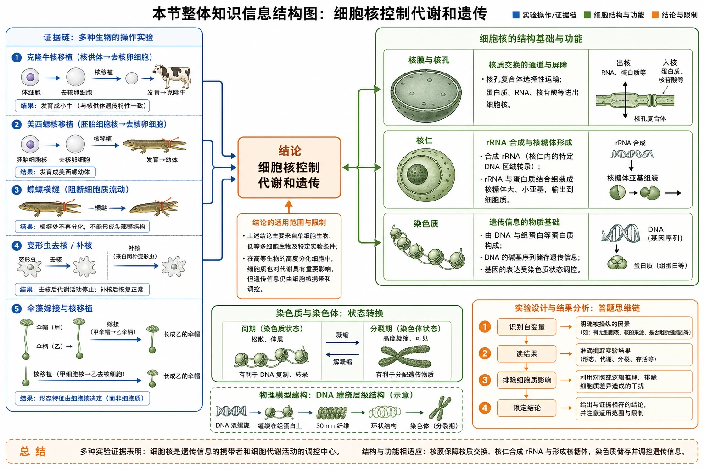
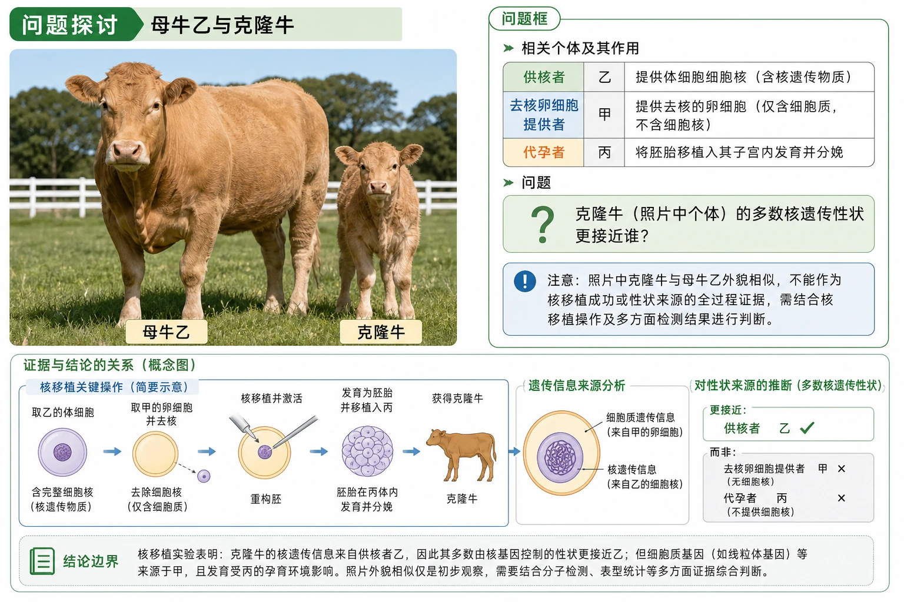
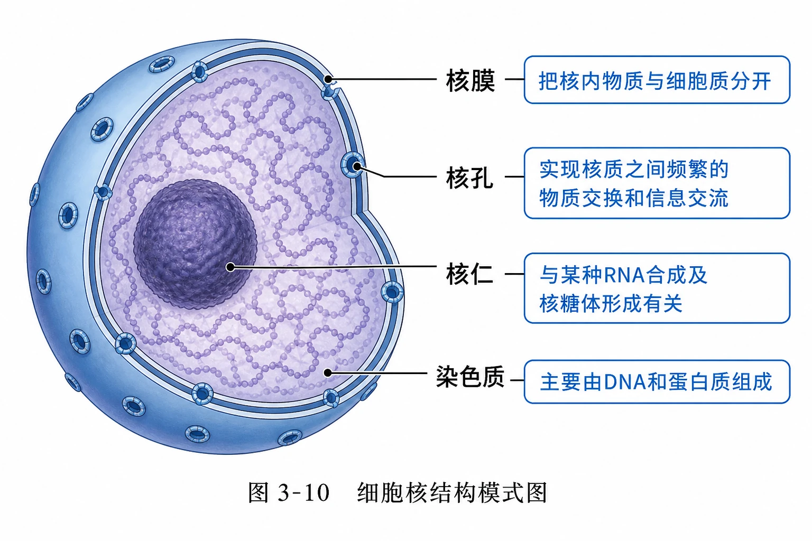
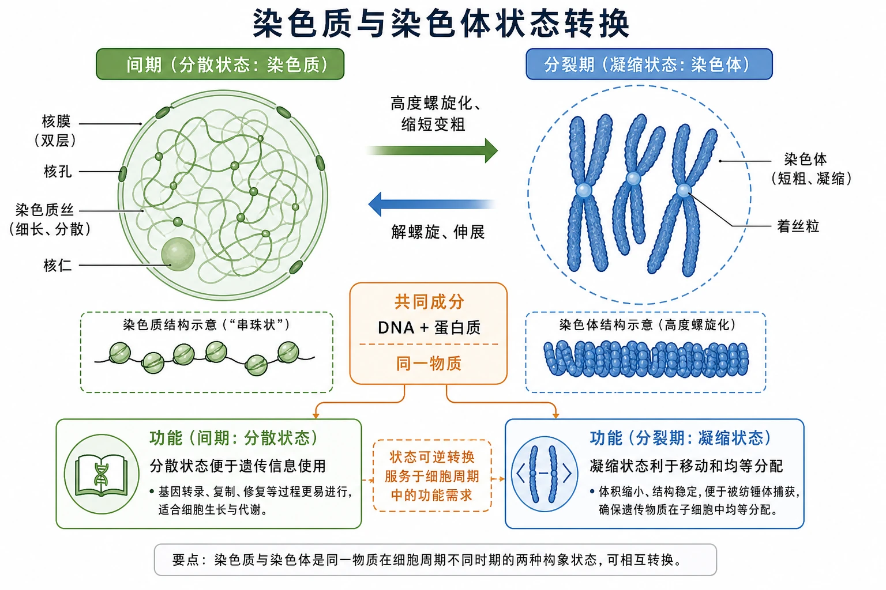
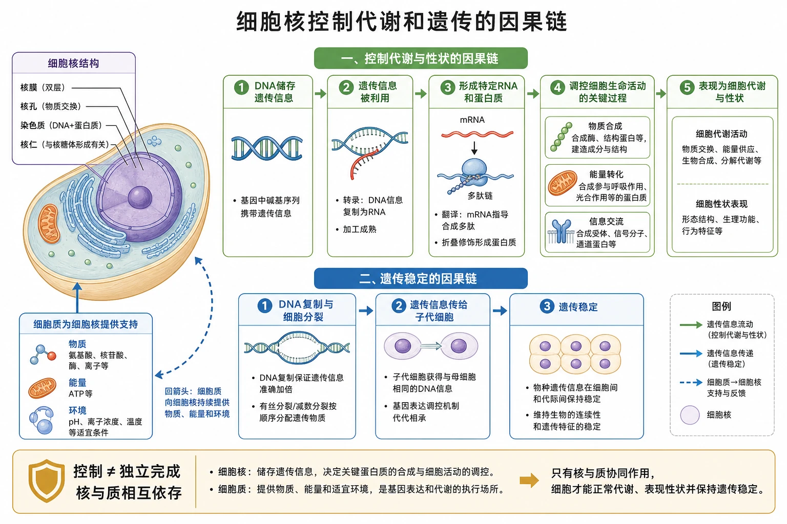
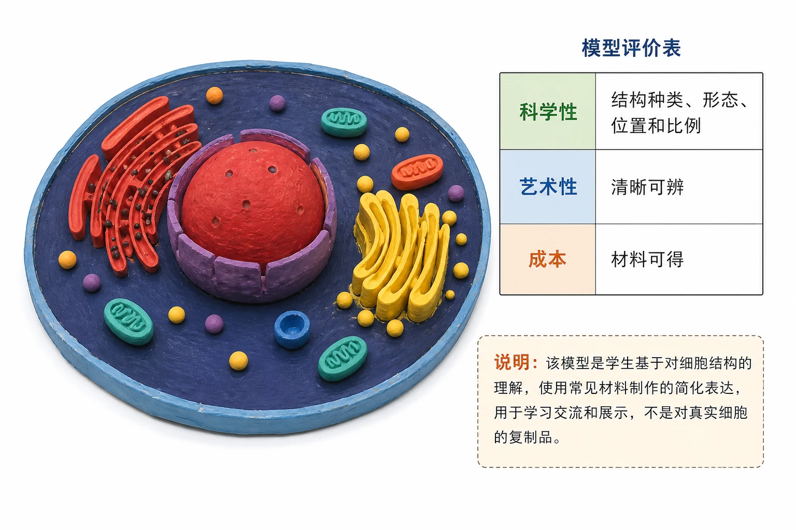
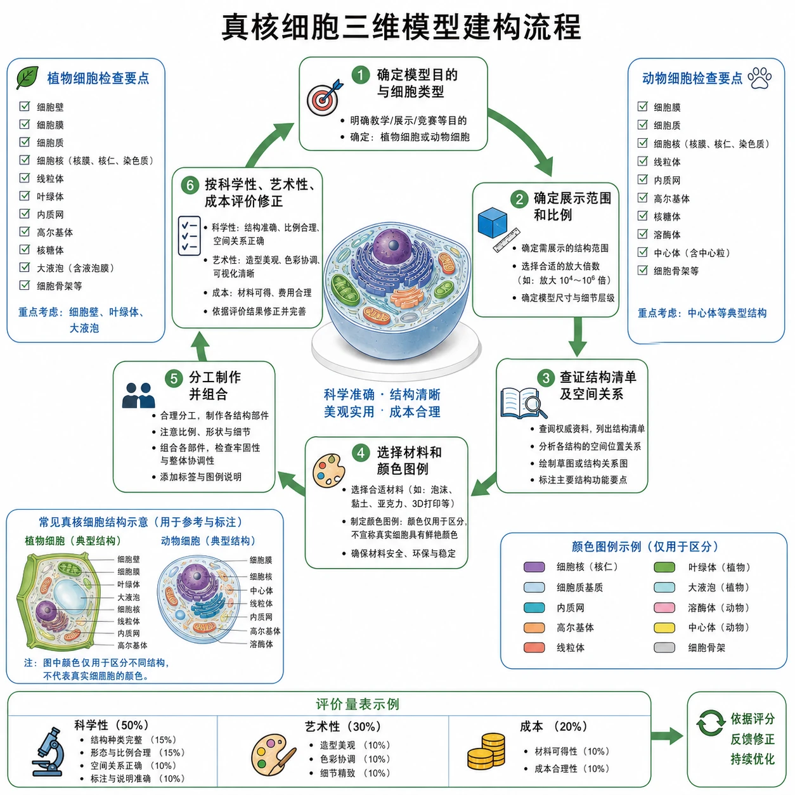
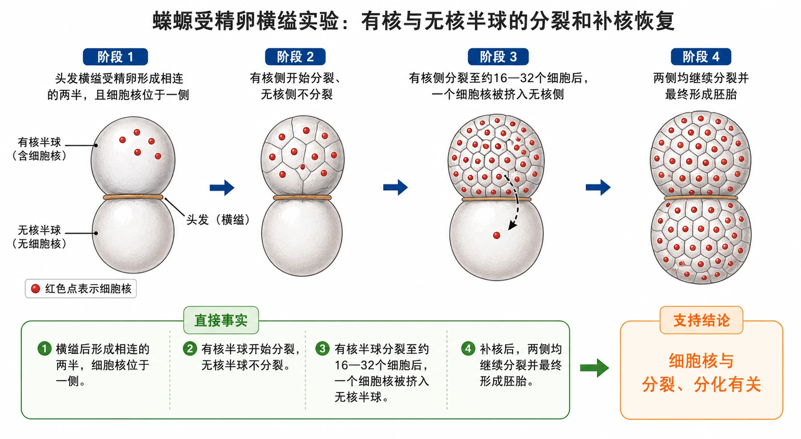
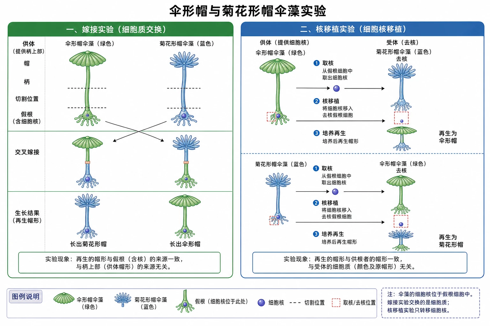
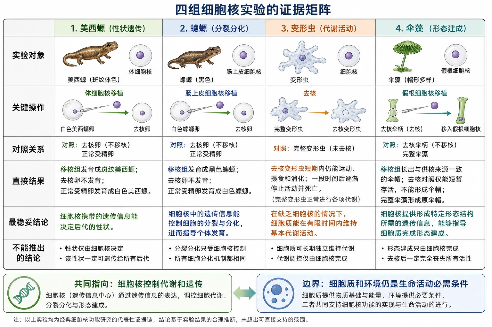

# 3.3 细胞核的结构和功能

## 知识关系导航

- 所属章节：[[章首 学习导图|细胞的基本结构]]
- 前置联系：[[3.2 细胞器之间的分工合作#主要细胞结构比较|细胞器是生命活动的执行结构]]
- 科技迁移：[[章末 生物科技进展 世界上首例体细胞克隆猴的诞生|体细胞核移植与克隆猴]]
- 综合复习：[[章末 整理与提升#主线三：实验怎样支持结论|实验与证据链]]

<!-- 图片描述：补充知识图（非教材原图）——“本节整体知识信息结构图”。左侧为证据链：克隆牛核移植、美西螈核移植、蝾螈横缢、变形虫去核/补核、伞藻嫁接与核移植；中部为结论“细胞核控制代谢和遗传”；右侧展开结构基础：核膜与核孔—核质交换，核仁—某种RNA合成及核糖体形成，染色质—DNA与蛋白质—遗传信息；底部连接染色质⇄染色体状态转换、物理模型建构和题型答题链“识别自变量→读结果→排除细胞质影响→限定结论”。绿色为细胞结构，蓝色为实验操作，橙色为结论与限制。 -->

## 本节学习目标

1. 从核移植、横缢、去核和嫁接实验中识别自变量、结果与结论。
2. 说明细胞核是遗传信息库，是细胞代谢和遗传的控制中心，并理解核质相互依存。
3. 识别核膜、核孔、核仁和染色质，说明结构与功能的联系。
4. 解释染色质和染色体是同一物质在细胞不同时期的两种存在状态。
5. 区分物理模型、概念模型和数学模型，按科学性优先原则制作细胞模型。

## 核心知识点讲解

### 一、知识对象与生命情境

真核细胞通常有细胞核，但高等植物成熟筛管细胞、哺乳动物成熟红细胞等少数细胞没有细胞核。不能由“没有核”推出它们从未有过核，也不能把所有真核细胞都说成有核。

#### 克隆牛情境

供核母牛乙的体细胞核被移入母牛甲的去核卵细胞，胚胎在母牛丙子宫中发育，克隆牛多数性状与乙相似。直接结果支持细胞核携带控制性状的主要遗传信息；“几乎”提醒我们，细胞质遗传物质、胚胎环境等也可能影响性状。

<!-- 图片描述：教材“问题探讨”源图重绘——“母牛乙与克隆牛”。忠实保留成年母牛乙与身旁克隆小牛的照片式构图、体色和“母牛乙”“克隆牛”标签，不把照片改造成完整核移植流程。旁设独立问题框，列“供核者乙、去核卵细胞提供者甲、代孕者丙”，用问号提示“多数核遗传性状更接近谁”，并注明照片外貌相似本身不是全过程证据，需结合核移植操作。 -->

### 二、核心概念与结构功能

#### 教材图3-10：细胞核结构

核膜是双层膜，把核内物质与细胞质分开；核孔实现核质之间频繁的物质交换和信息交流，但不是任意物质自由出入；核仁与某种RNA合成及核糖体形成有关；染色质主要由DNA和蛋白质组成，DNA是遗传信息的载体。

<!-- 图片描述：教材图3-10源图重绘——“细胞核结构模式图”。绘制球形细胞核的局部剖面，外周为双层核膜，膜上均匀分布环形核孔；核内深色致密球体为核仁，浅色丝状/颗粒状区域为染色质。四条引线准确标“核膜、核孔、核仁、染色质”，旁注分别为“把核内物质与细胞质分开”“实现核质之间频繁的物质交换和信息交流”“与某种RNA合成及核糖体形成有关”“主要由DNA和蛋白质组成”。不添加教材未画出的DNA复制或转录过程。 -->

#### 染色质和染色体

染色质是极细丝状物，细胞分裂时高度螺旋化、缩短变粗，成为可清晰观察的染色体；分裂末期染色体解螺旋，恢复染色质状态。二者主要成分相同，是同一物质在不同时期的两种存在状态。丝状染色质便于遗传信息的读取，凝缩染色体便于遗传物质准确分配。

<!-- 图片描述：补充知识图（非教材原图）——“染色质与染色体状态转换”。左右两态：间期细胞核内细长、分散的染色质丝与分裂期短粗、凝缩的染色体，中间双向箭头分别标“高度螺旋化、缩短变粗”和“解螺旋、伸展”；共同成分框写“DNA+蛋白质，同一物质”，功能框写“分散状态便于遗传信息使用”“凝缩状态利于移动和均等分配”。不得画成两种不同物质或相互合成关系。 -->

### 三、关键过程、规律与调控机制

#### 细胞核为什么能成为控制中心

DNA储存遗传信息。细胞分裂时，遗传信息传递给子代细胞；细胞依据遗传信息合成相应物质、完成能量转化和信息交流，从而影响代谢、生长、发育、衰老和凋亡。因此，细胞核的控制是通过遗传信息及其表达实现的，不是细胞核直接替每个细胞器完成反应。

更完整的表述是：**细胞核是遗传信息库，是细胞代谢和遗传的控制中心。**同时，细胞核必须依赖细胞质提供物质、能量和适宜环境，完整生命活动由核与质共同完成。

<!-- 图片描述：补充知识图（非教材原图）——“细胞核控制代谢和遗传的因果链”。中心因果链为DNA储存遗传信息→遗传信息被利用→形成特定RNA和蛋白质→调控物质合成、能量转化、信息交流→表现为细胞代谢与性状；另一条为DNA复制与细胞分裂→遗传信息传给子代细胞→遗传稳定。细胞质以回箭头向细胞核提供物质、能量和环境，边界框强调“控制≠独立完成，核与质相互依存”。 -->

### 四、典型模型与分析方法

模型是为特定目的对对象所作的简化、概括描述。实物或图画模型属于物理模型；概念之间的关系图属于概念模型；用公式或数量关系表达的是数学模型。评价真核细胞三维模型时，科学性第一，其次才是艺术性和成本。

<!-- 图片描述：教材“探究·实践”源图重绘——“北京某中学学生制作的细胞模型”。忠实重绘椭圆形底板上的彩色实物模型：红色大球状细胞核、黄色堆叠高尔基体样结构、红色片层内质网样结构及分散的小球和椭圆配件，保持学生手工作品质感；不替原作品补齐标签或改造成标准细胞剖面。旁设评价表“科学性：结构种类、形态、位置和比例；艺术性：清晰可辨；成本：材料可得”，强调模型是简化表达而非真实细胞复制品。 -->

<!-- 图片描述：补充知识图（非教材原图）——“真核细胞三维模型建构流程”。六步环形流程：确定模型目的与细胞类型→确定展示范围和比例→查证结构清单及空间关系→选择材料和颜色图例→分工制作并组合→按科学性、艺术性、成本评价修正。检查表明确植物模型需考虑细胞壁、叶绿体和大液泡，动物模型需考虑中心体等典型结构；颜色只用于区分，不宣称真实细胞具有鲜艳颜色。 -->

### 五、图表、实验与证据链

#### 资料1：美西螈核移植

黑色美西螈胚胎细胞核移入白色美西螈去核卵细胞，后代为黑色。自变量是移入细胞核的来源，结果支持皮肤颜色主要由细胞核中的遗传信息控制。

#### 资料2：蝾螈受精卵横缢

有核半球分裂，无核半球停止；后来把一个细胞核挤入无核半球，该半球恢复分裂并能发育。实验同时包含去核效应与补核恢复，支持细胞核与分裂、分化密切相关。

<!-- 图片描述：教材“蝾螈受精卵横缢实验”源图重绘——“有核与无核半球的分裂和补核恢复”。按原图从左到右四阶段：头发横缢受精卵形成相连的两半且细胞核位于一侧；有核侧开始分裂、无核侧不分裂；有核侧分裂至约16—32个细胞后一个细胞核被挤入无核侧；两侧均继续分裂并最终形成胚胎。保留红色细胞核点、横缢线和阶段箭头，不增加具体时间。结果框区分“直接事实”和“支持结论：细胞核与分裂、分化有关”。 -->

#### 资料3：变形虫去核与补核

有核部分能摄食、响应刺激、生长和分裂；无核部分短期仍能消化已吞噬食物，但不能摄食，细胞器逐渐退化。去掉有核部分的核会出现类似变化，及时补入同种核又可恢复。它说明细胞核控制代谢，但细胞质中已有物质可使部分活动短期维持。

#### 资料4：伞藻嫁接与核移植

伞藻细胞核位于假根。仅进行柄与假根嫁接时，早期形态可能受原有细胞质影响；核移植后，新形成的伞帽形态与供核伞藻一致，支持形态建成主要受细胞核控制。

<!-- 图片描述：教材“伞藻嫁接和核移植实验”源图重绘——“伞形帽与菊花形帽伞藻实验”。左右两大面板：左为嫁接实验，完整呈现两种伞藻的帽、柄、假根，切割后交叉嫁接及长出不同帽形的结果；右为核移植实验，用箭头表示从一种伞藻假根区域取核并移入另一种去核结构，最终再生帽形与供核者一致。颜色沿用原图区分两种伞藻，图例明确细胞核位于假根；不得省略嫁接与核移植的差别，也不在题图主体直接写“由细胞核控制”的答案。 -->

<!-- 图片描述：补充知识图（非教材原图）——“四组细胞核实验的证据矩阵”。行列矩阵：实验对象（美西螈、蝾螈、变形虫、伞藻）、关键操作、对照关系、直接结果、最稳妥结论、不能推出的结论；分别对应性状遗传、分裂分化、代谢活动、形态建成。底部汇总“共同指向：细胞核控制代谢和遗传”“边界：细胞质和环境仍是生命活动必需条件”。 -->

### 六、题型应用与迁移

实验材料题统一按五步：①找操作改变了什么；②找实验组和对照组；③只描述图中结果；④把结果连接到代谢、遗传或发育；⑤检查是否把“主要控制”夸成“唯一决定”。

## 重点梳理

- 细胞核结构：核膜、核孔、核仁、染色质。
- 核膜分隔核质；核孔进行选择性的物质交换和信息交流；核仁参与某种RNA合成及核糖体形成；染色质承载遗传信息。
- 染色质与染色体是同一物质在不同时期的两种存在状态。
- 四组实验分别从性状、分裂分化、代谢和形态建成支持细胞核的控制作用。
- 细胞核是遗传信息库，是代谢和遗传的控制中心，但核与质相互依存。

## 难点突破

### 1. “控制中心”不是“生命活动唯一场所”

代谢反应大量发生在细胞质和细胞器中。细胞核通过遗传信息控制这些活动；去核细胞还可能凭已有酶和物质维持短期活动，却不能长期更新和正常繁殖。

### 2. 克隆个体为何是“几乎”相同

供核者提供主要核遗传信息，去核卵细胞仍提供细胞质和少量细胞质遗传物质，代孕母体及生活环境也会影响表型。因此不能写“所有性状完全相同”。

### 3. 核孔不是敞开的普通孔洞

核孔具有选择性，大分子物质的核质交换受调控。题目中的“指令”常以RNA等形式输出，而不是DNA整条穿出细胞核。

## 例题讲解

### 例题：如何评价变形虫去核实验

**题目**：无核变形虫短期仍能消化食物，能否否定细胞核控制代谢？

**分析**：去核前细胞质已含有酶和其他物质，短期反应可继续；但无核部分不能摄食、响应刺激，细胞器退化，无法长期生长分裂。补核后恢复增强了因果证据。

**答案**：不能否定。实验说明细胞核对正常、持久的代谢活动具有控制作用；细胞质中已有物质可使部分活动暂时维持，同时也说明核与质相互依存。

## 易错点整理

1. 写“DNA只存在于细胞核”——线粒体、叶绿体也含少量DNA。
2. 写“核仁合成核糖体”——教材表述是与某种RNA合成及核糖体形成有关。
3. 写“染色质变成另一种物质染色体”——二者是同一物质的不同状态。
4. 把母牛丙当作克隆牛核遗传信息来源——丙主要提供胚胎发育环境。
5. 由核移植实验推出细胞质没有作用——结论越界。

## 考点考证点整理

### 考点一：细胞核结构识图

- 出题思路：给核局部图，判断核膜、核孔、核仁、染色质及功能。
- 关键条件：双层边界、孔道、深色核仁、丝状染色质。
- 解答要点：名称与引线对应；写结构功能时使用教材限定语。
- 易扣分点：核孔写成自由通道；把核仁等同于核糖体。

### 考点二：核实验材料分析

- 出题思路：改变细胞核有无或来源，比较性状、代谢、分裂和发育结果。
- 关键条件：供核者、受体是否去核、是否有恢复实验、观察时间。
- 解答要点：按“操作—结果—结论—边界”表达；多个实验可相互补强。
- 易扣分点：只复述结果；用“唯一决定”替代“主要控制”。

### 考点三：染色质与染色体

- 出题思路：判断物质组成、时期状态及转化意义。
- 关键条件：是否处于分裂期、形态是细丝还是短粗结构。
- 解答要点：同一物质、主要由DNA和蛋白质组成；凝缩利于分配，解凝缩利于遗传信息利用。
- 易扣分点：认为二者同时作为两套不同结构存在。

### 考点四：模型评价

- 出题思路：评价细胞三维模型的比例、位置、结构取舍与配色。
- 关键条件：模型目的、细胞类型、科学性和简化边界。
- 解答要点：先核查结构和空间关系，再评价可读性与成本；颜色用于区分而非真实色彩。
- 易扣分点：只评价美观；把模式模型当真实尺度。

## 练习题

1. **教材概念检测第1题**：判断：①控制物质合成和能量转化的指令主要通过核孔由核到质；②细胞核功能与染色质密切相关。
2. **教材概念检测第2题**：细胞核内行使遗传功能的结构是核膜、核孔、染色质还是核仁？
3. **教材概念检测第3题**：下列哪项不能作为细胞核是控制中心的论据：DNA主要在核内；核控制代谢遗传；核是遗传物质储存复制场所；核位于细胞正中央。
4. **教材拓展应用第1题**：说明染色质和染色体两种状态对细胞生命活动的意义。
5. **教材思考讨论**：综合美西螈、蝾螈、变形虫和伞藻实验，分别写出直接结果和结论。
6. **提升题**：克隆牛所有细胞核是否都直接来自母牛乙体细胞核？说明理由。

## 练习题答案

1. ①正确，遗传信息表达形成的RNA等可经核孔进入细胞质并指导蛋白质合成；②正确，染色质中的DNA承载遗传信息，是核控制代谢和遗传的物质基础。
2. 染色质（C）。其主要成分包括DNA和蛋白质，DNA储存遗传信息。
3. “细胞核位于细胞正中央”（D）不能作为功能论据；细胞核位置并不总在正中央，位置本身也不能证明控制作用。
4. 染色质细长、分散，便于遗传信息的利用；分裂期染色体高度凝缩，便于移动并准确分配到子细胞。二者是同一物质在不同阶段适应不同任务的状态。
5. 美西螈：供核黑色后代黑色，支持核控制肤色遗传；蝾螈：有核侧分裂、无核侧停止且补核恢复，支持核与分裂分化有关；变形虫：去核后代谢逐步异常且补核恢复，支持核控制代谢；伞藻：核移植后的帽形趋向供核者，支持核控制形态建成。共同结论必须保留核质相互依存边界。
6. 不是。最初胚胎的细胞核来自母牛乙体细胞核，但随着有丝分裂，后续细胞核由该细胞核复制遗传物质并分裂形成，可表述为“都源于供核细胞核的增殖后代”，而非每个核都直接取自母牛乙。
