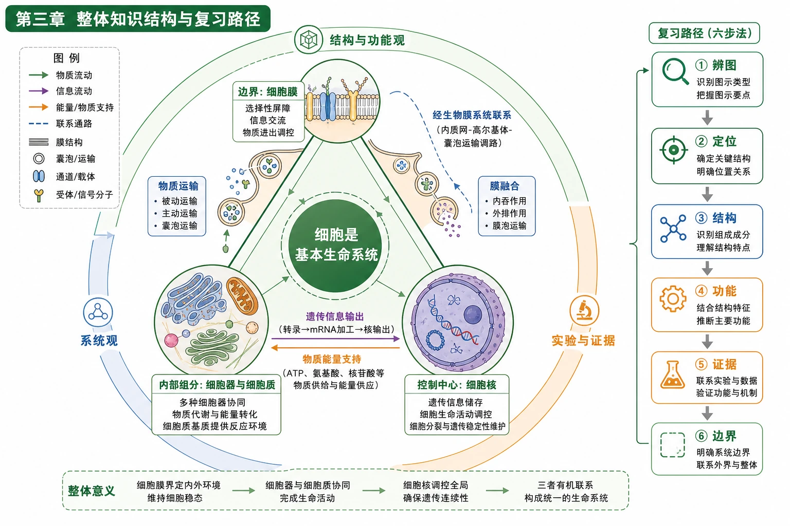
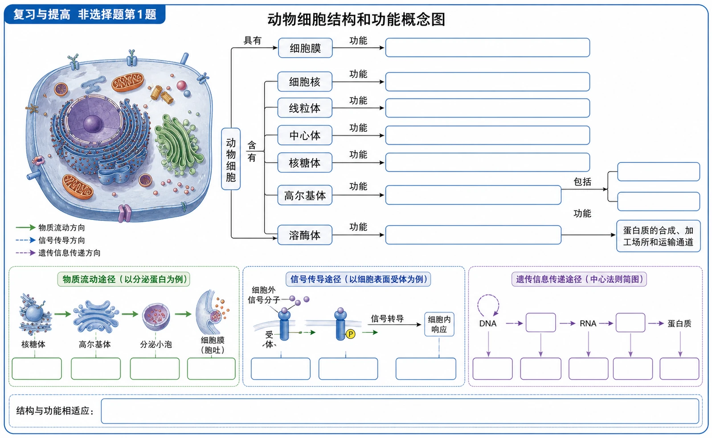
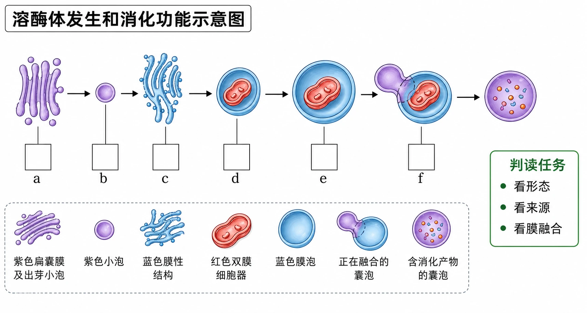

# 第三章 细胞的基本结构·整理与提升

## 知识关系导航

- 章节导图：[[章首 学习导图|第三章学习导图]]
- 边界结构：[[3.1 细胞膜的结构和功能]]
- 分工合作：[[3.2 细胞器之间的分工合作]]
- 控制中心：[[3.3 细胞核的结构和功能]]

<!-- 图片描述：补充知识图（非教材原图）——“第三章整体知识结构与复习路径”。中心为“细胞是基本生命系统”，三角形三个顶点为“边界：细胞膜”“内部组分：细胞器与细胞质”“控制中心：细胞核”；边界与内部之间标物质运输和膜融合，内部与细胞核之间标遗传信息输出和物质能量支持，细胞膜与细胞核之间经生物膜系统联系。外环依次标三种核心素养“结构与功能观、系统观、实验与证据”，右侧给出复习步骤“辨图→定位→结构→功能→证据→边界”。 -->

## 本节学习目标

1. 建立“细胞膜—细胞器—细胞核”的系统联系。
2. 能从结构图、过程图和实验图中提取事实并形成有边界的结论。
3. 用结构功能观解释膜融合、细胞器分工和细胞核控制作用。

## 核心知识点讲解

### 本章主线回顾

### 主线一：结构与功能相适应

- 磷脂双分子层的疏水内部形成屏障，膜蛋白承担运输、识别等专一功能，流动性支持形变与融合。
- 线粒体嵴、叶绿体基粒等增大膜面积；内质网相通膜腔和高尔基体扁囊、囊泡适于加工运输。
- 核膜、核孔、核仁和染色质分别支持分隔、交换、核糖体形成和遗传信息储存。

### 主线二：细胞是统一的生命系统

细胞膜维持边界，细胞器分工执行，细胞核通过遗传信息调控。生物膜系统把分区与联系统一起来；任何结构都不能脱离其他组分独立完成完整生命活动。

### 主线三：实验怎样支持结论

| 方法 | 追踪对象 | 典型结论 | 结论边界 |
|---|---|---|---|
| 荧光标记与细胞融合 | 膜蛋白空间分布 | 膜具有流动性 | 不能说所有蛋白任何条件下都自由运动 |
| 同位素标记 | 分泌蛋白随时间的位置 | 合成运输路线 | 追踪的是标记物，不是细胞器整体移动 |
| 差速离心 | 不同沉降特性的颗粒 | 逐级分离细胞器 | 沉淀通常只是富集，不必然纯净 |
| 核移植、横缢、去核补核 | 细胞核有无或来源 | 核控制代谢和遗传 | 不能排除细胞质和环境作用 |

## 重点梳理

- 边界不是封闭：细胞膜在分隔的同时进行选择性运输和信息交流。
- 分工不是孤立：细胞器通过物质流、能量流和膜结构联系协同工作。
- 控制不是包办：细胞核保存和利用遗传信息，具体生命活动依赖核质共同完成。
- 看图不是猜图：先读可见事实，再调用知识解释，最后限定结论范围。

## 难点突破

### 综合答题模板

结构功能题使用“结构X具有……特点，这使它能够……，因此适于完成……功能”。实验材料题使用“实验改变……；观察到……；与对照相比……；因此支持……；但不能说明……”。过程图先按箭头排序，再逐节点写“发生场所—物质变化—膜变化—能量来源”。

## 例题讲解

### 章末图像题精讲

### 1. 动物细胞结构与功能概念图

教材概念图保留多个空框。作答应先看连接词：“动物细胞具有细胞膜、细胞质和细胞核”；细胞质含细胞质基质和细胞器；细胞器包括线粒体、中心体、核糖体、高尔基体、内质网、溶酶体等。功能框再分别填写中心体与有丝分裂有关、核糖体合成蛋白质、内质网是蛋白质等大分子合成加工和运输通道等。

<!-- 图片描述：教材“复习与提高非选择题第1题”源图重绘——“动物细胞结构和功能概念图”。完整保留原图蓝色圆角框、层级连接线、连接词“具有、含有、包括、功能”和所有待填空白框；已给节点包括动物细胞、细胞膜、细胞核、线粒体、中心体、核糖体、高尔基体、溶酶体及“蛋白质的合成、加工场所和运输通道”。不得在源图主体中填写答案，空框尺寸和连接位置要便于后续练习。 -->

### 2. 溶酶体发生与消化图

图中a为高尔基体，形成初生溶酶体b；c为内质网，形成膜泡e包裹衰老线粒体d；b与e融合为f并消化内容物。融合说明生物膜具有一定流动性，各膜主要由脂质和蛋白质构成。

<!-- 图片描述：教材“复习与提高非选择题第2题”源图重绘——“溶酶体发生和消化功能示意图”。保持原题从左到右流程和字母未知信息：紫色扁囊a出芽形成紫色小泡b；蓝色膜性结构c形成包裹红色双膜细胞器d的膜泡e；b与e汇合形成正在融合的f，随后形成含消化产物的囊泡。保留a—f字母、黑色方向箭头和不同颜色图例，不在源图中写高尔基体、内质网、线粒体等答案。图旁仅列判读任务“看形态、看来源、看膜融合”，保持题目训练功能。 -->

## 易错点整理

1. “各种生物膜成分和结构完全相同”错，应为基本组成和结构相似，蛋白质种类与比例因功能不同而有差异。
2. “中心体参与蛋白质合成”错，核糖体直接承担蛋白质合成，中心体与有丝分裂有关。
3. “白细胞吞噬病菌体现选择透过性”不够准确，吞噬更直接体现膜具有一定流动性。
4. “染色体主要由DNA和RNA组成”错，主要由DNA和蛋白质组成。
5. “植物细胞都有叶绿体和大液泡”错，需结合细胞类型和发育状态。

## 考点考证点整理

### 考点一：细胞亚显微结构综合识图

- 出题思路：以动植物细胞、局部细胞器或概念图设空。
- 关键条件：膜层数、内部形态、细胞类型和连接词。
- 解答要点：先定对象，再写判据和功能，最后核对结构是否属于生物膜系统。
- 易扣分点：只凭颜色猜结构；把典型结构绝对化为所有细胞都有。

### 考点二：膜系统过程图

- 出题思路：以分泌蛋白、溶酶体形成或囊泡融合考查膜联系。
- 关键条件：箭头方向、囊泡来源、膜融合和能量需求。
- 解答要点：按时空顺序写全结构，联系膜组成相似和流动性。
- 易扣分点：漏掉细胞膜或囊泡；把膜成分写成完全相同。

### 考点三：实验结论边界

- 出题思路：综合荧光、同位素和核移植材料要求评价结论。
- 关键条件：直接观察结果、对照、自变量和样本条件。
- 解答要点：使用“支持/说明在该条件下”，并指出不能推出的绝对命题。
- 易扣分点：把相关性直接写成唯一因果；把“主要控制”写成“唯一决定”。

## 练习题

1. 不看教材，画出细胞膜截面并标明细胞外侧、磷脂头尾、三类膜蛋白和糖被。
2. 按“双膜—单膜—无膜”归类主要细胞器，并各写一个结构功能联系。
3. 写出分泌蛋白路线，说明两次囊泡融合分别发生在哪里。
4. 比较荧光标记、同位素标记和核移植实验的研究对象与结论。
5. 完成教材章末动物细胞概念图和溶酶体发生图，保留每个空格或字母的推理依据。

## 练习题答案

1. 图中两排磷脂的亲水头分别朝细胞外液和细胞质，疏水尾在膜内部相对；膜蛋白应包含表面附着、部分嵌入和贯穿三种位置；糖链只画在细胞外侧并与蛋白质或脂质相连。检查重点是方向、不对称性和镶嵌方式。
2. 双层膜包括线粒体、叶绿体，二者内部膜结构分别形成嵴和基粒，有利于增大相关反应的膜面积；单层膜包括内质网、高尔基体、液泡、溶酶体，膜围成的腔或囊泡有利于分区、加工和运输；无膜结构包括核糖体、中心体，分别参与蛋白质合成和细胞分裂。
3. 分泌路线为核糖体→粗面内质网→运输囊泡→高尔基体→分泌囊泡→细胞膜→细胞外。运输囊泡先与高尔基体膜融合，分泌囊泡再与细胞膜融合；两次融合都以膜基本结构相似和具有流动性为基础。
4. 荧光标记追踪膜蛋白空间重排，支持膜流动性；同位素标记追踪分泌蛋白随时间转移，支持合成运输路线；核移植改变细胞核来源，支持细胞核携带控制代谢和遗传的主要信息。三者都不能把特定条件下的支持扩大为无条件绝对结论。
5. 概念图依连接词填细胞质、细胞质基质、细胞器、内质网及中心体、核糖体功能；溶酶体图中a为高尔基体、c为内质网、d为线粒体，融合体现膜流动性。每一空都应由形态、来源或连接词确定。
