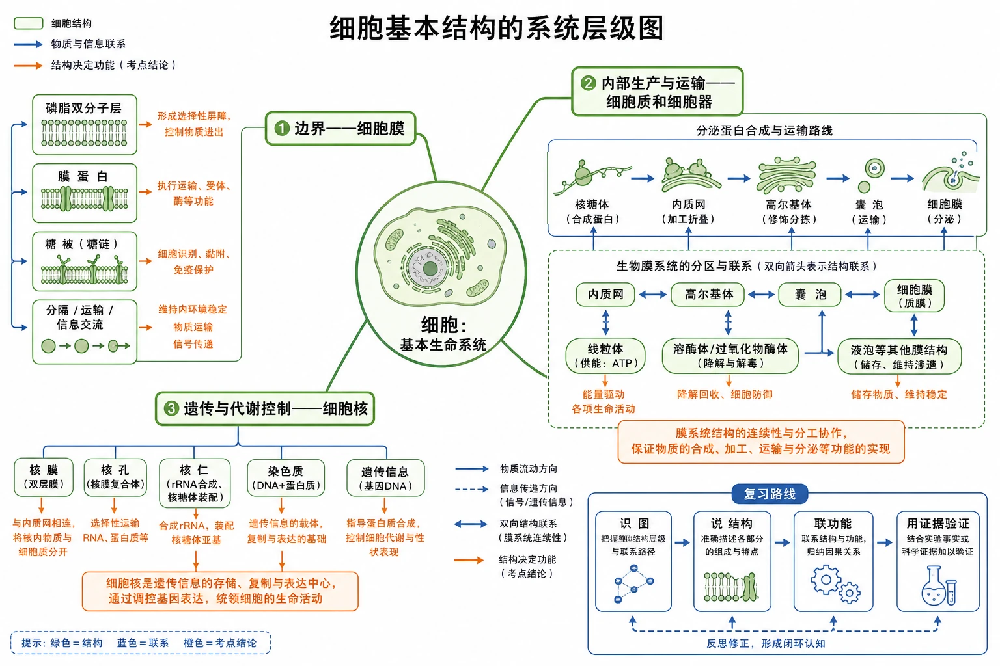

# 第三章 细胞的基本结构·学习导图

<!-- 图片描述：补充知识图（非教材原图）——“细胞基本结构的系统层级图”。中心为“细胞：基本生命系统”，向外分三条一级分支：边界—细胞膜、内部生产与运输—细胞质和细胞器、遗传与代谢控制—细胞核；细胞膜分支连接磷脂双分子层、膜蛋白、糖被及分隔/运输/信息交流；细胞器分支连接核糖体—内质网—高尔基体—囊泡—细胞膜的分泌蛋白路线，并旁接线粒体供能、生物膜系统分区；细胞核分支连接核膜、核孔、核仁、染色质及遗传信息；用双向箭头标示膜系统的结构联系，用橙色因果箭头标示“结构决定功能”，右下角给出复习路线“识图→说结构→联功能→用证据验证”。白色背景、黑灰轮廓，绿色表示细胞结构，蓝色表示物质和信息联系，橙色表示考点结论。 -->

## 本章主线

细胞不是分子的简单堆积，而是一个有边界、内部组分分工合作、又有遗传控制中心的开放系统。学习时始终追问：**结构在哪里、由什么构成、结构特点是什么、承担什么功能、有什么图像或实验能证明。**

## 小节导航

1. [[3.1 细胞膜的结构和功能]]：先认识细胞的边界，再用科学史证据建构流动镶嵌模型。
2. [[3.2 细胞器之间的分工合作]]：进入细胞内部，比较细胞器结构与功能，并沿分泌蛋白路线理解协作和生物膜系统。
3. [[3.3 细胞核的结构和功能]]：从核移植、横缢和伞藻实验获得证据，解释细胞核为什么是遗传信息库和代谢、遗传的控制中心。
4. [[章末 生物科技进展 世界上首例体细胞克隆猴的诞生]]：把细胞核功能迁移到体细胞核移植技术、技术难点和伦理边界。
5. [[章末 整理与提升]]：用结构—功能—证据链整合全章，并完成章末图像题。

## 跨小节关系

- **结构基础**：[[3.1 细胞膜的结构和功能#流动镶嵌模型|流动镶嵌模型]]解释了囊泡为何能与细胞膜融合，是理解[[3.2 细胞器之间的分工合作#分泌蛋白的合成和运输|分泌蛋白运输]]的前提。
- **局部到系统**：单个细胞器各有分工，膜性细胞器又通过囊泡或膜的连续性形成[[3.2 细胞器之间的分工合作#生物膜系统|生物膜系统]]。
- **控制与执行**：细胞核保存并利用遗传信息，核糖体、内质网、高尔基体等执行物质合成与加工；细胞生命活动是核与质共同作用的结果。
- **证据方法**：荧光标记、同位素标记、核移植和横缢实验都遵循“提出问题—控制变量—观察结果—限定结论”的证据链。

## 全章高频识图任务

| 图像对象 | 先看什么 | 核心结论 |
|---|---|---|
| 细胞膜模式图 | 内外方向、磷脂头尾、蛋白位置、糖被所在侧 | 膜具有不对称性、流动性，结构与运输和识别功能相适应 |
| 动植物细胞图 | 细胞壁、叶绿体、大液泡、中心体及共有细胞器 | 不能用单一结构绝对判断全部细胞类型，要结合材料语境 |
| 分泌蛋白过程图 | 核糖体→内质网→囊泡→高尔基体→囊泡→细胞膜 | 合成、加工、运输和分泌由多结构协作，线粒体主要供能 |
| 细胞核模式图 | 核膜双层、核孔、核仁、染色质 | 结构支持核质交换、核糖体形成和遗传信息储存 |
| 核实验图 | 自变量是否为“有无细胞核/细胞核来源” | 结果支持细胞核控制代谢和遗传，但不能忽视细胞质条件 |
