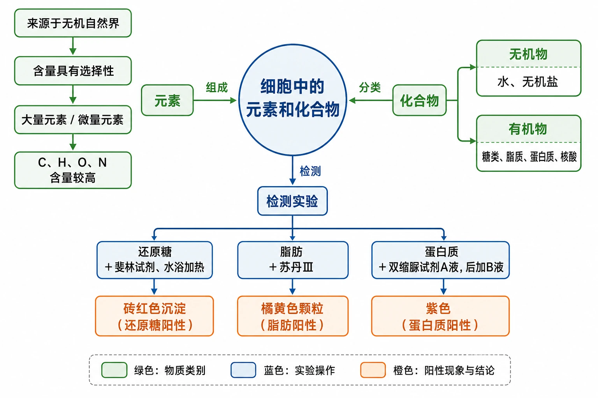
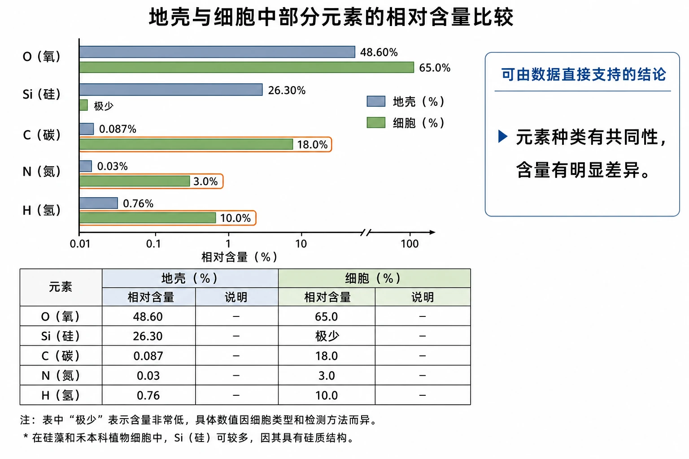
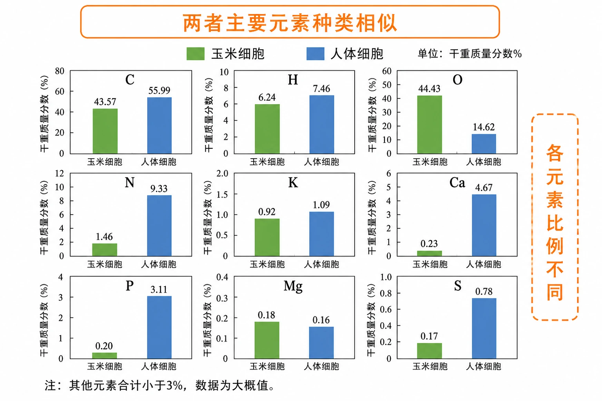
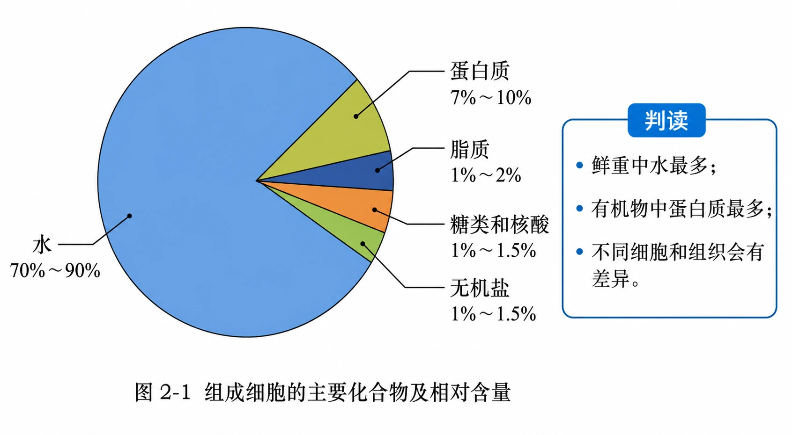
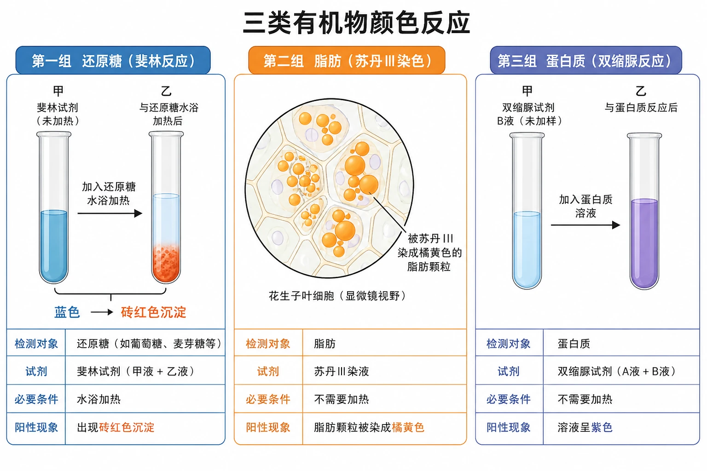
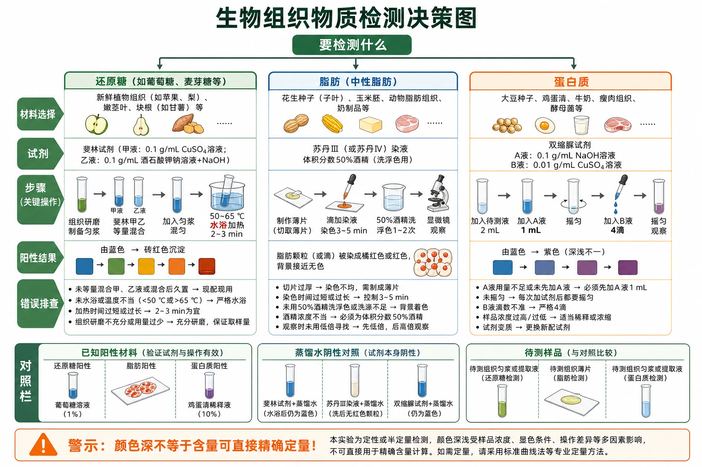
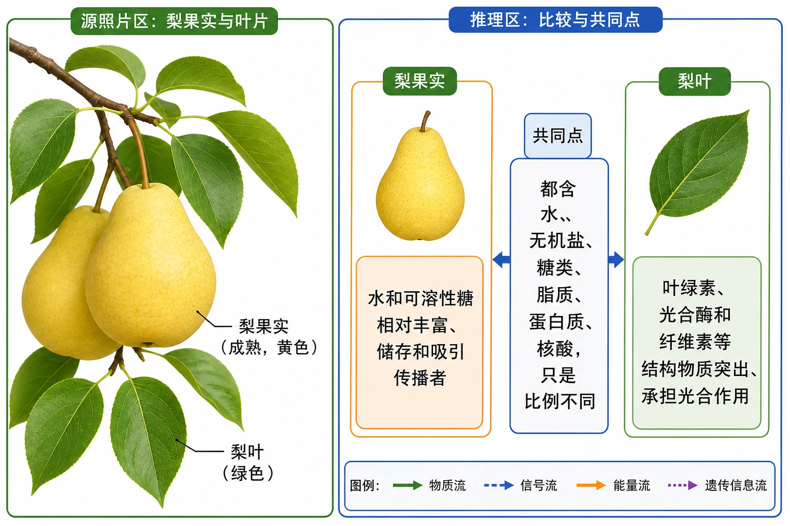

# 2.1 细胞中的元素和化合物

## 知识关系导航

- 所属章节：[[章首 学习导图|第二章 组成细胞的分子]]
- 后续知识：[[2.2 细胞中的无机物]]、[[2.3 细胞中的糖类和脂质]]、[[2.4 蛋白质是生命活动的主要承担者]]、[[2.5 核酸是遗传信息的携带者]]分别展开本节列出的主要化合物。
- 方法迁移：本节“颜色反应—对照—结论”的证据逻辑，是后续生物实验分析的基础。

<!-- 图片描述：补充知识图（非教材原图）——本节整体知识信息结构图。中心为“细胞中的元素和化合物”，左支“元素”依次展开“来源于无机自然界→含量具有选择性→大量元素/微量元素→C、H、O、N含量较高”；右支“化合物”展开“无机物：水、无机盐”和“有机物：糖类、脂质、蛋白质、核酸”；下支“检测实验”用三条并列流程表示“还原糖＋斐林试剂、水浴加热→砖红色沉淀”“脂肪＋苏丹Ⅲ→橘黄色颗粒”“蛋白质＋双缩脲试剂A液后加B液→紫色”。蓝色表示实验操作，绿色表示物质类别，橙色表示阳性现象与结论，箭头标明“组成、分类、检测”。 -->

## 本节学习目标

1. 说明组成细胞的元素在无机自然界都能找到，并从含量差异理解统一性与特殊性。
2. 区分大量元素和微量元素，理解“含量少”不等于“作用小”。
3. 读懂地壳—细胞、玉米—人体元素含量表以及细胞主要化合物比例图。
4. 掌握还原糖、脂肪和蛋白质检测的材料、试剂、操作、现象与结论边界。

## 核心知识点讲解

### 一、知识对象与生命情境

组成细胞的元素都存在于无机自然界，说明生物界与非生物界具有统一性；但同种元素在细胞和地壳中的相对含量差异很大，说明细胞会通过吸收、运输、代谢和排出对物质进行选择。生命并非依靠某种“生命元素”，而依靠普通元素形成的特殊分子体系。

<!-- 图片描述：教材“问题探讨”数据表源图重绘——地壳与细胞中部分元素的相对含量比较。使用横向分组柱状图加数据表：O为地壳48.60%、细胞65.0%；Si为地壳26.30%、细胞极少，并在脚注注明硅藻和禾本科植物细胞中Si可较多；C为0.087%与18.0%；N为0.03%与3.0%；H为0.76%与10.0%。纵轴使用对数或断轴时必须明确标识，避免小数值不可见；地壳用灰蓝色、细胞用绿色，橙色圈出C、H、N在细胞中的显著富集。图旁列出可由数据直接支持的结论：“元素种类有共同性，含量有明显差异”；不得把差异直接解释成某种元素只存在于生物体。 -->

### 二、核心概念与结构功能

#### 组成细胞的元素

- 大量元素：细胞中含量相对较多，如C、H、O、N、P、S、K、Ca、Mg。
- 微量元素：需要量和含量很少，如Fe、Mn、Zn、Cu、B、Mo，但常参与酶、色素或调节过程，缺乏仍会造成严重影响。
- C、H、O、N含量较高，是因为水以及糖类、脂质、蛋白质、核酸等主要化合物大量含有这些元素。

教材玉米细胞与人体细胞干重数据中，两者含量较多的四种元素均为C、H、O、N，体现统一性；具体质量分数不同，体现细胞组成和代谢特点的差异。比较数据必须注意“干重”，水已被排除，不能与鲜重数据混用。

<!-- 图片描述：教材“比较组成玉米细胞和人体细胞的元素及含量”表格源图重绘。制作九组并列柱状图并保留精确数据：C 43.57/55.99，H 6.24/7.46，O 44.43/14.62，N 1.46/9.33，K 0.92/1.09，Ca 0.23/4.67，P 0.20/3.11，Mg 0.18/0.16，S 0.17/0.78，单位为干重质量分数%；玉米用绿色、人体用蓝色。上方橙框总结“两者主要元素种类相似”，右侧标注“各元素比例不同”；脚注明确“其他元素合计小于3%，数据为大概值”。用于训练读取变量、单位、共同点和差异。 -->

#### 组成细胞的化合物

| 类别 | 主要物质 | 典型作用 |
|---|---|---|
| 无机物 | 水、无机盐 | 溶剂、反应环境、结构组成、离子调节 |
| 有机物 | 糖类、脂质、蛋白质、核酸 | 供能、储能、构成结构、催化运输、携带遗传信息 |

鲜重细胞中水通常最多；有机化合物中蛋白质通常最多。比例是大量不同细胞的统计范围，不等于任意细胞都完全相同。

<!-- 图片描述：教材图2-1源图重绘——“组成细胞的主要化合物及相对含量”。忠实重绘圆饼图：水占70%～90%，蛋白质占7%～10%，脂质占1%～2%，糖类和核酸占1%～1.5%，无机盐占1%～1.5%；每个扇区使用清晰引线和中文标签，面积关系与比例范围一致。水用蓝色、蛋白质用黄绿色，其他小扇区用易区分的深蓝、橙、浅绿。右侧增加不改变源图数据的判读框：“鲜重中水最多；有机物中蛋白质最多；不同细胞和组织会有差异。” -->

### 三、关键过程、规律与调控机制

物质检测的基本逻辑是：待测物与特定试剂发生颜色反应，通过阳性现象推断样品中存在相应物质。没有出现预期颜色只能说明在当前材料、浓度和操作条件下未检出，不能绝对断言完全不存在。

| 检测对象 | 试剂与操作 | 阳性现象 | 关键注意 |
|---|---|---|---|
| 还原糖 | 斐林试剂甲、乙液等量现配现用；50～65℃水浴约2 min | 砖红色沉淀 | 材料宜浅色且含糖较多；需要水浴加热 |
| 脂肪 | 苏丹Ⅲ染液；切片后洗浮色并显微观察 | 脂肪颗粒呈橘黄色 | 选最薄切片；50%酒精洗去浮色 |
| 蛋白质 | 先加双缩脲A液摇匀，再加B液4滴 | 紫色 | 先营造碱性环境；B液不可过量 |

<!-- 图片描述：教材检测结果源图组重绘——三类有机物颜色反应。第一组两支试管：甲为斐林试剂蓝色，乙为与还原糖水浴加热后出现砖红色沉淀，底部用箭头标“蓝色→砖红色沉淀”；第二组为显微镜圆形视野，花生子叶细胞内多个脂肪颗粒被苏丹Ⅲ染成橘黄色，细胞其他区域保持淡色；第三组两支试管：甲展示双缩脲试剂B液浅蓝色，乙展示蛋白质反应后均匀紫色。三组均标注“检测对象—试剂—必要条件—阳性现象”，不得把斐林反应画成无沉淀的单纯红色溶液，也不得要求蛋白质检测加热。 -->

### 四、典型模型与分析方法

实验题按“五步证据链”作答：确定待测物→选择适宜材料→设置试剂和条件→观察颜色或颗粒→依据特异现象得出有限结论。选择材料时同时考虑目标物含量、材料颜色、组织液是否易制备以及是否会干扰显色。

<!-- 图片描述：补充知识图（非教材原图）——“生物组织物质检测决策图”。起点“要检测什么”分为还原糖、脂肪、蛋白质；每条路线依次列材料选择、试剂、步骤、阳性结果和错误排查。还原糖路线突出“斐林甲乙等量混合→水浴”，脂肪路线突出“薄片→染色→酒精洗浮色→显微镜”，蛋白质路线突出“A液1 mL→摇匀→B液4滴”。底部设置对照栏：已知阳性材料、蒸馏水阴性对照、待测样品。橙色警示“颜色深不等于含量可直接精确定量”。 -->

### 五、图表、实验与证据链

梨果实与叶片属于同一植物，但果实储存较多可溶性糖和水，叶片含叶绿体、结构性物质和光合相关蛋白更多。由此可见，细胞化合物的种类基本相似而含量随组织功能变化。

<!-- 图片描述：教材梨果实源图重绘并补足教材问题所需的比较信息。左侧忠实绘制枝条上的成熟黄色梨果实和绿色叶片，不给照片强加微观结构；右侧另设“教学比较框”，果实栏列“水和可溶性糖相对丰富、储存和吸引传播者”，叶片栏列“叶绿素、光合酶和纤维素等结构物质突出、承担光合作用”。中间用共同框写“都含水、无机盐、糖类、脂质、蛋白质、核酸，只是比例不同”。源照片区与推理区用边框明确分开。 -->

### 六、题型应用与迁移

常考元素含量表判读、统一性与差异性解释、检测试剂配对、错误步骤修正、实验材料选择和饮食营养迁移。作答时把“观察结果”和“原因解释”分开。

## 重点梳理

- 元素来源具有统一性，含量比例体现选择性；微量元素不可因含量少而忽视。
- 鲜重中水最多，有机物中蛋白质最多；具体比例因细胞种类和状态而异。
- 斐林试剂检测还原糖且需水浴；苏丹Ⅲ使脂肪颗粒橘黄；双缩脲检测蛋白质且先A后B、不需加热。
- 实验结论应写“样品中检测到某物质”，不能由颜色深浅直接得出精确含量。

## 难点突破

### 统一性与特殊性并不矛盾

“元素都能在自然界找到”说明物质来源统一；“相对含量不同”说明细胞对环境物质有选择地吸收和利用。不能推出生物与非生物在组成上完全相同。

### 鲜重与干重

鲜重保留水，因此O、H和水的影响明显；干重排除了绝大部分水，更能反映有机物和无机盐。比较表格前必须先看统计口径。

## 例题讲解

### 例题：鉴定一份浅色梨匀浆中的还原糖

题目：写出试剂、操作、预期现象及一项提高结论可靠性的措施。

分析：对象是还原糖，选择斐林试剂；显色需要现配现用和水浴；可靠性需要对照。

答案：取2 mL梨匀浆，加入1 mL等量混匀的斐林甲、乙液，在50～65℃温水中加热约2 min；出现砖红色沉淀说明检测到还原糖。另设蒸馏水阴性对照或已知葡萄糖阳性对照，并保持液量、加热时间等相同。

反思：若无砖红色沉淀，应先排查试剂、加热和样品浓度，不能立即写“梨中无糖”。

## 易错点整理

1. 把微量元素理解为不重要；“微量”描述含量，不描述功能大小。
2. 把斐林试剂和双缩脲试剂混用；两者虽都有NaOH和CuSO4，但浓度、用法和条件不同。
3. 蛋白质检测先加B液或B液过量，可能产生蓝色干扰。
4. 把蔗糖等所有糖类都当作还原糖；本实验检测的是还原糖。
5. 把颜色反应写成定量测量；普通目测主要是定性或粗略比较。

## 考点考证点整理

### 考点一：元素含量表

- 出题思路：给不同对象、鲜重/干重数据，要求归纳共同点和差异。
- 关键条件：对象、单位、统计口径、同一种元素的相对含量。
- 解答要点：先写元素种类共同性，再写含量差异；联系化合物组成和细胞选择性。
- 易扣分点：脱离数据说绝对结论，混淆鲜重和干重。

### 考点二：物质鉴定实验

- 出题思路：配对试剂、补步骤、判断现象、分析失败原因或设计对照。
- 关键条件：是否水浴、试剂加入顺序、材料颜色和切片厚度。
- 解答要点：对象—试剂—操作—现象—结论完整对应。
- 易扣分点：写“红色”而非“砖红色沉淀”，漏写双缩脲先A后B。

## 练习题

1. 教材概念检测：判断。①细胞中不存在无机自然界没有的特殊元素；②微量元素含量很少，作用也很微小；③不同细胞的元素和化合物种类基本相同、含量有差异，体现统一性和多样性。
2. 教材连线题：将苏丹Ⅲ染液、斐林试剂、双缩脲试剂与豆浆、梨汁、花生子叶及砖红色沉淀、橘黄色、紫色正确配对。
3. 人体细胞内含量最多的有机化合物是脂质、糖类、蛋白质还是核酸？
4. 为什么细胞内元素比例与无机环境不同？
5. 把细胞内各种物质按比例装入试管，能否构成生命系统？说明理由。

## 练习题答案

1. ①正确；②错误，含量少不等于作用小；③正确，共同种类体现统一性，比例差异体现多样性。
2. 苏丹Ⅲ—花生子叶—橘黄色；斐林试剂—梨汁—砖红色沉淀；双缩脲试剂—豆浆—紫色。
3. 蛋白质。题目限定“有机化合物”；若问鲜重细胞全部化合物，通常水最多。
4. 细胞与环境持续交换物质，但细胞膜运输、代谢合成和排出具有选择性；不同元素参与化合物和生命活动的需求不同，所以比例不照搬环境。
5. 不能。生命系统不仅需要物质种类和比例，还需要有序的空间结构、膜性边界、代谢与调控网络以及组分间持续相互作用；简单混合不能形成细胞结构和生命活动。
