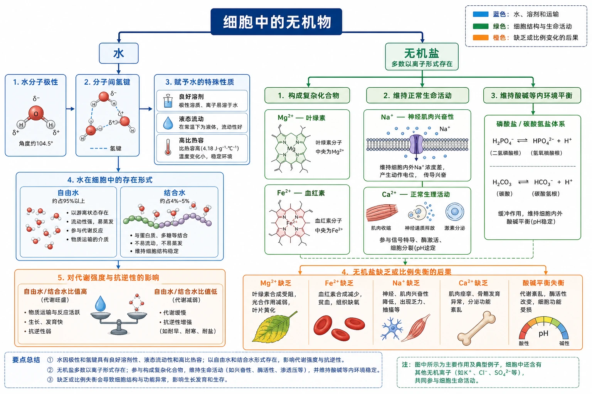
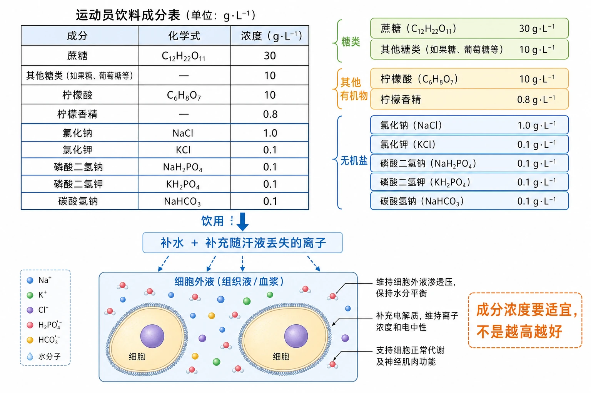
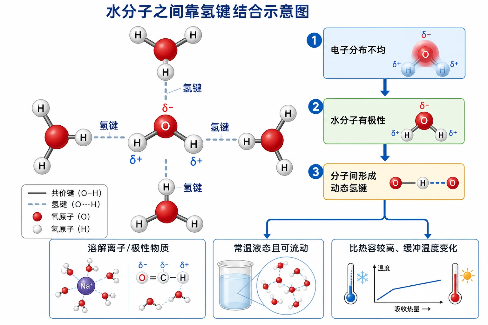
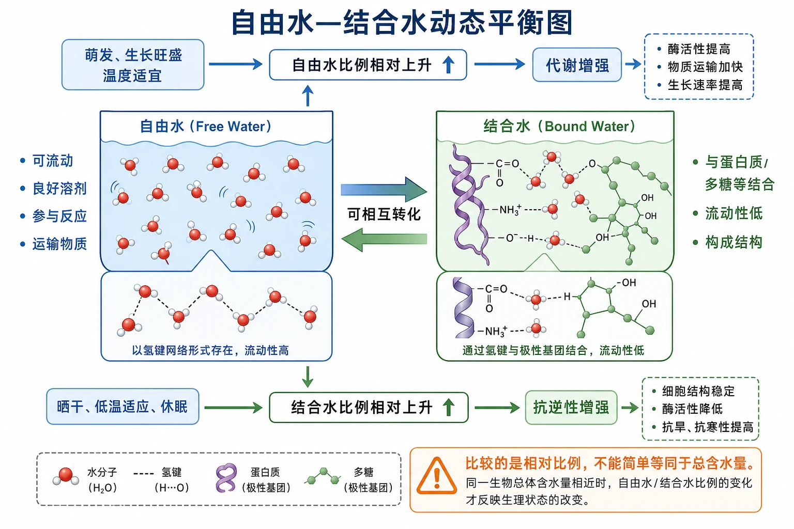
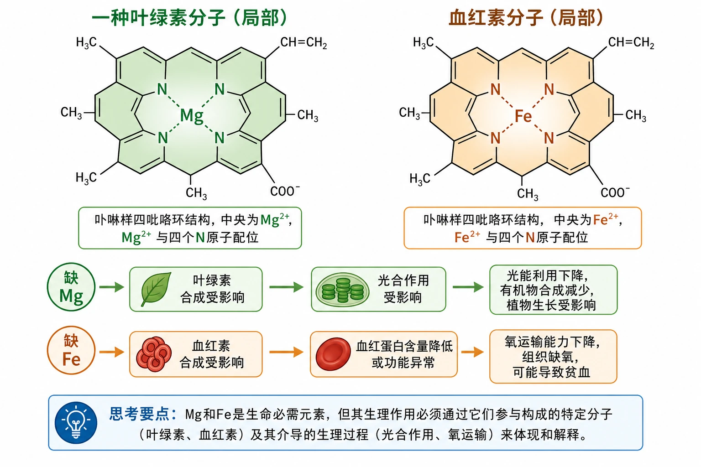
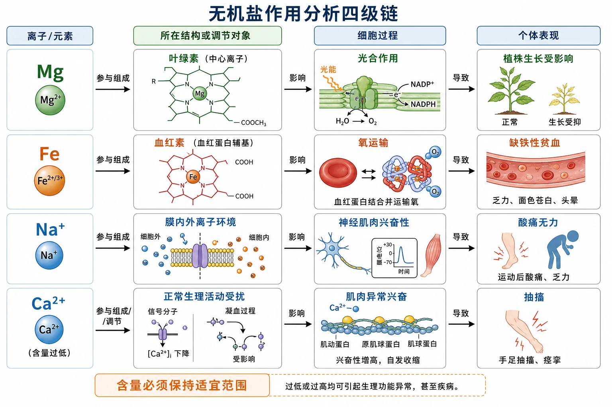

# 2.2 细胞中的无机物

## 知识关系导航

- 所属章节：[[章首 学习导图|第二章 组成细胞的分子]]
- 前置知识：[[2.1 细胞中的元素和化合物#组成细胞的化合物|细胞中的无机物类别与含量]]。
- 后续应用：[[2.3 细胞中的糖类和脂质]]和[[2.4 蛋白质是生命活动的主要承担者]]中的合成、分解和结构维持都依赖水环境和适宜离子条件。

<!-- 图片描述：补充知识图（非教材原图）——本节整体知识信息结构图。中心为“细胞中的无机物”，左半“水”由“水分子极性→分子间氢键→良好溶剂、液态流动、高比热容”向下连接“自由水/结合水→代谢强度与抗逆性”；右半“无机盐”由“多数以离子形式存在”分为“构成复杂化合物”“维持正常生命活动”“维持酸碱等内环境平衡”，分别连接Mg—叶绿素、Fe—血红素、Na+—神经肌肉兴奋性、Ca2+—正常生理活动、磷酸盐/碳酸氢盐—酸碱平衡。蓝色表示水、溶剂和运输，绿色表示细胞结构与生命活动，橙色表示缺乏或比例变化的后果。 -->

## 本节学习目标

1. 从水分子的空间结构和电荷分布解释水的极性、氢键及生命意义。
2. 比较自由水与结合水的状态、功能和比例变化。
3. 说明无机盐主要以离子形式存在，并从组成、调节和平衡三方面归纳作用。
4. 利用运动饮料、种子储藏、冬小麦抗寒、缺素症和生理盐水材料进行证据推理。

## 核心知识点讲解

### 一、知识对象与生命情境

运动后人体不仅失水，也会随汗液丢失Na+、Cl−等无机盐。饮料成分表中的氯化钠、氯化钾、磷酸二氢盐和碳酸氢钠属于无机盐；糖类主要补充能量。是否需要补充、补充多少取决于运动强度、出汗量和个体状况，不能由“无机盐重要”推出越多越好。

<!-- 图片描述：教材“问题探讨”运动员饮料成分表源图重绘。左侧按原数据制作清晰表格，单位统一为g·L⁻¹：蔗糖30、其他糖类10、柠檬酸10、柠檬香精0.8、氯化钠1.0、氯化钾0.1、磷酸二氢钠0.1、磷酸二氢钾0.1、碳酸氢钠0.1；右侧按“糖类/其他有机物/无机盐”三类着色，无机盐各行用蓝框。下方用“饮用→补水＋补充随汗液丢失的离子”箭头连接到人体细胞外液小图，并以橙色标注“成分浓度要适宜，不是越高越好”。 -->

### 二、核心概念与结构功能

#### 水的结构、性质与功能

一个水分子由两个H和一个O构成。O吸引共用电子的能力较强，使O端稍带负电、H端稍带正电，水成为极性分子。离子或极性分子容易与水分子的带电区域相互作用，因此水是良好溶剂。

相邻水分子的O端和H端之间可形成氢键。单个氢键较弱并不断断裂、形成，这使水在常温下既保持液态又具有流动性；大量氢键还使水具有较高比热容，有助于缓冲环境和细胞温度变化。

<!-- 图片描述：教材“水分子之间靠氢键结合示意图”源图重绘。中心水分子采用球棍模型，氧原子红色、氢原子白色，O端标δ−、两个H端标δ+；周围四个水分子按极性方向排列，中心O与邻近H之间用灰蓝色虚线标“氢键”，共价键用实线，严禁把氢键画在同一水分子内部。右侧三步因果链为“电子分布不均→水分子有极性→分子间形成动态氢键”，下方分别连接“溶解离子/极性物质”“常温液态且可流动”“比热容较高、缓冲温度变化”。 -->

水的功能可归纳为：构成细胞；作溶剂；参与许多生化反应；为多细胞生物的细胞提供液体环境；随体液流动运输营养物质和代谢废物；帮助维持生命系统温度相对稳定。

#### 自由水与结合水

自由水呈游离状态、可以流动，承担溶剂、反应、运输等功能；结合水与蛋白质、多糖等物质结合，流动性和溶解性降低，是细胞结构的重要组成部分，教材给出的典型比例约占细胞内全部水的4.5%。两者不是两种化学式不同的水，而是存在状态不同，并可随条件相互转化。

一般而言，自由水比例较高时代谢较旺盛；结合水比例相对提高时，细胞抵抗低温、干旱等不良条件的能力较强。但这是一种关联规律，不能把任何生理状态仅由水的比例单独决定。

<!-- 图片描述：补充知识图（非教材原图）——“自由水—结合水动态平衡图”。左侧蓝色自由水池标注“可流动、良好溶剂、参与反应、运输物质”，右侧绿色结合水池标注“与蛋白质/多糖等结合、流动性低、构成结构”；中间双向箭头写“可相互转化”。向上情境“萌发、生长旺盛、温度适宜”使自由水比例相对上升并连接“代谢增强”；向下情境“晒干、低温适应、休眠”使结合水比例相对上升并连接“抗逆性增强”。橙色警示“比较的是相对比例，不能简单等同于总含水量”。 -->

### 三、关键过程、规律与调控机制

#### 无机盐的存在形式与作用

细胞中大多数无机盐以离子形式存在，约占鲜重1%～1.5%。常见阳离子有Na+、K+、Ca2+、Mg2+、Fe2+/Fe3+，常见阴离子有Cl−、SO4²−、PO4³−、HCO3−等。

1. 构成复杂化合物：Mg参与叶绿素结构，Fe参与血红素结构，P参与核酸、磷脂等重要物质。
2. 维持生命活动：Na+与神经、肌肉细胞兴奋性有关；血液中Ca2+过低可引起抽搐。
3. 维持平衡：多种离子共同参与渗透和酸碱等内环境稳定。教材重点明确酸碱平衡；具体机制在后续章节继续学习。

<!-- 图片描述：教材思考讨论源图组重绘——“叶绿素分子和血红素分子的局部结构”。左右并列两个平面结构局部图：左图绿色卟啉样环中央标Mg，四个N原子以配位线指向Mg，标题“一种叶绿素分子（局部）”；右图浅橙色卟啉样环中央标Fe，四个N原子指向Fe，标题“血红素分子（局部）”。保持源图只展示局部结构，不画完整叶绿素长链或血红蛋白四级结构。下方用两条因果链说明“缺Mg→叶绿素合成受影响→光合作用受影响”“缺Fe→血红素合成受影响→氧运输能力下降、可能贫血”，并注明元素作用需通过其所在分子和生理过程解释。 -->

### 四、典型模型与分析方法

分析缺素症时使用“元素→分子结构或调节对象→细胞过程→个体症状”四级链。例如缺P不能只写“P重要”，应联系P参与核酸、磷脂等多种化合物，进而影响细胞结构、遗传信息和代谢过程，最终出现生长发育异常。

<!-- 图片描述：补充知识图（非教材原图）——“无机盐作用分析四级链”。横向四列依次为“离子/元素”“所在结构或调节对象”“细胞过程”“个体表现”。给出四条示例：Mg→叶绿素→光合作用→植株生长受影响；Fe→血红素→氧运输→缺铁性贫血；Na+→膜内外离子环境→神经肌肉兴奋性→酸痛无力；Ca2+过低→正常生理活动受扰→肌肉异常兴奋→抽搐。箭头写明“参与组成、影响、导致”，橙色标出“含量必须保持适宜范围”。 -->

### 五、图表、实验与证据链

冬小麦入冬前自由水下降、结合水上升，说明水的存在状态会随环境改变。自由水减少可降低代谢和结冰风险；结合水比例增加有利于结构稳定和抗寒。种子晒干也是通过减少自由水降低代谢，便于储藏。

### 六、题型应用与迁移

常考水分子结构与性质的因果链、自由水/结合水曲线、缺素资料、运动补液和生理盐水。答题时避免把“水是溶剂”写成水只有一种作用，也避免把离子作用归纳为单一功能。

## 重点梳理

- 水分子极性使其能与离子或极性物质相互作用；氢键解释液态、流动性和较高比热容。
- 自由水重在溶剂、反应和运输；结合水重在结构。比例可变，功能侧重不同。
- 无机盐含量少但作用重要，多数以离子形式存在，也可参与复杂化合物组成。
- 离子含量必须保持适宜，过少或过多都可能破坏正常生命活动。

## 难点突破

### 自由水下降不等于所有水都消失

晒干种子主要减少自由水，充分燃烧才把有机物等进一步分解并留下无机盐灰分。晒干后的主要物质仍是有机物，不是无机盐。

### 结构成分与调节作用

Mg、Fe作为复杂分子的组成元素；Na+、Ca2+等常以离子状态参与生命活动。一个元素也可能具有多重作用，分类是为了理解而非绝对割裂。

## 例题讲解

### 例题：冬小麦抗寒变化

材料：入冬过程中自由水比例下降、结合水比例上升。

分析：先判断水的状态变化，再联系代谢、结冰和结构稳定。

答案：自由水下降使细胞内物质流动和许多反应受限，代谢水平降低，也减少低温结冰损伤；较多水与蛋白质、多糖等结合，结合水比例上升，有助于维持细胞结构，因此抗寒能力增强。

## 易错点整理

1. 把氢键画成同一水分子中O—H共价键。
2. 认为结合水也是良好溶剂并负责运输。
3. 把无机盐灰烬等同于晒干后的全部剩余物。
4. 只写“Mg促进光合作用”，漏掉“Mg参与叶绿素组成”的证据链。
5. 认为无机盐补得越多越好，忽略稳态和适宜范围。

## 考点考证点整理

### 考点一：水的结构—性质—功能

- 出题思路：给水分子图、极性或比热容材料，要求解释生命意义。
- 关键条件：δ+/δ−、氢键位置、动态断裂形成。
- 解答要点：结构决定性质，性质支持溶解、运输、反应和温度稳定。
- 易扣分点：只背功能，不写中间性质。

### 考点二：无机盐缺乏材料

- 出题思路：给缺Mg、Fe、P或离子浓度异常症状。
- 关键条件：元素所在分子、细胞过程、症状层次。
- 解答要点：用四级因果链完整作答。
- 易扣分点：把Fe写成叶绿素成分或把Mg写成血红素成分。

## 练习题

1. 教材判断：①自由水和结合水都是良好溶剂；②同株植物老叶细胞比幼叶细胞自由水含量高；③秸秆晒干后剩余物主要是无机盐。
2. 医用生理盐水是质量分数0.9%的NaCl溶液。“生理”的含义是什么？何时可能使用？
3. 火星两极有固态水、土壤含Mg、Na、K等生命必需元素，为什么科学家据此推测火星可能存在或曾存在生命？该证据能否直接证明生命存在？
4. 植物缺Mg和人体缺Fe为何会分别影响光合作用与氧运输？

## 练习题答案

1. ①错误，主要是自由水承担溶剂和运输功能；②错误，幼叶代谢通常较旺盛，自由水比例往往更高；③错误，晒干主要失去自由水，剩余物仍以有机物等干物质为主。
2. 0.9% NaCl溶液的渗透状况与人体细胞外液较接近，可降低细胞因外界溶液浓度不适而过度吸水或失水的风险。可用于补液、配制药液、冲洗等医疗情境，具体使用须遵医嘱。
3. 水是细胞重要成分、溶剂和反应环境，Mg、Na、K等是生命活动所需元素，因此这些条件提高了生命存在的可能性；但它们只是必要条件的一部分，不能单独证明生命存在，还需发现有序结构、代谢或遗传等直接证据。
4. Mg位于叶绿素分子局部结构中心，缺Mg影响叶绿素形成，进而影响光能吸收和光合作用；Fe参与血红素组成，缺Fe影响血红蛋白及氧运输，可能导致贫血。
