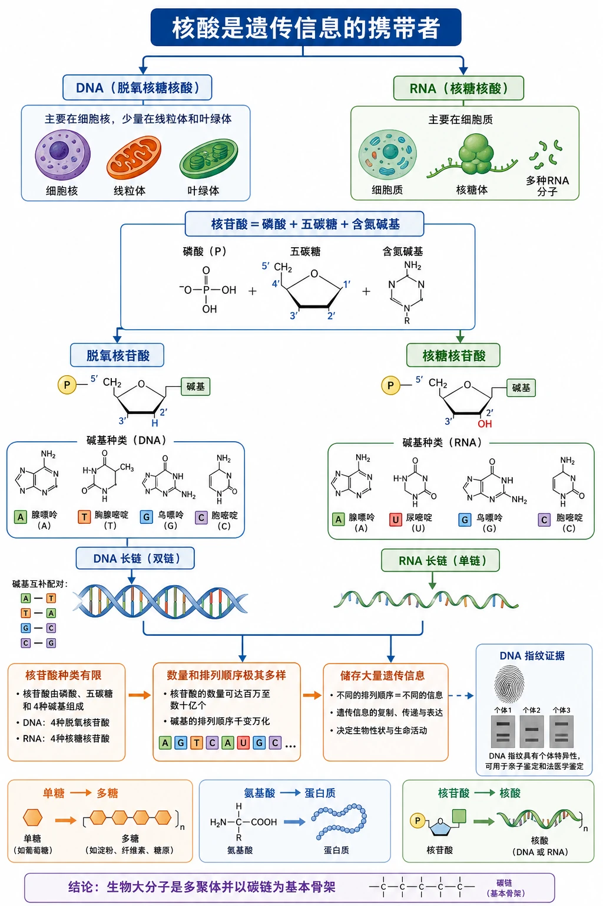
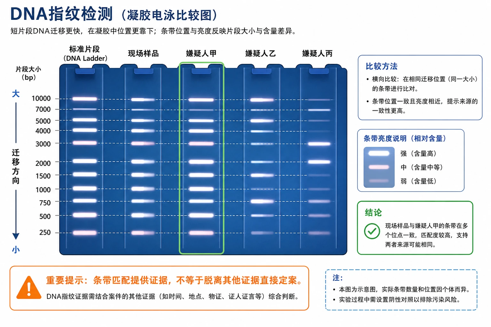
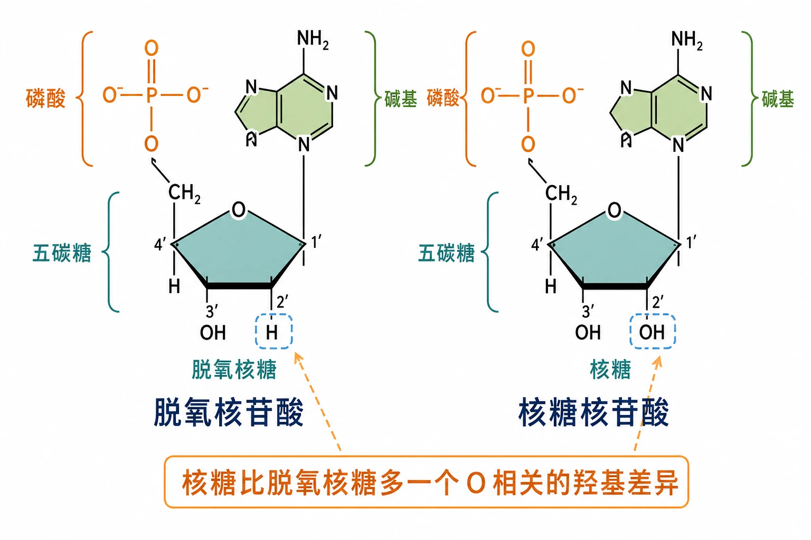
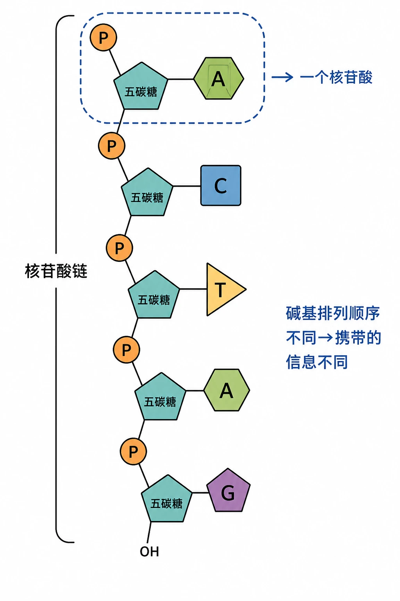
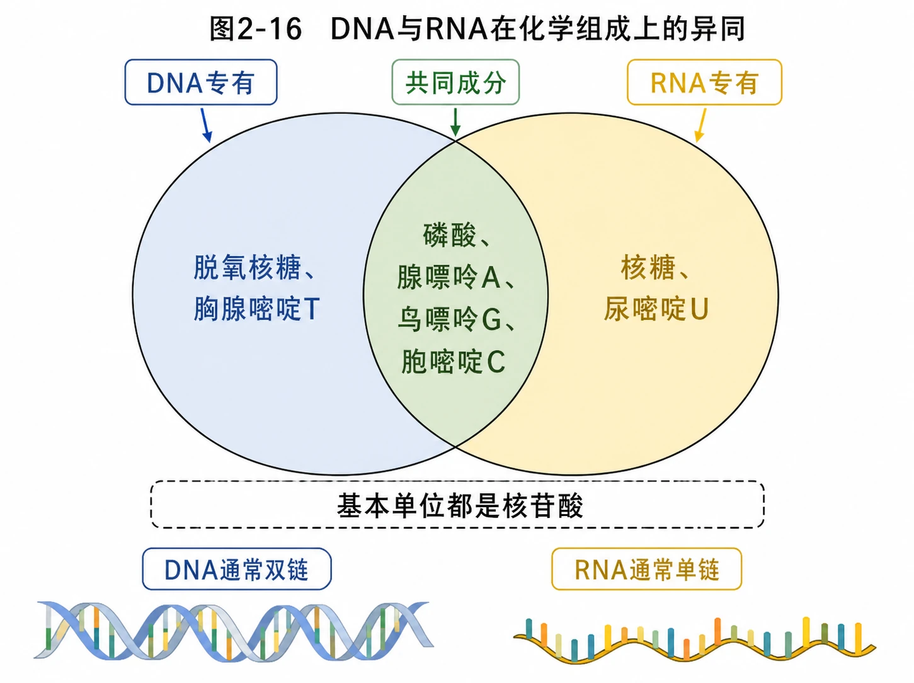
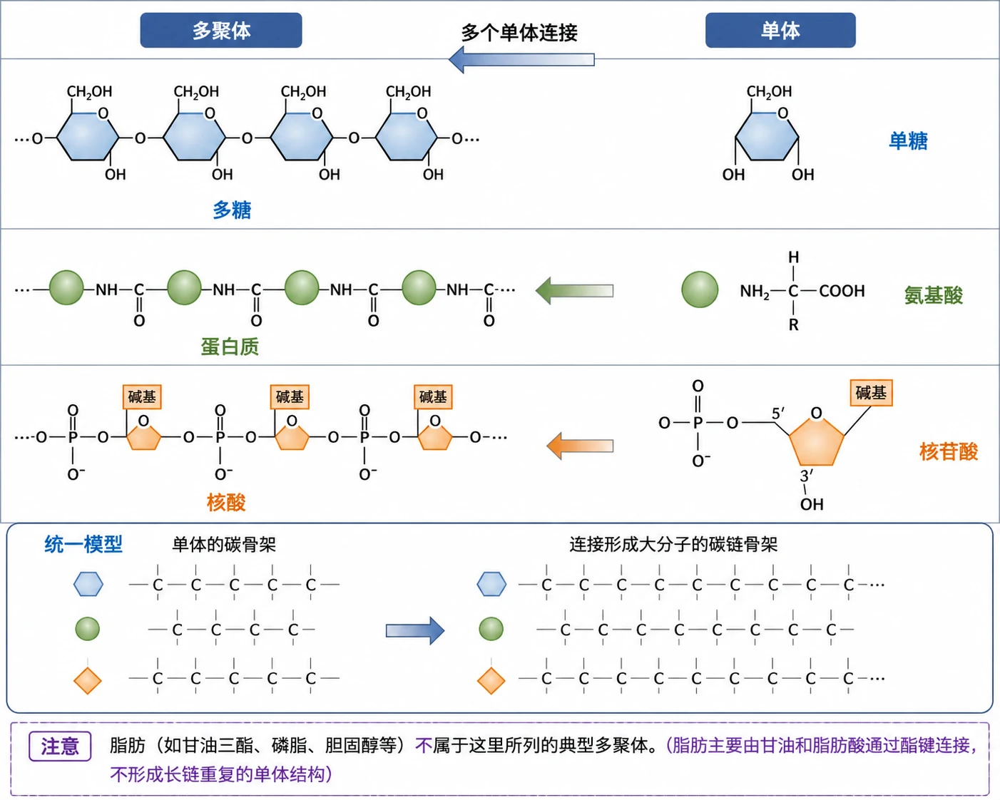

# 2.5 核酸是遗传信息的携带者

## 知识关系导航

- 所属章节：[[章首 学习导图|第二章 组成细胞的分子]]
- 前置比较：[[2.4 蛋白质是生命活动的主要承担者#蛋白质的结构层次|蛋白质同样由基本单位连接形成生物大分子]]。
- 结构联系：[[2.3 细胞中的糖类和脂质#糖类的分类与功能|多糖由单糖聚合]]，与核酸、蛋白质共同体现单体—多聚体模型。
- 后续学习：DNA和RNA在遗传信息传递与表达中的具体作用将在《遗传与进化》中深入展开。

<!-- 图片描述：补充知识图（非教材原图）——本节整体知识信息结构图。中心为“核酸是遗传信息的携带者”，上方分为DNA和RNA：DNA主要在细胞核，少量在线粒体和叶绿体；RNA主要在细胞质。中部由“核苷酸＝磷酸＋五碳糖＋含氮碱基”向左右分为脱氧核苷酸和核糖核苷酸，再连接DNA长链和RNA长链；DNA碱基A、T、G、C，RNA碱基A、U、G、C。下方用“核苷酸种类有限＋数量和排列顺序极其多样→储存大量遗传信息”因果链连接DNA指纹。底部横向总结构为“单糖→多糖、氨基酸→蛋白质、核苷酸→核酸”，结论“生物大分子是多聚体并以碳链为基本骨架”。 -->

## 本节学习目标

1. 说出DNA和RNA的中文名称、主要分布及一般链数特点。
2. 拆解核苷酸的三部分结构，比较脱氧核苷酸和核糖核苷酸。
3. 准确比较DNA与RNA的五碳糖和碱基组成。
4. 解释核苷酸排列顺序与遗传信息、DNA指纹之间的关系。
5. 用单体—多聚体和碳链骨架统一认识多糖、蛋白质和核酸。

## 核心知识点讲解

### 一、知识对象与生命情境

DNA指纹检测把现场样品与相关个体DNA片段形成的条带图进行比较。个体DNA脱氧核苷酸序列具有特点，因此经相同方法处理可形成具有个体差异的条带组合。相同位置条带越多可提供越强关联证据，但真实司法鉴定还需规范取样、质量控制和统计分析，不能凭肉眼一条相似带定案。

<!-- 图片描述：教材“DNA指纹检测”源图重绘。保持蓝色凝胶背景，多条纵向样品泳道中出现位置不同、亮度不同的白色或浅粉色DNA条带；左侧设置标准片段泳道，其他泳道分别标“现场样品、嫌疑人甲、嫌疑人乙”等教学标签。用横向虚线辅助比较相同迁移位置的条带，并以绿色框标出与现场样品匹配度较高的泳道，橙色提示“条带匹配提供证据，不等于脱离其他证据直接定案”。不把凝胶条带画成DNA双螺旋。 -->

### 二、核心概念与结构功能

#### 核酸的种类和分布

| 比较项目 | DNA | RNA |
|---|---|---|
| 中文名 | 脱氧核糖核酸 | 核糖核酸 |
| 基本单位 | 脱氧核苷酸 | 核糖核苷酸 |
| 五碳糖 | 脱氧核糖 | 核糖 |
| 特有碱基 | T胸腺嘧啶 | U尿嘧啶 |
| 共有碱基 | A腺嘌呤、G鸟嘌呤、C胞嘧啶 | A、G、C |
| 一般链数 | 两条脱氧核苷酸链 | 一条核糖核苷酸链 |
| 真核细胞主要分布 | 细胞核，线粒体和叶绿体也有少量 | 细胞质为主 |

“主要分布”不能写成“只分布”。核酸最初从细胞核提取并得名，但RNA主要在细胞质，DNA也不只在细胞核。

#### 核苷酸与核酸长链

每个核苷酸由一分子磷酸、一分子五碳糖和一分子含氮碱基组成。五碳糖不同决定是脱氧核苷酸还是核糖核苷酸；碱基进一步造成每类核苷酸有4种。

<!-- 图片描述：教材图2-15源图重绘——“脱氧核苷酸和核糖核苷酸”。左右并列两个完整结构模型：两者均由橙色磷酸、蓝绿色五边形五碳糖和绿色碱基组成；左侧五碳糖标“脱氧核糖”，关键碳位为H，整体标“脱氧核苷酸”；右侧标“核糖”，相应位置为OH，整体标“核糖核苷酸”。用三段括号分别圈出磷酸、五碳糖、碱基，并用橙色放大标注“核糖比脱氧核糖多一个O相关的羟基差异”。不得把核苷酸误画成只有糖和碱基的核苷。 -->

核苷酸通过一定化学键连续连接，形成具有“磷酸—五碳糖”重复骨架、碱基向侧面伸出的长链。核苷酸排列顺序变化主要体现在碱基顺序变化。

<!-- 图片描述：教材图2-14源图重绘——“核苷酸连接而成的长链”。绘制纵向单链，橙色圆形P代表磷酸，蓝绿色五边形代表五碳糖，两者交替连接成主链；每个五碳糖右侧连接不同颜色和形状的碱基，按源图自上而下标A、C、T、A、G。用括号圈出一个完整“磷酸＋五碳糖＋碱基”并标“一个核苷酸”，另一长括号标“核苷酸链”；右侧写“碱基排列顺序不同→携带的信息不同”。图只表达组成和序列，不把单链直接画成完整DNA双螺旋。 -->

<!-- 图片描述：教材图2-16源图重绘——“DNA与RNA在化学组成上的异同”。用清晰二维维恩图而非透视厚圆盘：左侧蓝色DNA专有区写“脱氧核糖、胸腺嘧啶T”，右侧黄色RNA专有区写“核糖、尿嘧啶U”，中央绿色交集写“磷酸、腺嘌呤A、鸟嘌呤G、胞嘧啶C”。图外补充共同框“基本单位都是核苷酸”，下方分别标“DNA通常双链、RNA通常单链”。颜色不代替文字，所有碱基中英文符号准确。 -->

### 三、关键过程、规律与调控机制

DNA只含4种脱氧核苷酸，但长链中的核苷酸数量可非常多，排列顺序组合极其丰富，因而具有巨大信息容量。遗传信息储存在脱氧核苷酸排列顺序中；DNA能储存、传递遗传信息。部分病毒以RNA作为遗传物质，说明“所有生物性实体的遗传信息都只在DNA”并不严谨。

核酸在遗传、变异和蛋白质生物合成中具有重要作用。当前阶段重点是“序列携带信息”，不必提前把后续复制、转录、翻译的全部机制混入本节。

### 四、典型模型与分析方法

#### 生物大分子以碳链为骨架

单糖、氨基酸和核苷酸称为单体；多糖、蛋白质和核酸由许多相应单体连接形成多聚体。每个单体含有由相连碳原子构成的基本骨架，故这些生物大分子以碳链为基本骨架。碳原子能形成稳定多样的共价键，是复杂有机分子结构多样性的基础。

<!-- 图片描述：教材图2-17源图重绘——“生物大分子是由许多单体连接成的多聚体”。三行对照：第一行左侧多个蓝色六边形连接标“多糖”，右侧单个六边形标“单糖”；第二行左侧多个绿色圆球连接标“蛋白质”，右侧单球标“氨基酸”；第三行左侧多个橙色菱形连接标“核酸”，右侧单菱形标“核苷酸”。顶部明确左栏“多聚体”、右栏“单体”，中间箭头从单体指向多聚体并写“多个单体连接”。下方增加统一模型“单体的碳骨架→连接形成大分子的碳链骨架”，同时提示脂肪不属于这里所列的典型多聚体。 -->

### 五、图表、实验与证据链

计算细胞核酸碱基种类时：含DNA和RNA的真核细胞通常涉及A、G、C、T、U共5种碱基；核苷酸种类则是DNA 4种加RNA 4种，共8种。题目若只问DNA或只问某病毒，必须按对象重新判断。

### 六、题型应用与迁移

常考DNA/RNA比较、核苷酸结构图、碱基/核苷酸种类计数、DNA指纹信息依据、单体多聚体配对和保健品广告逻辑评价。作答要严格区分核酸、核苷酸、核苷和碱基层次。

## 重点梳理

- DNA和RNA都是核酸，基本单位都是核苷酸。
- 核苷酸＝磷酸＋五碳糖＋含氮碱基。
- DNA含脱氧核糖和T，RNA含核糖和U，A/G/C共有。
- 核苷酸排列顺序储存遗传信息；种类有限而序列组合巨大。
- 多糖、蛋白质、核酸是由单体形成的多聚体，以碳链为基本骨架。

## 难点突破

### 碱基种类与核苷酸种类

细胞中碱基通常5种，而核苷酸通常8种，因为含A、G、C的核苷酸在DNA和RNA中五碳糖不同，仍属于不同核苷酸。

### 核酸分布

真核细胞DNA主要在细胞核，也在线粒体和叶绿体中少量存在；RNA主要在细胞质，也不是绝对只在细胞质。题目中的“仅”“全部”常是错误信号。

## 例题讲解

### 例题：豌豆叶肉细胞的碱基和核苷酸种类

分析：叶肉细胞含DNA和RNA。DNA有A、T、G、C，RNA有A、U、G、C。

答案：碱基共有A、G、C、T、U五种；核苷酸共有4种脱氧核苷酸和4种核糖核苷酸，即8种。

## 易错点整理

1. 把DNA和RNA的基本单位写成碱基。
2. 把“核苷酸”拆错，漏掉磷酸或把五碳糖写成葡萄糖。
3. 认为DNA只在细胞核、RNA只在细胞质。
4. 细胞有5种碱基就误写只有5种核苷酸。
5. 把脂肪也列为由许多相同单体形成的典型多聚体。

## 考点考证点整理

### 考点一：DNA与RNA比较

- 出题思路：给维恩图、结构图或细胞类型，要求判断组成和分布。
- 关键条件：对象含DNA、RNA还是一种核酸；问碱基还是核苷酸。
- 解答要点：糖、特有碱基、共有成分、链数和主要分布逐项比较。
- 易扣分点：将T/U或核糖/脱氧核糖互换。

### 考点二：遗传信息与序列

- 出题思路：DNA指纹、个体差异或多糖与核酸比较。
- 关键条件：单体种类、链长、排列顺序是否具有多样性。
- 解答要点：有限单体通过大量位置的不同排列形成巨大序列组合，序列储存信息。
- 易扣分点：只说DNA“结构复杂”，不指出脱氧核苷酸排列顺序。

## 练习题

1. 教材判断：①DNA和RNA基本单位都是核苷酸；②核酸仅存在于细胞核；③DNA单体是脱氧核苷酸。
2. DNA中的五碳糖是：A核糖，B葡萄糖，C脱氧核糖，D麦芽糖。
3. 核苷酸组成中不包括：A碱基，B核糖，C甘油，D磷酸。
4. 豌豆叶肉细胞含有多少种碱基？
5. 评析“补充特定核酸就能修复所有受损基因”的逻辑漏洞。

## 练习题答案

1. ①正确；②错误，DNA和RNA在细胞核、细胞质及部分细胞器中有不同分布；③正确。
2. C。DNA含脱氧核糖，RNA含核糖。
3. C。核苷酸由磷酸、五碳糖和碱基组成，甘油是脂肪等物质的组成成分之一。
4. 5种，即A、G、C、T、U。
5. 疾病病因复杂，并非一切疾病都由基因受损引起；基因虽是有遗传效应的DNA片段，但摄入核酸通常会在消化过程中被分解，不能据此推断特定核酸会定向进入细胞并修复目标基因；“补充原料”与“完成精确修复”之间缺乏机制和实验证据。回应时应要求可靠临床证据，避免被概念偷换和绝对化宣传误导。
