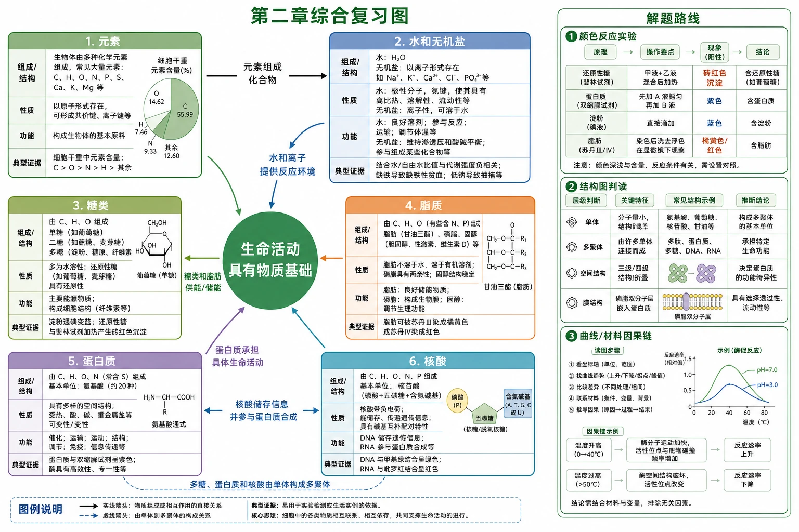
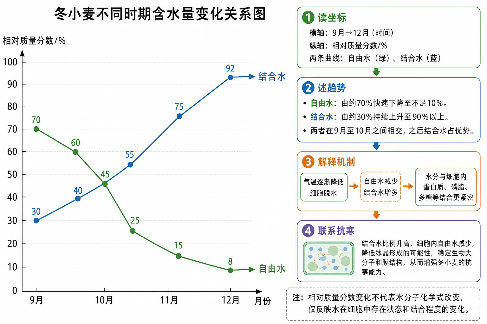

# 第二章 组成细胞的分子·整理与提升

## 知识关系导航

- 章节入口：[[章首 学习导图|第二章学习导图]]
- 分节复习：[[2.1 细胞中的元素和化合物]]、[[2.2 细胞中的无机物]]、[[2.3 细胞中的糖类和脂质]]、[[2.4 蛋白质是生命活动的主要承担者]]、[[2.5 核酸是遗传信息的携带者]]。
- 科学史材料：[[章末 科学史话 世界上第一个人工合成蛋白质的诞生]]。

<!-- 图片描述：补充知识图（非教材原图）——第二章综合复习图。中心为“生命活动具有物质基础”，外圈六个模块为元素、水和无机盐、糖类、脂质、蛋白质、核酸；每个模块均按“组成/结构—性质—功能—典型证据”四行呈现。模块间用关系箭头连接：“元素组成化合物”“水和离子提供反应环境”“糖类和脂肪供能/储能”“核酸储存信息并参与蛋白质合成”“蛋白质承担具体生命活动”“多糖、蛋白质和核酸由单体构成多聚体”。右侧设置三条解题路线：颜色反应实验、结构图判读、曲线/材料因果链。 -->

## 本节学习目标

1. 建立从元素、单体到生物大分子和生命功能的整体框架。
2. 综合比较不同物质的元素组成、基本单位、主要功能和检测方式。
3. 掌握章末含水量曲线、蛋白质结构功能和核酸信息容量题的答题路径。
4. 能评价营养、保健品和“人工生命物质”等社会材料中的结论边界。

## 核心知识点讲解

### 一、知识对象与生命情境

石头和细胞都由自然界元素组成，但细胞内物质具有特定比例、有序结构和动态相互作用，能进行代谢、调节、遗传等生命活动。生命物质观既反对神秘“生命元素”，也反对把细胞等同于一堆化学物质。

### 二、核心概念与结构功能

| 物质 | 主要组成/基本单位 | 主要功能 | 关键图像或实验 |
|---|---|---|---|
| 水 | 极性H2O、氢键 | 溶剂、反应、运输、结构、温度稳定 | 氢键图、自由水/结合水曲线 |
| 无机盐 | 多以离子存在 | 构成复杂物、维持生命活动和平衡 | Mg/叶绿素、Fe/血红素 |
| 糖类 | 单糖；多糖由单糖聚合 | 主要供能、储能、构成结构 | 淀粉粒、多糖结构图 |
| 脂质 | 脂肪、磷脂、固醇结构不同 | 储能、膜结构、保温保护、调节 | 脂肪细胞、三酰甘油图 |
| 蛋白质 | 氨基酸→肽链→空间结构 | 结构、催化、运输、调节、免疫 | 脱水缩合、血红蛋白层次图 |
| 核酸 | 核苷酸长链 | 储存、传递遗传信息，参与蛋白质合成 | DNA/RNA维恩图、核苷酸链 |

### 三、关键过程、规律与调控机制

本章最重要的共同规律是“结构决定性质，结构与功能相适应”：水分子极性和氢键支持其溶剂及温度缓冲功能；多糖连接方式影响储能或结构功能；脂肪碳氢比例支持高密度储能；蛋白质序列和折叠决定功能；核苷酸序列储存遗传信息。

### 四、典型模型与分析方法

综合题优先使用四种模型：

1. 组成层次：元素→小分子/单体→大分子→细胞结构与生命活动。
2. 结构功能链：结构差异→性质差异→功能差异。
3. 实验证据链：材料→试剂和条件→现象→有限结论。
4. 状态变化链：环境变化→物质含量/比例变化→细胞过程变化→适应意义。

### 五、图表、实验与证据链

教材章末冬小麦曲线中，9月至12月自由水相对质量分数由高位持续下降，结合水持续上升。读图时先认纵轴“相对质量分数/%”、横轴“时间/月”和两条曲线，再描述趋势，最后解释适应意义。

<!-- 图片描述：教材章末“冬小麦不同时期含水量变化关系图”源图重绘。横轴为9月至12月，纵轴为相对质量分数/%；绿色自由水曲线从约70%快速下降至不足10%，蓝色结合水曲线从约30%持续上升至90%以上，两线在9月至10月之间相交。数据点和连线清晰，曲线末端直接标“自由水”“结合水”，不添加源图没有的总水曲线。图右侧按“读坐标→述趋势→解释机制→联系抗寒”四步给出判读框，并注明相对质量分数变化不代表水分子化学式改变。 -->

### 六、题型应用与迁移

章末常把多个知识点串联：离子与酶活性、运动补液、糖脂供能、蛋白质结构功能、RNA水解产物、含水量变化。作答先定位物质类别，再选用对应结构和功能，不要用一套空泛语言回答所有题。

## 重点梳理

- C是生命的核心元素，因碳能形成稳定多样的共价碳链。
- 水最多，蛋白质通常是最多的有机物；无机盐含量少但功能重要。
- 糖类主要供能，脂肪善于储能，磷脂构成膜，核酸携带信息，蛋白质承担主要生命活动。
- 多糖、蛋白质、核酸分别由单糖、氨基酸、核苷酸形成多聚体。

## 难点突破

### 物质具备与生命系统形成

元素和分子配齐仍不是生命系统，因为缺少有序空间结构、膜性边界、反应网络、调控和遗传活动。生命活动是有序系统的整体性质。

### 核酸能携带信息而多糖通常不能

DNA有4种基本单位且长链中序列极其多样，能够编码大量信息；教材中的淀粉、糖原、纤维素等多糖基本单位主要是葡萄糖，单体种类单一，结构变化不足以形成类似核酸的序列信息系统。

## 例题讲解

### 例题：红细胞与心肌细胞功能不同

题目：两类细胞主要成分都有蛋白质，为什么功能不同？

答案：两类细胞表达并含有的蛋白质种类、数量和比例不同；不同蛋白质的氨基酸序列、肽链折叠和空间结构不同，因而性质和功能不同。红细胞富含适于结合运输氧的血红蛋白，心肌细胞含大量参与收缩、能量代谢和调节的蛋白质组合，因此承担不同功能。

## 易错点整理

1. 把“主要成分相同”写成“所有分子和比例相同”。
2. 看到离子影响酶就只答维持酸碱平衡，忽略离子可能是酶活化所必需。
3. RNA彻底水解产物写成核苷酸；彻底水解应得到核糖、碱基和磷酸。
4. 把脂质功能写成携带遗传信息。
5. 曲线题只抄趋势，不解释细胞代谢和抗寒意义。

## 考点考证点整理

### 考点一：跨物质综合选择

- 出题思路：把元素、糖脂、蛋白质和核酸功能交叉设置选项。
- 关键条件：物质具体类别、基本单位、所在结构、功能边界。
- 解答要点：逐项回到“组成—结构—功能”核对。
- 易扣分点：用“有机物/脂质/糖类”大类替代具体物质。

### 考点二：曲线与适应性解释

- 出题思路：给自由水、结合水随时间或环境变化曲线。
- 关键条件：坐标、趋势、相对比例、环境变化。
- 解答要点：趋势→代谢/结构影响→适应意义。
- 易扣分点：把相关关系写成绝对因果，漏答水的其他功能。

## 练习题

1. 多糖、蛋白质、核酸基本骨架的核心元素是：A C，B H，C O，D N。
2. 水稻吸收硝酸盐和磷酸盐可用于合成：A蔗糖，B核酸，C甘油，D脂肪酸。
3. 缺Mn2+的植物不能利用硝酸盐，合理推测Mn2+可能是硝酸还原酶的什么成分或条件？
4. 烈日足球比赛后晕倒，若同时明显失水、失盐和能量不足，四种方案中生理盐水、氨基酸、葡萄糖、葡萄糖生理盐水哪项信息最全面？
5. RNA彻底水解得到哪些物质？
6. 解释冬小麦自由水下降、结合水上升的抗寒意义。
7. 为什么核酸可作为遗传信息携带者，而以葡萄糖为基本单位的多糖通常不能？

## 练习题答案

1. A。碳能形成稳定多样碳链，是生物大分子基本骨架的核心元素。
2. B。核酸含N和P；蔗糖、甘油和脂肪酸的教材基本组成不需要N、P同时参与。
3. Mn2+可能是硝酸还原酶发挥催化作用所需的活化剂或辅助条件。材料直接证据是“缺Mn2+时该酶相关过程不能正常进行”，不能无依据断言其维持形态或酸碱平衡。
4. D在题设三类缺失均明确时信息最全面，可同时补水、NaCl和葡萄糖。现实医疗处置需根据具体检查决定，不能仅凭课本情境自行静脉用药。
5. 核糖、含氮碱基和磷酸。若只是初步水解，可得到核苷酸；“彻底水解”要继续拆分基本单位。
6. 自由水减少使代谢降低并减少结冰损伤风险；较多水与细胞物质结合，结合水比例提高有利于结构稳定，从而增强抗寒性。水还具有构成、溶剂、反应、运输和温度稳定等作用。
7. 核酸由多种核苷酸组成，长链中不同核苷酸排列顺序具有巨大组合多样性，序列可储存信息；教材所列淀粉、糖原、纤维素等主要由同一种葡萄糖重复组成，单体序列类型单一，主要承担储能或结构功能而非遗传信息编码。
