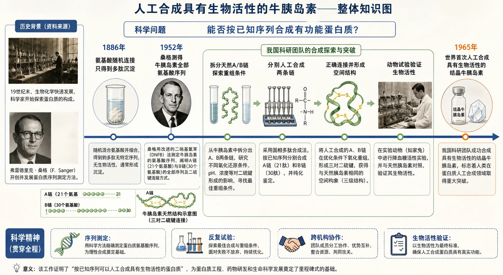
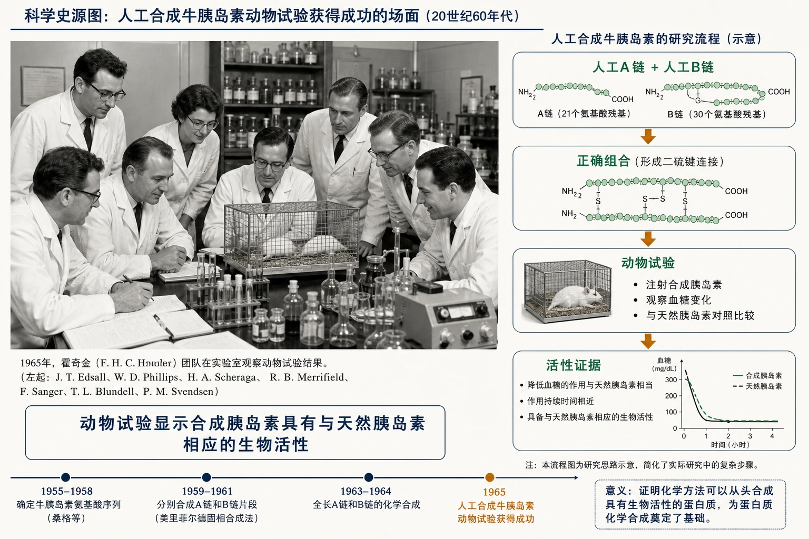

# 章末 科学史话：世界上第一个人工合成蛋白质的诞生

## 知识关系导航

- 所属章节：[[章首 学习导图|第二章 组成细胞的分子]]
- 理论基础：[[2.4 蛋白质是生命活动的主要承担者#蛋白质的结构层次|氨基酸序列、肽链和空间结构]]。
- 方法联系：人工合成并验证活性，是检验人们对蛋白质组成和结构认识的重要方法。

<!-- 图片描述：补充知识图（非教材原图）——本栏目整体知识信息结构图。横向时间轴从1886年“氨基酸随机连接只得到多肽沉淀”开始，经1952年桑格测得牛胰岛素全部氨基酸序列，到我国科研团队“拆分天然A/B链探索重组→分别人工合成两条链→正确连接并形成空间结构→动物试验验证生物活性”，终点为1965年“世界首次人工合成具有生物活性的结晶牛胰岛素”。上方标科学问题“能否按已知序列合成有功能蛋白质”，下方标科学精神“序列测定、反复试验、跨机构协作、生物活性验证”。 -->

## 本节学习目标

1. 说明随机连接的多肽为何不等同于目标蛋白质。
2. 理解测定氨基酸排列顺序是准确合成蛋白质的前提。
3. 梳理人工合成牛胰岛素的技术路线和生物活性证据。
4. 认识集体协作、长期探索和失败修正对重大科学突破的意义。

## 核心知识点讲解

### 一、知识对象与生命情境

19世纪曾有人把蛋白质分解所得氨基酸重新混合，得到乳白色沉淀并误以为合成了蛋白质。实际上，氨基酸随机连接只能得到排列不确定的多肽混合物；没有正确序列、链间连接和空间结构，就不能断言得到目标蛋白质，更不能断言具有生物活性。

### 二、核心概念与结构功能

牛胰岛素由17种、51个氨基酸组成两条肽链。仅知道氨基酸种类和总数不够，还必须知道每条链的精确序列、两链如何连接，以及最终结构是否正确。桑格在1952年测得牛胰岛素全部氨基酸排列顺序，为人工合成提供了“分子施工图”。

### 三、关键过程、规律与调控机制

我国科学家的路线可概括为：

1. 拆开天然胰岛素两条链，探索使其重新组合并恢复活性的方法。
2. 按已知氨基酸序列分别人工合成两条链。
3. 使两条人工链按正确方式组合并形成特定结构。
4. 通过动物试验检验是否具有与天然胰岛素相同的生物活性。

<!-- 图片描述：教材科学史源图重绘——“人工合成牛胰岛素动物试验获得成功的场面”。忠实表现20世纪60年代实验室集体场景：多名科研人员围绕实验台观察动物试验结果，环境包含当时的玻璃仪器、记录材料和实验装置，采用黑白或低饱和历史照片风格；人物不做现代化服饰替换。图下独立说明“动物试验显示合成胰岛素具有与天然胰岛素相应的生物活性”，不在源照片中叠加分子结构。右侧另设小流程“人工A链＋人工B链→正确组合→动物试验→活性证据”。 -->

### 四、典型模型与分析方法

验证“合成成功”至少有三层证据：化学组成和序列正确；链间连接与空间结构符合要求；能够产生预期生物活性。只看到沉淀或测得相对分子质量相近，证据都不充分。

### 五、图表、实验与证据链

若一个蛋白质由20种氨基酸、长度500构成，仅考虑排列顺序就有$20^{500}$种可能。巨大组合数说明随机尝试不可行，必须先测序再定向合成。人工合成有活性蛋白质也反过来支持：蛋白质的功能建立在确定的物质组成和结构上，不需要假设神秘的“生命活力”。

### 六、题型应用与迁移

科学史题常要求提取“问题—困难—方法—证据—结论—精神”。回答时不能只写爱国或坚持，应把科学方法与具体史实对应。

## 重点梳理

- 随机多肽不等于结构确定、有活性的蛋白质。
- 序列测定是定向合成牛胰岛素的前提。
- 活性验证是从“合成了分子”到“合成了功能蛋白质”的关键证据。
- 1965年我国科学家首次人工合成具有生物活性的结晶牛胰岛素。

## 难点突破

“人工合成蛋白质”不是把氨基酸简单混合。必须控制连接顺序、链数和链间连接，并形成正确空间结构；最终还需功能实验支持。

## 例题讲解

题目：为什么1886年的乳白色沉淀不能证明目标蛋白质合成成功，而1965年的牛胰岛素研究可以？

答案：前者只证明氨基酸发生了随机连接，产物序列、结构和功能均未确认；后者依据已知序列分别合成两条链，使其正确组合，并通过动物试验证明具有与天然胰岛素相应的生物活性，证据链更完整。

## 易错点整理

1. 把多肽和有活性蛋白质视为同义词。
2. 把测定序列写成合成后的步骤；它是定向合成的重要前提。
3. 只以化学检测证明生物活性，漏掉功能实验。

## 考点考证点整理

### 考点：科学史证据链

- 出题思路：提供时间、人物、失败和成功材料，评价突破意义。
- 关键条件：序列已知、两链合成与组合、生物活性试验。
- 解答要点：事实按时间排列，方法与证据对应，结论不超出证据。
- 易扣分点：只写精神品质，不分析技术和验证逻辑。

## 练习题

1. 为什么测定牛胰岛素氨基酸序列能显著降低人工合成的盲目性？
2. 若人工合成产物的氨基酸组成与天然胰岛素相同，是否足以证明成功？
3. 概括这项研究体现的两项科学方法和两项科学精神。

## 练习题答案

1. 序列提供每个位置应连接哪种氨基酸的信息，使合成由巨大数量的随机尝试转为按既定顺序定向连接，并为链间组合提供基础。
2. 不足。组成相同仍可能排列顺序、二硫键连接或空间结构不同，还需结构检测和生物活性试验。
3. 方法可写序列测定、分步合成、重组探索、动物功能验证；精神可写长期坚持、尊重证据、集体协作、在失败中修正方案。每项应结合史实说明。
