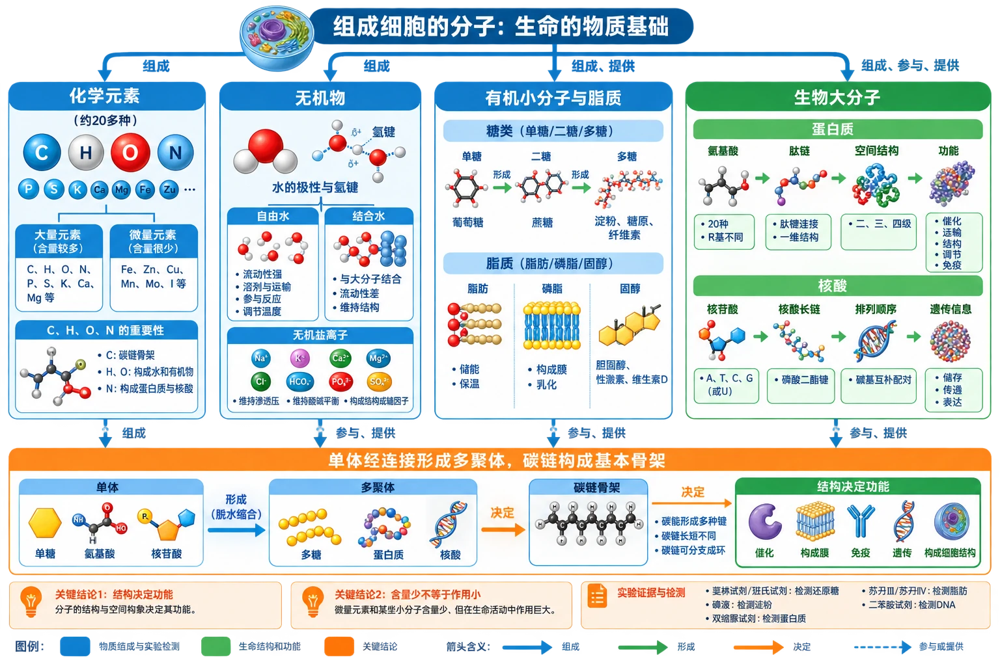

# 第二章 组成细胞的分子·学习导图

细胞没有无机自然界中不存在的“特殊生命元素”。生命的特殊性来自普通元素按特定比例组成多种化合物，并进一步形成结构有序、相互作用的细胞系统。本章应始终沿着“组成—结构—性质—功能—证据”阅读图片和材料。

<!-- 图片描述：补充知识图（非教材原图）——第二章整体知识结构图。中心为“组成细胞的分子：生命的物质基础”，第一层从左到右依次为“化学元素”“无机物”“有机小分子与脂质”“生物大分子”；元素分支列大量元素、微量元素以及C、H、O、N；无机物分支列水的极性与氢键、自由水与结合水、无机盐离子；有机物分支列单糖/二糖/多糖、脂肪/磷脂/固醇；生物大分子分支列蛋白质与核酸，并用“氨基酸→肽链→空间结构→功能”“核苷酸→核酸长链→排列顺序→遗传信息”两条过程链展开。底部以“单体经连接形成多聚体，碳链构成基本骨架”横向贯穿多糖、蛋白质和核酸。蓝色表示物质组成与实验检测，绿色表示生命结构和功能，橙色表示结构决定功能、含量少不等于作用小等关键结论；所有箭头标注“组成、形成、决定、参与或提供”。 -->

## 章节文件导航

1. [[2.1 细胞中的元素和化合物]]：回答细胞由哪些元素和化合物构成，并用颜色反应建立物质检测证据。
2. [[2.2 细胞中的无机物]]：从水分子结构解释水的性质，从离子和复杂化合物解释无机盐作用。
3. [[2.3 细胞中的糖类和脂质]]：比较能源、储能和结构物质，理解糖脂转化与健康。
4. [[2.4 蛋白质是生命活动的主要承担者]]：沿氨基酸—肽链—空间结构—功能主线解释蛋白质多样性。
5. [[章末 科学史话 世界上第一个人工合成蛋白质的诞生]]：用牛胰岛素合成史理解序列、结构、生物活性和科学协作。
6. [[2.5 核酸是遗传信息的携带者]]：比较DNA与RNA，理解核苷酸序列为何能够储存遗传信息。
7. [[章末 整理与提升]]：综合物质鉴定、含水量曲线、结构功能关系和单体—多聚体模型。

## 核心知识关系

- [[2.1 细胞中的元素和化合物#组成细胞的元素|元素]]是所有化合物的原料，但元素的含量和组合方式体现细胞的选择性。
- [[2.2 细胞中的无机物#水的结构、性质与功能|水]]提供溶剂、反应和运输环境；无机盐既可作为离子调节生命活动，也可参与叶绿素、血红素等复杂分子的组成。
- [[2.3 细胞中的糖类和脂质#糖类的分类与功能|糖类]]和脂质都可供能，但糖类通常是主要能源，脂肪更适合长期储能；磷脂和部分糖类还承担结构功能。
- [[2.4 蛋白质是生命活动的主要承担者#蛋白质的结构层次|蛋白质结构]]由氨基酸种类、数量、顺序和空间结构共同决定，结构变化可能导致功能改变。
- [[2.5 核酸是遗传信息的携带者#核苷酸与核酸长链|核酸]]以核苷酸序列储存信息，并参与控制蛋白质合成；蛋白质功能又使遗传信息表现为具体生命活动。
- 多糖、蛋白质和核酸都符合“单体→多聚体”模型，均以碳链为基本骨架，但单体种类、连接方式和功能不同。

## 推荐学习顺序

先会读元素含量表和化合物比例图，再掌握水、无机盐、糖类和脂质；随后重点突破蛋白质脱水缩合及结构层次，最后用核酸把“分子结构”和“遗传信息”连接起来。复习时反向追问：某种生命功能由什么分子承担？该分子的功能由什么结构支持？结构又由哪些基本单位组成？
