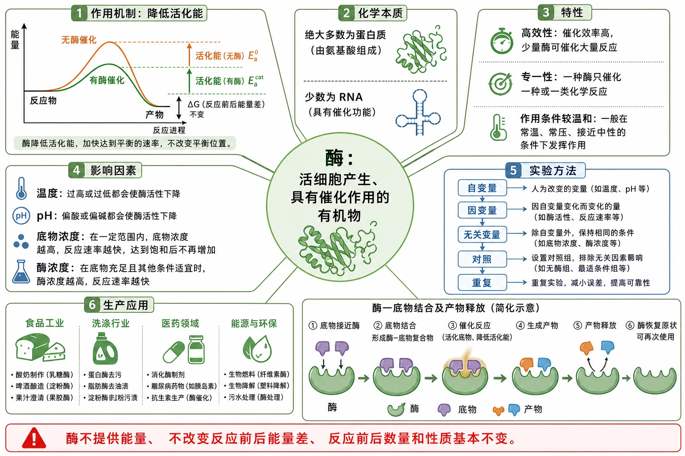
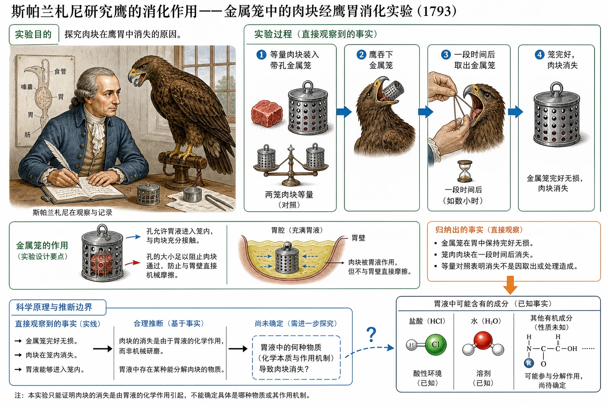
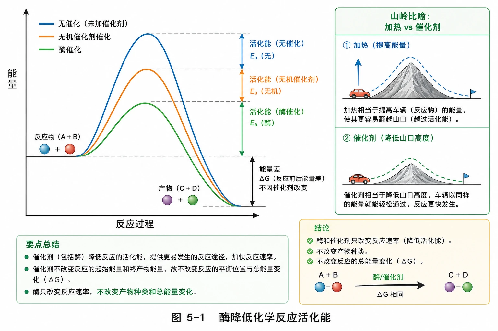
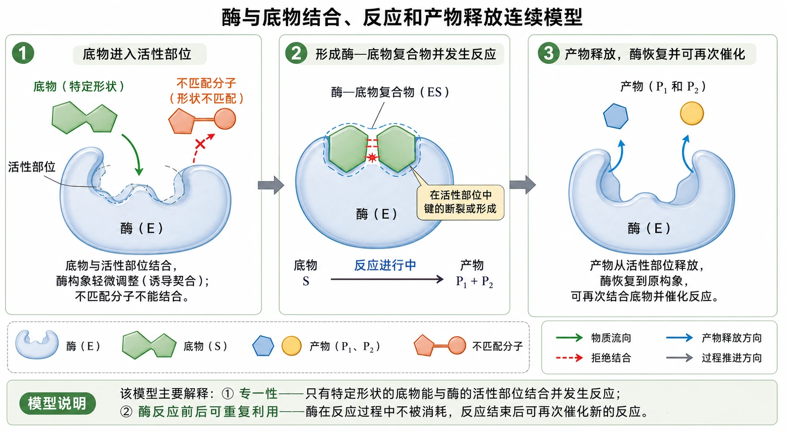
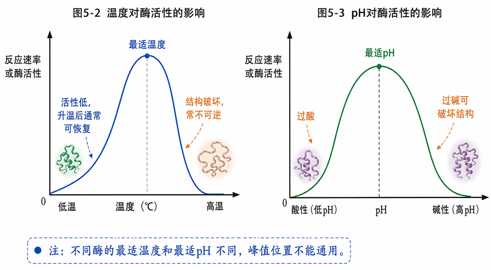
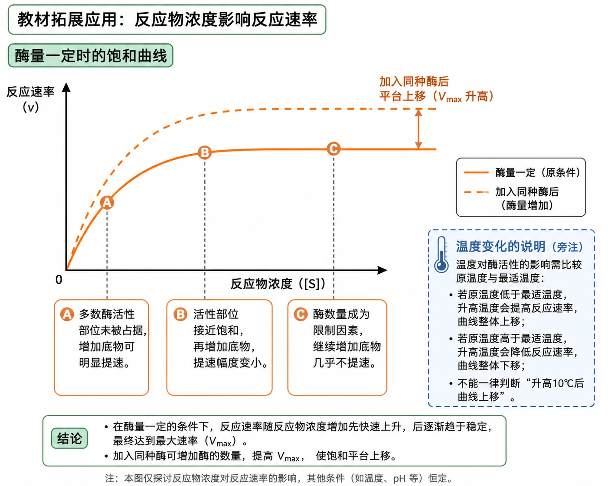
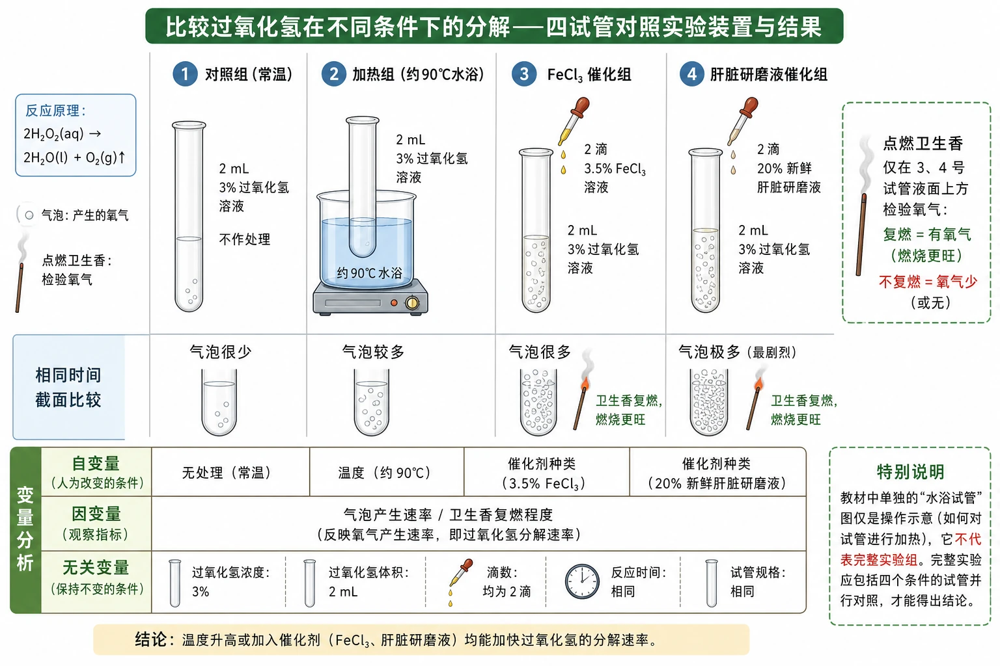
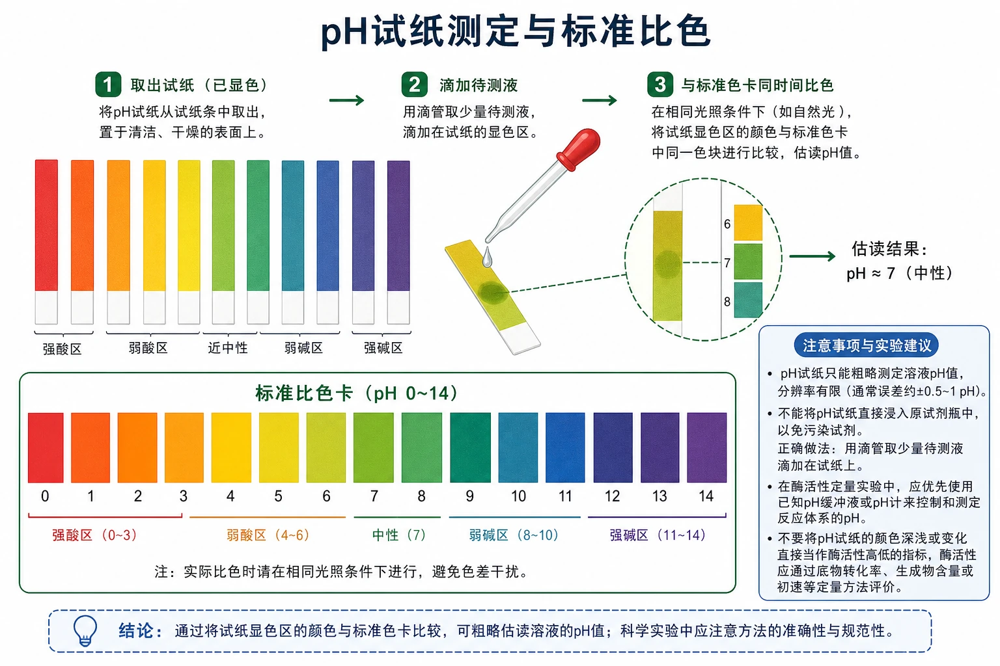
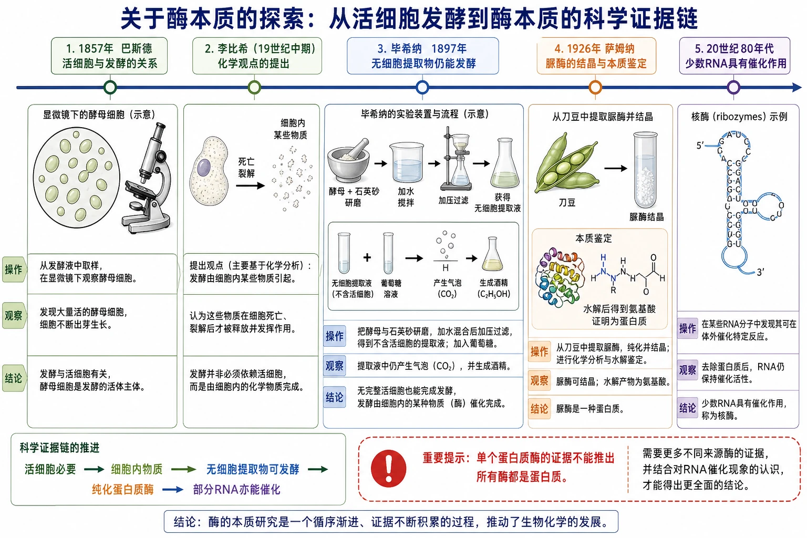

# 5.1 降低化学反应活化能的酶

## 知识关系导航

- 所属章节：[[章首 学习导图|细胞的能量供应和利用]]
- 后续联系：[[5.2 细胞的能量“货币”ATP|ATP合成与水解]]、[[5.3 细胞呼吸的原理和应用|细胞呼吸]]和[[5.4 光合作用与能量转化|光合作用]]都依赖多种酶催化。
- 结构基础：蛋白质空间结构决定功能；少数RNA也有催化作用。

<!-- 图片描述：补充知识图（非教材原图）——“酶知识全景图”。中心为“酶：活细胞产生、具有催化作用的有机物”，向六个方向展开：作用机制“降低活化能”、化学本质“绝大多数蛋白质，少数RNA”、特性“高效性、专一性、作用条件较温和”、影响因素“温度、pH、底物浓度、酶浓度”、实验方法“自变量—因变量—无关变量—对照—重复”、生产应用“食品、洗涤、医药、能源”。右下角加入酶—底物结合及产物释放的简化连续画面；底部红色排错条写“酶不提供能量、不改变反应前后能量差、反应前后数量和性质基本不变”。白底教材式信息图，实验变量用蓝色、酶结构用绿色、能量曲线用橙色。 -->

## 本节学习目标

1. 解释酶如何通过降低活化能提高反应速率。
2. 概括酶的本质，并用科学史证据说明结论如何逐步形成。
3. 说明酶的高效性、专一性和作用条件较温和。
4. 掌握过氧化氢分解、底物专一性以及温度和pH影响酶活性的实验设计。
5. 会分析酶活性曲线、底物浓度—反应速率曲线及实际应用。

## 核心知识点讲解

### 一、知识对象与生命情境

细胞中每时每刻进行的全部化学反应统称为细胞代谢。胃液能消化肉类、肝细胞能迅速分解过氧化氢、肌细胞能在运动时快速供能，都说明生命活动需要高效催化。

<!-- 图片描述：教材“斯帕兰札尼研究鹰的消化作用”源图重绘——“金属笼中的肉块经鹰胃消化实验”。采用18世纪科学实验插画风格，主体为科学家观察鹰，旁边设置放大的过程小窗：等量肉块装入带孔金属笼→鹰吞下金属笼→一段时间后取出→笼完好但肉块消失。明确金属笼的孔允许胃液进入，同时阻止肉块与胃壁直接机械摩擦；图中用实线表示观察事实，用虚线问号指向“胃液中的何种物质导致肉块消失”，不得直接把胃蛋白酶标为该实验已证实结论。 -->

### 二、核心概念与结构功能

酶是活细胞产生的具有催化作用的有机物，绝大多数是蛋白质，少数是RNA。酶可在细胞内发挥作用，也可分泌到细胞外或离开细胞后发挥作用。

活化能是分子从常态转变为容易发生化学反应的活跃状态所需要的能量。加热让更多反应物分子获得能量；催化剂则降低反应所需的活化能。酶通常比无机催化剂降低活化能更显著，因而催化效率更高。

<!-- 图片描述：教材图5-1源图重绘——“酶降低化学反应活化能”。绘制纵轴“能量”、横轴“反应过程”的三条路径：反应物和产物能级保持相同；无催化路径峰值最高，无机催化剂路径峰值居中，酶催化路径峰值最低；用双向括号分别标注三种路径的活化能，并用同一竖向差值标示反应前后能量差不因催化剂改变。图侧用山岭比喻小图表现“加热像提高车辆能量，催化剂像降低山口高度”，明确酶只改变反应速率，不改变产物种类和总能量变化。 -->

### 三、关键过程、规律与调控机制

#### 酶的三项主要特性

1. **高效性**：酶的催化效率通常显著高于无机催化剂，使细胞可在温和条件下维持快速代谢。
2. **专一性**：每一种酶只能催化一种或一类化学反应。专一性来自酶活性部位与底物在结构和化学性质上的匹配。
3. **作用条件较温和**：每种酶有适宜温度和pH；偏离适宜条件，活性降低。高温、过酸或过碱常破坏酶的空间结构而使其失活；低温主要抑制分子运动，通常不永久破坏结构。

<!-- 图片描述：教材拓展应用“酶作用模型”源图组重绘——“酶与底物结合、反应和产物释放连续模型”。按从左到右三格绘制：第一格特定形状的底物进入酶的活性部位，另一个形状不匹配的分子停留在外；第二格形成酶—底物复合物并在活性部位发生键的断裂或形成；第三格产物释放，酶的基本结构恢复并可再次催化。保留教材编号1、2、3的时序感，不把“钥匙—锁”画成完全刚性结构，可用轻微构象变化表示诱导契合；图下注明该模型主要解释专一性和酶反应前后可重复利用。 -->

### 四、典型模型与分析方法

#### 温度和pH曲线

<!-- 图片描述：教材图5-2、图5-3源图组重绘——“温度和pH对酶活性的影响”。左右并排两张坐标图，纵轴统一为反应速率或酶活性。左图横轴温度，从低温区缓慢上升至最适温度峰值，再因高温使酶空间结构破坏而快速下降至接近零；低温端标“活性低，升温后通常可恢复”，高温端标“结构破坏，常不可逆”。右图横轴pH，呈以最适pH为中心的钟形曲线，两端分别标“过酸”和“过碱可破坏结构”；加注“不同酶的最适温度和最适pH不同，峰值位置不能通用”。不得把曲线画成所有酶都完全对称。 -->

温度升高同时带来两种效应：适度升温使分子运动加快，反应速率上升；温度过高使酶结构破坏，反应速率下降。因此曲线有最适温度。pH主要通过影响酶和底物的带电状态及酶空间结构改变活性。

#### 底物浓度—反应速率曲线

<!-- 图片描述：教材拓展应用“反应物浓度影响反应速率”源图重绘——“酶量一定时的饱和曲线”。横轴反应物浓度，纵轴反应速率，橙色曲线从原点附近快速上升后逐渐进入平台；A位于上升段，标“多数酶活性部位未被占据，增加底物可明显提速”；B位于接近平台处，标“活性部位接近饱和”；C位于平台段，标“酶数量成为限制因素，继续增加底物几乎不提速”。另用虚线画“加入同种酶后平台上移”的曲线；温度变化只以旁注说明需比较原温度与最适温度，不能一律判断升高10℃后上移。 -->

### 五、图表、实验与证据链

#### 比较过氧化氢在不同条件下的分解

| 试管 | 处理 | 主要比较意义 | 预期现象 |
|---|---|---|---|
| 1 | 仅加过氧化氢 | 空白对照 | 少量气泡 |
| 2 | 约$90^\circ\mathrm{C}$水浴 | 加热作用 | 气泡较多 |
| 3 | 加等滴数$mathrm{FeCl_3}$ | 无机催化剂 | 大量气泡 |
| 4 | 加等滴数新鲜肝脏研磨液 | 过氧化氢酶 | 气泡最迅速、最明显，卫生香复燃更明显 |

<!-- 图片描述：教材“比较过氧化氢在不同条件下的分解”源图重绘——“四试管对照实验装置与结果”。横向排列1—4号等规格试管，每管先加入2 mL、3%过氧化氢；1号不处理，2号置于约90℃水浴，3号滴2滴3.5% FeCl₃，4号滴2滴20%新鲜肝脏研磨液。用相同时间截面的气泡密度表现反应速率，用点燃卫生香仅检验3、4号试管液面上方的氧气；下方变量表标出自变量为温度或催化剂种类，因变量为气泡产生速率/卫生香复燃程度，无关变量为过氧化氢浓度体积、滴数、反应时间和试管规格。强调教材中单独的水浴试管图只是操作示意，不代表完整实验组。 -->

该实验中每滴$mathrm{FeCl_3}$所含$mathrm{Fe^{3+}}$数量约为每滴研磨液中过氧化氢酶分子数的25万倍，但4号仍更快，强有力地支持酶具有高效性。气泡是过氧化氢分解的直接现象，卫生香复燃用于证明气体是氧气。

#### 控制变量和对照实验

自变量是研究者主动改变的因素；因变量是随自变量改变而测量的结果；无关变量也可能影响结果，需尽量保持相同。1号为空白对照，2—4号是实验组。若增加“煮沸肝脏研磨液”组，可验证高温破坏酶活性；增加等量蒸馏水组，可排除加液操作和稀释的影响。

#### 探究酶的专一性

淀粉和蔗糖分别加入相同淀粉酶并在相同条件保温，随后用斐林试剂水浴加热检测还原糖。淀粉组出现砖红色沉淀而蔗糖组不出现，说明淀粉酶能催化淀粉水解，不能催化蔗糖水解。

注意：不能用碘液检测蔗糖是否水解，因为碘液只能判断淀粉是否存在；斐林试剂必须水浴加热，而且检测试剂的高温步骤应放在酶促反应之后。

#### 探究温度或pH对酶活性的影响

- 温度实验适合使用淀粉和淀粉酶，先分别在设定温度预处理，再混合反应，最后用碘液检测剩余淀粉。
- pH实验适合使用过氧化氢和过氧化氢酶，利用不同pH缓冲液，检测单位时间气泡量或氧气体积。
- 不建议用过氧化氢酶探究温度，因为过氧化氢本身受热会加快分解，造成自变量同时影响底物和酶。
- 不宜用斐林试剂实时检测温度实验，因为其水浴加热会改变实验设定温度。

<!-- 图片描述：教材“pH试纸及显色反应”源图重绘——“pH试纸测定与标准比色”。横向排列多条已显色的pH试纸，颜色由强酸区红橙、近中性黄绿到碱性蓝紫变化，下方配完整标准色卡；画一支滴管把待测液滴在试纸上，再将显色区域与色卡中同一时间的颜色比较。旁注pH试纸只能粗略测定且不能直接浸入原试剂瓶；在酶活性定量实验中应优先使用已知pH缓冲液或pH计，避免把试纸颜色本身当成酶活性指标。 -->

#### 酶本质的探索证据链

<!-- 图片描述：教材“关于酶本质的探索”源图组重绘——“从活细胞发酵到酶本质的科学证据链”。按时间轴画四个关键节点：1857年巴斯德在显微镜下观察活酵母细胞，提出发酵与活细胞有关；李比希提出发酵由细胞内某些物质引起但认为细胞死亡裂解后才发挥作用；毕希纳把酵母与石英砂研磨、加水、加压过滤，向不含活细胞的提取液加入葡萄糖仍产生气泡和酒精，证明无完整活细胞也可发酵；1926年萨姆纳从刀豆获得脲酶结晶并证明为蛋白质；末端补充20世纪80年代发现少数RNA具有催化作用。每节点分“操作/观察/结论”三行，巴斯德显微图和毕希纳装置图保持教材形态；用红色提示“单个蛋白质酶的证据不能推出所有酶都是蛋白质”。 -->

### 六、题型应用与迁移

酶制剂适合低温保存，因为低温下酶活性低但结构通常稳定；使用时再恢复适宜温度。嫩肉粉含蛋白酶，可分解肌肉组织中的蛋白质。新鲜糯玉米短时高温处理能使把可溶性糖转为淀粉的酶失活，从而较好保持甜味。

## 重点梳理

- 酶的作用：降低活化能，提高反应速率。
- 酶的本质：绝大多数是蛋白质，少数是RNA。
- 酶的特性：高效性、专一性、作用条件较温和。
- 高温、过酸、过碱常使酶结构破坏；低温通常只使活性暂时降低。
- 实验设计核心：单一自变量、可检测因变量、控制无关变量、设置对照和重复。

## 难点突破

### 1. 酶能不能改变反应的最终结果

在反应物量和其他条件相同且反应能充分进行时，酶只缩短达到终点的时间，通常不改变平衡点和最终产物量。比较酶活性应在相同且较短时间测“速率”，不能只看反应完全后的总产物。

### 2. 最适温度是否等于保存温度

最适温度适合短时间发挥催化作用；保存则应减慢酶分子变化并维持结构，通常选择低温。因此二者不同。

### 3. 用底物消失还是产物生成表示酶活性

两者都可，但指标必须可定量且与反应速率对应。例如单位时间氧气体积、达到相同颜色所需时间或单位时间底物减少量。若用“达到相同结果所需时间”，时间越短表示酶活性越高。

## 例题讲解

### 例题：分析温度对酶活性的实验

**题目**：三组淀粉和淀粉酶分别在$0^\circ\mathrm{C}$、$37^\circ\mathrm{C}$、$100^\circ\mathrm{C}$反应后用碘液检测。若$37^\circ\mathrm{C}$组不变蓝，另外两组变蓝，能否说明低温和高温都使酶永久失活？

**分析**：变蓝只能说明该时间内仍有淀粉。低温组可能只是反应慢；高温组可能因结构破坏失活。需把两组恢复到适宜温度并补充反应时间再检测。

**答案**：不能。若低温组恢复适温后淀粉继续水解，说明低温抑制可逆；若高温组恢复后仍不能水解，才支持高温造成不可逆失活。

## 易错点整理

1. “酶为反应提供能量”——酶只降低活化能。
2. “所有酶都是蛋白质”——少数RNA也有催化作用。
3. “低温与高温都会使酶变性”——低温通常不破坏空间结构。
4. “最适温度下酶最稳定”——活性最高不等于最适合长期保存。
5. “底物越多，速率一直按比例增加”——酶量一定时会因活性部位饱和进入平台。
6. “用一种酶和一种底物即可证明专一性”——至少要改变底物或酶并形成有效对照。

## 考点考证点整理

### 考点一：酶与活化能

- 出题思路：能量曲线、酶与无机催化剂比较。
- 关键条件：反应前后能量差不变，峰值降低。
- 解答要点：酶降低活化能、提高速率，本身不供能。
- 易扣分点：写成“降低反应物能量”或“增加产物能量”。

### 考点二：影响酶活性的曲线

- 出题思路：温度、pH、底物浓度、酶浓度变化。
- 关键条件：最适值、结构是否破坏、限制因素是否改变。
- 解答要点：分上升段、峰值和下降/平台段解释。
- 易扣分点：认为升温必定提速；忽略高温不可逆影响。

### 考点三：酶实验设计

- 出题思路：补实验步骤、判断变量、改进方案。
- 关键条件：预处理、同时反应、等量等浓度、检测时机、重复。
- 解答要点：保证只有目标因素不同，指标能反映速率。
- 易扣分点：先混合后控温；检测步骤改变自变量。

## 练习题

1. 教材概念检测：判断酶能否离开生物体作用，以及“所有酶都是蛋白质”是否正确。
2. 为什么等滴数肝脏研磨液中过氧化氢酶分子远少于$mathrm{Fe^{3+}}$，反应却更快？
3. 设计实验判断某酶结晶是否为蛋白质。
4. 淀粉酶能催化淀粉但不能催化蔗糖水解，说明什么特性？
5. 底物浓度—速率曲线平台期加入同种酶，曲线怎样变化？
6. 为什么探究pH对过氧化氢酶活性影响时应使用缓冲液？

## 练习题答案

1. 酶可离开生物体发挥作用；“所有酶都是蛋白质”错误，绝大多数酶是蛋白质，少数是RNA。
2. 酶降低活化能的作用更显著，体现酶具有高效性。
3. 将酶结晶配成溶液，取样加入双缩脲试剂，若出现紫色可支持含蛋白质；另设已知蛋白质阳性对照和蒸馏水阴性对照。该实验只说明样品含蛋白质，若要证明催化活性来自该蛋白质还需进一步纯化和活性关联证据。
4. 专一性，即一种酶只能催化一种或一类化学反应。
5. 最大反应速率提高，平台上移；在相同底物浓度下可利用的酶活性部位增多。
6. 缓冲液能使各组pH稳定在设定值，避免反应过程中少量酸碱变化造成实际pH偏移。
