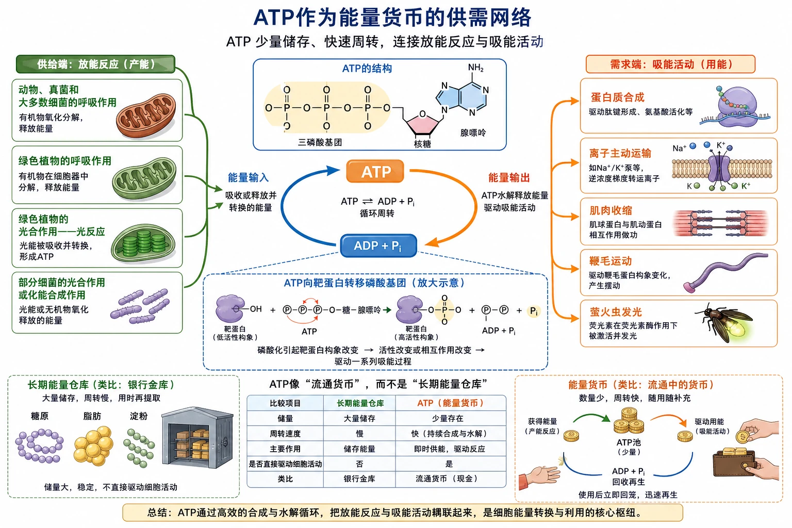
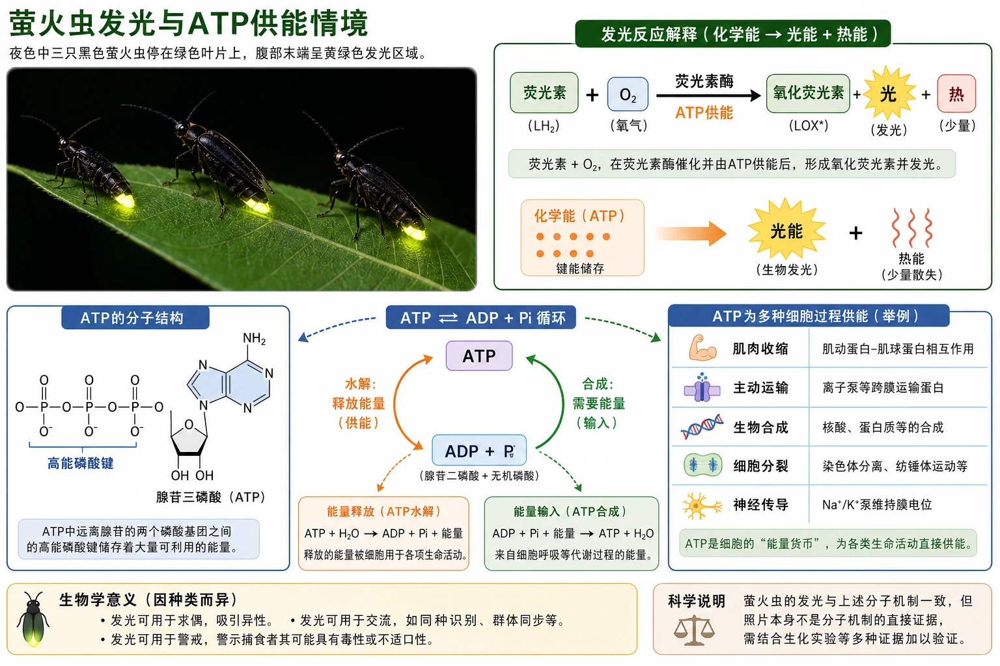
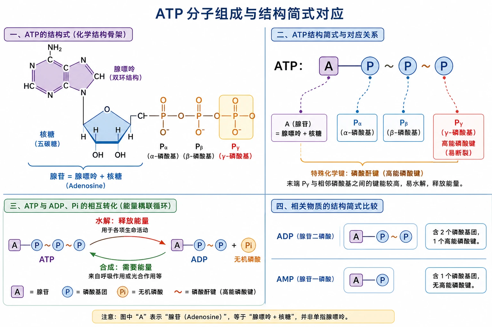
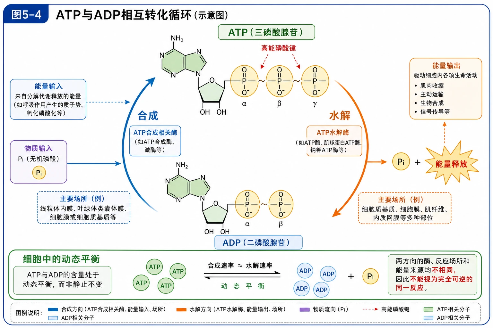
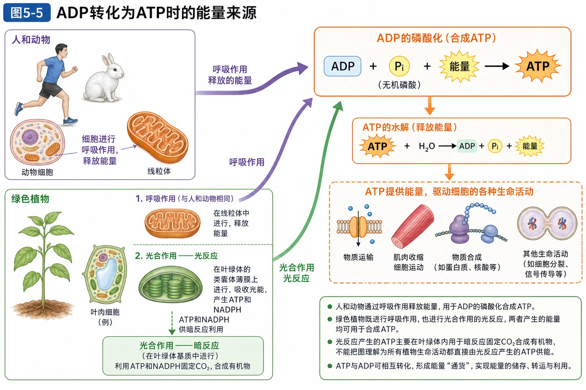
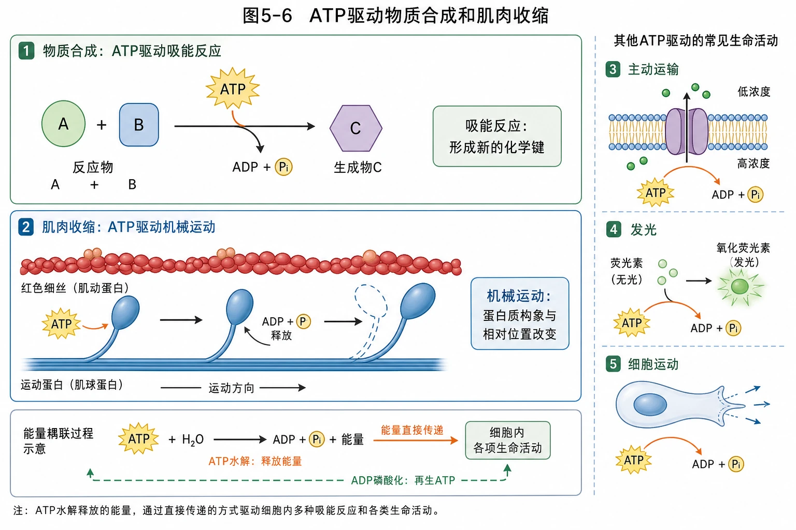
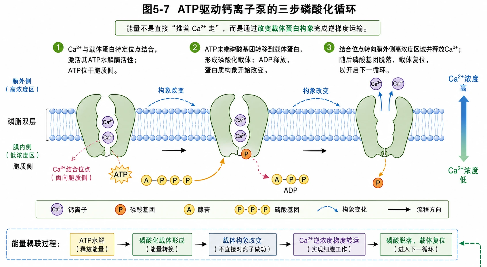
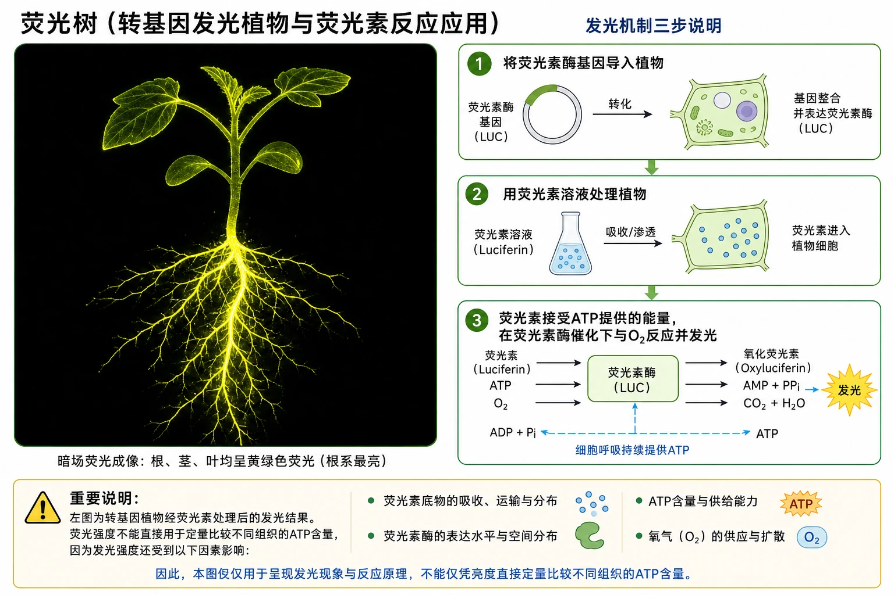

# 5.2 细胞的能量“货币”ATP

## 知识关系导航

- 所属章节：[[章首 学习导图|细胞的能量供应和利用]]
- 形成ATP：[[5.3 细胞呼吸的原理和应用|细胞呼吸]]释放的能量和[[5.4 光合作用与能量转化|光反应]]吸收的光能可用于合成ATP。
- 使用ATP：主动运输、物质合成、肌肉收缩、细胞运动和发光等生命活动。

<!-- 图片描述：补充知识图（非教材原图）——“ATP作为能量货币的供需网络”。中央画ATP⇌ADP+Pi循环；左侧为放能反应输入端：动物、真菌和大多数细菌的呼吸作用，绿色植物的呼吸作用与光合作用光反应，箭头把释放或吸收并转换的能量送入“ADP+Pi→ATP”；右侧为吸能活动输出端：蛋白质合成、离子主动运输、肌肉收缩、鞭毛运动、萤火虫发光，箭头由“ATP→ADP+Pi”指向各活动。中部加入磷酸基团从ATP转移到靶蛋白的放大窗，显示靶蛋白构象和活性改变。用硬币仓库与流通货币对比小图强调ATP储量少、周转快，不是长期能量仓库。 -->

## 本节学习目标

1. 识别ATP的组成和结构简式，区分腺嘌呤、核糖、腺苷和磷酸基团。
2. 写出ATP水解与合成的概念反应式，解释动态平衡和快速周转。
3. 区分ATP合成的能量来源与ATP水解释放能量的用途。
4. 以钙离子泵为例说明磷酸化如何改变蛋白质空间结构并驱动主动运输。
5. 解释ATP为何是直接能源物质和能量“货币”。

## 核心知识点讲解

### 一、知识对象与生命情境

萤火虫发光、肌纤维收缩、主动运输和蛋白质合成都需要细胞即时供能。糖类和脂肪含有较多化学能，但通常不能直接驱动这些过程；ATP是驱动细胞生命活动的直接能源物质。

<!-- 图片描述：教材“萤火虫”源图重绘——“萤火虫发光与ATP供能情境”。保留夜色中三只黑色萤火虫停在绿色叶片上的真实摄影构图，腹部末端呈黄绿色发光区域；右侧设置不侵入照片的反应解释框“荧光素+O₂，在荧光素酶催化并由ATP供能后形成氧化荧光素并发光”，以箭头区分化学能向光能和热能的转化。注明发光用于求偶、交流或警戒等生物学意义可因种类而异，不把照片本身作为分子机制的直接证据。 -->

### 二、核心概念与结构功能

ATP是腺苷三磷酸，结构简式为$\mathrm{A-P\sim P\sim P}$。A代表腺苷，由腺嘌呤和核糖组成；P代表磷酸基团；$\sim$表示一种特殊的化学键。ATP含三个磷酸基团，不是“三个磷酸分子”。

<!-- 图片描述：教材“ATP结构式”源图重绘——“ATP分子组成与结构简式对应”。左侧画化学结构骨架：紫色双环腺嘌呤、蓝色五碳核糖和三个依次相连的磷酸基团；用括号标出“腺苷=腺嘌呤+核糖”，再用编号Pα、Pβ、Pγ标三个磷酸基团，突出末端Pγ。右侧并排简式A—P～P～P，连线对应A、三个P和特殊化学键；下方单独比较ADP的A—P～P和AMP的A—P，避免把字母A误解为腺嘌呤。颜色和原教材一致但提高标注清晰度。 -->

相邻磷酸基团都带负电荷而相互排斥等原因，使末端磷酸基团具有较高的转移势能。ATP水解时，末端磷酸基团往往不是简单成为游离磷酸，而是挟能量转移到其他分子上，使其结构和活性改变。

### 三、关键过程、规律与调控机制

ATP与ADP的相互转化可概括为：

$$
\mathrm{ATP+H_2O\xrightarrow{酶}ADP+P_i+能量}
$$

$$
\mathrm{ADP+P_i+能量\xrightarrow{酶}ATP+H_2O}
$$

<!-- 图片描述：教材图5-4源图重绘——“ATP与ADP相互转化循环”。上方为ATP分子模型A—P～P～P，下方为ADP分子模型A—P～P；右侧顺时针箭头写“水解”，末端磷酸基团Pi离开并伴随能量释放，左侧逆时针箭头写“合成”，ADP接受Pi和能量形成ATP。分别在两条箭头旁标“ATP水解酶”和“ATP合成相关酶”，用不同颜色提示两方向的酶、反应场所和能量来源并不相同，因此整体不能视为完全可逆的同一反应。图外框强调细胞中ATP与ADP含量处于动态平衡而非静止不变。 -->

细胞中ATP含量不多，却能迅速合成和水解。例如剧烈运动时每分钟可有大量ATP转化为ADP，生成的ADP又迅速转回ATP。所谓动态平衡，是合成与水解持续发生且总体比例相对稳定，不是两者停止转化。

对绿色植物，合成ATP的能量可来自光合作用吸收的光能，也可来自呼吸作用释放的能量；对动物、人、真菌和大多数细菌，主要来自呼吸作用。磷酸基团本身不是能量来源。

<!-- 图片描述：教材图5-5源图重绘——“ADP转化为ATP时的能量来源”。左侧画人和动物，以紫色箭头“呼吸作用释放的能量”指向右上反应“ADP+Pi+能量→ATP”；下方画绿色植物，同时以紫色箭头“呼吸作用”与绿色箭头“光合作用光反应”汇入同一ATP合成框。明确绿色植物也进行呼吸作用；光合作用产生的ATP主要在叶绿体内用于暗反应，不能把图理解为所有植物生命活动都直接由光反应ATP供能。 -->

### 四、典型模型与分析方法

#### ATP与葡萄糖的比较

| 项目 | ATP | 葡萄糖等有机物 |
|---|---|---|
| 角色 | 直接能源、能量转移媒介 | 主要能源物质或较稳定储能物质 |
| 储量 | 少 | 相对较多 |
| 转化特点 | 合成、水解迅速，周转快 | 需经过多步氧化分解释放能量 |
| 与生命活动关系 | 常可直接偶联吸能过程 | 通常先用于合成ATP |

“ATP是能量货币”强调通用、便于流通和快速周转，不意味着ATP含能量最多，也不意味着所有过程都直接水解ATP。

### 五、图表、实验与证据链

#### ATP的利用实例

<!-- 图片描述：教材图5-6源图重绘——“ATP驱动物质合成和肌肉收缩”。上半部画反应物A与B在ATP供能下结合为生成物C，箭头旁标“吸能反应：形成新的化学键”；下半部画红色细丝和蓝色运动蛋白，运动蛋白在ATP供能后沿细丝发生位置变化，标“机械运动：蛋白质构象与相对位置改变”。右侧补充同层级小图标“主动运输、发光、细胞运动”，但与教材原有两例以边框区分。不得把ATP画成反应物A或B的组成部分，除非明确表示磷酸基团转移。 -->

#### ATP为$mathrm{Ca^{2+}}$主动运输供能

<!-- 图片描述：教材图5-7源图组重绘——“ATP驱动钙离子泵的三步磷酸化循环”。将教材三幅小图整合为从左到右连续编号的膜运输分镜：①膜内侧低浓度区域的Ca²⁺与载体蛋白特定位点结合，激活其ATP水解酶活性，ATP位于胞质侧；②ATP末端磷酸基团转移到载体蛋白形成磷酸化载体，ADP释放，蛋白质构象开始改变；③结合位点转向膜外侧高浓度区域并释放Ca²⁺，随后磷酸基团脱落、载体复位以开启下一循环。横向磷脂双层、膜内外和浓度差均清楚标出；用橙色P标磷酸化，用弧形箭头表示构象变化，强调能量不是直接“推着离子走”，而是通过改变载体结构完成逆梯度运输。 -->

磷酸化是ATP供能的重要机制：末端磷酸基团转移到蛋白质等分子上，伴随能量转移，使靶分子的空间结构和活性发生变化。主动运输的载体蛋白既是运输蛋白，又可具有ATP水解酶活性。

### 六、题型应用与迁移

细胞内反应可分为吸能反应和放能反应。蛋白质合成等吸能反应常与ATP水解相联系；葡萄糖氧化分解等放能反应常与ATP合成相联系。ATP在二者之间转移能量，实现能量偶联。

<!-- 图片描述：教材“荧光树”源图重绘——“转基因发光植物与荧光素反应应用”。黑色背景中央是一株根、茎、叶均呈黄绿色荧光轮廓的幼苗，保持教材照片中根系最亮、枝叶轮廓清晰的真实暗场效果；右侧用三步机制框说明“将荧光素酶基因导入植物→用荧光素溶液处理→荧光素接受ATP提供的能量，在荧光素酶催化下与O₂反应并发光”。用边界说明该照片呈现发光结果，不能仅凭亮度直接定量比较不同组织的ATP含量，因为还受底物、酶表达和氧供应影响。 -->

## 重点梳理

- ATP结构：$\mathrm{A-P\sim P\sim P}$，A为腺苷。
- ATP水解释放能量并常伴随末端磷酸基团转移。
- ATP与ADP快速相互转化并保持动态平衡。
- 合成ATP的能量来自光能或有机物分解释放的能量，不来自Pi。
- ATP通过磷酸化、构象改变等方式直接驱动生命活动。

## 难点突破

### 1. ATP与ADP相互转化是否为可逆反应

从物质上看存在循环；从反应条件看，两方向所需酶、能量来源、场所和能量去向不同，不能简单写成同一反应的可逆平衡。

### 2. ATP水解为什么不只是“断键放能”

化学键断裂本身需要能量。ATP水解的净放能来自反应物到产物全过程的能量变化，教材强调末端磷酸基团具有较高转移势能。答题宜写“ATP水解并发生磷酸基团转移，整体释放能量”。

### 3. 植物光反应形成的ATP去哪里

主要用于同一叶绿体基质中的暗反应。植物细胞其他生命活动所需ATP通常仍主要由细胞呼吸提供，不能把叶绿体ATP看作全细胞通用外运能源。

## 例题讲解

### 例题：一氧化碳中毒为什么影响离子泵

**题目**：离子泵具有ATP水解酶活性。一氧化碳中毒会降低某些离子的主动运输速率，为什么？

**分析**：一氧化碳妨碍氧的运输和利用，抑制有氧呼吸，使ATP合成减少；离子泵缺少ATP供能，磷酸化和构象循环减慢。

**答案**：一氧化碳中毒使细胞有氧呼吸和ATP供应下降，因此依赖ATP的离子泵运输速率降低。

## 易错点整理

1. “A代表腺嘌呤”——A代表腺苷。
2. “ATP含三个特殊化学键”——结构简式中通常表示两个相邻磷酸基团间的特殊化学键。
3. “Pi提供ATP合成所需能量”——Pi是原料，能量另有来源。
4. “ATP含量很多，所以可长期储能”——ATP含量少、周转快。
5. “ATP与ADP转化是同一个酶催化的可逆反应”——两方向条件不同。
6. “ATP水解后能量全转化为有用功”——部分能量会以热散失。

## 考点考证点整理

### 考点一：ATP结构

- 出题思路：结构简式、核苷酸组成、磷酸基团数量。
- 关键条件：A是腺苷，三个P，末端磷酸基团易转移。
- 解答要点：区分ATP、ADP、AMP和腺嘌呤核糖核苷酸。
- 易扣分点：把A写成腺嘌呤。

### 考点二：ATP—ADP循环

- 出题思路：能量来源、反应场所、动态平衡。
- 关键条件：生物类型和细胞结构。
- 解答要点：合成与水解方向分别说明能量变化。
- 易扣分点：说ATP与ADP含量相等或静止不变。

### 考点三：ATP供能机制

- 出题思路：离子泵、运动蛋白、蛋白质磷酸化。
- 关键条件：ATP水解、磷酸基团转移、构象变化。
- 解答要点：形成“水解→磷酸化→结构/活性改变→完成生命活动”的因果链。
- 易扣分点：只写“ATP提供能量”而无机制。

## 练习题

1. 写出ATP结构简式，并说明A和P各代表什么。
2. 水稻细胞中的ATP只能由细胞呼吸产生吗？
3. 为什么正常细胞中ATP与ADP的比值相对稳定？
4. 蛋白质合成和葡萄糖氧化分别怎样与ATP—ADP转化联系？
5. 离子泵运输为什么属于主动运输？
6. ATP和葡萄糖相比有哪些适合作为能量“货币”的特点？

## 练习题答案

1. $\mathrm{A-P\sim P\sim P}$；A代表腺苷，P代表磷酸基团。
2. 不是。含叶绿体的水稻细胞还可在光合作用光反应阶段形成ATP，但植物细胞也始终可通过呼吸作用合成ATP。
3. ATP持续水解并快速再合成，两过程处于动态平衡，使其比值在一定范围内相对稳定。
4. 蛋白质合成是吸能反应，常与ATP水解相联系；葡萄糖氧化是放能反应，释放的能量可用于ADP和Pi合成ATP。
5. 离子泵借助载体蛋白并消耗ATP，能够逆浓度梯度运输离子。
6. ATP分子较小、可快速合成和水解，末端磷酸基团易转移，能把多种放能反应与吸能反应偶联；其特点是即时周转而非大量长期储存。
