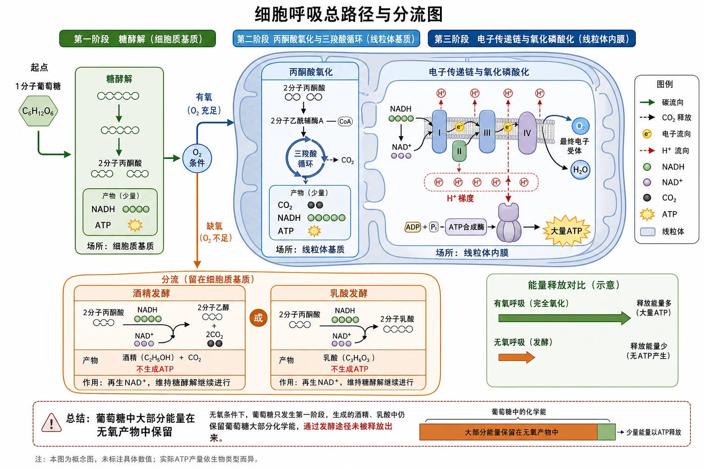
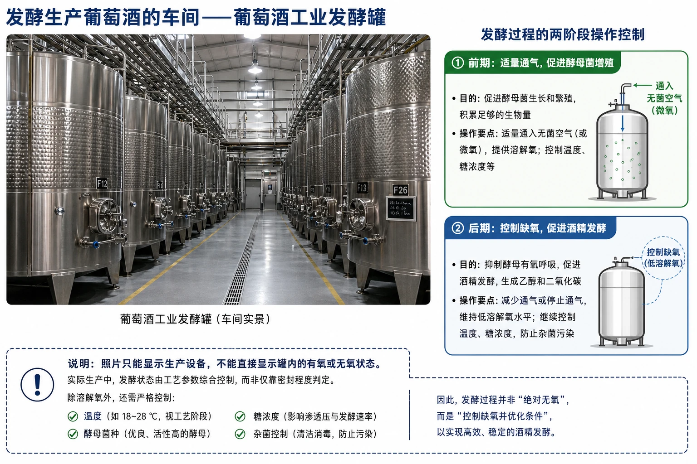
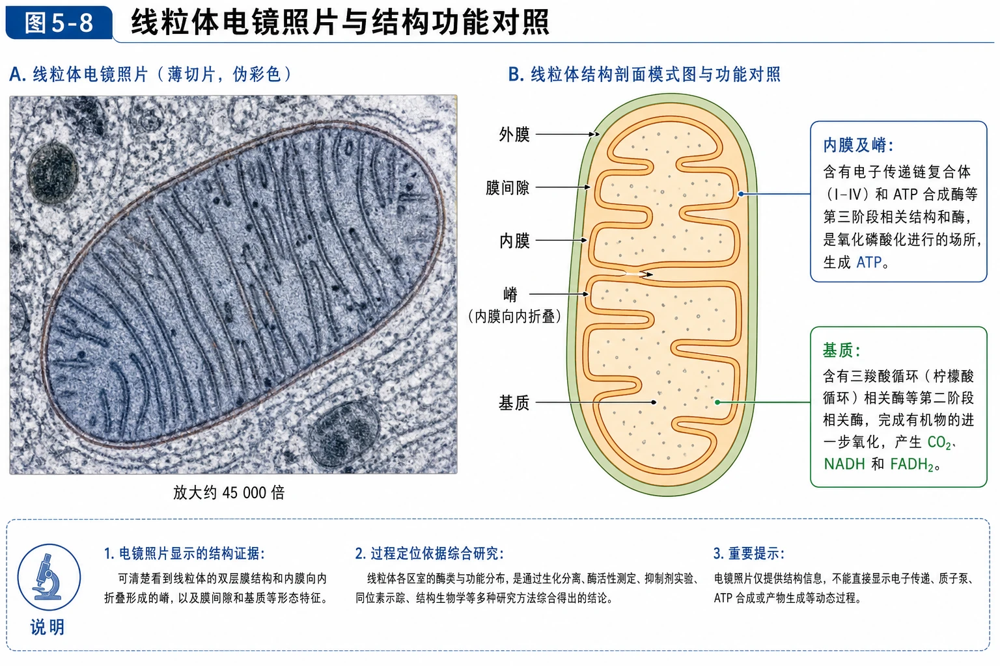
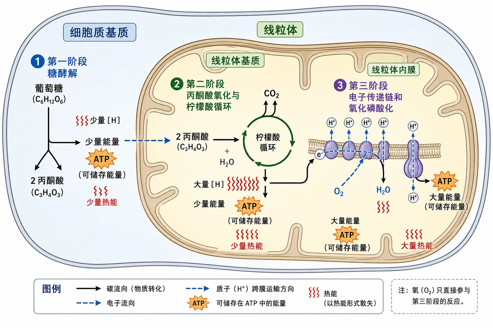
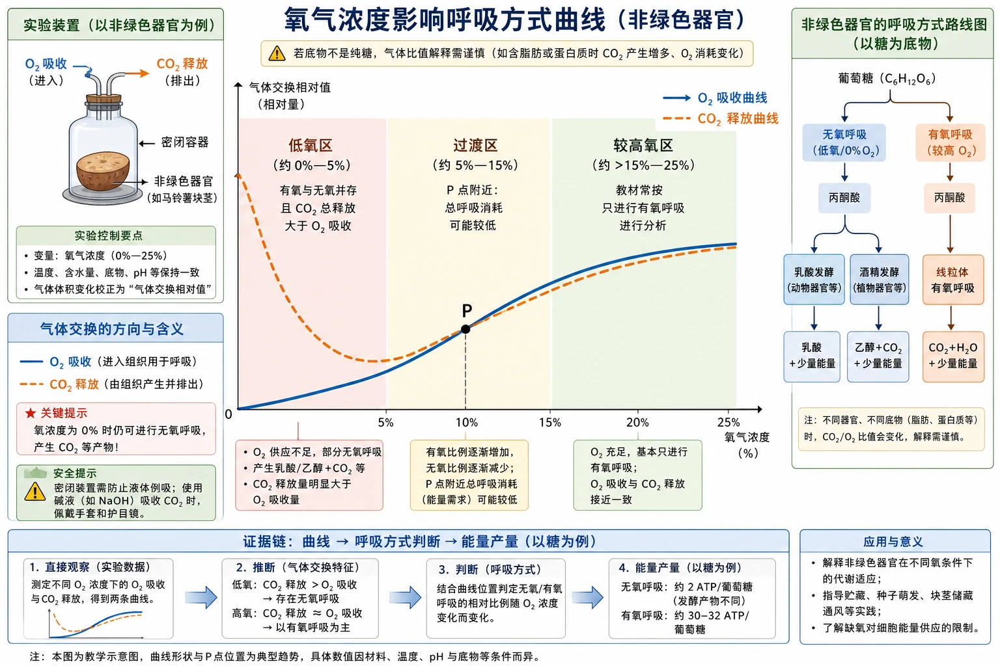
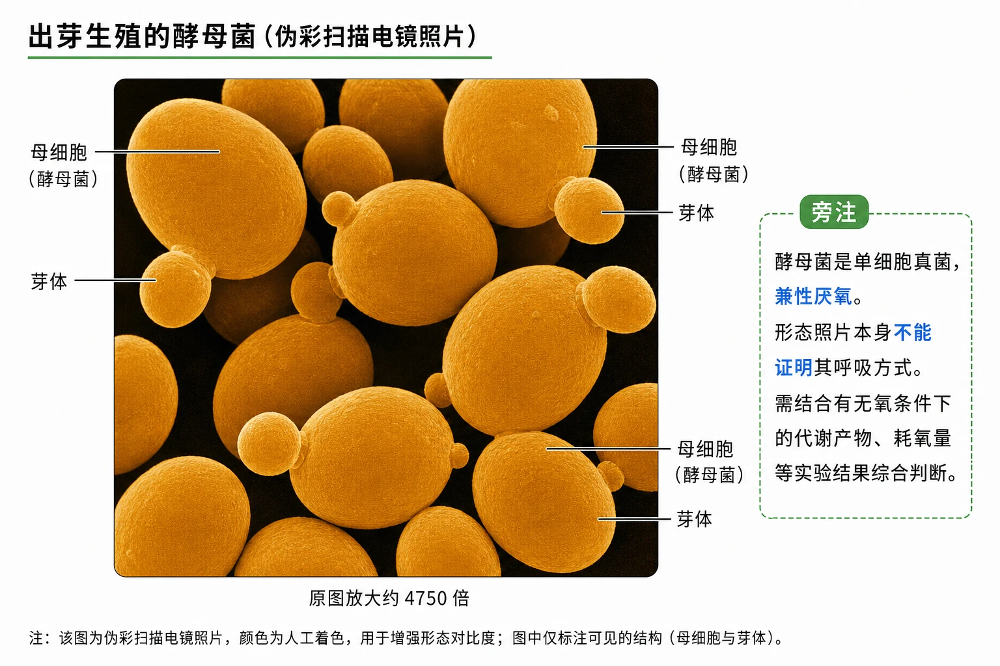
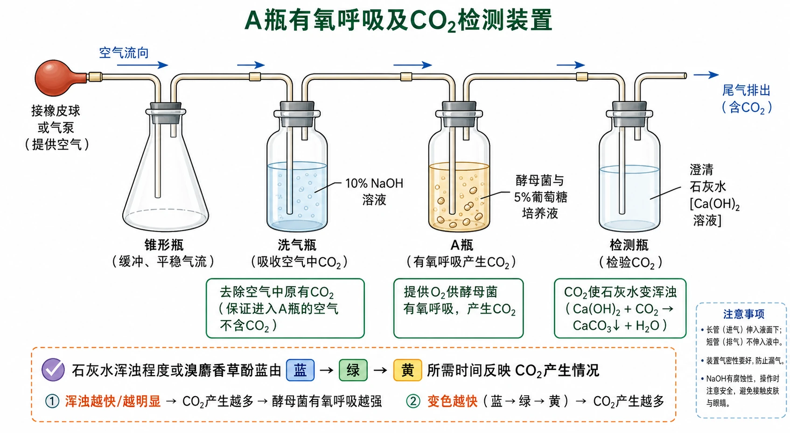
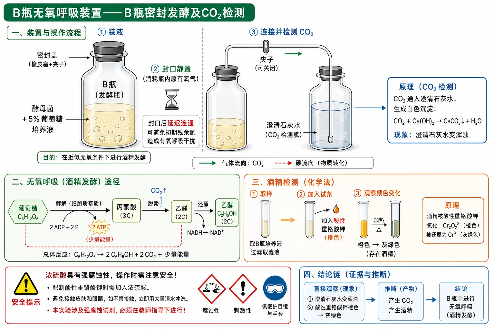
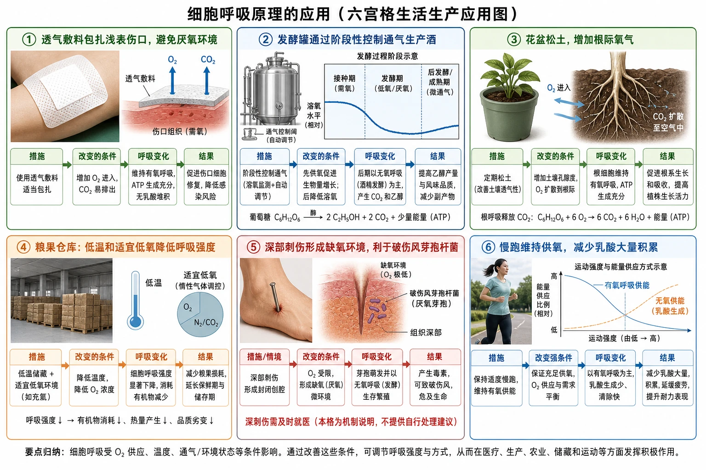

# 5.3 细胞呼吸的原理和应用

## 知识关系导航

- 所属章节：[[章首 学习导图|细胞的能量供应和利用]]
- 催化条件：[[5.1 降低化学反应活化能的酶|多种酶]]催化呼吸各阶段。
- 能量去向：释放的部分能量用于[[5.2 细胞的能量“货币”ATP|合成ATP]]，其余以热能散失。
- 物质联系：[[5.4 光合作用与能量转化|光合作用]]形成的有机物和氧气可作为呼吸作用的反应物。

<!-- 图片描述：补充知识图（非教材原图）——“细胞呼吸总路径与分流图”。左侧以1分子葡萄糖为起点，在细胞质基质经第一阶段形成2分子丙酮酸、少量NADH和少量ATP；中央设置氧气条件判断：有氧时进入线粒体基质完成第二阶段，产生CO₂、NADH和少量ATP，再在线粒体内膜进行第三阶段，NADH中的氢或电子最终与O₂形成H₂O并生成大量ATP；缺氧时留在细胞质基质，分流为酒精+CO₂或乳酸，两条无氧路径第二阶段均不再生成ATP，主要作用是维持第一阶段继续。用粗细能量箭头表现有氧释放多、无氧释放少；底部标出葡萄糖中大部分能量在无氧产物中保留。 -->

## 本节学习目标

1. 通过酵母菌实验区分有氧和无氧条件下的产物，并掌握二氧化碳、酒精的检测方法。
2. 按场所、反应物、产物、是否需氧和能量变化描述有氧呼吸三个阶段。
3. 比较酒精发酵与乳酸发酵，说明有氧呼吸和无氧呼吸的共同起点。
4. 分析氧浓度—气体交换曲线和细胞组分离心实验。
5. 用细胞呼吸原理解释发酵、运动、农业管理和食品储藏。

## 核心知识点讲解

### 一、知识对象与生命情境

呼吸作用的实质是细胞内有机物经过一系列氧化分解，释放能量并生成ATP，因此也称细胞呼吸。培养酵母菌生产菌体时通气，有利于其通过有氧呼吸获得较多能量并大量繁殖；酿酒后期密封，则有利于酵母菌无氧呼吸形成酒精。

<!-- 图片描述：教材“发酵生产葡萄酒的车间”源图重绘——“葡萄酒工业发酵罐”。保留车间内多排大型不锈钢圆柱发酵罐、顶部管线和洁净工业环境的真实摄影感；旁设两阶段操作解释：前期适量通气促进酵母菌增殖，后期控制缺氧促进酒精发酵。用虚线框注明照片只能显示生产设备，不能直接显示罐内有氧或无氧状态；避免把“密封”绝对写成完全无氧，实际生产还需控制温度、菌种、糖浓度和杂菌。 -->

### 二、核心概念与结构功能

有氧呼吸是细胞在氧参与下，经多种酶催化，把葡萄糖等有机物彻底氧化分解为二氧化碳和水，释放能量并生成大量ATP的过程。主要场所是线粒体，但第一阶段在细胞质基质中完成。

<!-- 图片描述：教材图5-8源图重绘——“线粒体电镜照片与结构功能对照”。左侧忠实重绘灰蓝或低饱和伪彩电子显微镜下的椭圆线粒体，保留双层边界和大量向内折叠的嵴，注明放大约45000倍；右侧画简洁剖面模式图，标外膜、内膜、嵴、基质和膜间隙，并用连线说明线粒体基质含有氧呼吸第二阶段相关酶，内膜及嵴含第三阶段相关结构和酶。明确电镜图显示结构证据，过程定位来自综合研究，不能从单张照片直接看到ATP生成。 -->

无氧呼吸是在没有氧气参与时，葡萄糖等有机物不完全分解，释放少量能量并生成少量ATP的过程。两个阶段都在细胞质基质，ATP只在与有氧呼吸相同的第一阶段形成。

### 三、关键过程、规律与调控机制

#### 有氧呼吸三个阶段

| 阶段 | 场所 | 主要物质变化 | 氧的关系 | ATP |
|---|---|---|---|---|
| 第一阶段 | 细胞质基质 | 葡萄糖→2丙酮酸+[H] | 不直接需要 | 少量 |
| 第二阶段 | 线粒体基质 | 丙酮酸+水→CO₂+[H] | 不直接需要 | 少量 |
| 第三阶段 | 线粒体内膜 | [H]+O₂→H₂O | 直接需要氧 | 大量 |

教材中的$[\mathrm H]$是简化符号，主要表示NADH等还原型辅酶所携带的氢和电子，不能简单理解成游离氢原子。

有氧呼吸总反应可概括为：

$$
\mathrm{C_6H_{12}O_6+6H_2O+6O_2\xrightarrow{酶}6CO_2+12H_2O+能量}
$$

若约去反应两侧的水，也常写为$\mathrm{C_6H_{12}O_6+6O_2\rightarrow6CO_2+6H_2O+能量}$。总反应式不代表氧在第一步直接氧化葡萄糖；氧在第三阶段接受氢和电子形成水。

<!-- 图片描述：教材图5-9源图重绘——“有氧呼吸三阶段空间过程”。画完整细胞轮廓及内部线粒体剖面：细胞质基质中的葡萄糖分叉形成2丙酮酸，伴随少量[H]和少量能量；丙酮酸进入线粒体基质，与水参与第二阶段产生CO₂、大量[H]和少量能量；[H]移向线粒体内膜，在氧参与下形成H₂O并释放大量能量。将可储存在ATP中的能量画成橙色ATP图标，其余用红色热浪表示热能；各阶段箭头编号1—3，标明氧只直接参与第三阶段。保持教材原图“细胞质基质—线粒体”的嵌套空间关系，修正原扫描图边缘残字。 -->

有氧呼吸不是燃烧：它在温和条件下由多种酶催化，能量逐步释放，部分储存在ATP中，避免能量瞬间大量以热散失。按教材数据，$977.28/2870\approx34\%$储存在ATP中；以每摩尔ATP水解释放$30.54\ \mathrm{kJ}$估算，约可形成32 mol ATP。

#### 无氧呼吸两条路径

酒精发酵：

$$
\mathrm{C_6H_{12}O_6\xrightarrow{酶}2C_2H_5OH+2CO_2+少量能量}
$$

乳酸发酵：

$$
\mathrm{C_6H_{12}O_6\xrightarrow{酶}2C_3H_6O_3+少量能量}
$$

酵母菌和多数植物组织缺氧时可形成酒精和二氧化碳；乳酸菌、动物骨骼肌短时缺氧以及某些植物器官可形成乳酸。乳酸发酵不产生二氧化碳。微生物的无氧呼吸习惯上称发酵。

### 四、典型模型与分析方法

#### 有氧呼吸与无氧呼吸比较

| 项目 | 有氧呼吸 | 无氧呼吸 |
|---|---|---|
| 氧气 | 需要，第三阶段直接参与 | 不需要 |
| 场所 | 细胞质基质、线粒体基质、线粒体内膜 | 细胞质基质 |
| 分解程度 | 彻底 | 不彻底 |
| 产物 | CO₂和H₂O | 酒精和CO₂或乳酸 |
| ATP | 大量 | 少量 |
| 共同点 | 第一阶段相同；均由酶催化、分解有机物、释放能量并合成ATP | 同左 |

#### 氧浓度—气体交换曲线

<!-- 图片描述：教材练习“非绿色器官在不同氧浓度下的气体交换”源图重绘——“氧气浓度影响呼吸方式曲线”。横轴氧气浓度0%—25%，纵轴气体交换相对值；O₂吸收曲线从原点随氧浓度升高逐渐上升，CO₂释放曲线在0%时较高，先快速下降至最低点后再上升，与O₂曲线在约10%的P点相交，之后两者接近一致。用区域底色标：低氧区有氧与无氧并存且CO₂总释放大于O₂吸收；P点附近总呼吸消耗可能较低；较高氧区教材常按只进行有氧呼吸分析。旁注“若底物不是纯糖，气体比值解释需谨慎”，并强调氧浓度0时仍可无氧呼吸。 -->

若以葡萄糖为底物，有氧呼吸吸收O₂与释放CO₂量相等；酒精发酵只释放CO₂不吸收O₂。因而低氧区“CO₂释放量−O₂吸收量”可用于估计无氧呼吸贡献。储藏时不是氧越低越好，完全无氧会增强无氧呼吸并积累酒精等产物；应选总呼吸消耗较低且不造成无氧伤害的适宜低氧条件。

### 五、图表、实验与证据链

#### 探究酵母菌细胞呼吸的方式

酵母菌是兼性厌氧菌，在有氧和无氧条件下都能生存，适合进行对比实验。

<!-- 图片描述：教材“酵母菌电镜照片”源图重绘——“出芽生殖的酵母菌”。重绘橙黄色伪彩扫描电镜视野，多个椭圆酵母细胞聚集，其中部分母细胞表面连有大小不同的芽体，注明原图放大约4750倍；只标母细胞和芽体，不添加细胞核或线粒体等原图不可见结构。旁注酵母菌是单细胞真菌且兼性厌氧，形态照片本身不能证明其呼吸方式。 -->

<!-- 图片描述：教材“有氧条件酵母菌呼吸装置”源图重绘——“A瓶有氧呼吸及CO₂检测装置”。从左到右依次画接橡皮球或气泵的锥形瓶、装10% NaOH溶液的洗气瓶、装酵母菌与5%葡萄糖培养液的A瓶、装澄清石灰水的检测瓶；所有导管方向明确，进入液体的长管与排气短管不可接反。空气先经NaOH去除原有CO₂，再进入培养液提供氧，尾气进入石灰水；用箭头标气流方向。下方写“石灰水浑浊程度或溴麝香草酚蓝由蓝→绿→黄所需时间反映CO₂产生情况”。 -->

<!-- 图片描述：教材“B瓶无氧呼吸装置”源图重绘——“B瓶密封发酵及CO₂检测”。左侧为装酵母菌和5%葡萄糖培养液的B瓶，先封口静置一段时间以消耗瓶内原有氧气，再通过导管连接右侧澄清石灰水瓶；标注“封口后延迟连通”可避免初期残余氧造成有氧呼吸干扰。另设酒精检测小窗：取培养液滤液，加入酸性重铬酸钾，由橙色变灰绿色；用醒目安全符号注明浓硫酸有强腐蚀性，需教师指导。不得把酒精颜色反应画成CO₂检测。 -->

实验结论：有氧组和无氧组均产生CO₂，但有氧组通常更多；无氧组产生酒精。对比实验中两个组都属于实验组，结果事先未知，通过相互比较考察氧气条件的影响。

检测要点：CO₂可使澄清石灰水变浑浊，或使溴麝香草酚蓝由蓝变绿再变黄；酒精可在酸性条件下使橙色重铬酸钾变灰绿色。葡萄糖也可能干扰酸性重铬酸钾反应，因此需适当延长培养时间并设置对照。

#### 细胞组分与呼吸场所实验

只有细胞质基质的上清液可进行第一阶段和无氧呼吸，但不能把葡萄糖彻底氧化为CO₂和H₂O；只有线粒体等细胞器的沉淀缺少细胞质基质中的第一阶段酶，不能直接利用葡萄糖完成全过程；同时含细胞质基质和线粒体的完整体系才能在有氧条件下产生CO₂和H₂O。

### 六、题型应用与迁移

- **发酵生产**：先通气促进菌体繁殖，后控制缺氧生产酒精；泡菜利用乳酸菌无氧呼吸。
- **农业管理**：中耕松土、及时排水改善根系供氧；长期水淹会使根细胞无氧呼吸、能量不足并积累有害产物。
- **食品储藏**：低温、适宜低氧和控制湿度可降低呼吸强度，减少有机物消耗，但不能简单追求零氧。
- **运动健康**：慢跑有助于供氧，减少肌细胞大量乳酸积累；短时剧烈运动中有氧和无氧供能可同时存在。
- **伤口处理**：透气敷料抑制厌氧微生物；深而缺氧的伤口有利于破伤风芽孢杆菌繁殖，应及时就医。

<!-- 图片描述：教材“细胞呼吸原理的应用”源图组重绘——“六宫格生活生产应用图”。按机制而非装饰排列六格：透气敷料包扎浅表伤口以避免厌氧环境；发酵罐通过阶段性控制通气生产酒；花盆松土增加根际氧气；粮果仓库低温和适宜低氧降低呼吸强度；深部刺伤形成缺氧环境利于破伤风芽孢杆菌；慢跑维持供氧、减少乳酸大量积累。每格采用真实情境小图+“措施→改变的条件→呼吸变化→结果”的四段箭头；医疗格明确写“深刺伤需及时就医”，不提供自行处理建议。 -->

## 重点梳理

- 有氧呼吸第一阶段在细胞质基质，第二阶段在线粒体基质，第三阶段在线粒体内膜。
- 氧只直接参与第三阶段，最终形成水。
- 无氧呼吸两个阶段均在细胞质基质，只形成少量ATP。
- 酒精发酵产生CO₂，乳酸发酵不产生CO₂。
- 呼吸释放的能量一部分储存在ATP中，大部分以热散失。

## 难点突破

### 1. 有氧呼吸第二阶段为什么写水作反应物

丙酮酸进一步分解涉及水参与；第三阶段又生成水。总反应式可在两侧同时出现水，约去后才得到常见简式，不能据简式否定第二阶段耗水。

### 2. 没有线粒体能否进行有氧呼吸

真核细胞的有氧呼吸主要依赖线粒体；某些原核生物没有线粒体，但其细胞膜和细胞质中可具有相应酶和电子传递系统，仍能进行有氧呼吸。因此“有氧呼吸一定在线粒体”只适用于相应真核细胞语境。

### 3. 线粒体是否能直接分解葡萄糖

不能完成第一阶段。葡萄糖先在细胞质基质形成丙酮酸，丙酮酸再进入线粒体。孤立线粒体加葡萄糖通常不能完成完整有氧呼吸。

## 例题讲解

### 例题：分析非绿色器官的气体曲线

**题目**：某器官在氧浓度0时只释放CO₂；随氧浓度升高，CO₂释放先下降后上升，O₂吸收持续上升。何处适合储藏？

**分析**：0氧时酒精发酵较强；低氧上升时无氧呼吸受抑制而有氧呼吸尚弱，总消耗下降；继续升氧后有氧呼吸增强，总消耗上升。

**答案**：选择CO₂释放量与O₂吸收量均较低、总呼吸强度接近最低的低氧区，同时避免氧过低引起无氧产物伤害，并配合低温等措施。

## 易错点整理

1. “呼吸作用就是吸入氧、呼出二氧化碳”——细胞呼吸是细胞内化学过程。
2. “有氧呼吸全过程在线粒体”——第一阶段在细胞质基质。
3. “有氧呼吸三个阶段都需氧”——只有第三阶段直接需氧。
4. “无氧呼吸第二阶段也生成ATP”——ATP只在第一阶段少量形成。
5. “乳酸发酵产生CO₂”——不产生。
6. “储藏时氧浓度越低越好”——过低会增强无氧呼吸并造成伤害。

## 考点考证点整理

### 考点一：呼吸阶段定位

- 出题思路：过程图、细胞器结构、物质去向。
- 关键条件：细胞类型、氧条件、底物和产物。
- 解答要点：按三个阶段逐项写场所和变化。
- 易扣分点：把CO₂写成第三阶段产物；把O₂写成第二阶段反应物。

### 考点二：酵母菌实验

- 出题思路：装置连接、NaOH作用、检测剂、封口时间。
- 关键条件：控制有氧/无氧并排除空气中CO₂。
- 解答要点：说明气流方向、检测原理和对比关系。
- 易扣分点：把酸性重铬酸钾用于检测CO₂。

### 考点三：呼吸曲线与应用

- 出题思路：氧浓度、温度与储藏或产气量。
- 关键条件：有氧和无氧可同时存在，净气体量是总和。
- 解答要点：分区判断限制因素和呼吸方式。
- 易扣分点：只按单一曲线判断，不结合两条曲线。

## 练习题

1. 写出有氧呼吸三个阶段的场所、主要产物和能量特点。
2. 比较酵母菌酒精发酵和乳酸菌乳酸发酵的产物。
3. 酵母菌有氧装置中空气为何先通过NaOH溶液？
4. B瓶为什么封口放置一段时间后再连接石灰水？
5. 只有细胞质基质的提取液加葡萄糖，在有氧条件下能否产生CO₂和H₂O？
6. 酸奶胀袋且有酒味，更可能与哪类微生物的何种呼吸有关？

## 练习题答案

1. 第一阶段在细胞质基质，形成丙酮酸、[H]和少量ATP；第二阶段在线粒体基质，形成CO₂、[H]和少量ATP；第三阶段在线粒体内膜，[H]与O₂形成H₂O并生成大量ATP。
2. 酒精发酵形成酒精和CO₂；乳酸发酵形成乳酸，不产生CO₂；两者都只释放少量能量。
3. 去除进入装置空气中原有的CO₂，保证末端检测到的CO₂主要来自酵母菌呼吸。
4. 先消耗瓶内残余氧气，形成较可靠的无氧条件，减少有氧呼吸干扰。
5. 通常不能形成完整的CO₂和H₂O；细胞质基质可完成第一阶段和无氧路径，但缺少线粒体中的后续有氧反应系统。
6. 更可能是酵母菌无氧呼吸，因其可形成酒精和CO₂；乳酸菌无氧呼吸不产生气体。
