# 6.1 细胞的增殖

## 知识关系导航

- 所属章节：[[章首 学习导图|细胞的生命历程]]
- 后续过程：增殖形成的细胞可进入[[6.2 细胞的分化|细胞分化]]。
- 稳态联系：增殖补充[[6.3 细胞的衰老和死亡|衰老和死亡的细胞]]。

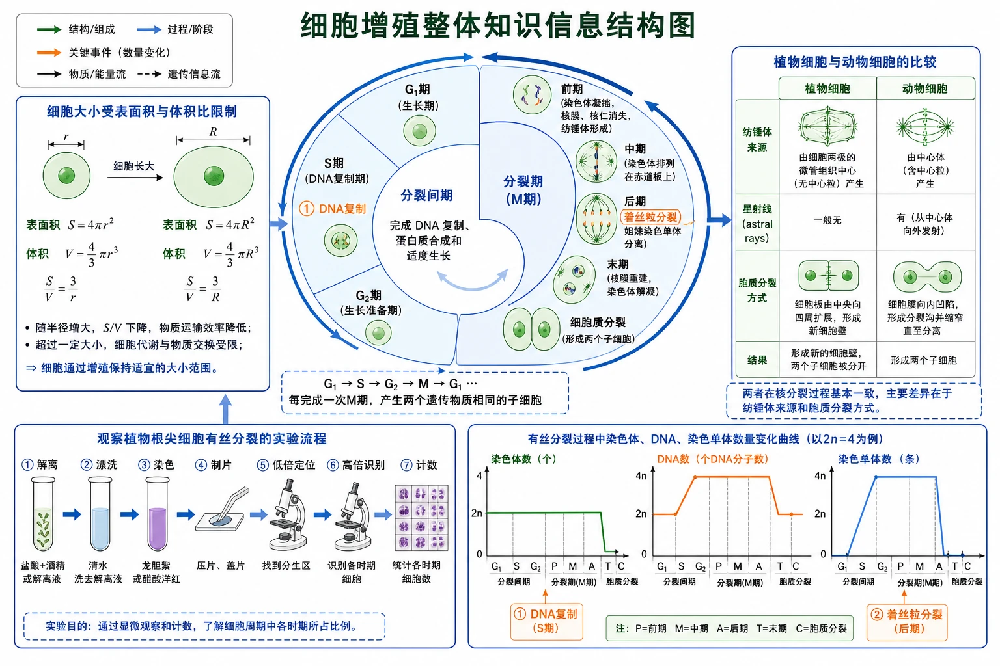
<!-- 图片描述：补充知识图（非教材原图）——“细胞增殖整体知识信息结构图”。中心为一个连续细胞周期环：分裂间期完成DNA复制、蛋白质合成和适度生长，分裂期依次经历前期、中期、后期、末期及细胞质分裂；左侧连接细胞表面积与体积比对细胞大小的限制，右侧分植物与动物细胞比较纺锤体来源和胞质分裂方式；下方连接“解离→漂洗→染色→制片→低倍定位→高倍识别→计数”实验流程以及染色体、DNA、染色单体数量曲线。用绿色表示细胞结构、蓝色表示过程、橙色突出DNA复制和着丝粒分裂两个数量变化节点。 -->

## 本节学习目标

1. 解释生物体生长与细胞数量、体积的关系和细胞不能无限长大的原因。
2. 准确定义细胞周期并比较间期和分裂期时间。
3. 根据染色体行为识别有丝分裂各时期。
4. 比较高等植物与动物细胞有丝分裂。
5. 分析染色体、DNA和染色单体数量变化。
6. 掌握根尖分生区有丝分裂装片制作、观察和统计逻辑。

## 核心知识点讲解

### 一、知识对象与生命情境

象和鼠同类组织的细胞大小通常没有悬殊差异，器官大小主要取决于细胞数量。多细胞生物长大既有细胞体积增大，也靠细胞分裂增加数量。

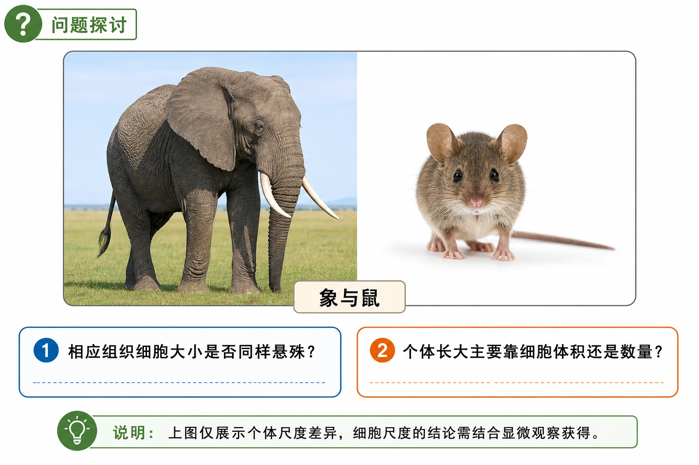
<!-- 图片描述：教材“问题探讨”源图重绘——“象与鼠体型比较”。忠实保留成年象与小鼠并置的真实照片拼图和“象与鼠”标签，不添加细胞结构；在照片外设置两个待讨论问题框“相应组织细胞大小是否同样悬殊”“个体长大主要靠细胞体积还是数量”，并明确照片只显示个体尺度差异，细胞尺度结论需结合显微观察。 -->

细胞增殖包括分裂前的物质准备和细胞分裂两个连续过程，是生长、发育、繁殖和遗传的基础。单细胞生物借此繁殖，多细胞生物借此生长和更新。

### 二、核心概念与结构功能

连续分裂的细胞，从一次分裂完成时开始，到下一次分裂完成时为一个细胞周期。只有“连续分裂的细胞”才有细胞周期；起点和终点都必须是分裂完成。

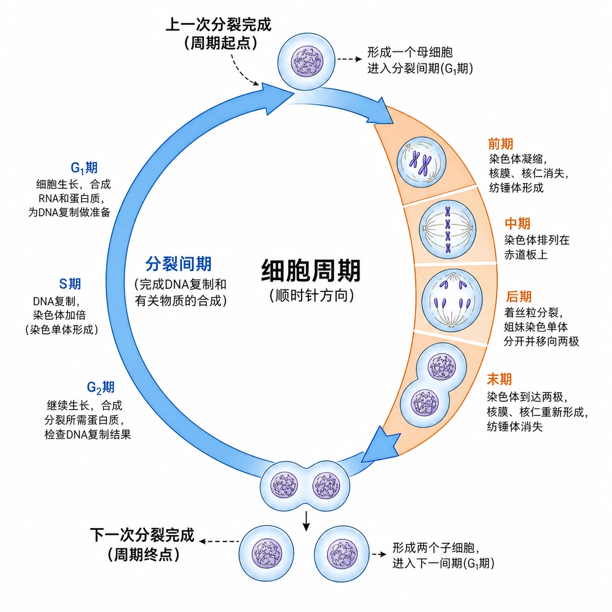
<!-- 图片描述：教材图6-1源图重绘——“细胞周期”。绘制顺时针粗环，约90%—95%的大扇区标“分裂间期”，小扇区标“分裂期”，分裂期内部依次标前期、中期、后期、末期，末端显示一个母细胞形成两个子细胞并进入下一间期。箭头清楚标出周期起点为上一次分裂完成、终点为下一次分裂完成；保留教材以蓝色环和细胞缩略图表示时序的主体，不把间期误画成静止期。 -->

间期完成DNA复制和有关蛋白质合成，细胞适度生长，占周期大部分时间。不同细胞周期长短不同，但教材表中各细胞均表现为间期远长于分裂期。

### 三、关键过程、规律与调控机制

#### 高等植物细胞有丝分裂

| 时期 | 染色体及核变化 | 纺锤体与胞质变化 | 识图口诀 |
|---|---|---|---|
| 间期 | 染色质状态；完成DNA复制 | 细胞适度生长 | 复制合成，丝状弥散 |
| 前期 | 染色质缩短变粗为染色体；核仁解体、核膜消失 | 两极发出纺锤丝形成纺锤体 | 膜仁消失，两体现 |
| 中期 | 染色体着丝粒排列在赤道板 | 纺锤丝附着并牵引 | 形定数清，赤道齐 |
| 后期 | 着丝粒分裂，姐妹染色单体成为子染色体并移向两极 | 纺锤丝牵引 | 粒裂数增，均两极 |
| 末期 | 染色体解螺旋为染色质；核膜核仁重现 | 纺锤体消失，赤道板位置出现细胞板并形成新壁 | 两消两现，板成壁 |

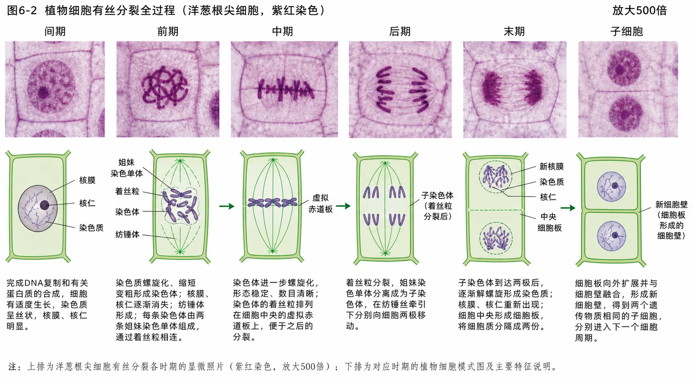
<!-- 图片描述：教材图6-2源图组重绘——“植物细胞有丝分裂全过程”。采用上下双排多面板：上排忠实重绘洋葱根尖细胞间期、前期、中期、后期、末期和子细胞的紫红染色显微照片，注明放大500倍；下排与各显微图一一对齐画绿色长方形植物细胞模式图。间期标核膜、核仁、染色质；前期标姐妹染色单体、着丝粒、染色体和纺锤体；中期画染色体着丝粒排列于虚拟赤道板；后期画着丝粒分裂后子染色体向两极移动；末期标新核膜、染色质、核仁和中央细胞板；子细胞画新细胞壁两侧的两个完整细胞。保留原图连续面板和标签，不在显微照片中添加实际不可见的彩色箭头；教学解释置于模式图下方。 -->

有丝分裂是连续过程，分期是为描述方便。中期染色体形态稳定、数目清晰，适合观察计数；后期着丝粒分裂后，染色体数目暂时加倍，但DNA总量没有再次复制。

#### 数量变化（以体细胞染色体数为$2n$）

| 时期 | 核DNA相对量 | 染色体数 | 染色单体数 |
|---|---:|---:|---:|
| 间期复制前 | $2n$ | $2n$ | 0 |
| 间期复制后至中期 | $4n$ | $2n$ | $4n$ |
| 后期、末期（一个细胞内） | $4n$ | $4n$ | 0 |
| 两个子细胞各自 | $2n$ | $2n$ | 0 |

这里用$n$表示一个染色体组所含染色体数，用相对量表达DNA。染色体数按着丝粒数计数；染色单体在着丝粒分裂后不再称染色单体。

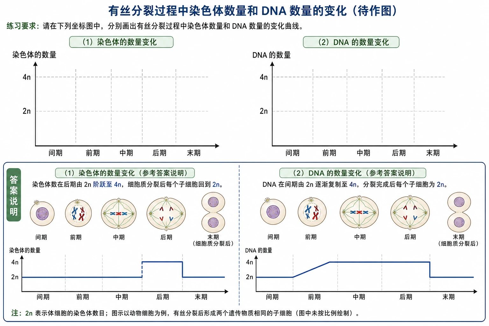
<!-- 图片描述：教材练习依赖图“染色体数量和DNA数量坐标”源图组重绘——“有丝分裂数量变化待作图”。并排保留两张空白训练坐标：横轴均依次标间期、前期、中期、后期、末期；左图纵轴“染色体的数量”，刻度2n、4n，右图纵轴“DNA的数量”，刻度2n、4n。源图重绘不预先画答案曲线，以保持作图训练；图下另设答案说明框但与题图分区：染色体数在后期由2n阶跃至4n、细胞质分裂后每个子细胞回到2n；DNA在间期由2n逐渐复制至4n，分裂完成后每个子细胞为2n。 -->

#### 动物与植物细胞比较

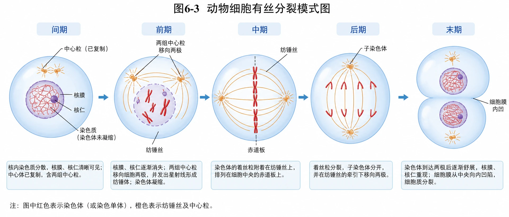
<!-- 图片描述：教材图6-3源图重绘——“动物细胞有丝分裂模式图”。按间期、前期、中期、后期、末期五格连续排列圆形蓝色动物细胞：间期核内染色质分散且中心体已复制；前期两组中心粒移向两极并发出星射线形成纺锤体；中期染色体排列在赤道板；后期子染色体移向两极；末期核膜核仁重现且细胞膜从中央向内凹陷。保留原教材红色染色体、橙色纺锤丝和中心粒标签，不添加植物细胞板。 -->

共同点是染色体复制与行为规律相同。不同点：高等植物细胞通常由两极发出纺锤丝，动物细胞由中心体周围星射线形成纺锤体；植物末期形成细胞板并扩展为新细胞壁，动物细胞膜向内凹陷缢裂。

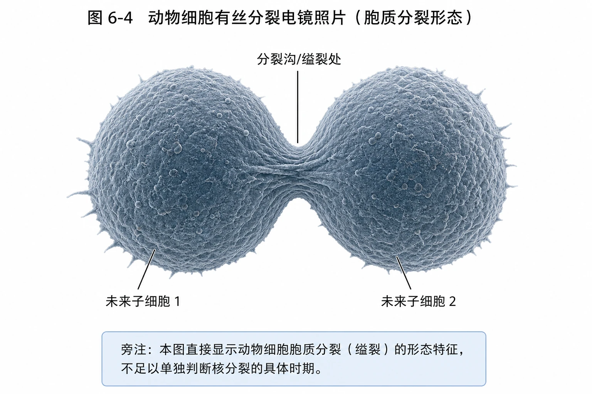
<!-- 图片描述：教材图6-4源图重绘——“动物细胞有丝分裂电镜照片”。忠实重绘红褐背景下一个正在从中部缢裂的动物细胞，两个近球形细胞部分仍以狭窄胞质桥相连，保留灰蓝伪彩表面和真实扫描电镜质感；只标“分裂沟/缢裂处”和两个未来子细胞，不在表面照片中补画内部染色体、中心体或核结构。旁注该图直接显示胞质分裂形态，不足以单独判断核分裂具体时期。 -->

有丝分裂的重要意义是将复制后的染色体精确、平均分配到两个子细胞，使亲代与子代细胞之间保持遗传稳定性。正常分裂受精确调控；遗传物质改变并使分裂失控可形成癌细胞。

#### 无丝分裂

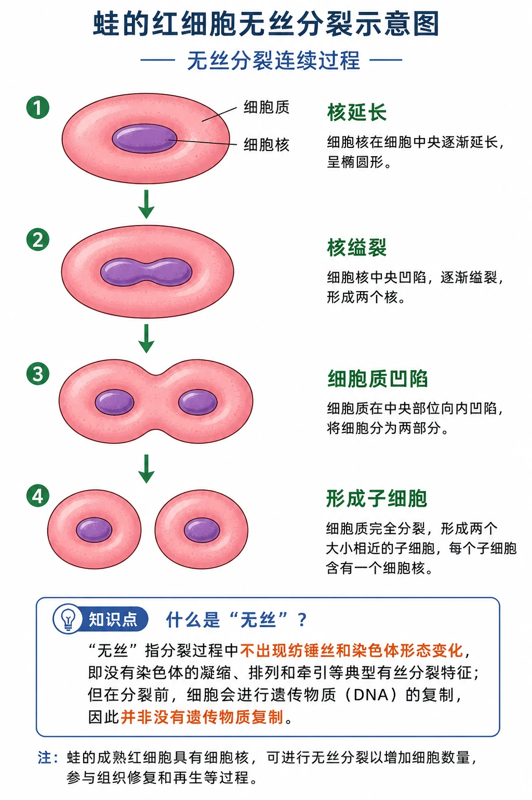
<!-- 图片描述：教材“蛙的红细胞无丝分裂示意图”源图重绘——“无丝分裂连续过程”。纵向四步画红色椭圆蛙红细胞：细胞核先延长，核中央凹陷并缢裂为两个核，随后细胞质中部凹陷，最终形成两个子细胞。保留原图无纺锤丝、无凝缩染色体的特点，用箭头标时序；注明“无丝”指分裂过程中不出现纺锤丝和染色体形态变化，并非没有遗传物质复制。 -->

### 四、典型模型与分析方法

#### 细胞不能无限长大

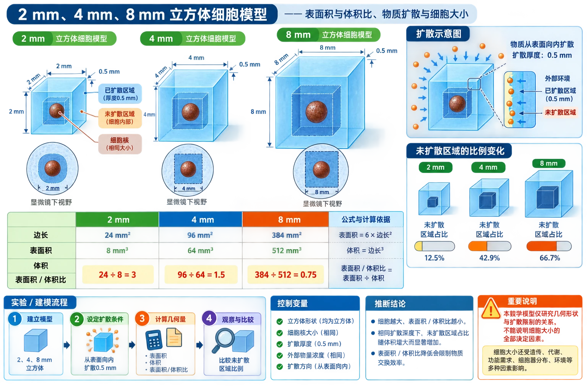
<!-- 图片描述：教材思维训练源图组重绘——“2 mm、4 mm、8 mm立方体细胞模型”。并列三个透明蓝色立方体，边长分别2 mm、4 mm、8 mm，中央各有相同视觉风格的棕色细胞核模型；每个立方体下保留表面积、体积和表面积/体积比的待填栏，答案区给出24/8=3、96/64=1.5、384/512=0.75。另用半透明外层表示物质从表面向内扩散0.5 mm，内层未扩散区域随立方体增大而比例增加；明确数学模型只研究几何与扩散限制，不能说明细胞大小的全部决定因素。 -->

立方体边长为$a$时，表面积/体积比$=6a^2/a^3=6/a$，细胞越大比值越小，单位体积拥有的交换表面越少，物质运输效率相对下降。细胞也不能无限小，因为需容纳DNA、核糖体、酶和其他基本结构。

### 五、图表、实验与证据链

#### 观察根尖分生区组织细胞的有丝分裂

实验材料选根尖分生区，因为细胞呈近正方形、排列紧密且分裂旺盛。染色体易被甲紫或醋酸洋红等碱性染料着色。

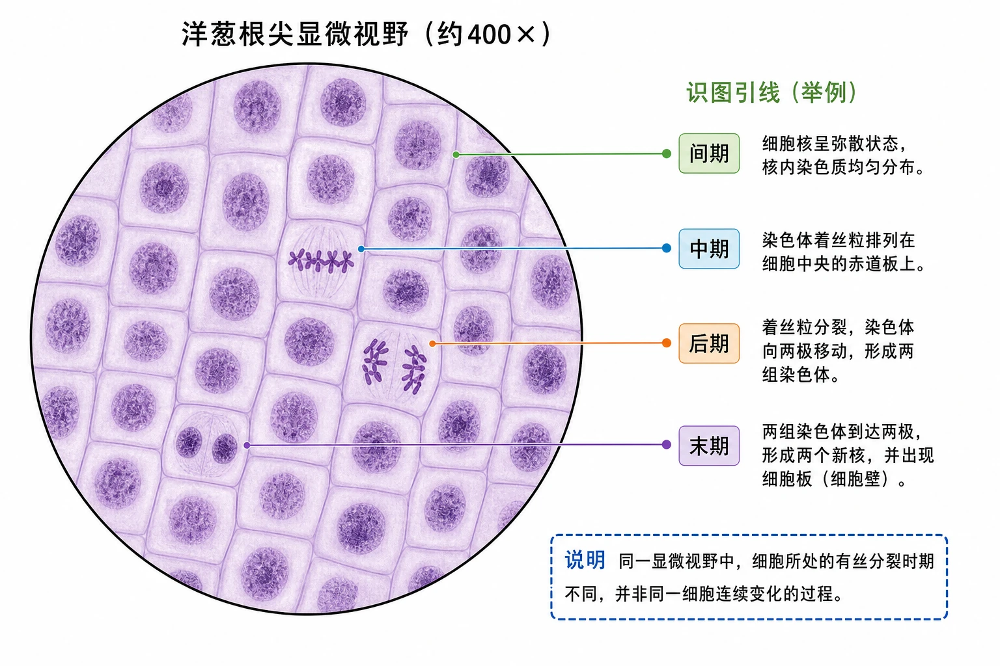
<!-- 图片描述：教材“观察根尖分生区组织细胞的有丝分裂”源图重绘——“洋葱根尖显微视野”。忠实重绘浅紫背景下约十余个根尖分生区细胞，细胞轮廓清楚，分别可见间期弥散核、中期染色体集中排列、后期两组染色体分离和末期两个新核等不同分裂相；保持真实视野中各时期随机分布和间期细胞较多，不按时序排列，也不在每个细胞内补画模式结构。旁边设置识图引线，只标能辨认的典型细胞，并说明同一视野不是同一细胞连续变化。 -->

制片流程：**解离→漂洗→染色→制片**。解离用盐酸与酒精混合液使组织细胞相互分离，同时细胞已死亡并停留在当时状态；漂洗约10 min洗去药液、防止解离过度；染色3—5 min使染色体着色；制片时弄碎根尖并轻压盖玻片使细胞分散。

观察先低倍找分生区，再高倍先找中期，随后辨认其他时期。统计不同视野各时期细胞数并求比例，可估计各时期相对持续时间：处于某时期的细胞比例越高，说明该时期相对越长，前提是样本足够且细胞群不同步。

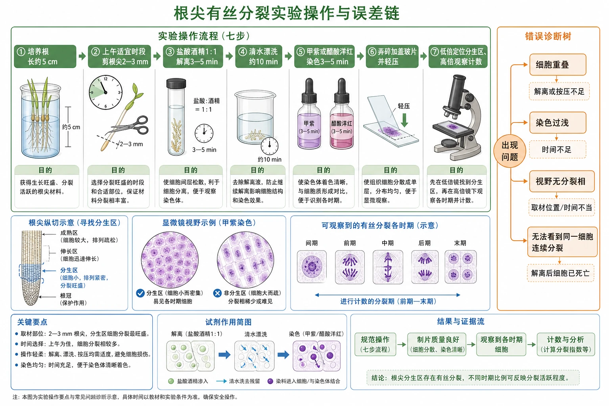
<!-- 图片描述：补充知识图（非教材原图）——“根尖有丝分裂实验操作与误差链”。横向七步流程：培养根长约5 cm→上午适宜时段剪根尖2—3 mm→盐酸酒精1:1解离3—5 min→清水漂洗约10 min→甲紫或醋酸洋红染色3—5 min→弄碎加盖玻片并轻压→低倍定位分生区、高倍观察计数。每步下方分别写目的；右侧错误诊断树连接“细胞重叠—解离或按压不足”“染色过浅—时间不足”“视野无分裂相—取材位置/时间不当”“无法看到同一细胞连续分裂—解离后细胞已死亡”。 -->

### 六、题型应用与迁移

细胞周期数轴题必须从一次“分裂完成”到下一次“分裂完成”；若连续分裂数据中分裂期为0—2 h、19.3—21.3 h，则周期约19.3 h，分裂期2 h，间期约17.3 h。

## 重点梳理

- 细胞周期=分裂间期+分裂期，间期通常占90%—95%。
- DNA复制发生在间期；着丝粒分裂发生在后期。
- 中期最适合观察染色体形态和数目。
- 植物形成细胞板，动物形成分裂沟。
- 实验制片顺序：解离、漂洗、染色、制片。

## 难点突破

### 1. 赤道板不是结构

赤道板是与纺锤体中轴垂直的假想平面；细胞板是植物末期真实形成并发展为新细胞壁的结构。

### 2. 染色体复制后数目为什么不加倍

复制形成两条姐妹染色单体，仍由一个着丝粒连接，按一个着丝粒计一条染色体；后期着丝粒分裂后才暂时加倍。

### 3. 显微镜下为何看不到同一细胞连续分裂

解离、染色过程使细胞死亡，观察的是不同细胞固定在不同时期的静态图像，再据此重建动态过程。

## 例题讲解

### 例题：判断有丝分裂时期

**题目**：某植物细胞中姐妹染色单体已分开并分别移向两极，此时染色体和DNA数量如何变化？

**分析**：姐妹染色单体分开说明进入后期，着丝粒已分裂；每条染色单体成为独立染色体，故一个细胞中染色体数加倍，DNA未再次复制。

**答案**：处于后期；染色体数暂时由$2n$变为$4n$，核DNA相对量仍为$4n$，染色单体数为0。

## 易错点整理

1. 把分裂间期当成无活动的休息期。
2. 从DNA复制开始计算细胞周期。
3. 把着丝粒排列在细胞板上。
4. 认为后期DNA数量也随染色体数加倍。
5. 认为高等植物有中心体或动物末期形成细胞板。
6. 统计一个小视野便直接代表各时期真实时长。

## 考点考证点整理

### 考点一：时期识图

- 出题思路：显微照片或模式图判断时期、排序和说明依据。
- 关键条件：染色体形态、着丝粒位置、两极分离、核膜和细胞板。
- 解答要点：先写时期，再写图中直接证据。
- 易扣分点：只背口诀，不对应图像特征。

### 考点二：数量曲线

- 出题思路：DNA、染色体和染色单体曲线或比例。
- 关键条件：DNA复制与着丝粒分裂两个节点。
- 解答要点：明确统计范围是一个细胞还是每个子细胞。
- 易扣分点：把后期染色体加倍解释为DNA复制。

### 考点三：根尖实验

- 出题思路：步骤排序、试剂作用、异常分析、时期时长估计。
- 关键条件：分生区、解离后死亡、随机抽样、多视野统计。
- 解答要点：写清操作—目的—现象—推理。
- 易扣分点：漂洗与染色颠倒；认为能跟踪同一细胞。

## 练习题

1. 教材概念检测：洋葱根尖有16条染色体，中期和后期染色体数分别是多少？
2. 教材概念检测：间期、前期、中期、后期、末期中，DNA、染色体、染色单体之比为$2:1:2$的是哪些时期？
3. 教材拓展：用边长2、4、8 mm立方体说明细胞不能无限长大。
4. 实验中为什么先漂洗再染色？
5. 为什么观察结果中间期细胞通常最多？
6. 比较动植物细胞有丝分裂的两个主要差异。

## 练习题答案

1. 中期16条，后期32条；后期着丝粒分裂使染色体数暂时加倍。
2. 前期和中期。此时DNA已复制，染色体数未变，每条染色体含两条姐妹染色单体。
3. 三者表面积/体积比分别为3、1.5、0.75，随边长增大而下降；单位体积相对交换面积减少，固定时间内物质扩散覆盖的体积比例也降低。
4. 漂洗去除盐酸酒精，防止解离过度并避免解离液影响后续染色。
5. 间期占细胞周期时间最长；在异步分裂细胞群中，随机时刻处于某时期的比例近似反映该时期相对时长。
6. 高等植物从两极发出纺锤丝并形成细胞板；动物由中心体周围星射线形成纺锤体，细胞膜中部内陷缢裂。
