# 6.3 细胞的衰老和死亡

## 知识关系导航

- 所属章节：[[章首 学习导图|细胞的生命历程]]
- 更新来源：[[6.1 细胞的增殖|细胞增殖]]可补充衰老和死亡的细胞。
- 功能背景：[[6.2 细胞的分化|不同分化细胞]]寿命和分裂能力不同。
- 科研拓展：[[章末 生物科技进展 秀丽隐杆线虫与细胞凋亡研究|凋亡基因研究]]。

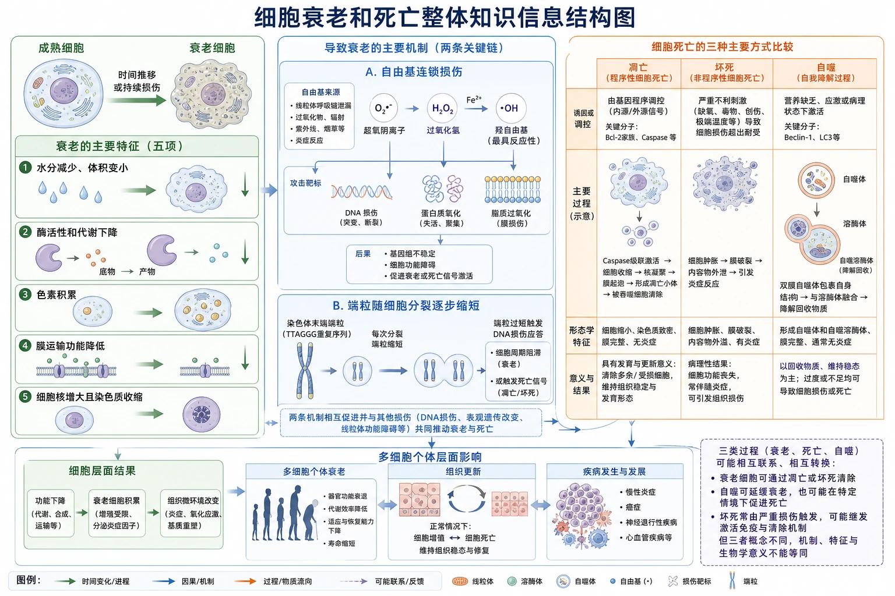
<!-- 图片描述：补充知识图（非教材原图）——“细胞衰老和死亡整体知识信息结构图”。左侧由成熟细胞进入衰老，分出五项特征：水分减少、体积变小，酶活性和代谢下降，色素积累，膜运输功能降低，细胞核增大且染色质收缩；中部两条机制链为自由基连锁损伤和端粒随分裂缩短；右侧用三栏比较凋亡、坏死、自噬：凋亡由基因程序调控并有发育更新意义，坏死由严重不利刺激造成损伤，自噬通过溶酶体降解自身结构以回收物质并维持稳态。底部连接多细胞个体衰老、组织更新和疾病，注明三类过程可能相互联系但概念不能等同。 -->

## 本节学习目标

1. 概括衰老细胞的形态、结构和功能特征。
2. 解释自由基学说和端粒学说的基本因果链。
3. 区分单细胞与多细胞生物中细胞衰老和个体衰老的关系。
4. 根据胚胎发育材料说明细胞凋亡含义和意义。
5. 比较细胞凋亡、坏死与自噬，并分析数据材料。

## 核心知识点讲解

### 一、知识对象与生命情境

老年人白发增多的直接原因是毛囊相关细胞合成黑色素功能下降，涉及酪氨酸酶活性降低；老年斑与细胞内色素积累有关。外貌变化是细胞衰老影响个体的表现，但不能仅凭外貌判断所有细胞状态。

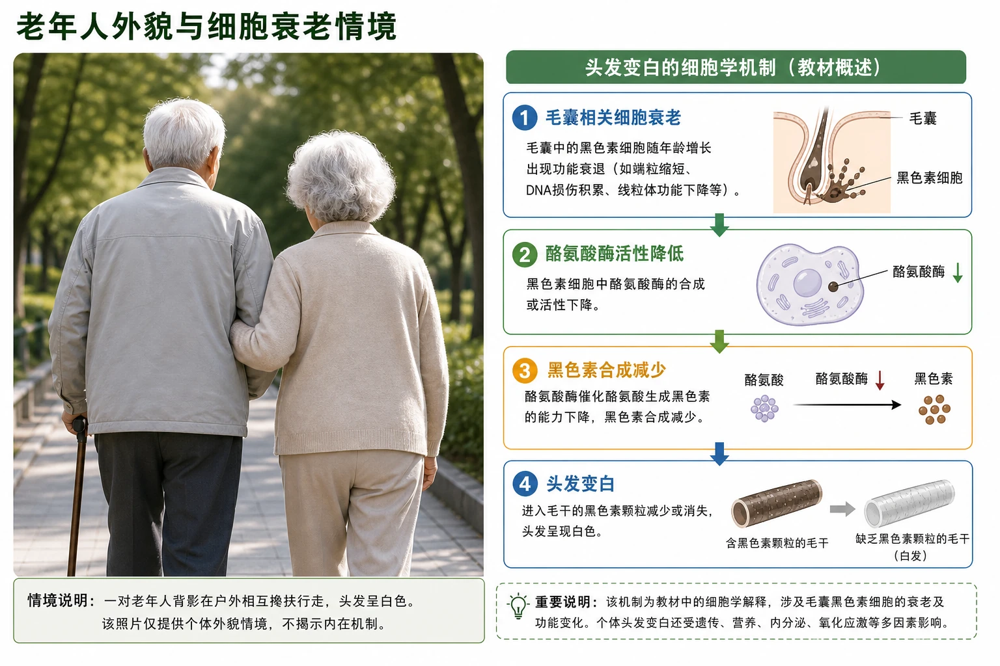
<!-- 图片描述：教材“满头白发的老人”源图重绘——“老年人外貌与细胞衰老情境”。忠实重绘一对老年人背影在户外相互搀扶行走的照片构图，突出白发但不夸张皱纹或疾病特征；旁设独立解释框“毛囊相关细胞衰老→酪氨酸酶活性降低→黑色素合成减少→头发变白”，明确照片只提供个体外貌情境，机制来自教材文字。 -->

### 二、核心概念与结构功能

衰老是细胞生理状态和化学反应发生复杂变化，最终表现为形态、结构和功能改变的过程。

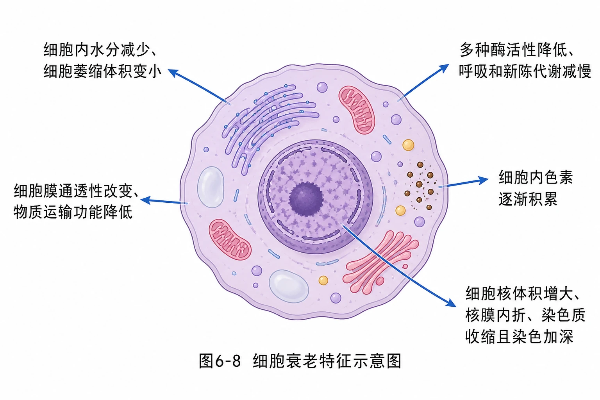
<!-- 图片描述：教材图6-8源图重绘——“细胞衰老特征示意图”。中央忠实重绘粉紫色动物细胞剖面模式图，周围五个箭头分别指向教材原有特征文字：细胞内水分减少、细胞萎缩体积变小；多种酶活性降低、呼吸和新陈代谢减慢；细胞内色素逐渐积累；细胞膜通透性改变、物质运输功能降低；细胞核体积增大、核膜内折、染色质收缩且染色加深。源图主体不添加自由基或端粒机制；机制另在后文补充图表现。 -->

衰老特征是总体规律，不是每个衰老细胞都以相同程度同时表现所有特征。“不能继续分化”不是教材列出的典型衰老特征。

### 三、关键过程、规律与调控机制

#### 自由基学说

自由基是具有不成对电子、反应活泼的原子或基团，可由细胞氧化反应、辐射和有害物质刺激产生。自由基攻击磷脂后形成的新自由基继续攻击其他分子，产生连锁反应；还可损伤DNA并使蛋白质活性下降。

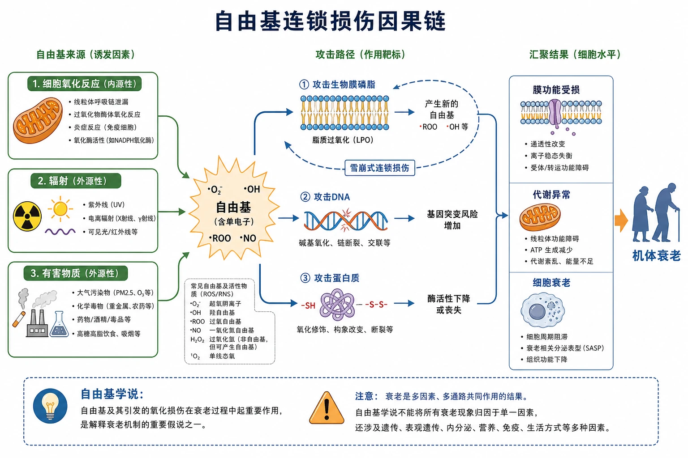
<!-- 图片描述：补充知识图（非教材原图）——“自由基连锁损伤因果链”。左侧列细胞氧化反应、辐射、有害物质三类来源，箭头指向带单电子标记的自由基；中部三条攻击路径分别指向生物膜磷脂、DNA和蛋白质，磷脂路径形成新的自由基并以循环箭头表示雪崩式连锁损伤，DNA路径标基因突变风险，蛋白质路径标酶活性下降；右侧汇聚为膜功能受损、代谢异常和细胞衰老。用虚线边界注明自由基学说是解释衰老机制的重要假说之一，不能把所有衰老现象归因于单一因素。 -->

#### 端粒学说

端粒是染色体两端的特殊DNA—蛋白质复合体。体细胞多次分裂后端粒DNA逐渐缩短；当缩短影响端粒内侧正常基因序列或触发损伤反应时，细胞活动异常并趋向衰老。

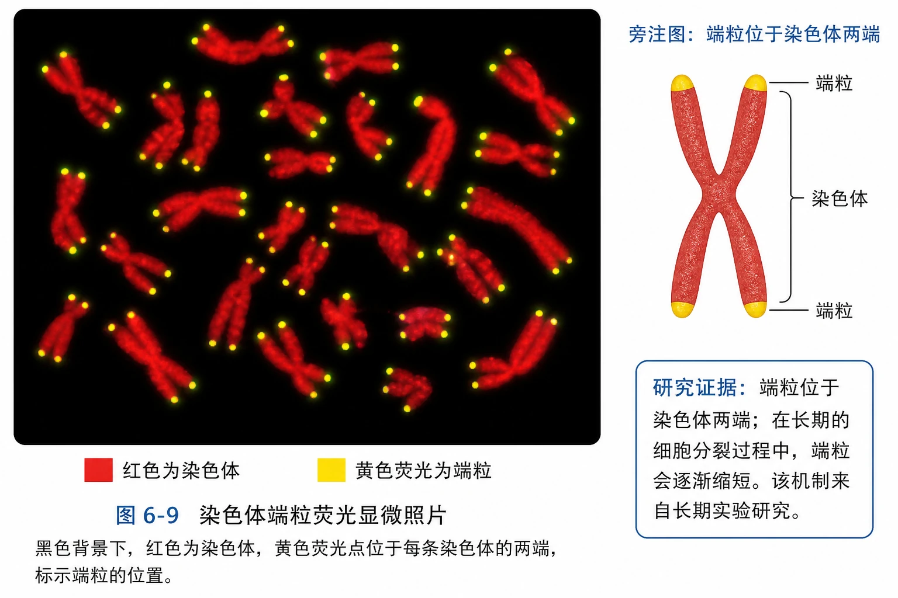
<!-- 图片描述：教材图6-9源图重绘——“染色体端粒荧光显微照片”。忠实重绘黑色背景下多条红色棒状或弯曲染色体，染色体两端以黄色或黄绿色荧光点标出端粒；保留“红色为染色体、黄色荧光为端粒”的颜色图例，不把照片改成端粒缩短时间轴，也不在显微图内标每条染色体的基因。旁注图直接显示端粒位于染色体两端，分裂缩短机制来自长期实验研究。 -->

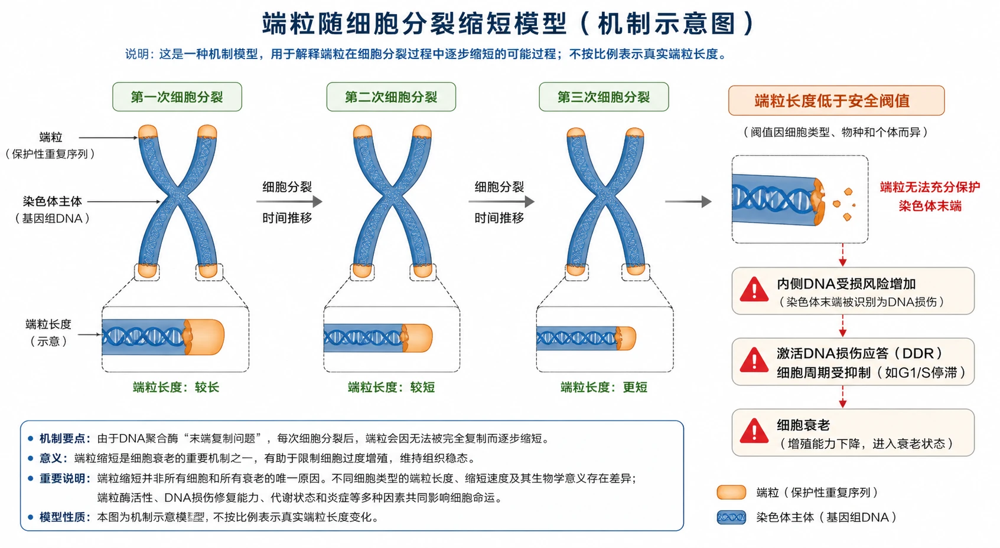
<!-- 图片描述：补充知识图（非教材原图）——“端粒随细胞分裂缩短模型”。横向排列同一染色体三次细胞分裂后的模式图，染色体主体长度保持示意一致，两端橙色端粒区域逐次缩短；当端粒低于安全阈值时，以警示线连接“内侧DNA受损风险→细胞周期受抑→细胞衰老”。明确这是一种机制模型，不按比例表示真实端粒长度，也不把端粒缩短说成所有细胞和所有衰老的唯一原因。 -->

#### 细胞衰老与个体衰老

单细胞生物中，细胞衰老或死亡就是个体衰老或死亡。多细胞生物中二者不等同：任何年龄都有新生和衰老细胞；个体衰老总体体现为许多细胞和组织普遍衰老、功能下降。

年龄实验中，胎儿、中年人、老年人肺成纤维细胞在相同条件下可增殖约50、20、2—4代，支持供体年龄越大、细胞继续分裂能力总体越低。核质融合实验中，年轻细胞质+老年细胞核不分裂，老年细胞质+年轻细胞核分裂旺盛，支持细胞核对分裂能力影响更大，但不能据此断言细胞质完全没有作用。

#### 细胞凋亡

细胞凋亡是由基因决定的细胞自动结束生命的过程，受严格程序性调控。它可塑造器官、实现自然更新、清除被病原体感染的细胞，并维持内部环境稳定。

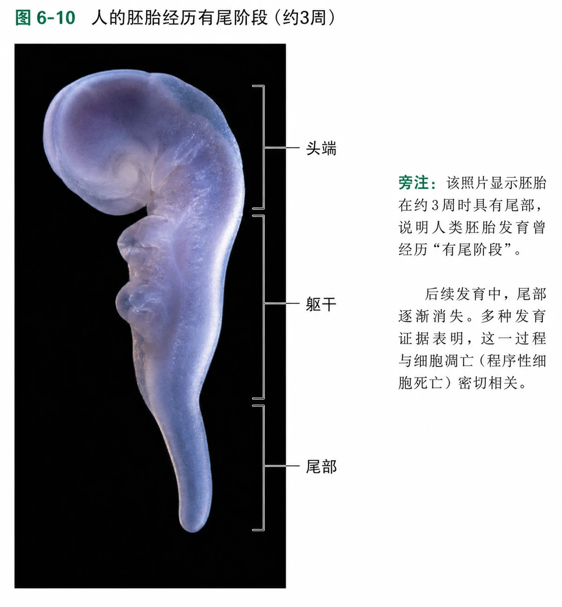
<!-- 图片描述：教材图6-10源图重绘——“人的胚胎经历有尾阶段”。忠实重绘黑色背景中的3周人胚胎侧面照片，胚体弯曲、头端较大、尾部向下延伸，保留半透明淡蓝紫组织和原始真实形态；只标“头端、躯干、尾部”三个可辨认区域，不补画内部器官。旁注该照片显示胚胎曾有尾这一发育事实，尾部后来消失与细胞凋亡的关系来自发育证据。 -->

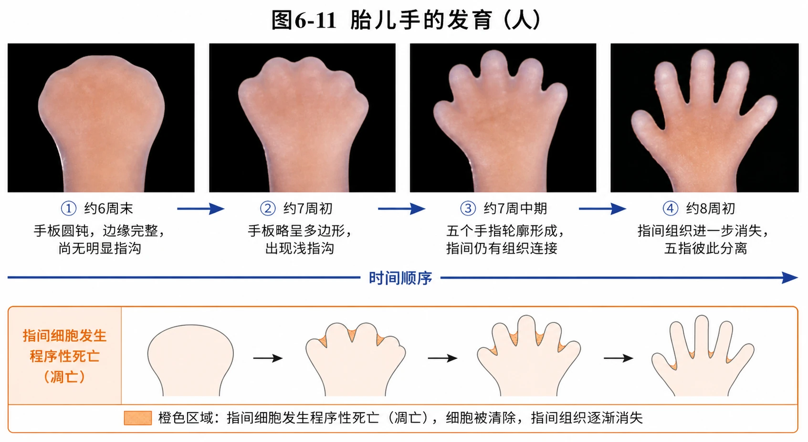
<!-- 图片描述：教材图6-11源图组重绘——“胎儿手的发育”。横向四幅连续真实照片：第一幅圆钝手板边缘完整、尚无明显指沟；第二幅手板略呈多边形并出现浅指沟；第三幅五个手指轮廓形成但指间仍有组织连接；第四幅指间组织进一步消失，五指彼此分离。保留教材肉色组织、黑色背景和相同观察方向，箭头标时间顺序；教学解释置于图外，以橙色区域示意“指间细胞发生程序性死亡”，不得在源照片内画坏死破裂或炎症。 -->

#### 凋亡、坏死与自噬

| 过程 | 触发与调控 | 主要结果 | 生物学意义 |
|---|---|---|---|
| 凋亡 | 基因决定、程序性调控 | 细胞有序主动死亡 | 发育、更新、清除异常或感染细胞 |
| 坏死 | 极端物理化学因素或严重病理刺激 | 代谢受损中断、细胞损伤死亡 | 多为不利病理过程 |
| 自噬 | 营养缺乏、损伤、感染或衰老等条件 | 溶酶体降解自身结构并再利用 | 回收物质、清除受损结构、维持稳态 |

自噬通常是细胞维持生存和稳态的机制，但过强自噬可能诱导凋亡；三者存在联系但不能互称同义词。

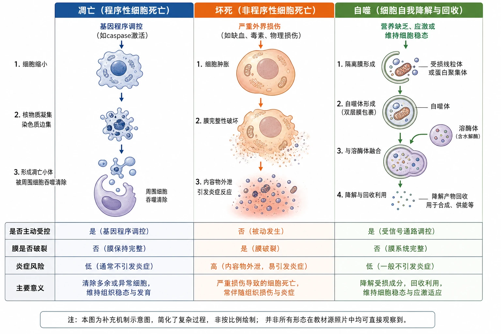
<!-- 图片描述：补充知识图（非教材原图）——“凋亡、坏死和自噬对比机制图”。三栏并排：凋亡栏画细胞缩小、核物质凝集并形成被周围细胞清除的小体，箭头标基因程序调控；坏死栏画细胞肿胀、膜完整性破坏和内容物外泄，箭头标严重外界损伤；自噬栏画双层膜包裹受损线粒体形成自噬体，与溶酶体融合后降解回收。底部按“是否主动受控、膜是否破裂、炎症风险、主要意义”形成对比矩阵，并注明图为补充机制示意，不代表所有形态在教材源照片中可见。 -->

### 四、典型模型与分析方法

#### 寿命和分裂能力数据

教材表显示小肠上皮细胞寿命1—2 d且能分裂，白细胞寿命5—7 d但不能分裂；心肌和多数神经细胞寿命很长却不能分裂。因此寿命长短与分裂能力没有简单一一对应关系，而与细胞功能和组织更新方式有关。

### 五、图表、实验与证据链

判断凋亡不能只看“细胞消失”，还要有程序性、特定时间和位置、基因调控或规则形态变化等证据；严重损伤、代谢中断和不规则组织破坏更支持坏死。

章末鸡爪—鸭掌移植实验中，移植的预定肢体细胞决定最终形成蹼或无蹼，说明趾间细胞的凋亡具有物种特异的遗传程序，且对形成适应相应功能的肢体结构很重要。

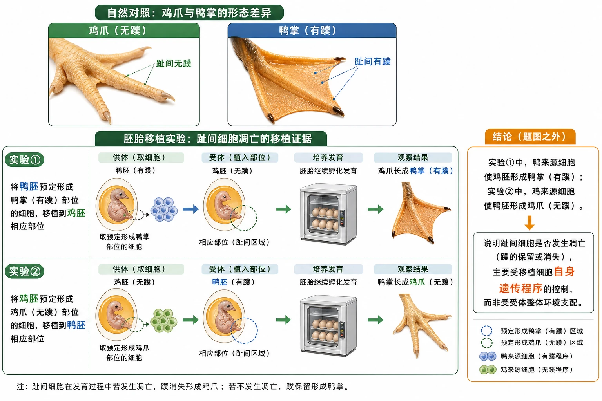
<!-- 图片描述：教材复习题“鸡爪与鸭掌胚胎移植实验”源图组重绘——“趾间细胞凋亡的移植证据”。上排并列真实鸡爪与鸭掌照片，鸡爪趾间无蹼、鸭掌趾间有蹼；下排保留两个实验流程且不提前写机制答案：实验①将鸭胚预定形成鸭掌部分细胞移植到鸡胚相应部位，结果鸡爪长成鸭掌；实验②将鸡胚预定形成鸡爪部分细胞移植到鸭胚相应部位，结果鸭掌长成鸡爪。用箭头清楚区分供体与受体，结论区放在题图之外，说明蹼的保留或消失主要受移植细胞自身遗传程序控制。 -->

### 六、题型应用与迁移

病理科医师通过显微镜观察病变组织切片或涂片中的细胞形态结构，并结合临床资料作病理诊断。其工作体现细胞形态变化具有诊断价值，但单张教材图不能替代完整病理诊断。

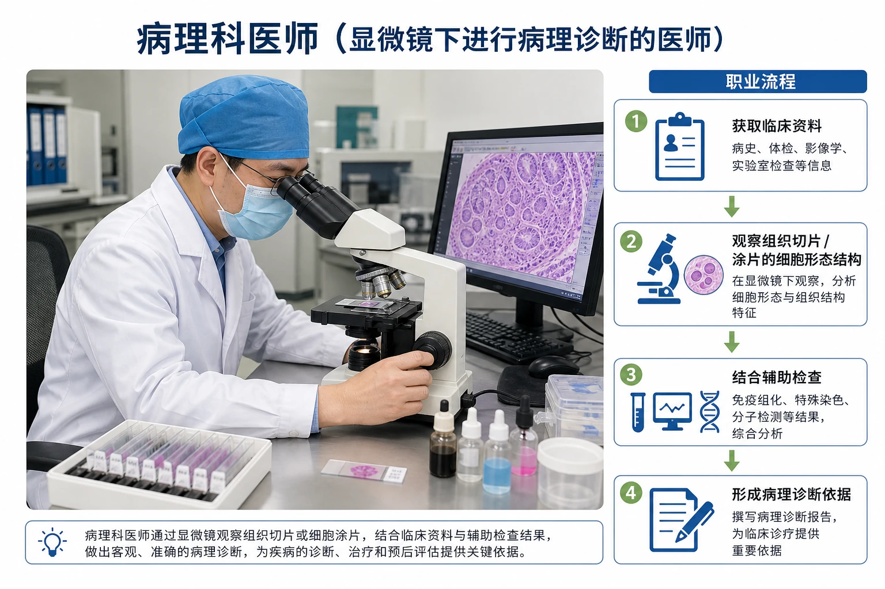
<!-- 图片描述：教材“病理科医师”源图重绘——“显微镜下进行病理诊断的医师”。忠实重绘实验室中穿白大褂、戴蓝色手术帽和口罩的病理科医师坐在光学显微镜前观察组织切片，右手调节载物台或调焦旋钮，桌面保留必要玻片与试剂容器但不突出品牌；照片外设置职业流程小栏“获取临床资料→观察组织切片/涂片的细胞形态结构→结合辅助检查→形成病理诊断依据”。明确照片呈现职业工作情境，不能从画面判断具体患者病情。 -->

## 重点梳理

- 衰老表现为水分、酶活性、代谢、色素、膜运输和细胞核等多方面变化。
- 自由基可造成连锁分子损伤；端粒随分裂缩短与衰老相关。
- 多细胞个体中细胞衰老不等于个体衰老，但普遍细胞衰老推动个体衰老。
- 凋亡由基因程序决定，坏死由不利刺激造成损伤。
- 自噬可回收物质、清除受损结构并维持稳态。

## 难点突破

### 1. 凋亡是否永远“有利”

正常时间、位置和数量的凋亡通常有利；凋亡不足或过度也可能与疾病有关。教材判断题中的“有利”指正常生理性凋亡。

### 2. 年龄实验能否证明核是唯一因素

不能。互换实验显示年轻核更能维持分裂，支持核影响更大；实验没有证明细胞质和培养环境毫无影响。

### 3. 细胞自噬是不是细胞吃掉自己后一定死亡

不是。适度自噬通常帮助细胞回收物质和清除受损结构，常有利于生存；激烈自噬才可能与凋亡联系。

## 例题讲解

### 例题：判断胚胎趾间细胞死亡方式

**题目**：胚胎发育中趾间细胞在固定时期和位置有序消失，并受特定基因控制，属于何种死亡？

**分析**：材料同时给出发育阶段、位置规律和基因控制，符合程序性死亡，不是外伤导致的坏死。

**答案**：细胞凋亡。其作用是清除趾间细胞、塑造彼此分离的手指或足趾，使器官正常发育。

## 易错点整理

1. “衰老个体内所有细胞都衰老”——错误。
2. “细胞核变小是衰老特征”——通常体积增大、核膜内折。
3. “端粒位于染色体中央”——位于两端。
4. “细胞凋亡就是坏死”——调控和意义不同。
5. “所有细胞死亡都不利”——正常凋亡有重要意义。
6. “寿命短的细胞一定能分裂”——白细胞是反例。

## 考点考证点整理

### 考点一：衰老特征与机制

- 出题思路：外貌、细胞图、端粒或自由基材料。
- 关键条件：观察特征与机制解释要区分。
- 解答要点：先写具体变化，再连到功能后果。
- 易扣分点：把学说写成唯一确定原因。

### 考点二：凋亡与坏死

- 出题思路：胚胎发育、感染细胞清除、损伤情境。
- 关键条件：基因程序、时间位置规律、不利刺激。
- 解答要点：判断类型并说明对个体的影响。
- 易扣分点：仅凭“细胞死亡”判断。

### 考点三：数据和移植证据

- 出题思路：年龄培养、核质互换、鸡鸭胚移植。
- 关键条件：对照关系、直接结果、结论边界。
- 解答要点：描述数据趋势，指出支持而非绝对证明。
- 易扣分点：忽略其他变量或过度外推。

## 练习题

1. 教材概念检测：衰老生物体中的细胞是否都处于衰老状态？
2. 端粒受损为何可能导致细胞衰老？
3. 细胞死亡是否等同于细胞凋亡？
4. 白细胞寿命短且不能分裂说明寿命与分裂能力有什么关系？
5. 年龄核质互换实验支持什么结论，不能推出什么结论？
6. 白细胞比红细胞凋亡快可能有何功能意义？

## 练习题答案

1. 否。多细胞个体内细胞不断更新，老年个体仍有幼嫩细胞，年轻个体也有衰老细胞。
2. 端粒保护染色体末端；反复分裂后端粒缩短，可能使内侧正常DNA受损或触发损伤反应，细胞活动异常并趋向衰老。
3. 不等同。细胞死亡包括凋亡、坏死等方式；凋亡只是主要方式之一。
4. 二者没有简单对应关系；细胞寿命和分裂能力与细胞类型、功能及组织更新方式有关。
5. 支持细胞核年龄状态对细胞分裂能力影响较大；不能推出细胞质完全无影响，也不能证明核是衰老的唯一决定因素。
6. 白细胞参与免疫，完成任务或状态改变后及时凋亡可调节细胞数量、避免不必要损伤并维持内环境稳定；凋亡速率与其功能和更新需求相适应。
