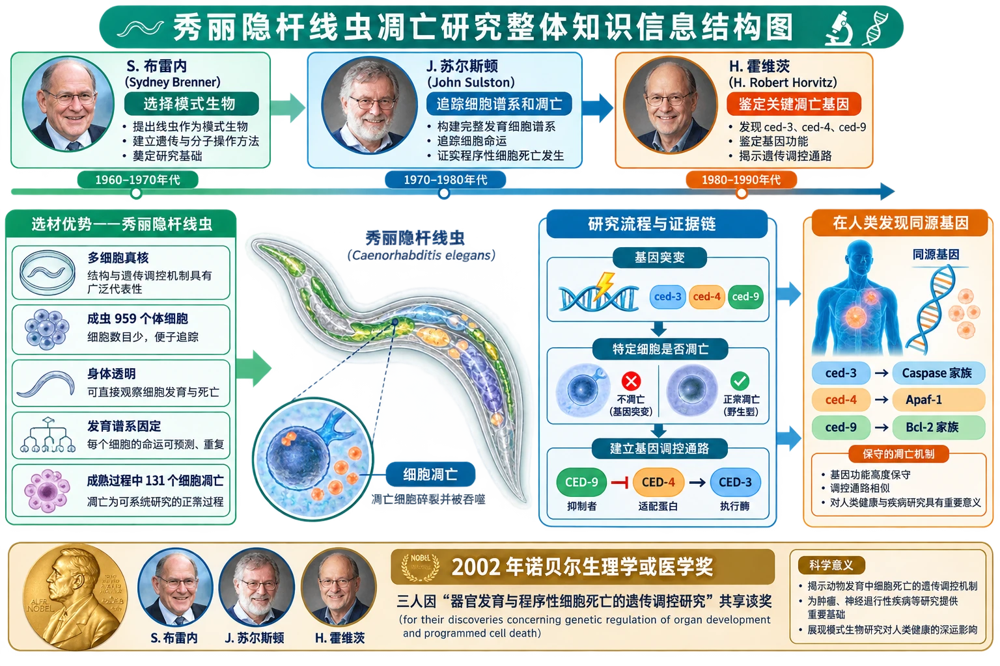
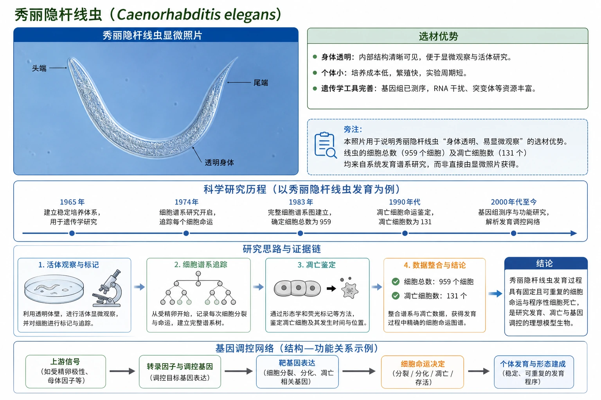

# 章末 生物科技进展 秀丽隐杆线虫与细胞凋亡研究

## 知识关系导航

- 所属章节：[[章首 学习导图|细胞的生命历程]]
- 前置知识：[[6.3 细胞的衰老和死亡#细胞凋亡|细胞凋亡]]。
- 过程联系：线虫研究把[[6.1 细胞的增殖|细胞分裂]]、[[6.2 细胞的分化|分化]]和器官发育联系起来。

<!-- 图片描述：补充知识图（非教材原图）——“秀丽隐杆线虫凋亡研究整体知识信息结构图”。中央为透明线虫，左侧列选材优势“多细胞真核、成虫959个体细胞、身体透明、发育谱系固定、成熟过程中131个细胞凋亡”；上方按科学家分工设置布雷内选择模式生物、苏尔斯顿追踪细胞谱系和凋亡、霍维茨鉴定关键凋亡基因；右侧箭头连接“基因突变→特定细胞是否凋亡→建立基因调控通路→在人类发现同源基因”。底部注明三人因器官发育与程序性细胞死亡的遗传调控研究分享2002年诺贝尔生理学或医学奖。 -->

## 本节学习目标

1. 说明秀丽隐杆线虫作为模式生物的优势。
2. 梳理三位科学家的主要贡献和证据链。
3. 解释模式生物研究为何可迁移到人体生命过程。
4. 理解科学选材、显微追踪和遗传分析的关系。

## 核心知识点讲解

### 一、知识对象与生命情境

秀丽隐杆线虫是多细胞真核生物，成虫只有959个体细胞，身体透明，易在显微镜下追踪整个发育过程。其成熟过程中有131个细胞按固定方式凋亡，适合研究程序性死亡。

<!-- 图片描述：教材“秀丽隐杆线虫”源图重绘——“秀丽隐杆线虫显微照片”。忠实重绘蓝色显微视野中一条细长透明、弯成近U形的线虫，头尾逐渐变细，体内可见纵向组织轮廓；仅标头端、尾端和透明身体，不在照片中添加959个细胞或凋亡位置。旁注照片支持“身体透明、易显微观察”的选材优势，细胞数和凋亡数来自系统发育谱系研究。 -->

### 二、核心概念与结构功能

模式生物是用来研究普遍生命规律的典型物种。好的模式生物应便于培养观察、结构或遗传背景相对清楚、生命周期合适，并能用实验操纵。

### 三、关键过程、规律与调控机制

- 悉尼·布雷内在20世纪60年代初选择线虫作为研究对象，使基因分析能与细胞分裂、分化和器官发育对应。
- 约翰·苏尔斯顿描述线虫发育过程中细胞分裂、分化和死亡的具体谱系，确认细胞凋亡有固定程序。
- 罗伯特·霍维茨发现控制细胞凋亡的关键基因及相互作用，并证实人体存在相应基因。

### 四、典型模型与分析方法

研究路径是：完整记录正常细胞谱系→筛选凋亡异常突变体→比较哪些细胞没有死亡或异常死亡→定位相关基因→分析基因相互关系→寻找其他动物中的同源基因。

### 五、图表、实验与证据链

线虫中131个细胞在特定位置和时间消失，说明凋亡有高度可重复的发育程序；基因突变改变这一程序，进一步支持凋亡由特定基因调控。人体存在相应基因，说明基本机制在进化中具有保守性。

### 六、题型应用与迁移

选择研究材料时，不是越简单越好：细菌缺少多细胞发育，哺乳动物过于复杂；线虫在“足够复杂”和“便于追踪”之间取得平衡。

## 重点梳理

- 线虫优势：透明、细胞少、谱系固定、多细胞真核。
- 正常谱系提供参照，突变体提供因果证据。
- 凋亡基因在人和线虫中具有对应，体现生物界统一性。
- 好的实验材料选择可显著推动科学问题解决。

## 难点突破

### 1. 观察细胞消失为何还需遗传分析

观察只能说明何时何地消失；突变相关基因后凋亡程序改变，才能把基因与过程建立更强因果联系。

### 2. 线虫结果能否直接等同人体

不能直接等同。相应基因保守说明基本机制可借鉴，但人体组织环境和调控网络更复杂，需要独立实验和临床验证。

## 例题讲解

### 例题：模式生物选择

**题目**：研究多细胞个体发育中的细胞凋亡，为何线虫通常优于细菌？

**分析**：细菌虽简单，但为原核单细胞生物，没有多细胞个体的组织和器官发育过程。

**答案**：线虫是结构较简单的多细胞真核生物，可观察固定细胞谱系和器官发育中的凋亡，同时便于遗传分析。

## 易错点整理

1. 把线虫说成单细胞或原核生物。
2. 认为成熟线虫的959个体细胞中还包含已凋亡的131个细胞。
3. 只凭透明外形就认定凋亡由基因控制。
4. 把模式生物结论未经验证直接用于人体治疗。

## 考点考证点整理

### 考点一：选材优势

- 出题思路：比较细菌、线虫和哺乳动物。
- 关键条件：研究问题涉及多细胞发育和遗传调控。
- 解答要点：多细胞真核、透明、细胞少、谱系清楚、便于遗传分析。
- 易扣分点：只答“个体小”。

### 考点二：科学证据链

- 出题思路：给正常与突变线虫的细胞谱系。
- 关键条件：固定凋亡位置、突变后变化、基因定位。
- 解答要点：观察建立规律，突变建立基因因果联系。
- 易扣分点：把相关性写成无条件证明。

## 练习题

1. 秀丽隐杆线虫作为凋亡研究材料有哪些优势？
2. 为什么要先建立正常细胞谱系？
3. 人体存在与线虫凋亡基因相应的基因说明什么？

## 练习题答案

1. 它是多细胞真核生物，成虫细胞少、身体透明、发育谱系固定且易显微追踪，既有组织发育又便于遗传分析。
2. 正常谱系是判断突变体哪些细胞未按程序死亡或异常死亡的对照，可定位凋亡发生的时间和位置。
3. 说明程序性细胞死亡的部分遗传机制在进化中保守，体现生物界统一性，也为人体研究提供线索，但仍需人体相关验证。
