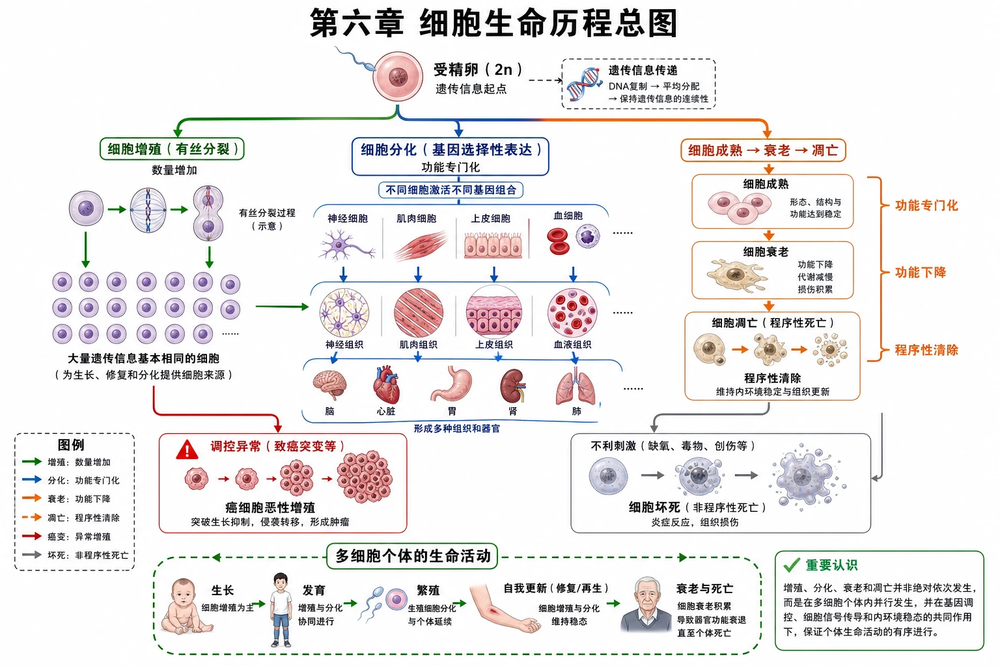

# 第六章 细胞的生命历程·学习导图

## 知识关系导航

- 起点：[[6.1 细胞的增殖|细胞增殖]]增加细胞数量并保持遗传信息稳定。
- 发展：[[6.2 细胞的分化|细胞分化]]使细胞形态、结构和功能专门化，形成组织和器官。
- 更新与终点：[[6.3 细胞的衰老和死亡|细胞衰老和死亡]]参与个体发育、组织更新和稳态维持。
- 科研案例：[[章末 生物科技进展 秀丽隐杆线虫与细胞凋亡研究|秀丽隐杆线虫与细胞凋亡研究]]。
- 综合复习：[[章末 整理与提升|章末整理与提升]]。

<!-- 图片描述：补充知识图（非教材原图）——“第六章细胞生命历程总图”。以受精卵为起点，左侧绿色箭头经过有丝分裂形成大量遗传信息基本相同的细胞，中央蓝色分支表示基因选择性表达驱动细胞分化并形成组织和器官，右侧橙色时间轴表示细胞成熟、衰老及凋亡；另以红色警示支路表示调控异常可导致癌细胞恶性增殖，以灰色支路区分不利刺激造成的细胞坏死。底部连接个体的生长、发育、繁殖、自我更新与死亡，明确增殖、分化、衰老和凋亡并非绝对依次发生，而是在多细胞个体内并行且受调控。白底高中教材式科学信息图，箭头标明“数量增加、功能专门化、功能下降、程序性清除”。 -->

## 本节学习目标

1. 建立细胞增殖、分化、衰老和死亡之间的因果与并行关系。
2. 说明细胞生命历程如何支持多细胞生物的生长、发育和更新。
3. 区分正常生命过程与增殖失控、坏死等异常过程。
4. 从显微图、过程图、实验和数据表中提取证据。

## 核心知识点讲解

### 一、知识对象与生命情境

多细胞个体从一个受精卵开始，通过增殖增加细胞数量，通过分化形成多种细胞；成熟组织中仍不断有细胞更新，部分细胞逐渐衰老或按程序凋亡。一个个细胞的历程共同构成个体生命活动。

### 二、核心概念与结构功能

| 过程 | 核心变化 | 主要意义 |
|---|---|---|
| 增殖 | DNA复制后平均分配，细胞数增加 | 生长、发育、繁殖、修复和遗传稳定 |
| 分化 | 基因选择性表达，形态结构功能稳定差异 | 形成组织器官，提高生理效率 |
| 衰老 | 生理状态及形态结构功能复杂变化 | 正常更新的一部分；普遍衰老关联个体衰老 |
| 凋亡 | 基因决定的程序性死亡 | 发育塑形、更新、清除异常细胞、维持稳态 |

### 三、关键过程、规律与调控机制

有丝分裂保证复制后的染色体平均分配；基因选择性表达使遗传信息相同的细胞走向不同功能；衰老和凋亡受多种内外因素影响。调控的时间、位置和程度决定这些过程是否有利于个体。

### 四、典型模型与分析方法

生命历程题先判断题目讨论的是“细胞数量、基因组成、基因表达、功能状态还是死亡方式”，再沿“材料事实→细胞过程→调控机制→个体意义”作答。

### 五、图表、实验与证据链

本章的主要证据包括：根尖细胞不同分裂相、组织细胞形态比较、植物组织培养、动物核移植、年龄与细胞增殖数据、胚胎发育中的选择性细胞死亡。

### 六、题型应用与迁移

医学中的肿瘤诊断、骨髓移植、干细胞治疗和衰老研究均以细胞生命历程为基础，但教材中的原理性结论不能直接替代临床判断。

## 重点梳理

- 增殖增加数量，分化增加类型。
- 分化通常不改变同一个体体细胞的基因组成，而改变基因表达。
- 植物细胞可表现全能性；已分化动物体细胞的细胞核具有全能性。
- 凋亡是主动受控过程，坏死是严重不利刺激导致的损伤性死亡。

## 难点突破

### 1. 各过程不是一条简单直线

组织中可同时存在分裂、分化、衰老和死亡的细胞。不同细胞寿命和分裂能力也不相同。

### 2. 个体衰老不等于所有细胞衰老

老年人体内仍有幼嫩细胞，年轻人体内也有衰老细胞；个体衰老体现为组成个体的细胞普遍衰老及组织功能整体下降。

## 例题讲解

### 例题：解释皮肤更新

**题目**：皮肤表层细胞不断脱落，但皮肤厚度通常相对稳定，涉及哪些细胞过程？

**分析**：生发层细胞分裂补充新细胞，新细胞分化成表皮细胞，老细胞衰老并死亡脱落，各过程保持动态平衡。

**答案**：细胞增殖、分化、衰老和死亡共同维持皮肤更新与结构稳定。

## 易错点整理

1. 把细胞分化写成遗传物质改变。
2. 把衰老个体中的所有细胞都视为衰老细胞。
3. 认为所有细胞死亡都属于凋亡。
4. 认为细胞越小或分裂越快一定越有利。

## 考点考证点整理

### 考点一：生命历程关系

- 出题思路：发育、更新、修复或疾病材料综合判断。
- 关键条件：数量、形态功能、基因表达、死亡原因。
- 解答要点：定位具体过程并写出个体意义。
- 易扣分点：只罗列名词，不写因果关系。

### 考点二：证据边界

- 出题思路：由培养、移植或显微观察推结论。
- 关键条件：直接观察对象、是否形成完整个体、是否只移植细胞核。
- 解答要点：结论强度与证据一致。
- 易扣分点：把“细胞核全能性”扩大为“整个动物体细胞已表现全能性”。

## 练习题

1. 受精卵发育成个体主要涉及哪些细胞生命过程？
2. 为什么细胞分化不会导致同一个体不同体细胞遗传信息完全不同？
3. 细胞凋亡为何既是细胞死亡又能有利于个体？

## 练习题答案

1. 通过细胞增殖增加数量，通过细胞分化形成不同组织器官，同时伴随必要的细胞凋亡塑造结构，成熟后还存在衰老、死亡与更新。
2. 同一个体不同体细胞通常来源于同一受精卵，有丝分裂保持遗传信息稳定；差异主要来自基因选择性表达。
3. 凋亡按遗传程序在适当时间和位置清除细胞，可塑造器官、维持更新和清除被感染或异常细胞，因此有利于整体。
