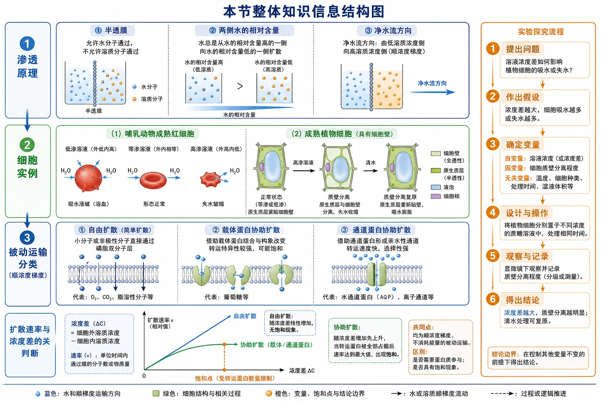
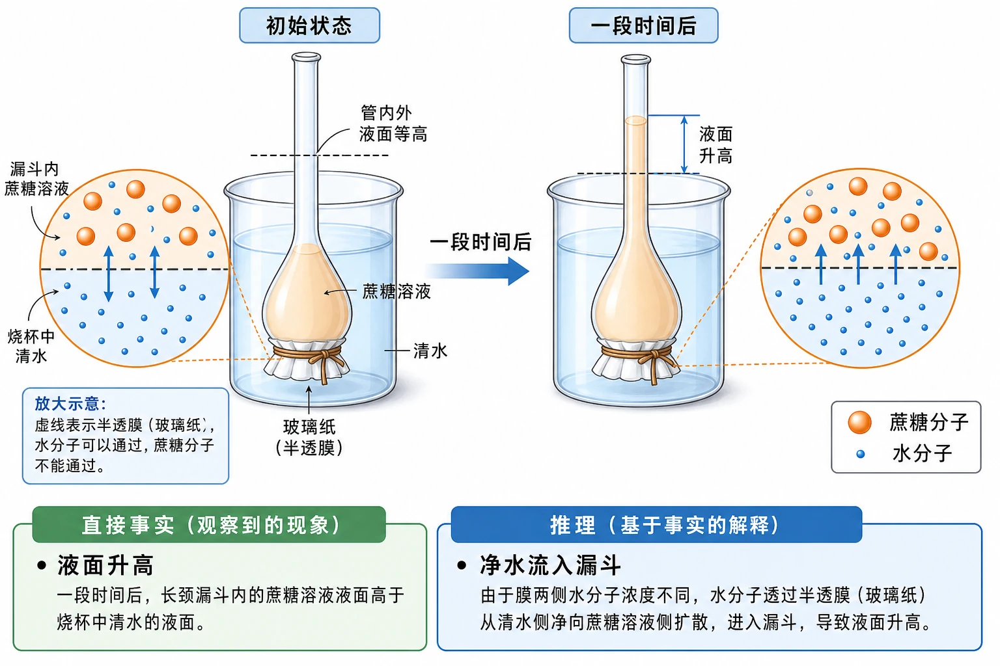
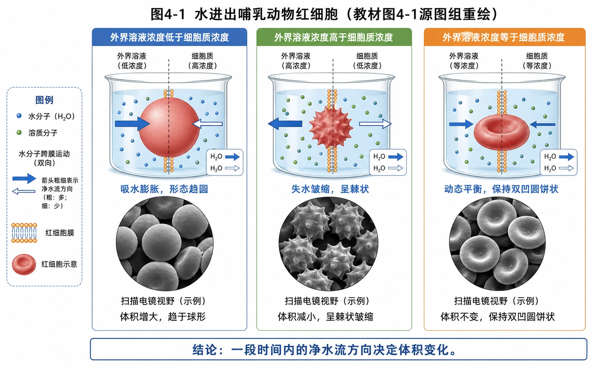
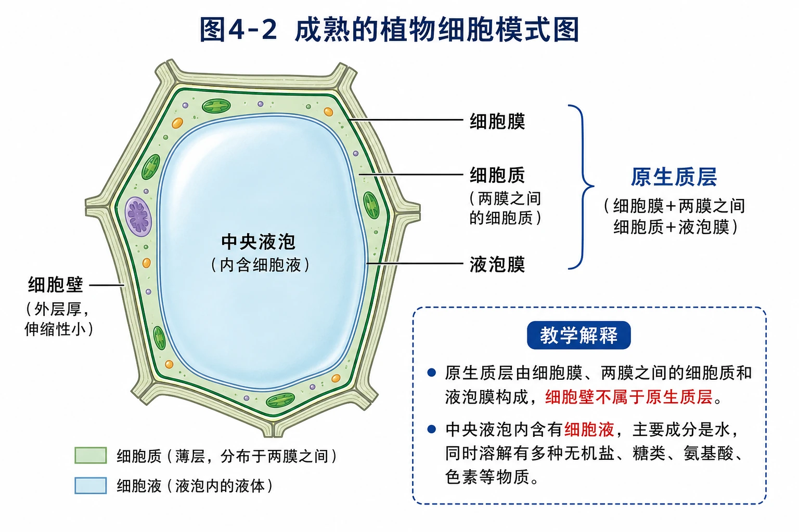
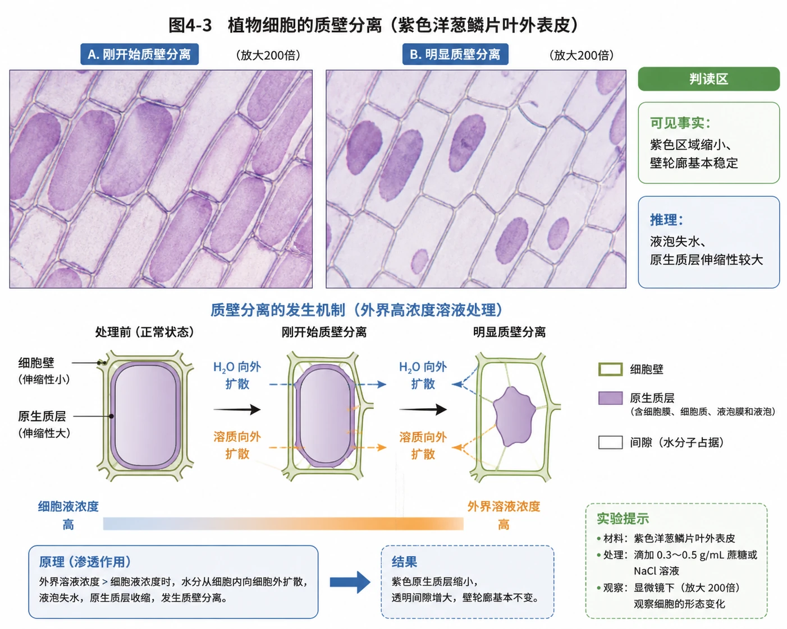
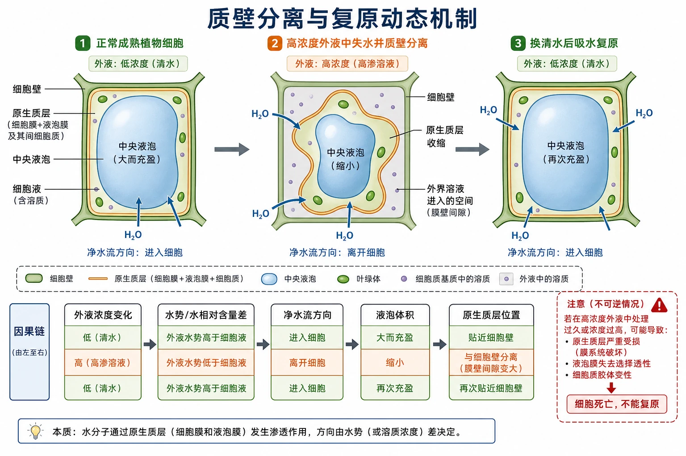
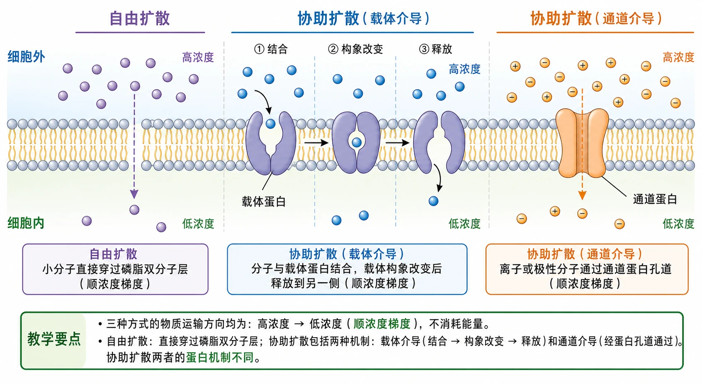
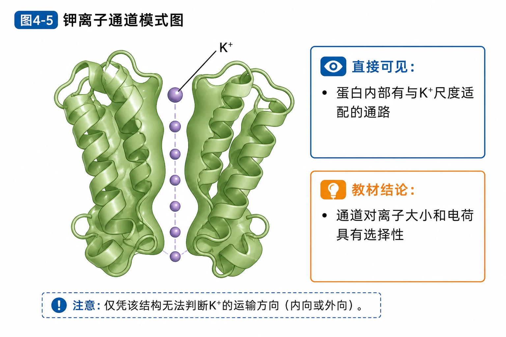
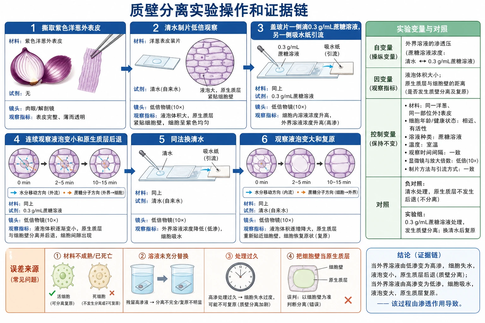
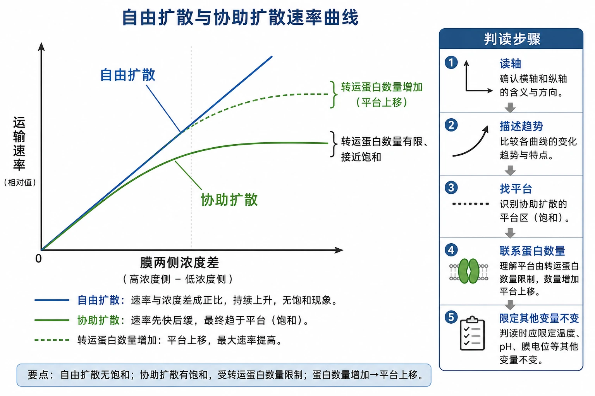

# 4.1 被动运输

## 知识关系导航

- 所属章节：[[章首 学习导图|细胞的物质输入和输出]]
- 科学史延伸：[[章末 生物科学史话 人类对通道蛋白的探索历程|通道蛋白的发现]]
- 对比运输：[[4.2 主动运输与胞吞、胞吐#主动运输|主动运输]]
- 综合训练：[[章末 整理与提升#运输方式判定树|运输方式判定]]

<!-- 图片描述：补充知识图（非教材原图）——“本节整体知识信息结构图”。主线分三层：渗透原理（半透膜、两侧水的相对含量、净水流方向）→细胞实例（红细胞吸水/失水、成熟植物细胞原生质层、质壁分离与复原）→被动运输分类（自由扩散、载体蛋白协助、通道蛋白协助）；右侧附实验探究流程“提出问题—假设—变量—操作—观察—结论”，底部附曲线判断“自由扩散速率随浓度差增加，协助扩散受转运蛋白数量限制”。颜色图例：蓝色为水和顺梯度运输，绿色为细胞结构，橙色为变量、饱和点与结论边界。 -->

## 本节学习目标

1. 准确说明渗透作用的两个条件和水分子净移动方向。
2. 根据外界溶液与细胞质/细胞液的相对浓度，判断动物、植物细胞吸水或失水。
3. 设计并分析洋葱鳞片叶外表皮质壁分离与复原实验。
4. 比较自由扩散、载体蛋白协助扩散和通道蛋白协助扩散。
5. 从图像、曲线和实验现象中区分直接事实、推理和结论边界。

## 核心知识点讲解

### 一、知识对象与生命情境

细胞是开放系统，物质交换必须经过细胞膜。被动运输的共同特征是物质顺浓度梯度运输，不需要消耗细胞内化学反应释放的能量。

#### 渗透装置：液面为什么升高

装置中玻璃纸允许水通过而不允许蔗糖通过。开始时漏斗内为蔗糖溶液、烧杯内为清水，水的相对含量在烧杯一侧较高，净水流进入漏斗，液面上升。液面不会无限升高：液柱形成的压力会逐渐抵抗渗透，当动态平衡建立时液面停止上升，但水分子仍在双向运动。

<!-- 图片描述：教材“问题探讨”源图重绘——“渗透现象示意图”。按原图绘制长颈漏斗下口封玻璃纸、漏斗内蔗糖溶液、烧杯内清水的初始与一段时间后两阶段，初始管内外液面等高，后来漏斗液面升高；两个圆形放大框以橙色大圆表示蔗糖分子、蓝色小点表示水分子，虚线为半透膜，显示水可通过而蔗糖不能。保留“一段时间后”、蔗糖分子和水分子图例，箭头只表示时间推进；教学解释区分开写“直接事实：液面升高”“推理：净水流入漏斗”，不把液面升高误写成水只单向移动。 -->

### 二、核心概念与结构功能

#### 渗透作用

水分子或其他溶剂分子通过半透膜的扩散叫渗透作用。发生渗透需有半透膜，且膜两侧溶液存在浓度差。水的净移动方向是从水的相对含量高的一侧到水的相对含量低的一侧，也可表述为由低浓度溶液一侧向高浓度溶液一侧。

注意比较的是能够形成有效浓度差的溶液，不能只机械比较溶质质量；题目还需关注溶质能否透膜。

#### 教材图4-1：水进出红细胞

外界溶液浓度低于细胞质时，红细胞吸水膨胀，极端时可涨破；外界浓度高时失水皱缩；内外浓度相同时形态基本不变。形态不变表示水分子进出达到动态平衡，不是水不再跨膜。

<!-- 图片描述：教材图4-1源图组重绘——“水进出哺乳动物红细胞”。三栏并列且每栏包含烧杯模式图和圆形扫描电镜视野：低浓度外液中红细胞吸水膨胀、形态趋圆；高浓度外液中红细胞失水呈棘状皱缩；等浓度外液中保持双凹圆饼状。每栏标明“外界溶液浓度低于/高于/等于细胞质浓度”，用跨膜双向水箭头表示双向运动并以粗细体现净方向；不在显微照片中添加不可见细胞器。图下结论限定为“一段时间内的净水流方向决定体积变化”。 -->

### 三、关键过程、规律与调控机制

#### 成熟植物细胞的渗透系统

细胞壁对水近似全透，主要支持和保护；细胞膜、液泡膜以及两层膜之间的细胞质合称原生质层，可看作选择透过性结构。成熟细胞的大液泡使细胞液成为主要液体环境，水主要经过原生质层进出液泡。

<!-- 图片描述：教材图4-2源图重绘——“成熟的植物细胞模式图”。绘制多边形成熟植物细胞，外层厚而伸缩性小的细胞壁、内侧细胞膜、薄层细胞质、占据大部分空间的中央液泡及液泡膜；用右侧大括号准确把“细胞膜+两膜之间细胞质+液泡膜”括为原生质层，保留“细胞膜、细胞质、液泡膜、原生质层”标签。教学解释区明确细胞壁不属于原生质层、液泡内是细胞液。 -->

#### 质壁分离和复原

外液浓度高于细胞液时，细胞失水，液泡变小；原生质层伸缩性大于细胞壁，因而与细胞壁逐渐分离，形成质壁分离。换清水后细胞吸水，液泡变大，原生质层恢复贴近细胞壁，称质壁分离复原。质壁分离中的“质”指原生质层，“壁”指细胞壁。

<!-- 图片描述：教材图4-3源图组重绘——“植物细胞的质壁分离”。左右并列两幅放大200倍的紫色洋葱鳞片叶外表皮显微照片：左图为刚开始质壁分离，部分细胞紫色原生质层开始从细胞壁边角退缩；右图为明显质壁分离，紫色原生质体明显缩小，透明间隙扩大而细胞壁轮廓基本不变。保留真实显微质感和图题，不在照片中画细胞器；旁设判读区分别标“可见事实：紫色区域缩小、壁轮廓基本稳定”和“推理：液泡失水、原生质层伸缩性较大”。 -->

<!-- 图片描述：补充知识图（非教材原图）——“质壁分离与复原动态机制”。三阶段横排：正常成熟植物细胞→高浓度外液中失水并质壁分离→换清水后吸水复原；每阶段标外液、细胞壁、原生质层、中央液泡和细胞液，水箭头指明净流方向，膜壁间隙标注“外界溶液进入的空间”。底部因果链为“外液浓度变化→水势/水相对含量差→净水流→液泡体积→原生质层位置”，边界框注明严重或过久处理可能导致细胞死亡、不能复原。 -->

### 四、典型模型与分析方法

#### 自由扩散与协助扩散

自由扩散不借助转运蛋白，如$\mathrm{O_2}$、$\mathrm{CO_2}$及甘油、乙醇、苯等较易通过磷脂双分子层。协助扩散借助载体蛋白或通道蛋白运输离子和部分小分子有机物，但仍顺浓度梯度且不直接耗能。

<!-- 图片描述：教材图4-4源图重绘——“自由扩散和协助扩散示意图”。同一磷脂双分子层从左到右分三面板：紫色小分子直接穿过磷脂层，由细胞外高浓度到细胞内低浓度；蓝色分子进入载体蛋白结合位点，载体构象改变后释放到另一侧；橙色离子通过贯穿膜的通道蛋白孔道。保留“细胞外、细胞内、自由扩散、协助扩散、载体蛋白、通道蛋白”标签和顺梯度箭头；不添加ATP。教学区强调三者均顺梯度，后两者均属协助扩散但蛋白机制不同。 -->

载体蛋白有与运输物适配的结合部位，转运时发生构象改变；通道蛋白形成选择性通道，允许直径、形状、大小和电荷适宜的物质通过，运输物不必与通道蛋白结合。

<!-- 图片描述：教材图4-5源图重绘——“钾离子通道模式图”。保留绿色带状蛋白的立体结构、中央狭窄通道和位于选择性通道中的紫色K+，准确标“K+”；不补画膜、ATP或完整运输循环。旁设观察与推理分区：“直接可见：蛋白内部有与K+尺度适配的通路”“教材结论：通道对离子大小和电荷具有选择性”，不得由单幅结构图推出运输方向。 -->

### 五、图表、实验与证据链

#### 探究植物细胞的吸水和失水

- 目的：验证水进出植物细胞是否为渗透作用、原生质层是否相当于半透膜。
- 材料：紫色洋葱鳞片叶外表皮，中央液泡有颜色、细胞成熟且易取材观察。
- 自变量：外界溶液（$0.3\ \mathrm{g/mL}$蔗糖溶液或清水）；因变量：液泡大小、原生质层位置；控制变量：材料、温度、观察时间、取样部位等。
- 操作：清水装片观察初始状态→一侧滴蔗糖、另一侧吸水纸引流→观察质壁分离→以清水同法替换→观察复原。
- 结论：活的成熟植物细胞可发生渗透吸失水，原生质层相当于半透膜。

<!-- 图片描述：补充知识图（非教材原图）——“质壁分离实验操作和证据链”。六格流程图：撕取紫色洋葱外表皮→清水制片低倍观察→盖玻片一侧滴0.3 g/mL蔗糖溶液、另一侧吸水纸引流→连续观察液泡变小和原生质层后退→同法换清水→观察液泡变大和复原；每格标材料、试剂、镜头和观察指标。右侧变量表列自变量、因变量、控制变量和对照，底部列误差来源“材料不成熟/已死亡、溶液未充分替换、处理过久、把细胞壁当原生质层”。 -->

记录时，蔗糖处理中液泡变小、原生质层离开细胞壁、细胞外形变化小；清水处理中变化相反。不能用该实验直接证明水一定经水通道蛋白进入，因为实验没有操纵或检测通道蛋白。

### 六、题型应用与迁移

协助扩散受转运蛋白数量限制。当浓度差增加而所有蛋白接近满负荷时，运输速率趋于稳定；自由扩散一般随浓度差增大而继续增大。实际题目必须以给定条件为准，不能只见平台就断言主动运输。

<!-- 图片描述：补充知识图（非教材原图）——“自由扩散与协助扩散速率曲线”。横轴为膜两侧浓度差，纵轴为运输速率；自由扩散画近似过原点持续上升直线，协助扩散画先快后缓并趋于平台的曲线，平台旁标“转运蛋白数量有限、接近饱和”。另以虚线示意增加转运蛋白数量后平台上移；不加入教材未给出的具体数值。右侧判读步骤写“读轴→描述趋势→找平台→联系蛋白数量→限定其他变量不变”。 -->

## 重点梳理

- 渗透条件：半透膜和膜两侧溶液浓度差；水净流向水相对含量低的一侧。
- 动物细胞没有细胞壁，低浓度外液中可能涨破；植物细胞有细胞壁，一般不会无限膨胀。
- 原生质层包括细胞膜、液泡膜及其间细胞质，不包括细胞壁和细胞液。
- 被动运输均顺浓度梯度且不直接耗能；自由扩散不需蛋白，协助扩散需转运蛋白。
- 水既可自由扩散，也更多借助水通道蛋白协助扩散。

## 难点突破

### 1. 溶液浓度、溶质浓度和水的相对含量

同一类题中，溶质浓度高通常意味着水的相对含量低。但若溶质能跨膜进入细胞，内外浓度会动态变化，例如甘油、乙二醇可进入细胞，可能出现自动复原。

### 2. 质壁分离能验证什么

它可用于判断细胞是否存活、估测细胞液浓度、比较原生质层与细胞壁伸缩性；不能直接证明某一种通道蛋白参与运输。

### 3. “等浓度”不是“无运动”

等浓度时水分子仍双向通过，只是单位时间内两方向数量大致相等，宏观体积不变。

## 例题讲解

### 例题：蔗糖与甘油溶液中的细胞变化

**题目**：植物细胞分别置于均高于细胞液浓度的蔗糖和甘油溶液，连续观察有何差异？

**分析**：开始时两组都失水质壁分离。蔗糖较难进入细胞，浓度差持续；甘油可逐渐进入细胞，使细胞液浓度升高，随后水回流。

**答案**：两组先质壁分离；甘油组可较快自动复原，蔗糖组通常不自动复原。结论需建立在细胞存活、甘油可透膜的条件下。

## 易错点整理

1. 说水只能自由扩散——水更多可经水通道蛋白协助扩散。
2. 把细胞壁当半透膜——对水近似全透，原生质层才相当于半透膜。
3. 把质壁分离理解为细胞质和液泡膜分离——是原生质层与细胞壁分离。
4. 认为协助扩散耗能——它借助蛋白但顺梯度，不直接耗能。
5. 认为通道蛋白运输物必须先结合——这是载体蛋白的典型机制。

## 考点考证点整理

### 考点一：细胞吸水和失水判断

- 出题思路：给外液和细胞液浓度、红细胞形态或植物细胞图。
- 关键条件：溶质能否透膜、细胞是否有壁、比较的是初始还是一段时间后。
- 解答要点：先定净水流方向，再判断体积、形态和是否可能达到动态平衡。
- 易扣分点：只写水从低浓度到高浓度而不说明是溶液浓度；忽略可透性溶质。

### 考点二：质壁分离实验

- 出题思路：考材料选择、引流操作、变量、现象、应用或实验改进。
- 关键条件：活的成熟植物细胞、有大液泡、外液适宜且观察及时。
- 解答要点：写清液泡和原生质层变化，用清水复原验证细胞活性。
- 易扣分点：使用无大液泡的幼嫩细胞；把细胞大小明显变化作为主要指标。

### 考点三：被动运输模式和曲线

- 出题思路：给膜图、运输速率曲线或抑制蛋白实验。
- 关键条件：梯度方向、是否有转运蛋白、是否出现饱和。
- 解答要点：三判据共同判断，载体与通道机制分别说明。
- 易扣分点：认为所有小分子都自由扩散；把饱和曲线必然判为主动运输。

## 练习题

1. **教材概念检测第1题**：判断：①细胞膜和液泡膜都相当于半透膜；②水进入细胞只通过自由扩散；③载体蛋白和通道蛋白作用机制相同。
2. **教材概念检测第2题**：质壁分离实验无法直接证明哪项：细胞死活、原生质层伸缩性、成熟细胞渗透吸水、水经通道蛋白进入？
3. **教材概念检测第3题**：比较细胞在高浓度蔗糖和甘油溶液中的连续变化。
4. **教材拓展应用第1题**：设计系列蔗糖溶液估测紫色洋葱表皮细胞液浓度。
5. **教材拓展应用第2题**：设计实验检验温度是否影响水通过半透膜的扩散速率。

## 练习题答案

1. ①正确，二者具有选择透过性；②错误，水也可经水通道蛋白协助扩散；③错误，载体需结合并改变构象，通道形成选择性孔道且运输物不必结合。
2. D。实验可观察吸失水和原生质层位置变化，却没有检测或操纵水通道蛋白，不能证明具体通道机制。
3. 两组初期均失水并质壁分离；甘油可进入细胞，细胞液浓度升高后吸水，出现自动复原；蔗糖较难进入，通常维持质壁分离。
4. 配制由低到高的蔗糖浓度梯度，取同一部位、大小相近的表皮分别处理，控制温度和时间，观察刚好发生初始质壁分离的浓度范围；细胞液浓度约位于不发生与发生初始质壁分离的相邻浓度之间。需设置重复并缩小梯度提高精度。
5. 设多个温度组，使用相同半透膜、膜面积、两侧初始溶液、体积和装置，以单位时间液面变化或质量变化为因变量；达到温度平衡后同时开始并重复。若不同温度下速率稳定有差异，则支持温度影响扩散速率；应避免温度损坏膜或改变体积造成混淆。
