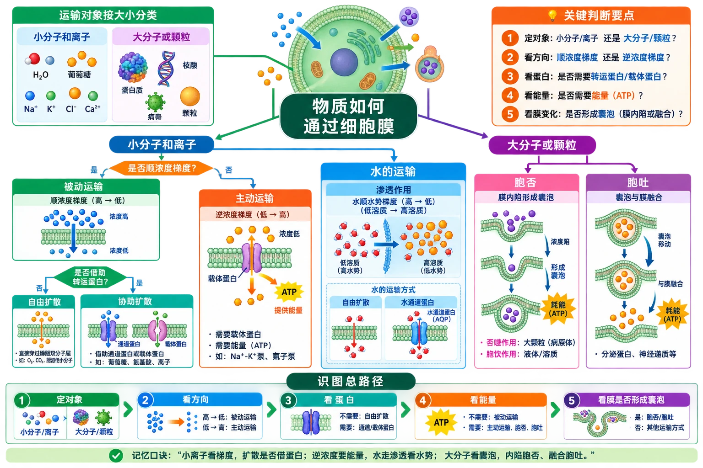

# 第四章 细胞的物质输入和输出·学习导图

<!-- 图片描述：补充知识图（非教材原图）——“细胞物质输入和输出总判定图”。中心为“物质如何通过细胞膜”，先按运输对象分为“小分子和离子”与“大分子或颗粒”；小分子和离子再按是否顺浓度梯度分为被动运输和主动运输，被动运输按是否借助转运蛋白分为自由扩散与协助扩散，主动运输标出逆浓度梯度、载体蛋白和能量；水的运输旁接渗透作用、自由扩散和水通道蛋白；大分子分为胞吞与胞吐，标出膜内陷/融合及耗能。底部给出识图路径“定对象→看方向→看蛋白→看能量→看膜是否形成囊泡”。白底教材式信息图，绿色表示细胞和膜，蓝色表示运输方向，橙色表示能量与关键判断。 -->

## 章节导航

1. [[4.1 被动运输]]：从渗透装置、红细胞吸失水和植物质壁分离出发，建立水分运输、自由扩散与协助扩散模型。
2. [[章末 生物科学史话 人类对通道蛋白的探索历程]]：理解“速率异常—提出通道假说—分离蛋白—解析结构”的科学证据链。
3. [[4.2 主动运输与胞吞、胞吐]]：处理逆浓度梯度运输和大分子运输，联系载体蛋白、能量及膜流动性。
4. [[章末 整理与提升]]：综合比较四类运输方式，训练概念图、柱状图和质壁分离曲线判读。

## 本章统一判断框架

| 判断问题 | 可能结论 |
|---|---|
| 是否顺浓度梯度？ | 顺梯度可能是自由扩散或协助扩散；逆梯度通常是主动运输 |
| 是否需要转运蛋白？ | 不需要为自由扩散；需要且顺梯度为协助扩散；需要载体、逆梯度并耗能为主动运输 |
| 是否形成囊泡、发生膜形变？ | 是则考虑胞吞或胞吐 |
| 运输对象是什么？ | 不带电小分子、脂溶性物质常自由扩散；离子和极性小分子常需转运蛋白；大分子常胞吞/胞吐 |
| 是否消耗细胞能量？ | 被动运输不直接耗能；主动运输、胞吞和胞吐耗能 |

## 跨章联系

- 本章以前一章的“流动镶嵌模型”为结构基础：磷脂双层构成屏障，膜蛋白提供选择性通路，膜的流动性支持胞吞和胞吐。
- 质壁分离实验以前一章的成熟植物细胞结构为前置知识，尤其要分清细胞壁、细胞膜、液泡膜和细胞质。
