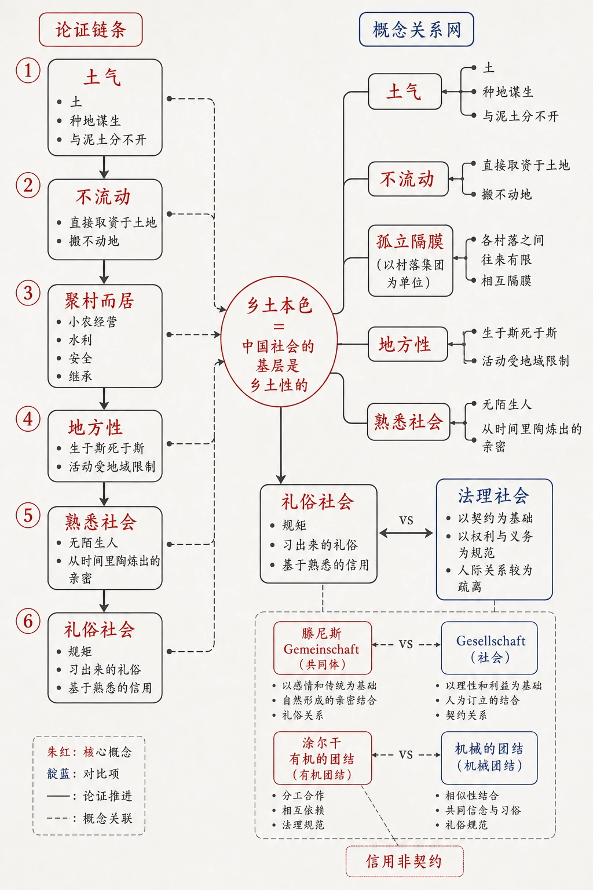
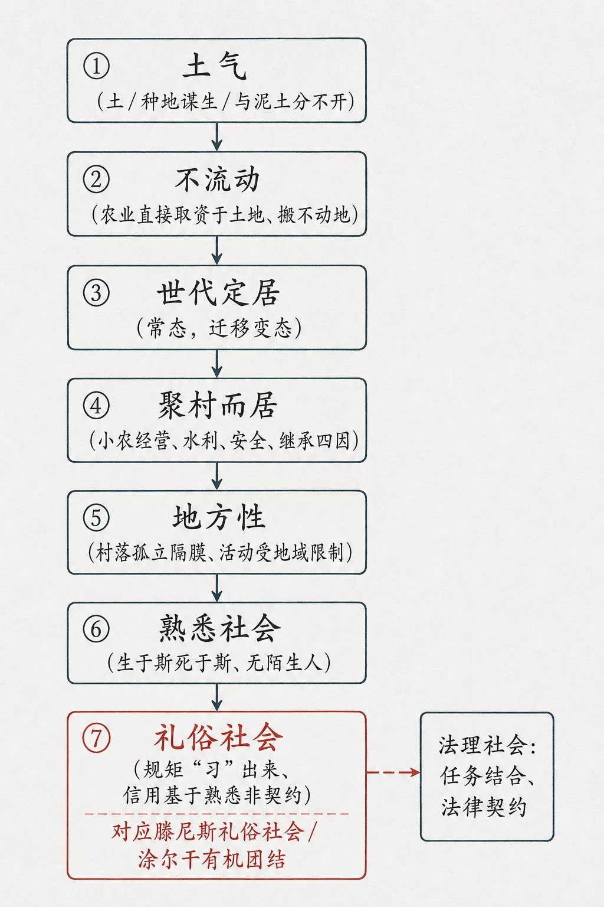
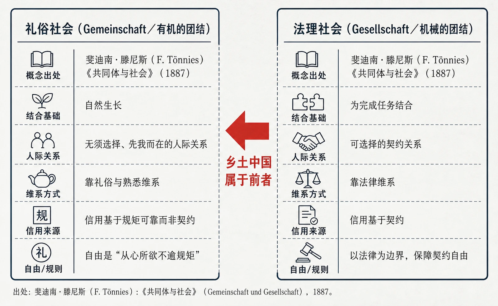

# 05 乡土本色

<!-- 图片描述：本节整体知识信息结构图。采用“论证链条 + 概念关系网”混合图：中心节点为“乡土本色＝中国社会的基层是乡土性的”。一级分支自上而下依次为“土气（土／种地谋生／与泥土分不开）→ 不流动（直接取资于土地、搬不动地）→ 聚村而居（小农经营、水利、安全、继承）→ 地方性（生于斯死于斯、活动受地域限制）→ 熟悉社会（无陌生人、从时间里陶炼出的亲密）→ 礼俗社会（规矩／习出来的礼俗／基于熟悉的信用）”。二级要点标注关键概念：土气、不流动、孤立隔膜（以村落集团为单位）、礼俗社会 vs 法理社会（滕尼斯 Gemeinschaft/Gesellschaft、涂尔干 有机的团结/机械的团结）、信用非契约。用朱红标出核心概念，靛蓝标出对比项，浅灰纸面、黑灰线条，留白充足，中文标注。 -->

## 知识关系导航

本章为费孝通《乡土中国》全书的第一章，是整本书的总纲。作者在此奠定“中国社会的基层是乡土性的”这一核心论点，后续章节（如差序格局、礼治秩序、无为政治等）均围绕“乡土性”这一基本视角逐层展开，故本章是进入整本书阅读的逻辑起点。

## 本节学习目标

- 把握费孝通在《乡土中国》首章提出的核心论点：**从基层看，中国社会是乡土性的**。
- 理清“土气—不流动—聚村而居—地方性—熟悉社会—礼俗社会”这一层层推进的论证逻辑。
- 理解并区分两组关键概念：**礼俗社会与法理社会**（对应滕尼斯的 Gemeinschaft/Gesellschaft、涂尔干的“有机的团结/机械的团结”）。
- 能结合原文分析“土”“熟悉”“规矩”“信用”等核心词的内涵，并说明乡土生活方式在现代社会为何产生流弊。
- 掌握论述类文本（学术随笔）的阅读方法：抓中心论点、梳理论证脉络、辨析概念、体会语言中的情感态度与学术立场。

## 核心知识点讲解

### 一、文本基本信息与学习任务

- **篇目**：《乡土本色》，费孝通《乡土中国》第一章。
- **作者**：费孝通（1910—2005），中国社会学家、人类学家，代表作《江村经济》《乡土中国》《生育制度》等。
- **文体**：学术随笔／社会学论述文。以通俗易懂的语言阐述中国基层社会的结构特征，兼具学术性与可读性。
- **学习任务**：理解“乡土性”的内涵；梳理作者如何从“土”字破题，逐层推导出“熟悉社会”“礼俗社会”的结论。

### 二、整体内容与结构线索

全文以“土”为文眼，论证线索如下：

土气（乡下人离不了泥土、种地谋生）→ 不流动（农业直接取资于土地、搬不动地）→ 世代定居（迁移是变态）→ 聚村而居（村落为社区单位）→ 地方性（活动受地域限制、孤立隔膜）→ 熟悉社会（生于斯死于斯、无陌生人）→ 礼俗社会（规矩“习”出来、信用基于熟悉）。

结尾点明：这种“土气”的生活方式在进入现代社会后产生流弊，“土气”由褒义变成骂人的词。

<!-- 图片描述：因果链条图——乡土本色的论证推进。自上而下箭头串联：①土气（土／种地谋生／与泥土分不开）→②不流动（农业直接取资于土地、搬不动地）→③世代定居（常态，迁移变态）→④聚村而居（小农经营、水利、安全、继承四因）→⑤地方性（村落孤立隔膜、活动受地域限制）→⑥熟悉社会（生于斯死于斯、无陌生人）→⑦礼俗社会（规矩“习”出来、信用基于熟悉非契约）。在⑦处用朱红标注“对应滕尼斯礼俗社会／涂尔干有机团结”，并与右侧小注“法理社会：任务结合、法律契约”形成对照。浅灰纸面、黑灰线条、朱红重点、中文标注，留白充足。 -->

### 三、课文原文与逐段/逐句解读

**【原文】**
> 从基层上看去，中国社会是乡土性的。
> 在社会学里，我们常分出两种不同性质的社会：一种并没有具体目的，只是因为在一起生长而发生的社会；一种是为了要完成一件任务而结合的社会。用 Tönnies 的话说：前者是 Gemeinschaft，后者是 Gesellschaft；用 Durkheim 的话说：前者是“有机的团结”，后者是“机械的团结”。用我们自己的话说，前者是礼俗社会，后者是法理社会。

**【解读】**
开篇即抛出全书总纲：**中国社会的基层是乡土性的**。紧接着引入社会学经典二分法，为后文核心概念“礼俗社会/法理社会”张本。
- 礼俗社会（Gemeinschaft，滕尼斯；有机的团结，涂尔干）：因自然生长、无须选择而结合，靠礼俗维系。
- 法理社会（Gesellschaft，滕尼斯；机械的团结，涂尔干）：为完成特定任务而结合，靠法律契约维系。
作者声明“暂时不提”上层与近代特殊社会，先聚焦被称为“土头土脑”的乡下人——他们才是中国社会的基层。

**【原文】**
> 我们说乡下人土气，虽则似乎带着几分藐视的意味，但这个土字却用得很好。土字的基本意义是指泥土。乡下人离不了泥土，因为在乡下住，种地是最普通的谋生办法。……我们的民族确是和泥土分不开的了。从土里长出过光荣的历史，自然也会受到土的束缚，现在很有些飞不上天的样子。

**【解读】**
- **字词**：“土气”表面带藐视，作者却肯定这个“土”字用得好——因为它点出乡下人与泥土的依存关系。
- **论据**：用“美国朋友到内蒙仍锄地播种”“史禄国说中国人在西伯利亚也要下种试种地”等事例，证明民族与泥土不可分。
- **辩证**：作者不回避“土”的双重性——既“长出光荣的历史”，也“受到土的束缚”，埋下结尾“飞不上天”的伏笔。

**【原文】**
> 靠种地谋生的人才明白泥土的可贵。……“土地”这位最近于人性的神，老夫老妻白首偕老的一对，管着乡间一切的闲事。他们象征着可贵的泥土。我初次出国时，我的奶妈偷偷地把一包用红纸裹着的东西，塞在我箱子底下。……这是一包灶上的泥土。……我在《一曲难忘》的电影里看到了东欧农业国家的波兰也有着类似的风俗，使我更领略了“土”在我们这种文化里所占和所应当占的地位了。

**【解读】**
- “土”是乡下人的命根，连“土地”都被神格化为“最近于人性的神”。
- 奶妈塞“红纸包灶上泥土”与波兰风俗互证，说明“土”在农业文化中的神圣地位，体现作者对乡土情感的体认与温情。
- 手法：以生活细节（红纸泥土）佐证抽象文化心理，真切可感。

**【原文】**
> 农业和游牧或工业不同，它是直接取资于土地的。……种地的人却搬不动地，长在土里的庄稼行动不得，侍候庄稼的老农也因之像是半身插入了土里，土气是因为不流动而发生的。

**【解读】**
提出关键因果：**土气 = 不流动**。农业“直接取资于土地”，人附着于土地无法随意迁移，故“不流动”，故“土气”。这是全文论证的枢纽句。

**【原文】**
> 直接靠农业来谋生的人是粘着在土地上的。……“村子里几百年来老是这几个姓……乡村里的人口似乎是附着在土上的，一代一代的下去，不太有变动。”——这结论自然应当加以条件的，但是大体上说，这是乡土社会的特性之一。我们很可以相信，以农为生的人，世代定居是常态，迁移是变态。

**【解读】**
- 以张北语言研究朋友的观察（村中几百年来姓氏不变）证明：**世代定居是常态，迁移是变态**。
- 作者严谨：特意补上“这结论自然应当加以条件的”，避免绝对化，体现学术表达的克制。

**【原文】**
> 当然，我并不是说中国乡村人口是固定的。……过剩的人口只得宣泄出外，负起锄头去另辟新地。可是老根是不常动的。……这些宣泄出外的人，像是从老树上被风吹出去的种子……

**【解读】**
补充说明人口并非绝对固定，用“**老树种子**”比喻外迁者：找到土地成活、形成新村落，找不到则被淘汰。比喻形象，说明“老根不动”的总体特征下仍有缓慢流动。

**【原文】**
> 不流动是从人和空间的关系上说的，从人和人在空间的排列关系上说就是孤立和隔膜。孤立和隔膜并不是以个人为单位的，而是以住在一处的集团为单位的。……耕种活动中既不向分工专业方面充分发展，农业本身也就没有聚集许多人住在一起的需要了。

**【解读】**
- “不流动”在空间上表现为村落间的**孤立和隔膜**，且以“集团（村落）”而非个人为单位。
- 原因：农业生产分工程度浅，无需聚集大量人口，故形成小型聚居社区。

**【原文】**
> 中国农民聚村而居的原因大致说来有下列几点：一、每家所耕的面积小……二、需要水利的地方，他们有合作的需要……三、为了安全，人多了容易保卫。四、土地平等继承的原则下，兄弟分别继承祖上的遗业，使人口在一地方一代一代地积起来，成为相当大的村落。

**【解读】**
明确归纳**聚村而居四大原因**：小农经营（住宅近农场）、水利合作、安全保卫、土地平继（人口累积）。这是典型的“分点概括”论述方式。

**【原文】**
> 无论出于什么原因，中国乡土社区的单位是村落……孤立和隔膜并不是绝对的，但是人口的流动率小，社区间的往来也必然疏少。我想我们很可以说，乡土社会的生活是富于地方性的。地方性是指他们活动范围有地域上的限制，在区域间接触少，生活隔离，各自保持着孤立的社会圈子。

**【解读】**
村落是乡土社区单位；村与村之间往来疏少，引出核心概念**“地方性”**——活动受地域限制、生活隔离、各自成圈。

**【原文】**
> 乡土社会在地方性的限制下成了生于斯、死于斯的社会。常态的生活是终老是乡。……这是一个“熟悉”的社会，没有陌生人的社会。

**【解读】**
由“地方性”推出“生于斯死于斯”，再推出**“熟悉社会”——没有陌生人的社会**。这是礼俗社会得以形成的人际基础。

**【原文】**
> 在社会学里，我们常分出两种不同性质的社会……用我们自己的话说，前者是礼俗社会，后者是法理社会。……生活上被土地所囿住的乡民，他们平素所接触的是生而与俱的人物，正像我们的父母兄弟一般，并不是由于我们选择得来的关系，而是无须选择，甚至先我而在的一个生活环境。

**【解读】**
回扣开篇二分法，并深化：乡土社会的人际关系“**无须选择、先我而在**”，如同父母兄弟，这是礼俗社会区别于法理社会（基于契约、可选择的任务关系）的根本。

**【原文】**
> 熟悉是从时间里、多方面、经常的接触中所发生的亲密的感觉。这感觉是无数次的小磨擦里陶炼出来的结果。这过程是《论语》第一句里的“习”字。“学”是和陌生事物的最初接触，“习”是陶炼……在一个熟悉的社会中，我们会得到从心所欲而不逾规矩的自由。

**【解读】**
- 阐释“熟悉”的来源：**时间 + 多方面接触 + 反复磨合**（“习”= 陶炼）。
- 引用《论语》“学而时习之，不亦悦乎”佐证，指出熟悉社会给人“**从心所欲而不逾规矩**”的自由——规矩是“习”出来的礼俗，而非外在法律。

**【原文】**
> “我们大家是熟人，打个招呼就是了，还用得着多说么？”……在乡土社会中法律是无从发生的。……乡土社会的信用并不是对契约的重视，而是发生于对一种行为的规矩熟悉到不加思索时的可靠性。

**【解读】**
- 熟人社会靠“打招呼”而非“讲个明白、画押签字”，故**法律无从发生**。
- 用“西洋商人代祖父交货”的神话式故事说明：乡土信用**不重契约，重对规矩的熟悉与可靠**。
- 关键判断：“规矩不是法律，规矩是‘习’出来的礼俗。从俗即是从心。”

**【原文】**
> 不但对人，他们对物也是“熟悉”的。一个老农看见蚂蚁在搬家了，会忙着去田里开沟……在熟悉的环境里生长的人，不需要这种原则，他只要在接触所及的范围之中知道从手段到目的间的个别关联。……孝是什么？孔子并没有抽象地加以说明，而是列举具体的行为，因人而异地答复了他的学生。最后甚至归结到心安二字。

**【解读】**
- 熟悉延伸到“对物”：老农凭经验知蚂蚁搬家之义，认识是**个别的、具体的**，而非抽象普遍原则。
- 以孔子“因材施教”论孝（不抽象定义，只列举行为，归结为“心安”）印证乡土社会**重具体经验、轻抽象原则**的思维方式。

**【原文】**
> 这种办法在一个陌生人面前是无法应用的。在我们社会的急速变迁中，从乡土社会进入现代社会的过程中，我们在乡土社会中所养成的生活方式处处产生了流弊。陌生人所组成的现代社会是无法用乡土社会的习俗来应付的。于是，“土气”成了骂人的词汇，“乡”也不再是衣锦荣归的去处了。

**【解读】**
- 收束全文：点出乡土生活方式在**现代社会（陌生人社会）**中的不适用与流弊。
- 情感与立场转变：“土气”由客观描述、甚至带温情，沦为“骂人的词汇”，折射社会转型中乡土价值的失落。这是全章的“豹尾”，既有学术判断，也有文化感慨。

### 四、关键语句、人物/意象与细节精读

- **“土气是因为不流动而发生的”**：全文因果枢纽，连接“土”与“熟悉社会”。
- **“世代定居是常态，迁移是变态”**：概括乡土人口特征，作者以“常态/变态”对举，语言精炼。
- **“从心所欲而不逾规矩”**：熟悉社会中自由的本质——自由来自内化了的礼俗，而非法律强制。
- **“规矩不是法律，规矩是‘习’出来的礼俗”**：礼俗社会与法理社会的根本分界。
- **意象·老树种子**：比喻外迁农民，生动写出“老根不动、种子外散”的迁移形态。
- **人物·社会学家**（原文配图涉及）：**滕尼斯（Ferdinand Tönnies）**，德国社会学家，著《共同体与社会》；**涂尔干（Émile Durkheim，又译迪尔凯姆）**，法国社会学家、社会学创始人之一，著《社会分工论》《自杀论》等；**史禄国（S. M. Shirokogorov）**，俄国人类学家，通古斯研究权威，曾执教北大、中大，是费孝通的老师。三人分别提供“礼俗/法理社会”“有机/机械团结”“田野实证”的学术资源。

### 五、语言风格与表达手法

- **平易而严谨**：口语化表达（“土头土脑”“打个招呼就是了”）与学术概念（Gemeinschaft/Gesellschaft、有机的团结）交织，深入浅出。
- **层层递进的论证**：由“土”字破题，逐级推导，逻辑链清晰。
- **举例与引证结合**：内蒙锄地、波兰红土、张北姓氏、西洋瓷器故事等生活实例；引《论语》佐证“习”。
- **比喻生动**：“半身插入了土里”“老树种子”等，化抽象为具象。
- **辩证克制**：如“这结论自然应当加以条件的”，体现学术表达的限度意识。

### 六、主题思想、情感态度与文化理解

- **主题**：揭示中国基层社会的“乡土性”本质——以土为生、安土重迁、聚村而居、熟悉信任、礼俗维系。
- **情感态度**：对乡土文化有温情与体认（肯定“土”字、记叙奶妈红土的细节），同时冷静指出其在现代社会中的局限与流弊，不美化、不贬损。
- **文化理解**：理解“土气”并非贬义原初义，而是农业文明中人与土地、人与人的深层纽带；认识从乡土社会到现代社会的转型阵痛。

### 七、阅读答题与写作迁移

- **答题模板（词句理解）**：释义（本义/语境义）+ 手法 + 在论证/结构中的作用 + 情感/态度。
- **答题模板（概念对比）**：先分述两概念内涵，再点明区别维度（结合基础／维系方式／人际关系／信用来源），最后扣文本。
- **写作迁移**：学用“由一核心词破题、逐层推导”的论述结构；学用生活小事例支撑学术观点；学用比喻使抽象可感。

## 重点梳理

- **核心论点**：从基层上看，中国社会是乡土性的。
- **论证链条**：土气（土／种地）→ 不流动（搬不动地）→ 世代定居（常态）→ 聚村而居（四大原因）→ 地方性（村落孤立隔膜）→ 熟悉社会（无陌生人）→ 礼俗社会（规矩／信用）。
- **两组关键概念**：
  - 礼俗社会 vs 法理社会（滕尼斯 Gemeinschaft/Gesellschaft；涂尔干 有机的团结/机械的团结）。
  - 熟悉社会：人际关系“无须选择、先我而在”；信用来自对规矩的熟悉，非契约。
- **必记语句**：“土气是因为不流动而发生的”“世代定居是常态，迁移是变态”“从心所欲而不逾规矩”“规矩不是法律，规矩是‘习’出来的礼俗”。
- **文化常识**：费孝通与《乡土中国》；滕尼斯、涂尔干、史禄国的学术身份。
- **论证方法**：层进式论证、举例论证、引用论证（《论语》）、比喻论证（老树种子）。

## 难点突破

<!-- 图片描述：概念对比图——礼俗社会 vs 法理社会。左右两栏对比，各标出处与核心特征：左栏“礼俗社会（Gemeinschaft／有机的团结）”，特征为自然生长、无须选择、先我而在的人际关系，靠礼俗与熟悉维系，信用基于规矩可靠而非契约，自由是‘从心所欲不逾规矩’；右栏“法理社会（Gesellschaft／机械的团结）”，特征为为完成任务结合、可选择的契约关系，靠法律维系，信用基于契约。中间用朱红箭头标注‘乡土中国属于前者’。浅灰纸面、黑灰线条、朱红重点、中文标注，版式克制。 -->

- **难点一：为何“土气”是褒中带客观的词，而非单纯贬义？**
  突破：联系全文，“土”指泥土、种地，是乡下人谋生之本与命根；作者用内蒙锄地、波兰红土等事例正面肯定民族与泥土不可分。“土气”成贬义是结尾才点出的“现代社会转型”结果，不可提前代入。
- **难点二：礼俗社会与法理社会的区分维度易混。**
  突破：抓住三个对照——结合基础（自然生长 vs 完成任务）、维系方式（礼俗/熟悉 vs 法律/契约）、人际关系（无须选择 vs 可的选择）。乡土中国属前者。
- **难点三：“熟悉”如何产生自由？**
  突破：“熟悉”来自时间+多方面接触+反复磨合（“习”）。规矩内化为礼俗后，人不必外在强制即“从心所欲不逾规矩”，故自由源于熟悉而非法律。
- **难点四：作者为何在多处留“条件”？**
  突破：如“这结论自然应当加以条件的”“孤立和隔膜并不是绝对的”，体现学术表达的严谨，防止把“不流动/孤立”绝对化，答题时要保留这种分寸。

## 例题讲解

**例题1（内容概括）** 请概括《乡土本色》中“中国农民聚村而居”的原因。
- **分析**：定位原文“中国农民聚村而居的原因大致说来有下列几点”。
- **步骤/答案**：①小农经营，住宅与农场距离近；②水利合作需要；③安全保卫，人多以易防守；④土地平等继承，人口在一地累积成村。
- **反思**：概括题须“分点、不漏点、用原文关键词”，避免用自己的话模糊替代。

**例题2（概念对比）** 结合文本，说明“礼俗社会”与“法理社会”的不同。
- **分析**：回扣开篇二分法与后文“熟人/陌生人”对照。
- **答案要点**：礼俗社会因自然生长而结合，人际关系无须选择、先我而在，靠礼俗与熟悉维系，信用基于对规矩的熟悉（非契约），自由是“从心所欲不逾规矩”；法理社会为完成任务的结合，靠法律契约维系。乡土中国属礼俗社会。
- **反思**：对比题要“分维度”，不能只各写一句。

**例题3（词句理解）** 如何理解“土气是因为不流动而发生的”？
- **分析**：此为因果枢纽句，上承“农业直接取资于土地、搬不动地”，下启“世代定居、聚村而居”。
- **答案**：农业直接依赖土地，人附着于土地无法随意迁移（不流动），长期安土重迁的生活方式造就了“土气”。一句话由“土”导出整章逻辑。
- **反思**：词句题需放在**论证链条**中解释，而非孤立翻译。

**例题4（迁移运用·写作）** 仿照本文“由一核心词破题、逐层推导”的写法，以“韧”为核心词写一段 150 字左右的论述提纲。
- **分析**：模仿“土→不流动→定居→聚村→地方性→熟悉→礼俗”的层进结构。
- **参考提纲**：“韧”指柔而不断的生命力。植物因根深而韧（土）；人有家国记忆而韧（根）；文明因承续而韧（传）；故真正的韧不在强硬，而在深扎与绵延。
- **反思**：迁移写作重点在“结构仿写”，先搭层进链条，再填具体例证。

## 易错点整理

- **主题误读**：把“土气”全程当贬义，忽略作者前期的肯定与温情。避免：注意“土”字用得好、奶妈红土等正面笔触。
- **概念混淆**：将“礼俗社会/法理社会”与“有机/机械团结”张冠李戴（前者属滕尼斯，后组属涂尔干）。避免：记清配对（滕尼斯=Gemeinschaft/Gesellschaft；涂尔干=有机/机械团结）。
- **论证链断裂**：答题只答“土气”，漏掉“不流动→定居→聚村→地方性→熟悉→礼俗”的推导。避免：用链条图记忆。
- **手法混淆**：把“举例”说成“道理论证”，把“比喻（老树种子）”说成“对比”。避免：明辨四种论证方法。
- **答题语言空泛**：如答“表现了乡土特点”而无具体维度。避免：用“结合基础/维系方式/人际关系/信用来源”等术语落地。

## 考点考证点整理

### 考点一：内容概括与要点提取
- **出题思路**：要求概括某段或全文的核心观点、原因、特征。
- **关键条件**：抓住分点标志词（“有下列几点”“一、二、三、四”）、中心句。
- **解答要点**：分点作答，用原文关键词；如“聚村而居四原因”须答全四点。
- **易扣分点**：漏点、用自己话模糊替代、把“原因”答成“现象”。

### 考点二：概念理解与对比分析
- **出题思路**：解释“礼俗社会/法理社会”“熟悉社会”等概念，或比较二者。
- **关键条件**：回到开篇定义与后文“熟人/陌生人”对照。
- **解答要点**：分维度（结合基础、维系方式、人际关系、信用来源）表述，扣“乡土中国属礼俗社会”。
- **易扣分点**：只写一句定义；混淆滕尼斯与涂尔干的对应概念；不点明乡土属性。

### 考点三：重要语句含意
- **出题思路**：赏析“土气是因为不流动而发生的”“从心所欲而不逾规矩”等。
- **关键条件**：把句子放回论证链条定位（上承/下启）。
- **解答要点**：释义 + 手法/逻辑 + 结构作用 + 情感态度。
- **易扣分点**：孤立翻译、不联上下文、漏掉“结构作用”。

### 考点四：论证方法与语言特色
- **出题思路**：分析本文如何论证“乡土性”，或评析语言风格。
- **关键条件**：识别层进、举例、引用、比喻四种方法。
- **解答要点**：先点方法名，再举文本实例，最后说效果（深入浅出、生动可感）。
- **易扣分点**：方法名称写错（如“对比论证”用于老树种子比喻）；只列方法不分析。

### 考点五：文本主旨与现实意义
- **出题思路**：谈谈“土气”在当代的含义，或本文对理解乡土文化的价值。
- **关键条件**：兼顾“肯定乡土纽带”与“指出现代流弊”两方面。
- **解答要点**：先概括乡土性内涵，再谈转型中“土气”词义变化与现代启示。
- **易扣分点**：只褒不贬或只贬不褒，失之片面；脱离文本空谈。

## 练习题

> 说明：本章源文（费孝通《乡土中国·乡土本色》）未附课后练习题，以下题目为根据本章核心考点自拟，用于巩固整本书阅读与论述类文本阅读能力。

**一、基础理解（自拟）**
1. 费孝通在《乡土本色》中提出的核心论点是什么？请用原文语句回答。
2. 文中“礼俗社会”与“法理社会”分别对应国外社会学家的哪组概念？

**二、文本分析（自拟）**
3. 作者从哪几个层面推导出“乡土社会是熟悉社会”？请简要列出论证链条。
4. 文中用“老树种子”比喻什么？这个比喻好在哪里？

**三、鉴赏评价（自拟）**
5. 作者说“土气是因为不流动而发生的”，请结合全文说明这句话在论证中的作用。
6. 有人认为《乡土本色》对“乡土”只有温情肯定，你同意吗？请结合文本谈谈。

**四、迁移写作（自拟）**
7. 本文结尾指出乡土生活方式在现代社会产生流弊。请联系生活，谈谈你对“熟人社会”规则在今天利弊的理解（不少于 200 字）。

## 练习题答案

**1.** 核心论点原文：“从基层上看去，中国社会是乡土性的。” / “我说中国社会的基层是乡土性的”。
> 要点：抓住“基层”“乡土性”两个关键词，不可写成“乡下人土气”这类局部表述。

**2.** 礼俗社会对应滕尼斯的 **Gemeinschaft（共同体）** 与涂尔干的 **“有机的团结”**；法理社会对应滕尼斯的 **Gesellschaft（社会）** 与涂尔干的 **“机械的团结”**。
> 评分：四组概念须配对正确，混淆即扣分。

**3.** 论证链条：土气（土／种地谋生、与泥土分不开）→ 不流动（农业直接取资于土地、搬不动地）→ 世代定居（常态，迁移变态）→ 聚村而居（四大原因）→ 地方性（村落孤立隔膜、活动受地域限制）→ 熟悉社会（生于斯死于斯、没有陌生人）。
> 模板：按“土→不流动→定居→聚村→地方性→熟悉”顺序，分步写清因果。

**4.** “老树种子”比喻从原村落**外迁谋生的人**：找到土地成活、形成新村落（像种子落地生根），找不到则被淘汰。好处：①化抽象迁移为具象，生动可感；②呼应“老根不动”的总体特征，突出“流动缓慢、根脉相连”的乡土特质。

**5.** 作用：①内容上，揭示“土气”根源——农业依赖土地使人“不流动”；②结构上，是全章因果枢纽，上承“土/种地”，下启“世代定居/聚村而居/地方性/熟悉社会”；③由一词导出整章逻辑，体现论述文“破题—推导”的严密性。

**6.** （不同意）作者态度是**辩证**的：前文对“土”有温情肯定（肯定“土”字用得好、奶妈红纸包泥土、波兰类似风俗），并承认“从土里长出过光荣的历史”；但结尾冷静指出乡土生活方式在进入现代社会后“处处产生了流弊”，“土气”沦为骂人词汇。可见作者不美化也不贬损，而是客观揭示转型阵痛。

**7.** （写作评分要点）能辩证看待即可：利——熟人社会的信任降低成本、温情互助、秩序稳定；弊——易生人情裹挟、规则不透明、对陌生人缺乏契约精神，难以适应现代公共生活。要求联系生活实例，逻辑清晰，不少于 200 字。
