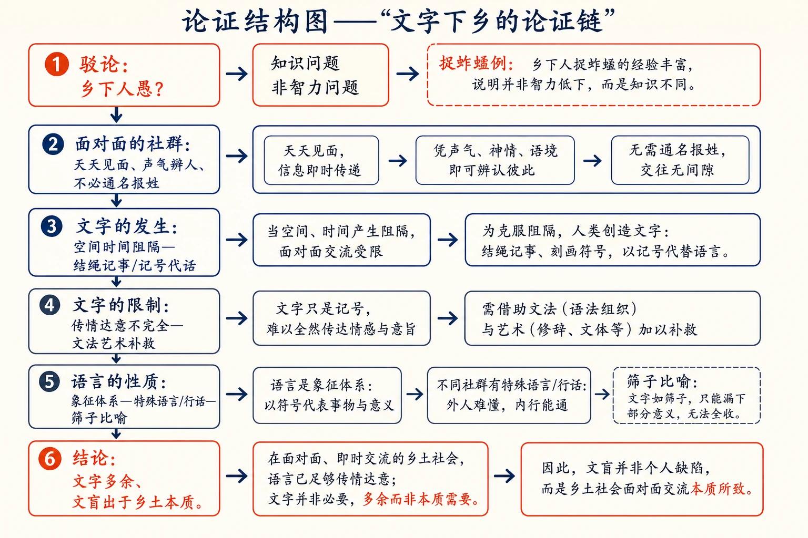
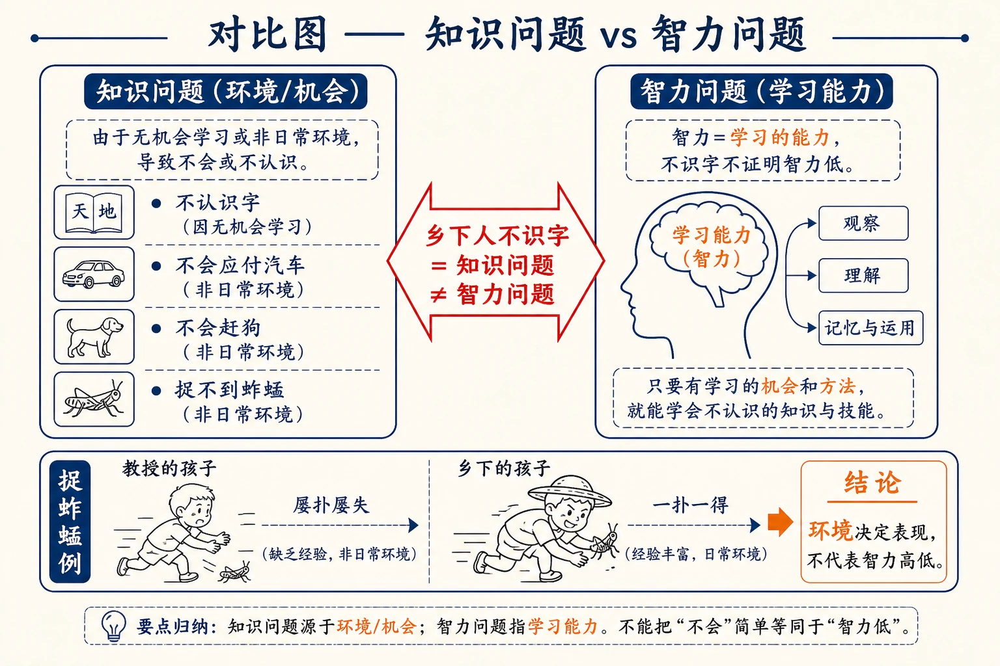

# 06 文字下乡

<!-- 图片描述：本节整体知识信息结构图，采用“驳论—立论—推论”论证链。中心问题为“乡下人是否愚、乡土社会是否需要文字”。上分支“驳‘愚’说”：乡下人不识字是知识问题（没机会学），不是智力问题（捉蚱蜢例证）；下分支“立论”：乡土社会是面对面的社群，直接接触、用足声声气气味即可辨人；再推论“文字的发生”：空间时间阻隔→结绳记事/记号代话；文字传情达意不完全（异时异地走样），需文法艺术补救；语言也只是象征体系的一部分，特殊语言（行话）更有效。底部结论“乡土社会中文字是多余的，文盲出于乡土社会本质而非愚”。朱红标出“面对面的社群”，靛蓝标出“知识/智力之分”，米白纸面、黑灰线条、中文标注、留白充足，符合语文文本精读风格。 -->

## 知识关系导航

- 所属章节：[[章首 学习导图|《乡土中国》学习导图]]
- 前置知识点：[[05-乡土本色#二、整体内容与结构线索|乡土性与熟悉社会]]（熟人社会是本章论证起点）
- 后续知识点：[[07-再论文字下乡#三、课文原文与逐段/逐句解读|再论文字下乡]]（上篇论空间阻隔，本篇续论时间阻隔）
- 相关知识点：[[12-礼治秩序#三、课文原文与逐段/逐句解读|礼治秩序与教化]]（乡土社会靠口头传承，与文字无关）
- 相关方法：[[07-再论文字下乡#三、课文原文与逐段/逐句解读|因果论证与概念辨析]]（与下篇同法）

本章是《乡土中国》第二章，紧接《乡土本色》，讨论“文字下乡”问题。上篇（本篇）从**空间格局**（面对面的社群）说明乡下人不需要文字；下篇《再论文字下乡》从**时间格局**补充论证。理解本篇，须先理解作者为“乡下人愚”翻案的立场，再把握“面对面社群—文字多余”的推论逻辑。

## 本节学习目标

- 理解作者为“乡下人愚”翻案的核心论证：不识字是知识问题（缺乏环境与机会），不是智力问题。
- 理解“面对面的社群”（Face to face group）的含义及乡土社会“不必通名报姓”的现象。
- 理解文字发生的前提：空间和时间中人和人接触发生阻隔，需找记号代话。
- 理解文字传情达意的不完全性及文法、艺术的作用。
- 理解语言是象征体系的一部分，特殊语言（行话）的有效性与语言“筛子”的局限。
- 能评价“文盲并非出于乡下人的愚，而是由于乡土社会的本质”这一观点，并掌握驳论方法。

## 核心知识点讲解

### 一、文本基本信息与学习任务

- **篇目**：《文字下乡》，选自费孝通《乡土中国》。
- **作者**：费孝通（1910—2005），中国社会学家、人类学家。
- **文体**：学术随笔／社会学论述文。本文以日常事例（汽车按喇叭、捉蚱蜢、“我呀”辨人、结绳记事、写情书）佐证观点，通俗亲切。
- **学习任务**：理解“愚”的辨析与“面对面的社群”；把握文字发生的条件与限制；理解语言/象征体系/特殊语言的关系；训练驳论与观点评价能力。

### 二、整体内容与结构线索

本文论证线索如下：

1. **提出问题**：乡村工作者说乡下人“愚”，究竟凭什么呢？
2. **驳“愚”说**：汽车按喇叭、包谷说成麦子，是知识问题不是智力问题；捉蚱蜢例证说明环境与机会决定“会与不会”；不识字=文盲≠愚。
3. **转向文字用处**：讨论文字之前先看乡土社会的特点——面对面的社群。
4. **面对面的社群**：熟人直接接触，足声、声气、气味皆可“报名”，不必通名报姓（“我呀”辨人）。
5. **文字的发生**：空间时间阻隔→结绳记事、铜钱代话；当面说话时记号多余甚至误会（情书悲剧）。
6. **文字的限制**：文字传情达意不完全（异时异地走样），需文法艺术补救；文字是“间接的说话”，是不太完善的工具。
7. **语言的性质**：语言是声音象征体系，象征靠联想附着意义、是社会产物；语言只在共同经验的一层上发生。
8. **特殊语言**：共同语言之外有行话；亲密社群中表情动作皆可作象征原料；特殊语言可摆脱字句固定意义，但语言如“筛子”使情意公式化（李贺例）。
9. **结论**：乡土社会中文字多余，连语言都不是唯一象征体系；文盲出于乡土社会本质而非愚；文字下乡须先考虑文字与语言的基础。

### 三、课文原文与逐段/逐句解读

**【原文】**
> 乡下人在城里人眼睛里是“愚”的。我们当然记得不少提倡乡村工作的朋友们，把愚和病贫联接起来去作为中国乡村的症候。关于病和贫我们似乎还有客观的标准可说，但是说乡下人“愚”，却是凭什么呢？乡下人在马路上听见背后汽车连续地按喇叭，慌了手脚，东避也不是，西躲又不是，司机拉住闸车，在玻璃窗里，探出半个头，向着那土老头儿，啐了一口：“笨蛋！”——如果这是愚，真冤枉了他们。

**【解读】**
- **问题提出**：病、贫有客观标准，“愚”却没有标准——凭什么说乡下人愚？
- **关键词**：“冤枉”——作者立场鲜明，先为乡下人鸣不平。

**【原文】**
> 我曾带了学生下乡，田里长着包谷，有一位小姐，冒充着内行，说：“今年麦子长得这么高。”旁边的乡下朋友，虽则没有啐她一口，但是微微的一笑，也不妨译作“笨蛋”。乡下人没有见过城里的世面，因之而不明白怎样应付汽车，那是知识问题，不是智力问题，正等于城里人到了乡下，连狗都不会赶一般。

**【解读】**
- **关键判断（名句）**：乡下人不会应付汽车是**知识问题，不是智力问题**——正如城里人到乡下连狗都不会赶。
- **对等例证**：城里小姐把包谷说成麦子，乡下人“微微一笑”即“笨蛋”；两种“笨”实质相同。

**【原文】**
> 如果我们不承认郊游的仕女们一听见狗吠就变色是“白痴”，也就自然没有理由说乡下人不知道“靠左边走”或“靠右边走”等时常会因政令而改变的方向是因为他们“愚不可及”了。“愚”在什么地方呢？
> 其实乡村工作的朋友说乡下人愚那是因为他们不识字，我们称之曰“文盲”，意思是白生了眼睛，连字都不识。这自然是事实。我决不敢反对文字下乡的运动，可是如果说不识字就是愚，我心里总难甘服。“愚”如果是指智力的不足或缺陷，那么识字不识字却并非愚不愚的标准。智力是学习的能力。如果一个人没有机会学习，不论他有没有学习的能力还是学不到什么的。

**【解读】**
- **厘清概念**：“愚”=智力不足或缺陷；识字不识字不是愚不愚的标准。
- **关键判断（名句）**：智力是学习的能力；没有机会学习，有能力也学不到。
- **立场澄清**：作者“决不敢反对文字下乡的运动”，反对的只是“不识字=愚”的判断——驳论点而非驳运动。

**【原文】**
> 说到这里我记起了疏散在乡下时的事来。同事中有些孩子被送进了乡间的小学，在课程上这些孩子样样都比乡下孩子学得快、成绩好。教员们见面时总在家长面前夸奖这些孩子们有种、聪明。这等于说教授们的孩子智力高。我对于这些恭维自然是私心窃喜。穷教授别的已经全被剥夺，但是我们还有别种人所望尘莫及的遗传。但是有一天，我在田野里看放学回来的小学生们捉蚱蜢，那些“聪明”而有种的孩子，扑来扑去，屡扑屡失，而那些乡下孩子却反应灵敏，一扑一得。回到家来，刚来的一点骄傲似乎又没有了着落。

**【解读】**
- **田野例证**：教授们的孩子认字学得快（被夸“聪明”），但捉蚱蜢屡扑屡失；乡下孩子一扑一得。
- **作用**：用“捉蚱蜢”反证——所谓“聪明”只是环境适应，不是绝对智力高下。

**【原文】**
> 乡下孩子在教室里认字认不过教授们的孩子，和教授们的孩子在田野里捉蚱蜢捉不过乡下孩子，在意义上是相同的。我并不责备自己孩子蚱蜢捉得少，第一是我们无需用蚱蜢来加菜（云南乡下蚱蜢是下饭的，味道很近于苏州的虾干），第二是我的孩子并没有机会练习。教授们的孩子穿了鞋袜，为了体面，不能不择地而下足，弄污了回家来会挨骂，于是在他们捉蚱蜢时不免要有些顾忌，动作不活灵了。这些也许还在其次，他们日常并不在田野里跑惯，要分别草和虫，须费一番眼力，蚱蜢的保护色因之易于生效。——我为自己孩子所作的辩护是不是同样也可以用之于乡下孩子在认字上的“愚”么？我想是很适当的。乡下孩子不像教授们的孩子到处看见书籍，到处接触着字，这不是他们日常所混熟的环境。教授们的孩子并不见得一定是遗传上有什么特别善于识字的能力，显而易见的却是有着易于识字的环境。这样说来，乡下人是否在智力上比不上城里人，至少还是个没有结论的题目。

**【解读】**
- **类比论证**：认字不及 vs 捉蚱蜢不及，“在意义上是相同的”——都是环境与机会问题。
- **关键判断（名句）**：教授们的孩子“显而易见的却是有着易于识字的环境”；乡下人智力是否不及城里人“还是个没有结论的题目”。

**【原文】**
> 这样看来，乡村工作的朋友们说乡下人愚，显然不是指他们智力不及人，而是说他们知识不及人了。这一点，依我们上面所说的，还是不太能自圆其说。至多是说，乡下人在城市生活所需的知识上是不及城市里人多，这是正确的。我们是不是也因之可以说乡下多文盲是因为乡下本来无需文字眼睛呢？说过这里，我们应当讨论一下文字的用处了。

**【解读】**
- **结论过渡**：乡下人愚=知识不及人（且仅限城市生活所需知识）；由此转向“乡下多文盲是否因无需文字”——引出文字用处之讨论。

**【原文】**
> 我在上一篇里说明了乡土社会的一个特点就是这种社会的人是在熟人里长大的。用另一句话来说，他们生活上互相合作的人都是天天见面的。在社会学里我们称之作Face to face group，直译起来是“面对面的社群”。归有光的《项脊轩记》里说，他日常接触的老是那些人，所以日子久了可以用脚声来辨别来者是谁。在“面对面的社群”里甚至可以不必见面而知道对方是谁。我们自己虽说是已经多少在现代都市里住过一时了，但是一不留心，乡土社会里所养成的习惯还是支配着我们。你不妨试一试，如果有人在你门上敲着要进来，你问：“谁呀！”门外的人十之八九回答你一个大声的“我”。这是说，你得用声气辨人。

**【解读】**
- **关键概念（名句）**：面对面的社群（Face to face group）——生活上互相合作的人天天见面。
- **例证**：归有光《项脊轩记》以脚声辨人；“我呀”以声气辨人——熟人不必通名报姓。

**【原文】**
> “贵姓大名”是因为我们不熟悉而用的。熟悉的人大可不必如此，足声、声气、甚至气味，都可以是足够的“报名”。我们社交上姓名的不常上口也就表示了我们原本是在熟人中生活的，是个乡土社会。

**【解读】**
- **关键判断**：足声、声气、气味皆可“报名”；姓名不常上口=熟人社会（乡土社会）的标志。
- **学习提示**：这与《乡土本色》的“熟悉社会”直接呼应。

**【原文】**
> 文字发生之初是“结绳记事”，需要结绳来记事是为了在空间和时间中人和人的接触发生了阻碍，我们不能当面讲话，才需要找一些东西来代话。在广西的瑶山里，部落有急，就派了人送一枚铜钱到别的部落里去，对方接到了这记号，立刻派人来救。这是“文字”，一种双方约好代表一种意义的记号。如果是面对面可以直接说话时，这种被预先约好的意义所拘束的记号，不但多余，而且有时会词不达意引起误会的。在十多年前青年们讲恋爱，受着直接社交的限制，通行着写情书，很多悲剧是因情书的误会而发生的。

**【解读】**
- **关键概念（名句）**：文字发生之初是“结绳记事”，为的是空间和时间中接触发生阻碍时“找一些东西来代话”。
- **例证**：广西瑶山铜钱代话（“文字”=双方约好代表意义的记号）；写情书误会——当面可说的话，用记号反而误事。
- **学习提示**：这里已伏下篇“空间阻隔/时间阻隔”的分析框架。

**【原文】**
> 文字所能传的情、达的意是不完全的。这不完全是出于“间接接触”的原因。我们所要传达的情意是和当时当地的外局相配合的。你用文字把当时当地的情意记了下来，如果在异时异地的圜局中去看，所会引起的反应很难尽合于当时当地的圜局中可能引起的反应。文字之成为传情达意的工具常有这个无可补救的缺陷。于是在利用文字时，我们要讲究文法，讲究艺术。文法和艺术就在减少文字的“走样”。

**【解读】**
- **关键判断（名句）**：文字传情达意不完全——情意与“当时当地的外局”相配合，异时异地看会“走样”。
- **补救**：文法和艺术的作用在减少文字的“走样”（无法完全消除）。

**【原文】**
> 在说话时，我们可以不注意文法。并不是说话时没有文法，而是因为我们有着很多辅助表情来补充传达情意的作用。我们可以用手指指着自己而在话里吃去一个我字。在写作时却不能如此。于是我们得尽量地依着文法去写成完整的句子了。不合文法的字词难免引起人家的误会，所以不好。说话时我们如果用了完整的句子，不但显得迂阔，而且可笑。这是从书本上学外国语的人常会感到的痛苦。

**【解读】**
- **对照**：说话靠表情等辅助，可不注意文法；写作只能靠文法成完整句子。
- **例证**：学外国语者的“痛苦”——印证文字/口语之别。

**【原文】**
> 文字是间接的说话，而且是个不太完善的工具。当我们有了电话、广播的时候，书信文告的地位已经大受影响。等到传真的技术发达之后，是否还用得到文字，是很成问题的。

**【解读】**
- **关键判断**：文字是“间接的说话”，是不太完善的工具；电话、广播已冲击其地位，传真技术下文字是否还用“很成问题”。
- **学习提示**：作者以技术发展质疑文字的必然性——文字并非传情达意的唯一乃至最优工具。

**【原文】**
> 这样说来，在乡土社会里不用文字绝不能说是“愚”的表现了。面对面的往来是直接接触，为什么舍此比较完善的语言而采文字呢？

**【解读】**
- **小结**：面对面直接接触，何必舍语言用文字？——为“文字多余”张本。

**【原文】**
> 我还想在这里推进一步说，在面对面社群里，连语言本身都是不得已而采取的工具。语言本是用声音来表达的象征体系。象征是附着意义的事物或动作，我说“附着”是因为“意义”是靠联想作用加上去的，并不是事物或动作本身具有的性质。这是社会的产物，因为只有在人和人需要配合行为的时候，个人才需要有所表达；而且表达的结果必须使对方明白所要表达的意义。所以象征是包括多数人共认的意义，也就是这一事物或动作会在多数人中引起相同的反应。因之，我们绝不能有个人的语言，只能有社会的语言。

**【解读】**
- **关键定义（名句）**：语言=用声音来表达的象征体系；象征=附着意义的事物或动作（意义靠联想加上去，是社会产物）。
- **关键判断**：象征包括多数人共认的意义；“绝不能有个人的语言，只能有社会的语言”。

**【原文】**
> 要使多数人能对同一象征具有同一意义，他们必须有着相同的经历，就是说在相似的环境中接触和使用同一象征，因而在象征上附着了同一意义。因此在每个特殊的生活团体中，必有他们特殊的语言，有许多别种语言所无法翻译的字句。语言只能在一个社群所有的相同经验的一层上发生。群体愈大，包括的人所有的经验愈繁杂，发生语言的一层共同基础也必然愈有限，于是语言也愈趋于简单化。

**【解读】**
- **关键推论**：同一意义需相同经历；特殊生活团体有特殊语言（无法翻译）；群体愈大、共同经验愈少、语言愈简单化。

**【原文】**
> 可是从另一方面说，在一个社群所用的共同语言之外，也必然会因个人间的需要而发生许多少数人间的特殊语言，即所谓的“行话”。行话是同行人中的话，外行人因为没有这种经验，不会懂的。在每个学校里，甚至每个寝室里，都有他们特殊的语言。最普遍的特殊语言发生在母亲和孩子之间。

**【解读】**
- **关键概念（名句）**：行话=少数人间的特殊语言（同行人的话，外行不懂）；学校、寝室、母子之间皆有。
- **学习提示**：语言由“共同层+特殊层”构成，特殊层源于亲密与共同经验。

**【原文】**
> “特殊语言”不过是亲密社群中所使用的象征体系的一部分，用声音来作象征的那一部分。在亲密社群中可用来作象征体系的原料比较多。表情、动作，在面对面的情境中，有时比声音更容易传情达意。即使用语言时，也总是密切配合于其他象征原料的。譬如：我可以和一位熟人说：“真是那个！”同时眉毛一皱，嘴角向下一斜，面上的皮肤一紧，用手指在头发里一插，头一沉，对方也就明白“那个”是“没有办法”、“失望”的意思了。如果同样的两个字用在另一表情的配合里，意义可以完全不同。

**【解读】**
- **关键判断（名句）**：特殊语言=亲密社群所用象征体系中以声音作象征的那一部分；表情、动作比声音更容易传情达意。
- **例证**：“真是那个”+表情=“没有办法/失望”——同一字句随表情而意义不同。

**【原文】**
> “特殊语言”常是特别有效，因为它可以摆脱字句的固定意义。语言像是个社会定下的筛子，如果我们有一种情意和这筛子的格子不同也就漏不过去。我想大家必然有过“无言胜似有言”的经验。其实这个筛子虽则有助于人和人间的了解，但同时却也使人和人间的情意公式化了，使每一人、每一刻的实际情意都走了一点样。我们永远在削足适履，使感觉敏锐的人怨恨语言的束缚。李长吉要在这束缚中去求比较切近的表达，难怪他要呕尽心血了。

**【解读】**
- **关键比喻（名句）**：语言像社会定下的“筛子”——情意不合格子就漏不过去；筛子助了解，也使情意“公式化”“走样”，人永远在“削足适履”。
- **例证**：李贺（李长吉）在语言束缚中求切近表达而呕心沥血。

**【原文】**
> 于是在熟人中，我们话也少了，我们“眉目传情”，我们“指石相证”，我们抛开了比较间接的象征原料，而求更直接的会意了。所以在乡土社会中，不但文字是多余的，连语言都并不是传达情意的唯一象征体系。

**【解读】**
- **核心结论（名句）**：乡土社会中“不但文字是多余的，连语言都并不是传达情意的唯一象征体系”。
- **学习提示**：从“文字多余”推到“语言也非唯一工具”，论证层层递进。

**【原文】**
> 我决不是说我们不必推行文字下乡，在现代化的过程中，我们已开始抛离乡土社会，文字是现代化的工具。我要辨明的是乡土社会中的文盲，并非出于乡下人的“愚”，而是由于乡土社会的本质。而且我还愿意进一步说，单从文字和语言的角度中去批判一个社会中人和人的了解程度是不够的，因为文字和语言，只是传情达意的一种工具，并非唯一的工具；而且这工具本身也是有缺陷的，能传的情、能达的意是有限的。所以提倡文字下乡的人，必须先考虑到文字和语言的基础，否则开几个乡村学校和使乡下人多识几个字，也许并不能使乡下人“聪明”起来。

**【解读】**
- **总结性结论（名句）**：文盲“并非出于乡下人的‘愚’，而是由于乡土社会的本质”；文字是现代化的工具，但不是唯一工具，本身有缺陷。
- **建设性观点**：提倡文字下乡须先考虑文字和语言的基础，否则多识几个字“并不能使乡下人‘聪明’起来”。

### 四、关键语句、人物/意象与细节精读

- **“那是知识问题，不是智力问题。”**：全章核心辨析——乡下人不会应付汽车、不识字，都是知识（环境/机会）问题而非智力问题。
- **“智力是学习的能力。如果一个人没有机会学习，不论他有没有学习的能力还是学不到的什么。”**：为“愚”翻案的理论支柱。
- **“面对面的社群”**：Face to face group——乡土社会天天见面、直接接触的社群。
- **“文字发生之初是‘结绳记事’……是因为在空间和时间中人和人的接触发生了阻碍。”**：文字发生的条件。
- **“文字所能传的情、达的意是不完全的。”**：文字局限的总判断。
- **“语言本是用声音来表达的象征体系。”**：语言的定义。
- **“语言像是个社会定下的筛子。”**：语言的比喻——助了解也使情意公式化。
- **“在乡土社会中，不但文字是多余的，连语言都并不是传达情意的唯一象征体系。”**：全章结论。
- **“乡土社会中的文盲，并非出于乡下人的‘愚’，而是由于乡土社会的本质。”**：最核心判断，常作考点。
- **人物·归有光**：明代散文家，《项脊轩记》以脚声辨人——面对面的社群例证。
- **人物·李贺（李长吉）**：唐代诗人，“呕尽心血”求切近表达——语言束缚的例证。
- **意象·结绳记事**：文字的最初形态，出于空间时间阻隔。
- **意象·筛子**：语言——漏过格子者传，漏不过者失落；情意公式化。
- **文化常识**：Face to face group（面对面的社群）、文盲、“眉目传情”“指石相证”。

### 五、语言风格与表达手法

- **驳论开篇**：先立“乡下人愚”的靶子，再以对等例证逐层推翻，立中有破。
- **对比论证**：城里人/乡下人、知识/智力、说话/文字、共同语言/特殊语言。
- **类比论证**：认字不及 vs 捉蚱蜢不及，“在意义上是相同的”。
- **田野与生活例证**：汽车按喇叭、包谷麦子、捉蚱蜢、“我呀”辨人、情书误会、母子特殊语言。
- **比喻生动**：“筛子”“削足适履”，化抽象为具体。

### 六、主题思想、情感态度与文化理解

- **主题**：乡下人不识字不是“愚”，而是知识（环境/机会）问题；乡土社会是面对面的社群，直接接触使文字多余；文字传情达意不完全、语言也只是象征体系的一部分；文盲出于乡土社会的本质而非乡下人的智力缺陷。
- **情感态度**：作者为乡下人辩护，态度恳切而立场分明；同时不否定文字下乡，冷静指出文字是现代化工具、但须先考虑其基础——既有乡土情怀，又有现代化眼光。
- **文化理解**：理解“文盲”一词背后的价值预设；理解面对面社群与陌生人社会的交流差异；理解语言的共同经验基础与特殊语言（行话）的存在逻辑；理解“文字工具论”的现代意义。

### 七、阅读答题与写作迁移

- **答题模板（驳论分析）**：先指出所驳观点，再点明驳斥角度（偷换概念/以偏概全/例证反驳），最后说明立论。
- **答题模板（概念理解）**：定义+关键区分（如知识/智力）+例证。
- **答题模板（比喻分析）**：喻体内涵+论证作用。
- **写作迁移**：学习用对等事例反驳流行偏见；学习从“工具与基础”角度讨论问题。

<!-- 图片描述：论证结构图——“文字下乡的论证链”。自上而下：①驳论：乡下人愚？—知识问题非智力问题（捉蚱蜢例）→②面对面的社群：天天见面、声气辨人、不必通名报姓→③文字的发生：空间时间阻隔—结绳记事/记号代话→④文字的限制：传情达意不完全—文法艺术补救→⑤语言的性质：象征体系—特殊语言/行话—筛子比喻→⑥结论：文字多余、文盲出于乡土本质。朱红标出①⑥，靛蓝标出②③，米白纸面、黑灰线条、中文标注。 -->

## 重点梳理

- **愚与文盲（知识问题与智力问题之辨）**：乡下人不识字是**知识问题**（缺乏环境与机会），不是**智力问题**（智力=学习能力）；文盲≠愚。
- **面对面的社群**：生活上互相合作的人天天见面；足声、声气、气味皆可“报名”，不必通名报姓。
- **文字的发生**：空间和时间中接触发生阻碍→结绳记事/记号代话；当面可说话时记号多余甚至误会。
- **文字的限制**：文字传情达意不完全（与当时当地外局相配，异时异地走样）；文法艺术减少“走样”；文字是“间接的说话”，不太完善的工具。
- **语言的性质**：语言=用声音表达的象征体系；象征=附着意义的事物或动作（社会产物）；群体愈大语言愈简单化。
- **行话与特殊语言**：行话（少数人间的特殊语言）；亲密社群中表情动作皆可作象征原料；特殊语言可摆脱字句固定意义。
- **语言如筛子**：助了解，也使情意公式化、走样；人永远“削足适履”。
- **必记名句**：“那是知识问题，不是智力问题”“面对面的社群”“文字所能传的情、达的意是不完全的”“语言像是个社会定下的筛子”“在乡土社会中，不但文字是多余的，连语言都并不是传达情意的唯一象征体系”“乡土社会中的文盲，并非出于乡下人的‘愚’，而是由于乡土社会的本质”。
- **论证方法**：驳论、对比论证、类比论证、田野例证、比喻论证。

## 难点突破

<!-- 图片描述：对比图——“知识问题 vs 智力问题”。左右两栏对照：左栏“知识问题（环境/机会）”：不认识字、不会应付汽车、不会赶狗、捉不到蚱蜢——因无机会学习/非日常环境；右栏“智力问题（学习能力）”：智力=学习的能力，不识字不证明智力低。中间用朱红箭头标注“乡下人不识字=知识问题≠智力问题”，下方附“捉蚱蜢例：教授孩子屡扑屡失，乡下孩子一扑一得——环境决定表现”。米白纸面、黑灰线条、中文标注。 -->

- **难点一：为什么说乡下人不识字是“知识问题”而不是“智力问题”？**
  突破：智力=学习的能力；知识=环境与机会给的学习内容。乡下孩子没接触书籍文字（环境），教授孩子“有着易于识字的环境”；正如教授孩子捉不到蚱蜢是没机会练习。故不识字证明的是“没机会学”，不证明“学不会”。
- **难点二：“面对面的社群”与“文字多余”有何逻辑关系？**
  突破：面对面的社群天天见面、直接接触，足声声气气味皆可“报名”，传情达意不必依赖文字这种“间接的记号”；且直接说话比文字更完善（有表情动作辅助）。故文字在这种社群中是多余的。
- **难点三：为什么说语言也是“不得已而采取的工具”？**
  突破：语言只是象征体系中用声音的那一部分；面对面时表情、动作比声音更直接有效（“真是那个”+表情）。“语言像筛子”更说明它使情意公式化、走样。故在熟人社会中连语言都不是唯一工具，何况文字。
- **难点四：作者既支持文字下乡，又说文字多余，是否矛盾？**
  突破：不矛盾。作者辨明的是“乡土社会本质决定文盲非愚”，不是反对文字下乡；他明确说“文字是现代化的工具”，在现代化进程中需要文字。矛盾只在“把不识字等同于愚”的判断上，不在“是否推行文字”上。

<!-- 图片描述：答题路径图——“驳论/概念/比喻”三类题作答流程。驳论题：靶子→反驳角度（定义辨析/对等例证）→立论；概念题：定义→特点→论证作用；比喻题：喻体内涵（筛子=语言）→两面作用（助了解+公式化）。三条路径分色箭头，底部标注易错点（文盲=愚、文字多余≠文字无用）。米白纸面、黑灰线条、中文标注。 -->

## 例题讲解

**例题1（驳论分析）** 作者如何反驳“乡下人愚”的说法？
- **分析**：定位开篇“愚”的辨析与捉蚱蜢例证。
- **答案**：①先指出“愚”无客观标准（病贫有，愚没有）；②用对等例证——城里小姐把包谷说成麦子、仕女听狗吠变色，与乡下人不会应付汽车同类，皆知识问题；③用捉蚱蜢例证——教授孩子认字快但捉蚱蜢差，说明是环境与机会问题；④给出定义——智力是学习能力，没有机会学习则学不到。故“乡下人愚”实为“知识不及人”（且仅限城市生活所需知识），不识字是“文盲”而非“愚”。
- **反思**：驳论题要“靶子→反驳角度→例证→立论”完整。

**例题2（概念理解）** 什么是“面对面的社群”？它有什么特点？
- **分析**：回扣“Face to face group”段。
- **答案**：面对面的社群（Face to face group）指生活上互相合作的人天天见面、直接接触的社群。特点：不必通名报姓（足声、声气、气味皆可“报名”，如“我呀”辨人）；语言与文字之外有丰富的表情动作辅助；文字在这种社群中多余。
- **反思**：概念题要“定义+特点+意义”。

**例题3（比喻分析）** 分析“语言像是个社会定下的筛子”这一比喻。
- **分析**：定位“筛子”段，找喻体与内涵。
- **答案**：喻体=筛子（社会定下的）；情意=被筛的颗粒；格子=语言的固定意义。内涵：语言只容得下与格子相合的情意，不合者“漏不过去”；筛子助了解（“无言胜似有言”），也使情意公式化、走样，人永远“削足适履”（李贺呕心沥血求切近表达）。论证作用：说明语言作为象征体系的局限，为“文字语言不是唯一工具”张本。
- **反思**：比喻题要“喻体内涵+论证作用”。

**例题4（观点评价）** 作者说“文盲并非出于乡下人的‘愚’，而是由于乡土社会的本质”，你如何看待？
- **分析**：还原“面对面社群+文字多余”的论证，再评价。
- **参考要点**：判断符合乡土实际——乡土社会直接接触、无需文字，不识字是结构性“无需”而非智力缺陷，纠正了“文盲=愚”的价值偏见；但也要看到，作者同时承认“文字是现代化的工具”，随着社会变迁，乡土本质改变后文字就变得必要（与下篇“文字才能下乡”呼应）。判断既有辩护意义，也有历史眼光。
- **反思**：评价题要“还原→分析→辩证→联系现实”。

## 易错点整理

- **“愚”误读**：把“不识字”直接等同于“愚”。避免：作者明确说这是知识问题不是智力问题；文盲≠愚。
- **概念混淆**：把“知识问题”与“智力问题”混用。避免：智力=学习能力；知识=环境机会所学。
- **“文字多余”绝对化**：说“作者反对文字下乡/文字无用”。避免：作者支持文字下乡（文字是现代化工具），只说乡土社会中文字多余。
- **“面对面的社群”错解**：把它说成“指村子的地理位置”。避免：指天天见面、直接接触的人际关系形态。
- **“筛子”喻义错**：只说“筛子限制表达”。避免：筛子既助了解也使情意公式化，要两面说。

## 考点考证点整理

### 考点一：驳论与观点辨析
- **出题思路**：作者如何反驳“乡下人愚”？或辨析“文盲≠愚”。
- **关键条件**：抓住“知识问题不是智力问题”与捉蚱蜢例证。
- **解答要点**：靶子→反驳角度（定义/例证）→立论（文盲出于乡土本质）。
- **易扣分点**：只答“乡下人不愚”而无论证过程；漏“智力=学习能力”定义。

### 考点二：概念理解与阐释
- **出题思路**：解释“面对面的社群”“象征”“行话”。
- **关键条件**：回到定义句。
- **解答要点**：定义+特征+在论证中的作用。
- **易扣分点**：用现代常识替代原文定义；漏“象征=附着意义的社会产物”。

### 考点三：比喻与例证分析
- **出题思路**：分析“筛子”比喻，或捉蚱蜢、情书误会等例证的作用。
- **关键条件**：明确各例为哪个观点服务。
- **解答要点**：喻体/例子内容+论证作用。
- **易扣分点**：只复述不分析；例证与观点错配。

### 考点四：论证方法与语言特色
- **出题思路**：分析本文的驳论、对比、类比论证。
- **关键条件**：识别方法标志（“如果……就……”类比、对等例证）。
- **解答要点**：方法名+文本实例+效果。
- **易扣分点**：方法名写错（把类比说成举例）；只列方法不分析。

### 考点五：观点评价与现实意义
- **出题思路**：评析“文盲出于乡土社会的本质”，或谈“文字是现代化的工具”。
- **关键条件**：兼顾辩护意义与历史眼光。
- **解答要点**：还原观点→分析依据→辩证→联系现实（信息化时代数字鸿沟）。
- **易扣分点**：只批判“看不起乡下人”或只赞同一面；不扣“乡土社会本质”。

## 练习题

> 说明：本章源文（费孝通《乡土中国·文字下乡》）未附课后练习题，以下题目根据本章核心考点自拟，用于巩固整本书阅读与论述类文本阅读能力。

**一、基础理解（自拟）**
1. 作者说乡下人不识字是“知识问题，不是智力问题”，请解释两者的区别。
2. 什么是“面对面的社群”？它有哪些特点？

**二、文本分析（自拟）**
3. 作者用“捉蚱蜢”的例子说明什么？这个例子在论证中有何作用？
4. 为什么说文字传情达意“不完全”？作者认为如何补救？

**三、鉴赏评价（自拟）**
5. 分析“语言像是个社会定下的筛子”这一比喻的内涵与作用。
6. 作者既说“乡土社会中文字是多余的”，又支持“文字下乡”，是否矛盾？请说明。

**四、迁移写作（自拟）**
7. 联系现实，谈谈在信息时代“数字鸿沟”（不会用智能手机/电脑的人）是否相当于当年的“文盲”，以及如何理解（不少于 200 字）。

## 练习题答案

**1.** 智力是学习的能力（有无学习能力）；知识是环境与机会给予的学习内容。乡下人不会应付汽车、不识字，是因为没有接触相应环境与机会（如教授孩子“有着易于识字的环境”），学不到而已，不是学不会。故不识字=知识问题≠智力问题。
> 要点：定义区分+“环境机会”解释。

**2.** 面对面的社群（Face to face group）指生活上互相合作的人天天见面、直接接触的社群。特点：不必通名报姓（足声、声气、气味皆可“报名”，如“我呀”辨人）；传情达意可依赖表情动作等直接象征；文字在这种社群中多余。
> 评分：定义+两点特点。

**3.** 捉蚱蜢例子：教授孩子认字快（被夸“聪明”），但捉蚱蜢屡扑屡失；乡下孩子一扑一得。作用：用类比证明“会与不会”取决于环境与机会而非智力——认字不及与捉蚱蜢不及“在意义上是相同的”；从而反驳“不识字=愚”，把问题归因于环境（没有易于识字的环境）。
> 评分：内容+类比论证作用。

**4.** 原因：情意与“当时当地的外局”相配合，文字把情意记下来，在“异时异地的圜局”中看会引起反应“很难尽合”，故传情达意不完全；且文字是间接的说话，缺乏表情动作辅助。补救：讲究文法与艺术——文法、艺术的作用在减少文字的“走样”（不能完全消除）。
> 评分：原因（当时当地外局）+补救（文法艺术）。

**5.** 内涵：语言像社会定下的筛子，情意若与筛子（语言的固定意义）的格子不合就“漏不过去”；筛子既助人和人间的了解（“无言胜似有言”），也使情意公式化、走样，人永远“削足适履”（李贺呕心沥血求切近表达）。作用：说明语言作为象征体系的局限，为“文字和语言不是唯一工具”“文盲出于乡土社会本质”张本。
> 评分：内涵（助了解+公式化）与作用。

**6.** 不矛盾。作者辨明的是：乡土社会中文字多余、文盲出于乡土社会本质而非“愚”——这是对“文盲=愚”判断的纠偏；同时作者明确“在现代化的过程中……文字是现代化的工具”，并不反对文字下乡，只是主张“提倡文字下乡的人必须先考虑到文字和语言的基础”。立场是“纠正误解”而非“否定文字”，故不矛盾。
> 评分：两面都答（辨明本质≠反对文字下乡）。

**7.** （写作评分要点）能运用“知识问题/智力问题”框架即可：数字鸿沟类似当年文盲——不会用智能手机/电脑者多数是缺乏环境与机会（如老人无接触条件），不是智力低下，不应被贴“落伍/笨”标签；但信息时代数字技能成为生存所需，需通过普及教育、适老化设计缩小鸿沟，正如当年“文字下乡须先考虑文字和语言的基础”。要求结合实例，逻辑清晰，不少于 200 字。
