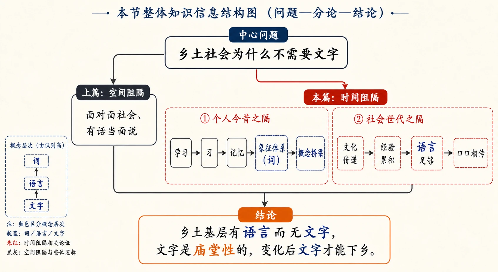
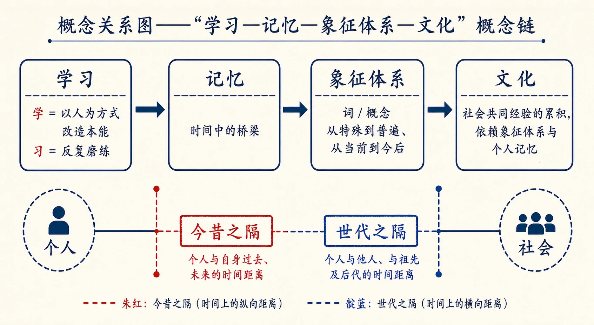
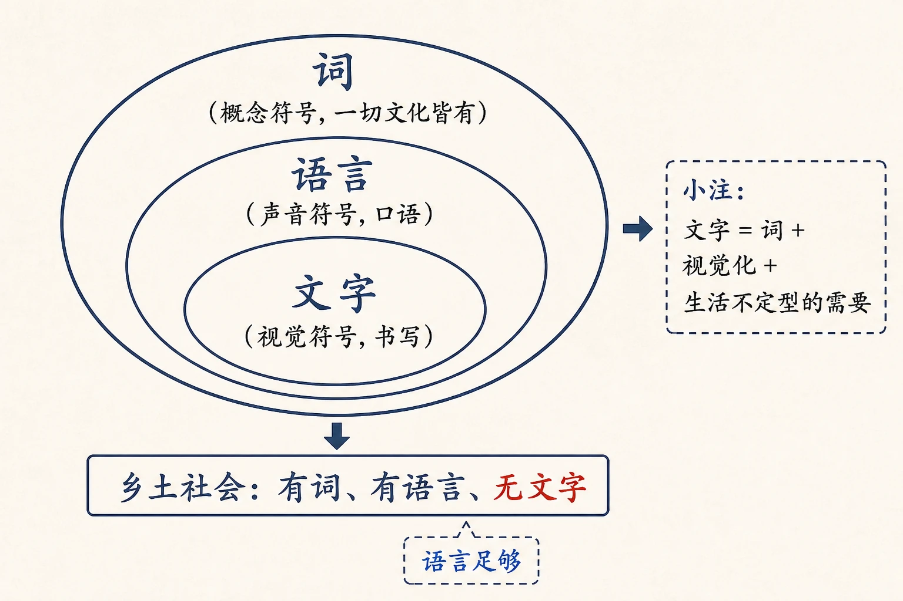

# 07 再论文字下乡

<!-- 图片描述：本节整体知识信息结构图，采用“问题—分论—结论”论证链。中心问题为“乡土社会为什么不需要文字”。向左上分支“上篇：空间阻隔——面对面社会、有话当面说”；向右下分支“本篇：时间阻隔——①个人今昔之隔：学习—习—记忆—象征体系（词）—概念桥梁；②社会世代之隔：文化传递—经验累积—语言足够、口口相传”。底部汇聚结论“乡土基层有语言而无文字，文字是庙堂性的，变化后文字才能下乡”。用朱红标出“时间阻隔”两个分支，靛蓝标出“词/语言/文字”概念层次，米白纸面、黑灰线条、中文标注、留白充足，符合语文文本精读风格。 -->

## 知识关系导航

- 所属章节：[[章首 学习导图|《乡土中国》学习导图]]
- 前置知识点：[[06-文字下乡#三、课文原文与逐段/逐句解读|文字下乡：空间阻隔与面对面的社群]]（本篇承接其空间阻隔论证，续论时间阻隔）
- 前置知识点：[[05-乡土本色#二、整体内容与结构线索|乡土性与熟悉社会]]（面对面社会与文字需求的起点）
- 后续知识点：[[08-差序格局#知识点一：团体格局与差序格局|差序格局]]（由人际基础转向关系结构）
- 相关知识点：[[12-礼治秩序#三、课文原文与逐段/逐句解读|传统与社会经验]]（文化即传统，与本章“文化是累积的经验”呼应）

本章是《乡土中国》第三章，紧接《文字下乡》而来。上篇从**空间阻隔**说明面对面的乡土社会不需要文字；本篇换一个角度，从**时间阻隔**（个人的今昔之隔、社会的世代之隔）推出同一结论：乡土基层“有语言而无文字”。两篇合看，才能完整理解作者对“文字下乡”问题的分析框架。

## 本节学习目标

- 理解“时间阻隔”的两方面含义：**个人的今昔之隔**与**社会的世代之隔**，并能用原文语句解释。
- 掌握“学习—记忆—象征体系—文化”这一概念链条，说明人类经验为何能累积传递，而动物不能。
- 区分“词”“语言”“文字”三个概念，理解“词不一定要文”“乡土社会有语言无文字”的判断依据。
- 理清本篇论证思路：承接上篇→提出时间阻隔→分别从个人与社会两个层面论证→得出“文字不能下乡”的结论。
- 能评价作者观点：乡土社会不需要文字是“结构性不需要”而非“乡下人愚”，并联系现代社会说明文字的作用。

## 核心知识点讲解

### 一、文本基本信息与学习任务

- **篇目**：《再论文字下乡》，选自费孝通《乡土中国》。
- **作者**：费孝通（1910—2005），中国社会学家、人类学家。他从社会结构解释社会现象，常以日常经验佐证抽象概念。
- **文体**：学术随笔／社会学论述文。本文以设问推进、因果相扣，语言平易而层次分明。
- **学习任务**：理解作者从时间维度论证“乡土社会不需要文字”；把握“学习/记忆/象征体系/文化”概念群；训练因果链概括与观点评价。

### 二、整体内容与结构线索

本文论证线索如下：

1. **承接**：上篇已从空间阻隔（面对面社会）说明乡土社会不需要文字；本篇从时间阻隔补充论证。
2. **提出概念**：时间阻隔分两方面——个人的“今昔之隔”、社会的“世代之隔”。
3. **论个人层面**：人靠学习打破今昔之隔，学习依赖记忆，记忆依赖象征体系（词）把具体情境抽象为概念，从而在“当前”与“过去”之间架桥。
4. **论社会层面**：人的经验通过象征体系累积成文化，文化靠记忆代代相传；乡土社会历世不移，经验只需“保存”不必“累积”，语言已足够传递，故不需要文字。
5. **得出结论**：乡土基层“有语言而无文字”；文字最早是庙堂性的，只有乡土基层发生变化后，文字才能下乡。

### 三、课文原文与逐段/逐句解读

**【原文】**
> 在上一篇“文字下乡”里，我说起了文字的发生是在人和人传情达意的过程中受到了空间和时间的阻隔的情境里。可是我在那一篇里只就空间阻隔的一点说了些话。乡土社会是个面对面的社会，有话可以当面说明白，不必求助于文字。这一层意思容易明白，但是关于时间阻隔上怎样说法呢？在本文中，我想申引这一层意思了。
> 所谓时间上的阻隔有两方面：一方面是个人的今昔之隔；一方面是社会的世代之隔。

**【解读】**
- **结构作用**：开篇点明本文是上篇的“续论”，锁定论证任务是“时间阻隔”。
- **关键词**：“面对面的社会”回应《乡土本色》的“熟悉社会”；“今昔之隔”指个人现在的我与过去的我之间的隔断，“世代之隔”指上一代与下一代之间的隔断。

**【原文】**
> 人的生活和其他动物所不同的，是在他富于学习的能力。他的行为方式并不固执地受着不学而能的生理反应所支配。所谓学就是在出生之后以一套人为的行为方式作模型，把本能的那一套方式加以改造的过程。学的方法是“习”。习是指反复地做，靠时间中的磨练，使一个人惯于一种新的做法。因之，学习必须打破个人今昔之隔。这是靠了我们人类的一种特别发达的能力，时间中的桥梁，记忆。

**【解读】**
- **关键定义**：“学”是以人为的行为方式为模型改造本能的过程；“习”是反复做、靠时间磨练而习惯新做法。学+习=学习。
- **因果链**：学习需要“打破今昔之隔”，靠的是记忆这座“时间中的桥梁”。这里首次点出记忆在论证中的核心地位。

**【原文】**
> 在动物的学习过程中，我们也可以说它们有记忆，但是它们的“记忆”是在简单的生理水准上。一个小白老鼠在迷宫里学得了捷径，它所学得的是一套新的生理反应。和人的学习不相同的是它们并不靠一套象征体系的。人固然有很多习惯，在本质上是和小白老鼠走迷宫一般的，但是他却时常多一个象征体系帮他的忙。所谓象征体系中最重要的是“词”。

**【解读】**
- **对比**：动物学习停留在“生理反应”水准（白鼠走迷宫），人学习多一套“象征体系”。
- **关键词**：“象征体系”＝以符号（主要是词）代表事物的系统。这是人区别于动物、能累积经验的关键。

**【原文】**
> 我们不断地在学习时说着话，把具体的情境抽象成一套能普遍应用的概念，概念必然是用词来表现的，于是我们靠着词，使我们从特殊走上普遍，在个别情境中搭下了桥梁；又使我们从当前走到今后，在片刻情境中搭下了桥梁。……他有能力闭了眼睛置身于“昔日”的情境中，人的“当前”中包含着从“过去”拔萃出来的投影，时间的选择累积。

**【解读】**
- **核心作用**：词（概念）有两大桥梁功能——①从特殊到普遍（个别情境→可普遍应用的概念）；②从当前到今后（今昔之间搭桥）。
- **比喻理解**：动物与时间的接触是“一条直线”，人的时间因概念而“复杂”，能“闭眼置身昔日”，所以“当前”是过去投影的累积。

**【原文】**
> 在一个依本能而活动的动物不会发生时间上阻隔的问题……但是在人却不然，人的当前是整个靠记忆所保留下来的“过去”的累积。如果记忆消失了、遗忘了，我们的“时间”就可说是阻隔了。

**【解读】**
- 从反面强化论点：记忆一旦消失，“今昔之隔”就真正阻隔了人的时间感。记忆不是可有可无，而是时间连续性的保证。

**【原文】**
> 人之所以要有记忆，也许并不是因为他的脑子是个自动的摄影箱。人有此能力是事实，人利用此能力，发展此能力，还是因为他“当前”的生活必须有着“过去”所传下来的办法。我曾说人的学习是向一套已有的方式的学习。唯有学会了这套方式才能在人群中生活下去。这套方式并不是每个人个别的创制，而是社会的遗业。……他们并不能互相传递经验，互相学习，人靠了他的抽象能力的象征体系，不但累积了自己的经验，而且还可以累积别人的经验。上边所谓那套传下来的办法，就是社会共同的经验的累积，也就是我们常说的文化。文化是依赖象征体系和个人的记忆而维护着的社会共同经验。

**【解读】**
- **概念定名**：人学习的内容不是个人创制，而是“社会的遗业”；社会共同经验的累积＝**文化**。
- **关键定义（名句）**：文化是依赖象征体系和个人的记忆而维护着的社会共同经验。
- **对比收束**：动物不能互相传递经验；人靠象征体系“累积自己的经验”也“累积别人的经验”，故经验能一代代传下去。

**【原文】**
> 这样说来，每个人的“当前”，不但包括他个人“过去”的投影，而且还是整个民族的“过去”的投影。历史对于个人并不是点缀的饰物，而是实用的、不可或缺的生活基础。人不能离开社会生活，就不能不学习文化。文化得靠记忆，不能靠本能，所以人在记忆力上不能不力求发展。我们不但要在个人的今昔之间筑通桥梁，而且在社会的世代之间也得筑通桥梁，不然就没有了文化，也没有了我们现在所能享受的生活。

**【解读】**
- **深化**：每个人的“当前”＝个人过去的投影＋民族过去的投影（世代之隔的意义所在）。
- **历史观**：历史不是“点缀的饰物”，而是“实用的生活基础”——这是理解全章的关键判断，为“乡土社会为何要保存传统”张本。

**【原文】**
> 我说了这许多话，也许足够指明了人的生活和时间的关联了。在这关联中，词是最主要的桥梁。有人说，语言造成了人，那是极对的。《圣经》上也有上帝说了什么，什么就有了，“说”是“有”的开始。……没有象征体系也就没有概念，人的经验也就不能或不易在时间里累积，如要生活也不能超过禽兽。

**【解读】**
- **递进**：词（语言）是人与时间关联的“最主要的桥梁”；“语言造成了人”是对语言地位的极高评价。
- **注意分寸**：作者用《圣经》作比，但限定在“文化中是对的”，体现论证严谨。

**【原文】**
> 但是词却不一定要文。文是用眼睛可以看得到的符号，就是字。词不一定是刻出来或写出来的符号，也可以是用声音说出来的符号，语言。一切文化中不能没有“词”，可是不一定有“文字”。我这样说是因为我想说明的乡土社会，大体上，是没有“文字”的社会。在上篇，我从空间格局中说到了乡下人没有文字的需要，在这里我是想从时间格局中说明同一结果。

**【解读】**
- **关键辨析**：词（概念）→ 语言（声音符号）→ 文字（视觉符号）。一切文化必有“词”，但不一定有“文字”。
- **论证意图**：本篇从时间格局，与上篇从空间格局，殊途同归到“乡土社会没有文字”。

**【原文】**
> 我说过我们要发展记忆，那是因为我们生活中有此需要。没有文化的动物，能以本能来应付生活，就不必有记忆。……和我们眼睛所接触的外界我们并不都看见，我们只看见我们所注意的，我们的视线有焦点，焦点依着我们的注意而移动。注意的对象由我们选择，选择的根据是我们生活的需要。与我们生活无关的，我们不关心，熟视无睹。我们的记忆也是如此，我们并不记取一切的过去，而只记取一切过去中极小的一部分。……“记”带有在当前为了将来有用而加以认取的意思，“忆”是为了当前有关而回想到过去经验。……可是无论如何记忆并非无所为的，而是实用的，是为了生活。

**【解读】**
- **观点**：记忆是**有选择、为生活服务**的——“只看见我们所注意的”“只记取过去中极小的一部分”。
- **字源辨析**：“记”为将来有用而认取，“忆”为当前有关而回想到过去。记忆的实用性在此明确。

**【原文】**
> 在一个乡土社会中生活的人所需记忆的范围和生活在现代都市的人是不同的。乡土社会是一个生活很安定的社会。我已说过，向泥土讨生活的人是不能老是移动的。在一个地方出生的就在这地方生长下去，一直到死。极端的乡土社会是老子所理想的社会，“鸡犬相闻，老死不相往来”。……“生于斯，死于斯”的结果必是世代的黏着。……一生取给于这块泥土，死了，骨肉还得回入这块泥土。

**【解读】**
- **社会基础**：乡土社会安土重迁、世代黏着（呼应《乡土本色》的“不流动”“生于斯死于斯”），这是后文“经验只需保存”的前提。

**【原文】**
> 历世不移的结果，人不但在熟人中长大，而且还在熟悉的地方上生长大。……同一戏台上演着同一的戏，这个班子里演员所需要记得的，也只有一套戏文。他们个别的经验，就等于世代的经验。经验无需不断累积，只需老是保存。

**【解读】**
- **关键比喻**：“同一戏台上演着同一的戏”——乡土社会代代重复同一生活方式，个别经验等于世代经验。
- **结论**：经验“无需累积，只需保存”，这是乡土社会不需要文字（从而不需要扩大记忆）的社会原因。

**【原文】**
> 我记得在小学里读书时，老师逼着我记日记，我执笔苦思，结果只写下“同上”两字。那是真情，天天是“晨起，上课，游戏，睡觉”，有何可记的呢？老师下令不准“同上”，小学生们只有扯谎了。

**【解读】**
- **生活例证**：“同上”日记的幽默例证说明：定型生活中没有新内容，记忆/记录显得多余。
- **表达效果**：用亲身经历使抽象论证亲切可感，体现学术随笔的散文笔调。

**【原文】**
> 在定型生活中长大的有着深入生理基础的习惯帮着我们“日出而起，日入而息”的工作节奏。记忆都是多余的。“不知老之将至”就是描写“忘时”的生活。秦亡汉兴，没有关系。乡土社会中不怕忘，而且忘得舒服。只有在轶出于生活常轨的事，当我怕忘记时，方在指头上打二个结。

**【解读】**
- **深化**：定型生活里“记忆都是多余的”“不怕忘，忘得舒服”；“指头上打结”是外在记号的开端。
- **关键词**：“指头上的结”是文字的原始方式——用外在象征帮助记忆，标志从“内在记忆”走向“外在符号”。

**【原文】**
> 指头上的结是文字的原始方式，目的就是用外在的象征，利用联想作用，帮助人的记忆。在一个常常变动的环境中，我们感觉到自己记忆力不够时，方需要这些外在的象征。从语言变到文字，也就是从用声音来说词，变到用绳打结，用刀刻图，用笔写字，是出于我们生活从定型到不定型的过程中。在都市中生活，一天到晚接触着陌生面孔的人才需要在袋里藏着本姓名录、通信簿。在乡下社会中黏着相片的身份证，是毫无意义的。

**【解读】**
- **因果链**：生活从定型→不定型 → 记忆不够 → 需要外在象征 → 语言发展为文字。
- **对比例证**：都市人需要“姓名录、通信簿”，乡下人不需要“身份证”，说明文字需求源于生活的不定型与陌生人社会。

**【原文】**
> 在一个每代的生活等于开映同一影片的社会中，历史也是多余的，有的只是“传奇”。一说到来历就得从“开天辟地”说起……都市社会里有新闻；在乡土社会，“新闻”是稀奇古怪、荒诞不经的意思。在都市社会里有名人，乡土社会里是“人怕出名猪怕壮”。……这种社会用不上常态曲线，而是一个模子里印出来的一套。

**【解读】**
- **对比词语**：都市“新闻/名人” vs 乡土“传奇/人怕出名猪怕壮”，词语含义折射社会性质。
- **关键词**：“一个模子里印出来的一套”＝乡土社会的同质化、定型化。

**【原文】**
> 在这种社会里，语言是足够传递世代间的经验了。当一个人碰着生活上的问题时，他必然能在一个比他年长的人那里问得到解决这问题的有效办法，因为大家在同一环境里，走同一道路，他先走，你后走；后走的所踏的是先走的人的脚印，口口相传，不会有遗漏。哪里用得着文字？时间里没有阻隔，拉得十分紧，全部文化可以在亲子之间传授无缺。

**【解读】**
- **正面对比结论**：语言足够传递世代经验，“口口相传，不会有遗漏”，“全部文化可以在亲子之间传授无缺”。
- **扣题**：“哪里用得着文字？”——从世代之隔（时间阻隔的社会方面）再次证明乡土社会不需要文字。

**【原文】**
> 这样说，中国如果是乡土社会，怎么会有文字的呢？我的回答是中国社会从基层上看去是乡土性，中国的文字并不是在基层上发生。最早的文字就是庙堂性的，一直到目前还不是我们乡下人的东西。……在这基层上，有语言而无文字。不论在空间和时间的格局上，这种乡土社会，在面对面的亲密接触中，在反复地在同一生活定型中生活的人们，并不是愚到字都不认得，而是没有用字来帮助他们在社会中生活的需要。我同时也等于说，如果中国社会乡土性的基层发生了变化，也只有在发生了变化之后，文字才能下乡。

**【解读】**
- **总结性结论**：中国文字并非在乡土基层发生，“最早的文字就是庙堂性的”；乡土基层“有语言而无文字”。
- **重要澄清**：乡下人不识字不是“愚”，而是“没有用字来帮助生活的需要”——这是对“文字下乡＝扫愚”流行看法的学术纠偏。
- **前瞻**：只有乡土基层发生变化，文字才能下乡。为后文讨论社会变迁（如《名实的分离》《从欲望到需要》）埋下伏笔。

### 四、关键语句、人物/意象与细节精读

- **“所谓学就是在出生之后以一套人为的行为方式作模型，把本能的那一套方式加以改造的过程。学的方法是‘习’。”**：给“学习”下操作性定义，是全文论证的起点。
- **“文化是依赖象征体系和个人的记忆而维护着的社会共同经验。”**：全章最核心的定义，串联记忆、象征体系、文化三个概念。
- **“历史对于个人并不是点缀的饰物，而是实用的、不可或缺的生活基础。”**：确立“传统/历史=生活工具”的价值立场。
- **“经验无需不断累积，只需老是保存。”**：乡土社会与现代社会在经验处理方式上的分界。
- **“并不是愚到字都不认得，而是没有用字来帮助他们在社会中生活的需要。”**：作者对“乡下人愚”的正面回应，体现其结构分析的立场。
- **意象·戏台**：同一戏台上演同一出戏，比喻乡土社会代代重复、经验只需保存。
- **意象·指头上的结**：文字的最原始方式——外在象征帮助记忆，暗示文字发生于生活“不定型”之时。
- **人物·小白老鼠（实验）**：动物学习停留在生理反应，与人靠象征体系学习形成对照。
- **人物·老子（思想背景）**：“鸡犬相闻，老死不相往来”的理想社会，是极端乡土社会的思想原型。

### 五、语言风格与表达手法

- **平易亲切**：以“我执笔苦思写下‘同上’”“指头上打结”等亲身经验开道，化抽象为具体。
- **层层因果**：学习→记忆→象征体系→文化→世代传递，环环相扣，是典型的因果论证。
- **对比论证**：动物 vs 人、语言 vs 文字、都市 vs 乡土、定型 vs 不定型，处处对照推进。
- **定义与辨析**：先定义“学/习/记忆/文化”，再辨析“词/语言/文字”，概念边界清晰。
- **设问推进**：“怎么会有文字的呢？”以问句承转，引导读者思考。

### 六、主题思想、情感态度与文化理解

- **主题**：从时间阻隔（个人今昔之隔、社会世代之隔）论证乡土社会“有语言而无文字”，说明文字的发生与社会的空间、时间格局相关，而不是与智力相关。
- **情感态度**：为乡下人辩护——不识字是“没有需要”而非“愚”，体现作者对乡土社会的尊重与理解；同时对“文字是庙堂性的”这一历史事实作冷静陈述，不带褒贬。
- **文化理解**：文化是依赖象征体系与记忆维持的社会共同经验；乡土社会靠“口口相传”维持文化，现代社会靠文字与普遍化知识维持文化。理解两种社会的不同“记”法，是理解“文字下乡”问题的钥匙。

### 七、阅读答题与写作迁移

- **答题模板（概念理解）**：先引定义，再拆层次（如“学=以人为方式改造本能；习=反复磨练”），最后说明在论证中的作用。
- **答题模板（因果链概括）**：按“前提→环节→结论”串联，如“定型生活→记忆多余→不需要外在象征→无文字”。
- **答题模板（观点评价）**：先概括作者观点，再指出其前提条件（如“乡土社会变化之后文字才能下乡”），最后联系现实谈启示。
- **写作迁移**：学习“设问推进+因果链条”的论证结构；学习用生活细节（同上日记、指头打结）佐证抽象观点。

<!-- 图片描述：概念关系图——“学习—记忆—象征体系—文化”概念链。横向箭头串联四个节点：学习（学=以人为方式改造本能，习=反复磨练）→记忆（时间中的桥梁）→象征体系（词/概念，从特殊到普遍、从当前到今后）→文化（社会共同经验的累积，依赖象征体系与个人记忆）。下方用朱红标注“今昔之隔”接通个人，靛蓝标注“世代之隔”接通社会。米白纸面、黑灰线条、中文标注。 -->

## 重点梳理

- **两个时间阻隔**：个人的今昔之隔；社会的世代之隔。
- **概念链条（学习与记忆）**：学习（学+习）→ 记忆（时间中的桥梁）→ 象征体系（词/概念）→ 文化（社会共同经验的累积）。
- **三词辨析（词与文字）**：词=概念符号（一切文化必有）；语言=声音符号；文字=视觉符号（非一切文化必有）。
- **核心结论**：乡土社会“有语言而无文字”；文字最早是庙堂性的；乡下人不识字是“没有需要”而非“愚”。
- **必记名句**：“文化是依赖象征体系和个人的记忆而维护着的社会共同经验”“历史对于个人并不是点缀的饰物，而是实用的、不可或缺的生活基础”“经验无需不断累积，只需老是保存”。
- **论证方法**：因果论证、对比论证（人/动物、都市/乡土）、举例论证（日记“同上”、指头打结、姓名录/身份证）、定义阐释。

## 难点突破

<!-- 图片描述：概念层级图——“词、语言、文字”的包含关系。底层外圈“词（概念符号，一切文化皆有）”，中间圈“语言（声音符号，口语）”，最内层“文字（视觉符号，书写）”，用三个同心椭圆表示层级。右侧小注：文字=词+视觉化+生活不定型的需要；下方箭头标注“乡土社会：有词、有语言、无文字”。朱红标出“无文字”，靛蓝标出“语言足够”，米白纸面、黑灰线条、中文标注。 -->

- **难点一：“今昔之隔”与“世代之隔”为何都叫“时间阻隔”？**
  突破：前者是**个人时间**上的断裂（现在的我与过去的我），靠记忆接通；后者是**社会时间**上的断裂（上一代与下一代），靠文化传递接通。两者都发生在“时间”轴上，故统称时间阻隔。
- **难点二：为什么说“经验无需累积，只需保存”？**
  突破：乡土社会历世不移，代代在同一环境走同一道路，个别经验=世代经验，所以不需要“累积新经验”，只需把已有的一套“保存”下来；保存靠口口相传即可，不需要文字。
- **难点三：作者说“词不一定要文”，如何理解？**
  突破：词是概念符号，可以靠声音（语言）表现，也可以靠笔画（文字）表现；乡土社会一切文化中都有词，但可以通过语言传递，不必书写成文字。
- **难点四：本篇与上篇《文字下乡》的关系？**
  突破：两篇分别从**空间阻隔**（面对面，有话当面说）与**时间阻隔**（经验定型、口口相传）论证同一结论，合起来构成对“文字下乡”的完整分析。

<!-- 图片描述：题型解题路径图——“因果链概括/概念辨析/语句赏析”三类题答题路径。因果链题：前提→中间环节→结论（如定型生活→记忆多余→不需外在符号→无文字）；概念辨析题：先定义→再拆层次→说明论证作用；语句赏析题：释义+手法+结构作用+情感。用三种不同颜色箭头区分三条路径，右侧标注常见扣分点。米白纸面、黑灰线条、中文标注。 -->

## 例题讲解

**例题1（因果链概括）** 概括作者从“个人今昔之隔”角度论证“乡土社会不需要文字”的因果链。
- **分析**：定位文中“学习→记忆→象征体系”与“定型生活→记忆多余”两段论证。
- **步骤/答案**：人靠学习打破今昔之隔，学习依赖记忆，记忆依赖象征体系（词）；但乡土社会定型不变，代代重复同一生活，个别经验等于世代经验，经验只需保存不必累积，记忆“多余”，故不需要外在的文字符号来帮忙记忆。
- **反思**：因果链题要“从前提一路推到结论”，中间环节不能跳步。

**例题2（概念辨析）** 区别“词”“语言”“文字”三个概念，并说明作者借此论证什么。
- **分析**：回扣原文“词却不一定要文”“一切文化中不能没有词，可是不一定有文字”。
- **答案**：词是表现概念的符号；语言是以声音表现词的符号；文字是以视觉符号（字）表现词的符号。一切文化必有词，但不一定有文字。作者借此说明乡土社会有语言（有词）而无文字，文字不是文化存在的必要条件。
- **反思**：辨析题要“先下定义，再指出差异维度（表现媒介）”，最后落到论证意图。

**例题3（语句赏析）** 赏析“历史对于个人并不是点缀的饰物，而是实用的、不可或缺的生活基础”。
- **分析**：这句话在“文化是累积的经验”论证后出现，是价值立场句。
- **答案**：运用对比（“点缀的饰物”vs“实用的生活基础”），强调传统/历史对个人生活具有实际功能——人是按过去传下来的办法生活的。它奠定了后文“乡土社会要保存传统”的论证基调，也体现了作者把文化看作生活工具的功能论视角。
- **反思**：赏析要“手法+内容+作用（结构/情感）”，不能只译句意。

**例题4（观点评价）** 作者认为乡下人不识字“不是愚，而是没有需要”。你同意吗？请结合文本与生活说明。
- **分析**：先还原作者论证（定型生活、口口相传、无文字需要），再作评价。
- **参考要点**：同意——文字需求源于生活的不定型与陌生化，乡土社会自给自足、代代相传，确实“用不上”文字；但也要指出，当社会变迁、乡土基层发生变化后，文字就变得必要，这正是作者“文字才能下乡”的预见。联系现实：信息化社会中识字与数字技能成为生存需要，印证“需要决定工具”。
- **反思**：评价题要“还原观点→分析依据→适度质疑/补充→联系现实”。

## 易错点整理

- **概念混用**：把“词”与“文字”混为一谈。避免：记清词（概念符号）→语言（声音）→文字（视觉）三层。
- **张冠李戴**：把“今昔之隔”说成“两代人之间”，把“世代之隔”说成“个人前后变化”。避免：今昔=个人时间；世代=社会时间。
- **结论绝对化**：把“乡土社会不需要文字”说成“乡土社会没有文化/没有词”。避免：作者明确说“一切文化中不能没有词”，只是“不一定有文字”。
- **误读动机**：把作者说成“贬低文字”或“主张不要学字”。避免：作者只是分析结构需要，还明确说“文字才能下乡”需要社会变化。
- **答题语言空泛**：答“论证严密”而无具体环节。避免：用“定型—保存—口口相传—无文字需要”等原文术语落地。

## 考点考证点整理

### 考点一：论证思路梳理
- **出题思路**：要求概括本文论证结构，或说明上篇与本篇的关系。
- **关键条件**：抓住“承接上篇→提出时间阻隔→个人层面→社会层面→结论”的层次。
- **解答要点**：分点写清“从空间到时间”“今昔之隔/世代之隔”“结论：有语言而无文字”。
- **易扣分点**：漏掉“承接上篇”的过渡；只答内容不答论证层次。

### 考点二：概念阐释与辨析
- **出题思路**：解释“学习”“记忆”“文化”，或辨析“词/语言/文字”。
- **关键条件**：回到原文定义句（“所谓学就是……”“文化是依赖象征体系……”）。
- **解答要点**：先引定义，再拆层次，最后说明概念在论证中的作用。
- **易扣分点**：只用自己话转述而失准；把“语言”与“文字”混同。

### 考点三：关键语句含意
- **出题思路**：赏析“经验无需不断累积，只需老是保存”“历史对于个人并不是点缀的饰物”等。
- **关键条件**：把句子放回“定型社会—保存经验”的语境。
- **解答要点**：释义+手法+结构作用+情感/立场。
- **易扣分点**：孤立翻译；漏掉“结构作用”（如承上启下、点明主旨）。

### 考点四：论证方法与语言特色
- **出题思路**：分析本文如何论证，或评析语言的平易性。
- **关键条件**：识别因果、对比、举例、定义等方法的标志（“因之”“所以”“如果……就……”）。
- **解答要点**：方法名+文本实例+效果（深入浅出、逻辑严密）。
- **易扣分点**：只列方法名不举例；把“举例（同上日记）”说成“比喻论证”。

### 考点五：观点评价与迁移
- **出题思路**：评价“乡下人不识字是因为没有需要”，或谈“文字下乡”的当代启示。
- **关键条件**：兼顾“结构需要”与“社会变迁后的变化”两方面。
- **解答要点**：还原观点→分析依据→适度质疑→联系现实（信息时代文字/数字能力成为必需）。
- **易扣分点**：只批评“作者看不起乡下人”或只赞同一面，失之片面。

## 练习题

> 说明：本章源文（费孝通《乡土中国·再论文字下乡》）未附课后练习题，以下题目根据本章核心考点自拟，用于巩固整本书阅读与论述类文本阅读能力。

**一、基础理解（自拟）**
1. 作者所说的“时间阻隔”包括哪两方面？请分别用一句话解释。
2. 根据原文，用一句话给“文化”下定义。

**二、文本分析（自拟）**
3. 作者说“词却不一定要文”，请结合文本说明“词”“语言”“文字”的关系。
4. 文中用“同一戏台上演着同一的戏”比喻什么？这个比喻对论证有何作用？

**三、鉴赏评价（自拟）**
5. 作者说乡下人不识字“并不是愚到字都不认得，而是没有用字来帮助他们在社会中生活的需要”，请结合全文分析这一判断的依据。
6. “历史对于个人并不是点缀的饰物，而是实用的、不可或缺的生活基础”，这句话在文中起什么作用？

**四、迁移写作（自拟）**
7. 作者认为“如果中国社会乡土性的基层发生了变化，也只有发生了变化之后，文字才能下乡”。联系现实，谈谈你对“当生活方式变化时，新的交流与记录工具如何被需要”的理解（不少于 200 字）。

## 练习题答案

**1.** 时间阻隔包括：①**个人的今昔之隔**——现在的我与过去的我之间的隔断，靠记忆接通；②**社会的世代之隔**——上一代与下一代之间的隔断，靠文化传递接通。
> 要点：必须点出“个人/社会”两个维度，只说“今昔”或“世代”不完整。

**2.** 文化是依赖象征体系和个人的记忆而维护着的社会共同经验。
> 要点：关键词“象征体系”“个人记忆”“社会共同经验”缺一不可。

**3.** 词是表现概念的符号，一切文化中必有词；语言是以声音表现词的符号（口语）；文字是以视觉符号（字）表现词的符号。词不一定用文字表现，也可以靠语言传递，故“一切文化中不能没有词，可是不一定有文字”。
> 评分：三层关系说清，落到“乡土社会有语言而无文字”。

**4.** 比喻乡土社会中代代重复同一生活方式，个别经验等于世代经验，经验“无需累积，只需保存”。作用：把抽象的“定型社会”具象化，自然引出“记忆多余、不需要文字”的结论，是因果论证的关键一环。

**5.** 依据：①乡土社会定型不变，语言口口相传即可传递世代经验，“全部文化可以在亲子之间传授无缺”；②文字是生活从定型到不定型过程中产生的，都市陌生人社会才需要姓名录、通信簿等外在符号；③文字的原始方式是“指头上的结”，源于记忆不够用，而乡土社会“不怕忘，忘得舒服”。故不识字是结构性的“没有需要”，而非智力问题。

**6.** 作用：①内容上，确立“传统/历史是生活工具”的价值立场；②结构上，承上（文化是累积的经验）启下（乡土社会要保存传统、口口相传），是论证链条的枢纽；③情感上，体现作者把文化看作实用工具的功能论视角。

**7.** （写作评分要点）能围绕“生活方式变化→工具需求产生”展开即可：如农业社会靠口传心授，工业/信息社会需要文字与数字化记录；乡土基层变化（城市化、流动性增强）后，契约、记录、普遍化知识成为必需，文字才“下乡”。要求联系具体生活实例（如电子支付、网络通讯、证件系统），逻辑清晰，不少于 200 字。
