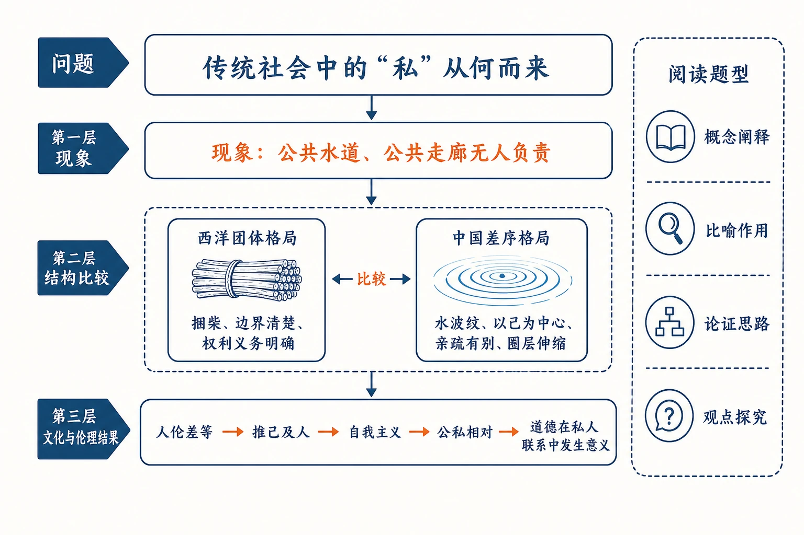
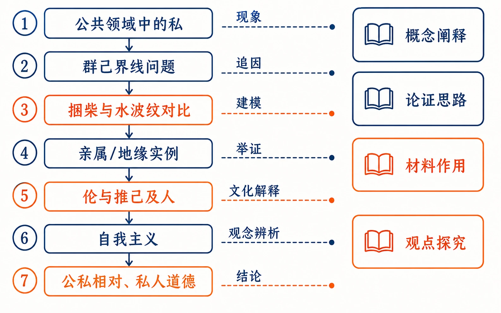
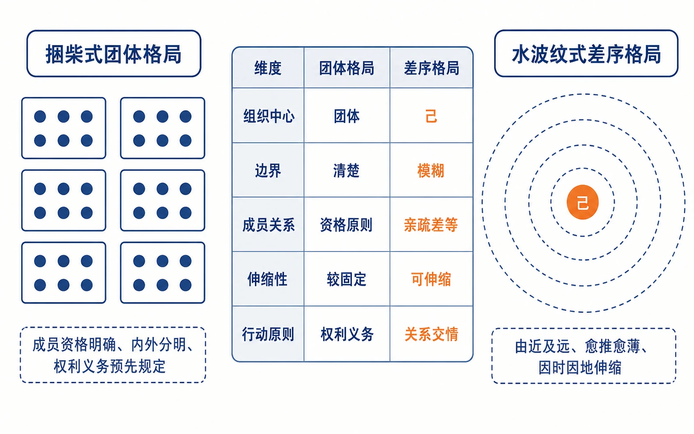
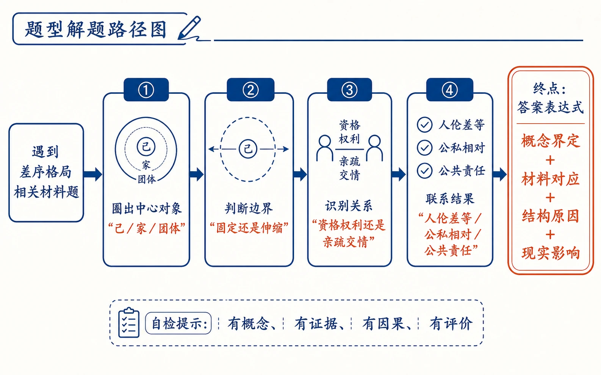

# 08 差序格局

<!-- 图片描述：本节整体知识信息结构图，采用“问题—概念—推论”论证链。中心问题为“传统社会中的‘私’从何而来”，向下分三层：第一层“现象：公共水道、公共走廊无人负责”；第二层“结构比较：西洋团体格局＝捆柴、边界清楚、权利义务明确；中国差序格局＝水波纹、以己为中心、亲疏有别、圈层伸缩”；第三层“文化与伦理结果：人伦差等—推己及人—自我主义—公私相对—道德在私人联系中发生意义”。右侧增加“阅读题型：概念阐释、比喻作用、论证思路、观点探究”。米白纸面、黑灰主线，朱红突出“差序格局”，靛蓝突出对比概念，中文标注、留白充足，符合语文文本精读风格。 -->

## 知识关系导航

- 所属章节：[[章首 学习导图|《乡土中国》学习导图]]
- 前置知识点：[[05-乡土本色#二、整体内容与结构线索|乡土性与熟悉社会]]
- 对比知识点：[[08-差序格局#知识点一：团体格局与差序格局|团体格局与差序格局]]
- 相关方法：[[08-差序格局#知识点五：比喻、对比与引用共同建模|比喻论证与对比论证]]

## 本节学习目标

- 理解“差序格局”的定义、构成要素和伸缩特点，能够用“中心—圈层—距离—变化”准确阐释概念。
- 从边界、成员关系、中心、伸缩性和权利义务五个维度比较“差序格局”与“团体格局”。
- 理清文章“从‘私’的现象提出问题—比较中西社会格局—解释人伦与自我主义—回到公私问题”的论证链。
- 理解“伦”“推己及人”“自我主义”“公私相对性”之间的逻辑联系，避免把结构分析简化为道德批评。
- 分析“捆柴”“水波纹”“蜘蛛网”“北辰”等比喻的概念功能，掌握论述类文本中比喻论证、对比论证和引用论证的答题方法。
- 能联系公共生活辨证评价差序格局：既看见关系互助和伦理推展，也看见公共责任弱化、规则边界模糊的风险。

## 核心知识点讲解

### 一、文本基本信息与学习任务

- **篇目**：《差序格局》，选自费孝通《乡土中国》。
- **作者**：费孝通（1910—2005），社会学家、人类学家。他以社会结构解释社会现象，避免把复杂问题简单归结为民族性或个人品德。
- **文体**：学术随笔、社会学论述文。文章将抽象概念与日常经验、经典文献、文学人物结合，既有学理性，也有可读性。
- **中心任务**：解释传统社会中“私”的现象为何普遍，并揭示其背后的关系结构——差序格局。
- **核心结论**：传统社会关系以“己”为中心，由一根根私人联系组成可伸缩的网络；亲疏远近构成人伦差序，公私界线也因此具有相对性。

### 二、整体内容与结构线索

文章不是先下定义再举例，而是从现实困惑逐层追因：

1. **提出问题**：公共水道、走廊、厕所等无人维护，公德心被自私心驱走。
2. **转换视角**：“私”不是绝对能力或简单品德问题，而是群己、人我界线怎样划分的问题。
3. **建立对照**：西洋社会像“捆柴”，团体边界清楚；传统中国社会像“水波纹”，以“己”为中心向外推展。
4. **展开证明**：从“家”的伸缩、亲属网络、街坊范围和势力变化说明差序格局。
5. **追溯文化**：以“伦”的含义和儒家“推”的伦理说明差等秩序。
6. **辨析观念**：区分自我主义和个人主义，说明前者以“己”为价值中心。
7. **回扣问题**：圈层可伸缩使公私界线相对化，也使社会道德主要在私人联系中发生意义。

<!-- 图片描述：文本结构图。七个纵向节点依次为“公共领域中的私→群己界线问题→捆柴与水波纹对比→亲属/地缘实例→伦与推己及人→自我主义→公私相对、私人道德”，节点之间用箭头标注“现象”“追因”“建模”“举证”“文化解释”“观念辨析”“结论”。将第三、第五、第七节点用朱红强调，右侧注明相应阅读题型。米白背景、黑灰线条、少量靛蓝辅助，中文标注。 -->

### 三、课文原文与逐段/逐句解读

#### 第一组：由公共空间中的“私”提出问题

**【原文】**

> 在乡村工作者看来，中国乡下佬最大的毛病是“私”。说起私，我们就会想到“各人自扫门前雪，莫管他家瓦上霜”的俗语。谁也不敢否认这俗语多少是中国人的信条。其实抱有这种态度的并不只是乡下人，就是所谓城里人，何尝不是如此。扫清自己门前雪的还算是了不起的有公德的人，普通人家把垃圾往门口的街道上一倒，就完事了。苏州人家后门常通一条河，听来是最美丽也没有了，文人笔墨里是中国的威尼斯，可是我想天下没有比苏州城里的水道更脏的了。什么东西都可以向这种出路本来不太畅通的小河沟里一倒，有不少人家根本就不必有厕所。明知人家在这河里洗衣洗菜，却毫不觉得有什么需要自制的地方。为什么呢？——这种小河是公家的。
>
> 一说是公家的，差不多就是说大家可以占一点便宜的意思，有权利而没有义务了。小到两三家合住的院子，公共的走廊上照例是尘灰堆积，满院生了荒草，谁也不想去拔拔清楚，更难以插足的自然是厕所。没有一家愿意去管“闲事”，谁看不惯，谁就得白服侍人，半声谢意都得不到。于是像格雷欣法则中坏钱驱逐好钱一般，公德心就在这里被自私心驱走。

**【解读】**

- **段落大意**：作者列举水道、走廊、荒草和厕所等生活现象，指出公共空间中常出现“有权利而没有义务”的行为。
- **重点词句**：“这种小河是公家的”是反讽式转折。“公家”本应意味着共同维护，在现实中却被误解成人人可以占便宜。
- **写作手法**：俗语引入、生活举例、反问、类比结合。格雷欣法则原指“劣币驱逐良币”，在此说明当维护公共环境得不到回报时，少数人的公德行为也难以持续。
- **结构作用**：用可感的现象设置悬念——“私”究竟只是品德问题，还是社会结构问题？

#### 第二组：把道德批评转化为结构分析

**【原文】**

> 从这些事上来说，私的毛病在中国实在是比愚和病更普遍得多，从上到下似乎没有不害这毛病的。现在已成了外国舆论一致攻击我们的把柄了。所谓贪污无能，并不是每个人绝对的能力问题，而是相对的，是从个人对公家的服务和责任上说的。中国人并不是不善经营，只要看南洋那些华侨在商业上的成就，西洋人谁不侧目？中国人更不是无能，对于自家的事，抓起钱来，拍起马来，比哪一个国家的人能力都大。因之这里所谓“私”的问题却是个群己、人我的界线怎样划法的问题。我们传统的划法，显然是和西洋的划法不同。因之，如果我们要讨论私的问题就得把整个社会结构的格局提出来考虑一下了。

**【解读】**

- **段落大意**：作者否定“能力低下”的简单解释，把问题提升为“群己、人我界线怎样划分”的结构问题。
- **论证转折**：华侨善于经商、自家事务经营有力，证明“无能”并非绝对；个人对“自家”和“公家”采取不同态度，关键在责任范围的划定。
- **结构作用**：这是全文的逻辑枢纽，使文章从现象描述进入概念建构。
- **阅读提醒**：作者是在解释“私”如何产生，不是在为损害公共利益的行为辩护。

#### 第三组：西洋社会的“团体格局”

**【原文】**

> 西洋的社会有些像我们在田里捆柴，几根稻草束成一把，几把束成一扎，几扎束成一捆，几捆束成一挑。每一根柴在整个挑里都属于一定的捆、扎、把。每一根柴也都可以找到同把、同扎、同捆的柴，分扎得清楚不会乱的。在社会，这些单位就是团体。我说西洋社会组织像捆柴就是想指明：他们常常由若干人组成一个个的团体。团体是有一定界限的，谁是团体里的人，谁是团体外的人，不能模糊，一定得分清楚。在团体里的人是一伙，对于团体的关系是相同的，如果同一团体中有组别或等级的分别，那也是事先规定的。我用捆柴来比拟，有一点不太合适，就是一个人可以参加好几个团体，而好几扎柴里都有某一根柴当然是不可能的，这是人和柴不同的地方。我用这譬喻是在想具体一些使我们看到社会生活中人和人的关系的一种格局。我们不妨称之作团体格局。
>
> 家庭在西洋是一种界限分明的团体。如果有一位朋友写信给你说他将要“带了他的家庭”一起来看你，他很知道要和他一同来的是哪几个人。在中国，这句话是含糊得很。在英美，家庭包括他和他的妻以及未成年的孩子。

**【解读】**

- **概念定义**：团体格局是边界清楚的社会组织形式，成员资格、内外区别及内部关系均较明确。
- **比喻作用**：“捆柴”把“个人属于团体、团体层层组合、边界能够识别”的抽象结构变得具体。
- **作者自校正**：作者也指出一个人可以参加多个团体，而一根柴不能同时属于几捆。主动说明比喻限度，体现学术严谨。
- **例证作用**：西洋“家庭”成员范围相对清楚，进一步证明团体边界明确。

#### 第四组：“家”的伸缩与水波纹模型

**【原文】**

> 提到了我们的用字，这个“家”字可以说最能伸缩自如了。“家里的”可以指自己的太太一个人，“家门”可以指伯叔侄子一大批，“自家人”可以包罗任何要拉入自己的圈子，表示亲热的人物。自家人的范围是因时因地可伸缩的，大到数不清，真是天下可成一家。
>
> 为什么我们这个最基本的社会单位的名词会这样不清不楚呢？在我看来却表示了我们的社会结构本身和西洋的格局是不相同的，我们的格局不是一捆一捆扎清楚的柴，而是好像把一块石头丢在水面上所发生的一圈圈推出去的波纹。每个人都是他社会影响所推出去的圈子的中心。被圈子的波纹所推及的就发生联系。每个人在某一时间某一地点所动用的圈子是不一定相同的。

**【解读】**

- **语言现象**：“家里的—家门—自家人”范围逐渐扩大，说明“家”不是边界固定的群体，而是可以按需要伸缩的关系圈。
- **核心比喻**：水波纹模型包含四层意思：以“己”为中心；关系一圈圈向外推；远近有差；圈子可因时因地改变。
- **对比关系**：“捆柴”突出边界，“水波纹”突出中心和距离；两种比喻共同完成中西社会结构的比较。
- **概念意义**：这段是“差序格局”定义的形象基础，答题时必须从比喻回到结构特征。

<!-- 图片描述：对比关系图。左侧画“捆柴式团体格局”：多个边界清晰的矩形团体，每个成员以等大圆点表示，标注“成员资格明确、内外分明、权利义务预先规定”；右侧画“水波纹式差序格局”：中心“己”向外形成亲疏不同的同心圆，标注“由近及远、愈推愈薄、因时因地伸缩”。中间列五个比较维度：组织中心、边界、成员关系、伸缩性、行动原则。朱红突出“己”，靛蓝突出“团体边界”，米白背景、黑灰线条。 -->

#### 第五组：亲属网络具有个别性

**【原文】**

> 我们社会中最重要的亲属关系就是这种丢石头形成同心圆波纹的性质。亲属关系是根据生育和婚姻事实所发生的社会关系。从生育和婚姻所结成的网络，可以一直推出去包括无穷的人，过去的、现在的和未来的人物。我们俗语里有“一表三千里”，就是这个意思，其实三千里者也不过指其广袤的意思而已。这个网络像个蜘蛛的网，有一个中心，就是自己。我们每个人都有这么一个以亲属关系布出去的网，但是没有一个网所罩住的人是相同的。在一个社会里的人可以用同一个体系来记认他们的亲属，所同的只是这体系罢了。体系是抽象的格局，或是范畴性的有关概念。当我们用这体系来认取具体的亲亲戚戚时，各人所认的就不同了。我们在亲属体系里都有父母，可是我的父母却不是你的父母。再进一步说，天下没有两个人所认取的亲属可以完全相同的。兄弟两人固然有相同的父母了，但是各人有各人的妻子儿女。因之，以亲属关系所联系成的社会关系的网络来说，是个别的。每一个网络有个“己”作为中心，各个网络的中心都不同。

**【解读】**

- **段落大意**：亲属称谓体系可以相同，但每个人实际拥有的亲属网络不同。
- **概念辨析**：“体系”是共同的抽象范畴，“网络”是以具体个人为中心的实际关系。不能因为称谓体系相同，就误以为关系网络相同。
- **比喻补充**：“蜘蛛网”强调联系交错，“水波纹”强调亲疏次序，二者都以“自己”为中心。
- **结论**：差序格局不是大家共享同一个关系圆，而是每个人各有一个相互交叠、并不完全相同的网络。

#### 第六组：地缘圈也随势力伸缩

**【原文】**

> 在我们乡土社会里，不但亲属关系如此，地缘关系也是如此。现代的保甲制度是团体格局性的，但是这和传统的结构却格格不相入。在传统结构中，每一家以自己的地位作中心，周围划出一个圈子，这个圈子是“街坊”。有喜事要请酒，生了孩子要送红蛋，有丧事要出来助殓、抬棺材，是生活上的互助机构。可是这不是一个固定的团体，而是一个范围。范围的大小也要依着中心的势力厚薄而定。有势力的人家的街坊可以遍及全村，穷苦人家的街坊只是比邻的两三家。这和我们的亲属圈子是一样的。像贾家的大观园里，可以住着姑表林黛玉、姨表薛宝钗，后来更多了，什么宝琴、岫云，凡是拉得上亲戚的，都包容得下。可是势力一变，树倒猢狲散，缩成一小团。到极端时，可以像苏秦潦倒归来，“妻不以为夫，嫂不以为叔。”中国传统结构中的差序格局具有这种伸缩能力。
>
> 在孩子成年了住在家里都得给父母膳食费的西洋社会里，大家承认团体的界限。在团体里的有一定的资格。资格取消了就得走出这个团体。在他们不是人情冷热的问题，而是权利问题。在西洋社会里争的是权利，而在我们却是攀关系、讲交情。

**【解读】**

- **实例扩展**：差序格局不仅存在于血缘，也存在于街坊、交情等地缘和社会关系。
- **关键特点**：“街坊”是范围而非固定团体；中心势力强，圈子扩大，势力弱，圈子缩小。
- **文学材料作用**：大观园和苏秦的例子把“势力变化—圈子伸缩—世态炎凉”写得具体可感。
- **中西对照**：西洋团体按资格和权利处理关系，传统社会更看重关系和交情。这里是结构差别，不宜绝对化为所有个体行为。

#### 第七组：“伦”就是有差等的次序

**【原文】**

> 以“己”为中心，像石子一般投入水中，和别人所联系成的社会关系，不像团体中的分子一般大家立在一个平面上的，而是像水的波纹一般，一圈圈推出去，愈推愈远，也愈推愈薄。在这里我们遇到了中国社会结构的基本特性了。我们儒家最考究的是人伦，伦是什么呢？我的解释就是从自己推出去的和自己发生社会关系的那一群人里所发生的一轮轮波纹的差序。《释名》于伦字下也说“伦也，水文相次有伦理也”。潘光旦先生曾说：凡是有“仑”作公分母的意义都相同，“共同表示的是条理，类别，秩序的一番意思”。
>
> 伦重在分别，在《礼记·祭统》里所讲的十伦：鬼神、君臣、父子、贵贱、亲疏、爵赏、夫妇、政事、长幼、上下，都是指差等。“不失其伦”是在别父子、远近、亲疏。伦是有差等的次序。在我们现在读来，鬼神、君臣、父子、夫妇等具体的社会关系，怎能和贵贱、亲疏、远近、上下等抽象的相对地位相提并论？其实在我们传统的社会结构里最基本的概念，这个人和人往来所构成的网络中的纲纪，就是一个差序，也就是伦。

**【解读】**

- **定义落实**：“差”指亲疏、远近、长幼、贵贱等不同；“序”指这些差别按一定秩序排列。
- **引用作用**：《释名》、潘光旦和《礼记》从文字训诂、学术解释、经典制度三个层面证明“伦”重在条理与差等。
- **关键语句**：“愈推愈远，也愈推愈薄”准确概括关系强度随社会距离递减。
- **文化理解**：人伦不是抽象地要求所有人同等亲密，而是规定对不同关系对象承担不同程度、不同类型的责任。

#### 第八组：儒家伦理的“推”

**【原文】**

> 孔子最注重的就是水纹波浪向外扩张的“推”字。他先承认一个己，推己及人的己，对于这己，得加以克服于礼，克己就是修身。顺着这同心圆的伦常，就可向外推了。“本立而道生。”“其为人也孝悌，而好犯上者鲜矣，不好犯上而好作乱者，未之有也。”从己到家，由家到国，由国到天下，是一条通路。《中庸》里把五伦作为天下之达道。因为在这种社会结构里，从己到天下是一圈一圈推出去的，所以孟子说他“善推而已矣”。

**【解读】**

- **伦理路径**：先修己，再沿“己—家—国—天下”的圈层向外推展。
- **“克己”含义**：中心虽然是“己”，但不是纵容私欲，而是以礼约束自己，再把合宜的伦理责任推向他人。
- **引用作用**：《论语》《中庸》及孟子材料证明儒家伦理与差序结构相互对应。
- **逻辑关系**：差序格局是社会结构，“推己及人”是这种结构中的道德运行方式。

#### 第九组：自我主义不同于个人主义

**【原文】**

> 在这种富于伸缩性的网络里，随时随地是有一个“己”作中心的。这并不是个人主义，而是自我主义。个人是对团体而说的，是分子对全体。在个人主义下，一方面是平等观念，指在同一团体中各分子的地位相等，个人不能侵犯大家的权利；一方面是宪法观念，指团体不能抹杀个人，只能在个人们所愿意交出的一分权利上控制个人。这些观念必须先假定了团体的存在。在我们中国传统思想里是没有这一套的，因为我们所有的是自我主义，一切价值是以“己”作为中心的主义。

**【解读】**

- **个人主义**：以明确团体为前提，强调团体中个人的平等权利，也限制团体对个人的侵犯。
- **自我主义**：以“己”为关系网络和价值判断的中心，关系随离“己”的远近而有差等。
- **易混提醒**：二者都出现“个人/自我”，但分析单位不同。个人主义处理“分子与团体”的关系，自我主义处理“中心与圈层”的关系。
- **结构作用**：这一辨析把社会结构进一步落实到价值观念。

#### 第十组：孔子式“推展”与杨朱式“固守”

**【原文】**

> 自我主义并不限于拔一毛而利天下不为的杨朱，连儒家都该包括在内。杨朱和孔子不同的是杨朱忽略了自我主义的相对性和伸缩性。他太死心眼儿一口咬了一个自己不放；孔子是会推己及人的，可是尽管放之于四海，中心还是在自己。子曰：“为政以德，譬如北辰，居其所，而众星拱之。”这是很好的一个差序格局的譬喻，自己总是中心，像四季不移的北斗星，所有其他的人，随着他转动。
>
> 子贡曰：“如有博施于民，而能济众何如？可谓仁乎？”子曰：“何事于仁，必也圣乎！尧舜其犹病诸？夫仁者己欲立而立人，己欲达而达人，能近取譬，可谓仁之方也已。”
>
> 孔子的道德系统里绝不肯离开差序格局的中心，“君子求诸己，小人求诸人”。因之，他不能像耶稣一样普爱天下，甚至而爱他的仇敌，还要为杀死他的人求上帝的饶赦——这些不是从自我中心出发的。孔子呢？或曰：“以德报怨，何如？”子曰：“何以报德？以直报怨，以德报德。”这是差序层次，孔子是决不放松的。孔子并不像杨朱一般以小己来应付一切情境，他把这道德范围依着需要而推广或缩小。

**【解读】**

- **共同点**：杨朱和儒家都从“己”出发。
- **不同点**：杨朱固守“小己”，孔子能够由近及远“推己及人”；但推得再远，中心仍是“己”。
- **北辰比喻**：强调中心稳定、其他关系围绕中心排列，与水波纹共同说明差序格局。
- **材料作用**：“己欲立而立人”“以直报怨，以德报德”说明儒家之仁不是取消差等，而是在差等中扩展责任。

#### 第十一组：差序格局使群己界线具有相对性

**【原文】**

> 我们一旦明白这个能放能收、能伸能缩的社会范围就可以明白中国传统社会中的私的问题了。我常常觉得：“中国传统社会里一个人为了自己可以牺牲家，为了家可以牺牲党，为了党可以牺牲国，为了国可以牺牲天下。”这和《大学》的：
>
> 古之欲明明德于天下者，先治其国，欲治其国者，先齐其家，欲齐其家者，先修其身……身修而后家齐，家齐而后国治，国治而后天下平。
>
> 在条理上是相通的，不同的只是内向和外向的路线，正面和反面的说法，这是种差序的推浪形式，把群己的界线弄成了相对性，也可以说是模糊两可了。这和西洋把权利和义务分得清清楚楚的社会，大异其趣。

**【解读】**

- **两条相反路线**：“牺牲链”由外向内收缩，《大学》的“修齐治平”由内向外推展；二者都遵循圈层差序。
- **核心推论**：圈子能放能收，群己界线就不是固定的，判断“为公”还是“为私”要看行为者站在哪一圈。
- **论证技巧**：作者把看似相反的材料放在同一结构中解释，显示概念的解释力。

#### 第十二组：公私相对与国家边界

**【原文】**

> 为自己可以牺牲家，为家可以牺牲族……这是一个事实上的公式。在这种公式里，你如果说他私么？他是不能承认的，因为当他牺牲族时，他可以为了家，家在他看来是公的。当他牺牲国家为他小团体谋利益、争权利时，他也是为公，为了小团体的公。在差序格局里，公和私是相对而言的，站在任何一圈里，向内看也可以说是公的。其实当西洋的外交家在国际会议里为了自己国家争利益，不惜牺牲世界和平和别国合法权益时，也是这样的。所不同的，他们把国家看成了一个超过一切小组织的团体，为这个团体，上下双方都可以牺牲，但不能牺牲它来成全别种团体。这是现代国家观念，乡土社会中是没有的。
>
> 在西洋社会里，国家这个团体是一个明显的也是唯一特出的群己界线。在国家里做人民的无所逃于这团体之外，像一根柴捆在一束里，他们不能不把国家弄成个为每个分子谋利益的机构，于是他们有革命、有宪法、有法律、有国会等等。在我们传统里群的极限是模糊不清的“天下”，国是皇帝之家，界线从来就是不清不楚的，不过是从自己这个中心里推出去的社会势力里的一圈而已。所以可以着手的、具体的只有己，克己也就成了社会生活中最重要的德性，他们不会去克群，使群不致侵略个人的权利。

**【解读】**

- **公私相对性**：某个小圈层对其成员而言是“公”，对更大圈层却可能表现为“私”。因此，差序格局难以形成唯一、突出的公共边界。
- **国家比较**：团体格局中的国家边界明确，因而发展出限制国家与保障成员权利的制度；传统结构中的“国”只是从“己”推出的一圈，群的极限“天下”又较模糊。
- **德性差异**：差序格局重“克己”，因为可直接下手的是中心之“己”；团体格局则会提出“克群”，即限制团体权力侵害个人。
- **辩证阅读**：作者也指出西洋国家争利时会表现出圈层式的公私相对，说明两种格局是分析模型，不是把现实绝对二分。

#### 第十三组：收束全文并引出下篇

**【原文】**

> 在差序格局中，社会关系是逐渐从一个一个人推出去的，是私人联系的增加，社会范围是一根根私人联系所构成的网络，因之，我们传统社会里所有的社会道德也只在私人联系中发生意义。——这一点，我将留在下篇里再提出来讨论了。

**【解读】**

- **总结定义**：社会关系从个人推出，社会网络由私人联系构成。
- **因果结论**：既然关系以私人联系为基础，道德规范也会随具体关系远近而具有不同内容和强度。
- **结构作用**：回扣“私”的开篇问题，并以“留在下篇”承接《系维着私人的道德》，体现整本书章节间的递进关系。

### 四、关键语句、人物与细节精读

#### 1. “我们的格局不是一捆一捆扎清楚的柴……”

- **含义**：传统社会关系不是边界固定的团体，而是以个人为中心向外扩展的关系圈。
- **手法**：以水波纹比喻社会关系，使“中心性、差等性、伸缩性”可视化。
- **结构作用**：承接“家”字范围模糊的语言现象，开启差序格局的正式阐释。

#### 2. “愈推愈远，也愈推愈薄”

“远”表示社会距离，“薄”表示责任、情感和影响强度减弱。两个“愈”形成递进，简洁地写出差序格局的梯度。

#### 3. “伦是有差等的次序”

“伦”不是泛指人与人的关系，而是强调关系中的类别、亲疏和等级秩序。答题时要同时说出“有差别”和“有秩序”，不能只答其中一点。

#### 4. “在差序格局里，公和私是相对而言的”

这不是说公私毫无标准，而是说判断标准随圈层改变：维护家庭可能对家庭是“公”，对国家却可能是“私”。该句揭示公共伦理难题的结构根源。

#### 5. 潘光旦、杨朱、孔子等材料

- **潘光旦**：从“仑”字的共同意义解释条理、类别、秩序，帮助界定“伦”。
- **杨朱**：代表固守小己、不向外推展的一端。
- **孔子**：代表以“己”为中心又能推己及人的伦理路径。
- **耶稣、墨翟**：作为“超越个人中心、趋向普遍之爱”的对照项，突出儒家仁爱具有差序层次。

### 五、语言风格与表达手法

#### 1. 生活化与学术性结合

文章用水道、走廊、“带了他的家庭”、送红蛋等日常经验说明社会学问题，再用“团体格局”“差序格局”“自我主义”等术语提升为理论，深入浅出。

#### 2. 比喻承担概念建模

“捆柴”“水波纹”“蜘蛛网”“北辰”分别突出边界、圈层、网络和中心。它们不是普通修辞，而是帮助建立社会结构模型的论证工具。

#### 3. 对比推进辨析

文章连续比较中西家庭范围、成员资格、权利与交情、个人主义与自我主义、国家与天下，使概念边界越来越清楚。

#### 4. 引用形成多重证据

《释名》《礼记》《论语》《中庸》《孟子》《大学》等材料共同说明“伦”“克己”“推己及人”和“修齐治平”都具有由己及人的差序结构。

#### 5. 口语化表达增强现场感

“一口咬了一个自己不放”“谁不侧目”“树倒猢狲散”等表达活泼有力，缓解理论文字的艰涩；同时作者会主动说明比喻限度，保持论述严谨。

### 六、主题思想、情感态度与文化理解

- **主题思想**：文章揭示传统中国社会以“己”为中心、按亲疏远近形成可伸缩关系网络的差序格局，并由此解释人伦秩序、自我主义及公私相对性。
- **思维价值**：把“私”从道德标签转化为可分析的社会结构问题，体现“由现象追溯机制”的学术思维。
- **文化理解**：差序格局能够支持亲属、街坊之间的互助，也可能使公共责任受私人关系挤压。理解不等于赞同，批判也不等于简单否定传统。
- **现实意义**：现代公共生活需要稳定、普遍的规则，同时也要看到关系信任的社会功能；关键是防止私人关系破坏公共边界和公平原则。

### 七、阅读答题与写作迁移

- **概念阐释模板**：上位定义 + 构成要素 + 运行特点 + 文本例证。  
  示例：差序格局是以“己”为中心、由私人联系组成的社会关系网络；关系按亲疏远近一圈圈展开，强度逐渐减弱，并随情境和中心势力伸缩。
- **比喻作用模板**：指出本体和喻体 + 对应结构特征 + 论证效果。  
  示例：“水波纹”以同心圆对应人际圈层，以中心石子对应“己”，以波纹远近对应关系亲疏，使抽象结构具体可感。
- **论证思路模板**：先写什么现象，再提出什么问题；接着用何种对比建立概念；然后从哪些材料展开；最后得出什么结论。
- **观点探究模板**：准确复述观点 + 分析结构原因 + 结合材料评价 + 说明现实边界。
- **写作迁移**：学习本文“从日常现象破题—建立形象模型—多材料验证—回扣现实问题”的论述结构。

## 重点梳理

### 知识点一：团体格局与差序格局

| 比较维度 | 团体格局 | 差序格局 |
| --- | --- | --- |
| 形象模型 | 捆柴 | 水波纹、蜘蛛网 |
| 组织中心 | 团体 | 每个具体的“己” |
| 边界 | 清楚，成员内外可辨 | 模糊，可因时因地伸缩 |
| 成员关系 | 对团体的关系原则上相同，差别预先规定 | 依亲疏远近形成差等 |
| 运行方式 | 资格、权利、义务 | 关系、交情、人伦 |
| 典型例子 | 西洋家庭、国家 | 亲属圈、街坊圈、“自家人” |

### 知识点二：差序格局的四个核心特征

1. **中心性**：每个网络都有一个“己”。
2. **差等性**：关系有亲疏、远近、厚薄。
3. **伸缩性**：圈子随时间、地点、需要和势力变化。
4. **个别性**：每个人的实际关系网络都不完全相同。

### 知识点三：人伦与“推”

“伦”是有差等的次序；“推”是从己向外扩展伦理责任。二者结合，形成“以己为起点、按关系远近承担不同责任”的道德路径。

### 知识点四：自我主义与个人主义

- 自我主义：以“己”为价值中心，处理中心与圈层的关系。
- 个人主义：以团体为前提，处理个人与团体的权利边界，包含平等和宪法观念。

### 知识点五：比喻、对比与引用共同建模

- 比喻让结构可视化；
- 对比让概念边界清晰；
- 引用让社会结构与传统文化互相印证。

<!-- 图片描述：题型解题路径图。起点“遇到差序格局相关材料题”，分四步：①圈出中心对象“己/家/团体”；②判断边界是固定还是伸缩；③识别关系按资格权利还是亲疏交情运行；④联系结果“人伦差等/公私相对/公共责任”。右侧列答案表达式“概念界定＋材料对应＋结构原因＋现实影响”。用朱红标出判断词，靛蓝标出材料证据，浅灰纸面、黑灰线条、中文标注。 -->

## 难点突破

### 难点一：差序格局不等于“人际关系有远近”

仅说“关系有远近”不完整。差序格局还包括：以每个“己”为中心、私人联系构网、圈层能够伸缩、每个人的网络具有个别性。

### 难点二：“以己为中心”不等于绝对自私

差序格局以“己”为起点，但儒家要求“克己复礼”和“推己及人”。问题不在有没有向外责任，而在责任随关系远近呈差等，缺少对所有成员一体适用的固定公共边界。

### 难点三：怎样理解公私相对性

可用“三圈法”判断：

1. 先找行为者所在的小圈，如个人、家庭、小团体；
2. 再找受损或被牺牲的大圈，如宗族、国家、天下；
3. 判断行为对小圈是“公”，对大圈是否成了“私”。

### 难点四：两种社会格局不是现实的绝对二分

作者用模型突出结构差异，并不意味着西洋社会没有私人关系，或中国社会没有团体。原文还以西洋外交家为国家争利作补充，提醒读者保留分析分寸。

### 难点五：比喻为何属于论证而不只是修辞

比喻若只让语言生动，是修辞效果；本文比喻还承担概念定义和结构比较功能，因此答题必须写出喻体各部分与社会结构各要素的对应关系。

## 例题讲解

### 例题一：概念阐释

**题目**：结合全文，概括“差序格局”的基本特点。

**分析**：定位“水波纹”“蜘蛛网”“愈推愈远，也愈推愈薄”“伸缩能力”等语句，从中心、关系、强度、变化和个别性分点。

**答案**：

1. 以每个具体的“己”为中心；
2. 社会关系由私人联系一圈圈向外推展；
3. 关系按亲疏远近呈差等，越远越薄；
4. 圈子能随时间、地点、需要和中心势力伸缩；
5. 每个人的实际关系网络具有个别性。

**反思**：概念题不能只复述“像水波纹”，必须把比喻翻译成抽象特征。

### 例题二：比喻作用

**题目**：文章为什么同时使用“捆柴”和“水波纹”两个比喻？

**分析**：两个比喻互为对照，各自对应一种结构。

**答案**：“捆柴”突出团体格局成员归属明确、内外边界清楚；“水波纹”突出差序格局以“己”为中心、关系由近及远且能够伸缩。两相比照，使中西社会关系结构的差异具体可感，也为后文分析权利、交情和公私界线奠定基础。

**反思**：比喻赏析要写“本体—对应特征—论证作用”，不能只写“生动形象”。

### 例题三：论证思路

**题目**：请简要梳理本文的论证思路。

**答案**：文章先列举公共空间无人维护的现象，提出传统社会中的“私”问题；接着把问题转化为群己界线的结构问题，以“捆柴”和“水波纹”对比团体格局与差序格局；然后用“家”、亲属、街坊等材料说明差序格局的中心性、差等性和伸缩性，并借儒家经典解释人伦与推己及人；再辨析自我主义和个人主义；最后回到公私问题，指出差序格局使公私界线相对化，社会道德主要在私人联系中发生意义。

**反思**：论证思路题按“提出—分析—证明—推论—回扣”组织，既要有材料，也要有逻辑关系。

### 例题四：观点探究

**题目**：有人认为“差序格局必然导致自私”。请结合文本评价这一说法。

**答案**：这一说法过于绝对。差序格局确实以“己”为中心，责任随关系远近而变化，可能导致小圈利益压倒更大公共利益；但儒家伦理又要求克己、推己及人，使责任可以由己及家、国、天下扩展。问题的关键不是差序关系本身必然产生自私，而是能否建立不被私人关系突破的公共规则，并把对近者的责任扩展为对公共共同体的责任。

**反思**：评价题要“承认合理处—指出绝对化—回扣文本机制—提出边界”。

## 易错点整理

- **只把“私”归因于品德差**：忽略作者从群己界线和社会格局解释现象。避免：先写结构原因，再谈行为后果。
- **把差序格局等同于亲属制度**：亲属只是一个例子，街坊、交情、地缘关系也可按差序运行。
- **漏答伸缩性**：只答“以己为中心、亲疏有别”。避免：补上“因时因地、随势力厚薄变化”。
- **混淆个人主义与自我主义**：前者包含个人权利与限制团体，后者强调以己为圈层中心。
- **误读“推己及人”**：它不是取消差等的普遍平等，而是从己出发沿关系圈逐层推展。
- **把作者的解释当成辩护**：说明形成机制不等于赞成损公行为。
- **比喻题只答“生动形象”**：必须说明结构对应和概念作用。
- **绝对化中西差异**：文章使用理想类型式比较，也主动指出比喻和现实的限度。

## 考点考证点整理

### 考点一：核心概念阐释

- **出题思路**：给出“水波纹”“自家人”或亲属材料，要求解释差序格局。
- **关键条件**：中心是“己”；关系由私人联系构成；亲疏有差；范围伸缩；网络个别。
- **解答要点**：按“定义—特征—材料对应—影响”作答。
- **易扣分点**：照抄比喻、不提伸缩性；只讲人情，不讲社会结构。

### 考点二：概念比较

- **出题思路**：比较团体格局与差序格局，或个人主义与自我主义。
- **关键条件**：明确比较维度，不能把不同层面的概念混在一起。
- **解答要点**：团体格局重边界、资格、权利义务；差序格局重中心、距离、关系伸缩。个人主义处理个人与团体，自我主义处理中心与圈层。
- **易扣分点**：只各写一句定义，没有同维度比较；把个人主义误写成自私自利。

### 考点三：论证思路与段落作用

- **出题思路**：概括全文思路，或分析华侨例、水波纹段、结尾段的作用。
- **关键条件**：识别“现象—结构—文化—伦理—结论”的推进。
- **解答要点**：内容概括 + 与上下文逻辑关系 + 对中心论点的作用。
- **易扣分点**：只复述材料，不写“为何在此处出现”。

### 考点四：比喻论证

- **出题思路**：分析“捆柴”“水波纹”“蜘蛛网”“北辰”的表达效果。
- **关键条件**：找准本体、喻体及结构对应。
- **解答要点**：手法名称 + 具体对应 + 概念效果 + 对比或结构作用。
- **易扣分点**：答案停留在“生动形象”；把几个比喻的侧重点混为一谈。

### 考点五：引用材料的作用

- **出题思路**：分析《礼记》《论语》《大学》等引用如何服务论证。
- **关键条件**：辨别材料分别证明“伦”“推”“修齐治平”的哪一层。
- **解答要点**：概括引用内容，说明其与差序结构的对应，并指出增强文化厚度和说服力。
- **易扣分点**：只答“引用论证，增强说服力”，没有具体说明证明了什么。

### 考点六：现实评价与整本书阅读

- **出题思路**：联系社会生活评价人情、熟人关系、公共规则，或关联《乡土本色》。
- **关键条件**：从乡土性和熟悉社会说明差序格局的生活基础；评价时兼顾功能与局限。
- **解答要点**：关系网络可提供互助和信任；圈层偏私也可能侵蚀公共公平；现代治理需以普遍规则约束私人关系。
- **易扣分点**：脱离文本空谈；只赞美人情或只批判传统。

## 练习题

> 说明：源文件未附课后练习，以下题目依据本章核心内容自拟。

### 一、基础理解

1. 请用四个关键词概括差序格局的核心特征。
2. “团体格局”为什么可以用“捆柴”来比喻？
3. 作者为什么说“伦是有差等的次序”？

### 二、文本分析

4. 文章开头列举苏州水道、公共走廊等现象，有何作用？
5. “家里的”“家门”“自家人”三个说法如何证明差序格局？
6. 结合文本说明“自我主义”与“个人主义”的区别。
7. 分析“愈推愈远，也愈推愈薄”的含义和表达效果。

### 三、鉴赏评价

8. 作者引用《释名》《礼记》《论语》《大学》等材料，有何共同作用？
9. 有人说“作者把中国传统社会完全写成了自私社会”。请结合全文反驳这一观点。

### 四、整本书与迁移应用

10. 联系[[05-乡土本色|《乡土本色》]]，说明“熟悉社会”为什么容易形成差序格局。
11. 某社区业主只维护自家门前卫生，却把杂物堆在消防通道；当物业清理时，又以“大家都这样”为由反对。请用本文概念分析这一现象，并提出一条改进建议。
12. 仿照本文“现象—模型—论证—结论”的结构，以“群聊中的熟人规则”为话题写一段不少于 200 字的短论述。

## 练习题答案

### 一、基础理解答案

**1.** 中心性、差等性、伸缩性、个别性。  
说明：中心性指以“己”为中心；差等性指关系有亲疏厚薄；伸缩性指圈子因时因地和势力变化；个别性指每个人的实际网络不同。

**2.** 捆柴由一根根柴归入边界清楚的把、扎、捆，类似个人归属于界限明确的团体；团体成员资格、内外区别和内部关系可以辨认。  
评分要点：答出“归属”“边界”“成员关系”三个层面。

**3.** “伦”包含条理、类别和秩序；传统人际关系按父子、长幼、亲疏、贵贱等形成不同等级和责任，所以它不是无差别的关系，而是有差等的次序。

### 二、文本分析答案

**4.** ①具体呈现公共空间中“有权利而没有义务”的“私”；②从生活经验切入，增强可读性与现实感；③设置全文要解释的问题，为后文从群己界线和社会格局追因作铺垫。

**5.** 三个说法的指称范围由近到远，可以从配偶扩展到众多亲属乃至临时拉入圈子的人，且范围因时因地变化。这证明传统“家”不是边界固定的团体，而是以“己”为中心、能够伸缩的关系圈。

**6.** 自我主义以“己”为价值和关系网络中心，人与人按亲疏形成差等圈层；个人主义则先假定明确团体存在，强调团体成员平等、个人权利不受他人或团体任意侵犯。前者处理中心与圈层，后者处理个人与团体。

**7.** “远”指社会关系离中心越来越远，“薄”指情感、责任与影响强度逐渐减弱。两个“愈”形成递进，以简洁、有节奏的语言概括差序格局的梯度性，并照应水波纹比喻。

### 三、鉴赏评价答案

**8.** 这些材料从字义、礼制和儒家伦理等层面证明：传统关系重差等秩序，以“己”为起点，通过“克己”和“推己及人”向外扩展。引用既提供文化证据，又增强论证说服力，使社会学概念与传统思想相互印证。

**9.** 该说法不准确。作者确实指出差序格局会使公私界线相对化、小圈利益可能压倒公共利益，但他也说明儒家要求克己、推己及人，道德责任可以由己向家、国、天下扩展。全文重在解释“私”的结构根源，而不是把所有传统社会成员作道德定罪。

### 四、整本书与迁移应用答案

**10.** 《乡土本色》指出农业社会人口不流动，人们在长期、多方面接触中形成熟悉关系；《差序格局》进一步说明，这些熟悉关系以个人为中心，沿亲属、街坊和交情向外展开。熟悉社会缺少统一的陌生人契约，关系强度便更容易按亲疏远近形成差等和可伸缩的圈层。

**11.** 现象体现公私相对性：业主把自家范围视为需要维护的“公”，却把更大的消防通道当作可以占用的“公家”空间；“大家都这样”又形成劣性行为对公共责任的挤压。改进应建立对所有业主一体适用、责任明确的消防通道规则，并公开执行，使公共边界不随私人便利而伸缩。

**12.** 评分要点：

- **现象**：写出熟人群聊中规则因关系远近而变化的具体表现；
- **模型**：准确使用“中心、圈层、亲疏、伸缩”等概念；
- **论证**：至少包含一个具体例子和一组对比；
- **结论**：提出兼顾人情沟通与公共规则的判断；
- **表达**：不少于 200 字，逻辑清楚，避免只贴概念标签。
