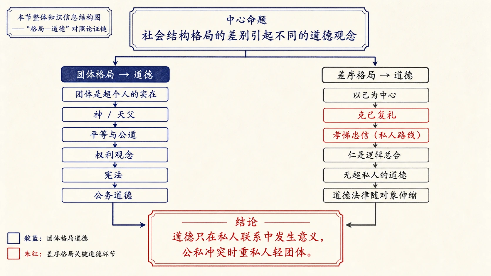
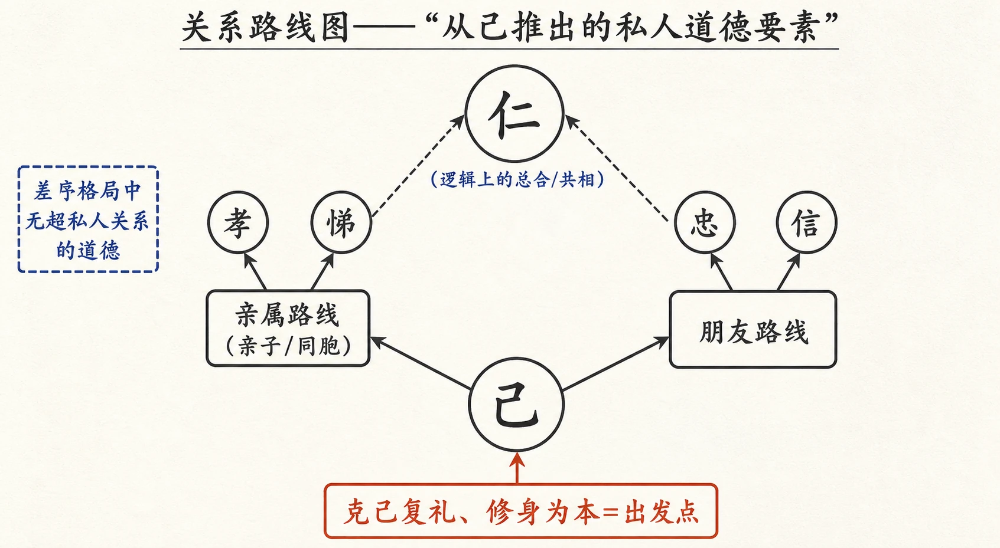
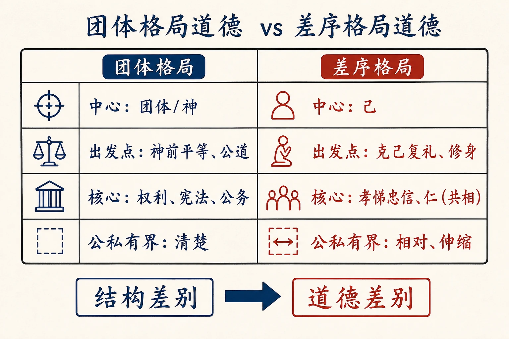
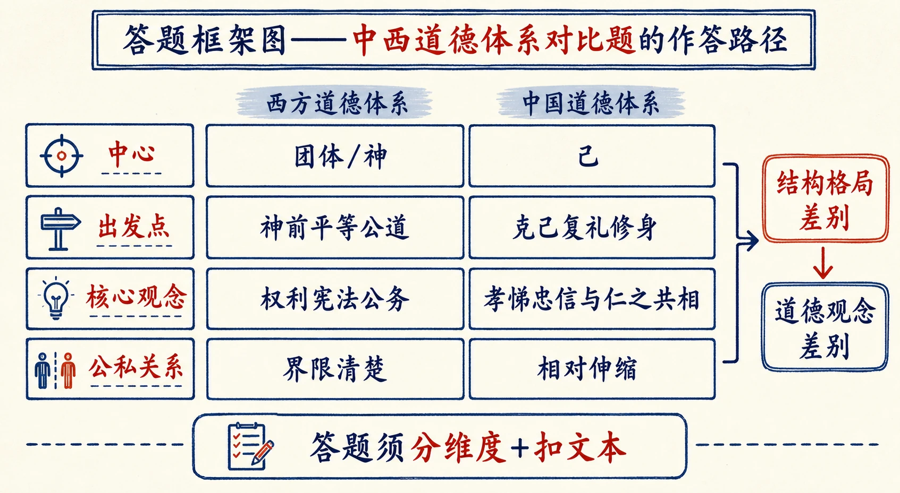

# 09 维系着私人的道德

<!-- 图片描述：本节整体知识信息结构图，采用“格局—道德”对照论证链。中心命题为“社会结构格局的差别引起不同的道德观念”。左侧分支“团体格局→道德：团体是超个人的实在—神/天父—平等与公道—权利观念—宪法—公务道德”；右侧分支“差序格局→道德：以己为中心—克己复礼—孝悌忠信（私人路线）—仁是逻辑总合—无超私人的道德—道德法律随对象伸缩”。底部结论“道德只在私人联系中发生意义，公私冲突时重私人轻团体”。朱红标出“克己复礼”“孝悌忠信”，靛蓝标出团体格局道德，米白纸面、黑灰线条、中文标注、留白充足，符合语文文本精读风格。 -->

## 知识关系导航

- 所属章节：[[章首 学习导图|《乡土中国》学习导图]]
- 前置知识点：[[08-差序格局#知识点一：团体格局与差序格局|差序格局与团体格局]]（本章的道德论直接承其结构论）
- 后续知识点：[[10-家族#三、课文原文与逐段/逐句解读|家庭、氏族与家族]]（把道德落在具体社群上）
- 相关知识点：[[07-再论文字下乡#二、整体内容与结构线索|文化是社会共同经验]]（“传统/经验”是道德得以维系的基础）
- 相关方法：[[08-差序格局#知识点五：比喻、对比与引用共同建模|对比论证与引用论证]]

本章紧接《差序格局》，是《乡土中国》第五章。上篇讲了社会结构格局，本篇讲与格局相应的道德体系：差序格局的道德以“己”为中心、由私人关系构成，没有一个超乎私人关系的统一道德观念。理解本章，关键是抓住“结构决定道德”的方法论——道德不是凭空的好人标准，而是社会格局的产物。

## 本节学习目标

- 理解“道德观念”的定义及其与社会结构格局的关系。
- 对比团体格局与差序格局的道德体系：出发点、核心要素、维系方式、公私关系。
- 理解“克己复礼”“壹是皆以修身为本”为何是差序格局道德的出发点。
- 理解“孝悌忠信”是私人关系的道德要素，而“仁”只是这些要素的逻辑总合。
- 分析“中国的道德和法律，都因所施对象与‘自己’的关系而伸缩”这一推论。
- 掌握对比论证、引用论证的答题方法，能评价“传统道德缺乏团体道德”的观点。

## 核心知识点讲解

### 一、文本基本信息与学习任务

- **篇目**：《维系着私人的道德》，选自费孝通《乡土中国》。
- **作者**：费孝通（1910—2005），中国社会学家、人类学家。他主张从社会结构而非个人品德解释社会现象。
- **文体**：学术随笔／社会学论述文。本文大量引用《论语》《孟子》与《独立宣言》等中西文献，论证中西道德体系的分野。
- **学习任务**：理解“结构→道德”的推导；把握差序格局道德体系的特点；训练对比论证、引用论证的答题与观点评价能力。

### 二、整体内容与结构线索

本文论证线索如下：

1. **提出前提**：中国乡土基层是差序格局，与西洋团体格局不同。
2. **给出定义**：道德观念是自觉应当遵守行为规范的信念，包括行为规范、行为者的信念和社会的制裁；它依社会格局而定。
3. **分析团体格局道德**：团体是超个人的实在，以宗教（神）为象征；派生“神前平等”与“公道”观念；有代理者（Minister）与权利、宪法观念；核心是公务、履行义务。
4. **转向差序格局道德**：出发点不是团体而是“己”——克己复礼、壹是皆以修身为本。
5. **展开私人道德要素**：亲属路线配孝悌，朋友路线配忠信；儒家“仁”只是这些要素的共相（逻辑总合），无法具体化为超私人关系的道德。
6. **辨析“忠”**：中国传统的“忠”是对人之诚（忠恕），不是对团体的“矢忠”；君臣以“义”结合，“忠臣”观念后起。
7. **用公私冲突证明**：舜的例子说明君王也要先完成私人道德；道德标准缺乏普遍性。
8. **总结推论**：差序格局的道德只在私人联系中发生意义，道德与法律都随对象与“自己”的关系伸缩。

### 三、课文原文与逐段/逐句解读

**【原文】**
> 中国乡土社会的基层结构是一种我所谓的“差序格局”，是一个“一根根私人联系所构成的网络”。这种格局和现代西洋的“团体格局”是不同的。在团体格局里个人间的联系靠着一个共同的架子；先有了这架子，每个人结上这架子，而互相发生关联。“公民”的观念不能不先有个“国家”。

**【解读】**
- **承接**：直接承接上篇结论——乡土基层是差序格局（私人联系构成的网络）。
- **对照引入**：团体格局中个人靠“共同的架子”关联，“公民”观念以“国家”为前提。为后文“团体格局道德”张本。

**【原文】**
> 这种结构很可能是从初民民族的“部落”形态中传下来的。部落形态在游牧经济中很显著的是“团体格局”的。生活相依赖的一群人不能单独地、零散地在山林里求生。在他们，“团体”是生活的前提。可是在一个安居的乡土社会，每个人可以在土地上自食其力地生活时，只在偶然的和临时的非常状态中才感觉到伙伴的需要。在他们，和别人发生关系是后起和次要的，而且他们在不同的场合下需要着不同程度的结合，并不显著地需要一个经常的和广被的团体。因之他们的社会采取了“差序格局”。

**【解读】**
- **发生学解释**：团体格局来自“部落/游牧”——生存依赖使团体成为前提；差序格局来自“安居的乡土社会”——自食其力，只在偶然非常状态才需要伙伴。
- **关键词**：“团体是生活的前提” vs “和别人发生关系是后起和次要的”，两种格局的经济基础被点明。

**【原文】**
> 社会结构格局的差别引起了不同的道德观念。道德观念是在社会里生活的人自觉应当遵守社会行为规范的信念。它包括着行为规范、行为者的信念和社会的制裁。它的内容是人和人关系的行为规范，是依着该社会的格局而决定的。从社会观点说，道德是社会对个人行为的制裁力，使他们合于规定下的形式行事，用以维持该社会的生存和绵续。

**【解读】**
- **核心定义（名句）**：道德观念=自觉应当遵守社会行为规范的信念，包含行为规范、行为者信念、社会制裁三要素。
- **方法论句**：道德“依着该社会的格局而决定”——这是全章的理论支柱：先有格局，后有道德。

**【原文】**
> 在“团体格局”中，道德的基本观念建筑在团体和个人的关系上。团体是个超于个人的“实在”，不是有形的东西。我们不能具体地拿出一个有形体的东西来说这是团体。它是一束人和人的关系，是一个控制各个人行为的力量，是一种组成分子生活所依赖的对象，是先于任何个人而又不能脱离个人的共同意志……这种“实在”只能用有形的东西去象征它、表示它。在“团体格局”的社会中才发生笼罩万有的神的观念。团体对个人的关系就象征在神对于信徒的关系中，是个有赏罚的裁判者，是个公正的维持者，是个全能的保护者。

**【解读】**
- **关键概念**：团体是“超于个人的实在”，只能用有形的东西（神）象征。
- **神的观念**：只在团体格局中才发生“笼罩万有的神”——神是团体的象征，有赏罚、公正、保护三种属性。

**【原文】**
> 在象征着团体的神的观念下，有着两个重要的派生观念：一是每个个人在神前的平等；一是神对每个个人的公道。
> 耶稣称神是父亲，是个和每一个人共同的父亲，他甚至当着众人的面否认了生育他的父母。为了要贯彻这“平等”，基督教的神话中，耶稣是童贞女所生的。亲子间个别的和私人的联系在这里被否定了。其实这并不是“无稽之谈”，而是有力的象征，象征着“公有”的团体，团体的代表——神，必须是无私的。每个“人子”，耶稣所象征的“团体构成分子”，在私有的父亲外必须有一个更重要的与人相共的是“天父”，就是团体。——这样每个个人人格上的平等才能确立，每个团体分子和团体的关系是相等的。团体不能为任何个人所私有。在这基础上才发生美国《独立宣言》中开宗明义的话：“全人类生来都平等，他们都有天赋不可夺的权利。”

**【解读】**
- **两个派生观念**：神前平等、神对个人的公道。
- **象征解读**：耶稣“童贞女所生”否定个别亲子联系，指向“天父=团体”；目的是确立“每个团体分子和团体的关系是相等”的平等观。
- **引证**：《独立宣言》“人生而平等”成为团体格局道德在政治上的表达。

**【原文】**
> 可是上帝是在冥冥之中，正象征团体无形的实在；但是在执行团体的意志时，还得有人来代理。“代理者”Minister是团体格局的社会中一个基本的概念。执行上帝意志的牧师是Minister，执行团体权力的官吏也是Minister，都是“代理者”，而不是神或团体的本身。这上帝和牧师、国家和政府的分别是不容混淆的。在基督教历史里，人们一度再度地要求直接和上帝交通，反抗“代理者”不能真正代理上帝的意旨。同样的，实际上是相通的，也可以说是一贯的，美国《独立宣言》可以接下去说：“人类为了保障这些权利，所以才组织政府，政府的适当力量，须由受治者的同意中产生出来；假如任何政体有害于这些目标，人民即有改革或废除任何政体之权。这些真理，我们认为是不证自明的。”
> 神对每个个人是公道的，是一视同仁的，是爱的；如果代理者违反了这些“不证自明的真理”，代理者就失去了代理的资格。团体格局的道德体系中于是发生了权利的观念。人对人得互相尊重权利，团体对个人也必须保障这些个人的权利，防止团体代理人滥用权力，于是发生了宪法。宪法观念是和西洋公务观念相配合的。

**【解读】**
- **代理者（Minister）**：神/团体与个人之间的执行者，牧师、官吏皆是代理者而非团体本身。
- **推论链**：代理者可能失格 → 需要权利观念 → 需要宪法约束 → 宪法与“公务”观念配合（国家可要求服务，但不得侵害权利）。

**【原文】**
> 我说了不少关于“团体格局”中道德体系的话，目的是在陪衬出“差序格局”中道德体系的特点来。从它们的差别上看去，很多地方是刚刚相反的。在以自己作中心的社会关系网络中，最主要的自然是“克己复礼”，“壹是皆以修身为本”——这是差序格局中道德体系的出发点。

**【解读】**
- **结构提示**：讲团体格局道德是“陪衬”，为反衬差序格局道德。
- **核心判断**：差序格局道德的出发点是“己”——克己复礼、壹是皆以修身为本（《大学》）。

**【原文】**
> 从己向外推以构成的社会范围是一根根私人联系，每根绳子被一种道德要素维持着。社会范围是从“己”推出去的，而推的过程里有着各种路线，最基本的是亲属：亲子和同胞，相配的道德要素是孝和悌。“孝悌也者其为仁之本欤。”向另一路线推是朋友，相配的是忠信。“为人谋而不忠乎？与朋友交而不信乎？”“主忠信，无友不如己者。”孔子曾总结说：“弟子入则孝，出则悌，谨而信，泛爱众，而亲仁。”

**【解读】**
- **关键模型**：从“己”推出去的每一条私人联系（绳子）配一种道德要素——亲属路线配孝悌，朋友路线配忠信。
- **引证**：引《论语》多处证明“孝悌忠信”是私人关系中的道德要素。

**【原文】**
> 在这里我得一提这比较复杂的观念“仁”。依我以上所说的，在差序格局中并没有一个超乎私人关系的道德观念，这种超己的观念必须在团体格局中才能发生。孝、悌、忠、信都是私人关系中的道德要素。但是孔子却常常提到那个仁字。《论语》中对于仁字的解释最多，但是也最难捉摸。一方面他一再地要给仁字明白的解释，而另一方面却又有“子罕言利，与命与仁”。孔子屡次对于这种道德要素“欲说还止”。

**【解读】**
- **问题提出**：差序格局中本无超私人关系的道德观念，但孔子常提“仁”，如何解释？
- **关键词**：“欲说还止”——孔子对“仁”难下定义，是全文要破解的谜。

**【原文】**
> 司马牛问仁。子曰：“仁者其言也讱。”曰，“其言也讱，斯谓之仁已乎？”子曰：“为之难，言之得无讱乎？”
> 子曰：“我未见好仁者……盖有之矣，我未之见也。”
> 孟武伯问：“子路仁乎？”子曰：“不知也。”又问。子曰：“由也，千乘之国，可使治其赋也，不知其仁也。”“求也何如？”子曰：“求也，千室之邑，百乘之家，可使为之宰也，不知其仁也。”“赤也何如？”子曰：“赤也，束带立于朝，可使与宾客言，不知其仁也。”
> 孔子有不少次数说“不够说是仁”，但是当他积极地说明仁字是什么时，他却退到了“克己复礼为仁”，“恭宽信敏惠”这一套私人间的道德要素了。他说：“能行五者于天下为仁矣。——恭则不侮，宽则得众，信则人任焉，敏则有功，惠则足以使人。”

**【解读】**
- **例证链**：孔子对“仁”总是“不知也”“其言也讱”（说不出口），正面解释时又回到“克己复礼”“恭宽信敏惠”等私人道德要素。
- **结论伏笔**：孔子说“仁”难的根源，即将由社会结构解释。

**【原文】**
> 孔子的困难是在“团体”组合并不坚强的中国乡土社会中并不容易具体地指出一个笼罩性的道德观念来。仁这个观念只是逻辑上的总合，一切私人关系中道德要素的共相，但是因为在社会形态中综合私人关系的“团体”的缺乏具体性，只有个广被的“天下归仁”的天下，这个和“天下”相配的“仁”也不能比“天下”观念更为清晰。所以凡是要具体说明时，还得回到“孝悌忠信”那一类的道德要素。

**【解读】**
- **核心结论**：“仁”只是私人道德要素的逻辑总合（共相），并非超私人关系的具体道德。
- **对照**：因为缺乏具体的“团体”，所以“仁”与“天下”一样模糊；要具体说明还得回到“孝悌忠信”。

**【原文】**
> 不但在我们传统道德系统中没有一个像基督教里那种“爱”的观念——不分差序的兼爱；而且我们也很不容易找到个人对于团体的道德要素。在西洋团体格局的社会中，公务，履行义务，是一个清楚明白的行为规范。而这在中国传统中是没有的。现在我们有时把“忠”字抬出来放在这位置上，但是忠字的意义，在《论语》中并不如此。

**【解读】**
- **双重缺失**：中国道德既无基督教式“兼爱”，也无“个人对团体的道德要素”（如西洋的“公务”）。
- **辨析“忠”**：后人把“忠”放在“对团体的道德”位置上，但《论语》中的“忠”并非此义。

**【原文】**
> 我在上面所引“为人谋而不忠乎”一句中的忠，是“忠恕”的注解，是“对人之诚”。“主忠信”的忠，可以和衷字相通，是由衷之意。
> 子张问曰：“令尹子文三仕为令尹，无喜色，三已之，无愠色。旧令尹之政，必以告新令尹。何如？”子曰，“忠矣。”这个忠字虽则近于“忠于职务”的忠字，但是并不包含对于团体的“矢忠”。其实，在《论语》中，忠字甚至并不是君臣关系间的道德要素。君臣之间以“义”相结合。“君子之仕也，行其义也。”所以“忠臣”的观念可以说是后起的，而忠君并不是个人与团体的道德要素，而依旧是对君私之间的关系。

**【解读】**
- **词义考辨**：“忠”在《论语》中=对人之诚、由衷之意（忠恕），或近于忠于职务，但不是对团体的“矢忠”。
- **重要判断**：君臣之间以“义”结合；“忠臣”观念后起；忠君是对君私人之关系，不是个人与团体的关系。

**【原文】**
> 团体道德的缺乏，在公私的冲突里更看得清楚。就是负有政治责任的君王，也得先完成他私人间的道德。《孟子·尽心上篇》有：桃应问，“舜为天子，皋陶为士，瞽叟杀人，则如之何？”孟子曰：“执之而已矣。”“然则舜不禁与？”曰：“夫舜恶得而禁之，夫有所授之也。”“然则舜如之何？”曰：“舜视弃天下，犹弃敝屣也。窃负而逃，遵海滨而处，终身诉然，乐而忘天下。”

**【解读】**
- **公私冲突例**：舜的父亲瞽叟杀人，皋陶（法官）依法应执之；舜作为天子不能徇私，作为儿子又不能不管父亲。孟子的理想解决是“弃天下如敝屣，窃负而逃”。
- **解读要点**：孟子承认两者都该做（两全），想以“逃到法律所不及处”化解；这正说明在差序格局里，私人道德（孝）先于、重于公共职务（天子）。

**【原文】**
> 另一个地方，孟子所遇到的问题，却更表现了道德标准的缺乏普遍性了。万章问曰：“象日以杀舜为事，立为天子，则放之，何也？”孟子曰：“封之也，或曰放焉。”万章曰：“象至不仁，封之有庳，有庳之人奚罪焉？仁人固如是乎？在他人则诛之，在弟则封之？”孟子的回答是“身为天子，弟为匹夫，可谓亲爱之乎？”

**【解读】**
- **第二个例子**：舜对想杀他的弟弟象，不杀反封（有庳）；对“他人”则诛，对“弟”则封——同一行为标准因人而异。
- **解读要点**：道德标准因对象与“自己”的亲疏而伸缩，缺乏普遍性。这是差序格局道德的典型表现。

**【原文】**
> 一个差序格局的社会，是由无数私人关系搭成的网络。这网络的每一个结都附着一种道德要素，因之，传统的道德里不另找出一个笼统性的道德观念来，所有的价值标准也不能超脱于差序的人伦而存在了。
> 中国的道德和法律，都因之得看所施的对象和“自己”的关系而加以程度上的伸缩。我见过不少痛骂贪污的朋友，遇到他的父亲贪污时，不但不骂，而且代他讳隐。更甚的，他还可以向父亲要贪污得来的钱，同时骂别人贪污。等到自己贪污时，还可以“能干”两字来自解。这在差序社会里可以不觉得是矛盾；因为在差序社会中，一切普遍的标准并不发生作用，一定要问清了，对象是谁，和自己是什么关系之后，才能决定拿出什么标准来。

**【解读】**
- **总结性判断**：差序格局由无数私人关系网络构成，每一“结”附一种道德要素，故没有笼统道德观念，价值标准不能超脱人伦。
- **推论**：道德与法律都随对象与“自己”的关系伸缩；普遍标准不发生作用——用“骂贪污却为父亲讳隐”的当代例子证明。

**【原文】**
> 团体格局的社会里，在同一团体的人是“兼善”的，就是“相同”的。孟子最反对的就是那一套。他说：“夫物之不齐，物之情也，子比而同之，是乱天下也。”墨家的“爱无差等”，和儒家的人伦差序，恰恰相反，所以孟子要骂他无父无君了。

**【解读】**
- **收束对照**：团体格局讲“兼善/相同”；儒家讲“物之不齐”，反对把不齐的物“比而同之”。
- **点睛**：墨家“爱无差等”与儒家“人伦差序”相反，故孟子骂墨家“无父无君”——兼爱与差序的根本冲突在此点破。

### 四、关键语句、人物/意象与细节精读

- **“社会结构格局的差别引起了不同的道德观念。”**：全章理论起点——结构决定道德。
- **“道德观念是在社会里生活的人自觉应当遵守社会行为规范的信念。”**：给“道德”下定义（行为规范+信念+社会制裁）。
- **“克己复礼”“壹是皆以修身为本”**：差序格局道德的出发点，落在“己”上。
- **“仁这个观念只是逻辑上的总合，一切私人关系中道德要素的共相。”**：破解“仁”难解之谜的关键句。
- **“中国的道德和法律，都因之得看所施的对象和‘自己’的关系而加以程度上的伸缩。”**：差序格局道德的直接推论，最具现实批判力。
- **人物·舜（孟子笔下的君主）**：弃天下如敝屣、窃负而逃——私人道德先于公共职务的典范。
- **意象·网络上的“结”**：每个私人联系之“结”附着一种道德要素（孝悌忠信），形象说明道德是“私人的、分条的”。
- **文化常识**：耶稣童贞女生、天父=团体的象征；Minister=代理者；《独立宣言》的平等观；《论语》“忠”的本义。

### 五、语言风格与表达手法

- **对比论证**：团体格局 vs 差序格局、兼爱 vs 差序、公务 vs 私人道德，处处对照。
- **引用论证**：大量引《论语》《孟子》《大学》《独立宣言》，且引后必解读，服务于论证。
- **概念辨析**：逐层辨析“仁”“忠”“兼爱”，破除望文生义。
- **举例论证**：痛骂贪污却为父亲讳隐，用当代生活经验佐证抽象推论。
- **严密推导**：由“格局→道德→公私冲突→道德法律伸缩”，一环扣一环。

### 六、主题思想、情感态度与文化理解

- **主题**：从社会结构解释中国道德体系的特点——差序格局下，道德以“己”为中心、由私人联系构成，缺乏超私人关系的统一道德与团体道德。
- **情感态度**：作者对中国传统道德作冷静的结构分析，不简单褒贬；对“公私冲突中重私轻公”的现象有现实批判意味，但归于结构原因而非个人品德。
- **文化理解**：理解“孝悌忠信”“仁”与“义”在传统语境中的具体内涵；理解中西道德差异的社会结构根源，避免把“中国人自私”当作先验结论。

### 七、阅读答题与写作迁移

- **答题模板（对比分析）**：先分述两概念内涵，再从“出发点、核心要素、维系方式、公私关系”分维度对比，最后点明各自社会基础。
- **答题模板（概念理解）**：先引原文定义，再拆层次（如“仁=共相/总合”），最后说明在论证中的作用。
- **答题模板（引用作用）**：引用内容+证明观点+与上下文关系。
- **写作迁移**：学习“先给理论前提，再层层推导推论”的论证结构；学习用生活细节验证抽象判断。

<!-- 图片描述：关系路线图——“从己推出的私人道德要素”。中心节点“己”，向外分两条路线：亲属路线（亲子/同胞）配道德要素孝、悌；朋友路线配忠、信；各路线汇合到上方的“仁”（逻辑上的总合/共相）。左侧用靛蓝小注“差序格局中无超私人关系的道德”，朱红标出“克己复礼、修身为本=出发点”。米白纸面、黑灰线条、中文标注。 -->

## 重点梳理

- **理论前提**：道德观念依社会格局而决定（结构→道德）。
- **两种道德体系**：
  - 团体格局：以团体（神）为中心，派生平等、公道、权利、宪法、公务观念。
  - 差序格局：以“己”为中心，克己复礼、修身为本；孝悌忠信为私人道德要素。
- **“仁”的定性**：私人道德要素的逻辑总合（共相），因无具体“团体”而无法具体化。
- **“忠”的辨析**：《论语》中“忠”=对人之诚/由衷，非对团体矢忠；忠臣观念后起；君臣以“义”结合。
- **公私冲突**：舜弃天下负父而逃；对弟则封、对他人则诛——道德标准因人伸缩。
- **必记名句**：“社会结构格局的差别引起了不同的道德观念”“克己复礼”“仁这个观念只是逻辑上的总合”“中国的道德和法律，都因之得看所施的对象和‘自己’的关系而加以程度上的伸缩”。
- **论证方法**：对比论证、引用论证、举例论证、概念辨析。

## 难点突破

<!-- 图片描述：对比表格图——“团体格局道德 vs 差序格局道德”。左右两栏对照：左栏“团体格局”标出“中心：团体/神”“出发点：神前平等、公道”“核心：权利、宪法、公务”“公私有界：清楚”；右栏“差序格局”标出“中心：己”“出发点：克己复礼、修身”“核心：孝悌忠信、仁（共相）”“公私有界：相对、伸缩”。表格下方箭头标注“结构差别→道德差别”。朱红标出差序格局一行，靛蓝标出团体格局一行，米白纸面、黑灰线条、中文标注。 -->

- **难点一：为什么说差序格局中“没有超乎私人关系的道德观念”？**
  突破：差序格局的社会关系由“一根根私人联系”构成，道德要素附着在每个“结”（关系）上（孝悌忠信），没有一个容纳所有关系的具体“团体”，也就无法形成超私人关系的统一道德。西洋有“团体”（神）作实在，才能有“爱/公道/权利”等普遍道德。
- **难点二：“仁”既然是“共相”，为什么孔子说不清？**
  突破：共相=从孝悌忠信等具体要素中抽出的共同性质，本身没有独立的具体内容；要具体说明时必须回到“克己复礼”“恭宽信敏惠”等私人要素。孔子“欲说还止”，正因他的社会（乡土）中没有具体“团体”可供“仁”附着。
- **难点三：孟子“舜负父而逃”是否违反法治？**
  突破：不要用现代法治观评价孟子。孟子的理想是“两全”（执与孝都要顾），只好逃到法律不及之地。这恰恰证明：在差序格局中，私人道德（孝）先于公共职务（天子/法治），是结构使然，不是孟子的“糊涂”。
- **难点四：“忠”为什么不能等同于“对团体的忠诚”？**
  突破：词义考辨——《论语》的“忠”是“为人谋而不忠乎”的“对人之诚”，与“衷”相通；令尹子文的“忠”近“忠于职务”但不含“矢忠”；君臣以“义”结合。“忠君”仍是对君私人的关系。把“忠”抬升为团体道德是现代误读。

<!-- 图片描述：答题框架图——中西道德体系对比题的作答路径。分四行对比：中心（团体/神 vs 己）、出发点（神前平等公道 vs 克己复礼修身）、核心观念（权利宪法公务 vs 孝悌忠信与仁之共相）、公私关系（界限清楚 vs 相对伸缩）。右侧箭头标注“结构格局差别→道德观念差别”，底部提示“答题须分维度+扣文本”。米白纸面、黑灰线条、朱红靛蓝标注。 -->

## 例题讲解

**例题1（对比分析）** 结合文本，比较“团体格局”与“差序格局”的道德体系。
- **分析**：回扣原文“目的是在陪衬出差序格局中道德体系的特点”。
- **答案**：团体格局以“团体（神）”为中心，出发点是人人在神前平等、神对个人公道；核心观念是权利、宪法与公务，公私有清楚的界限。差序格局以“己”为中心，出发点是克己复礼、壹是皆以修身为本；道德要素是孝悌忠信等私人关系要素，“仁”只是其共相；没有“对团体的道德”，公私有相对性，道德法律随对象伸缩。
- **反思**：对比题要分维度（中心/出发点/核心/公私），不能只堆结论。

**例题2（概念理解）** 作者如何解释孔子“仁”的难解？
- **分析**：定位“仁这个观念只是逻辑上的总合”段。
- **答案**：孔子所处的是团体不坚强的乡土社会，没有一个具体“团体”供“仁”附着；故“仁”只是孝悌忠信等私人道德要素的共相（逻辑总合），一旦具体说明就退回“克己复礼”“恭宽信敏惠”。这是用社会结构解释思想观念的范例。
- **反思**：解释类题要“回到结构找原因”，不能只谈孔子个人。

**例题3（引用作用）** 文中引《孟子》舜的两个故事，有何作用？
- **分析**：两个故事都在“团体道德缺乏，公私冲突”的语境下。
- **答案**：①内容上，以具体事例证明差序格局中私人道德先于公共职务、道德标准缺乏普遍性；②结构上，从“正面定义”转向“实例验证”，使抽象判断落地；③两例互补——前例（负父而逃）见“私德重”，后例（封弟）见“标准因人而异”。
- **反思**：引用作用题要答“内容+结构+效果”，且注意多个例子的分工。

**例题4（观点评价）** 作者说“中国的道德和法律，都因所施对象与‘自己’的关系而伸缩”。你如何看待？
- **分析**：先还原作者论证（差序格局→私人联系→标准因人而异），再评价。
- **参考要点**：一方面，这一判断准确描述传统社会中“讲关系、看交情”的道德实践，解释了许多公私不分、双标现象的社会根源；另一方面，现代社会要求普遍规则与权利平等，故需在承认结构遗产的同时推进“法律面前人人平等”，这正是《无讼》等篇讨论“法治下乡难”的伏笔。
- **反思**：评价题要“还原→分析→联系现实→辩证”。

## 易错点整理

- **道德观误读**：把本章说成“中国人没有道德”。避免：作者说的是“没有超乎私人关系的统一道德”，不是没有道德。
- **“仁”理解错位**：把“仁”说成“最高道德标准”或“团体道德”。避免：按作者定义——“共相/逻辑总合”，具体内容是孝悌忠信。
- **“忠”望文生义**：把《论语》的“忠”直接等同于“忠于国家”。避免：记清“对人之诚/由衷”的本义与“忠臣观念后起”的判断。
- **公私冲突误判**：说孟子“不支持法治”。避免：孟子的“逃”是两全的权宜，反映的是结构使然的私德优先，而非反法治。
- **论证方法混用**：把“引《论语》”说成“举例论证”。避免：引用论证是“引权威话语支撑观点”，举例论证是“用事例证明”，两者要分清。

## 考点考证点整理

### 考点一：概念理解与定义
- **出题思路**：解释“道德观念”“团体”“仁”“忠”等概念。
- **关键条件**：回到原文定义句与辨析段落。
- **解答要点**：先引定义，再拆层次，说明概念在论证中的作用。
- **易扣分点**：用现代含义替代原文含义（如“忠=爱国”）；只转述不定位。

### 考点二：对比分析（中西道德体系）
- **出题思路**：比较团体格局与差序格局的道德体系，或比较“兼爱”与“人伦差序”。
- **关键条件**：抓住“中心、出发点、核心观念、公私关系”四个维度。
- **解答要点**：分维度表述，每项点明各自社会基础。
- **易扣分点**：只各写一句；漏掉“公私伸缩”这一关键差异。

### 考点三：引用作用与论证方法
- **出题思路**：分析引《论语》《孟子》《独立宣言》的作用，或识别论证方法。
- **关键条件**：明确引用是为证明哪个观点服务。
- **解答要点**：引用内容+证明观点+结构作用（铺垫/反衬/印证）。
- **易扣分点**：只译引文不分析；把“引用”与“举例”混为一谈。

### 考点四：观点评价与现实意义
- **出题思路**：评析“道德随对象伸缩”，或谈传统道德对现代法治的影响。
- **关键条件**：兼顾结构解释与现实反思。
- **解答要点**：还原观点→分析依据→联系现实→辩证评价。
- **易扣分点**：只批评“中国人自私”；脱离文本空谈。

### 考点五：中心论点与结构把握
- **出题思路**：概括本文中心论点或论证思路。
- **关键条件**：抓住“结构决定道德”与“差序格局道德的特点”。
- **解答要点**：中心论点+分论点层次（前提→团体格局→差序格局→推论）。
- **易扣分点**：漏掉“团体格局是陪衬”的结构提示；把推论当论点。

## 练习题

> 说明：本章源文（费孝通《乡土中国·维系着私人的道德》）未附课后练习题，以下题目根据本章核心考点自拟，用于巩固整本书阅读与论述类文本阅读能力。

**一、基础理解（自拟）**
1. 根据原文，写出“道德观念”的定义。
2. 差序格局中道德体系的出发点是什么？

**二、文本分析（自拟）**
3. 作者为什么说孔子对“仁”的解释“最难捉摸”？他是如何用社会结构解释这一现象的？
4. 文中引《孟子》中“舜负父而逃”的故事，是为了说明什么？

**三、鉴赏评价（自拟）**
5. 分析本文对比论证的运用及效果。
6. 作者说“中国的道德和法律，都因之得看所施的对象和‘自己’的关系而加以程度上的伸缩”，请结合文本分析这一观点的依据与局限。

**四、迁移写作（自拟）**
7. 联系当代生活，谈谈“熟人社会”的私人道德与“法治社会”的普遍规则之间如何协调（不少于 200 字）。

## 练习题答案

**1.** 道德观念是在社会里生活的人自觉应当遵守社会行为规范的信念；它包括行为规范、行为者的信念和社会的制裁；其内容依社会格局而决定。
> 要点：三要素（规范、信念、制裁）+“依格局而定”缺一不可。

**2.** 差序格局中道德体系的出发点是“己”——“克己复礼”“壹是皆以修身为本”。
> 要点：必须是“己/克己复礼/修身”，不能写成“孝悌忠信”（那是从己推出的各路线上的要素）。

**3.** 作者认为“仁”只是私人关系中道德要素的共相（逻辑总合），本身没有独立具体内容；因为乡土社会中缺乏具体的“团体”供“仁”附着，所以孔子正面解释时只能回到“克己复礼”“恭宽信敏惠”等私人要素。这是以“结构决定道德”解释思想现象的范例。
> 评分：须答出“共相/总合”“缺乏团体”两个要点。

**4.** 说明差序格局中私人道德先于公共职务：舜作为天子须依法执父，作为儿子又不能不管父亲，孟子的“弃天下负父而逃”是两全的权宜；这证明传统道德在公私冲突时重私人轻团体，也印证了道德标准缺乏普遍性。
> 评分：答出“私德先于公职”与“两全的权宜”两层。

**5.** 对比论证贯穿全文：①结构上，先写团体格局道德（神、平等、公道、权利、宪法、公务）作“陪衬”，再写差序格局道德（己、克己复礼、孝悌忠信）作反衬；②内容上，“兼爱”对“人伦差序”、“公务”对“私人道德”逐一对照。效果：使差序格局道德的特点在对比中凸显，论证严密而有层次。
> 评分：须举出具体对照对象，不能只答“用了对比”。

**6.** 依据：差序格局由私人联系构成，每个“结”附着一种道德要素，没有统一普遍标准；故道德法律因对象与“自己”的亲疏而伸缩（如痛骂贪污却为父亲讳隐；对弟则封、对他人则诛）。局限：这一判断描述的是传统乡土社会的结构性现实，并未否认普遍规则的价值；作者在《无讼》等篇正指出，法治社会需要普遍标准，这正是从礼治走向法治的难点。
> 评分：依据与局限都要答，且局限要扣文本（非凭空批判）。

**7.** （写作评分要点）能辩证协调即可：利——熟人信任降低成本、人情温暖；弊——人情干扰规则、双标与庇护（如“为父亲讳隐”）。协调思路：公共领域坚持普遍规则与程序公正，私人领域保留温情与互助；法律面前人人平等，同时发挥调解、教化对礼俗的补充作用。要求结合实例，逻辑清晰，不少于 200 字。
