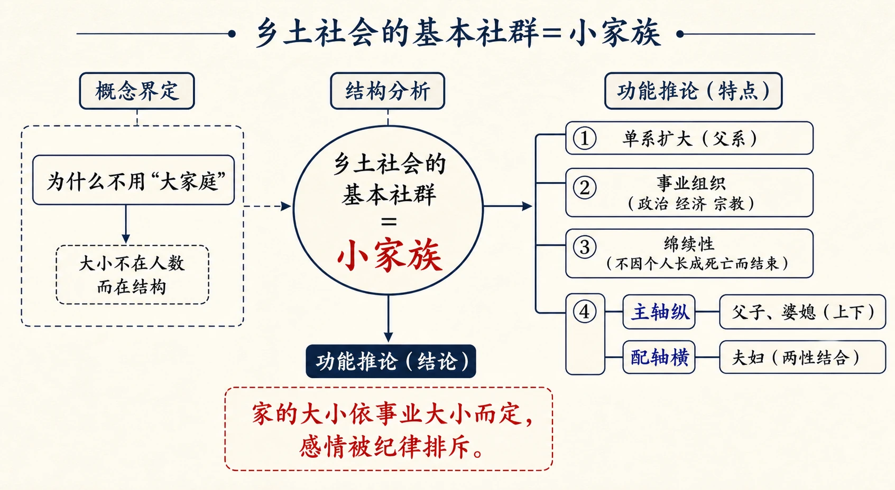
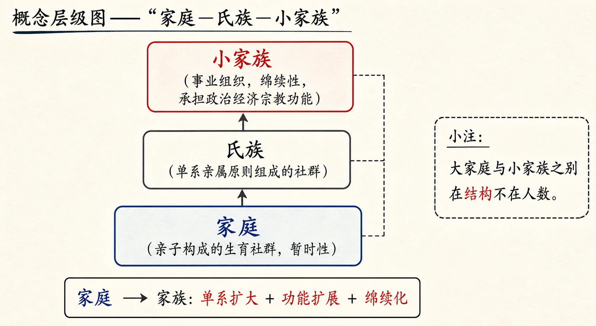
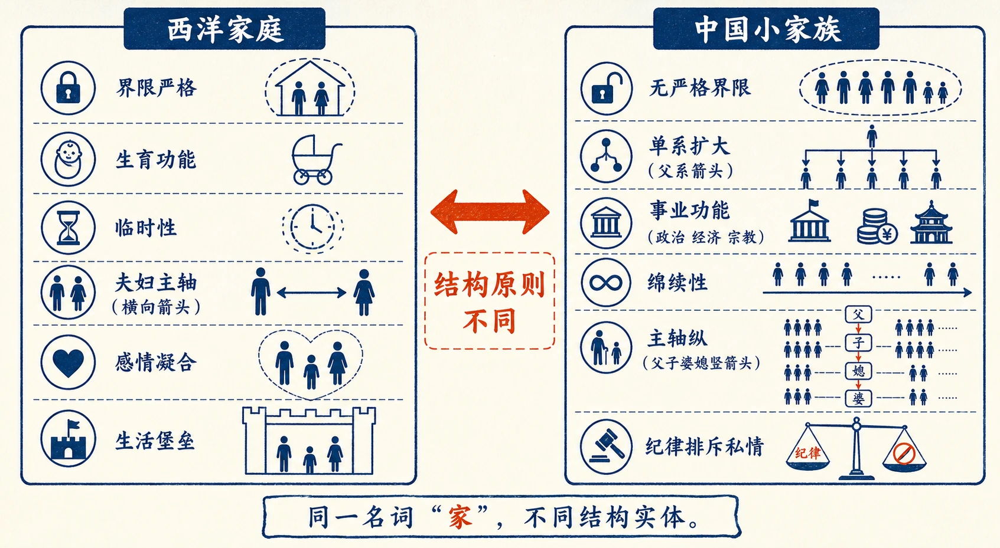
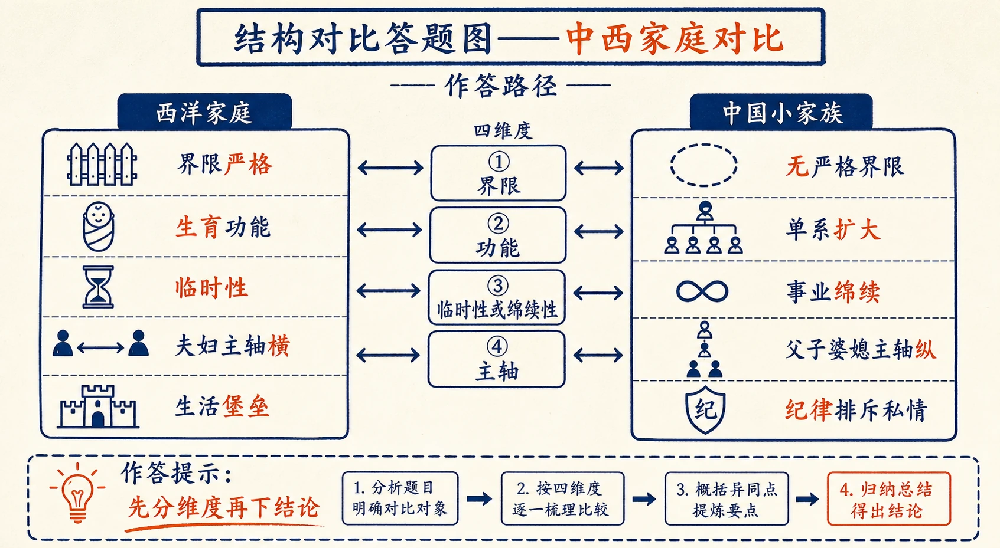

# 10 家族

<!-- 图片描述：本节整体知识信息结构图，采用“概念界定—结构分析—功能推论”的知识结构图。中心概念为“乡土社会的基本社群＝小家族”。左侧“为什么不用‘大家庭’”：大小不在人数而在结构；右侧“小家族的特点”：单系扩大（父系）、事业组织（政治经济宗教）、绵续性（不因个人长成死亡而结束）、主轴纵（父子婆媳）配轴横（夫妇）。下方推论“家的大小依事业大小而定，感情被纪律排斥”。朱红标出“小家族”，靛蓝标出“主轴纵/配轴横”，米白纸面、黑灰线条、中文标注、留白充足，符合语文文本精读风格。 -->

## 知识关系导航

- 所属章节：[[章首 学习导图|《乡土中国》学习导图]]
- 前置知识点：[[09-维系着私人的道德#三、课文原文与逐段/逐句解读|差序格局下的道德与私人联系]]（家族是这些私人联系的具体形态）
- 后续知识点：[[11-男女有别#三、课文原文与逐段/逐句解读|感情定向与男女有别]]（承接“纪律排斥私情”展开）
- 对比知识点：[[10-家族#三、课文原文与逐段/逐句解读|西洋家庭：生育社群、临时性、夫妇主轴]]（中西“家”的对照）
- 相关知识点：[[08-差序格局#知识点一：团体格局与差序格局|社会圈子与团体]]（本章“社会圈子”概念源于差序格局）

本章是《乡土中国》第六章，把“差序格局”落实到最基本的社群——“家”上。作者通过“小家族”这一新名词，说明中国乡土社会的“家”不是人数多寡意义上的“大家庭”，而是结构上单系扩大、绵续性的事业社群。理解本章，是理解后续《男女有别》《血缘和地缘》的基础。

## 本节学习目标

- 理解作者为何用“小家族”而不用“大家庭”来称呼中国乡土社会的基本社群。
- 掌握“家庭（生育社群）—氏族（单系亲属社群）—小家族（事业社群）”的概念区分。
- 理解中国“家”的三个结构特点：单系扩大（父系）、绵续性、事业组织。
- 理解“主轴在父子、婆媳之间（纵的），夫妇是配轴”的判断及其感情后果。
- 能评价“家庭是事业组织”对中国家庭关系的塑造，并与现代家庭观念对比。

## 核心知识点讲解

### 一、文本基本信息与学习任务

- **篇目**：《家族》，选自费孝通《乡土中国》。
- **作者**：费孝通（1910—2005），中国社会学家、人类学家。
- **文体**：学术随笔／社会学论述文。本章以概念界定（家庭/氏族/家族）为核心，辅以田野观察。
- **学习任务**：理解“小家族”概念提出的理由与结构内涵；把握中西“家”在结构、功能、主轴上的差异；训练概念界定与结构分析的答题能力。

### 二、整体内容与结构线索

本文论证线索如下：

1. **澄清概念**：回应“中国乡土社会没有团体”的质疑，区分“团体（团体格局的社群）”与“社会圈子（差序格局的社群）”。
2. **提出新名词**：中国乡土社会的基本社群应称“小家族”，而非“大家庭”。
3. **界定家庭**：家庭=亲子构成的生育社群（结构=亲子，功能=生育），是暂时性的。
4. **比较中西**：西洋家庭是团体性社群，界限严格，主要功能是生育；中国家庭无严格界限，可沿亲属差序扩大。
5. **说明扩大路线**：中国家庭的扩大是单系的（父系），故结构上等于氏族；称“小家族”。
6. **分析功能**：家族是事业组织（政治、经济、宗教），需要长期绵续，故家庭变质为族。
7. **推论主轴**：中国家庭主轴在父子、婆媳之间（纵轴），夫妇为配轴；事业需要纪律，纪律排斥私情，故夫妇感情淡漠、同性集团活跃。

### 三、课文原文与逐段/逐句解读

**【原文】**
> 我曾在以上两章中，从群己的关系上讨论到社会结构的格局。我也在那章里提出了若干概念，比如“差序格局”和“团体格局”。我知道这些生疏的名词会引起读者的麻烦，但是为了要表明一些在已有社会学词汇里所没有确当名词来指称的概念，我不能不写下这些新的标记。

**【解读】**
- **承上**：回顾“差序格局/团体格局”概念，说明新名词的必要性——已有词汇没有确当名词。
- **学习提示**：新名词不是故弄玄虚，而是为了准确指称新发现的结构现象。

**【原文】**
> 譬如有一位朋友看过我那一章的分析之后，曾摇头说，他不能同意我说中国乡土社会里没有团体。他举出了家庭、氏族、邻里、街坊、村落，这些不是团体是什么？显然我们用同一名词指着不同的实体。我为了要把结构不同的两类“社群”分别出来，所以把团体一词加以较狭的意义，只指由团体格局中所形成的社群，用以和差序格局中所形成的社群相区别；后者称之作“社会圈子”，把社群来代替普通所谓团体。社群是一切有组织的人群。

**【解读】**
- **关键辨析**：“团体”（狭义的）=团体格局中形成的社群；“社会圈子”=差序格局中形成的社群；“社群”=一切有组织的人群（总名）。
- **方法论**：同一名词可指不同实体，须重新界定概念再讨论——这是学术表达严谨性的体现。

**【原文】**
> 在那位朋友所列举的各种社群中，大体上都属于我所谓社会圈子的性质。在这里我可以附带说明，我并不是说中国乡土社会中没有“团体”，一切社群都属于社会圈子性质，譬如钱会，即，显然是属团体格局的；我在这个分析中只想从主要的格局说，在中国乡土社会中，差序格局和社会圈子的组织是比较的重要。同样的，在西洋现代社会中差序格局也是同样存在的，但比较上不重要罢了。这两种格局本是社会结构的基本形式，在概念上可以分得清，在事实上常常可以并存的，可以看得到的不过各有偏胜罢了。

**【解读】**
- **严谨声明**：中国乡土社会中也有“团体”（如钱会），只是“差序格局和社会圈子比较重要”。
- **关键判断**：两种格局是“基本形式”，概念可分、事实并存、各有偏胜——避免绝对化。

**【原文】**
> 我想在这里提出来讨论的是我们乡土社会中的基本社群，这社群普通被称为“大家庭”的。我在《江村经济》中把它称作“扩大了的家庭”Extended family。这些名词的主体是“家庭”，在家庭上加一个小或大的形容词来说明中国和西洋性质上相同的“家庭”形式上的分别。可是我现在看来却觉得这名词并不妥当，比较确当的应该称中国乡土社会基本社群作“小家族”。

**【解读】**
- **命名史**：曾称“扩大了的家庭”，现认为不妥，改称“小家族”。
- **学习提示**：作者不断修正名词，反映概念必须与结构性质匹配的学术自觉。

**【原文】**
> 我提出这新名词来的原因是在想从结构的原则上去说明中西社会里“家”的区别。我们普通所谓大家庭和小家庭的差别决不是在大小上，不是在这社群所包括的人数上，而是在结构上。一个有十多个孩子的家并不构成“大家庭”的条件，一个只有公婆儿媳四个人的家却不能称之为“小家庭”。在数目上说，前者比后者为多，但在结构上说，后者却比前者为复杂，两者所用的原则不同。

**【解读】**
- **核心判断（名句）**：大小差别“决不是在大小上”“而是在结构上”。
- **反例论证**：十多个孩子的家≠大家庭（不构成条件）；公婆儿媳四人的家≠小家庭（结构更复杂）。用反例推翻“按人数定大小”的常识。

**【原文】**
> 家庭这概念在人类学上有明确的界说：这是个亲子所构成的生育社群。亲子指它的结构，生育指它的功能。亲子是双系的，兼指父母双方；子女限于配偶所生出的孩子。这社群的结合是为了子女的生和育。在由个人来担负孩子生育任务的社会里，这种社群是不会少的。但是生育的功能，就每个个别的家庭说，是短期的，孩子们长成了也就脱离他们的父母的抚育，去经营他们自己的生育儿女的事务，一代又一代。家庭这社群因之是暂时性的。从这方面说，家庭这社群和普通的社群不完全一样。学校、国家这些社群并不是暂时，虽则事实上也不是永久的，但是都不是临时性的，因为它们所具的功能是长期性的。家庭既以生育为它的功能，在开始时就得准备结束。抚育孩子的目的就在结束抚育。

**【解读】**
- **关键定义**：家庭=亲子构成的生育社群（结构=亲子，功能=生育）。
- **关键性质**：家庭是**暂时性**的——生育功能完成后，孩子长大脱离抚育，家庭就结束其特定任务。

**【原文】**
> 但是在任何文化中，家庭这社群总是赋有生育之外其他的功能。夫妇之间的合作并不因儿女长成而结束。如果家庭不变质，限于亲子所构成的社群，在它形成伊始，以及儿女长成之后，有一段期间只是夫妇的结合。夫妇之间固然经营着经济的、感情的、两性的合作，但是所经营的事务受着很大的限制，凡是需要较多人合作的事务就得由其他社群来经营了。

**【解读】**
- **补充**：任何文化中家庭都有生育之外的功能，但西洋家庭事务受限制，需要多人合作的事务交给其他社群。
- **伏笔**：中国家庭则把这些功能都拉进来——这正是中西分化的起点。

**【原文】**
> 在西洋，家庭是团体性的社群，这一点我在上面已经说明有严格的团体界限。因为这缘故，这个社群能经营的事务也很少，主要的是生育儿女。可是在中国乡土社会中，家并没有严格的团体界限，这社群里的分子可以依需要，沿亲属差序向外扩大。构成这个我所谓社圈的分子并不限于亲子。但是在结构上扩大的路线却有限制。中国的家扩大的路线是单系的，就是只包括父系这一方面；除了少数例外，家并不能同时包括媳妇和女婿。在父系原则下女婿和结了婚的女儿都是外家人。在父系方面却可以扩大得很远，五世同堂的家，可以包括五代之内所有父系方面的亲属。

**【解读】**
- **对比**：西洋家庭=团体性、界限严格、事务少；中国家庭=无严格界限、可沿亲属差序扩大。
- **关键概念**：扩大的路线是**单系的（父系）**——女婿、已婚女儿是“外家人”；父系可扩至五世同堂。
- **图示**：原文配父系关系图，说明单系扩大原则。

**【原文】**
> 这种根据单系亲属原则所组成的社群，在人类学中有个专门名称，叫氏族。我们的家在结构上是一个氏族。但是和普通我们所谓族也不完全相同，因为我们所谓族是由许多家所组成，是一个社群的社群。因之，我在这里提了这个“小家族”的名词。小家族和大家族在结构原则上是相同的，不相同是在数量、在大小上。——这是我不愿用大家庭，而用小家族的原因。一字的相差，却说明了这社群的结构性质。

**【解读】**
- **关键判断**：中国“家”在结构上=氏族（单系亲属原则）；“小家族”与“大家族”结构原则相同，只在数量大小不同。
- **命名精义**：一字之差（大家庭→小家族），说明的是结构性质而非规模。

**【原文】**
> 家族在结构上包括家庭；最小的家族也可以等于家庭。因为亲属的结构的基础是亲子关系，父母子的三角。家族是从家庭基础上推出来的。但是包括在家族中的家庭只是社会圈子中的一轮，不能说它不存在，但也不能说它自成一个独立的单位，不是一个团体。

**【解读】**
- **层级关系**：家族包括家庭；最小家族可等于家庭；家庭是家族中的“一轮”。
- **学习提示**：家庭在家族中不构成独立单位（非团体），而是社会圈子的一轮。

**【原文】**
> 形态上的差异，也引起了性质上的变化。家族虽则包括生育的功能，但不限于生育的功能。依人类学上的说法，氏族是一个事业组织，再扩大就可以成为一个部落。氏族和部落具有政治、经济、宗教等复杂的功能。我们的家也正是这样。我的假设是中国乡土社会采取了差序格局，利用亲属的伦常去组合社群，经营各种事业，使这基本的家，变成氏族性了。

**【解读】**
- **功能扩展**：家族不限于生育功能，还承担政治、经济、宗教等功能。
- **作者假设**：乡土社会利用“亲属的伦常”组合社群、经营事业，使“家”变成氏族性（事业组织）。

**【原文】**
> 一方面我们可以说在中国乡土社会中，不论政治、经济、宗教等功能都可以利用家族来担负，另一方面也可以说，为了要经营这许多事业，家的结构不能限于亲子的小组合，必须加以扩大。而且凡是政治、经济、宗教等事物都需要长期绵续性的，这个基本社群决不能像西洋的家庭一般是临时的。家必须是绵续的，不因个人的长成而分裂，不因个人的死亡而结束，于是家的性质变成了族。氏族本是长期的，和我们的家一般。我称我们这种社群作小家族，也表示了这种长期性在内，和家庭的临时性相对照。

**【解读】**
- **功能→结构推论**：要经营多种长期事业 → 家必须扩大并绵续（不因个人长成死亡而结束）→ 性质变成“族”。
- **关键对比**：西洋家庭=临时性（生育功能结束即散）；中国小家族=绵续性（长期事业）。

**【原文】**
> 中国的家是一个事业组织，家的大小是依着事业的大小而决定的。如果事业小，夫妇两人的合作已够应付，这个家也可以小得等于家庭；如果事业大，超过了夫妇两人所能担负时，兄弟伯叔全可以集合在一个大家里。这说明了我们乡土社会中家的大小变异可以很甚。但不论大小上差别到什么程度，结构原则上却是一贯的、单系的差序格局。

**【解读】**
- **名句**：“中国的家是一个事业组织，家的大小是依着事业的大小而决定的。”
- **推论**：事业小则家小（可等于家庭），事业大则家可集合兄弟伯叔成大族；但结构原则一贯：单系的差序格局。

**【原文】**
> 以生育社群来担负其他很多的功能，使这社群中各分子的关系的内容也发生了变化。在西洋家庭团体中，夫妇是主轴，夫妇共同经营生育事务，子女在这团体中是配角，他们长成了就离开这团体。在他们，政治、经济、宗教等功能有其他团体来担负，不在家庭的分内。夫妇成为主轴，两性之间的感情是凝合的力量。两性感情的发展，使他们的家庭成了获取生活上安慰的中心。我在《美国人性格》一书中曾用“生活堡垒”一词去形容它。

**【解读】**
- **西洋模式**：夫妇是主轴，两性感情是凝合力量，家庭是“生活堡垒”（感情中心）。
- **关键概念**：“主轴”——决定家庭内部关系重心所在。

**【原文】**
> 在我们的乡土社会中，家的性质在这方面有着显著的差别。我们的家是个绵续性的事业社群，它的主轴是在父子之间，在婆媳之间，是纵的，不是横的。夫妇成了配轴。配轴虽则和主轴一样并不是临时性的，但是这两轴却都被事业的需要而排斥了普通的感情。我所谓普通的感情是和纪律相对照的。一切事业都不能脱离效率的考虑。求效率就得讲纪律；纪律排斥私情的宽容。在中国的家庭里有家法，在夫妇间得相敬，女子有着三从四德的标准，亲子间讲究负责和服从。这些都是事业社群里的特色。

**【解读】**
- **核心判断（名句）**：中国家的主轴在父子、婆媳之间，“是纵的，不是横的”；夫妇是配轴。
- **因果链**：事业组织→求效率→讲纪律→排斥私情（普通感情）→家法、相敬、三从四德、负责服从。
- **关键词**：“主轴/配轴”“纵/横”“纪律/私情”——本章最核心的分析框架。

**【原文】**
> 不但在大户人家，书香门第，男女有着阃内阃外的隔离，就是在乡村里，夫妇之间感情的淡漠也是日常可见的现象。我在乡间调查时特别注意过这问题，后来我又因疏散下乡，和农家住在一所房子里很久，更使我认识了这事实。我所知道的乡下夫妇大多是“用不着多说话的”，“实在没有什么话可说的”。一早起各人忙着各人的事，没有工夫说闲话。出了门，各做各的。妇人家如果不下田，留在家里带孩子。工做完了，男子们也不常留在家里，男子汉如果守着老婆，没出息。有事在外，没事也在外。茶馆，烟铺，甚至街头巷口，是男子们找感情上安慰的消遣场所。在那些地方，大家有说有笑，热热闹闹的。回到家，夫妇间合作顺利，各人好好地按着应做的事各做各的。做得好，没事，也没话；合作得不对劲，闹一场，动手动脚，说不上亲热。这些观察使我觉得西洋的家和我们乡下的家，在感情生活上实在不能并论。乡下，有说有笑，有情有意的是在同性和同年龄的集团中，男的和男的在一起，女的和女的在一起，孩子们又在一起，除了工作和生育事务上，性别和年龄组间保持着很大的距离。

**【解读】**
- **田野例证**：乡下夫妇“用不着多说话”“没什么话可说”；男子在外（茶馆烟铺）找感情安慰；有说有笑的是同性、同年龄集团。
- **结论**：感情生活集中到同性集团，性别、年龄组间保持距离——这是“事业社群排斥私情”的日常表现。
- **作者自证**：以亲自调查与疏散下乡同住的观察为证，体现实证精神。

**【原文】**
> 这决不是偶然的，在我看来，这是把生育之外的许多功能拉入了这社群中去之后所引起的结果。中国人在感情上，尤其是在两性间的矜持和保留，不肯像西洋人一般的在表面上流露，也是在这种社会圜局中养成的性格。

**【解读】**
- **原因总结**：两性感情淡漠不是偶然，而是“把生育之外的许多功能拉入社群”的结构结果。
- **性格养成**：中国人的两性矜持与保留，是在这种“社会圜局”中养成的——结构塑造性格。

### 四、关键语句、人物/意象与细节精读

- **“我们普通所谓大家庭和小家庭的差别决不是在大小上……而是在结构上。”**：本章命名逻辑的枢纽句。
- **“家庭这概念在人类学上有明确的界说：这是个亲子所构成的生育社群。”**：给“家庭”下科学定义（结构=亲子，功能=生育）。
- **“中国的家是一个事业组织，家的大小是依着事业的大小而决定的。”**：中国“家”的功能定性。
- **“我们的家是个绵续性的事业社群，它的主轴是在父子之间，在婆媳之间，是纵的，不是横的。”**：中国家庭结构主轴的经典表述。
- **“纪律排斥私情的宽容。”**：事业社群感情逻辑的核心。
- **意象·主轴与配轴**：以“轴”喻家庭关系重心——西洋夫妇主轴（横），中国父子婆媳主轴（纵）。
- **意象·社会圈子的一轮**：家庭只是家族这个社会圈子中的一轮，不独立成团体。
- **文化常识**：Extended family（扩大了的家庭）、氏族（单系亲属原则）、三从四德、阃内阃外（内室与外庭的分界）、五世同堂。

### 五、语言风格与表达手法

- **概念界定法**：先定义“家庭/氏族/社群/团体”，再建立“小家族”新概念，层层澄清。
- **对比论证**：西洋家庭（临时性、夫妇主轴、感情中心）vs 中国家庭（绵续性、父子主轴、事业社群）。
- **反例论证**：以“十多个孩子的家”“公婆儿媳四人的家”推翻“人数定大小”的常识。
- **田野实证**：以乡间夫妇生活观察、疏散下乡同住体验为证，增强说服力。
- **因果推论**：功能→结构→感情，一环扣一环。

### 六、主题思想、情感态度与文化理解

- **主题**：通过“小家族”概念说明中国乡土社会基本社群的结构性质——单系扩大的、绵续性的事业社群，其主轴在父子婆媳（纵）之间，感情受纪律压抑。
- **情感态度**：作者以冷静的社会学分析看待“夫妇感情淡漠”等现象，将其归于结构而非个人；对乡土家庭既有学术同情，也如实揭示其感情代价。
- **文化理解**：理解“三从四德”“阃内阃外”“男女授受不亲”等传统规范的事业社群根源；理解中国家庭“重纵不重横”与西洋“重横不重纵”的结构差异。

### 七、阅读答题与写作迁移

- **答题模板（概念理解）**：先引定义（家庭=生育社群），再拆结构（亲子/单系扩大）与功能（生育/事业），最后说明命名缘由。
- **答题模板（对比分析）**：从“界限、功能、主轴、临时性/绵续性、感情”分维度比较中西家庭。
- **答题模板（观点评价）**：还原作者论证→分析依据→联系现实（现代家庭观）→辩证评价。
- **写作迁移**：学习“为旧概念提出更准确的新名词”的学术表达；学习用结构原因解释感情现象。

<!-- 图片描述：概念层级图——“家庭—氏族—小家族”。底层“家庭（亲子构成的生育社群，暂时性）”，中层“氏族（单系亲属原则组成的社群）”，顶层“小家族（事业组织，绵续性，承担政治经济宗教功能）”。箭头标注“家庭→家族：单系扩大+功能扩展+绵续化”；右侧小注“大家庭与小家族之别在结构不在人数”。朱红标出“小家族”，靛蓝标出“家庭”。米白纸面、黑灰线条、中文标注。 -->

## 重点梳理

- **概念体系（社群与团体）**：社群（一切有组织的人群）＝团体（团体格局）+社会圈子（差序格局）；家庭（生育社群、临时）⊂ 家族（事业社群、绵续）。
- **命名理由**：用“小家族”而非“大家庭”——区别在结构（单系扩大）不在人数。
- **中国家庭三特点**：①单系扩大（父系，五世同堂）；②绵续性（不因个人长成死亡而结束）；③事业组织（承担政治经济宗教功能）。
- **主轴分析**：西洋=夫妇主轴（横，感情凝合，生活堡垒）；中国=父子婆媳主轴（纵），夫妇为配轴。
- **感情推论**：事业→效率→纪律→排斥私情→夫妇淡漠、同性集团活跃。
- **必记名句**：“大家庭与小家庭的差别在结构上”“中国的家是一个事业组织”“主轴是纵的，不是横的”“纪律排斥私情”。
- **论证方法**：概念界定、对比论证、反例论证、田野实证。

## 难点突破

<!-- 图片描述：结构对比图——“西洋家庭 vs 中国小家族”。左右两栏，左栏“西洋家庭”：界限严格、生育功能、临时性、夫妇主轴（横向箭头）、感情凝合、生活堡垒；右栏“中国小家族”：无严格界限、单系扩大（父系箭头）、事业功能（政治经济宗教）、绵续性、主轴纵（父子婆媳竖箭头）、纪律排斥私情。中间用朱红双向箭头标出“结构原则不同”，下方小注“同一名词‘家’，不同结构实体”。米白纸面、黑灰线条、靛蓝辅助、中文标注。 -->

- **难点一：“大家庭”与“小家族”到底差在哪里？**
  突破：差在**结构原则**。“大家庭”暗示只是人数多，结构上仍是生育社群；“小家族”指明是单系扩大的氏族性结构。十多个孩子的家仍是“家庭”，公婆儿媳四人的家已是“小家族”——人数多少不决定性质。
- **难点二：为什么“家”会变成“族”？**
  突破：因为乡土社会用亲属伦常经营各种事业（政治、经济、宗教），事业需要长期绵续、需要多人合作，于是结构必须扩大（单系）并持久，家庭就“变质”为氏族性的家族。
- **难点三：“主轴纵”是什么意思？与感情淡漠有何关系？**
  突破：“轴”指关系重心。中国家庭重心在父子、婆媳（纵向的代际与性别分工），不是夫妇（横向的夫妻情感）。事业要求效率→纪律→排斥私情，故夫妇间“相敬如宾”、话少、感情淡漠，感情转向同性集团。
- **难点四：作者为什么反复修改名词（扩大了的家庭→小家族）？**
  突破：名词必须准确反映结构性质。“扩大了的家庭”暗示仍是家庭（生育社群），掩盖了单系扩大与事业绵续的结构事实；“小家族”则点明氏族性结构。学术表达追求“一字之差说明结构性质”。

<!-- 图片描述：结构对比答题图——“中西家庭对比”作答路径。左右两栏：西洋家庭（界限严格、生育功能、临时性、夫妇主轴横、生活堡垒）vs 中国小家族（无严格界限、单系扩大、事业绵续、父子婆媳主轴纵、纪律排斥私情）。中间箭头标“四维度：界限/功能/主轴/临时性或绵续性”，底部提示“先分维度再下结论”。米白纸面、黑灰线条、中文标注。 -->

## 例题讲解

**例题1（概念理解）** 为什么作者主张用“小家族”代替“大家庭”来称呼乡土社会的基本社群？
- **分析**：回扣“差别在结构上”与“单系扩大=氏族”两段。
- **答案**：因为中西“家”的差别不在人数而在结构。中国“家”按单系（父系）原则扩大，结构上等于氏族，是承担政治经济宗教功能的绵续性事业社群；而“大家庭”只暗示人数多，仍被当作生育社群，不能反映这种结构性质。“小家族”一字之差说明了社群的结构性质。
- **反思**：概念题要“定义+结构+命名理由”三结合。

**例题2（对比分析）** 比较中西家庭在结构与功能上的不同。
- **分析**：从“界限、功能、主轴、临时/绵续”四维度定位原文。
- **答案**：西洋家庭界限严格（团体性），主要功能是生育，临时性，夫妇为主轴，两性感情为凝合力量，是“生活堡垒”；中国家庭无严格界限，可沿父系单系扩大，承担政治经济宗教多种功能，绵续不因个人死亡而结束，主轴在父子婆媳（纵），夫妇为配轴，纪律排斥私情。
- **反思**：对比题分维度作答，注意不要漏“主轴”这一关键维度。

**例题3（因果链概括）** 概括“中国家庭为何主轴在父子婆媳之间”的因果链。
- **分析**：定位“事业组织→效率→纪律→排斥私情”段。
- **答案**：乡土社会用亲属伦常经营多种事业 → 家成为事业组织 → 事业求效率 → 讲纪律 → 排斥私情与两性感情 → 夫妇关系退为配轴、趋于淡漠 → 关系重心落在父子婆媳（纵轴）上。
- **反思**：因果链题从功能出发一路推到感情结果，不要跳步。

**例题4（观点评价）** 作者认为“纪律排斥私情”造成了乡下夫妇感情淡漠。你如何看待这一判断对当代家庭的意义？
- **分析**：先还原结构论证，再联系现代家庭观评价。
- **参考要点**：该判断把“夫妇淡漠”归因于事业社群结构而非个人品德，分析深刻；但现代家庭已从“事业组织”转向“感情团体”，夫妇主轴、感情交流成为核心，说明结构变了，家庭关系重心也随之变化——这正印证作者“结构决定关系”的方法。
- **反思**：评价题要“还原→分析→联系现实→辩证”。

## 易错点整理

- **人数误判**：用“家里人多=大家庭”答题。避免：牢记“大小在结构不在人数”。
- **概念混淆**：把“家庭”“氏族”“家族”“社群”混用。避免：家庭=生育社群（亲子）；氏族=单系亲属社群；家族=事业社群；社群=总名。
- **主轴错位**：说中国家庭“夫妇是主轴”。避免：中国主轴在父子婆媳（纵），夫妇是配轴；西洋才是夫妇主轴。
- **“扩大”误读**：说中国家庭“无限扩大、什么都包括”。避免：扩大路线是单系的（父系），女婿、已婚女儿是外家人。
- **感情归因错**：把“夫妇淡漠”归因于“中国人不会爱”。避免：作者归因于事业社群结构（纪律排斥私情）。

## 考点考证点整理

### 考点一：概念界定与命名缘由
- **出题思路**：为什么用“小家族”不用“大家庭”；解释“家庭/氏族/社群/社会圈子”。
- **关键条件**：回到定义句与命名理由段。
- **解答要点**：定义+结构特点+命名缘由（一字之差说明结构性质）。
- **易扣分点**：只说“规模大”；漏掉“单系扩大/氏族性”。

### 考点二：中西家庭对比
- **出题思路**：比较中西“家”的结构与功能。
- **关键条件**：抓“界限、功能、主轴、临时/绵续”四维度。
- **解答要点**：分维度作答，各附原文依据。
- **易扣分点**：只对比人数；漏“主轴”维度。

### 考点三：因果分析与结构推论
- **出题思路**：为什么中国家庭主轴在父子婆媳？为什么夫妇感情淡漠？
- **关键条件**：抓住“事业组织→效率→纪律→排斥私情”链条。
- **解答要点**：完整写出因果链，从功能推到感情。
- **易扣分点**：跳步（直接从“事业”跳到“淡漠”）；漏“纪律”环节。

### 考点四：文本信息提取与概括
- **出题思路**：概括中国家庭三特点、田野观察说明了什么。
- **关键条件**：定位“单系扩大/绵续性/事业组织”及乡间观察段。
- **解答要点**：分点概括，用原文关键词。
- **易扣分点**：用自己的话模糊替代；漏掉田野例证的用意。

### 考点五：观点评价与现实意义
- **出题思路**：评析“纪律排斥私情”或谈传统家庭观对当代的影响。
- **关键条件**：兼顾结构解释与时代变化。
- **解答要点**：还原观点→分析依据→联系现代家庭观→辩证。
- **易扣分点**：只批判“传统压抑人性”；不联系结构分析。

## 练习题

> 说明：本章源文（费孝通《乡土中国·家族》）未附课后练习题，以下题目根据本章核心考点自拟，用于巩固整本书阅读与论述类文本阅读能力。

**一、基础理解（自拟）**
1. 根据原文，写出“家庭”在人类学上的定义。
2. 作者为什么说中国乡土社会的基本社群应称“小家族”而不应称“大家庭”？

**二、文本分析（自拟）**
3. 中国家庭的“扩大”是单系的，这句话如何理解？试举例说明。
4. 作者说中国家庭的“主轴是纵的，不是横的”，请分析这句话的含义及其感情后果。

**三、鉴赏评价（自拟）**
5. 分析本文运用“反例论证”和“田野实证”的作用。
6. 作者把“夫妇感情淡漠”归因于“事业社群”，你同意吗？请结合文本与生活谈谈。

**四、迁移写作（自拟）**
7. 现代家庭逐渐从“事业组织”转向“感情团体”。请结合《家族》的分析，谈谈你对这一转变的理解（不少于 200 字）。

## 练习题答案

**1.** 家庭是亲子所构成的生育社群；亲子指结构，生育指功能；亲子是双系的，子女限于配偶所生出的孩子。家庭因生育功能而具有暂时性。
> 要点：结构（亲子）+功能（生育）+暂时性。

**2.** 因为中西“家”的差别在结构不在人数。“大家庭”只表示人数多，仍被当作生育社群；中国“家”按单系（父系）原则扩大，结构上等于氏族，是承担多种事业的绵续性社群，故应称“小家族”。一字之差说明的是结构性质。
> 评分：须答出“结构原则”与“单系扩大=氏族”。

**3.** 单系扩大指家庭只沿父系一方扩大，不包括媳妇（就夫方而言）和女婿（就妻方而言）；在父系原则下，女婿和结了婚的女儿都是外家人，而父系可扩至五世同堂。如“五世同堂的家，可以包括五代之内所有父系方面的亲属”。
> 评分：须答出“只包括父系”“女婿/已婚女儿是外家人”两点。

**4.** 含义：“主轴”指家庭关系的重心。西洋家庭夫妇是主轴（横向的夫妻情感）；中国家庭主轴在父子、婆媳之间（纵向的代际与性别分工），夫妇只是配轴。感情后果：家庭是事业组织，求效率需纪律，纪律排斥私情，故夫妇感情淡漠、话少，感情生活转向同性、同年龄集团。
> 评分：含义与感情后果都要答。

**5.** 反例论证：以“十多个孩子的家不构成大家庭”“公婆儿媳四人的家不能称小家庭”推翻“人数定大小”的常识，突出“结构定性质”的观点，使论证更严密有力。田野实证：以乡间夫妇“用不着多说话”、男子在茶馆烟铺找感情安慰等观察，把抽象的结构推论落到具体生活，增强说服力与真实感。
> 评分：分别说明两种方法的作用，不能混为一谈。

**6.** （开放性，言之成理即可）同意：文中以大量田野观察（夫妇话少、同性集团活跃）证明，把生育之外功能拉入家庭后，纪律必然排斥私情，感情淡漠是结构结果而非品德问题，解释力强。补充：也可指出，现代家庭功能外移（事业由社会承担）后，夫妇主轴回归，印证结构决定关系；故该判断对理解家庭变迁仍有启发。
> 评分：须以文本依据支撑观点，并有一定辩证。

**7.** （写作评分要点）能运用《家族》的“结构—功能—主轴”框架即可：传统家庭承担经济政治宗教功能，故主轴纵、纪律压感情；现代社会这些功能由专门机构承担，家庭回归情感与生育功能，夫妇主轴、感情交流成为核心。可联系双职工家庭、核心家庭普及等现实，说明“功能变化→关系重心变化”。要求逻辑清晰，不少于 200 字。
