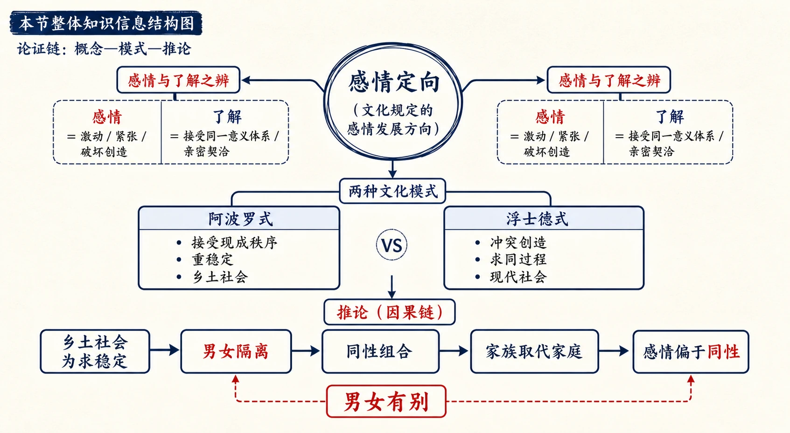
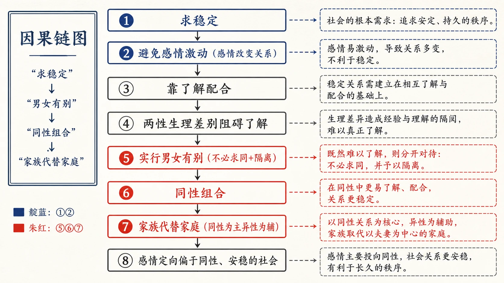
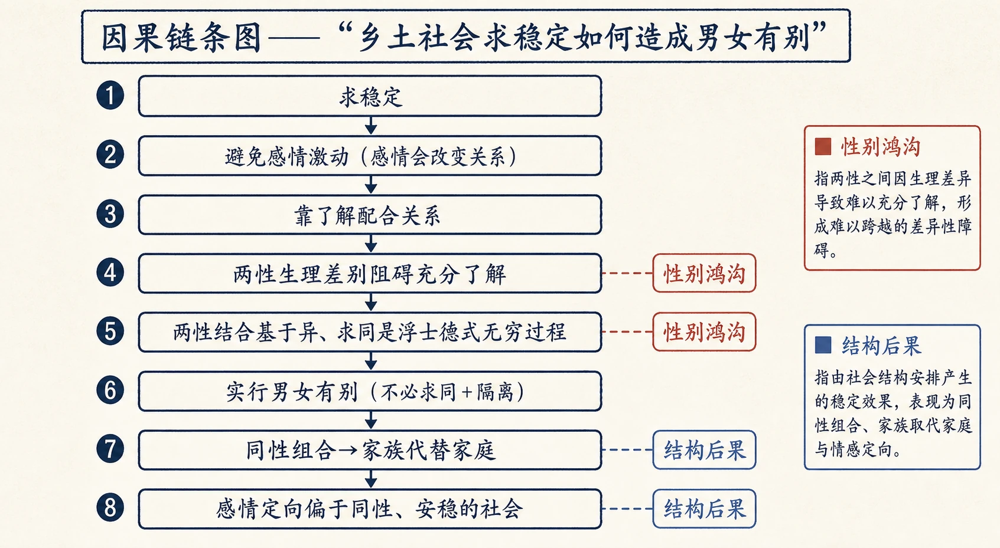
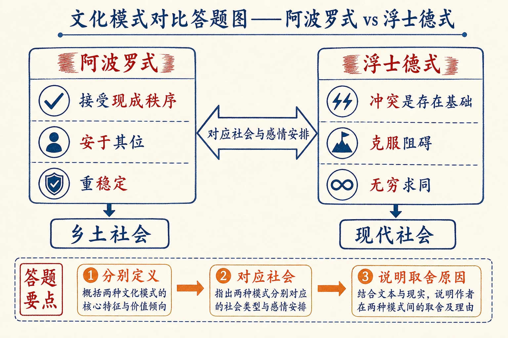

# 11 男女有别

<!-- 图片描述：本节整体知识信息结构图，采用“概念—模式—推论”论证链。中心概念为“感情定向（文化规定的感情发展方向）”。上分支“感情与了解之辨”：感情=激动/紧张/破坏创造，了解=接受同一意义体系/亲密契洽；下分支“两种文化模式”：阿波罗式（接受现成秩序、重稳定、乡土社会）vs 浮士德式（冲突创造、求同过程、现代社会）；再推论“乡土社会为求稳定→男女隔离→同性组合→家族取代家庭→感情偏于同性”。朱红标出“男女有别”，靛蓝标出两种文化模式，米白纸面、黑灰线条、中文标注、留白充足，符合语文文本精读风格。 -->

## 知识关系导航

- 所属章节：[[章首 学习导图|《乡土中国》学习导图]]
- 前置知识点：[[10-家族#三、课文原文与逐段/逐句解读|家族：纪律排斥私情]]（本章由“纪律排斥私情”引出感情定向问题）
- 对比知识点：[[11-男女有别#三、课文原文与逐段/逐句解读|阿波罗式与浮士德式文化]]（中西感情生活对照）
- 相关知识点：[[16-血缘和地缘#三、课文原文与逐段/逐句解读|血缘社会与单系家庭组织]]（男女有别的结构与血缘单系互为表里）
- 相关方法：[[08-差序格局#知识点五：比喻、对比与引用共同建模|对比论证]]

本章是《乡土中国》第七章，上承《家族》的“纪律排斥私情”，把问题引向中国传统“感情定向”的分析。作者借斯宾格勒的“阿波罗式/浮士德式”文化模式，说明乡土社会为求稳定而压抑两性感情、实施男女有别，其感情生活因此偏于同性集团。理解本章，须抓住“稳定是最高价值”这一乡土社会的前提。

## 本节学习目标

- 理解“感情定向”的定义及其由文化规定的性质。
- 辨析“感情（激动/紧张）”与“了解（亲密/契洽）”在维持社会关系上的不同作用。
- 理解阿波罗式与浮士德式两种文化模式的内涵，并用以解释乡土社会与现代社会的差异。
- 理解“男女有别”原则的内涵及其结构后果：同性组合、家族取代家庭、感情偏于同性。
- 能评价“稳定社会关系的力量不是感情，而是了解”这一判断，并联系现代恋爱观作比较。

## 核心知识点讲解

### 一、文本基本信息与学习任务

- **篇目**：《男女有别》，选自费孝通《乡土中国》。
- **作者**：费孝通（1910—2005），中国社会学家、人类学家。
- **文体**：学术随笔／社会学论述文。本章引入心理学（感情）、文化史学（斯宾格勒）与人类学视角，跨学科论证。
- **学习任务**：理解“感情定向”“了解”“阿波罗式/浮士德式”等概念；把握乡土社会“求稳定→男女有别”的推论；训练概念阐释与文化对比的答题能力。

### 二、整体内容与结构线索

本文论证线索如下：

1. **承接设问**：上篇说家族是事业社群、纪律排斥私情，由此碰着中国传统“感情定向”的基本问题。
2. **界定感情**：感情=机体紧张状态/激动，具有破坏与创造作用；维持固定社会关系须避免感情激动。
3. **提出对立项**：稳定社会关系的力量不是感情而是了解；了解=接受同一意义体系，产生亲密（契洽）。
4. **引入文化模式**：斯宾格勒的阿波罗式（接受现成秩序）与浮士德式（冲突创造、求同过程）；乡土社会=阿波罗式，现代社会=浮士德式。
5. **分析性别鸿沟**：乡土社会以“充分了解”配合行为，而男女两性的生理差别是基本阻碍；两性结合基于“异”，求同是无穷的浮士德式过程。
6. **推论乡土安排**：乡土社会求稳定，不容浮士德式精神，故有“男女有别”原则——男女不必求同、生活上隔离（授受不亲），不向对方希望心理契洽。
7. **结构后果**：同性组合出现，家庭团结受同性组合影响不易巩固，家族取代家庭（以同性为主、异性为辅的单系组合）；感情定向偏于同性。
8. **文化结论**：缺乏两性求同努力→少实利刺激→实用精神、现世色彩；秩序范围个性→男女鸿沟筑下，乡土社会是安稳的社会。

### 三、课文原文与逐段/逐句解读

**【原文】**
> 在上篇我说家族在中国的乡土社会里是一个事业社群，凡是做事业的社群，纪律是必须维持的，纪律排斥了私情。这里我们碰着了中国传统感情定向的基本问题了。

**【解读】**
- **承上启下**：由“纪律排斥私情”引出“感情定向”问题——本章讨论的是中国人感情发展的方向问题。

**【原文】**
> 我用感情定向一词来指一个人发展他感情的方向，而这方向却受着文化的规定，所以在分析一个文化范型时，我们应当注意这文化所规定个人感情可以发展的方向，简称作感情定向。“感情”又可以从两方面去看：心理学可以从机体的生理变化来说明感情的本质和种类，社会学却从感情在人和人的关系上去看它所发生的作用。喜怒哀乐固然是生理现象，但是总发生在人事圜局之中，而且影响人事的关系……在社会现象的一层里得到它们的意义。

**【解读】**
- **关键定义**：“感情定向”=文化所规定的个人感情可以发展的方向。
- **方法论**：心理学者重生理变化，社会学者重感情在人事关系中的作用——本章取社会学视角。

**【原文】**
> 感情从心理方面说是一种体内的行为，导发外表的行为。William James说感情是内脏的变化。这变化形成了动作的趋势，本身是一种紧张状态，发动行为的力量。如果一种刺激和一种反应之间的关联，经过了练习，已经相当固定的话，多少可说成为自动时，就不会发生体内的紧张状态，也就是说，不带着强烈的感情。感情常发生在新反应的尝试和旧反应的受阻情形中。

**【解读】**
- **感情的性质**：体内紧张状态、发动行为的力量；当刺激-反应已固定为自动，就不带强烈感情。
- **关键词**：感情“常发生在新反应的尝试和旧反应的受阻情形中”——即变化与受阻处，正是感情高发处。

**【原文】**
> 这里所谓感情相当于普通所谓激动，动了情，甚至说动了火。用火来形容感情，就在指这动的势和紧张的状态，从社会关系上说感情是具有破坏和创造作用的。感情的激动改变了原有的关系。这也就是说，如果要维持固定的社会关系，就得避免感情的激动。其实，感情的淡漠是稳定的社会关系的一种表示。所以我在上篇曾说纪律是排斥私情的。

**【解读】**
- **关键判断**：感情（激动）具有**破坏和创造作用**，会改变原有关系；维持固定关系就要避免感情激动。
- **名句**：“感情的淡漠是稳定的社会关系的一种表示”——呼应上篇“纪律排斥私情”。

**【原文】**
> 稳定社会关系的力量，不是感情，而是了解。所谓了解，是指接受着同一的意义体系。同样的刺激会引起同样的反应。我在论“文字下乡”的两篇里，已说起过熟习所引起的亲密感觉。亲密感觉和激动性的感情是不相同的。它是契洽，发生持续作用；它是无言的，不像感情奔放时铿然有声，歌哭哀号是激动时不缺的配合。

**【解读】**
- **核心判断（名句）**：稳定社会关系的力量是“了解”而非“感情”。
- **关键定义**：了解=接受同一意义体系，同样的刺激引起同样的反应。
- **辨析**：亲密（契洽）≠激动感情：契洽无言、持续；感情奔放有声、短暂。

**【原文】**
> Oswald Spengler在“西方陆沈论”里曾说西洋曾有两种文化模式：一种他称作阿波罗式的Apollonian；一种他称作浮士德式的Faustian。阿波罗式的文化认定宇宙的安排有一个完善的秩序，这个秩序超于人力的创造，人不过是去接受它，安于其位，维持它；……这是西方古典的精神。现代的文化却是浮士德式的。他们把冲突看成存在的基础，生命是阻碍的克服；没有了阻碍，生命也就失去了意义。他们把前途看成无尽的创造过程，不断改变。

**【解读】**
- **两种文化模式**：
  - 阿波罗式（古典）：宇宙有完善秩序，人接受它、安于其位、维持它（黄金时代已过去）。
  - 浮士德式（现代）：冲突是存在基础，生命是克服阻碍，前途是无限创造与改变。
- **学习提示**：这两种模式是本章分析中西感情生活的“理论透镜”。

**【原文】**
> 这两种文化观很可以用来了解乡土社会和现代社会在感情定向上的差别。乡土社会是阿波罗式的，而现代社会是浮士德式的。这两套精神的差别也表现在两种社会最基本的社会生活里。

**【解读】**
- **对应判断**：乡土社会=阿波罗式；现代社会=浮士德式。文化模式的差别表现在最基本的社会生活里。

**【原文】**
> 乡土社会是靠亲密和长期的共同生活来配合各个人的相互行为，社会的联系是长成的，是熟习的，到某种程度使人感觉到是自动的。只有生于斯、死于斯的人群里才能培养出这种亲密的群体，其中各个人有着高度的了解。好恶相投，连臭味都一般。要达到这境界，却有一个条件，就是没有什么差别在阻碍着各人间的充分了解。

**【解读】**
- **乡土社会的配合方式**：靠亲密与长期共同生活，联系是“长成的、熟习的、自动的”。
- **条件**：充分了解的前提是“没有什么差别阻碍各人间了解”——引出下文“性别鸿沟”。

**【原文】**
> 乡土社会中阻碍着共同生活的人充分了解的却是个人生理上的差别。……永远划分着人们生理差别的是男女两性。正因为还没有人能亲身体会过两性的差别，我们对于这差别的认识，总是间接的；所能说的差别多少只限于表面的。在实际生活中，谁都会感觉到异性的隔膜，但是差别的内容却永远是个猜想，无法领会。

**【解读】**
- **关键判断**：阻碍充分了解的是**生理差别，尤其是两性差别**——无人能亲身体会异性的差别，故认识间接、内容永远是猜想。

**【原文】**
> 在以充分了解来配合人们相互行为的社会中，这性别的鸿沟是个基本的阻碍。只在他们理想的天堂里，这鸿沟才算被克服：宗教家对性的抹杀，不论自觉或不自觉，决不是偶然的。完全的道义必须有充分的了解，无所隔，这就不能求之于生理上早已划下了鸿沟的男女之间。

**【解读】**
- **推论**：以了解为基础的乡土社会，性别鸿沟是“基本的阻碍”；宗教家抹杀性并非偶然——因为“完全的道义必须有充分的了解，无所隔”。
- **理解提示**：宗教的禁欲理想，与乡土社会“求充分了解”的逻辑一致。

**【原文】**
> 男女生理上的分化是为了生育，生育却又规定了男女的结合。这一种结合基于异，并非基于同。在相异的基础上去求充分了解，是困难的，是阻碍重重的，是需要不断地在创造中求统一，是浮士德式的企图。浮士德是感情的象征，是把感情的激动，不断的变，作为生命的主脉。浮士德式的企图也是无穷止的，因为最后的统一是永远不会完成的，这不过是一个求同的过程。

**【解读】**
- **关键推论**：两性结合基于“异”，求充分了解是“浮士德式的企图”——无穷止的求同过程，最后的统一永不会完成。
- **学习提示**：恋爱/两性感情=浮士德式（冲突创造、求同不止），与乡土社会的阿波罗式（稳定）根本冲突。

**【原文】**
> 把浮士德式的两性恋爱看成是进入生育关系的手段是不对的。恋爱是一项探险，是对未知的摸索。这和友谊不同，友谊是可以停止在某种程度上的了解，恋爱却是不停止的，是追求。……恋爱的持续依赖于推陈出新，不断地克服阻碍，也是不断地发现阻碍，要得到的是这一个过程，而不是这过程的结果。……依现代文化来看，男女间感情激动的发达已使生育的事业摇摇欲坠。

**【解读】**
- **恋爱观**：恋爱=探险、对未知的摸索、不停止的追求；恋爱的意义在“过程”本身而非结果。
- **对照**：友谊可停在某种程度的了解，恋爱不停——所以恋爱（浮士德式）使社会关系不稳定，威胁依赖稳定的“生育事业”。

**【原文】**
> 在乡土社会中这种精神是不容存在的。它不需要创造新的社会关系，社会关系是生下来就决定的。它更害怕社会关系的破坏，因为乡土社会所求的是稳定。它是阿波罗式的。男女间的关系必须有一种安排，使他们之间不发生激动性的感情。那就是男女有别的原则。“男女有别”是认定男女间不必求同，在生活上加以隔离。这隔离非但是有形的，所谓男女授受不亲，而且还是在心理上的，男女只在行为上按着一定的规则经营分工合作的经济和生育的事业，他们不向对方希望心理上的契洽。

**【解读】**
- **核心结论**：乡土社会不容浮士德式精神（怕破坏、求稳定），故有“男女有别”原则。
- **关键定义**：“男女有别”=认定男女间不必求同，生活上隔离——有形（授受不亲）+心理（不向对方希望心理契洽），只在行为上按规则分工合作。

**【原文】**
> 在社会结构上，如上篇所说的，因之发生了同性间的组合。这在我们乡土社会中看得很清楚。同性组合和家庭组合原则上是交错的，因为以生育为功能的家庭总是异性的组合。因之，乡土社会中“家庭”的团结受到了这同性组合的影响，不易巩固。于是家族代替了家庭，家族是以同性为主、异性为辅的单系组合。中国乡土社会里，以家族为基本社群，是同性原则较异性原则为重要的表示。

**【解读】**
- **结构后果链**：男女有别→感情偏于同性→发生同性组合→同性组合（与家庭异性组合交错）削弱家庭团结→家族代替家庭（以同性为主、异性为辅的单系组合）。
- **关键判断**：乡土社会以家族为基本社群，表明“同性原则较异性原则重要”。

**【原文】**
> 男女有别的界限，使中国传统的感情定向偏于向同性方面去发展。变态的同性恋和自我恋究竟普遍到什么程度，我们无法确说；但是乡土社会中结义性的组织，“不愿同日生，但愿同日死”的亲密结合，多少表示了感情方向走入同性关系的一层里的程度已经并不很浅。在女性方面的极端事例是华南的姊妹组织，在女性文学里所流露的也充满着冯小青式的自恋声调。

**【解读】**
- **例证**：结义性组织（桃园结义式、“不愿同日生但愿同日死”）、华南姊妹组织、冯小青式的自恋——证明感情定向偏于同性。
- **学习提示**：作者以“结义”“姊妹组织”为证，说明同性亲密在中国传统中的文化形态。

**【原文】**
> 缺乏两性间的求同的努力，也减少了一个不在实利上打算的刺激。中国乡土社会中那种实用的精神安下了现世的色彩。儒家不谈鬼，“祭神如神在”，可以说对于切身生活之外都漠然没有兴趣。一般人民更会把天国现世化；并不想把理想去改变现实，天国实现在这世界上，而把现实作为理想的底稿，把现世推进天国。对生活的态度是以克己来迁就外界，那就是改变自己去适合于外在的秩序。所以我们可以说这是古典的，也是阿波罗式的。

**【解读】**
- **文化结论**：缺乏两性求同→少超实利刺激→实用精神、现世色彩（儒家不谈鬼、天国现世化、以克己迁就外界）。
- **定性**：这种生活态度是“古典的，也是阿波罗式的”。

**【原文】**
> 社会秩序范围着个性，为了秩序的维持，一切足以引起破坏秩序的要素都被遏制着。男女之间的鸿沟从此筑下。乡土社会是个男女有别的社会，也是个安稳的社会。

**【解读】**
- **收束**：为维持秩序遏制破坏要素→男女鸿沟筑下→乡土社会是“男女有别”的社会，也是“安稳”的社会。
- **总结**：稳定以感情压抑为代价——这是全章的结论。

### 四、关键语句、人物/意象与细节精读

- **“感情定向”**：文化所规定的个人感情发展的方向——本章核心概念。
- **“稳定社会关系的力量，不是感情，而是了解。”**：全章理论枢纽。
- **“感情的淡漠是稳定的社会关系的一种表示。”**：把“淡漠”从负面评价转为结构必然。
- **“男女有别”是认定男女间不必求同，在生活上加以隔离。**：本章中心概念的定义。
- **“乡土社会是个男女有别的社会，也是个安稳的社会。”**：全章结论句，揭示“安稳”的感情代价。
- **人物·威廉·詹姆士（William James）**：美国哲学家、心理学家，实用主义创始人之一，其“感情是内脏的变化”说为感情概念提供心理学依据。
- **人物·斯宾格勒（Oswald Spengler）**：德国历史哲学家，著《西方的没落》，提出阿波罗式与浮士德式文化模式。
- **意象·阿波罗**：希腊光明、文艺之神，象征接受现成秩序、安于其位（古典精神）。
- **意象·浮士德**：歌德笔下以灵魂换知识、不断探索的人物，象征冲突创造、求同不止（现代精神）。
- **人物·冯小青**：明代才女，潘光旦著《冯小青》，其自恋声调被引为感情偏于同性的女性例证。

### 五、语言风格与表达手法

- **概念阐释**：对“感情定向”“了解”“男女有别”等概念先定义再展开。
- **对比论证**：感情vs了解、阿波罗式vs浮士德式、乡土vs现代、同性组合vs家庭组合。
- **跨学科引证**：心理学（詹姆士）、文化史学（斯宾格勒）、人类学（生育、亲属）、文学（冯小青）。
- **层层推论**：由“稳定→避免感情→男女有别→同性组合→家族代替家庭”，结构严密。
- **比喻形象**：“动了火”“歌哭哀号”“鸿沟”“筑下”等，使抽象说理可感。

### 六、主题思想、情感态度与文化理解

- **主题**：乡土社会为求稳定，以“了解”而非“感情”来配合人际关系，通过“男女有别”隔离两性感情，使感情定向偏于同性集团；这种安排既是文化的结果，也是社会结构的需要。
- **情感态度**：作者对乡土社会的“安稳”不作简单赞美，同时指出其以压抑两性感情为代价；对现代恋爱（浮士德式）既肯定其创造意义，也指出其破坏稳定的一面——持功能分析的中立态度。
- **文化理解**：理解“男女授受不亲”“三从四德”“阃内阃外”等规范的深层逻辑（稳定需要）；理解中西感情表达差异（外露vs矜持）的结构根源；认识“安稳”与“感情”之间的张力。

### 七、阅读答题与写作迁移

- **答题模板（概念阐释）**：定义+内涵分解+在论证中的作用（如“男女有别=不必求同+生活隔离”）。
- **答题模板（文化模式对比）**：分别说明阿波罗式/浮士德式内涵，再对应乡土/现代社会，最后点明各自后果。
- **答题模板（因果链概括）**：从“求稳定”出发，按“避免感情→男女隔离→同性组合→家族代替家庭”串联。
- **写作迁移**：学习“用一个文化模式解释社会现象”的分析方法；学习把感情问题归因于结构而非道德的论述立场。

<!-- 图片描述：因果链图——“求稳定→男女有别→同性组合→家族代替家庭”。自上而下箭头串联：①求稳定→②避免感情激动（感情改变关系）→③靠了解配合→④两性生理差别阻碍了解→⑤实行男女有别（不必求同+隔离）→⑥同性组合→⑦家族代替家庭（同性为主异性为辅）→⑧感情定向偏于同性、安稳的社会。朱红标出⑤⑥⑦，靛蓝标出①②。米白纸面、黑灰线条、中文标注。 -->

## 重点梳理

- **核心概念（了解与感情）**：感情定向（文化规定的感情发展方向）；了解（接受同一意义体系）；感情（激动/紧张，破坏与创造）。稳定社会关系的力量不是感情而是了解，社会稳定靠“了解”而非“感情”配合关系。
- **理论透镜**：阿波罗式（接受秩序、安于其位、重稳定）＝乡土社会；浮士德式（冲突创造、求同不止）＝现代社会。
- **关键判断**：稳定社会关系的力量不是感情而是了解；感情淡漠是稳定关系的表示。乡土社会追求社会稳定，故压抑感情、实行男女有别。
- **男女有别**：认定男女间不必求同，生活上隔离（有形授受不亲＋心理不望契洽）。
- **结构后果**：同性组合→家庭团结不易巩固→家族代替家庭（以同性为主、异性为辅的单系组合）。
- **文化结论**：缺两性求同→实用精神、现世色彩→“克己迁就外界”的阿波罗式生活态度。
- **必记名句**：“感情定向”“稳定社会关系的力量，不是感情，而是了解”“男女有别是认定男女间不必求同，在生活上加以隔离”“乡土社会是个男女有别的社会，也是个安稳的社会”。
- **论证方法**：概念阐释、对比论证、跨学科引证、层层推论。

## 难点突破

<!-- 图片描述：因果链条图——“乡土社会求稳定如何造成男女有别”。自上而下箭头串联：①求稳定→②避免感情激动（感情会改变关系）→③靠了解配合关系→④两性生理差别阻碍充分了解→⑤两性结合基于异、求同是浮士德式无穷过程→⑥实行男女有别（不必求同+隔离）→⑦同性组合→家族代替家庭→⑧感情定向偏于同性、安稳的社会。在④⑤节点用朱红标注“性别鸿沟”，⑦⑧节点用靛蓝标注“结构后果”。米白纸面、黑灰线条、中文标注。 -->

- **难点一：为什么“了解”能稳定关系而“感情”不能？**
  突破：了解=接受同一意义体系，同样的刺激引起同样的反应，行为可预期、可配合，故稳定；感情=激动/紧张，改变原有关系、破坏既成秩序，故不稳定。“感情淡漠”不是关系坏，恰恰是关系固定化的标志。
- **难点二：阿波罗式与浮士德式如何对应“男女”关系？**
  突破：阿波罗式=接受现成秩序（乡土社会的社会关系“生下来就决定”），浮士德式=冲突创造、求同不止（恋爱是无穷的求同过程）。乡土社会不容恋爱式的浮士德精神，故安排“男女有别”。
- **难点三：为什么说“性别鸿沟”是了解的最大阻碍？**
  突破：乡土社会靠“充分了解”配合行为，而两性生理差别无人能亲身体会（认识永远间接、是猜想），故在两性间无法达到“无所隔”的完全了解；要维持社会，只能隔离两性，不向对方求心理契洽。
- **难点四：家族为什么取代家庭？**
  突破：男女有别→感情偏于同性→同性组合（结义、姊妹组织）形成；同性组合与家庭（异性组合）原则交错，削弱家庭团结；故以同性为主、异性为辅的“家族”取代“家庭”成为基本社群。

<!-- 图片描述：文化模式对比答题图——阿波罗式 vs 浮士德式。左右两栏对照：阿波罗式（接受现成秩序、安于其位、重稳定→乡土社会）与浮士德式（冲突是存在基础、克服阻碍、无穷求同→现代社会）；中间箭头标“对应社会与感情安排”；底部标注答题要点“分别定义→对应社会→说明取舍原因”。米白纸面、黑灰线条、朱红靛蓝标注。 -->

## 例题讲解

**例题1（概念阐释）** 解释“感情定向”并说明它在本章论证中的作用。
- **分析**：定位定义句“文化所规定个人感情可以发展的方向”。
- **答案**：感情定向指一个人发展感情的方向，此方向受文化规定；社会学从文化范型看个人感情可发展的方向。作用：本章用“乡土社会（阿波罗式）→男女有别→感情定向偏于同性”的链条，把“男女有别”这一社会安排解释为文化对感情方向的规定。
- **反思**：概念题要“定义+作用”两步走。

**例题2（对比分析）** 比较“阿波罗式”与“浮士德式”文化模式，并说明乡土社会为何取前者。
- **分析**：回扣斯宾格勒两种模式的定义段。
- **答案**：阿波罗式认定宇宙有完善秩序，人接受它、安于其位、维持它（古典精神）；浮士德式把冲突看成存在基础，生命是克服阻碍、不断创造（现代精神）。乡土社会所求是稳定，社会关系“生下来就决定”，害怕破坏，故取阿波罗式，压抑浮士德式的两性感情。
- **反思**：对比题要“分别定义+对应社会+说明取舍原因”。

**例题3（因果链概括）** 概括“乡土社会如何从求稳定走向男女有别”。
- **分析**：按“稳定→避免感情→靠了解→性别阻碍→男女有别”串联。
- **答案**：乡土社会求稳定→避免激动感情（感情会改变关系）→靠了解配合行为→两性生理差别阻碍充分了解、求同是无穷的浮士德过程→故实行男女有别（不必求同、生活隔离）→感情偏于同性、同性组合→家族取代家庭→成为安稳的社会。
- **反思**：因果链要完整，从“求稳定”一路推到“安稳”，不可跳步。

**例题4（观点评价）** 作者说“恋爱的意义在过程而不在结果”，你如何理解，这与乡土社会有何关系？
- **分析**：定位“恋爱是一项探险”段，再联系“乡土社会不容浮士德精神”。
- **答案**：恋爱是不停止的追求，靠推陈出新、克服阻碍维持，要的是“过程”而非“结果”，故与友谊（可停在某种了解）不同；正是这种“不断求同”的浮士德性质使恋爱使社会关系不能稳定，威胁依赖稳定的生育事业，故乡土社会不容恋爱精神，以男女有别隔离之。可见“过程意义”是恋爱本身的性质，也是其与稳定社会的冲突之源。
- **反思**：评价题要“还原观点→分析→联系结构”。

## 易错点整理

- **概念混淆**：把“感情”与“了解”混为一谈。避免：感情=激动（破坏创造、不稳定）；了解=契洽（无言持续、稳定）。
- **模式错配**：把乡土社会说成“浮士德式”。避免：乡土=阿波罗式（接受秩序），现代=浮士德式（冲突创造）。
- **“男女有别”误读**：只理解为“重男轻女/性别歧视”。避免：作者的定义是“认定男女间不必求同，在生活上加以隔离”，是稳定需要的结构安排，不单纯是价值歧视。
- **因果跳步**：直接从“男女有别”跳到“家族代替家庭”。避免：补上“同性组合→家庭团结不易巩固”的中间环节。
- **答题语言空泛**：答“表现了乡土社会的特点”。避免：用“感情定向”“了解”“阿波罗式”“同性组合”等术语落地。

## 考点考证点整理

### 考点一：概念理解与阐释
- **出题思路**：解释“感情定向”“了解”“男女有别”等概念。
- **关键条件**：回到原文定义句。
- **解答要点**：定义+内涵分解+在论证中的作用。
- **易扣分点**：只用现代常识解释（如把男女有别等同于歧视）；不定位原文。

### 考点二：文化模式对比
- **出题思路**：比较阿波罗式与浮士德式，或说明乡土社会为何取阿波罗式。
- **关键条件**：抓住“接受/维持秩序”vs“冲突/创造”的对立。
- **解答要点**：分别定义→对应乡土/现代社会→说明取舍原因（求稳定）。
- **易扣分点**：只译名词不分析；漏掉“求稳定”这一原因。

### 考点三：因果分析与结构推论
- **出题思路**：为什么乡土社会会出现同性组合、家族代替家庭？
- **关键条件**：抓住“男女有别→同性组合→家庭团结受影响→家族”链条。
- **解答要点**：完整写出因果链。
- **易扣分点**：跳步；漏掉“同性组合与家庭组合原则交错”。

### 考点四：文本信息提取与概括
- **出题思路**：概括“了解”与“感情”的区别，或乡土社会感情生活特点。
- **关键条件**：定位“稳定社会关系的力量，不是感情，而是了解”段及田野观察段。
- **解答要点**：分点概括，用原文关键词。
- **易扣分点**：以偏概全；只用“夫妇感情淡漠”概括全部。

### 考点五：观点评价与现实意义
- **出题思路**：评析“稳定社会关系的力量不是感情而是了解”，或谈传统男女有别对现代婚恋的影响。
- **关键条件**：兼顾结构解释与时代变化。
- **解答要点**：还原观点→分析依据→联系现代→辩证。
- **易扣分点**：只批判“封建压抑”；不联系结构分析。

## 练习题

> 说明：本章源文（费孝通《乡土中国·男女有别》）未附课后练习题，以下题目根据本章核心考点自拟，用于巩固整本书阅读与论述类文本阅读能力。

**一、基础理解（自拟）**
1. 根据原文，写出“感情定向”的定义。
2. 作者说“稳定社会关系的力量，不是感情，而是了解”，请解释“了解”的含义。

**二、文本分析（自拟）**
3. 比较阿波罗式与浮士德式两种文化模式，并说明它们分别对应哪种社会。
4. “男女有别”原则的具体内涵是什么？它带来了哪些结构后果？

**三、鉴赏评价（自拟）**
5. 本文引用了心理学（詹姆士）与文化史（斯宾格勒）的观点，请分析这种跨学科引证的作用。
6. 作者说“感情的淡漠是稳定的社会关系的一种表示”，你如何理解这句话？它是否意味着“感情淡漠就是好的”？

**四、迁移写作（自拟）**
7. 结合《男女有别》的分析，谈谈你对“传统社会压抑两性感情”这一现象的理解（不少于 200 字）。

## 练习题答案

**1.** 感情定向指一个人发展他感情的方向，而这方向受着文化的规定；分析文化范型时应注意这文化所规定个人感情可以发展的方向，简称感情定向。
> 要点：“文化规定”与“发展方向”缺一不可。

**2.** 了解指接受着同一的意义体系，同样的刺激会引起同样的反应；它产生亲密（契洽），无言而持续，不同于激动性的感情。因为彼此可预期、可配合，故能稳定社会关系。
> 评分：定义+与感情的对照。

**3.** 阿波罗式：认定宇宙有完善秩序，人接受它、安于其位、维持它（古典精神）→对应乡土社会。浮士德式：把冲突看成存在基础，生命是克服阻碍、不断创造（现代精神）→对应现代社会。乡土社会求稳定、社会关系生下来就决定，故取阿波罗式，压抑浮士德式的感情。
> 评分：两种模式+对应社会+取舍原因。

**4.** 内涵：“男女有别”是认定男女间不必求同，在生活上加以隔离——有形的是“男女授受不亲”，心理上是不向对方希望契洽，只在行为上按规则分工合作。结构后果：感情偏于同性→发生同性组合→家庭（异性组合）团结不易巩固→家族取代家庭（以同性为主、异性为辅的单系组合）。
> 评分：内涵与后果各要点齐全。

**5.** 詹姆士“感情是内脏的变化”从心理学说明感情是机体紧张状态，为“感情破坏稳定”提供生理基础；斯宾格勒的两种文化模式为中西感情生活差异提供宏观文化框架。跨学科引证使论证既有科学依据又有文化视野，增强解释力与说服力。
> 评分：分别说明两处引证的作用。

**6.** 理解：感情（激动）会改变关系，关系一旦固定就无需激动，故“淡漠”是关系稳定、行为可预期的标志；如夫妇配合默契后“没什么话说”。但并非“淡漠就是好”——作者只是作结构分析：乡土社会为稳定付出感情压抑的代价，现代人仍可追求感情与了解兼得的亲密关系，这正是作者对现代恋爱（浮士德式）的复杂性有所保留的原因。
> 评分：须先解释“结构含义”，再作辩证评价。

**7.** （写作评分要点）能运用“稳定—感情—男女有别”框架即可：乡土社会以稳定为最高价值，靠了解而非感情配合关系，故压抑两性感情、实施男女有别，感情转向同性集团，这是结构需要而非单纯“封建压迫”；同时指出其代价（感情压抑、女性地位、心理疏离），并联系现代婚恋观（追求感情交流、平等尊重）作对照。要求逻辑清晰，不少于 200 字。
