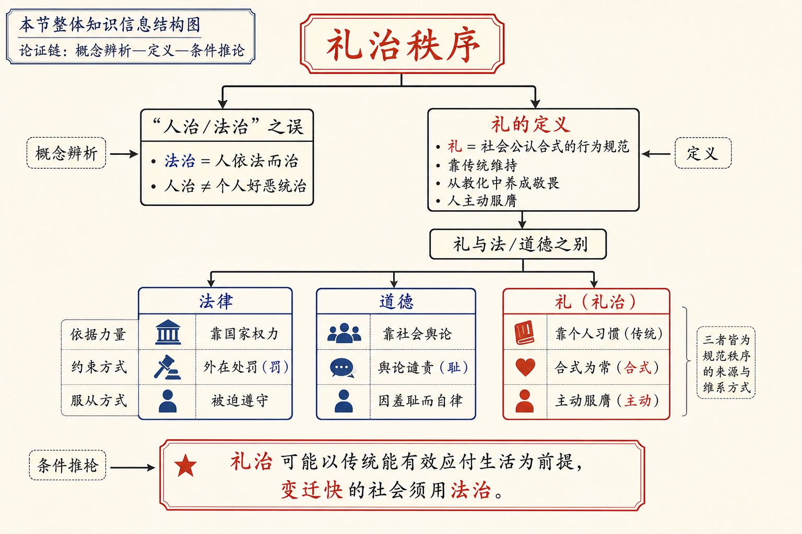
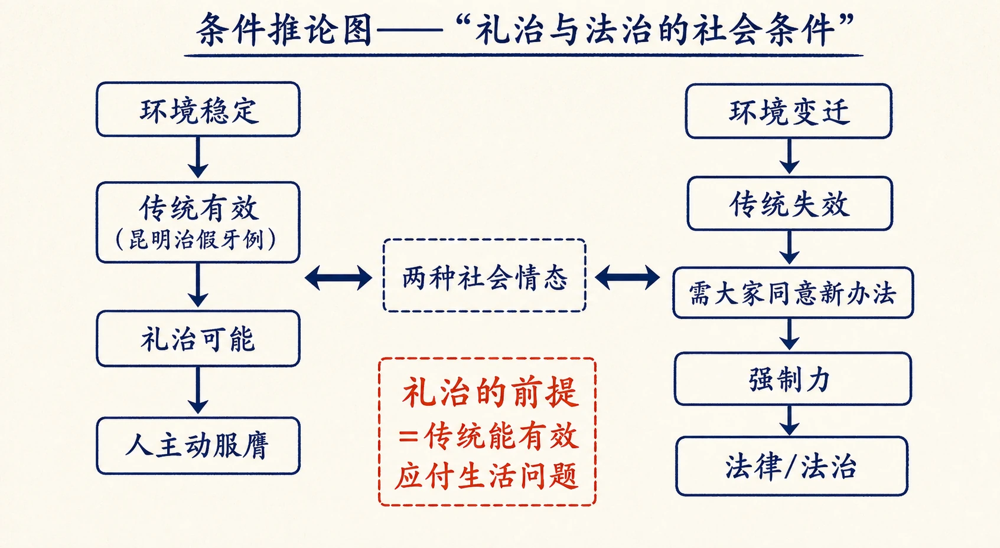
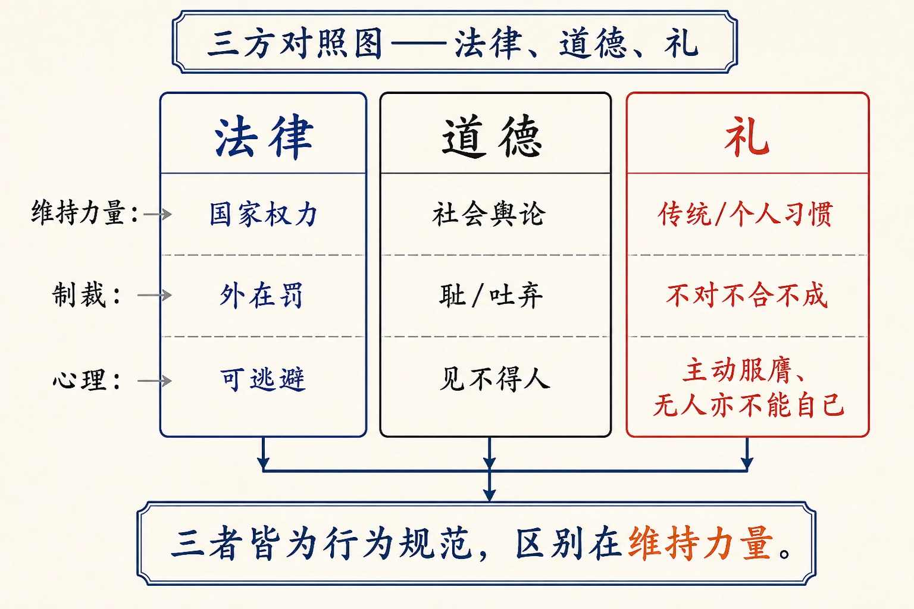
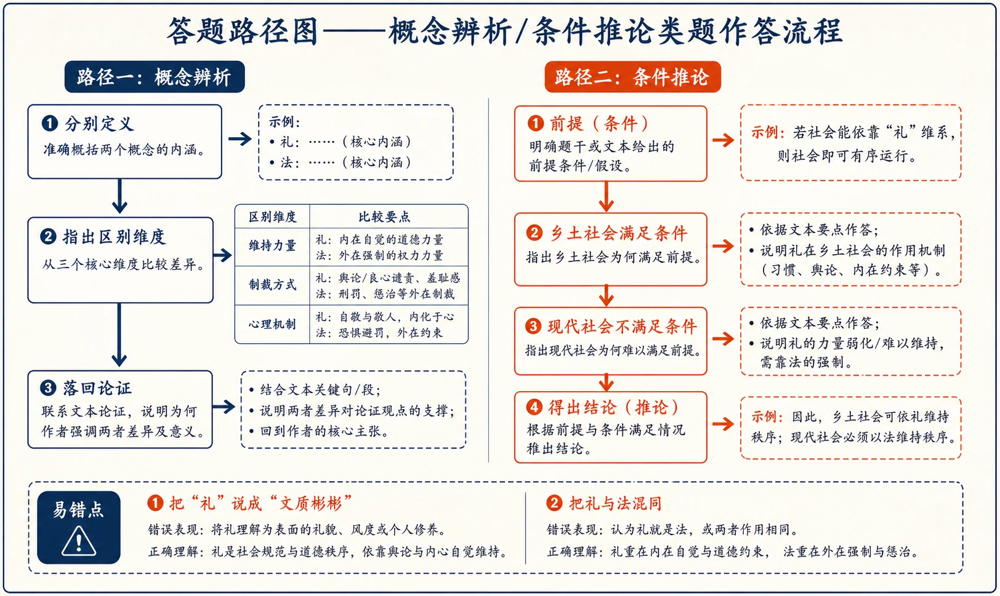

# 12 礼治秩序

<!-- 图片描述：本节整体知识信息结构图，采用“概念辨析—定义—条件推论”论证链。中心概念为“礼治秩序”。上分支辨析“人治/法治”之误：法治=人依法而治，人治≠个人好恶统治；下分支“礼的定义”：礼=社会公认合式的行为规范，靠传统维持，从教化中养成敬畏，人主动服膺；再分“礼与法/道德之别”：法律靠国家权力（外在罚）、道德靠舆论（耻）、礼靠个人习惯（合式、主动）。底部推论“礼治可能以传统能有效应付生活为前提，变迁快的社会须用法治”。朱红标出“礼治”，靛蓝标出“法律/道德”对照，米白纸面、黑灰线条、中文标注、留白充足，符合语文文本精读风格。 -->

## 知识关系导航

- 所属章节：[[章首 学习导图|《乡土中国》学习导图]]
- 前置知识点：[[07-再论文字下乡#三、课文原文与逐段/逐句解读|文化是累积的经验]]（礼所依赖的“传统”即累积的经验）
- 后续知识点：[[13-无讼#三、课文原文与逐段/逐句解读|无讼：礼治秩序的实践形态]]（本章是理解“无讼”的理论前提）
- 相关知识点：[[15-长老统治#三、课文原文与逐段/逐句解读|教化权力]]（礼靠教化养成，与长老统治相通）
- 相关方法：[[11-男女有别#三、课文原文与逐段/逐句解读|阿波罗式与浮士德式]]（稳定社会的秩序方式）

本章是《乡土中国》第八章，讨论乡土社会的秩序如何维持。作者先破除“人治/法治”的简单对立，指出乡土社会是“礼治”社会——礼靠传统维持、靠教化养成、人主动服膺。理解本章的关键，是把握“礼治的可能以传统可以有效地应付生活问题为前提”，从而理解礼治为何只在变迁慢的社会中有效。

## 本节学习目标

- 理解“法治”与“人治”区分的真正标准（维持秩序的力量与所根据规范的性质），破除“人治=个人好恶”的误解。
- 掌握“礼”的定义：社会公认合式的行为规范，靠传统维持。
- 理解礼与法律、道德的区别：维持力量不同（国家权力/社会舆论/个人习惯与敬畏）。
- 理解“传统”在乡土社会中效力大的原因（安土重迁、经验可沿用）。
- 理解礼治的前提条件（传统能有效应付生活问题）及其在变迁社会中的局限。
- 能评价“礼治社会不能出现在变迁很快的时代”这一判断。

## 核心知识点讲解

### 一、文本基本信息与学习任务

- **篇目**：《礼治秩序》，选自费孝通《乡土中国》。
- **作者**：费孝通（1910—2005），中国社会学家、人类学家。
- **文体**：学术随笔／社会学论述文。本章以概念辨析（人治/法治/礼治）和条件推论见长。
- **学习任务**：理解“礼治秩序”的内涵与前提；辨析礼、法、道德三者的区别；理解礼治与乡土社会结构的关系；训练概念辨析与条件推论的答题能力。

### 二、整体内容与结构线索

本文论证线索如下：

1. **破题**：驳“西洋法治、我们人治”的简单对立——法治是“人依法而治”，并非没有人的因素；“人治”若指统治者凭好恶统治则不可能。
2. **立标准**：人治与法治之别，不在“人/法”二字，而在“维持秩序所用的力量”和“所根据规范的性质”。
3. **辨乡土**：乡土社会不是“无政府/无需规律”的理想，而是“无法而有秩序”的礼治社会。
4. **释礼**：礼是社会公认合式的行为规范；与法律不同处在于维持力量——礼靠传统，法律靠国家权力。
5. **释传统**：传统是社会累积的经验；乡土社会安土重迁、代代如是，经验可沿用，故传统效力大，好古是生活保障。
6. **释礼的心理机制**：礼从教化中养成个人的敬畏之感，人服礼是主动的（非礼勿视、听、言、动；曾子易箦）。
7. **三方对照**：法律（外在罚）、道德（舆论之耻）、礼（个人习惯+主动服膺，合式）。
8. **条件结论**：礼治可能以传统能有效应付生活问题为前提；变迁快的社会须靠法治，礼治社会不能出现在变迁很快的时代。

### 三、课文原文与逐段/逐句解读

**【原文】**
> 普通常有以“人治”和“法治”相对称，而且认为西洋是法治的社会，我们是“人治”的社会。其实这个对称的说法并不是很清楚的。法治的意思并不是说法律本身能统治，能维持社会秩序，而是说社会上人和人的关系是根据法律来维持的。法律还得靠权力来支持，还得靠人来执行，法治其实是“人依法而治”，并非没有人的因素。

**【解读】**
- **破常识**：常说的“人治/法治”对立并不清楚。
- **关键定义**：法治=社会上人与人的关系根据法律来维持；“法治其实是‘人依法而治’”，并非没有人的因素。

**【原文】**
> 现代论法理的学者中有些极重视人的因素。他们注意到在应用法律于实际情形时，必须经过法官对于法律条文的解释。……法官个人的偏见，甚至是否有胃病，以及社会的舆论都是极重要的。于是他们认为法律不过是法官的判决。这自是片面的说法，因为法官并不能任意下判决的，他的判决至少也须被认为是根据法律的，但是这种看法也告诉我们所谓法治绝不能缺少人的因素了。

**【解读】**
- **论证技巧**：先引“法律不过是法官的判决”的极端说法，再指出其片面（法官判决须被认为根据法律），但从中保留合理内核——法治不能缺少人的因素。

**【原文】**
> 这样说来，人治和法治有什么区别呢？如果人治是法治的对面，意思应当是“不依法律的统治”了。……望文生义地说来，人治好像是指有权力的人任凭一己之好恶来规定社会上人和人的关系的意思。我很怀疑这种“人治”是可能发生的。如果共同生活的人们，相互的行为、权利和义务，没有一定规范可守，依着统治者好恶来决定。而好恶也无法预测的话，社会必然会混乱……那是不可能的，因之也说不上“治”了。

**【解读】**
- **逻辑反驳**：“人治=统治者凭好恶统治”不可能发生——因为无规范可守、好恶无法预测，社会必然混乱，说不上“治”。
- **关键判断**：所谓人治与法治之别，不在“人和法这两个字上”，而在“维持秩序时所用的力量，和所根据的规范的性质”。

**【原文】**
> 乡土社会秩序的维持，有很多方面和现代社会秩序的维持是不相同的。可是所不同的并不是说乡土社会是“无法无天”，或者说“无需规律”。……返朴回真的老子觉得只要把社区的范围缩小……社会秩序无需外力来维持，单凭每个人的本能或良知，就能相安无事了。……美国还有大多数人信奉着古典经济学里的自由竞争的理想……认为在自由竞争下，冥冥之中，自有一双看不见的手，会为人们理出一个合于道德的经济秩序来的。……当然所谓“无政府”决不是等于“混乱”，而是一种“秩序”，一种不需规律的秩序，一种自动的秩序，是“无治而治”的社会。

**【解读】**
- **辩驳前提**：乡土社会并非“无法无天/无需规律”。
- **对照思想**：老子的“小国寡民”与古典经济学的“看不见的手”，都是“无治而治”的理想——但乡土社会不是这种社会。

**【原文】**
> 可是乡土社会并不是这种社会，我们可以说这是个“无法”的社会，假如我们把法律限于以国家权力所维持的规则；但是“无法”并不影响这社会的秩序，因为乡土社会是“礼治”的社会。

**【解读】**
- **核心判断**：把“法律”限定为“以国家权力所维持的规则”，乡土社会是“无法”的；但“无法”不影响秩序，因为它是“礼治”社会。

**【原文】**
> 让我先说明，礼治社会并不是指文质彬彬，像《镜花缘》里所描写的君子国一般的社会。礼并不带有“文明”、或是“慈善”、或是“见了人点个头”、不穷凶极恶的意思。礼也可以杀人，可以很“野蛮”。譬如在印度有些地方，丈夫死了，妻子得在葬礼里被别人用火烧死，这是礼。……“子贡欲去告朔之饩羊。子曰，赐也，尔爱其羊，我爱其礼。”恻隐之心并没有使孔子同意于取消相当残忍的行为。

**【解读】**
- **澄清误区**：礼≠文质彬彬/慈善/文明；礼可以“野蛮”（印度殉葬、缅甸猎头成年礼、杀人祭旗军礼）。
- **引证**：孔子“我爱其礼”——即使是残忍的告朔饩羊，孔子也重其礼而不轻易取消。说明礼的价值标准不在“文明/慈善”。

**【原文】**
> 礼是社会公认合式的行为规范。合于礼的就是说这些行为是做得对的，对是合式的意思。如果单从行为规范一点说，本和法律无异，法律也是一种行为规范。礼和法不相同的地方是维持规范的力量。法律是靠国家的权力来推行的。“国家”是指政治的权力，在现代国家没有形成前，部落也是政治权力。而礼却不需要这有形的权力机构来维持。维持礼这种规范的是传统。

**【解读】**
- **核心定义（名句）**：礼是社会公认合式的行为规范；合于礼=做得对=合式。
- **关键区分**：礼与法律同为行为规范，差别在**维持力量**——法律靠国家（政治）权力，礼靠传统（不需有形权力机构）。

**【原文】**
> 传统是社会所累积的经验。行为规范的目的是在配合人们的行为以完成社会的任务，社会的任务是在满足社会中各分子的生活需要。……这套方法并不是由每个人自行设计，或临时聚集了若干人加以规划的。人们有学习的能力，上一代所试验出来有效的结果，可以教给下一代。这样一代一代地累积出一套帮助人们生活的方法。从每个人说，在他出生之前，已经有人替他准备下怎样去应付人生道上所可能发生的问题了。他只要“学而时习之”就可以享受满足需要的愉快了。

**【解读】**
- **关键定义**：传统=社会所累积的经验。
- **功能论**：行为规范的目的在配合行为、完成任务、满足生活需要；传统是上一代试验有效的结果教给下一代，一代代累积。
- **关键词**：“学而时习之”——每个人只需学习已有办法即可生活。

**【原文】**
> 文化本来就是传统，不论哪一个社会，绝不会没有传统的。衣食住行种种最基本的事务，我们并不要事事费心思，那是因为我们托祖宗之福，一一有着可以遵守的成法。但是在乡土社会中，传统的重要性比现代社会更甚。那是因为在乡土社会里传统的效力更大。

**【解读】**
- **关键判断**：文化就是传统，任何社会都有；但传统在乡土社会中更重要，因为“传统的效力更大”。
- **学习提示**：全章的关键问题是“为什么乡土社会传统效力大”。

**【原文】**
> 乡土社会是安土重迁的，生于斯、长于斯、死于斯的社会。不但是人口流动很小，而且人们所取给资源的土地也很少变动。在这种不分秦汉，代代如是的环境里，个人不但可以信任自己的经验，而且同样可以信任若祖若父的经验。一个在乡土社会里种田的老农所遇着的只是四季的转换，而不是时代变更。一年一度，周而复始。前人所用来解决生活问题的方案，尽可抄袭来作自己生活的指南。愈是经过前代生活中证明有效的，也愈值得保守。于是“言必尧舜”，好古是生活的保障了。

**【解读】**
- **条件分析**：乡土社会安土重迁、土地少变动、环境“不分秦汉，代代如是” → 经验可信任（自己的、祖辈的）→ 前人方案可抄袭 → 好古是生活保障。
- **名句**：“老农所遇着的只是四季的转换，而不是时代变更”“言必尧舜，好古是生活的保障”。

**【原文】**
> 我自己在抗战时，疏散在昆明乡下，初生的孩子，整天啼哭不定，找不到医生，只有请教房东老太太。她一听哭声就知道牙根上生了“假牙”，是一种寄生菌……她不慌不忙地要我们用咸菜和蓝青布去擦孩子的嘴腔。一两天果然好了。……那是有效的经验。只要环境不变，没有新的细菌侵入，这套不必讲学理的应付方法，总是有效的。既有效也就不必问理由了。

**【解读】**
- **田野例证**：房东老太太治“假牙”（马牙）——有效经验“不必讲学理”，只要环境不变总是有效。
- **学习提示**：这个例子说明传统有效的条件是“环境不变”。

**【原文】**
> 像这一类的传统，不必知之，只要照办，生活就能得到保障的办法，自然会随之发生一套价值。我们说“灵验”，就是说含有一种不可知的魔力在后面。依照着做就有福，不依照了就会出毛病。于是人们对于传统也就渐渐有了敬畏之感了。

**【解读】**
- **价值生成**：传统有效 → “灵验”感 → 相信不可知魔力 → 敬畏之感。
- **学习提示**：礼的“敬畏”心理根源，来自传统有效性的经验积累。

**【原文】**
> 如果我们对行为和目的之间的关系不加推究，只按着规定的方法做，而且对于规定的方法带着不这样做就会有不幸的信念时，这套行为也就成了我们普通所谓“仪式”了。礼是按着仪式做的意思。礼字本是从豊从示。豊是一种祭器，示是指一种仪式。

**【解读】**
- **仪式与礼**：不加推究、按规定做、带着“不这样做会有不幸”的信念→仪式；礼=按仪式做。
- **字源**：礼从豊从示——豊是祭器，示是仪式，说明礼与祭祀仪式同源。

**【原文】**
> 礼并不是靠一个外在的权力来推行的，而是从教化中养成了个人的敬畏之感，使人服膺；人服礼是主动的。礼是可以为人所好的，所谓“富于好礼”。孔子很重视服礼的主动性，在下面一段话里说得很清楚：
> 颜渊问仁。子曰：“克己复礼为仁。一日克己复礼，天下归仁焉。为仁由己，而由人乎哉？”颜渊曰：“请问其目。”子曰：“非礼勿视，非礼勿听，非礼勿言，非礼勿动。”

**【解读】**
- **核心判断（名句）**：礼不靠外在权力推行，而从教化中养成敬畏、使人服膺；**人服礼是主动的**。
- **引证**：孔子“克己复礼”“为仁由己”“非礼勿视、听、言、动”——强调由己、主动。

**【原文】**
> 这显然是和法律不同了，甚至不同于普通所谓道德。法律是从外限制人的，不守法所得到的罚是由特定的权力所加之于个人的。人可以逃避法网，逃得脱还可以自己骄傲、得意。道德是社会舆论所维持的，做了不道德的事，见不得人，那是不好；受人吐弃，是耻。礼则有甚于道德：如果失礼，不但不好，而且不对、不合、不成。这是个人习惯所维持的。十目所视，十手所指的，即使在没有人的地方也会不能自已。曾子易箦是一个很好的例子。礼是合式的路子，是经教化过程而成为主动性的服膺于传统的习惯。

**【解读】**
- **三方对照**：
  - 法律：外在限制，罚由特定权力施加，可逃避法网。
  - 道德：社会舆论维持，失德之耻（见不得人、受人吐弃）。
  - 礼：个人习惯维持，失礼不仅“不好”且“不对、不合、不成”，即使无人也会“不能自已”（曾子易箦）。
- **核心结论**：礼=合式的路子，经教化而成为“主动性的服膺于传统的习惯”。

**【原文】**
> 礼治从表面看去好像是人们行为不受规律拘束而自动形成的秩序。其实自动的说法是不确，只是主动地服于成规罢了。孔子一再地用“克”字，用“约”字来形容礼的养成，可见礼治并不是离开社会，由于本能或天意所构成的秩序了。

**【解读】**
- **辨析**：礼治表面像“自动”，其实是“主动地服于成规”；孔子用“克”“约”形容，说明礼治是社会教化的结果，非本能或天意。

**【原文】**
> 礼治的可能必须以传统可以有效地应付生活问题为前提。乡土社会满足了这前提，因之它的秩序可以用礼来维持。在一个变迁很快的社会，传统的效力是无法保证的。不管一种生活的方法在过去是怎样有效，如果环境一改变，谁也不能再依着法子去应付新的问题了。所应付的问题如果要由团体合作的时候，就得大家接受个同意的办法，要保证大家在规定的办法下合作应付共同问题，就得有个力量来控制各个人了。这其实就是法律。也就是所谓“法治”。

**【解读】**
- **核心条件（名句）**：礼治的可能，必须以“传统可以有效地应付生活问题”为前提。
- **推论**：环境改变→传统失效→需要大家同意的新办法→需要控制力→法律/法治。

**【原文】**
> 法治和礼治是发生在两种不同的社会情态中。这里所谓礼治也许就是普通所谓人治，但是礼治一词不会像人治一词那样容易引起误解，以致有人觉得社会秩序是可以由个人好恶来维持的了。礼治和这种个人好恶的统治相差很远，因为礼是传统，是整个社会历史在维持这种秩序。礼治社会是并不能在变迁很快的时代中出现的，这是乡土社会的特色。

**【解读】**
- **总结性判断**：法治与礼治发生在两种不同的社会情态中。
- **澄清**：礼治虽可俗称“人治”，但与“个人好恶统治”相差很远——礼是传统，是整个社会历史维持秩序。
- **名句**：“礼治社会是并不能在变迁很快的时代中出现的，这是乡土社会的特色。”

### 四、关键语句、人物/意象与细节精读

- **“法治其实是‘人依法而治’，并非没有人的因素。”**：破除“法治无人”误解的关键句。
- **“所谓人治和法治之别，不在人和法这两个字上，而是在维持秩序时所用的力量，和所根据的规范的性质。”**：本章立论标准。
- **“礼是社会公认合式的行为规范。”**：礼的定义。
- **“维持礼这种规范的是传统。”**：礼与法的分野所在。
- **“传统是社会所累积的经验。”**：传统的定义。
- **“人服礼是主动的。”**：礼的心理机制核心。
- **“礼治的可能必须以传统可以有效地应付生活问题为前提。”**：全章条件推论的关键。
- **人物·老子**：“小国寡民”“鸡犬相闻”理想，无治而治的思想原型。
- **人物·亚当·斯密**：“看不见的手”——自由竞争自动秩序的现代版本。
- **人物·曾子**：“曾子易箦”典出《礼记》，病重仍坚持换掉大夫专用的卧席，体现礼的自觉服膺。
- **意象·豊与示**：礼字从豊从示，祭器与仪式，说明礼的祭祀起源。
- **文化常识**：印度殉葬礼、缅甸猎头成年礼、杀人祭旗军礼、“告朔饩羊”等礼的“野蛮”例证。

### 五、语言风格与表达手法

- **概念辨析**：逐层辨析人治/法治/礼治、礼/法/道德。
- **条件推论**：由“环境不变→传统有效→礼治可能”到“环境变→传统失效→法治必要”，逻辑严密。
- **例证丰富**：昆明乡下治“假牙”、印度殉葬、缅甸猎头、曾子易箦、告朔饩羊，古今中外。
- **字源考证**：从“豊”“示”释“礼”，增加学理厚度。
- **驳论结合**：先驳“人治/法治”简单对立与“乡土社会无法无天”说，再立礼治之说。

### 六、主题思想、情感态度与文化理解

- **主题**：乡土社会的秩序是礼治秩序——礼靠传统维持、靠教化养成、人主动服膺；礼治只在传统能有效应付生活问题的稳定社会中可能，变迁快的现代社会须靠法治。
- **情感态度**：作者既肯定礼治在乡土社会中的有效性（不贬之为“落后”），也冷静指出其条件与限度（变迁社会必须法治）；对“礼可以野蛮”作客观陈述，不作道德审判。
- **文化理解**：理解“礼”与“仪式”的原始关联、与祭祀同源的文化渊源；理解“好古”“言必尧舜”的生存逻辑；理解礼治社会向法治社会转型的条件性。

### 七、阅读答题与写作迁移

- **答题模板（概念辨析）**：先分别定义，再指出区别维度（维持力量、心理机制、制裁方式），最后落回论证目的。
- **答题模板（条件推论）**：指出前提条件（传统有效应付生活）→分析满足/不满足的情形→得出结论。
- **答题模板（例证作用）**：例子内容+证明的观点+与上下文关系。
- **写作迁移**：学习“先破后立”的论证结构；学习用字源、史料与田野经验增强说服力。

<!-- 图片描述：条件推论图——“礼治与法治的社会条件”。左侧分支：环境稳定→传统有效（昆明治假牙例）→礼治可能→人主动服膺；右侧分支：环境变迁→传统失效→需大家同意新办法→强制力→法律/法治。中间用双向箭头标注“两种社会情态”，朱红标出“礼治的前提=传统能有效应付生活问题”。米白纸面、黑灰线条、中文标注。 -->

## 重点梳理

- **破题**：法治=人依法而治；人治≠个人好恶统治（那样不可能“治”）。
- **立论标准**：人治/法治之别在“维持秩序的力量”与“规范的性质”。
- **礼的定义**：礼=社会公认合式的行为规范；合于礼=做得对=合式。
- **礼法之别**：法律靠国家权力；礼靠传统（不需有形权力机构）。
- **礼的心理机制**：从教化中养成敬畏，人服礼是主动的（克己复礼、非礼勿视听说动、曾子易箦）。
- **三方对照（礼法道德之辨）**：法律（外在罚）、道德（舆论之耻）、礼（个人习惯，失礼不仅不好且不对不合不成）。
- **条件结论**：礼治可能以传统有效应付生活为前提；变迁快的社会须法治；礼治社会不能出现在变迁很快的时代。
- **必记名句**：“法治其实是‘人依法而治’”“礼是社会公认合式的行为规范”“传统是社会所累积的经验”“人服礼是主动的”“礼治的可能必须以传统可以有效地应付生活问题为前提”。
- **论证方法**：概念辨析、条件推论、驳论结合、字源考证、中外例证。

## 难点突破

<!-- 图片描述：三方对照图——“法律、道德、礼”。三个并排矩形：法律（维持力量：国家权力；制裁：外在罚；心理：可逃避）、道德（维持力量：社会舆论；制裁：耻/吐弃；心理：见不得人）、礼（维持力量：传统/个人习惯；制裁：不对不合不成；心理：主动服膺、无人亦不能自已）。用朱红标出“礼”，靛蓝标出“法律”，黑色标出“道德”，下方箭头标注“三者皆为行为规范，区别在维持力量”。米白纸面、黑灰线条、中文标注。 -->

- **难点一：为什么“人治”若指个人好恶统治就不可能发生？**
  突破：社会要维持秩序，人与人的关系必须有规范可依；若统治者凭不可预测的好恶规定关系，人们无法预知如何行动，社会必然混乱，也就“说不上治”。故“人治”与“法治”的真正区别在维持秩序的力量与规范的性质，不在有没有“人”。
- **难点二：礼与法同样是行为规范，区别在哪？**
  突破：区别在**维持力量**。法律靠国家（政治）权力推行，有形的制裁；礼靠传统维持，从教化中养成敬畏，不需有形权力机构。故“无法”的乡土社会仍有秩序（礼治）。
- **难点三：礼治为什么只可能在稳定社会？**
  突破：礼治的前提是“传统能有效应付生活问题”。乡土社会安土重迁、环境不变，前人经验可沿用，故传统有效；环境一变，传统失效，就须大家同意新办法并由强制力保证——即法治。故“礼治社会不能出现在变迁很快的时代”。
- **难点四：礼、道德、法律的制裁有何不同？**
  突破：法律=特定权力施加的罚（可逃避）；道德=社会舆论（失德之耻，见不得人）；礼=个人习惯（失礼不仅不好，而且不对、不合、不成，无人也“不能自已”，如曾子易箦）。礼比道德更深入内心，靠“敬畏”而非“怕舆论”。

<!-- 图片描述：答题路径图——概念辨析/条件推论类题作答流程。概念辨析：分别定义→指出区别维度（维持力量/制裁方式/心理机制）→落回论证；条件推论：前提→乡土满足→现代不满足→结论。两条路径用不同颜色箭头，底部标注易错点（把礼说成文质彬彬、把礼法混同）。米白纸面、黑灰线条、中文标注。 -->

## 例题讲解

**例题1（概念辨析）** 作者为什么说“法治其实是‘人依法而治’”？这对理解“人治/法治”有何意义？
- **分析**：回扣开篇“法律还得靠权力支持，还得靠人来执行”。
- **答案**：法治不是说法律本身能统治，而是社会关系根据法律维持；法律要靠权力支持、靠人执行（法官解释等），故“法治=人依法而治”，并非没有人的因素。这破除了“法治无人、人治有人”的简单对立，把问题引向“维持秩序的力量与规范的性质”。
- **反思**：辨析题要“引原文定义+说明论证作用”。

**例题2（条件推论）** 结合文本，说明“礼治的可能”需要什么前提，现代社会为何不能全靠礼治。
- **分析**：定位“礼治的可能必须以传统可以有效地应付生活问题为前提”段。
- **答案**：前提是传统能有效应付生活问题，即环境稳定、经验可沿用（乡土社会安土重迁、代代如是）。现代社会变迁快，环境改变使旧方法失效，问题需要团体合作、大家同意新办法，就必须有控制力量——法律，即法治。
- **反思**：条件推论题要“前提→乡土满足→现代不满足→结论”完整作答。

**例题3（例证作用）** 文中“昆明乡下房东老太太治‘假牙’”的例子有何作用？
- **分析**：定位“传统是社会累积的经验”与“灵验/敬畏”之间。
- **答案**：①内容上，说明传统是“不必讲学理”却有效的经验，只要环境不变总是有效；②论证上，把抽象的“传统效力”具象化，为“好古是生活保障”“敬畏之感”提供事实依据；③语言上，以亲身经历增强亲切感与说服力。
- **反思**：例证题要“内容+论证作用+表达效果”。

**例题4（观点评价）** 作者说“礼也可以杀人，可以很‘野蛮’”，你如何理解这一判断？
- **分析**：回扣礼的定义与“子贡欲去告朔之饩羊”。
- **答案**：作者不是赞美“野蛮”，而是指出“礼”的判断标准是“合式”（社会公认），不是“文明/慈善”；礼的内容因社会而异（印度殉葬、缅甸猎头），孔子甚至为“礼”不取消残忍的告朔饩羊。这提醒我们：评价礼治须放回其社会语境，不能以现代“文明”标准简单褒贬——这也是作者“结构分析”立场的体现。
- **反思**：评价题要“还原语境→分析标准→辩证”。

## 易错点整理

- **概念误读**：把“礼治”理解为“文质彬彬/讲礼貌”。避免：礼=合式的行为规范，礼也可以杀人、很野蛮。
- **“人治”错解**：把“人治”解释为“统治者凭好恶统治”。避免：作者说这种“人治”不可能，礼治≠个人好恶统治。
- **礼法混淆**：说“礼靠国家权力维持”。避免：礼靠传统，法律靠国家权力——差别在维持力量。
- **条件遗漏**：答“礼治适用于任何社会”。避免：礼治可能以“传统有效应付生活”为前提，变迁快的社会须法治。
- **制裁错位**：把礼的制裁说成“舆论/法律”。避免：礼=个人习惯+敬畏（不对、不合、不成），道德=舆论之耻，法律=外在罚。

## 考点考证点整理

### 考点一：概念理解与辨析
- **出题思路**：解释“法治”“人治”“礼治”，或辨析礼、法、道德。
- **关键条件**：回到原文定义句与三方对照段。
- **解答要点**：分别定义+区别维度（维持力量、制裁方式、心理机制）+论证作用。
- **易扣分点**：用现代常识解释礼治；漏“维持力量”这一关键维度。

### 考点二：条件分析与推论
- **出题思路**：礼治为什么可能？变迁社会为什么需要法治？
- **关键条件**：抓住“传统有效应付生活问题”这一前提。
- **解答要点**：前提→乡土满足→现代不满足→结论。
- **易扣分点**：只答“乡土社会稳定”而不点明“传统有效”的前提。

### 考点三：例证与引证作用
- **出题思路**：分析昆明治“假牙”、曾子易箦、告朔饩羊等例证/引证的作用。
- **关键条件**：明确各例为哪个观点服务。
- **解答要点**：内容+证明的观点+结构/表达作用。
- **易扣分点**：只复述例子不分析；张冠李戴（把曾子易箦说成证明“法律制裁”）。

### 考点四：文本主旨与结构把握
- **出题思路**：概括本文中心论点或论证思路。
- **关键条件**：抓“礼治=乡土社会秩序”及“先破后立”结构。
- **解答要点**：中心论点+论证层次（破对立→立标准→释礼释传统→三方对照→条件结论）。
- **易扣分点**：漏“先破后立”的结构提示；把结论当论点。

### 考点五：观点评价与现实意义
- **出题思路**：评析“礼治社会不能出现在变迁很快的时代”，或谈礼治对当代法治建设的启示。
- **关键条件**：兼顾礼治的历史合理性与其条件限度。
- **解答要点**：还原观点→分析依据→联系现实（法治下乡难、传统观念仍在）→辩证。
- **易扣分点**：只批判“封建礼教”；不联系结构分析。

## 练习题

> 说明：本章源文（费孝通《乡土中国·礼治秩序》）未附课后练习题，以下题目根据本章核心考点自拟，用于巩固整本书阅读与论述类文本阅读能力。

**一、基础理解（自拟）**
1. 根据原文，写出“礼”的定义，并说明礼与法律在维持力量上的区别。
2. 作者认为“礼治的可能”以什么为前提？

**二、文本分析（自拟）**
3. 作者如何反驳“人治=统治者凭好恶统治”的说法？
4. 文中从哪几个层面说明“传统在乡土社会中效力更大”？

**三、鉴赏评价（自拟）**
5. 分析本文“先破后立”的论证结构。
6. 作者说“礼也可以杀人，可以很‘野蛮’”，结合“告朔饩羊”说明这句话的含义与作者的态度。

**四、迁移写作（自拟）**
7. 联系《礼治秩序》，谈谈传统“礼”的观念在今天社会生活中的利与弊（不少于 200 字）。

## 练习题答案

**1.** 礼是社会公认合式的行为规范；合于礼=做得对=合式。礼与法律同为行为规范，区别在维持力量：法律靠国家（政治）权力推行，礼靠传统维持，不需要有形的权力机构。
> 要点：定义+“维持力量”差异，缺一不可。

**2.** 礼治的可能必须以“传统可以有效地应付生活问题”为前提。乡土社会安土重迁、环境不变，传统有效，故可用礼治；环境改变、传统失效时，须靠法律（法治）。
> 评分：前提句完整写出，并说明两种情形。

**3.** 作者指出，若“人治”指统治者凭一己好恶规定人与人的关系，那么好恶无法预测、无规范可守，社会必然混乱，说不上“治”，故这种“人治”不可能发生。人治与法治的真正区别在维持秩序的力量与所根据规范的性质，不在有没有“人”。
> 评分：须答出“逻辑反驳”与“真正区别”两层。

**4.** ①乡土社会安土重迁，人口流动小、土地少变动，环境“不分秦汉，代代如是”；②个人可信任自己的经验，也可信任祖辈的经验（老农只遇四季转换，不遇时代变更）；③前人方案可抄袭作生活指南，愈有效愈保守，故“好古是生活的保障”。总言之，环境不变使经验永远有效，传统效力才大。
> 评分：分点作答，突出“环境不变→经验有效”。

**5.** 先破：驳“西洋法治、我们人治”的简单对立（法治也靠人执行），驳“人治=个人好恶”（不可能），驳“乡土社会无法无天/无治而治”（它是有秩序的礼治社会）。后立：正面定义礼、传统，说明礼的心理机制（主动服膺），再作条件推论（传统有效则礼治，环境变则法治）。先破后立使立论更稳、说服力更强。
> 评分：分别说明“破”与“立”的内容及效果。

**6.** 含义：“礼”的标准是“合式”（社会公认），不是“文明/慈善”；礼的内容因社会而异，可以很野蛮（如殉葬、猎头）。孔子不取消残忍的“告朔饩羊”，是因为重“礼”本身而非其内容。态度：作者客观陈述“礼可以野蛮”的事实，不作道德审判，体现结构分析的立场——评价礼治须放回其社会语境。
> 评分：含义+态度都要答，态度须点明“结构分析立场”。

**7.** （写作评分要点）能辩证看待即可：利——礼的主动服膺与道德内化可降低治理成本、维系人伦温情（如礼让、尊老）；弊——礼治依赖传统与稳定，遇新问题易失效，且“野蛮之礼”若不合时代可能危害个体（如旧礼的等级束缚）。结论：继承礼的教化与自律精神，同时以法治保障权利，礼法互补。要求结合实例，逻辑清晰，不少于 200 字。
