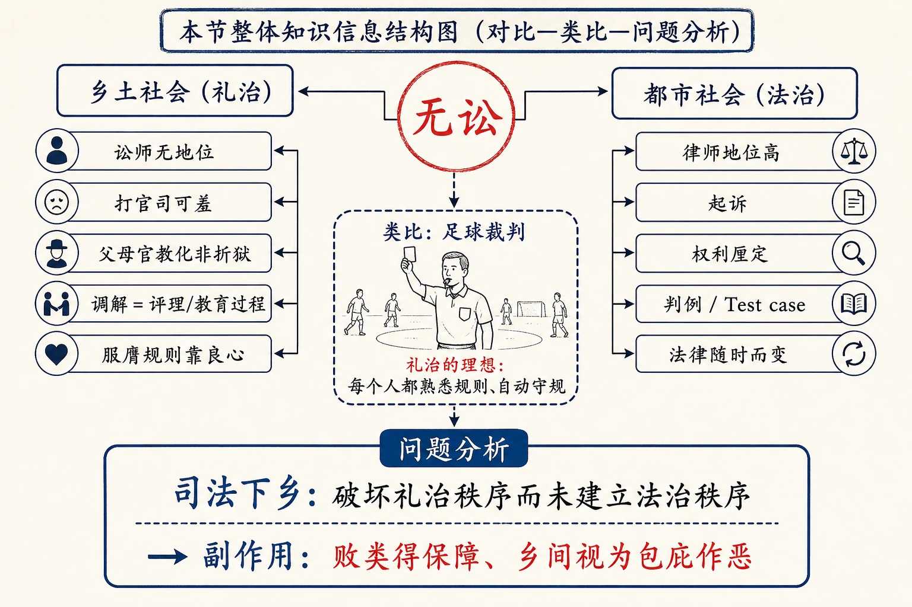
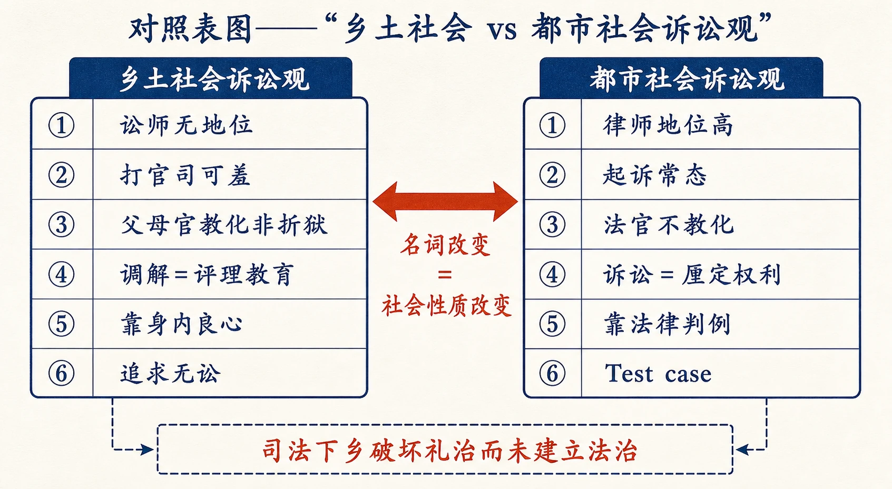
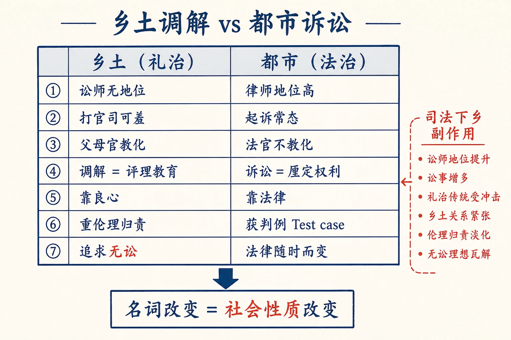
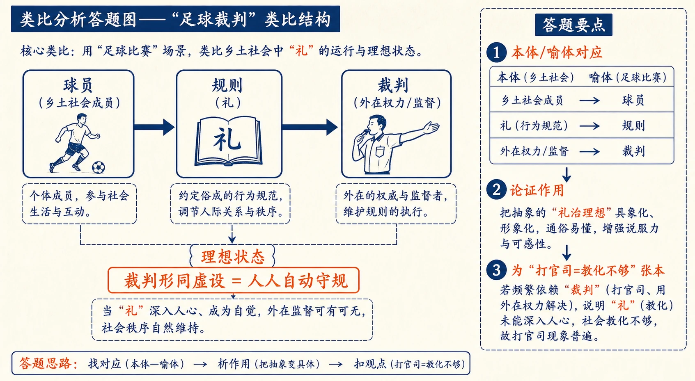

# 13 无讼

<!-- 图片描述：本节整体知识信息结构图，采用“对比—类比—问题分析”论证结构。中心概念为“无讼”。左分支“乡土社会（礼治）：讼师无地位—打官司可羞—父母官教化非折狱—调解=评理/教育过程—服膺规则靠良心”；右分支“都市社会（法治）：律师地位高—起诉—权利厘定—判例/Test case—法律随时而变”。中间用足球裁判类比“礼治的理想：每个人都熟悉规则、自动守规”。底部问题“司法下乡：破坏礼治秩序而未建立法治秩序——败类得保障、乡间视为包庇作恶”。朱红标出“无讼”，靛蓝标出“司法下乡副作用”，米白纸面、黑灰线条、中文标注、留白充足，符合语文文本精读风格。 -->

## 知识关系导航

- 所属章节：[[章首 学习导图|《乡土中国》学习导图]]
- 前置知识点：[[12-礼治秩序#三、课文原文与逐段/逐句解读|礼治秩序与教化]]（本章是礼治秩序在纠纷解决上的延伸）
- 对比知识点：[[13-无讼#三、课文原文与逐段/逐句解读|乡土调解与都市诉讼]]（两种秩序的纠纷处理对照）
- 相关知识点：[[09-维系着私人的道德#三、课文原文与逐段/逐句解读|差序格局的道德与法律伸缩]]（司法下乡困难的结构根源）
- 相关方法：[[12-礼治秩序#三、课文原文与逐段/逐句解读|礼法道德之辨]]（判断“乡间认为坏的行为却合法”）

本章是《乡土中国》第九章，紧接《礼治秩序》，讨论礼治社会中的纠纷如何解决。礼治社会以“无讼”为理想，靠教化与调解维持秩序；而现代法治社会的诉讼观念与之相反。本章后半以“司法下乡”为例，分析两种秩序冲突的实际后果——这是全书中少有的“实践批判”篇章。

## 本节学习目标

- 理解“无讼”观念的内涵：乡土社会以打官司为可羞，以教化与调解为维持秩序的常态。
- 理解乡土社会“调解=评理=教育过程”的性质，能分析文中调解案例。
- 辨析乡土社会与现代都市在诉讼观念、律师地位、法律性质上的差异。
- 理解“司法下乡”的副作用：破坏礼治秩序而未建立法治秩序，理解其结构根源。
- 掌握类比论证（足球裁判）、材料分析（调解案例、县长事例）的答题方法，能评价“法治下乡难”的观点。

## 核心知识点讲解

### 一、文本基本信息与学习任务

- **篇目**：《无讼》，选自费孝通《乡土中国》。
- **作者**：费孝通（1910—2005），中国社会学家、人类学家。
- **文体**：学术随笔／社会学论述文。本章以亲身参与的调解经历和县长访谈为例，实证色彩浓。
- **学习任务**：理解“无讼”观念与礼治秩序的关系；分析乡土调解的性质；理解司法下乡的困境；训练类比论证、材料分析的答题能力。

### 二、整体内容与结构线索

本文论证线索如下：

1. **现象对照**：乡土社会中“讼师”无地位、打官司可羞；都市中律师地位高、请法律顾问。名词变迁（讼师→律师、打官司→起诉）代表社会性质变迁。
2. **解释都市**：都市法律是专门知识，不谙法律不能在法律之外生活，故需要律师；法治社会中不知道法律不是“败类”。
3. **解释乡土**：礼治社会中不知礼是道德问题；维持礼治秩序的理想手段是教化而非折狱；听讼程序（包公案式）在乡土中公认正当。
4. **足球裁判类比**：理想礼治是每个人都谙熟规则、自动守规，裁判形同虚设；犯规是训练不良。
5. **说明调解**：乡土调解是“评理”、教育过程；乡绅骂双方、劝和、罚请客；举抽大烟家庭纠纷案例。
6. **对比现代诉讼**：现代法官不教化人，刑罚为保护权利而非以儆效尤；诉讼在厘定权利、获取判例（Test case）。
7. **问题分析**：中国正从乡土蜕变，现行法从西洋搬来、与旧伦理冲突；司法下乡使“败类”获保障、乡间视司法为包庇作恶机构；破坏礼治而未建立法治。
8. **结论**：法治秩序建立不能单靠法律条文与法庭，还需社会结构与思想观念改革。

### 三、课文原文与逐段/逐句解读

**【原文】**
> 在乡土社会里，一说起“讼师”，大家就会联想到“挑拨是非”之类的恶行。作刀笔吏的在这种社会里是没有地位的。可是在都市里律师之上还要加个大字，报纸的封面可能全幅是律师的题名录。而且好好的公司和个人，都会去请律师作常年顾问。在传统眼光中，都市真是个是非场，规矩人是住不得的了。
> 讼师改称律师，更加大字在上；打官司改称起诉；包揽是非改称法律顾问——这套名词的改变正代表了社会性质的改变，也就是礼治社会变为法治社会。

**【解读】**
- **现象对照**：乡土中讼师=挑拨是非（无地位）；都市中律师=座上宾（加“大”字、常年顾问）。
- **关键判断**：名词的改变（讼师→律师、打官司→起诉）代表社会性质改变——礼治社会变为法治社会。

**【原文】**
> 在都市社会中一个人不明白法律，要去请教别人，并不是件可耻之事。事实上，普通人在都市里居住，求生活，很难知道有关生活、职业的种种法律。法律成了专门知识。不知道法律的人却又不能在法律之外生活。在有秩序的都市社会中，在法律之外生活就会捣乱社会的共同安全，于是这种人不能不有个顾问了。律师地位的重要从此获得。

**【解读】**
- **都市逻辑**：法律=专门知识；不懂法律却无法在法律之外生活→需要顾问→律师地位重要。不知法不是可耻。

**【原文】**
> 但是在乡土社会的礼治秩序中做人，如果不知道“礼”，就成了撒野，没有规矩，简直是个道德问题，不是个好人。一个负责地方秩序的父母官，维持礼治秩序的理想手段是教化，而不是折狱。如果有非打官司不可，那必然是因为有人破坏了传统的规矩。在旧小说上，我们常见的听讼，亦称折狱的程序是：把“犯人”拖上堂，先各打屁股若干板，然后一方面大呼冤枉。父母官用了他“看相”式的眼光，分出那个“獐头鼠目”，必非好人，重加呵责，逼出供状，结果好恶分辨，冤也伸了，大呼青天。——这种程序在现代眼光中，会感觉到没有道理；但是在乡土社会中，这却是公认正当的。

**【解读】**
- **乡土逻辑**：不知礼=撒野/道德问题；父母官维持礼治的理想手段是**教化而非折狱**。
- **听讼程序例**：包公案式折狱（打板子、看相式辨忠奸、大呼青天）——现代眼光没道理，乡土公认正当。说明两种秩序的标准不同。

**【原文】**
> 我在上一次杂话中已说明了礼治秩序的性质。在这里我可以另打一个譬喻来说明：在我们比赛足球时，裁判官吹了叫子，说那个人犯规，那个人就得受罚，用不到由双方停了球辩论。最理想的球赛是裁判员形同虚设（除了做个发球或出界的信号员）。为什么呢？那是因为每个参加比赛的球员都应当事先熟悉规则，而且都事先约定根据双方同意的规则进行比赛，裁判员是规则的权威。他的责任是在察看每个球员的动作不越出规则之外。一个有Sportsmanship的球员并不会在裁判员的背后，向对方的球员偷偷地打一暗拳。如果发生此类事情，不但裁判员可以罚他，而且这个球员，甚至全球队的名誉即受影响。球员对于规则要谙熟，技艺要能做到从心所欲而不逾规的程度，他需要长期的训练。如果发生有意犯规的举动，就可以说是训练不良，也是指导员的耻辱。

**【解读】**
- **类比论证**：理想球赛=裁判形同虚设，因为球员都谙熟规则、自动守规、有运动精神。
- **对应关系**：球员=乡土社会成员；裁判=外在监督/权力；规则=礼。理想礼治=每个人都主动守礼，无需外在强制。

**【原文】**
> 这个譬喻可以用来说明乡土社会对于讼事的看法。所谓礼治就是对传统规则的服膺。生活各方面，人和人的关系，都有着一定的规则。行为者对于这些规则从小就熟习，不问理由而认为是当然的。长期的教育已把外在的规则化成了内在的习惯。维持礼俗的力量不在身外的权力，而是在身内的良心。所以这种秩序注重修身，注重克己。理想的礼治是每个人都自动地守规矩，不必有外在的监督。但是理想的礼治秩序并不是常有的。一个人可以为了自私的动机，偷偷地越出规矩。这种人在这种秩序里是败类无疑。

**【解读】**
- **核心定义**：礼治=对传统规则的服膺；规则从小熟习、不问理由视为当然；教育把外在规则化为内在习惯。
- **关键判断**：维持礼俗的力量“不在身外的权力，而是在身内的良心”；注重修身克己。
- **败类概念**：偷越规矩的人是“败类”——打官司也成了可羞之事，表示教化不够。

**【原文】**
> 每个人知礼是责任，社会假定每个人是知礼的，至少社会有责任要使每个人知礼。所以“子不教”成了“父之过”。这也是乡土社会中通行“连坐”的根据。儿子做了坏事情，父亲得受刑罚，甚至教师也不能辞其咎，教得认真，子弟不会有坏的行为。打官司也成了一种可羞之事，表示教化不够。

**【解读】**
- **推论**：社会假定人人知礼、有责任使人知礼→“子不教，父之过”→连坐制度→打官司=教化不够=可羞。
- **学习提示**：“连坐”不是统治者残暴，而是礼治教化逻辑的延伸。

**【原文】**
> 在乡村里所谓调解，其实是一种教育过程。我曾在乡下参加过这类调解的集会。我之被邀，在乡民看来是极自然的，因为我是在学校里教书的，读书知礼，是权威。其他负有调解责任的是一乡的长老。最有意思的是保长从不发言，因为他在乡里并没有社会地位，他只是个干事。调解是个新名词，旧名词是评理。差不多每次都由一位很会说话的乡绅开口。他的公式总是把那被调解的双方都骂一顿。“这简直是丢我们村子里脸的事！你们还不认了错，回家去。”接着教训了一番。有时竟拍起桌子来发一阵脾气。他依着他认为“应当”的告诉他们。这一阵却极有效，双方时常就“和解”了，有时还得罚他们请一次客。

**【解读】**
- **调解的性质**：调解=评理=教育过程（不是厘定权利，而是教训与劝和）。
- **参与者**：乡绅/长老主持（读书知礼是权威），保长无社会地位不发言（“只是干事”）。
- **方式**：骂双方、教训、罚请客——以“丢脸”和“应当”来教化，极有效。

**【原文】**
> 我记得一个很有意思的案子：某甲已上了年纪，抽大烟。长子为了全家的经济，很反对他父亲有这嗜好，但也不便干涉。次子不务正业，偷偷抽大烟，时常怂恿老父亲抽大烟，他可以分润一些。有一次给长子看见了，就痛打他的弟弟，这弟弟赖在老父身上。长子一时火起，骂了父亲。家里大闹起来，被人拉到乡公所来评理。那位乡绅，先照例认为这是件全村的丑事。接着动用了整个伦理原则，小儿子是败类，看上去就不是好东西，最不好，应当赶出村子。大儿子骂了父亲，该罚。老父亲不知道管教儿子，还要抽大烟，受了一顿教训。这样，大家认了罚回家。

**【解读】**
- **案例内容**：抽大烟家庭纠纷（次子怂恿老父、长子打弟骂父）。
- **调解逻辑**：动用伦理原则——小儿子败类应赶出村、长子骂父该罚、老父失教受训；不辨是非对错（法律角度），只按伦理等级归责。
- **点睛**：乡绅回头发牢骚“一代不如一代，世风日下”——以道德评价而非事实调查处理纠纷。

**【原文】**
> 子曰：“听讼，吾犹人也，必也使无讼乎。”——当时体会到了孔子说这话时的神气了。

**【解读】**
- **引证点睛**：孔子“必也使无讼乎”——理想不是“把官司断好”，而是“使讼不发生”。与调解案例互证：礼治追求的是无讼，不是好诉讼。
- **表达效果**：作者说“体会到了孔子说这话时的神气”，把抽象理想与亲身经验接通。

**【原文】**
> 现代都市社会中讲个人权利，权利是不能侵犯的。国家保护这些权利，所以定下了许多法律。一个法官并不考虑道德问题、伦理观念，他并不在教化人。刑罚的用意已经不复“以儆效尤”，而是在保护个人的权利和社会的安全。尤其在民法范围里，他并不是在分辨是非，而是在厘定权利。在英美以判例为基础的法律制度下，很多时间诉讼的目的是在获得以后可以遵守的规则。一个变动中的社会，所有的规则是不能不变动的。环境改变了，相互权利不能不跟着改变。事实上并没有两个案子的环境完全相同，所以各人的权利应当怎样厘定，时常成为问题，因之构成诉讼，以获取可以遵守的判例，所谓Test case。在这种情形里自然不发生道德问题了。

**【解读】**
- **现代诉讼观**：法官不教化人；刑罚为保护权利与安全；民法不是分辨是非而是厘定权利；诉讼为获判例（Test case）供以后遵守。
- **关键判断**：环境变→权利变→需判例——诉讼是现代社会的正常机制，不涉及道德问题。

**【原文】**
> 现代的社会中并不把法律看成一种固定的规则，法律一定得随着时间而改变其内容。也因之，并不能盼望各个在社会里生活的人都能熟悉这与时俱新的法律，所以不知道法律并不成为“败类”。律师也成了现代社会中不可缺的职业。

**【解读】**
- **对照收束**：法律随时而变→无人能全部熟悉→不知法不是“败类”→律师必不可少。与乡土“不知礼=败类”恰成对照。

**【原文】**
> 中国正处在从乡土社会蜕变的过程中，原有对诉讼的观念还是很坚固地存留在广大的民间，也因之使现代的司法不能彻底推行。第一是现行法里的原则是从西洋搬过来的，和旧有的伦理观念相差很大。我在前几篇杂话中已说过，在中国传统的差序格局中，原本不承认有可以施行于一切人的统一规则，而现行法却是采用个人平等主义的。这一套已经使普通老百姓不明白，在司法制度的程序上又是隔膜到不知怎样利用。在乡间普通人还是怕打官司的，但是新的司法制度却已推行下乡了。那些不容于乡土伦理的人物从此却找到了一种新的保障。他们可以不服乡间的调解而告到司法处去。当然，在理论上，这是好现象，因为这样才能破坏原有的乡土社会的传统，使中国能走上现代化的道路。但是事实上，在司法处去打官司的，正是那些乡间所认为“败类”的人物。依着现行法去判决（且把贪污那一套除外），时常可以和地方传统不合。乡间认为坏的行为却正可以是合法的行为，于是司法处在乡下人的眼光中成了一个包庇作恶的机构了。

**【解读】**
- **问题定位**：中国正从乡土蜕变；现行法从西洋搬来、与旧伦理相差大；差序格局不承认统一规则，现行法却采个人平等主义。
- **副作用**：司法下乡→“败类”获新保障（不服调解告到司法处）→司法处成包庇作恶机构（乡间认为坏的行为合法）。
- **关键判断**：乡间认为“坏”的行为，依现行法可能合法——两种秩序的标准冲突。

**【原文】**
> 有一位兼司法官的县长曾和我谈到过很多这种例子。有个人因妻子偷了汉子打伤了奸夫。在乡间这是理直气壮的，但是和奸没有罪，何况又没有证据，殴伤却有罪。那位县长问我：他怎么判好呢？他更明白，如果是善良的乡下人，自己知道做了坏事决不会到衙门里来的。这些凭借一点法律知识的败类，却会在乡间为非作恶起来，法律还要去保护他。

**【解读】**
- **县长事例**：丈夫打伤奸夫——乡间理直气壮，现行法却判殴伤有罪；和奸无罪无证据。
- **关键判断**：来司法处的多是乡间“败类”，善良人自知做坏事不会到衙门；法律反而保护败类——司法制度在乡间的“副作用”。

**【原文】**
> 我也承认这是很可能发生的事实。现行的司法制度在乡间发生了很特殊的副作用，它破坏了原有的礼治秩序，但并不能有效地建立起法治秩序。法治秩序的建立不能单靠制定若干法律条文和设立若干法庭，重要的还得看人民怎样去应用这些设备。更进一步，在社会结构和思想观念上还得先有一番改革。如果在这些方面不加以改革，单把法律和法庭推行下乡，结果法治秩序的好处未得，而破坏礼治秩序的弊病却已先发生了。

**【解读】**
- **总结性结论（名句）**：司法下乡破坏礼治秩序，但不能有效建立法治秩序。
- **建设性观点**：法治秩序建立不能单靠法律条文与法庭，还要看人民如何应用这些设备；更需社会结构与思想观念先有一番改革。否则“法治秩序的好处未得，而破坏礼治秩序的弊病却已先发生”。

### 四、关键语句、人物/意象与细节精读

- **“讼师改称律师……这套名词的改变正代表了社会性质的改变，也就是礼治社会变为法治社会。”**：以名词变迁见社会变迁。
- **“维持礼治秩序的理想手段是教化，而不是折狱。”**：乡土秩序观的核心。
- **“维持礼俗的力量不在身外的权力，而是在身内的良心。”**：呼应《礼治秩序》的“主动服膺”。
- **“调解是一种教育过程。”**：乡土纠纷处理的定性。
- **“听讼，吾犹人也，必也使无讼乎。”**：孔子“无讼”理想的直接出处。
- **“它破坏了原有的礼治秩序，但并不能有效地建立起法治秩序。”**：司法下乡副作用的总结。
- **“法治秩序的好处未得，而破坏礼治秩序的弊病却已先发生了。”**：本章最有批判力的一句，常作考点。
- **人物·孔子**：“必也使无讼乎”——无讼理想。
- **意象·足球裁判**：理想礼治=每个人都熟悉规则、自动守规，裁判形同虚设。
- **意象·包公案式听讼**：乡土公认正当的折狱程序（打板子、看相式辨忠奸）。
- **文化常识**：讼师/刀笔吏、Test case（判例）、Sportsmanship（运动精神）、“子不教，父之过”、连坐。

### 五、语言风格与表达手法

- **类比论证**：足球裁判喻礼治理想，深入浅出。
- **对照论证**：乡土vs都市（讼师vs律师、教化vs权利、良心vs法律）、礼治vs法治。
- **材料分析**：亲身参与的调解案例、县长访谈的判案例子，实证色彩浓。
- **引证点睛**：引孔子“无讼”，把个人经验与经典接通。
- **批判与建设并重**：既指出司法下乡的副作用，也提出改革方向（社会结构与思想观念）。

### 六、主题思想、情感态度与文化理解

- **主题**：乡土社会以“无讼”为理想，靠教化与调解维持礼治秩序；现代法治社会以权利厘定与诉讼为常态。中国社会转型中，“司法下乡”因与乡土伦理冲突，破坏了礼治秩序却未能建立法治秩序，法治秩序的建立还需要社会结构与思想观念的改革。
- **情感态度**：作者对乡土调解有亲切的经验描写（无贬斥），对司法下乡的“副作用”有清醒批判（不护短），对法治建设提出务实建议（不能单靠条文法庭）——既有乡土情怀，又有现代化关怀。
- **文化理解**：理解“无讼”“息讼”观念在乡土社会中的合理性与限度；理解法律与伦理两种秩序冲突的深层原因（差序格局vs个人平等主义）；理解制度移植需考虑社会土壤。

### 七、阅读答题与写作迁移

- **答题模板（类比论证作用）**：本体+喻体+对应关系+表达效果。
- **答题模板（材料分析）**：概述材料→材料印证的观点→材料与前后文的关系。
- **答题模板（观点评价）**：还原观点→分析依据→联系现实→辩证。
- **写作迁移**：学习用亲身经历与访谈材料支撑论点；学习“名词变迁见社会变迁”的以小见大写法。

<!-- 图片描述：对照表图——“乡土社会 vs 都市社会诉讼观”。左栏乡土：讼师无地位—打官司可羞—父母官教化非折狱—调解=评理教育—靠身内良心—追求无讼；右栏都市：律师地位高—起诉常态—法官不教化—诉讼=厘定权利—靠法律判例—Test case。中间用朱红双向箭头标“名词改变=社会性质改变”，底部标注“司法下乡破坏礼治而未建立法治”。米白纸面、黑灰线条、中文标注。 -->

## 重点梳理

- **现象对照**：乡土——讼师无地位、打官司可羞；都市——律师地位高、请顾问、起诉常态。
- **理想手段**：维持礼治秩序靠教化，不是折狱；礼治=对传统规则的服膺，力量在身内良心。
- **调解性质**：调解=评理=教育过程；乡绅教训劝和、罚请客；重伦理归责不辨是非。
- **足球类比**：理想礼治=人人谙熟规则、自动守规，裁判形同虚设。
- **现代诉讼**：法官不教化；刑罚护权利；民法厘定权利；诉讼求判例（Test case）；法律随时而变，不知法不是败类。
- **司法下乡**：破坏礼治秩序、未能建立法治秩序；败类获保障、乡间视司法为包庇作恶。
- **建设性结论**：法治秩序建立须看人民如何应用设备，更须社会结构与思想观念先改革。
- **必记名句**：“维持礼治秩序的理想手段是教化，而不是折狱”“调解是一种教育过程”“听讼，吾犹人也，必也使无讼乎”“它破坏了原有的礼治秩序，但并不能有效地建立起法治秩序”。
- **论证方法**：类比论证、对照论证、材料分析、引证点睛。

## 难点突破

<!-- 图片描述：对照表格图——“乡土调解 vs 都市诉讼”。左栏“乡土（礼治）”：讼师无地位—打官司可羞—父母官教化—调解=评理教育—靠良心—重伦理归责—追求无讼；右栏“都市（法治）”：律师地位高—起诉常态—法官不教化—诉讼=厘定权利—靠法律—获判例Test case—法律随时而变。表格下方箭头标注“名词改变＝社会性质改变”。朱红标出“无讼”与“司法下乡副作用”，米白纸面、黑灰线条、中文标注。 -->

- **难点一：为什么“打官司”在乡土社会中是可羞之事？**
  突破：礼治社会假定人人知礼，社会有责任使人人知礼（“子不教，父之过”、连坐）；打官司意味着有人破坏规矩、教化不够，故是可羞之事。诉讼不是“维权”，而是“丢脸”。
- **难点二：足球裁判类比说明了什么？**
  突破：理想礼治=每个成员都谙熟规则、主动守规（有“运动精神”），外在监督（裁判/权力）形同虚设；犯规=训练不良。这正说明礼治靠“身内良心”而非“身外权力”维持。
- **难点三：调解为何“不辨是非”却有效？**
  突破：调解=教育过程，目的不是厘清权利义务，而是维持伦理秩序与面子；乡绅依“应当”教训双方，动辄“丢村子里的脸”，以道德归责（败类/该罚/失教）劝和。在熟人社会中，面子与伦理就是最强约束，故有效。
- **难点四：司法下乡为何“破坏礼治却建不起法治”？**
  突破：①现行法采个人平等主义，与差序格局“不承认统一规则”的伦理冲突；②程序隔膜，老百姓不会用；③来司法处的多为乡间“败类”，善良人不上衙门，故司法被视为包庇作恶；④制度移植缺乏社会结构与思想观念基础。故法治不能单靠条文法庭，须先改革社会结构与观念。

<!-- 图片描述：类比分析答题图——“足球裁判”类比结构。三个节点：球员（乡土社会成员）—规则（礼）—裁判（外在权力/监督）；理想状态：裁判形同虚设=人人自动守规。右侧标注答题要点“本体/喻体对应→论证作用（把抽象礼治理想具象化）→为‘打官司=教化不够’张本”。米白纸面、黑灰线条、中文标注。 -->

## 例题讲解

**例题1（类比论证）** 分析“足球裁判”这一类比在文中的作用。
- **分析**：定位类比段，找本体（乡土礼治）与喻体（球赛）。
- **答案**：以球赛喻乡土社会：球员=社会成员，规则=礼，裁判=外在权力。理想球赛裁判形同虚设，正说明礼治理想是人人谙熟规则、自动守规（有运动精神），犯规是训练不良；从而把抽象的“礼治=主动服膺”具象化，也为后文“打官司=教化不够”张本。
- **反思**：类比题要“本体/喻体对应+论证作用”两步走。

**例题2（材料分析）** 文中“抽大烟家庭纠纷”的调解案例说明了什么？
- **分析**：概述案例（次子怂恿、长子打弟骂父、乡绅归责），联系“调解=教育过程”。
- **答案**：案例说明乡土调解依伦理原则归责（小儿子败类应赶出、长子骂父该罚、老父失教受训），不辨法律是非，以“丢脸”和“应当”劝和；印证“调解是一种教育过程”“无讼”的理想，也揭示了礼治秩序与法治秩序标准的根本差异。
- **反思**：材料题要“概述+印证观点+与上下文关系”。

**例题3（对比分析）** 比较乡土社会与现代都市的诉讼观念。
- **分析**：从“律师地位、诉讼态度、法官角色、法律性质、刑罚目的”分维度。
- **答案**：乡土：讼师无地位、打官司可羞、父母官教化、重伦理归责、追求无讼；都市：律师地位高、起诉常态、法官不教化、民法厘定权利、求判例（Test case）、法律随时而变、不知法非败类。差异的根源是礼治秩序与法治秩序的不同。
- **反思**：对比题分维度作答，不要只写“一个重礼一个重法”。

**例题4（观点评价）** 作者说司法下乡“破坏了礼治秩序，但不能有效建立法治秩序”。请评析这一判断。
- **分析**：还原论证（制度移植冲突、败类获保障、缺乏社会基础），再评价。
- **参考要点**：判断符合转型期的实际：法律条文与法庭已下乡，但社会结构与观念未改，故礼治被破坏而法治未立，乡间视司法为包庇作恶。其建设性在于指出“法治不能单靠条文法庭，须改革社会结构与思想观念”，为渐进式法治建设提供方向。局限：作者未展开“如何改”，但已指明路径。
- **反思**：评价题要“还原→分析→评价（含建设性与局限）”。

## 易错点整理

- **主题误读**：把“无讼”理解为“压制诉讼/愚民政策”。避免：作者说无讼是礼治社会的自然理想（人人自动守规），并正面肯定其教化功能。
- **类比错位**：把足球裁判类比说成“球员=公民、裁判=政府”。避免：裁判=外在监督/权力，球员=乡土成员，规则=礼。
- **调解性质误判**：说“调解是断案/判是非”。避免：调解=评理=教育过程，重伦理归责不辨是非。
- **司法下乡评价片面**：只说“司法下乡是坏事”。避免：作者肯定理论上“破坏乡土传统使中国现代化”是好事，但实际副作用是“破坏礼治未建立法治”。
- **答题语言空泛**：答“表现了两种社会不同”。避免：用“教化/折狱、厘定权利/伦理归责、Test case”等术语落地。

## 考点考证点整理

### 考点一：内容理解与信息提取
- **出题思路**：概括乡土社会与都市社会在诉讼观念上的差异，或概括调解的性质。
- **关键条件**：定位“讼师/律师”“调解=教育过程”等段。
- **解答要点**：分点作答，用原文关键词。
- **易扣分点**：漏掉“名词改变代表社会性质改变”这一提示句。

### 考点二：类比论证分析
- **出题思路**：分析“足球裁判”类比的作用。
- **关键条件**：找本体/喻体对应关系。
- **解答要点**：对应关系+论证作用（把抽象礼治理想具象化）。
- **易扣分点**：只复述类比内容不分析；对应关系错位。

### 考点三：材料分析（调解案例、县长事例）
- **出题思路**：分析文中案例证明了什么观点。
- **关键条件**：把案例放回“调解=教育过程”“司法下乡副作用”语境。
- **解答要点**：概述案例→印证观点→与上下文关系。
- **易扣分点**：只讲故事不分析；不点明案例与观点的对应。

### 考点四：观点评价与现实意义
- **出题思路**：评析“司法下乡破坏礼治未建立法治”，或谈法治建设的条件。
- **关键条件**：兼顾批判与建设（“不能单靠条文法庭，须改革社会结构与观念”）。
- **解答要点**：还原观点→分析依据→评价（建设性）→联系现实。
- **易扣分点**：只说“司法下乡是错的”；不答“法治需要社会基础”。

### 考点五：文本主旨与结构把握
- **出题思路**：概括本文中心论点或行文思路。
- **关键条件**：抓“无讼=礼治秩序的理想+司法下乡的困境”。
- **解答要点**：中心论点+层次（现象对照→解释两方→类比→调解案例→现代诉讼→司法下乡问题→结论）。
- **易扣分点**：把“司法下乡副作用”当成全文主旨而漏掉“无讼”理想。

## 练习题

> 说明：本章源文（费孝通《乡土中国·无讼》）未附课后练习题，以下题目根据本章核心考点自拟，用于巩固整本书阅读与论述类文本阅读能力。

**一、基础理解（自拟）**
1. 乡土社会中“打官司”为什么是可羞之事？
2. 作者说“调解是一种教育过程”，请结合文本解释其含义。

**二、文本分析（自拟）**
3. 分析“足球裁判”类比中各个要素的对应关系及其论证作用。
4. 文中“抽大烟家庭纠纷”的调解案例体现了乡土调解的哪些特点？

**三、鉴赏评价（自拟）**
5. 作者如何通过“名词改变”说明社会性质的改变？
6. 评析作者关于“司法下乡”破坏礼治秩序却未能建立法治秩序的观点。

**四、迁移写作（自拟）**
7. 联系现实，谈谈“人情社会”与“法治社会”的冲突在今天如何表现，以及如何协调（不少于 200 字）。

## 练习题答案

**1.** 礼治社会假定人人知礼，社会有责任使人知礼（“子不教，父之过”、连坐）；打官司意味着有人破坏传统规矩、教化不够，故是可羞之事。诉讼不是维权，而是丢脸。
> 要点：从“教化责任”与“破坏规矩”两方面解释。

**2.** 调解不以厘定权利义务为目的，而是以“评理”方式教育双方：乡绅骂双方、教训一番、罚请客，依伦理归责（败类/该罚/失教），使双方“认错和解”。它是把外在规则内化为良心的教化过程，维持的是伦理秩序与面子，而非法律是非。
> 评分：须答出“评理/教育”“伦理归责”“维持秩序”三层。

**3.** 对应关系：球员=乡土社会成员，规则=礼，裁判=外在监督/权力。理想球赛裁判形同虚设，说明礼治的理想是人人谙熟规则、主动守规（有运动精神），犯规是训练不良；论证作用：把“礼治=主动服膺传统规则”这一抽象判断具象化，并自然引出“打官司=教化不够”的推论。
> 评分：对应关系+作用都要答。

**4.** 特点：①以“全村的丑事”定性，注重面子；②动用伦理原则归责（小儿子败类应赶出村、长子骂父该罚、老父失教受训），不辨法律是非；③目的在劝和（认罚回家），非厘定权利；④体现“无讼”理想与“调解=教育过程”。乡绅的牢骚“一代不如一代”更说明其以道德评价处理纠纷。
> 评分：分点概括，突出“伦理归责不辨是非”。

**5.** 作者指出“讼师→律师、打官司→起诉、包揽是非→法律顾问”等名词的改变，正代表社会性质的改变——礼治社会变为法治社会。名词反映社会结构：乡土中讼师是“挑拨是非”（无地位），都市中律师是“常年顾问”（地位高）；名词变了，是因为背后的秩序（礼治/法治）变了。这是“以小见大”的论证手法。
> 评分：名词变化+背后的社会性质变化+手法。

**6.** （评析要点）依据：现行法从西洋搬来、采个人平等主义，与差序格局“不承认统一规则”的伦理冲突；程序隔膜、老百姓不会用；来司法处的多是乡间“败类”，善良人不上衙门，故司法被视为包庇作恶。评价：判断符合转型期实际，批判清醒；其建设性在于指出“法治秩序建立不能单靠条文法庭，须看人民如何应用设备，更须社会结构与思想观念先改革”，为法治建设指明路径。
> 评分：依据与评价（批判+建设性）都要答。

**7.** （写作评分要点）能辩证协调即可：冲突表现——人情干扰执法（找关系、打招呼）、双标（对熟人徇私）、程序陌生感；协调思路——执法环节坚持规则与程序公正（法律面前人人平等），同时发挥调解、普法、乡规民约对礼俗的补充作用，让法治“落地生根”而不破坏合理的人情伦理。要求结合实例，逻辑清晰，不少于 200 字。
