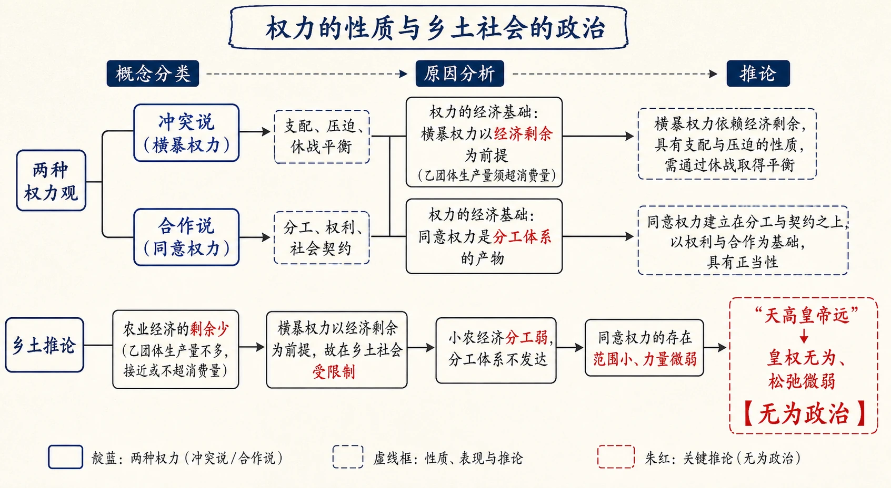
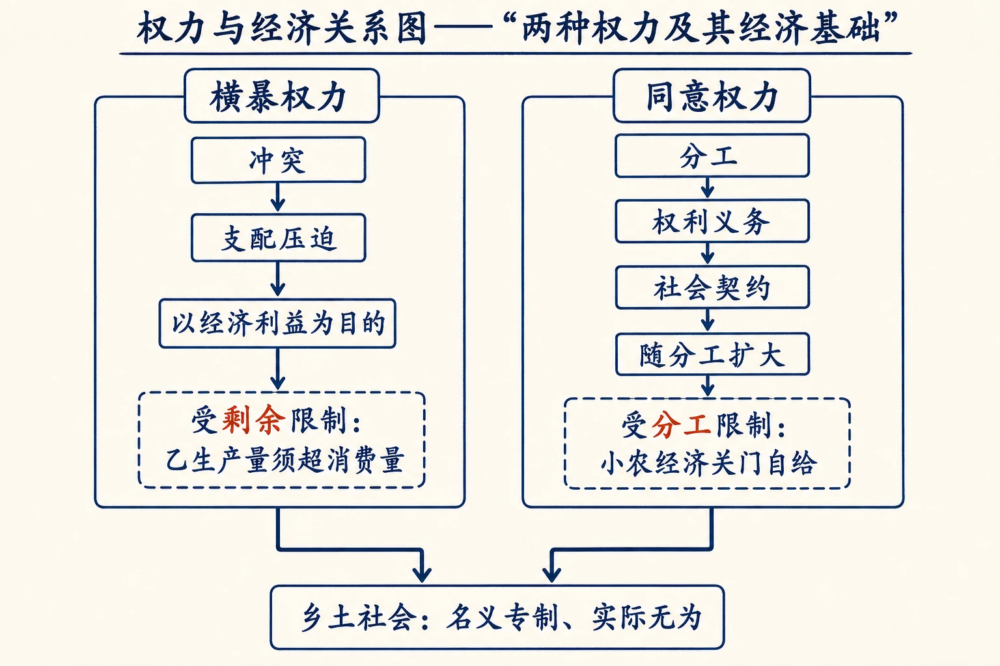
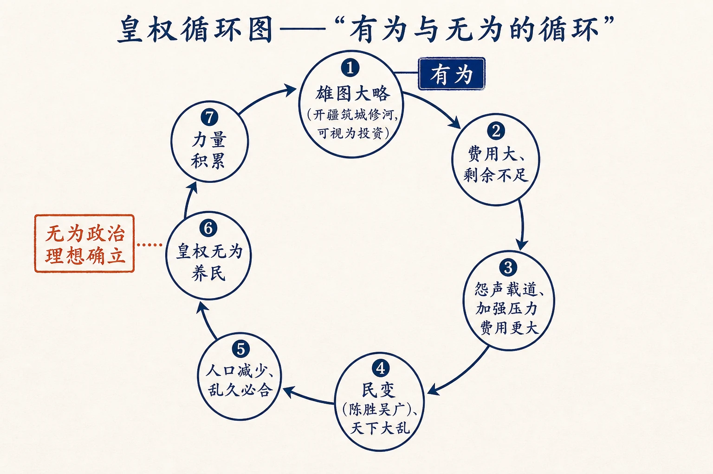
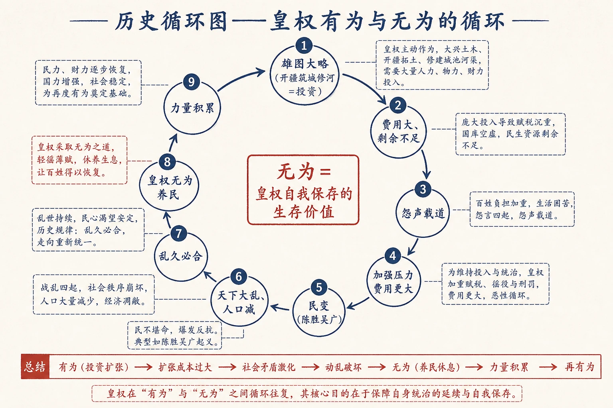

# 14 无为政治

<!-- 图片描述：本节整体知识信息结构图，采用“概念分类—原因分析—推论”论证链。中心议题为“权力的性质与乡土社会的政治”。上分支“两种权力观”：冲突说→横暴权力（支配、压迫、休战平衡）；合作说→同意权力（分工、权利、社会契约）。中分支“权力的经济基础”：横暴权力以经济剩余为前提（乙团体生产量须超消费量）；同意权力是分工体系的产物。下分支“乡土推论”：农业剩余少→横暴权力受限制；小农经济分工弱→同意权力范围小→“天高皇帝远”，皇权无为、松弛微弱。朱红标出“无为政治”，靛蓝标出两种权力，米白纸面、黑灰线条、中文标注、留白充足，符合语文文本精读风格。 -->

## 知识关系导航

- 所属章节：[[章首 学习导图|《乡土中国》学习导图]]
- 前置知识点：[[13-无讼#三、课文原文与逐段/逐句解读|礼治秩序与法治秩序]]（乡土社会的秩序背景）
- 后续知识点：[[15-长老统治#三、课文原文与逐段/逐句解读|教化权力]]（第三种权力，补足横暴/同意二分）
- 相关知识点：[[17-名实的分离#三、课文原文与逐段/逐句解读|时势权力]]（第四种权力，与本章两种权力对照）
- 相关方法：[[12-礼治秩序#三、课文原文与逐段/逐句解读|条件推论]]（以经济条件推出权力限制）

本章是《乡土中国》第十章，讨论权力的性质，并由此解释乡土社会（乃至传统中国皇权）为什么“无为”。作者先区分横暴权力与同意权力两种概念，再分析权力的经济基础，最后用“农业剩余少→横暴受限制”“小农经济分工弱→同意范围小”解释乡土社会权力结构“名义专制、实际无为”的特点。理解本章，是理解《长老统治》（教化权力）与《名实的分离》（时势权力）的前提。

## 本节学习目标

- 理解横暴权力与同意权力的定义、来源与特征，掌握二者区分的标准。
- 理解“权力引诱人的主要是经济利益”这一判断及两种权力的经济基础。
- 理解农业社会中横暴权力的经济限制（剩余）与同意权力的经济限制（分工）。
- 理解“无为政治”理想的形成过程（皇权循环）及其含义。
- 理解乡土社会权力结构“名义专制/独裁、实际松弛微弱、无为”的特点。
- 能评价“无为政治”在传统中国的历史合理性及其代价。

## 核心知识点讲解

### 一、文本基本信息与学习任务

- **篇目**：《无为政治》，选自费孝通《乡土中国》。
- **作者**：费孝通（1910—2005），中国社会学家、人类学家。
- **文体**：学术随笔／社会学论述文。本章以概念分类（两种权力）与经济分析见长，兼及历史叙述。
- **学习任务**：理解两种权力的概念区分与经济根源；理解乡土社会/传统皇权的“无为”逻辑；训练概念分类、因果推论与史料分析的答题能力。

### 二、整体内容与结构线索

本文论证线索如下：

1. **提出二分**：论权力者分两派——社会冲突说与社会合作说。
2. **界定横暴权力**：权力=冲突过程的持续、休战状态的临时平衡；支配、压迫、上下之别；政府国家是统治者的工具；阶级斗争消失则国家凋落。
3. **界定同意权力**：社会分工使人不能“不求人”而生活；发生权利与义务；共同授予的权力以社会契约为基础；分工愈复杂权力愈大。
4. **合观**：两种权力并存于人类社会，统治者同时代表两者，只是配合成分不同。
5. **辨析权力动机**：权力的引诱力主要在经济利益；同意权力须以荣誉高薪延揽，横暴权力与经济利益关系更密切。
6. **经济限制（横暴）**：统治乙团体须乙的生产量超过消费量（有剩余）；农业社会中横暴权力受限制（瑶山例子）。
7. **经济限制（同意）**：同意权力是分工产物，乡土小农经济分工弱，同意权力范围小。
8. **历史推论**：农业帝国虚弱、皇权受剩余限制；“有为”皇权因费用大而激起民变，形成“乱久必合→无为→养民→再有为”的皇权循环。
9. **结论**：乡土社会权力结构“名义专制独裁、实际松弛微弱、无为”，公事交给同意权力活动。

### 三、课文原文与逐段/逐句解读

**【原文】**
> 论权力的人多少可以分成两派，两种看法：一派是偏重在社会冲突的一方面，另一派是偏重在社会合作的一方面；两者各有偏重，所看到的不免也各有不同的地方。

**【解读】**
- **开宗明义**：两种权力观——冲突说与合作说。本章在两种看法基础上建立概念框架。

**【原文】**
> 从社会冲突一方面着眼的，权力表现在社会不同团体或阶层间主从的形态里。在上的是握有权力的，他们利用权力去支配在下的，发号施令，以他们的意志去驱使被支配者的行动。权力，依这种观点说，是冲突过程的持续，是一种休战状态中的临时平衡。冲突的性质并没有消弭，但是武力的阶段过去了，被支配的一方面已认了输，屈服了。但是他们并没有甘心接受胜利者所规定下的条件，非心服也。于是两方面的关系中发生了权力。权力是维持这关系所必需的手段，它是压迫性质的，是上下之别。从这种观点看去，政府，甚至国家组织，凡是握有这种权力的，都是统治者的工具。跟下去还可以说，政府、甚至国家组织，只存在于阶级斗争的过程中。如果有一天“阶级斗争”的问题解决了，社会上不分阶级了，政府、甚至国家组织，都会像秋风里的梧桐叶一般自己凋谢落地。——这种权力我们不妨称之为横暴权力。

**【解读】**
- **关键定义（名句）**：横暴权力=权力表现在主从形态里，是冲突过程的持续、休战状态的临时平衡；压迫性质、上下之别；被支配者“非心服”。
- **引申**：政府/国家是统治者工具；阶级斗争解决则国家如落叶凋谢。

**【原文】**
> 从社会合作一方面着眼的，却看到权力的另一性质。社会分工的结果使得每个人都不能“不求人”而生活。分工对于每个人都是有利的，因为这是经济的基础，人可以花费较少劳力得到较多收获；劳力是成本，是痛苦的；人靠了分工，减轻了生活担子，增加了享受。享受固然是人所乐从的，但贪了这种便宜，每个人都不能自足了，不能独善其身，不能不管“闲事”，因为如果别人不好好地安于其位地做他所分的工作，就会影响自己的生活。这时，为了自己，不能不干涉人家了。同样，自己如果不尽其分，也会影响人家，受着人家的干涉。这样就发生了权利和义务，从干涉别人一方面说是权利，从自己接受人家的干涉一方面说是义务。各人都有维持各人的工作、维护各人可以互相监督的责任。没有人可以“任意”依自己高兴去做自己想做的事，而得遵守着大家同意分配的工作。可是这有什么保障呢？如果有人不遵守怎么办呢？这就发生了共同授予的权力。这种权力的基础是社会契约，是同意。社会分工愈复杂，这权力也愈扩大。如果不愿意受这种权力的限制，只有回到“不求人”的境界里去做鲁宾逊，那时才真的顶天立地。不然，也得“小国寡民”以减少权力。再说得清楚些，得抛弃经济利益，不讲享受，像人猿泰山一般回到原始生活水准上去。不然的话，这种权力也总解脱不了。——这种权力我们不妨称之为同意权力。

**【解读】**
- **关键定义（名句）**：同意权力=社会分工使人互相依赖，发生权利与义务，共同授予的权力；基础是社会契约、同意；分工愈复杂权力愈扩大。
- **极限情形**：不愿受其限制只有回到“不求人”的鲁宾逊境界或小国寡民。

**【原文】**
> 这两种看法都是有根据的，并不冲突的，因为在人类社会里这两种权力都存在，而且在事实层里，统治者、所谓政府，总同时代表着这两种权力，不过是配合的成分上有不同。原因是社会分化不容易，至少以已往的历史说，只有合作而没有冲突。这两种过程常是互相交割，错综混合，冲突里有合作，合作里有冲突，不很单纯的。所以上面这两种性质的权力是概念上的区别，不常是事实上的区分。我们如果要明白一个社区的权力结构就不能不从这两种权力怎样配合上去分析。有的社区偏重在这方面，有的社区偏重在那方面。而且更可以在一社区中，某些人间发生那一种权力关系，某些人间发生另一种权力关系。譬如说美国，表面上是偏重同意权力的，但是种族之间，事实上，却依旧是横暴权力在发生作用。

**【解读】**
- **合观判断**：两种权力并存；政府同时代表两者，只是配合成分不同；概念上可分、事实上并存。
- **例证**：美国表面偏重同意权力，种族之间仍是横暴权力——概念区分不等于事实纯粹。

**【原文】**
> 有人觉得权力本身是具有引诱力的，人有“权力的饥饿”。这种看法忽略了权力的工具性。人也许因为某种心理变态可能发生单纯的支配欲或所谓Sadism（残酷的嗜好），但这究竟不是正常。人们喜欢的是从权力得到的利益。如果握在手上的权力并不能得到利益，或是利益可以不必握有权力也能得到的话，权力引诱也就不会太强烈。譬如英国有一次民意测验，愿意自己孩子将来做议员或做阁员的人的比例很低。在英国做议员或做阁员的人薪水虽低，还是有着社会荣誉的报酬，大多数的人对此尚且并无急于攀登之意，如果连荣誉都不给的话，使用权力的人真成为公仆时，恐怕世界上许由、务光之类的人物也将不足为奇了。

**【解读】**
- **辨析**：权力本身有“工具性”——人们喜欢的是权力带来的利益，不是权力本身（“权力饥饿”非正常）。
- **例证**：英国民意测验——愿孩子做议员/阁员比例低，说明无利（或仅荣誉）则权力无引诱力。

**【原文】**
> 权力之所以引诱人，最主要的应当是经济利益。在同意权力下，握有权力者并不是为了要保障自身特殊的利益，所以社会上必须用荣誉和高薪来延揽。至于横暴权力和经济利益的关系就更为密切了。统治者要用暴力来维持他们的地位不能是没有目的的，而所具的目的也很难想象不是经济的。我们很可以反过来说，如果没有经济利益可得，横暴权力也就没有多大的意义，因之也就不易发生。

**【解读】**
- **核心判断（名句）**：权力引诱人，最主要的是经济利益。
- **推论**：同意权力须用荣誉高薪延揽（权力者非为自身特殊利益）；横暴权力与经济利益关系更密切——无经济利益则横暴权力不易发生。

**【原文】**
> 甲团体想用权力来统治乙团体以谋得经济利益，必须有一前提：就是乙团体的存在可以供给这项利益；说得更明白一些，乙团体的生产量必须能超过他的消费量，然后有一些剩余去引诱甲团体来征服他。这是极重要的。一个只有生产他生存必需的消费品的人是并没有资格做奴隶的。我说这话意思是想指出农业社会中横暴权力的限制。在广西瑶山里调查时，我常见到汉人侵占瑶人的土地，而并不征服瑶人来作奴隶。原因当然很多，但主要的一个，依我看来，是土地太贫乏，而种水田的瑶人，并不肯降低生活程度，做汉人的佃户。如果瑶人打不过汉人，他们就放弃土地搬到别处去。在农业民族的争斗中，最主要的方式是把土著赶走而占据他们的土地自己来耕种。

**【解读】**
- **关键条件（名句）**：统治乙团体须乙的生产量超过消费量，有剩余可夺；无剩余则无征服价值（“只有生产生存必需消费品的人没有资格做奴隶”）。
- **田野例证**：广西瑶山——汉人占瑶人土地而不征服为奴，因土地贫乏、瑶人不肯降生活程度；农业争斗主要是“赶走土著占土地”。
- **历史印证**：“坑卒几万人”记录、流寇——农业性侵略权力与工业性侵略权力不同。

**【原文】**
> 我并不是说在农业性的乡土社会基础上并不能建立横暴权力。相反，我们常常见到这种社会恰是皇权的发祥地，那是因为乡土社会并不是一个富于抵抗能力的组织。农业民族受游牧民族的侵略是历史上不断的记录。这是不错的，东方的农业平原正是帝国的领域，但是农业的帝国是虚弱的，因为皇权并不能滋长壮健，能支配强大的横暴权力的基础不足，农业的剩余跟着人口增加而日减，和平又给人口增加的机会。

**【解读】**
- **辩证**：农业乡土社会也能建横暴权力（是皇权发祥地），但“农业的帝国是虚弱的”——横暴权力的基础（剩余）不足。
- **关键判断**：农业剩余随人口增加而日减，和平又增人口，故皇权难以滋长壮健。

**【原文】**
> 中国的历史很可助证这个看法：一个雄图大略的皇权，为了开疆辟土，筑城修河，这些原不能说是什么虐政，正可视作一笔投资，和罗斯福造田纳西工程性质可以有相类之处。但是缺乏储蓄的农业经济却受不住这种工程的费用，没有足够的剩余，于是怨声载道，与汝偕亡地和皇权为难了。这种有为的皇权不能不同时加强它对内的压力，费用更大，陈胜吴广之流，揭竿而起，天下大乱了。人民死亡遍地，人口减少了，于是乱久必合，又形成一个没有比休息更能引诱人的局面，皇权力求无为，所谓养民。养到一个时候，皇权逐渐累积了一些力量，这力量又刺激皇帝的雄图大略，这种循环也因而复始。

**【解读】**
- **历史循环链**：雄图大略（开疆筑城修河）→费用大→农业剩余不足→怨声载道→加强压力费用更大→民变（陈胜吴广）→大乱→人口减→乱久必合→皇权无为（养民）→力量积累→再刺激雄图大略→循环。
- **关键概念**：“有为→民怨→大乱→无为养民→再有为”的皇权循环；无为是“为了皇权自身的维持”在历史经验中发现的生存价值。

**【原文】**
> 为了皇权自身的维持，在历史的经验中，找到了“无为”的生存价值，确立了无为政治的理想。
> 横暴权力有着这个经济的拘束，于是在天高皇帝远的距离下，把乡土社会中人民切身的公事让给了同意权力去活动了。可是同意权力却有着一套经济条件的限制。依我在上面所说的，同意权力是分工体系的产物。分工体系发达，这种权力才能跟着扩大。乡土社会是个小农经济，在经济上每个农家，除了盐铁之外，必要时很可关门自给。于是我们很可以想象同意权力的范围也可以小到“关门”的程度。在这里我们可以看到的是乡土社会里的权力结构，虽则名义上可以说是“专制”“独裁”，但是除了自己不想持续的末代皇帝之外，在人民实际生活上看，是松弛和微弱的，是挂名的，是无为的。

**【解读】**
- **核心结论（名句）**：无为政治理想=皇权自身维持的生存策略（横暴权力受经济拘束）。
- **乡土权力结构**：横暴权力“天高皇帝远”受限，公事让给同意权力；同意权力受分工限制（小农经济、关门自给），范围可小到“关门”。
- **总结判断**：乡土社会权力结构名义上“专制/独裁”，实际“松弛、微弱、挂名、无为”。

### 四、关键语句、人物/意象与细节精读

- **“权力，依这种观点说，是冲突过程的持续，是一种休战状态中的临时平衡。”**：横暴权力的定义。
- **“这种权力的基础是社会契约，是同意。社会分工愈复杂，这权力也愈扩大。”**：同意权力的定义。
- **“权力之所以引诱人，最主要的应当是经济利益。”**：权力的动机分析。
- **“乙团体的生产量必须能超过他的消费量，然后有一些剩余去引诱甲团体来征服他。”**：横暴权力的经济前提。
- **“一个只有生产他生存必需的消费品的人是并没有资格做奴隶的。”**：无剩余则无征服价值——判断精辟。
- **“在人民实际生活上看，是松弛和微弱的，是挂名的，是无为的。”**：乡土权力结构的总评。
- **人物·鲁宾逊**：“不求人”的极限境界（同意权力无法达到之处）。
- **人物·许由、务光**：传说中不受天下的贤士——无利益则权力无引诱力的例证。
- **人物·陈胜吴广**：民变代表，皇权循环的关键环节。
- **人物·罗斯福**：田纳西工程——与开疆筑城同为“投资”性质的对比例证。
- **意象·“天高皇帝远”**：横暴权力鞭长莫及，乡土公事交给同意权力。

### 五、语言风格与表达手法

- **概念分类**：横暴权力/同意权力，先定义再展开，界限清楚。
- **因果推论**：由“剩余→征服”“分工→权力”，经济基础决定权力形态。
- **史料印证**：瑶山田野、坑卒记录、陈胜吴广、皇权循环，历史与田野互证。
- **辩证合观**：两种权力并存、各有偏胜，不做绝对化。
- **比喻形象**：“天高皇帝远”“落叶凋谢”“关门自给”“秋风里的梧桐叶”。

### 六、主题思想、情感态度与文化理解

- **主题**：权力可从冲突（横暴）与合作（同意）两方面理解，其引诱力主要在经济利益；农业社会的剩余不足限制了横暴权力，小农经济的分工薄弱限制了同意权力，由此形成乡土社会“名义专制、实际无为”的权力结构，皇权也以“无为”为生存策略。
- **情感态度**：作者以冷静的经济分析解释政治现象，对“无为政治”既揭示其历史合理性（皇权自我保存），也指出其代价（农业帝国虚弱）；对“专制/独裁”的简单标签保持警惕，强调要从实际生活看权力。
- **文化理解**：理解“无为而治”“皇权不下县”等现象的经济结构根源；理解权力概念的理论区分（冲突/合作）在分析社会时的工具价值；理解传统中国“大政府小社会”的另一种可能——“小政府大社会”（实际无为）。

### 七、阅读答题与写作迁移

- **答题模板（概念区分）**：分别定义+区分标准（来源/特征/经济基础）+举例。
- **答题模板（因果推论）**：前提（剩余/分工）→中间环节→结论。
- **答题模板（史料分析）**：史料内容+印证的观点+与理论的关系。
- **写作迁移**：学习用经济基础解释政治现象的分析框架；学习“概念二分→合观→推论”的论证结构。

<!-- 图片描述：权力与经济关系图——“两种权力及其经济基础”。左：横暴权力（冲突→支配压迫→以经济利益为目的→受剩余限制：乙生产量须超消费量）；右：同意权力（分工→权利义务→社会契约→随分工扩大→受分工限制：小农经济关门自给）。下方箭头汇合“乡土社会：名义专制、实际无为”。朱红标出“剩余/分工”两个经济条件。米白纸面、黑灰线条、中文标注。 -->

## 重点梳理

- **两种权力**：
  - 横暴权力：冲突说；主从、支配、压迫；休战平衡；与经济利益密切；受剩余限制。
  - 同意权力：合作说；分工、权利义务、共同授予；基础是社会契约/同意；随分工扩大。
- **权力动机**：权力引诱人主要在经济利益；无利益则权力无引诱力（许由、务光）。
- **经济前提**：横暴统治须乙有剩余（生产量超消费量）；无剩余则无征服价值。
- **皇权循环**：有为（投资）→费用大→民怨→加强压力→民变→大乱→人口减→乱久必合→无为养民→力量积累→再有为。
- **乡土社会的权力结构**：名义“专制/独裁”，实际“松弛、微弱、挂名、无为”；横暴受“天高皇帝远”限制，同意受“关门自给”限制。
- **必记名句**：“权力是冲突过程的持续，是一种休战状态中的临时平衡”“这种权力的基础是社会契约，是同意”“权力之所以引诱人，最主要的应当是经济利益”“在人民实际生活上看，是松弛和微弱的，是挂名的，是无为的”。
- **论证方法**：概念分类、因果推论、史料印证、辩证合观。

## 难点突破

<!-- 图片描述：皇权循环图——“有为与无为的循环”。圆形循环链顺时针标注：①雄图大略（开疆筑城修河，可视为投资）→②费用大、剩余不足→③怨声载道、加强压力费用更大→④民变（陈胜吴广）、天下大乱→⑤人口减少、乱久必合→⑥皇权无为养民→⑦力量积累→回到①。在⑥处用朱红标注“无为政治理想确立”，①处靛蓝标注“有为”。米白纸面、黑灰线条、中文标注。 -->

- **难点一：横暴权力与同意权力的区分标准是什么？**
  突破：看权力的**来源**——横暴来自社会冲突（一方支配另一方，非心服），同意来自社会合作（分工产生权利义务，共同授予、以契约为基础）。两者概念可分，事实上并存，只是配合成分不同。
- **难点二：为什么说“没有剩余就没有资格做奴隶”？**
  突破：横暴统治的目的是经济利益；若被统治者生产量不超过消费量、无剩余可夺，征服者无利可图，就不值得统治。故剩余是横暴权力的经济前提，也是农业社会横暴权力受限的原因。
- **难点三：为什么农业帝国“虚弱”？**
  突破：农业剩余随人口增加而日减，和平又增人口；皇权想“有为”（开疆筑城修河）需大量费用，超出剩余承受力，激起民变；故农业帝国难以积累强大横暴权力的基础，呈现“虚弱”与循环。
- **难点四：乡土社会权力结构为何“名义专制、实际无为”？**
  突破：两层限制——横暴权力受“剩余少+天高皇帝远”限制，管不到乡土内部公事；同意权力受“小农经济分工弱”限制，范围可小到“关门”。故除末代皇帝外，皇权在实际生活中“松弛微弱、挂名无为”，公事交同意权力自理。

<!-- 图片描述：历史循环图——“皇权有为与无为的循环”。圆形循环链：雄图大略（开疆筑城修河=投资）→费用大、剩余不足→怨声载道→加强压力费用更大→民变（陈胜吴广）→天下大乱、人口减→乱久必合→皇权无为养民→力量积累→再有为。朱红标出“无为=皇权自我保存的生存价值”，靛蓝标出循环节点。米白纸面、黑灰线条、中文标注。 -->

## 例题讲解

**例题1（概念区分）** 结合文本，区分横暴权力与同意权力。
- **分析**：回扣两种权力观的定义段。
- **答案**：横暴权力源于社会冲突，表现为主从、支配、压迫，是休战状态的临时平衡，被支配者非心服，与经济利益关系密切，受剩余制约；同意权力源于社会合作，由分工产生权利义务、共同授予，以社会契约为基础，随分工扩大，须以荣誉高薪延揽。二者概念上可分、事实上并存。
- **反思**：概念题要“来源+特征+经济基础”分点作答。

**例题2（因果推论）** 为什么说农业社会的横暴权力受到限制？
- **分析**：从“剩余”前提与瑶山例证作答。
- **答案**：横暴统治以经济剩余为前提（乙生产量须超消费量）；农业社会剩余少且随人口增加而日减，被征服者“没有资格做奴隶”（瑶山例子：汉人占瑶地而不征服为奴）。故横暴权力在农业乡土社会中受经济约束而难以滋长，农业帝国“虚弱”。
- **反思**：因果题要“前提→例证→结论”完整。

**例题3（史料分析）** 作者用“陈胜吴广”与皇权循环说明什么？
- **分析**：定位“雄图大略→费用大→民变→无为养民”段。
- **答案**：说明“有为”皇权因费用超过农业剩余而激起民变，大乱后人口减少、乱久必合，皇权转为“无为养民”，力量积累后又刺激新的“雄图大略”，形成循环；从而证明“无为政治”是皇权在历史经验中找到的自我保存策略，也解释了中国历史上改朝换代的周期性。
- **反思**：史料题要“内容+证明观点+意义”。

**例题4（观点评价）** 作者认为乡土社会权力结构“名义专制、实际无为”，你如何评价这一判断？
- **分析**：还原两层经济限制论证，再评价。
- **参考要点**：判断符合传统中国实际——皇权不下县、赋税松弛、乡土自治（同意权力），历史上确有“无为”现象；其解释从经济基础出发（剩余/分工），避免了“专制”标签的笼统化。局限：需注意“名义专制”的代价（对农民仍可横暴、末代与乱世不同），且近代以来国家能力增强，“无为”不再适用。总体是辩证而有解释力的判断。
- **反思**：评价题要“还原→分析→辩证（含局限）”。

## 易错点整理

- **概念错配**：把“横暴权力”说成“君主权力”、“同意权力”说成“民主”。避免：横暴/同意是按“来源”（冲突/合作）区分的概念，不能简单对号入座。
- **动机误读**：说“人有权力饥饿”。避免：作者明确否定“权力饥饿”，认为权力引诱力在经济利益。
- **剩余理解错**：把“剩余”说成“人口剩余”。避免：这里指生产量超过消费量的经济剩余，是征服的价值前提。
- **循环跳步**：直接从“有为”跳到“无为”。避免：补全“费用大→民怨→民变→人口减→乱久必合”的中间环节。
- **评价片面**：说“无为政治=民主/好政治”或“=专制/坏政治”。避免：作者说“名义专制、实际无为”，是中性描述，既有历史合理性也有代价。

## 考点考证点整理

### 考点一：概念理解与区分
- **出题思路**：解释横暴权力/同意权力，或比较二者。
- **关键条件**：回到两种权力观的定义段。
- **解答要点**：分别定义+区分标准（来源/特征/经济基础）+例证。
- **易扣分点**：只答“一个用暴力一个用契约”；漏“剩余/分工”经济维度。

### 考点二：因果推论与经济分析
- **出题思路**：为什么农业社会横暴权力受限？为什么同意权力范围小？
- **关键条件**：抓住“剩余”与“分工”两个前提。
- **解答要点**：前提→中间环节→结论，用瑶山例证佐证。
- **易扣分点**：只答“农业穷”不点明“剩余不足”机制。

### 考点三：史料与例证分析
- **出题思路**：分析陈胜吴广、瑶山调查、英国民意测验等例证的作用。
- **关键条件**：明确各例为哪个论点服务。
- **解答要点**：内容+印证观点+意义。
- **易扣分点**：只复述史实不分析；例证与观点张冠李戴。

### 考点四：文本主旨与结构把握
- **出题思路**：概括本文中心论点或论证思路。
- **关键条件**：抓“两种权力+经济限制+无为政治”。
- **解答要点**：中心论点+层次（二分→动机→经济限制→历史循环→乡土结论）。
- **易扣分点**：把“无为政治”当成唯一内容而漏两种权力框架。

### 考点五：观点评价与现实意义
- **出题思路**：评析“名义专制、实际无为”，或谈“无为”思想对当代的启示。
- **关键条件**：兼顾历史合理性与其条件。
- **解答要点**：还原观点→分析依据→辩证（合理性+代价）→联系现实。
- **易扣分点**：简单说“无为就是懒政”或“专制”；不联系经济结构。

## 练习题

> 说明：本章源文（费孝通《乡土中国·无为政治》）未附课后练习题，以下题目根据本章核心考点自拟，用于巩固整本书阅读与论述类文本阅读能力。

**一、基础理解（自拟）**
1. 根据原文，写出“横暴权力”与“同意权力”的定义。
2. 作者认为“权力之所以引诱人，最主要的”是什么？

**二、文本分析（自拟）**
3. 为什么说“乙团体的生产量必须能超过他的消费量”是横暴统治的前提？结合瑶山例子说明。
4. 简述“皇权循环”的过程，并说明“无为政治”理想如何确立。

**三、鉴赏评价（自拟）**
5. 分析本文“概念二分—合观—推论”的论证结构。
6. 作者说乡土社会权力结构“名义上可以‘专制’‘独裁’，实际是松弛微弱的、无为的”，你如何看待？

**四、迁移写作（自拟）**
7. 联系《无为政治》的经济分析，谈谈你对“政府该不该多管”这一问题的理解（不少于 200 字）。

## 练习题答案

**1.** 横暴权力：从社会冲突着眼，权力表现为主从形态，在上者支配在下者，是冲突过程的持续、休战状态的临时平衡，压迫性质，被支配者非心服。同意权力：从社会合作着眼，社会分工使人互相依赖，发生权利与义务，共同授予的权力以社会契约、同意为基础，随分工而扩大。
> 要点：来源（冲突/合作）与特征都要答。

**2.** 权力之所以引诱人，最主要的应当是经济利益；人们喜欢的是从权力得到的利益，而非权力本身（否定“权力饥饿”）。
> 评分：答出“经济利益”，并说明“工具性”。

**3.** 横暴统治的目的是经济利益，须被统治者有剩余可夺；若乙的生产量不超过消费量，无剩余，征服无利可图。瑶山例子：汉人占瑶人土地而不征服为奴，因土地贫乏、瑶人不肯降低生活程度，无剩余可图，故“只有生产生存必需消费品的人没有资格做奴隶”。
> 评分：机制+例子都要答。

**4.** 循环：雄图大略（开疆筑城修河，可视为投资）→费用大、农业剩余不足→怨声载道→加强压力费用更大→民变（陈胜吴广）→天下大乱、人口减→乱久必合→皇权无为养民→力量积累→再刺激雄图大略。无为政治理想：皇权在历史经验中找到“无为”的生存价值——为避免过度消耗剩余而激起民变，主动养民休息，遂确立无为政治理想。
> 评分：循环链完整+“自我保存”的动机。

**5.** 先二分：提出冲突说/合作说两种权力观，分别界定横暴权力与同意权力；再合观：两种权力并存、政府同时代表两者、概念可分事实并存（美国种族例子）；后推论：从经济基础（剩余/分工）推出农业社会两种权力都受限制，再以皇权循环史料印证，得出“名义专制、实际无为”的结论。结构层层推进、辩证严密。
> 评分：按“二分—合观—推论”三步说明。

**6.** （评析要点）合理性：两层经济限制（剩余少限横暴、分工弱限同意）+“天高皇帝远”使皇权管不到乡土公事，故实际生活松弛无为，符合传统中国“皇权不下县”的现实；也避免了“专制”标签的笼统化。局限：要看到“名义专制”的另一面——乱世与末代皇权仍可横暴，且近代国家能力增强后“无为”不再适用。总体是辩证而有解释力的判断。
> 评分：合理性+局限都要答。

**7.** （写作评分要点）能运用“剩余/分工—权力”框架即可：政府干预（有为）需以资源与组织能力为基础，过度有为会超出承受力引起反弹（历史教训）；乡土社会因剩余少、分工弱而“无为”有其合理性；但现代社会分工复杂、公共事务繁多，需有为的法治政府提供公共服务，同时防止权力滥用。要求结合实例（如财政、公共服务、简政放权），逻辑清晰，不少于 200 字。
