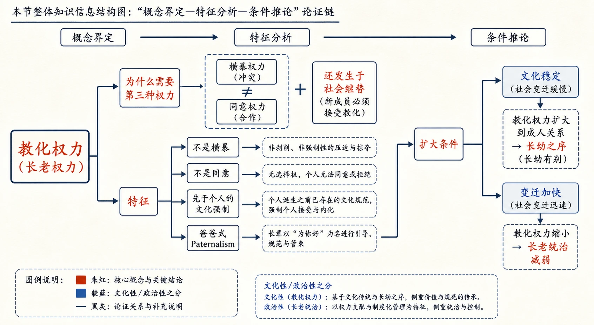
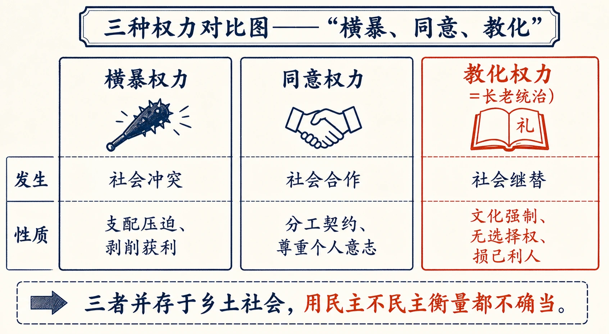
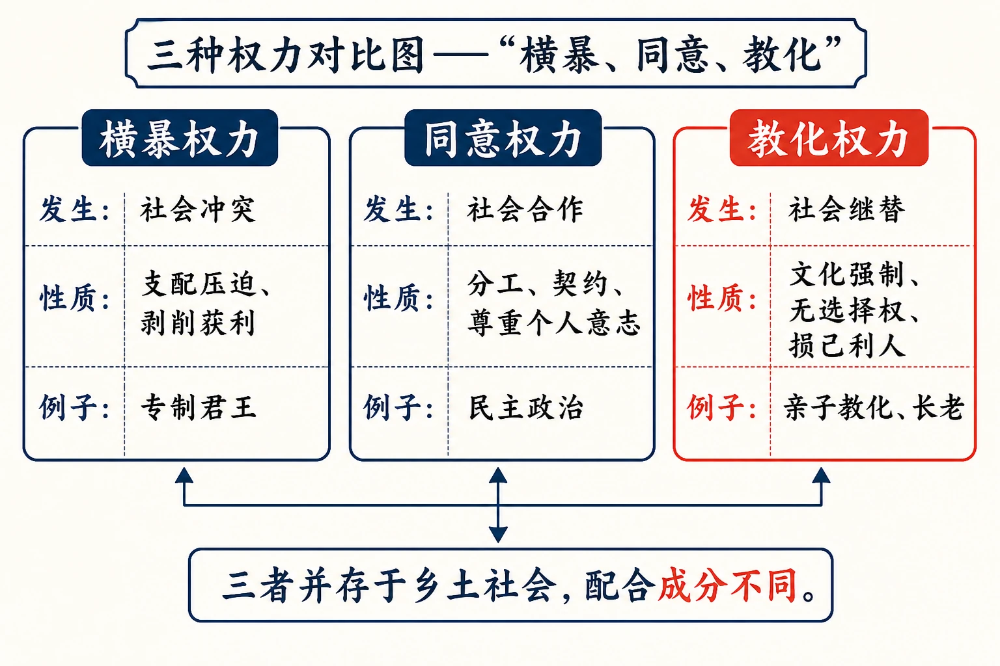
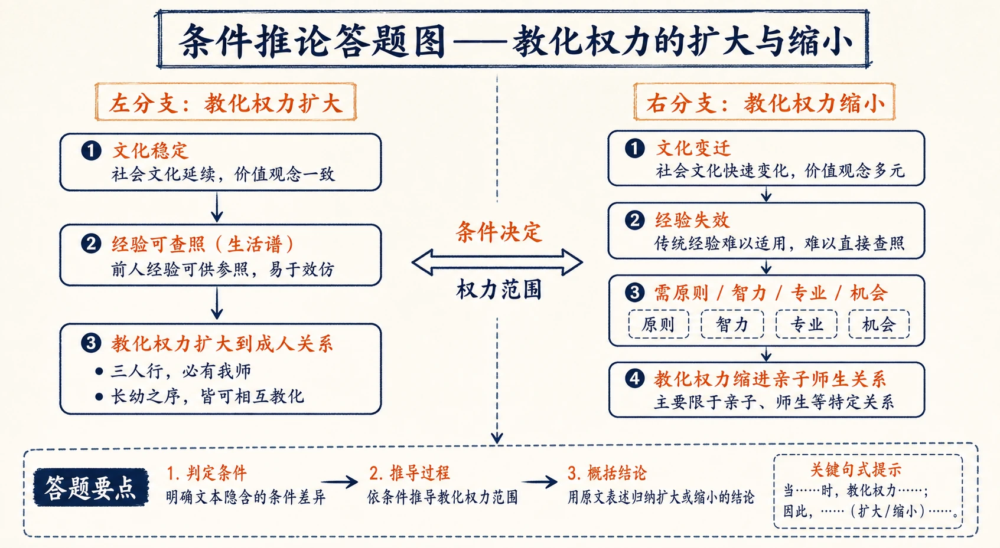

# 15 长老统治

<!-- 图片描述：本节整体知识信息结构图，采用“概念界定—特征分析—条件推论”论证链。中心概念为“教化权力（长老权力）”。上分支“为什么需要第三种权力”：横暴权力（冲突）与同意权力（合作）之外，还发生于社会继替（新成员必须接受教化）；下分支“特征”：不是横暴（非剥削）、不是同意（无选择权）、先于个人的文化强制、爸爸式Paternalism；再推论“扩大条件”：文化稳定→教化权力扩大到成人关系→长幼之序；变迁加快→教化权力缩小→长老统治减弱。朱红标出“教化权力”，靛蓝标出“文化性/政治性”之分，米白纸面、黑灰线条、中文标注、留白充足，符合语文文本精读风格。 -->

## 知识关系导航

- 所属章节：[[章首 学习导图|《乡土中国》学习导图]]
- 前置知识点：[[14-无为政治#三、课文原文与逐段/逐句解读|横暴权力与同意权力]]（本章补足第三种权力）
- 后续知识点：[[17-名实的分离#三、课文原文与逐段/逐句解读|时势权力与社会变迁]]（长老权力在变迁中的变形）
- 相关知识点：[[12-礼治秩序#三、课文原文与逐段/逐句解读|礼治与教化]]（教化是礼治与长老统治的共同机制）
- 相关方法：[[11-男女有别#三、课文原文与逐段/逐句解读|阿波罗式与浮士德式]]（稳定文化的感情定向）

本章是《乡土中国》第十一章，在横暴权力、同意权力之外提出第三种权力——教化权力（长老权力）。作者用“社会继替”（社会成员新陈代谢）解释其发生，指出教化权力既非横暴也非同意，而是“爸爸式”的教化性权力。理解本章，须抓住“文化稳定→教化权力大→长老统治；变迁加快→教化权力缩”的条件关系。

## 本节学习目标

- 理解“社会继替”的含义及教化权力的发生机制。
- 理解教化权力区别于横暴权力（非剥削）与同意权力（无选择权）的性质。
- 掌握“文化性”与“政治性”的区分，理解文化与政治的关系。
- 理解“长老统治”与“长幼之序”、亲属称谓的关系。
- 理解文化稳定/变迁对教化权力的影响，能评价“用民主和不民主衡量中国社会都不确当”的观点。

## 核心知识点讲解

### 一、文本基本信息与学习任务

- **篇目**：《长老统治》，选自费孝通《乡土中国》。
- **作者**：费孝通（1910—2005），中国社会学家、人类学家。
- **文体**：学术随笔／社会学论述文。本章以概念界定（第三种权力）与比喻（逆旅）见长。
- **学习任务**：理解教化权力的性质与发生条件；理解“文化性/政治性”之分；把握长老统治与乡土社会结构的关系；训练概念界定、比喻论证与条件推论的答题能力。

### 二、整体内容与结构线索

本文论证线索如下：

1. **提出问题**：了解乡土社会权力结构，只有横暴、同意两种权力还不够；基层政治是“谜”。
2. **提出第三种权力**：还发生于社会继替过程的教化性权力（爸爸式，Paternalism）。
3. **解释社会继替**：社会成员新陈代谢；逆旅比喻——新来者须接受教化才能在这“逆旅”生活。
4. **界定教化权力的性质**：人必须学习人为规律，学习需强制，强制发生权力；此权力非同意（被教化者无选择机会）、非横暴（非剥削，是“损己利人”的工作）。
5. **文化性与政治性**：被社会不成问题接受的规范=文化性；意见纷呈求临时办法=政治性；文化对新人强制，是教化过程。
6. **扩大条件**：文化稳定时教化权力可扩大到成人关系；“三人行必有我师”，年长握有教化权力；长幼之序点出教化权力的效力。
7. **变迁中的收缩**：文化不稳定、传统不足以应付新问题时，教化权力缩进亲子师生关系、限于短时间；长者失去优势，经验等于顽固落伍。
8. **结论**：乡土社会权力结构是横暴+同意+教化三者并存，用民主/不民主衡量都不确当，最好的名称是“长老统治”。

### 三、课文原文与逐段/逐句解读

**【原文】**
> 要了解乡土社会的权力结构，只从我在上篇所分析的横暴权力和同意权力两个概念去看还是不够的。我们固然可以从乡土社会的性质上去说明横暴权力所受到事实上的限制，但是这并不是说乡土社会权力结构是普通所谓“民主”形式的。民主形式根据同意权力，在乡土社会中，把横暴权力所加上的一层“政府”的统治揭开，在传统的无为政治中这层统治本是并不很强的，基层上所表现出来的也并不完全是许多权利上相等的公民共同参预的政治。这里正是讨论中国基层政治性质的一个谜。

**【解读】**
- **问题意识**：横暴+同意两分不够解释乡土基层政治；基层政治是“谜”。
- **关键判断**：揭开“政府”统治层后，基层并非“权利相等的公民共同参预的政治”（非民主形式）——为第三种权力张本。

**【原文】**
> 有人说中国虽没有政治民主，却有社会民主。也有人说中国政治结构可分为两层，不民主的一层压在民主的一层上边。这些看法都有一部分近似；说近似而不说确当是因为这里还有一种权力，既不是横暴性质，也不是同意性质；既不是发生于社会冲突，也不是发生于社会合作；它是发生于社会继替的过程，是教化性的权力，或是说爸爸式的，英文里是Paternalism。

**【解读】**
- **学术对话**：回应“政治民主/社会民主”“两层结构”等说法——都“一部分近似”但不确当。
- **核心概念（名句）**：第三种权力=发生于社会继替过程的教化性权力（爸爸式，Paternalism）。

**【原文】**
> 社会继替是我在《生育制度》一书中提出来的一个新名词，但并不是一个新的概念，这就是指社会成员新陈代谢的过程。生死无常，人寿有限；从个人说这个世界不过是个逆旅，寄寓于此的这一阵子，久暂相差不远。但是这个逆旅却是有着比任何客栈、饭店更复杂和更严格的规律。没有一个新来的人，是在进门之前就明白这一套的。……每个要在这逆旅里生活的人就得接受一番教化，使他能在这些众多规律下，从心所欲而不碰着铁壁。

**【解读】**
- **关键定义**：社会继替=社会成员新陈代谢的过程（不是新概念，是新名词）。
- **逆旅比喻**：世界=有复杂严格规律的“逆旅”；新来者（新生儿）须经教化才能在众多规律下“从心所欲而不碰着铁壁”。

**【原文】**
> 社会中的规律有些是社会冲突的结果，也有些是社会合作的结果。在个人行为的四周所张起的铁壁，有些是横暴的，有些是同意的。但是无论如何，这些规律是要人遵守的，规律的内容是要人明白的。人如果像蚂蚁或是蜜蜂，情形也就简单了。群体生活的规律有着生理的保障，不学而能。人的规律类皆人为。用筷子夹豆腐，穿了高跟鞋跳舞不践别人的脚，真是难为人的规律；不学，不习，固然不成，学习时还得不怕困，不惮烦。不怕困，不惮烦，又非天性；于是不能不加以一些强制。强制发生了权力。

**【解读】**
- **关键推论**：人的规律“类皆人为”，不学不习不成，学习要不怕困不惮烦（非天性）→需强制→强制发生权力。
- **比喻**：蚂蚁蜜蜂的规律有生理保障（不学而能）；人学用筷子、穿高跟鞋跳舞，都要“难为人的规律”。

**【原文】**
> 这样发生的权力并非同意，又非横暴。说孩子们必须穿鞋才准上街是一种社会契约未免过分。所谓社会契约必先假定个人的意志。个人对于这种契约虽则并没有自由解脱的权利，但是这种契约性的规律在形成的过程中，必须尊重各个人的自由意志，民主政治的形式就是综合个人意志和社会强制的结果。在教化过程中并不发生这个问题，被教化者并没有选择的机会。他所要学习的那一套，我们称作文化的，是先于他而存在的。我们不用“意志”加在未成年的孩子的人格中，就因为在教化过程里并不需要这种承认。

**【解读】**
- **与同意权力的区分**：社会契约假定个人意志；教化过程“被教化者并没有选择的机会”，文化先于他存在，不需要承认其意志——故非同意权力。
- **关键判断**：民主政治=综合个人意志和社会强制；教化中不发生意志问题。

**【原文】**
> 我曾说：“孩子碰着的不是一个为他方便而设下的世界，而是一个为成人们方便所布置下的园地。他闯入进来，并没有带着创立新秩序的力量，可是又没有个服从旧秩序的心愿”……从并不征求、也不考虑他们同意与否而设下他们必须适应的社会生活方式的一方面说，教化他们的人可以说是不民主的，但若说是横暴却又不然。横暴权力是发生于社会冲突，是利用来剥削被统治者以获得利益的工具。如果说教化过程是剥削性的，显然也是过分的。我曾称这是个“损己利人”的工作，一个人担负一个胚胎培养到成人的责任，除了精神上的安慰外，物质上有什么好处呢？

**【解读】**
- **与横暴权力的区分**：教化“不民主”但不是横暴——横暴是剥削以获利；教化是“损己利人”的工作（培养孩子无物质好处）。
- **关键判断**：为经济打算而生男育女“是打算得不大精到的亏本生意”——打破“养儿防老”的简单经济解释。

**【原文】**
> 从表面上看，“一个孩子在一小时中所受到的干涉，一定会超过成年人一年中所受社会指摘的次数。在最专制的君王手下做老百姓，也不会比一个孩子在最疼他的父母手下过日子为难过”。但是性质上严父和专制君王究竟是不同的。所不同的就在教化过程是代替社会去陶炼出合于在一定的文化方式中经营群体生活的分子。担负这工作的，一方面也可以说是为了社会，一方面可以说是为了被教化者，并不是统治关系。

**【解读】**
- **对比**：孩子受干涉比专制君王下的百姓还多，但性质不同——严父是教化，君王是统治。
- **关键判断**：教化=代替社会陶炼出合于文化方式的分子，为了社会也为了被教化者，“并不是统治关系”。

**【原文】**
> 教化性的权力虽则在亲子关系里表现得最明显，但并不限于亲子关系。凡是文化性的，不是政治性的强制都包含这种权力。文化和政治的区别就在这里：凡是被社会不成问题地加以接受的规范，是文化性的；当一个社会还没有共同接受一套规范，各种意见纷呈，求取临时解决办法的活动是政治。文化的基础必须是同意的，但文化对于社会的新分子是强制的，是一种教化过程。

**【解读】**
- **关键区分（名句）**：文化性=被社会不成问题接受的规范；政治性=意见纷呈、求临时解决办法。
- **关键判断**：文化的基础必须是同意的，但文化对社会新分子是强制的，是教化过程。

**【原文】**
> 在变化很少的社会里，文化是稳定的，很少新的问题，生活是一套传统的办法。如果我们能想象一个完全由传统所规定下的社会生活，这社会可以说是没有政治的，有的只是教化。事实上固然并没有这种社会，但是乡土社会却是靠近这种标准的社会。“为政不在多言”、“无为而治”都是描写政治活动的单纯。也是这种社会，人的行为有着传统的礼管束着，儒家很有意思想形成一个建筑在教化权力上的王者；他们从没有热心于横暴权力所维持的秩序。“苛政猛于虎”的政是横暴性的，“为政以德”的政是教化性的。“为民父母”是爸爸式权力的意思。

**【解读】**
- **文化稳定→教化主导**：乡土社会靠近“没有政治、只有教化”的标准；儒家想建立教化权力上的王者（“为政以德”）。
- **辨析**：“苛政猛于虎”的政=横暴性；“为政以德”的政=教化性；“为民父母”=爸爸式权力。

**【原文】**
> 教化权力的扩大到成人之间的关系必须得假定个稳定的文化。稳定的文化传统是有效的保证。我们如果就个别问题求个别应付时，不免“活到老，学到老”，因为每一段生活所遇着的问题都是不同的。文化像是一张生活谱，我们可以按着问题去查照。所以在这种社会里没有我们现在所谓成年的界限。凡是比自己年长的，他必定先发生过我现在才发生的问题，他也就可以是我的“师”了。三人行，必有可以教给我怎样去应付问题的人。而每一个年长的人都握有强制年幼的人的教化权力：“出则悌”，逢着年长的人都得恭敬、顺服于这种权力。

**【解读】**
- **条件推论**：教化权力扩大到成人关系，须假定稳定文化。
- **比喻**：文化=“生活谱”，可按问题查照；年长者先遇到问题，可作“师”。
- **关键判断**：“三人行必有我师”；年长握有强制年幼者的教化权力（“出则悌”）。

**【原文】**
> 在我们客套中互问年龄并不是偶然的，这礼貌正反映出我们这个社会里相互对待的态度是根据长幼之序。长幼之序也点出了教化权力所发生的效力。在我们亲属称谓中，长幼是一个极重要的原则，我们分出兄和弟、姊和妹、伯和叔，在许多别的民族并不这样分法。我记得老师史禄国先生曾提示过我：这种长幼分划是中国亲属制度中最基本的原则，有时可以掩盖世代原则。亲属原则是在社会生活中形成的，长幼原则的重要也表示了教化权力的重要。

**【解读】**
- **例证**：互问年龄的客套、亲属称谓分长幼（兄弟姊妹伯叔）——长幼之序反映教化权力的效力。
- **引证**：史禄国指出长幼分划是中国亲属制度最基本的原则，“有时可以掩盖世代原则”。

**【原文】**
> 文化不稳定，传统的办法并不足以应付当前的问题时，教化权力必然跟着缩小，缩进亲子关系，师生关系，而且更限于很短的一个时间。在社会变迁的过程中，人并不能靠经验作指导。能依赖的是超出于个别情境的原则，而能形成原则、应用原则的却不一定是长者。这种能力和年龄的关系不大，重要的是智力和专业，还可加一点机会。讲机会，年幼的比年长的反而多。他们不怕变，好奇，肯试验。在变迁中，习惯是适应的阻碍，经验等于顽固和落伍。顽固和落伍并非只是口头上的讥笑，而是生存机会上的威胁。在这种情形中，一个孩子用小名来称呼他的父亲，不但不会引起父亲的呵责，反而是一种亲热的表示……尊卑不在年龄上，长幼成为没有意义的比较，见面也不再问贵庚了。——这种社会离乡土性也远了。

**【解读】**
- **条件推论**：文化不稳定→教化权力缩小（缩进亲子师生关系、限短时间）。
- **变迁逻辑**：变迁中经验不可靠，靠的是原则/智力/专业/机会；年幼者机会多、不怕变、好奇肯试验；习惯=适应阻碍，经验=顽固落伍。
- **细节例证**：孩子用小名称呼父亲成亲热表示；不再问贵庚——长幼无意义，社会离乡土性远了。

**【原文】**
> 回到我们的乡土社会来，在它的权力结构中，虽则有着不民主的横暴权力，也有着民主的同意权力，但是在这两者之外还有教化权力，后者既非民主又异于不民主的专制，是另有一工的。所以用民主和不民主的尺度来衡量中国社会，都是也都不是，都有些像，但都不确当。一定要给它一个名词的话，我一时想不出比长老统治更好的说法了。

**【解读】**
- **总结性结论（名句）**：乡土社会权力结构=横暴（不民主）+同意（民主）+教化（既非民主又异于专制）；用民主/不民主衡量“都是也都不是，都有些像，但都不确当”。
- **命名**：长老统治——比民主/专制更确当的名词。

### 四、关键语句、人物/意象与细节精读

- **“它是发生于社会继替的过程，是教化性的权力，或是说爸爸式的，英文里是Paternalism。”**：第三种权力的定义。
- **“社会继替……就是指社会成员新陈代谢的过程。”**：核心概念定义。
- **“凡是被社会不成问题地加以接受的规范，是文化性的；……各种意见纷呈，求取临时解决办法的活动是政治。”**：文化性与政治性的区分。
- **“文化的基础必须是同意的，但文化对于社会的新分子是强制的，是一种教化过程。”**：文化的双重性。
- **“教化权力的扩大到成人之间的关系必须得假定个稳定的文化。”**：教化权力的扩大条件。
- **“用民主和不民主的尺度来衡量中国社会，都是也都不是，都有些像，但都不确当。”**：全章结论。
- **意象·逆旅**：世界=有复杂严格规律的旅店，新来者须接受教化才能生活。
- **意象·铁壁**：社会规律的强制边界；从心所欲而不碰着铁壁=接受教化后的自由。
- **意象·生活谱**：文化如谱，可查照问题。
- **人物·史禄国**：费孝通的老师，指出长幼分划是中国亲属制度最基本的原则。
- **文化常识**：Paternalism（父权主义/家长式）、社会继替、《生育制度》、“出则悌”、“为民父母”、“苛政猛于虎”、“为政以德”。

### 五、语言风格与表达手法

- **概念界定**：逐层界定“社会继替”“教化权力”“文化性/政治性”。
- **比喻论证**：逆旅（世界）、铁壁（规律）、生活谱（文化），化抽象为具体。
- **对比论证**：横暴/同意/教化三种权力对照；孩子受干涉vs专制君王下百姓；严父vs专制君王。
- **条件推论**：文化稳定→教化扩大；文化变迁→教化缩小。
- **学术对话**：回应“政治民主/社会民主”“两层结构”等已有说法，立中有破。

### 六、主题思想、情感态度与文化理解

- **主题**：乡土社会存在第三种权力——发生于社会继替的教化权力（长老统治）；它既非横暴（非剥削）也非同意（无选择权），以稳定文化为前提；用民主/不民主的尺度衡量都不确当。
- **情感态度**：作者对教化权力作冷静的结构分析，既承认其“不民主”的一面，也指出其“损己利人”的教化本质（非统治关系）；对文化变迁中长老地位的失落有敏锐的观察，但不作简单褒贬。
- **文化理解**：理解“长幼之序”“师道”“出则悌”等文化现象的教化权力根源；理解“文化对新人强制”的深层含义；理解乡土社会“长老统治”与现代社会“知识权力”的交替。

### 七、阅读答题与写作迁移

- **答题模板（概念界定）**：定义+发生机制+与其他概念的区别。
- **答题模板（比喻论证）**：本体/喻体对应+论证作用。
- **答题模板（条件推论）**：前提条件→满足/不满足→结论。
- **写作迁移**：学习“提出新概念解释旧现象”的学术方法；学习用比喻把抽象机制具象化。

<!-- 图片描述：三种权力对比图——“横暴、同意、教化”。三栏对比：横暴权力（发生：社会冲突；性质：支配压迫、剥削获利）；同意权力（发生：社会合作；性质：分工契约、尊重个人意志）；教化权力（发生：社会继替；性质：文化强制、无选择权、损己利人）。朱红标出“教化权力=长老统治”，底部标注“三者并存于乡土社会，用民主不民主衡量都不确当”。米白纸面、黑灰线条、中文标注。 -->

## 重点梳理

- **第三种权力**：教化权力（长老权力，Paternalism）——发生于社会继替，既非横暴又非同意。
- **社会继替**：社会成员新陈代谢的过程；新成员须接受教化才能在“逆旅”中生活。
- **性质辨析**：非同意（被教化者无选择机会、文化先于他存在）；非横暴（非剥削，是“损己利人”的工作）。
- **文化性/政治性**：被社会不成问题接受的规范=文化性；意见纷呈求临时办法=政治性；文化对新分子强制=教化。
- **扩大条件**：文化稳定→教化权力可扩大到成人关系（三人行必有我师、长幼之序、出则悌）。
- **收缩条件**：文化变迁→教化权力缩进亲子师生关系、限短时间；经验=顽固落伍。
- **结论**：乡土权力结构=横暴+同意+教化；用民主/不民主衡量都不确当；最确当名称是“长老统治”。
- **必记名句**：“社会继替……是指社会成员新陈代谢的过程”“凡是被社会不成问题地加以接受的规范，是文化性的”“文化的基础必须是同意的，但文化对于社会的新分子是强制的，是一种教化过程”“用民主和不民主的尺度来衡量中国社会，都是也都不是，都有些像，但都不确当”。
- **论证方法**：概念界定、比喻论证、对比论证、条件推论。

## 难点突破

<!-- 图片描述：三种权力对比图——“横暴、同意、教化”。三个并排矩形：横暴权力（发生：社会冲突；性质：支配压迫、剥削获利；例子：专制君王）；同意权力（发生：社会合作；性质：分工、契约、尊重个人意志；例子：民主政治）；教化权力（发生：社会继替；性质：文化强制、无选择权、损己利人；例子：亲子教化、长老）。用朱红标出“教化权力”，靛蓝标出另两种，下方箭头标注“三者并存于乡土社会，配合成分不同”。米白纸面、黑灰线条、中文标注。 -->

- **难点一：教化权力为什么既不是横暴也不是同意？**
  突破：横暴权力源于冲突、用于剥削获利，教化是“损己利人”、为了社会与被教化者，不是统治关系，故非横暴；同意权力假定个人意志、尊重选择，教化中被教化者“没有选择的机会”、文化先于他存在，故非同意。它是第三种性质——文化性强制。
- **难点二：“文化的基础必须是同意的”与“文化对新分子是强制的”矛盾吗？**
  突破：不矛盾。“同意”指文化作为社会共同经验被社会整体接受（不成问题地接受）；“强制”指对新加入者（儿童/新成员）而言，他们别无选择，只能通过学习接受既成文化。前者是文化的社会基础，后者是文化的教化机制。
- **难点三：为什么“用民主不民主衡量中国社会都不确当”？**
  突破：乡土权力结构是横暴+同意+教化三者并存：有“不民主的横暴权力”，也有“民主的同意权力”，还有“既非民主又异于专制的教化权力”。单用民主/不民主任一尺度都只能测其一端，故“都是也都不是，都有些像，但都不确当”。
- **难点四：文化变迁如何使长老权力缩小？**
  突破：文化稳定时，年长者的经验可查照（生活谱），教化权力可扩大到成人关系；文化变迁时，经验失效，需要的是原则/智力/专业/机会，年幼者反而机会多、不怕变，长者失去优势，教化权力缩进亲子师生关系并限短时间。故变迁越快的社会，离“长老统治”越远。

<!-- 图片描述：条件推论答题图——教化权力的扩大与缩小。左分支：文化稳定→经验可查照（生活谱）→教化权力扩大到成人关系（三人行必有我师、长幼之序）；右分支：文化变迁→经验失效→需原则/智力/专业/机会→教化权力缩进亲子师生关系。中间双向箭头标注“条件决定权力范围”，底部提示答题要点。米白纸面、黑灰线条、中文标注。 -->

## 例题讲解

**例题1（概念界定）** 什么是教化权力？它与横暴权力、同意权力的区别是什么？
- **分析**：回扣“社会继替”“非同意又非横暴”两段。
- **答案**：教化权力是发生于社会继替（成员新陈代谢）过程中的权力，是“爸爸式”（Paternalism）的教化性权力。区别：横暴权力源于社会冲突、用于剥削获利；同意权力源于社会合作、尊重个人意志；教化权力源于社会继替，被教化者无选择机会、文化先于他存在，是“损己利人”的工作，非统治关系。
- **反思**：概念题要“定义+三点区别”。

**例题2（比喻论证）** 分析“逆旅”比喻在文中的作用。
- **分析**：定位“世界是个逆旅”段，找本体/喻体。
- **答案**：本体=世界/社会，喻体=逆旅（有复杂严格规律的旅店）。说明社会有先于个人存在的规律，新来者（新生儿）进门时并不明白这套规律，且不能自由选择住处（“只此一家”），必须接受教化才能在规律下生活。作用：把抽象的“社会继替与教化”具象化，为“强制发生权力”张本。
- **反思**：比喻题要“本体/喻体对应+论证作用”。

**例题3（条件推论）** 教化权力在什么条件下扩大，什么条件下缩小？
- **分析**：回扣“扩大须假定稳定文化”与“文化不稳定则缩小”两段。
- **答案**：扩大条件：文化稳定，传统足以应付问题，年长者的经验可查照（生活谱），教化权力可扩大到成人关系（三人行必有我师、长幼之序）。缩小条件：文化变迁、传统失效，经验不再可靠，需要原则/智力/专业/机会，教化权力缩进亲子师生关系并限短时间。
- **反思**：条件题要“扩大/缩小”两面对应作答。

**例题4（观点评价）** 作者说“用民主和不民主的尺度来衡量中国社会，都是也都不是”，你如何理解？
- **分析**：还原“三种权力并存”的论证。
- **答案**：乡土社会既有不民主的横暴权力，也有民主的同意权力，还有既非民主又异于专制的教化权力；故单用民主/不民主任何一尺度都只能测其一端，“都是也都不是”。这提醒我们分析中国基层政治须用本土概念（长老统治），而非硬套西方民主/专制二分法——但也应看到，作者并非否认其不民主成分，而是强调结构的复杂性。
- **反思**：评价题要“还原→分析→辩证”。

## 易错点整理

- **概念混淆**：把教化权力与横暴权力混同（如“长老统治=专制”）。避免：教化是“损己利人”、非统治关系；横暴是剥削获利。
- **“文化强制”误读**：说“文化就是强制的”。避免：文化被社会整体“同意”（不成问题地接受），只是对新分子强制（教化机制）。
- **民主尺度错用**：用“民主/专制”直接定性中国基层。避免：作者说“都是也都不是”，需用“长老统治”作本土概念。
- **条件遗漏**：说“教化权力任何时候都大”。避免：教化扩大以稳定文化为前提，变迁中会缩小。
- **比喻错位**：把“逆旅”说成“指乡土社会”。避免：逆旅=世界/社会（有规律的旅店），不是特指乡土。

## 考点考证点整理

### 考点一：概念理解与界定
- **出题思路**：解释“社会继替”“教化权力”“长老统治”。
- **关键条件**：回到定义句与“非同意又非横暴”段。
- **解答要点**：定义+发生机制+与其他权力的区别。
- **易扣分点**：只译词不分析；漏“社会继替”这一发生机制。

### 考点二：概念辨析与对比
- **出题思路**：比较横暴/同意/教化三种权力。
- **关键条件**：从“发生、性质、例子”三维度定位。
- **解答要点**：分维度对比，各附原文依据。
- **易扣分点**：只两两对比漏第三种；维度混乱。

### 考点三：比喻与例证分析
- **出题思路**：分析“逆旅”“铁壁”“生活谱”比喻或“孩子用小名称呼父亲”例证的作用。
- **关键条件**：明确本体/喻体或例子为哪个观点服务。
- **解答要点**：对应关系+论证作用。
- **易扣分点**：只复述比喻内容不分析；例子与观点错配。

### 考点四：条件分析与推论
- **出题思路**：教化权力扩大/缩小的条件。
- **关键条件**：抓住“稳定文化”与“文化变迁”两面。
- **解答要点**：前提→满足/不满足→结论。
- **易扣分点**：只答一面；漏“经验=顽固落伍”的变迁逻辑。

### 考点五：观点评价与现实意义
- **出题思路**：评析“用民主不民主衡量中国社会都不确当”，或谈“尊老”传统的当代意义。
- **关键条件**：兼顾本土概念与结构分析。
- **解答要点**：还原观点→分析依据→辩证→联系现实。
- **易扣分点**：直接套用民主/专制标签；脱离“三种权力并存”的结构。

## 练习题

> 说明：本章源文（费孝通《乡土中国·长老统治》）未附课后练习题，以下题目根据本章核心考点自拟，用于巩固整本书阅读与论述类文本阅读能力。

**一、基础理解（自拟）**
1. 什么是“社会继替”？教化权力为什么发生于社会继替？
2. 作者为什么说教化权力“并非同意，又非横暴”？

**二、文本分析（自拟）**
3. 分析“世界是个逆旅”这一比喻的构成及其论证作用。
4. 教化权力在什么条件下扩大？在什么条件下缩小？

**三、鉴赏评价（自拟）**
5. 作者如何区分“文化性”与“政治性”？这对理解教化权力有何意义？
6. 作者说“用民主和不民主的尺度来衡量中国社会，都是也都不是”，你如何理解这一判断？

**四、迁移写作（自拟）**
7. 结合《长老统治》，谈谈“尊老敬老”传统在今天社会的意义与限度（不少于 200 字）。

## 练习题答案

**1.** 社会继替是社会成员新陈代谢的过程（生死无常、人寿有限，旧成员被新成员接替）。教化权力发生于社会继替，因为新成员（孩子）进入社会时，面对的是先于他存在的、有复杂规律的文化“逆旅”，他既无选择机会也无现成知识，必须接受教化才能生活；这种“强制学习”的需要发生了教化权力。
> 要点：定义+“新成员须接受教化”的机制。

**2.** 非同意：教化过程中被教化者没有选择的机会，文化先于他存在，不需承认其个人意志（社会契约须假定个人意志）。非横暴：横暴权力源于冲突、用于剥削获利；教化是“损己利人”的工作，为了社会也为了被教化者，不是统治关系。
> 评分：分别说明“非同意”与“非横暴”的理由。

**3.** 本体=世界/社会，喻体=逆旅（有比客栈更复杂严格规律的旅店）。新来者进门时不明白这套规律、不能自由选择住处，必须接受教化才能在众多规律下“从心所欲而不碰着铁壁”。作用：把“社会继替与教化”的抽象机制具象化，说明教化的必要性与强制性，为“强制发生权力”张本。
> 评分：对应关系+作用。

**4.** 扩大条件：文化稳定，传统足以应付问题，年长者的经验可查照（文化=生活谱），教化权力可扩大到成人关系（三人行必有我师、出则悌、长幼之序）。缩小条件：文化不稳定、传统失效，须靠原则/智力/专业/机会，年幼者机会多、不怕变，经验成为顽固落伍，教化权力缩进亲子师生关系并限短时间。
> 评分：扩大/缩小两面对应完整。

**5.** 区分：被社会不成问题地加以接受的规范=文化性；社会尚未共同接受一套规范、各种意见纷呈、求临时解决办法的活动=政治性。意义：说明教化权力是“文化性强制”（对新人）而非“政治性统治”（意见协商），从而把教化从政治权力中剥离出来，确立第三种权力的独立性质。
> 评分：区分标准+对界定教化权力的意义。

**6.** （理解要点）乡土社会权力结构是三种权力并存：不民主的横暴权力、民主的同意权力、既非民主又异于专制的教化权力。单用民主/不民主任何一尺度都只能测其一端，故“都是也都不是，都有些像，但都不确当”。这提醒我们分析中国基层政治须用本土概念（长老统治），而非硬套西方二分法；同时也要看到作者并未否认其中的不民主成分，只是强调结构的复杂性。
> 评分：还原结构+辩证分析。

**7.** （写作评分要点）能运用“教化权力—文化稳定—社会继替”框架即可：意义——尊老敬老源于长老统治，年长者经验在稳定社会中是“生活谱”，值得尊敬，且维系人伦与秩序；限度——文化变迁后经验价值下降，若固守“长幼之序”会压制创新、阻碍适应（如“经验=顽固落伍”）。现代态度：在尊重经验智慧的同时，以能力与专业衡量，代际平等沟通。要求结合实例，逻辑清晰，不少于 200 字。
