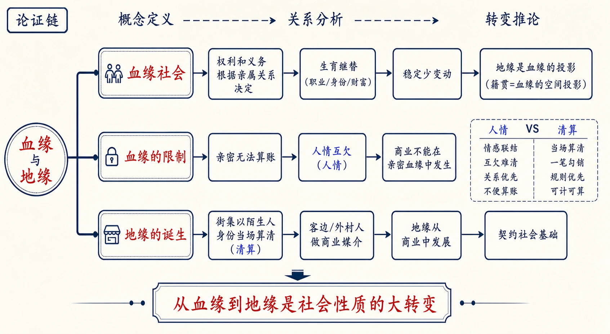
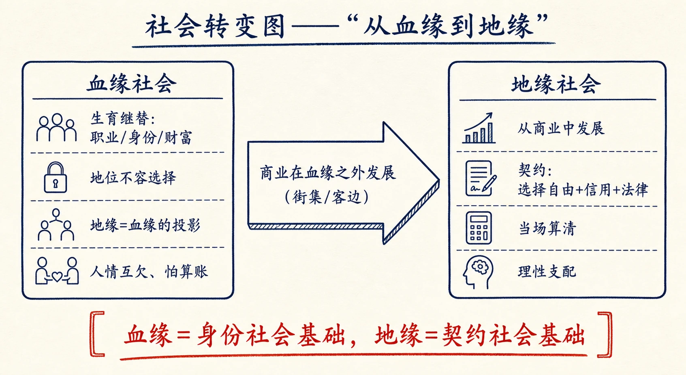
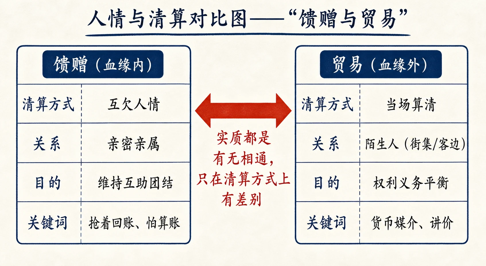
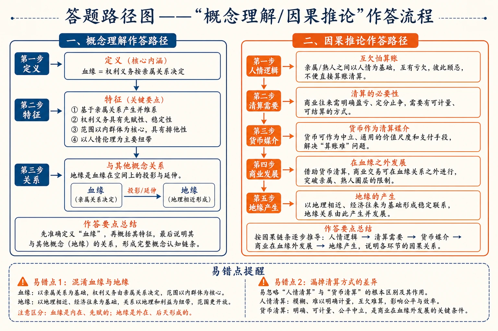

# 16 血缘和地缘

<!-- 图片描述：本节整体知识信息结构图，采用“概念定义—关系分析—转变推论”论证链。中心概念为“血缘与地缘”。上分支“血缘社会”：权利和义务根据亲属关系决定—生育继替（职业/身份/财富）—稳定少变动—地缘是血缘的投影（籍贯=血缘的空间投影）；中分支“血缘的限制”：亲密无法算账—人情互欠—商业不能在亲密血缘中发生；下分支“地缘的诞生”：街集以陌生人身份当场算清—客边/外村人做商业媒介—地缘从商业中发展—契约社会基础。底部结论“从血缘到地缘是社会性质的大转变”。朱红标出“血缘”“地缘”核心概念，靛蓝标出“人情/清算”对照，米白纸面、黑灰线条、中文标注、留白充足，符合语文文本精读风格。 -->

## 知识关系导航

- 所属章节：[[章首 学习导图|《乡土中国》学习导图]]
- 前置知识点：[[10-家族#三、课文原文与逐段/逐句解读|家族：单系扩大与亲属结构]]（血缘的亲属基础）
- 后续知识点：[[18-从欲望到需要#三、课文原文与逐段/逐句解读|欲望与需要：理性时代]]（商业/契约社会的心理基础）
- 对比知识点：[[16-血缘和地缘#三、课文原文与逐段/逐句解读|人情往来与当场清算]]（馈赠与商业之别）
- 相关方法：[[14-无为政治#三、课文原文与逐段/逐句解读|概念分类]]（身份社会/契约社会）

本章是《乡土中国》第十二章，讨论社会关系的两种基础：血缘与地缘。作者指出乡土社会是血缘社会，地缘只是血缘的投影；商业不能在亲密的血缘关系中发展，故在血缘之外、由“陌生”的客边人发展出来，地缘因此从商业中产生。理解本章，是理解《从欲望到需要》（现代理性社会）的前提。

## 本节学习目标

- 理解“血缘社会”的定义、特征及其继替方式（职业/身份/财富）。
- 理解“地缘是血缘的投影”“籍贯是血缘的空间投影”的含义。
- 理解亲密的血缘关系为何限制商业：人情互欠、无法算账。
- 理解商业如何在血缘之外发展（街集、客边人），地缘如何从商业中产生。
- 理解“血缘是身份社会的基础，地缘是契约社会的基础”，从血缘到地缘是社会性质的大转变。
- 能评价“商业在血缘之外发展”这一判断对理解乡土经济与现代转型的意义。

## 核心知识点讲解

### 一、文本基本信息与学习任务

- **篇目**：《血缘和地缘》，选自费孝通《乡土中国》。
- **作者**：费孝通（1910—2005），中国社会学家、人类学家。
- **文体**：学术随笔／社会学论述文。本章田野材料丰富（江村、禄村调查、云南钱会、库拉制度）。
- **学习任务**：理解血缘/地缘概念及其关系；把握“商业在血缘之外发展”的推论；理解从血缘到地缘的转变意义；训练概念定义、田野例证与观点评价的答题能力。

### 二、整体内容与结构线索

本文论证线索如下：

1. **定义血缘社会**：缺乏变动的文化里，长幼发生差次，年长对年幼有强制权力——血缘社会的基础；血缘=权利义务根据亲属关系决定；血缘社会用生育维持社会结构稳定（职业/身份/财富的血缘继替）。
2. **分析血缘的稳定性**：血缘决定的社会地位不容选择（谁是你的父母）；血缘是稳定的力量；地缘不过是血缘的投影（籍贯=血缘的空间投影）。
3. **说明血缘与地缘的合一**：人口不流动时，家族社群包含地域涵义，“外婆家”充满地域意义；血缘和地缘合一是社区的原始状态。
4. **解释社区分裂**：人口繁殖到一定程度须“细胞分裂”（区位分裂），分出的部分到别处找耕地，仍与老家保持血缘联系（用原地名）。
5. **分析血缘的限制**：亲密血缘限制冲突竞争，不能算账（算账=绝交）；人情互欠维持团结；钱会避免同族亲属（钱上往来不要牵涉亲戚）。
6. **引出商业**：社会生活发达，人情不易维持平衡，须当场算清→货币产生→商业；亲密的血缘社会中商业不能存在（交易以人情馈赠方式）。
7. **发展路径**：街集（陌生人身份当场算清）；客边/外村人做商业媒介（可讲价、不算人情）；店面贸易多为外来的“新客”；商业在血缘之外发展。
8. **结论**：地缘从商业里发展出来；血缘是身份社会基础，地缘是契约社会基础；从血缘到地缘是社会性质的大转变。

### 三、课文原文与逐段/逐句解读

**【原文】**
> 缺乏变动的文化里，长幼之间发生了社会的差次，年长的对年幼的具有强制的权力。这是血缘社会的基础。血缘的意思是人和人的权利和义务根据亲属关系来决定。亲属是由生育和婚姻所构成的关系。血缘，严格说来，只指由生育所发生的亲子关系。事实上，在单系的家庭组织中所注重的亲属确多由于生育而少由于婚姻，所以说是血缘也无妨。

**【解读】**
- **关键定义（名句）**：血缘社会的基础=缺乏变动的文化中长幼差次、年长对年幼的强制权力。
- **关键定义**：血缘=人和人的权利义务根据亲属关系决定；严格说只指由生育发生的亲子关系（单系家庭中重生育）。

**【原文】**
> 生育是社会持续所必需的，任何社会都一样，所不同的是说有些社会用生育所发生的社会关系来规定各人的社会地位，有些社会却并不如此。前者是血缘的。大体上说来，血缘社会是稳定的，缺乏变动；变动得大的社会，也就不易成为血缘社会。社会的稳定是指它结构的静止，填入结构中各个地位的个人是不能静止的，他们受着生命的限制，不能永久停留在那里，他们是要死的。血缘社会就是想用生物上的新陈代谢作用，生育，去维持社会结构的稳定。父死子继：农人之子恒为农，商人之子恒为商——那是职业的血缘继替；贵人之子依旧贵——那是身份的血缘继替；富人之子依旧富——那是财富的血缘继替。

**【解读】**
- **关键判断**：血缘社会=用生育发生的社会关系规定各人的社会地位；稳定、缺乏变动。
- **核心机制**：血缘社会用“生育”维持社会结构稳定（结构静止，个人更替）——父死子继。
- **三种继替**：职业的血缘继替（农之子恒为农）、身份的血缘继替（贵之子依旧贵）、财富的血缘继替（富之子依旧富）。

**【原文】**
> 血缘所决定的社会地位不容个人选择。世界上最用不上意志，同时在生活上又是影响最大的决定，就是谁是你的父母。谁当你的父母，在你说，完全是机会，且是你存在之前的既存事实。社会用这个无法竞争，又不易藏没、歪曲的事实来作分配各人的职业、身份、财产的标准，似乎是最没有理由的了；如果有理由的话，那是因为这是安稳既存秩序的最基本的办法。

**【解读】**
- **关键判断**：血缘决定地位“不容个人选择”——父母是“你存在之前的既存事实”，无法竞争、不易藏没。
- **学习提示**：以父母这一“最无理由”的事实作分配标准，是为“安稳既存秩序”。

**【原文】**
> 血缘是稳定的力量。在稳定的社会中，地缘不过是血缘的投影，不分离的。“生于斯、死于斯”把人和地的因缘固定了。生，也就是血，决定了他的地。世代间人口的繁殖，像一个根上长出的树苗，在地域上靠近在一伙。地域上的靠近可以说是血缘上亲疏的一种反映，区位是社会化了的空间。我们在方向上分出尊卑：左尊于右，南尊于北，这是血缘的坐标。空间本身是混然的，但是我们却用了血缘的坐标把空间划分了方向和位置。当我们用“地位”两字来描写一个人在社会中所占的据点时，这个原是指“空间”的名词却有了社会价值的意义。这也告诉我们“地”的关联派生于社会关系。

**【解读】**
- **核心判断（名句）**：在稳定社会中，“地缘不过是血缘的投影，不分离的”。
- **关键概念**：“区位是社会化了的空间”；方向分尊卑（左尊于右、南尊于北）是“血缘的坐标”；“地位”由空间名词变为社会价值名词——“地”的关联派生于社会关系。

**【原文】**
> 在人口不流动的社会中，自足自给的乡土社会的人口是不需要流动的，家族这个社群包含着地域的涵义。村落这个概念可以说是多余的。儿谣里“摇摇摇，摇到外婆家”，在我们自己的经验中，“外婆家”充满着地域的意义。血缘和地缘的合一是社区的原始状态。

**【解读】**
- **关键判断**：人口不流动时，家族社群包含地域涵义；“外婆家”充满地域意义；**血缘和地缘的合一是社区的原始状态**。

**【原文】**
> 但是人毕竟不是植物，还是要流动的。乡土社会中无法避免的是“细胞分裂”的过程，一个人口在繁殖中的血缘社群，繁殖到一定程度，他们不能在一定地域上集居了，那是因为这个社群所需的土地面积，因人口繁殖，也得不断地扩大。……如果分出去的细胞能在荒地上开垦，另外繁殖成个村落，它和原来的乡村还是保持着血缘的联系，甚至用原来地名来称这新地方，那是说否定了空间的分离。

**【解读】**
- **关键概念**：血缘社群的“细胞分裂”（区位分裂）——人口繁殖、土地不够，分出部分另找耕地。
- **血缘延续**：分裂出的村落仍保持血缘联系，甚至用原地名（新英伦、纽约=新约克）——“否定了空间的分离”。

**【原文】**
> 就拿我们自己来说吧，血缘性的地缘更是显著。我十岁就离开了家乡，吴江，在苏州城里住了九年，但是我一直在各种文件的籍贯项下填着“江苏吴江”。……甚至生在云南的我的孩子，也继承着我的籍贯。……我们的祖宗在吴江已有二十多代，但是在我们的灯笼上却贴着“江夏费”的大红字。江夏是在湖北，从地缘上说我有什么理由和江夏攀关系？……在这里很显然在我们乡土社会里地缘还没有独立成为一种构成团结力的关系。我们的籍贯是取自我们的父亲的，并不是根据自己所生或所住的地方，而是和姓一般继承的，那是“血缘”，所以我们可以说籍贯只是“血缘的空间投影”。

**【解读】**
- **自我例证（名句）**：籍贯随父系继承（与姓一般），是“血缘的空间投影”；灯笼上“江夏费”与地缘无关。
- **关键判断**：乡土社会里地缘还没有独立成为构成团结力的关系。

**【原文】**
> 很多离开老家漂流到别地方去的并不能像种子落入土中一般长成新村落，他们只能在其他已经形成的社区中设法插进去。如果这些没有血缘关系的人能结成一个地方社群，他们之间的联系可以是纯粹的地缘，而不是血缘了。这样血缘和地缘才能分离。但是事实上这在中国乡土社会中却相当困难。我常在各地的村子里看到被称为“客边”“新客”“外村人”等的人物。在户口册上也有注明“寄籍”的。……在乡村里居住时期并不是个重要条件，因为我知道许多村子里已有几代历史的人还是被称为新客或客边的。

**【解读】**
- **分离条件**：无血缘的人结成地方社群，联系才是纯粹地缘——血缘和地缘才能分离；但乡土中“相当困难”。
- **例证**：“客边”“新客”“外村人”“寄籍”——住几代仍被称为新客，说明乡土社会以血缘论归属。

**【原文】**
> 我在江村和禄村调查时都注意过这问题：“怎样才能成为村子里的人？”大体上说有几个条件：第一是要生根在土里：在村子里有土地。第二是要从婚姻中进入当地的亲属圈子。……事实上大概先得有了土地，才能在血缘网中生根。——这不过是我的假设，还得更多比较材料加以证实，才能成立。

**【解读】**
- **田野例证**：成为村里人的条件——①生根在土里（有土地）；②从婚姻进入当地亲属圈子；土地权受氏族保护，不易卖给外村人。
- **严谨声明**：“不过是我的假设，还得更多比较材料加以证实”——体现学术克制。

**【原文】**
> 这些寄居于社区边缘上的人物并不能说已插入了这村落社群中，因为他们常常得不到一个普通公民的权利，他们不被视作自己人，不被人所信托。我已说过乡土社会是个亲密的社会，这些人却是“陌生”人，来历不明，形迹可疑。可是就在这个特性上却找到了他们在乡土社会中的特殊职业。

**【解读】**
- **关键判断**：寄居者不被视作自己人、不被人信托——是“陌生人”；但正是这个特性使他们找到“特殊职业”（商业媒介）。

**【原文】**
> 亲密的血缘关系限制着若干社会活动，最主要的是冲突和竞争；亲属是自己人，从一个根本上长出来的枝条，原则上是应当痛痒相关，有无相通的。而且亲密的共同生活中各人互相依赖的地方是多方面和长期的，因之在授受之间无法一笔一笔地清算往回。亲密社群的团结性就依赖于各分子间都相互的拖欠着未了的人情。在我们社会里看得最清楚，朋友之间抢着回账，意思是要对方欠自己一笔人情，像是投一笔资。欠了别人的人情就得找一个机会加重一些去回个礼，加重一些就在使对方反欠了自己一笔人情。来来往往，维持着人和人之间的互助合作。亲密社群中既无法不互欠人情，也最怕“算账”。“算账”“清算”等于绝交之谓，因为如果相互不欠人情，也就无需往来了。

**【解读】**
- **核心分析（名句）**：亲密血缘限制冲突竞争；亲密的互相依赖使授受之间“无法一笔一笔地清算”；团结依赖“相互拖欠着未了的人情”。
- **关键判断**：朋友“抢着回账”=让对方欠自己人情（投一笔资）；“算账/清算”等于绝交——人情社会的核心逻辑。

**【原文】**
> 但是亲属不管怎样亲密，终究还是体外之己；虽说痛痒相关，事实上痛痒是走不出皮肤的。……社会关系中权利和义务必须有相当的平衡，这平衡可以在时间上拉得很长，但是如果是一面倒，社会关系也就要吃不消，除非加上强制的力量，不然就会折断的。防止折断的方法之一是减轻社会关系上的担负。举一个例子来说：云南乡下有一种称上的钱会，是一种信用互助组织。我调查了参加的人的关系，看到两种倾向，第一是避免同族的亲属，第二是侧重在没有亲属关系的朋友方面。……他们干脆不找同族亲属。……他很感慨地说：钱上往来最好不要牵涉亲戚。这句话就是我刚才所谓减轻社会关系上的担负的注解。

**【解读】**
- **平衡问题**：人情往来须有平衡，一面倒会“折断”；“减轻社会关系上的担负”防止折断。
- **田野例证**：云南钱会避免同族亲属、侧重无亲属的朋友——“钱上往来最好不要牵涉亲戚”。

**【原文】**
> 社会生活愈发达，人和人之间的往来也愈繁重，单靠人情不易维持相互间权利和义务的平衡。于是“当场算清”的需要也增加了。货币是清算的单位和媒介，有了一定的单位，清算时可以正确；有了这媒介可以保证各人间所得和所欠的信用。“钱上往来”就是这种可以当场清算的往来，也就是普通包括在“经济”这个范围之内的活动，狭义地说就是生意经，或是商业。

**【解读】**
- **关键推论**：社会生活发达→单靠人情难维持平衡→“当场算清”需要增加→货币=清算的单位和媒介→商业（经济）产生。
- **学习提示**：商业的根源是“清算的需要”，与血缘人情相对。

**【原文】**
> 在亲密的血缘社会中商业是不能存在的。这并不是说这种社会不发生交易，而是说他们的交易是以人情来维持的，是相互馈赠的方式。实质上馈赠和贸易都是有无相通，只在清算方式上有差别。以馈赠来经营大规模的易货在太平洋岛屿间还可以看得到。Malinowski所描写和分析的kula制度就是一个例证。但是这种制度不但复杂，而且很受限制。普通的情形是在血缘关系之外去建立商业基础。

**【解读】**
- **核心判断（名句）**：亲密的血缘社会中商业不能存在——交易以人情/馈赠方式维持；馈赠与贸易只在“清算方式”上有差别。
- **例证**：马林诺夫斯基的库拉（kula）制度——大规模易货靠馈赠方式，复杂而受限制。

**【原文】**
> 在我们乡土社会中，有专门作贸易活动的街集。街集时常不在村子里，而在一片空场上，各地的人到这特定的地方，各以“无情”的身份出现。在这里大家把原来的关系暂时搁开，一切交易都得当场算清。我常看见隔壁邻舍大家老远的走上十多里在街集上交换清楚之后，又老远地背回来。他们何必到街集上去跑这一趟呢，在门前不是就可以交换的么？这一趟是有作用的，因为在门前是邻舍，到了街集上才是“陌生”人。当场算清是陌生人间的行为，不能牵涉其他社会关系的。

**【解读】**
- **关键概念**：街集=贸易活动场所，不在村里而在空场；人以“无情”的身份出现，暂时搁开原有关系，一切当场算清。
- **点睛**：邻舍跑十多里到街集交换——因为“在门前是邻舍，到了街集上才是‘陌生’人”；当场算清是陌生人间的行为。

**【原文】**
> 在从街集贸易发展到店面贸易的过程中，“客边”的地位就有了特殊的方便了。寄籍在血缘性社区边缘上的外边人成了商业活动的媒介。村子里的人对他可以讲价钱，可以当场算清，不必讲人情，没有什么不好意思。所以依我所知道的村子里开店面的，除了穷苦的老年人摆个摊子，等于是乞丐性质外，大多是外边来的“新客”。商业是在血缘之外发展的。

**【解读】**
- **核心结论（名句）**：客边/新客（寄籍边缘的外边人）成商业媒介——村里人可对他们讲价、当场算清、不讲人情；开店面的多为“新客”。
- **总结**：“商业是在血缘之外发展的。”

**【原文】**
> 地缘是从商业里发展出来的社会关系。血缘是身份社会的基础，而地缘却是契约社会的基础。契约是指陌生人中所作的约定。在订定契约时，各人有选择的自由，在契约进行中，一方面有信用，一方面有法律。法律需要一个同意的权力去支持。契约的完成是权利义务的清算，须要精密的计算，确当的单位，可靠的媒介。在这里是冷静的考虑，不是感情，于是理性支配着人们的活动——这一切是现代社会的特性，也正是乡土社会所缺的。

**【解读】**
- **核心结论（名句）**：地缘=从商业里发展出来的社会关系；血缘=身份社会的基础，地缘=契约社会的基础。
- **契约特征**：陌生人的约定、选择自由、信用+法律、权利义务清算、精密计算/确当单位/可靠媒介、冷静理性——现代社会的特性，乡土社会所缺。

**【原文】**
> 从血缘结合转变到地缘结合是社会性质的转变，也是社会史上的一个大转变。

**【解读】**
- **总结句**：从血缘结合到地缘结合=社会性质的转变，社会史上的大转变。

### 四、关键语句、人物/意象与细节精读

- **“血缘的意思是人和人的权利和义务根据亲属关系来决定。”**：血缘的定义。
- **“血缘社会就是想用生物上的新陈代谢作用，生育，去维持社会结构的稳定。”**：血缘社会的机制。
- **“在稳定的社会中，地缘不过是血缘的投影，不分离的。”**：血缘地缘关系核心句。
- **“籍贯只是‘血缘的空间投影’。”**：自我例证得出的精辟判断。
- **“亲密社群中既无法不互欠人情，也最怕‘算账’。”**：人情社会逻辑。
- **“商业是在血缘之外发展的。”**：商业与血缘关系核心句。
- **“地缘是从商业里发展出来的社会关系。血缘是身份社会的基础，而地缘却是契约社会的基础。”**：全章最核心结论。
- **意象·老树长树苗**：人口繁殖在地域上靠近，是血缘亲疏的反映。
- **意象·细胞分裂**：血缘社群区位分裂，另成村落。
- **人物·马林诺夫斯基（Malinowski）**：英国社会人类学家，功能主义学派开创者，其库拉（kula）制度研究为例证。
- **文化常识**：库拉制度（跨部落交换循环）、寄籍、客边/新客/外村人、钱会（信用互助组织）、“摇到外婆家”。

### 五、语言风格与表达手法

- **概念定义**：血缘、地缘、身份社会、契约社会，逐一界定。
- **田野例证**：江村禄村调查、云南钱会、街集观察、自身籍贯经历，实证性强。
- **对比论证**：人情vs清算、馈赠vs贸易、血缘vs地缘、身份社会vs契约社会。
- **自我例证**：以自己籍贯、孩子继承籍贯、“江夏费”灯笼说明血缘的空间投影，亲切可信。
- **层层推论**：血缘限制→清算需要→商业产生→地缘发展→社会转变。

### 六、主题思想、情感态度与文化理解

- **主题**：乡土社会是血缘社会，靠生育继替维持结构稳定；地缘只是血缘的投影。亲密的血缘关系限制商业（无法算账），商业因此在血缘之外发展（街集、客边人），地缘由此从商业中产生；从血缘到地缘是社会性质的大转变，是现代社会（契约、理性）的起点。
- **情感态度**：作者以田野调查的亲切笔触写血缘社会的运作（人情互欠、钱会），同时冷静揭示其限制与转型必然；对“乡土社会缺理性计算”不作贬斥，只作结构陈述。
- **文化理解**：理解“人情社会”“算账=绝交”“钱上往来不牵涉亲戚”等观念的经济结构根源；理解商业与陌生人社会的关系；理解现代契约社会从血缘社会脱胎的历史逻辑。

### 七、阅读答题与写作迁移

- **答题模板（概念理解）**：定义+特征+与其他概念的关系。
- **答题模板（田野例证作用）**：例证内容+印证观点+论证价值。
- **答题模板（因果推论）**：前提（亲密无法算账）→中间环节（清算需要→货币）→结论（商业在血缘外发展）。
- **写作迁移**：学习用田野调查与自身经验支撑学术观点；学习“由日常现象追问结构原因”的论述方法。

<!-- 图片描述：社会转变图——“从血缘到地缘”。左：血缘社会（生育继替：职业/身份/财富；地位不容选择；地缘=血缘的投影；人情互欠、怕算账）；中箭头“商业在血缘之外发展（街集/客边）”；右：地缘社会（从商业中发展；契约：选择自由+信用+法律；当场算清；理性支配）。朱红标出“血缘=身份社会基础，地缘=契约社会基础”。米白纸面、黑灰线条、中文标注。 -->

## 重点梳理

- **血缘社会与地缘社会**：血缘社会权利义务根据亲属关系决定，用生育（生物新陈代谢）维持结构稳定，父死子继（职业/身份/财富继替），不容个人选择；地缘社会从商业里发展出来，是契约社会的基础，与血缘社会相对。
- **地缘与血缘**：稳定社会中地缘是血缘的投影；区位=社会化了的空间；籍贯=血缘的空间投影；血缘地缘合一是社区原始状态。
- **社区分裂**：细胞分裂（人口繁殖→区位分裂→另成村落，仍保血缘联系）。
- **人情逻辑**：亲密社群互欠人情、最怕算账；算账=绝交；钱会避免同族亲属。
- **商业起源**：社会生活发达→当场算清需要→货币（清算单位与媒介）→商业；亲密的血缘社会中商业不能存在（馈赠非贸易）。
- **商业与地缘**：商业在血缘之外发展（街集、客边人）；地缘从商业里发展出来，是契约社会的基础。
- **身份社会与契约社会**：血缘是身份社会的基础（地位由出生决定、不容选择），地缘是契约社会的基础（陌生人的约定、选择自由、信用+法律）；从血缘到地缘=社会性质大转变。
- **必记名句**：“地缘不过是血缘的投影”“籍贯只是‘血缘的空间投影’”“亲密社群中既无法不互欠人情，也最怕‘算账’”“商业是在血缘之外发展的”“地缘是从商业里发展出来的社会关系”。
- **论证方法**：概念定义、田野例证、对比论证、自我例证、层层推论。

## 难点突破

<!-- 图片描述：人情与清算对比图——“馈赠与贸易”。左右两栏：左栏“馈赠（血缘内）”：清算方式—互欠人情；关系—亲密亲属；目的—维持互助团结；关键词—抢着回账、怕算账；右栏“贸易（血缘外）”：清算方式—当场算清；关系—陌生人（街集/客边）；目的—权利义务平衡；关键词—货币媒介、讲价。中间朱红箭头标注“实质都是有无相通，只在清算方式上有差别”。米白纸面、黑灰线条、中文标注。 -->

- **难点一：为什么说“地缘是血缘的投影”？**
  突破：稳定社会中，人生于斯死于斯，“生，也就是血，决定了他的地”；地域靠近反映血缘亲疏，方向分尊卑是“血缘的坐标”，籍贯随父系继承（与姓一般）是“血缘的空间投影”。即“地”的关联派生于社会关系（血缘），故地缘未独立。
- **难点二：为什么“算账”等于绝交？**
  突破：亲密社群的团结依赖“相互拖欠着未了的人情”；若一笔一笔算清、互不相欠，就失去了往来与互助的理由，关系也就结束了。故“算账/清算”意味着绝交——这是人情社会的逻辑。
- **难点三：为什么说“亲密的血缘社会中商业不能存在”？**
  突破：不是说没有交易，而是交易以人情馈赠方式维持（无法算账）；商业要求当场算清、精密计算，这与亲密关系“怕算账”冲突。故商业须在血缘之外、以陌生人身份（街集、客边）发展。
- **难点四：从血缘到地缘为什么是“社会性质的大转变”？**
  突破：血缘=身份社会（地位出生决定、不容选择、人情伦理）；地缘=契约社会（陌生人的约定、选择自由、信用+法律、精密计算、理性支配）。从血缘结合到地缘结合，社会关系的基础、分配标准、维系方式全部改变，故是社会性质的大转变。

<!-- 图片描述：答题路径图——“概念理解/因果推论”作答流程。概念题：定义（血缘=权利义务按亲属关系决定）→特征→与其他概念关系（地缘是血缘投影）；因果题：人情逻辑（互欠怕算账）→清算需要→货币媒介→商业在血缘外发展→地缘产生。两条路径分色，底部标注易错点（混淆血缘地缘、漏清算方式差异）。米白纸面、黑灰线条、中文标注。 -->

## 例题讲解

**例题1（概念理解）** 什么是血缘社会？它如何维持社会结构的稳定？
- **分析**：回扣“生育是社会持续所必需”段。
- **答案**：血缘社会是用生育所发生的社会关系（亲属关系）来规定各人社会地位的社会，稳定、缺乏变动。它用生物上的新陈代谢作用（生育）维持结构稳定：父死子继——职业（农之子恒为农）、身份（贵之子依旧贵）、财富（富之子依旧富）都靠血缘继替；结构静止而个人更替。
- **反思**：概念题要“定义+机制+三种继替”。

**例题2（因果推论）** 为什么商业不能在亲密的血缘社会中存在？
- **分析**：从“清算方式”差异作答。
- **答案**：亲密血缘社会靠人情互欠维持团结，最怕“算账”（算账=绝交）；而商业要求当场算清、精密计算（货币为清算单位与媒介）。馈赠与贸易实质都是“有无相通”，只在清算方式上有差别；血缘社会中交易只能以馈赠方式维持（如库拉制度），故商业不能在这种亲密关系中存在，必须在血缘之外以陌生人身份发展。
- **反思**：因果题要“人情逻辑→清算差异→商业须在血缘外”完整。

**例题3（田野例证）** 作者用“云南钱会”的例子说明什么？
- **分析**：定位“减轻社会关系上的担负”段。
- **答案**：钱会是信用互助组织，参加者避免同族亲属、侧重无亲属的朋友——因为同族亲属理论上有互助责任，拉了入会，不按期交款时碍于人情不能逼，反而难办；“钱上往来最好不要牵涉亲戚”。例证说明：人情往来需要平衡，一面倒会“折断”，须“减轻社会关系上的担负”；为后文“当场算清的需要增加→商业产生”作铺垫。
- **反思**：例证题要“内容+印证观点+论证价值”。

**例题4（观点评价）** 作者说“从血缘结合转变到地缘结合是社会性质的转变”，你如何理解这一判断对理解现代社会的意义？
- **分析**：还原“血缘=身份社会、地缘=契约社会”的论证，再联系现代。
- **答案**：该判断揭示现代社会关系的基础已由“出生决定的身份”转向“自由选择的契约”：契约社会讲选择自由、信用与法律、精密计算与理性。意义：帮助我们理解现代社会的契约精神、法治与市场逻辑，正是从血缘社会脱胎而来；同时也提醒我们，血缘的影响（人情、身份、关系）并未完全消失，转型是“性质转变”而非常态断裂。
- **反思**：评价题要“还原→分析→联系现实→辩证”。

## 易错点整理

- **概念混淆**：把“血缘”说成“指地域关系”。避免：血缘=权利义务根据亲属（生育）关系决定；地缘=从商业里发展出的地域关系。
- **继替漏项**：答血缘继替只写职业。避免：职业、身份、财富三种继替都答。
- **“投影”误读**：说“地缘和血缘无关”。避免：稳定社会中地缘是血缘的投影（籍贯=血缘空间投影）。
- **人情逻辑错**：说“人情社会讲算账”。避免：亲密社群最怕算账，算账=绝交；钱会避免亲戚。
- **商业误判**：说“乡土社会没有商业/交易”。避免：有交易，但以人情馈赠方式；商业（当场算清）在血缘之外发展。

## 考点考证点整理

### 考点一：概念理解与定义
- **出题思路**：解释“血缘社会”“地缘”“身份社会/契约社会”。
- **关键条件**：回到定义句。
- **解答要点**：定义+特征+与其他概念的关系。
- **易扣分点**：混淆血缘/地缘；漏“身份社会/契约社会”对应。

### 考点二：关系分析（血缘与地缘）
- **出题思路**：为什么说“地缘是血缘的投影”？籍贯为何是“血缘的空间投影”？
- **关键条件**：抓住“生于斯死于斯”“血缘坐标”“籍贯随父系继承”。
- **解答要点**：三例证+结论（地未独立成团结力）。
- **易扣分点**：只答“人住在哪就是哪”；不点“血缘坐标/空间投影”。

### 考点三：人情与清算（因果推论）
- **出题思路**：为什么亲密血缘社会中商业不能存在？钱会为什么避免亲戚？
- **关键条件**：抓住“互欠人情—怕算账”与“清算需要—货币”两条线。
- **解答要点**：人情逻辑→清算差异→商业在血缘外发展。
- **易扣分点**：只答“亲戚不讲价”；漏“清算方式”这一关键差异。

### 考点四：田野例证与材料分析
- **出题思路**：分析钱会、街集、客边开店、库拉制度等例证的作用。
- **关键条件**：明确各例为哪个观点服务。
- **解答要点**：内容+印证观点+论证价值。
- **易扣分点**：只讲故事不分析；例证与观点错配。

### 考点五：观点评价与现实意义
- **出题思路**：评析“从血缘到地缘是社会性质的大转变”，或谈人情社会对现代商业的影响。
- **关键条件**：兼顾转变必然性与血缘残余。
- **解答要点**：还原观点→分析依据→联系现代→辩证。
- **易扣分点**：只说“现代社会抛弃人情”；不扣“契约社会”特征。

## 练习题

> 说明：本章源文（费孝通《乡土中国·血缘和地缘》）未附课后练习题，以下题目根据本章核心考点自拟，用于巩固整本书阅读与论述类文本阅读能力。

**一、基础理解（自拟）**
1. 根据原文，写出“血缘社会”的定义及其维持结构稳定的方式。
2. 为什么说“在稳定的社会中，地缘不过是血缘的投影”？

**二、文本分析（自拟）**
3. 解释“籍贯只是‘血缘的空间投影’”这句话的含义。
4. 为什么“亲密社群中既无法不互欠人情，也最怕‘算账’”？

**三、鉴赏评价（自拟）**
5. 分析“街集”现象说明的道理，并说明作者如何论证“商业是在血缘之外发展的”。
6. 作者说“从血缘结合转变到地缘结合是社会性质的转变”，你如何理解？

**四、迁移写作（自拟）**
7. 联系现实，谈谈“人情社会”对现代市场经济的积极作用与消极影响（不少于 200 字）。

## 练习题答案

**1.** 血缘社会是用生育所发生的社会关系（亲属关系）来规定各人社会地位的社会，稳定、缺乏变动。它用生物上的新陈代谢作用（生育）维持结构稳定：父死子继，职业（农之子恒为农）、身份（贵之子依旧贵）、财富（富之子依旧富）的血缘继替。
> 要点：定义+生育机制+三种继替。

**2.** 稳定社会中人生于斯死于斯，“生，也就是血，决定了他的地”；地域靠近反映血缘亲疏（区位=社会化了的空间），方向分尊卑是“血缘的坐标”，籍贯随父系继承是“血缘的空间投影”。即“地”的关联派生于血缘关系，地缘未独立成团结力。
> 评分：须答出“血决定地”“血缘坐标”“籍贯继承”等要点。

**3.** 籍贯不是根据自己出生或居住之地决定，而是取自父亲、和姓一般继承的，属于血缘而非地缘；我的孩子生在云南仍继承“江苏吴江”的籍贯即是例证。故“籍贯”表面是地缘符号，实质是血缘的空间投影，说明乡土社会地缘未独立。
> 评分：定义+自我例证。

**4.** 亲密社群的团结依赖各分子间“相互拖欠着未了的人情”（抢着回账=让对方欠自己人情，像投资）；若一笔一笔算清、互不相欠，就失去往来理由，关系即告结束。故“算账/清算”等于绝交——人情社会以“互欠”为纽带。
> 评分：正（互欠维序）反（算账绝交）两面。

**5.** 街集现象：邻舍跑十多里到街集交换，因为“在门前是邻舍，到了街集上才是‘陌生’人”，可以无情身份当场算清——说明当场算清是陌生人间的行为。论证：作者先指出亲密血缘社会无法算账（人情馈赠），再以街集（陌生人）与客边/新客（可讲价、不算人情）开店为例，层层推出“商业是在血缘之外发展的”。
> 评分：现象说明+论证过程。

**6.** （理解要点）血缘=身份社会（地位出生决定、不容选择、人情伦理维系）；地缘=契约社会（陌生人约定、选择自由、信用+法律、精密计算、理性支配）。从血缘结合到地缘结合，社会关系的基础、分配标准与维系方式全部改变，故是社会性质的大转变。这也解释了现代社会契约、法治与市场逻辑的起源；同时血缘影响（人情、关系）并未完全消失，转型是性质转变而非彻底断裂。
> 评分：两种社会特征+转变意义+辩证。

**7.** （写作评分要点）能辩证分析即可：积极作用——人情信任降低交易成本、促进互助（熟人网络、民间信用）；消极影响——人情干扰规则（走后门、双标）、阻碍公平竞争、清算困难（欠人情难拒绝）。现代市场经济需要在“当场算清”的契约基础上发挥人情温情，如商业伦理、企业信用体系。要求结合实例，逻辑清晰，不少于 200 字。
