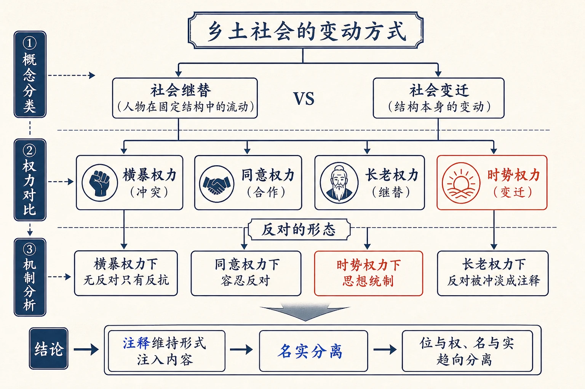
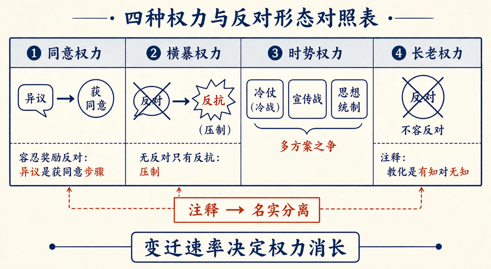
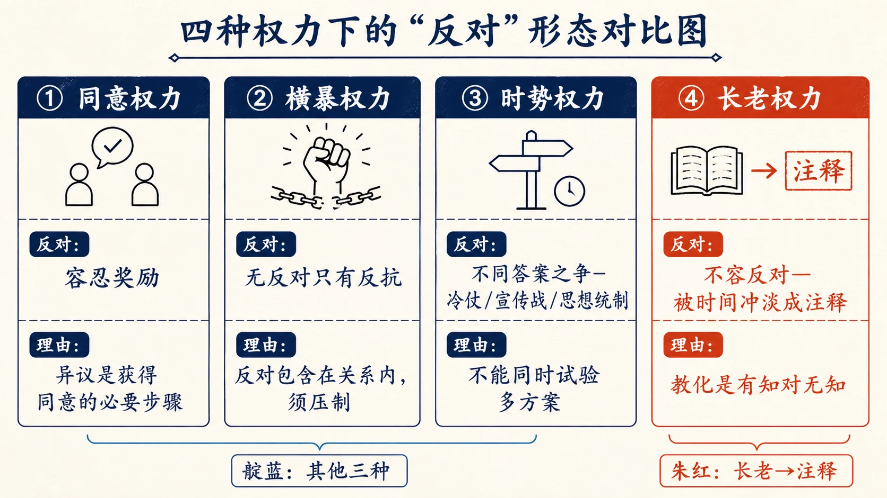
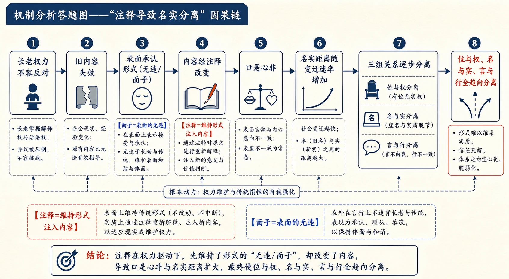

# 17 名实的分离

<!-- 图片描述：本节整体知识信息结构图，采用“概念分类—权力对比—机制分析”论证链。中心议题为“乡土社会的变动方式”。上分支“两种过程”：社会继替（人物在固定结构中的流动）vs 社会变迁（结构本身的变动）；中分支“四种权力”：横暴（冲突）、同意（合作）、长老（继替）、时势（变迁）；下分支“反对的形态”：横暴下无反对只有反抗、同意下容忍反对、时势下思想统制、长老下反对被冲淡成注释；底部结论“注释维持形式注入内容→名实分离→位与权、名与实趋向分离”。朱红标出“时势权力”，靛蓝标出“注释/名实分离”，米白纸面、黑灰线条、中文标注、留白充足，符合语文文本精读风格。 -->

## 知识关系导航

- 所属章节：[[章首 学习导图|《乡土中国》学习导图]]
- 前置知识点：[[15-长老统治#三、课文原文与逐段/逐句解读|教化权力与长老统治]]（本章由长老权力引出第四种权力）
- 后续知识点：[[18-从欲望到需要#三、课文原文与逐段/逐句解读|从欲望到需要]]（时势权力在现代社会的知识基础）
- 对比知识点：[[14-无为政治#三、课文原文与逐段/逐句解读|横暴权力与同意权力]]（与第四种权力对照）
- 相关方法：[[12-礼治秩序#三、课文原文与逐段/逐句解读|条件推论]]（变迁速率与权力消长）

本章是《乡土中国》第十三章，在横暴、同意、长老三种权力之外提出第四种权力——时势权力。作者区分“社会继替”（人物流动）与“社会变迁”（结构变动），指出变迁中产生“文化英雄”与时势权力；并分析四种权力下“反对”的不同形态，以及长老权力下“注释”机制导致的名实分离。理解本章，是理解《从欲望到需要》的前提。

## 本节学习目标

- 理解“社会继替”与“社会变迁”的区别，以及两种过程中权力的消长关系。
- 理解“时势权力”的定义、发生机制与性质（区别于横暴/同意/长老权力）。
- 理解“文化英雄”的角色与“知识即权力”的现代意义。
- 理解“反对”在横暴、同意、时势、长老四种权力下的不同形态。
- 理解“注释”机制如何导致名实分离，评价“注释”这一变动方式。
- 能联系历史（春秋战国百家争鸣、定于一尊、英国改革）理解社会变迁的不同路径。

## 核心知识点讲解

### 一、文本基本信息与学习任务

- **篇目**：《名实的分离》，选自费孝通《乡土中国》。
- **作者**：费孝通（1910—2005），中国社会学家、人类学家。
- **文体**：学术随笔／社会学论述文。本章以概念分类（两种过程、四种权力）与历史例证（春秋战国、英国改革）见长。
- **学习任务**：理解社会变迁的机制与时势权力；理解四种权力下“反对”的形态；理解“注释”与名实分离；训练概念分类、历史例证与观点评价的答题能力。

### 二、整体内容与结构线索

本文论证线索如下：

1. **提出议题**：乡土社会非绝对静止，只是变得慢；不同速率引起变动方式殊异。
2. **区分两种过程**：社会继替（人物在固定结构中的流动）vs 社会变迁（结构本身的变动）；两种权力（长老/时势）并存、消长关联。
3. **解释变迁原因**：社会结构是人造工具，须能答复人的需要；环境变→旧结构失效→变迁。
4. **提出时势权力**：变迁中出现“文化英雄”（提得出办法、组织试验、获信任）→支配群众→时势权力；非剥削（≠横暴）、非授权（≠同意）、非传统（≠长老）。
5. **例证**：初民社会英雄、战争非常局面、落后国家现代化（苏联权力性质）。
6. **安定时无英雄**：乡土社会结构能答复需要时最安定，少领袖英雄；“三年无改于父之道”=变迁吸收进继替。
7. **孝与长老权力**：孝=无违=承认长老权力；变迁速率与世代交替相等时无冲突、不需革命（英国例子）。
8. **反对的四种形态**：同意权力容忍奖励反对；横暴权力无反对只有反抗；时势权力有思想统制（宣传战、冷仗）；长老权力不容反对，反对被时间冲淡成“注释”。
9. **注释与名实分离**：注释=维持长老权力形式而注入变动内容；名实之间随变迁速率而分离；口是心非、面子；挟天子以令诸侯→位与权、名与实、言与行全趋向分离。

### 三、课文原文与逐段/逐句解读

**【原文】**
> 我们把乡土社会看成一个静止的社会不过是为了方便，尤其是在和现代社会相比较时，静止是乡土社会的特点，但是事实上完全静止的社会是不存在的，乡土社会不过比现代社会变得慢而已。说变得慢，主要的意思自是指变动的速率，但是不同的速率也引起了变动方式上的殊异。我在本文里将讨论乡土社会速率很慢的变动中所形成的变动方式。

**【解读】**
- **开宗明义**：乡土社会非绝对静止，只是“变得慢”；不同速率引起“变动方式上的殊异”——本章讨论慢速率下的变动方式。

**【原文】**
> 我在上面讨论权力的性质时已提出三种方式：一是在社会冲突中所发生的横暴权力；二是从社会合作中所发生的同意权力；三是从社会继替中所发生的长老权力。现在我又想提出第四种权力，这种权力发生在激烈的社会变迁过程之中。社会继替是指人物在固定的社会结构中的流动；社会变迁却是指社会结构本身的变动。这两种过程并不是冲突的，而是同时存在的，任何社会决不会有一天突然变出一个和旧有结构完全不同的样式，所谓社会变迁，不论怎样快，也是逐步的；所变的，在一个时候说，总是整个结构中的一小部分。因之从这两种社会过程里所发生出来的两种权力也必然同时存在。但是它们的消长却互相关联。如果社会变动得慢，长老权力也就更有势力；变得快，“父不父，子不子”的现象就会发生，长老权力也会随着缩小。

**【解读】**
- **关键区分（名句）**：社会继替=人物在固定社会结构中的流动；社会变迁=社会结构本身的变动。
- **关键判断**：两种过程同时存在、不冲突；变迁是逐步的（一次只变一小部分）；相应两种权力（长老/时势）并存，消长关联——变得慢则长老权力更有势力，变得快则长老权力缩小。

**【原文】**
> 社会结构自身并没有要变动的需要。有些学者，好像我在上文所提到的那位Spengler，把社会结构（文化中的一主要部分）视作有类于有机体，和我们身体一般，有幼壮老衰等阶段。我并不愿意接受他们的看法，因为我认为社会结构，像文化的其他部分一般，是人造出来的，是用来从环境里取得满足生活需要的工具。社会结构的变动是人要它变的，要它变的原因是在它已不能答复人的需要。好比我们用笔写字，笔和字都是工具，目的是在想用它们来把我们的意思传达给别人。如果我们所要传达的对象是英国人，中文和毛笔就不能是有效的工具了，我们得用别的工具，英文和打字机。

**【解读】**
- **方法论立场**：反对把社会结构看作有机体（有幼壮老衰），主张社会结构是人造工具，须能答复人的需要。
- **比喻**：笔/字=工具；传达对象是英国人时，中文毛笔失效，须换英文打字机——结构变动的必要性由“工具能否满足需要”决定。

**【原文】**
> 这样说来社会变迁常是发生在旧有社会结构不能应付新环境的时候。新的环境发生了，人们最初遭遇到的是旧方法不能获得有效的结果，生活上发生了困难。人们不会在没有发觉旧方法不适用之前就把它放弃的。旧的生活方法有习惯的惰性。但是如果它已不能答复人们的需要，它终必会失去人们对它的信仰，守住一个没有效力的工具是没有意义的，会引起生活上的不便，甚至蒙受损失。另一方面，新的方法却又不是现存的，必须有人发明，或是有人向别种文化去学习，输入，此外，还得经过试验，才能被人接受，完成社会变迁的过程。在新旧交替之际，不免有一个惶惑、无所适从的时期，在这个时期，心理上充满着紧张、犹豫和不安。这里发生了“文化英雄”，他提得出办法，有能力组织新的试验，能获得别人的信任。这种人可以支配跟从他的群众，发生了一种权力。这种权力和横暴权力并不相同，因为它并不是建立在剥削关系之上的；和同意权力又不同，因为它并不是由社会所授权的；和长老权力更不同，因为它并不根据传统的。它是时势所造成的，无以名之，名之曰时势权力。

**【解读】**
- **变迁机制**：旧结构不能应付新环境→旧方法失效→习惯惰性→失去信仰→需新方法（发明或输入）→试验→被接受。
- **文化英雄**：提得出办法、能组织新试验、获信任的人——支配群众，发生权力。
- **时势权力定义（名句）**：非剥削（≠横暴）、非授权（≠同意）、非传统（≠长老），是“时势所造成的”，名之曰时势权力。

**【原文】**
> 这种时势权力在初民社会中常可以看到。在荒原上，人们常常遭遇不平常的环境，他们需要有办法的人才，那是英雄。在战争中，也是非常的局面，这类英雄也脱颖而出。现代社会又是一个变迁剧烈的社会，这种权力也在抬头了。最有意思的就是在一个落后的国家要赶紧现代化的过程中，这种权力表现得也最清楚。我想我们可以从这个角度去看苏联的权力性质。英美的学者把它归入横暴权力的一类里，因为它形式上是独裁的；但是从苏联人民的立场来看，这种独裁和沙皇的独裁却不一样，如果我们采用这个时势权力的概念看去，就比较容易了解它的本质了。

**【解读】**
- **例证**：初民社会英雄、战争非常局面、落后国家现代化——时势权力在非常环境与变迁中凸显。
- **苏联例子**：英美学者把苏联权力归入横暴权力（形式独裁）；作者认为从苏联人民立场看与沙皇独裁不同，用“时势权力”概念更易了解其本质——体现概念工具的分析力。

**【原文】**
> 这种权力最不发达的是在安定的社会中。乡土社会，当它的社会结构能答复人们生活的需要时，是一个最容易安定的社会，因之它也是个很少“领袖”和“英雄”的社会。所谓安定是相对的，指变得很慢。如果我单说“很慢”，这话句并不很明朗，一定要说出慢到什么程度。其实孔子已回答过这问题，他的答案是“三年无改于父之道”。换一句话来说，社会变迁可以吸收在社会继替之中的时候，我们可以称这社会是安定的。

**【解读】**
- **关键判断**：时势权力最不发达于安定社会；乡土社会结构能答复需要时最安定，很少领袖英雄。
- **关键概念**：“三年无改于父之道”=变迁的速率；**社会变迁可以吸收在社会继替之中=安定**。

**【原文】**
> 儒家所注重的“孝”道，其实是维持社会安定的手段，孝的解释是“无违”，那就是承认长老权力。长老代表传统，遵守传统也就可以无违于父之教。但是传统的代表是要死亡的，而且自己在时间过程中也会进入长老的地位。如果社会变迁的速率慢到可以和世代交替的速率相等，亲子之间，或是两代之间，不致发生冲突，传统自身慢慢变，还是可以保持长老的领导权。这种社会也就不需要“革命”了。

**【解读】**
- **孝与安定**：孝=无违=承认长老权力；长老代表传统。
- **关键判断**：变迁速率≈世代交替速率时，两代不冲突、传统慢慢变、长老保持领导权、不需“革命”。

**【原文】**
> 从整个社会看，一个领导的阶层如果能追得上社会变迁的速率，这社会也可以避免因社会变迁而发生的混乱。英国是一个很好的例子。很多人羡慕英国能不流血而实行种种富于基本性的改革，但很多人都忽略了他们所以能这样的条件。英国在过去几个世纪中，就整个世界的文化来说是处于领导地位，他是工业革命的老家。英国社会中的领导阶层却又是最能适应环境变动的，环境变动的速率和领导阶层适应变动的速率配得上才不致发生流血的革命。

**【解读】**
- **历史例证**：英国能不流血而改革——因为领导阶层适应变动的速率与环境变动的速率“配得上”。
- **关键判断**：领导的阶层追得上变迁速率→避免混乱与流血革命。

**【原文】**
> 乡土社会环境固定，在父死三年之后才改变他的道的速率中，社会变迁也不致引起人事的冲突。在人事范围中，长老保持他们的权力，子弟们在无违的标准中接受传统的统治。在这里不发生“反对”，长老权力也不容忍反对。长老权力是建立在教化作用之上的，教化是有知对无知，如果所传递的文化是有效的，被教的自没有反对的必要；如果所传递的文化已经失效，根本也就失去了教化的意义。“反对”在这种关系里是不发生的。

**【解读】**
- **长老权力下的“反对”**：不发生、不被容忍——教化是有知对无知，文化有效则无反对必要，文化失效则失去教化意义。

**【原文】**
> 容忍、甚至奖励、反对在同意权力中才发生，因为同意权力建立在契约上，执行这权力的人是否遵行契约是一个须随时加以监督的问题。而且反对，也就是异议，是获得同意的必要步骤。在横暴权力之下，没有反对，只有反抗，因为反对早就包含在横暴权力的关系中。因之横暴权力必须压制反抗，不能容忍反对。在时势权力中，反对是发生于对同一问题不同的答案上，但是有时，一个社会不能同时试验多种不同的方案，于是在不同方案之间发生了争斗，也可以称作“冷仗”，宣传战，争取人民的跟从。为了求功，每一个自信可以解决问题的人，都会感觉到别种方案会分散群众对自己的方案的注意和拥护，因之产生了不能容忍反对的“思想统制”。

**【解读】**
- **四种权力下的“反对”形态（名句）**：
  - 同意权力：容忍、甚至奖励反对（异议是获得同意的必要步骤）。
  - 横暴权力：无反对只有反抗（反对已包含在关系内），须压制反抗。
  - 时势权力：反对发生于不同答案之间，有“冷仗/宣传战/思想统制”。
  - 长老权力：不容反对，反对被时间冲淡成“注释”。

**【原文】**
> 回到长老权力下的乡土社会说，反对被时间冲淡，成了“注释”。注释是维持长老权力的形式而注入变动的内容。在中国的思想史中，除了社会变迁急速的春秋战国这一个时期，有过百家争鸣的思想争斗的场面外，自从定于一尊之后，也就在注释的方式中求和社会的变动谋适应。注释的变动方式可以引起名实之间发生极大的分离。在长老权力下，传统的形式是不准反对的，但是只要表面上承认这形式，内容却可以经注释而改变。结果不免是口是心非。在中国旧式家庭中生长的人都明白家长的意志怎样在表面的无违下，事实上被歪曲的。虚伪在这种情境中不但是无可避免而且是必需的。对不能反对而又不切实用的教条或命令只有加以歪曲，只留一个面子。面子就是表面的无违。名实之间的距离跟着社会变迁速率而增加。在一个完全固定的社会结构里是不会发生这距离的，但是事实上完全固定的社会并不存在。在变得很慢的社会中发生了长老权力，这种统治不能容忍反对，社会如果加速地变动，注释式歪曲原意的办法也就免不了。挟天子以令诸侯的结果，位与权，名与实，言与行，话与事，理论与现实，全趋向于分离了。

**【解读】**
- **核心概念（名句）**：注释=维持长老权力的形式而注入变动的内容。
- **历史例证**：春秋战国百家争鸣（变迁急速）→定于一尊后以注释方式适应变动。
- **名实分离机制**：形式不准反对→表面承认形式、内容经注释改变→口是心非→虚伪不可避免且必需（只留面子）→名实距离随变迁速率增加。
- **总结**：挟天子以令诸侯→位与权、名与实、言与行、话与事、理论与现实全趋向分离。

### 四、关键语句、人物/意象与细节精读

- **“社会继替是指人物在固定的社会结构中的流动；社会变迁却是指社会结构本身的变动。”**：两种过程的核心区分。
- **“它是时势所造成的，无以名之，名之曰时势权力。”**：第四种权力的命名。
- **“社会变迁可以吸收在社会继替之中的时候，我们可以称这社会是安定的。”**：安定=变迁被继替吸收。
- **“注释是维持长老权力的形式而注入变动的内容。”**：本章核心机制。
- **“面子就是表面的无违。”**：名实分离的日常形态。
- **“位与权，名与实，言与行，话与事，理论与现实，全趋向于分离了。”**：名实分离的总结。
- **人物·文化英雄**：变迁中提得出办法、组织试验、获信任的人——时势权力的载体。
- **人物·斯宾格勒（Spengler）**：把社会结构看作有机体（幼壮老衰）的观点，作者明确反对。
- **意象·工具（笔/字）**：社会结构是人造工具，须答复需要，失效则换新。
- **文化常识**：“三年无改于父之道”“孝=无违”、春秋战国百家争鸣、定于一尊、挟天子以令诸侯。

### 五、语言风格与表达手法

- **概念分类**：继替/变迁、四种权力，界限分明。
- **历史例证**：春秋战国、定于一尊、英国改革、苏联权力，古今中外。
- **比喻论证**：笔/字=工具、化抽象为具象。
- **层层推论**：变迁→文化英雄→时势权力→反对形态→注释→名实分离。
- **辩证分析**：变迁是逐步的、两种过程并存，不做绝对化。

### 六、主题思想、情感态度与文化理解

- **主题**：社会变迁发生于旧结构不能答复新需要时；变迁中出现文化英雄与时势权力（第四种权力）；长老权力下“反对”被冲淡为“注释”，以维持形式、注入内容，导致名实分离；社会变迁速率决定权力消长与变动方式。
- **情感态度**：作者以功能论立场解释社会结构（工具说），对“注释”机制既揭示其虚伪与代价（口是心非、面子），也指出其在不能反对的情境下“不可避免且必需”；对苏联等权力不作简单定性，强调概念工具的分析力。
- **文化理解**：理解“孝=无违”的社会功能（维持安定）；理解“定于一尊→注释”的学术史逻辑；理解“名实分离”在旧式家庭、政治运作中的普遍表现；理解变迁速率与社会形态的关系。

### 七、阅读答题与写作迁移

- **答题模板（概念区分）**：定义+比较维度+例证。
- **答题模板（历史例证作用）**：例证内容+印证观点+论证价值。
- **答题模板（观点评价）**：还原观点→分析依据→辩证→联系现实。
- **写作迁移**：学习“用一个新概念（时势权力）解释复杂现象”的学术方法；学习“分类—对比—推论”的论证结构。

<!-- 图片描述：四种权力与反对形态对照表。四栏：同意权力（容忍奖励反对：异议是获同意步骤）；横暴权力（无反对只有反抗：压制）；时势权力（冷仗/宣传战/思想统制：多方案之争）；长老权力（不容反对→注释：教化是有知对无知）。朱红标出“注释→名实分离”，底部标注“变迁速率决定权力消长”。米白纸面、黑灰线条、中文标注。 -->

## 重点梳理

- **两种过程**：社会继替（人物流动）vs 社会变迁（结构变动）；并存、逐步、消长关联。
- **第四种权力**：时势权力——发生于激烈社会变迁；非剥削（≠横暴）、非授权（≠同意）、非传统（≠长老）；载体是文化英雄。
- **文化英雄**：变迁中提得出办法、组织试验、获信任的人（荒原、战争、现代化中的英雄）。
- **安定标准**：社会变迁可以吸收在社会继替之中=安定（“三年无改于父之道”）；变迁速率≈世代交替速率→无冲突、不需革命（英国例子）。
- **反对与反抗的形态**：同意（容忍奖励）、横暴（无反对只有反抗）、时势（冷仗/宣传战/思想统制）、长老（不容反对→注释）。
- **注释机制**：维持形式、注入内容→口是心非→名实分离→位与权、名与实、言与行、理论与现实全分离。
- **必记名句**：“社会继替是指人物在固定的社会结构中的流动；社会变迁却是指社会结构本身的变动”“它是时势所造成的，无以名之，名之曰时势权力”“注释是维持长老权力的形式而注入变动的内容”“面子就是表面的无违”“位与权，名与实，言与行，话与事，理论与现实，全趋向于分离了”。
- **论证方法**：概念分类、历史例证、比喻论证、层层推论、辩证分析。

## 难点突破

<!-- 图片描述：四种权力下的“反对”形态对比图。四个并排矩形：同意权力（反对：容忍奖励；理由：异议是获得同意的必要步骤）、横暴权力（反对：无反对只有反抗；理由：反对包含在关系内，须压制）、时势权力（反对：不同答案之争—冷仗/宣传战/思想统制；理由：不能同时试验多方案）、长老权力（反对：不容反对—被时间冲淡成注释；理由：教化是有知对无知）。用朱红标出“长老→注释”，靛蓝标出其他三种，米白纸面、黑灰线条、中文标注。 -->

- **难点一：社会继替与社会变迁有什么不同？**
  突破：继替=人物在**固定的结构**中流动（人换位置不变）；变迁=**结构本身**变动（位置/关系改变）。两者并存且逐步发生（一次只变一小部分）；相应地产生长老权力（继替）与时势权力（变迁），消长关联。
- **难点二：时势权力为什么不是横暴/同意/长老权力？**
  突破：横暴建立在剥削关系上，时势不剥削；同意由社会授权，时势不由授权；长老根据传统，时势不根据传统（是“时势造成的”）。它发生在变迁中，以“文化英雄”的号召力为基础，故是独立的第四种权力。
- **难点三：为什么“反对”在四种权力下形态不同？**
  突破：因为四种权力的基础不同——同意权力靠契约，异议是监督与获同意的必要步骤，故容忍奖励；横暴权力靠压制，反对已被压制故只有反抗；时势权力争方案，不同方案不能同时试验故有思想统制；长老权力靠教化（有知对无知），有效则无反对必要、失效则失意义，故不容反对。
- **难点四：注释为什么导致“名实分离”？**
  突破：长老权力不容反对，但社会在变，旧内容失效；于是只能“维持形式、注入内容”——表面承认形式（无违/面子），实际按新内容解释（注释）。形式与内容脱节→口是心非→名实分离；变迁越快，分离越大。

<!-- 图片描述：机制分析答题图——“注释导致名实分离”因果链。链条：长老权力不容反对→旧内容失效→表面承认形式（无违/面子）→内容经注释改变→口是心非→名实距离随变迁速率增加→位与权、名与实、言与行全趋向分离。朱红标出“注释=维持形式注入内容”，靛蓝标出“面子=表面的无违”。米白纸面、黑灰线条、中文标注。 -->

## 例题讲解

**例题1（概念区分）** 区分“社会继替”与“社会变迁”，并说明两者与权力的关系。
- **分析**：回扣“社会继替是指人物……社会变迁却是指……”段。
- **答案**：社会继替=人物在固定社会结构中的流动（人换位不变）；社会变迁=结构本身的变动。两者并存、逐步发生；继替产生长老权力，变迁产生时势权力，两种权力消长关联——变得慢则长老权力有势力，变得快则长老权力缩小。
- **反思**：区分题要“定义+与权力的对应”。

**例题2（概念理解）** 什么是时势权力？它与另外三种权力有何区别？
- **分析**：回扣“文化英雄”与“这种权力和横暴权力并不相同……”段。
- **答案**：时势权力发生于激烈社会变迁中，由“文化英雄”（提得出办法、组织试验、获信任者）支配群众而产生。区别：非建立在剥削关系上（≠横暴），非社会授权（≠同意），不根据传统（≠长老），是时势所造成的。例：初民英雄、战争、落后国家现代化（苏联）。
- **反思**：概念题要“定义+三点区别+例证”。

**例题3（历史例证）** 作者用“英国不流血而改革”说明什么？
- **分析**：定位“一个领导的阶层如果能追得上社会变迁的速率……”段。
- **答案**：说明避免社会混乱的条件——领导的阶层适应变动的速率与环境变动的速率“配得上”；英国工业革命老家、领导阶层最能适应环境变动，故能不流血而改革。这印证“变迁速率与权力/领导层的配合决定社会形态”，也反衬乡土社会“三年无改于父之道”的安定。
- **反思**：例证题要“内容+印证观点+对比意义”。

**例题4（观点评价）** 作者说“虚伪在这种情境中不但是无可避免而且是必需的”，你如何理解？
- **分析**：定位“注释”与“面子”段。
- **答案**：在长老权力不容反对、而社会又在变动的情境下，旧内容已失效却不能反对，只能“表面无违”地注释歪曲——故虚伪不可避免；同时它又起缓冲作用，使社会在不变形式下得以适应变动（“必需”）。这揭示制度保守与内容革新之间的张力；但也应看到，长期名实分离（口是心非、挟天子以令诸侯）会积累社会成本，终需正视“名”与“实”的一致。
- **反思**：评价题要“还原机制→辩证（必然+代价）”。

## 易错点整理

- **概念混淆**：把“社会继替”与“社会变迁”混用。避免：继替=人物流动（结构不变），变迁=结构变动。
- **权力错配**：把时势权力归入横暴权力（如说“时势权力就是专制”）。避免：时势权力非剥削、非授权、非传统，是独立概念（苏联例子正说明其分析价值）。
- **“反对”形态错位**：说“横暴权力容忍反对”。避免：横暴下无反对只有反抗；同意才容忍奖励反对。
- **“注释”误读**：把“注释”说成“注释经典/考证”。避免：这里是学术用语——维持形式、注入内容的社会变动方式。
- **评价片面**：只批判“虚伪”而不承认其“必需”。避免：作者说“不可避免且必需”，要辩证。

## 考点考证点整理

### 考点一：概念理解与区分
- **出题思路**：区分社会继替与社会变迁，解释时势权力。
- **关键条件**：回到定义句。
- **解答要点**：定义+比较维度+与权力的对应。
- **易扣分点**：混淆两种过程；漏“非剥削/非授权/非传统”三点区别。

### 考点二：四种权力与“反对”形态
- **出题思路**：比较四种权力下“反对”的不同形态及原因。
- **关键条件**：抓住各权力的基础（契约/压制/方案/教化）。
- **解答要点**：分权力作答，各附原因。
- **易扣分点**：只列形态不分析原因；错配（如横暴奖励反对）。

### 考点三：历史例证与材料分析
- **出题思路**：分析春秋战国、定于一尊、英国改革、苏联权力等例证的作用。
- **关键条件**：明确各例为哪个观点服务。
- **解答要点**：内容+印证观点+论证价值。
- **易扣分点**：只复述史实；例证与观点错配。

### 考点四：机制分析（注释与名实分离）
- **出题思路**：为什么“注释”导致名实分离？如何理解“面子就是表面的无违”？
- **关键条件**：抓住“不容反对→维持形式→注入内容”。
- **解答要点**：机制链完整作答（形式不准反对→内容经注释改变→口是心非→名实分离）。
- **易扣分点**：只说“阳奉阴违”不点“注释”机制；漏“变迁速率越大分离越大”。

### 考点五：观点评价与现实意义
- **出题思路**：评析“孝=维持社会安定的手段”，或谈“名实分离”对当代的启示。
- **关键条件**：兼顾结构功能与代价。
- **解答要点**：还原观点→分析依据→辩证→联系现实。
- **易扣分点**：只批判“虚伪/保守”；不联系变迁速率。

## 练习题

> 说明：本章源文（费孝通《乡土中国·名实的分离》）未附课后练习题，以下题目根据本章核心考点自拟，用于巩固整本书阅读与论述类文本阅读能力。

**一、基础理解（自拟）**
1. 根据原文，区分“社会继替”与“社会变迁”。
2. 什么是“时势权力”？它与横暴、同意、长老权力有何区别？

**二、文本分析（自拟）**
3. 作者说“社会变迁可以吸收在社会继替之中的时候，我们可以称这社会是安定的”，如何理解？结合“三年无改于父之道”说明。
4. 四种权力下“反对”的形态有何不同？为什么？

**三、鉴赏评价（自拟）**
5. 分析“注释”机制如何导致“名实分离”，并说明作者对“虚伪”的态度。
6. 作者用“英国不流血而改革”与“苏联权力性质”两个例子，分别说明什么？

**四、迁移写作（自拟）**
7. 联系《名实的分离》，谈谈“形式与内容脱节”现象在现实生活中的表现与危害（不少于 200 字）。

## 练习题答案

**1.** 社会继替=人物在固定的社会结构中的流动（人换位置不变）；社会变迁=社会结构本身的变动（结构/关系改变）。两者并存、逐步发生，一次只变一小部分；继替产生长老权力，变迁产生时势权力，两种权力消长关联。
> 要点：两个定义+并存关系。

**2.** 时势权力=发生于激烈社会变迁中、由文化英雄（提得出办法、组织试验、获信任者）支配群众而产生的权力。区别：非建立在剥削关系上（≠横暴）、非社会授权（≠同意）、不根据传统（≠长老），是“时势所造成的”。
> 评分：定义+三点区别。

**3.** 安定=变迁被继替吸收：变迁速率慢到和世代交替速率相等时，亲子两代不冲突，传统自身慢慢变，长老保持领导权，社会不需“革命”。“三年无改于父之道”即这种慢速变迁的写照——父之道在“无违”中慢慢调整，社会保持安定。
> 评分：定义+“三年无改”的说明。

**4.** 同意权力：容忍甚至奖励反对（异议是获得同意的必要步骤，契约须监督）。横暴权力：无反对只有反抗（反对已包含在压制关系中，须压制）。时势权力：反对发生于不同答案之间，有冷仗/宣传战/思想统制（社会不能同时试验多方案）。长老权力：不容反对，反对被时间冲淡成注释（教化是有知对无知）。
> 评分：四种形态各配原因。

**5.** 机制：长老权力不容反对→表面承认形式、内容经注释改变→口是心非→名实分离（面子=表面的无违）；变迁越快分离越大。态度：作者承认“虚伪”在不能反对的情境下“不可避免且必需”（缓冲作用），但也通过“挟天子以令诸侯”“位与权、名与实、言与行全趋向分离”揭示其代价——辩证而不简单否定。
> 评分：机制链+辩证态度。

**6.** 英国例子：说明避免社会混乱的条件是领导阶层适应变动的速率与环境变动速率“配得上”，英国因工业革命老家、领导层最能适应而能不流血改革——印证“变迁速率与权力配合决定社会形态”。苏联例子：说明时势权力的分析价值——英美学者因形式独裁归入横暴权力，但从苏联人民立场看与沙皇独裁不同，用时势权力概念更易了解其本质——证明概念工具的解释力。
> 评分：两个例子分别说明。

**7.** （写作评分要点）能运用“注释/名实分离”框架即可：表现——形式主义（文山会海、表面文章）、规则被变通执行（上有政策下有对策）、旧形式套新内容（名不副实）；危害——信任流失、制度失效、积累矛盾、阻碍真实改革。对策：正视“名”与“实”的一致，让形式跟上内容，或在内容成熟时公开革新形式。要求结合实例，逻辑清晰，不少于 200 字。
