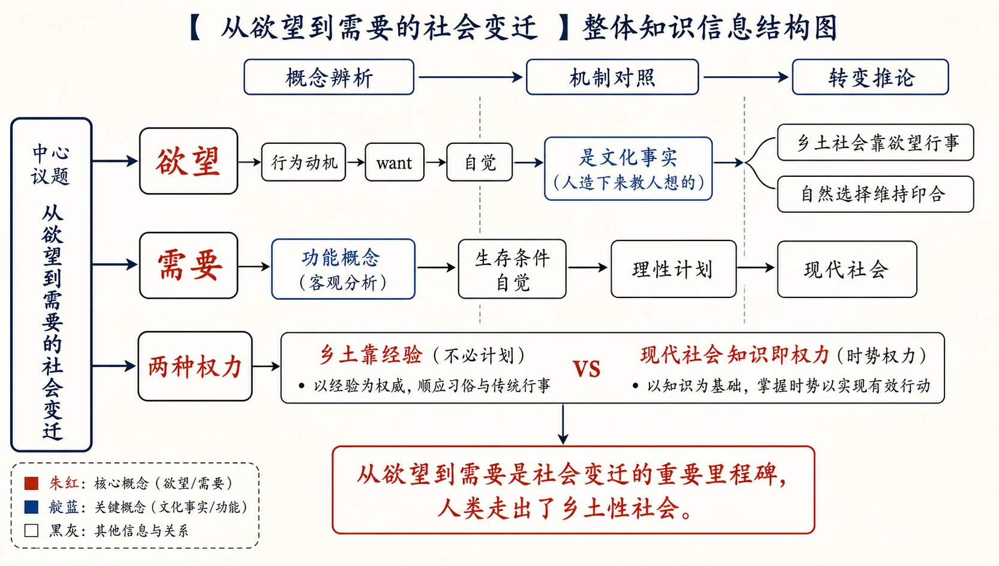
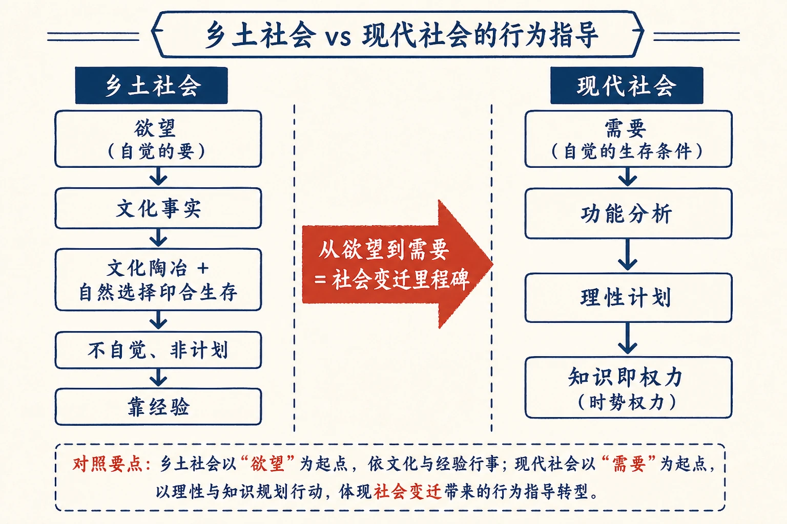
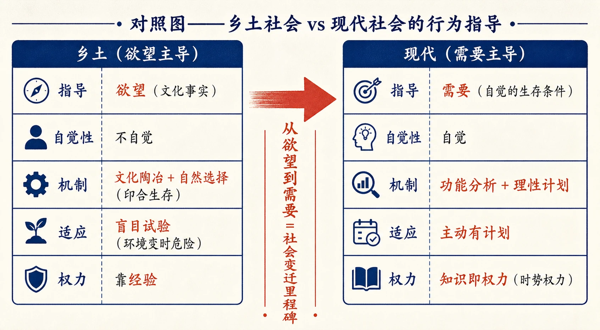
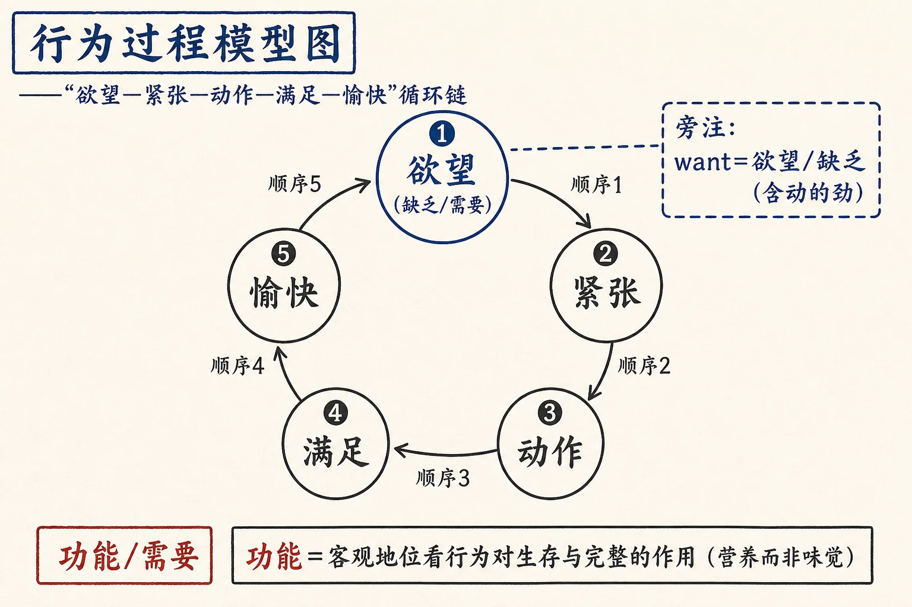

# 18 从欲望到需要

<!-- 图片描述：本节整体知识信息结构图，采用“概念辨析—机制对照—转变推论”论证链。中心议题为“从欲望到需要的社会变迁”。上分支“欲望”：行为动机—want—自觉—是文化事实（人造下来教人想的）—乡土社会靠欲望行事—自然选择维持印合；中分支“需要”：功能概念（客观分析）—生存条件自觉—理性计划—现代社会；下分支“两种权力”：乡土靠经验（不必计划）vs 现代社会知识即权力（时势权力）。底部结论“从欲望到需要是社会变迁的重要里程碑，人类走出了乡土性社会”。朱红标出“欲望/需要”核心概念，靛蓝标出“文化事实/功能”，米白纸面、黑灰线条、中文标注、留白充足，符合语文文本精读风格。 -->

## 知识关系导航

- 所属章节：[[章首 学习导图|《乡土中国》学习导图]]
- 前置知识点：[[17-名实的分离#三、课文原文与逐段/逐句解读|时势权力与社会变迁]]（本章由时势权力引出计划问题）
- 后续知识点：[[章首 学习导图|《乡土中国》学习导图]]（全书的收束与总结）
- 对比知识点：[[18-从欲望到需要#三、课文原文与逐段/逐句解读|欲望与需要]]（两种行为指导方式）
- 相关方法：[[16-血缘和地缘#三、课文原文与逐段/逐句解读|身份社会与契约社会]]（乡土与现代的对应）

本章是《乡土中国》最后一章（正文部分），把全书的社会变迁主题推进到观念层面：乡土社会靠欲望行事，现代社会发现“需要”并以理性计划。作者辨析“欲望”与“需要”，提出“欲望是文化事实”的著名判断，并指出“知识即权力”的现代意义。理解本章，须抓住“自觉/不自觉”“文化/自然”“经验/理性”的对照。

## 本节学习目标

- 理解“社会计划”是现代观念，标志人类走出乡土性社会。
- 辨析“欲望”与“需要”两个概念：定义、自觉性、机制。
- 理解“欲望是文化事实”的判断，说明乡土社会中个人欲望为何常合于生存条件。
- 理解“功能”概念的产生：从客观地位看行为对生存与社会完整的作用。
- 理解“知识即权力”与现代社会中时势权力、计划的关系。
- 能评价“从欲望到需要是社会变迁的重要里程碑”这一判断，联系当代生活谈启示。

## 核心知识点讲解

### 一、文本基本信息与学习任务

- **篇目**：《从欲望到需要》，选自费孝通《乡土中国》。
- **作者**：费孝通（1910—2005），中国社会学家、人类学家。
- **文体**：学术随笔／社会学论述文。本章概念辨析（欲望/需要、文化事实/功能）与理论对话（亚当·斯密、孙末楠）相结合。
- **学习任务**：理解“欲望/需要”概念与“欲望是文化事实”的判断；理解“功能”概念与理性计划；理解“知识即权力”；训练概念辨析、理论评价与迁移写作能力。

### 二、整体内容与结构线索

本文论证线索如下：

1. **提出问题**：由时势权力想到“社会计划”；发现社会可以计划=走出乡土性社会；乡土靠欲望，现代产生“需要”与“计划”。
2. **界定欲望**：人类行为有动机（意志+欲望）；欲望=取舍的根据，规定行为方向；欲望—紧张—动作—满足—愉快是人类行为过程。
3. **追问欲望与生存**：人依欲望行事，其行为是否利于个体发展与社会完整？远处看人类行为合于生存（生育、营养），近处问当事人却只谈“爱情”“好吃”——欲望是自觉的，与生存条件的关系是微妙的。
4. **提出“欲望是文化事实”**：乡土社会中个人欲望常合于生存条件，因为欲望不是生物事实而是文化事实（人造下来教人这样想的）；“自私”的打算法由社会教来。
5. **辨析文化事实的局限**：并非一切文化事实都合于生存条件（毒物、病从口入）；但不合于生存条件的文化与人都被自然淘汰。
6. **引孙末楠**：人类先有行为后有思想；思想保留经验；自觉的欲望是文化的命令；乡土社会靠传统（经自然选择留下的经验）行事。
7. **巫术例子**：乡土中许多行为实际满足不自觉的需要（驱鬼=驱恐惧）。
8. **印合的弊病**：不自觉的印合，环境变时只能盲目试验；乡土环境不常变，故可行；现代复杂社会反对计划经济有危险。
9. **“功能”概念**：社会变动快、文化不能满足时，人推究行为与目的关系；发现欲望不是最后动机；产生“功能”概念（客观地位看行为对生存与完整的作用）；生存条件自觉=需要；现代社会依需要计划，是理性/科学化时代。
10. **结论**：现代社会知识即权力（时势权力）；乡土社会靠经验，不必计划，各人依欲望行动即可。

### 三、课文原文与逐段/逐句解读

**【原文】**
> 提起了时势权力使我又想到关于社会变迁另一问题，也就是现在我们常常听到的社会计划，甚至社会工程等一套说法。很明显的，这套名字是现代的，不是乡土社会中所熟习的。这里其实包含着一个重要的变化，如果我们要明白时势权力和长老权力的差别，我们还得在这方面加以探讨。人类发现社会也可以计划，是一个重大的发现，也就是说人类已走出了乡土性的社会了。在乡土社会里是没有这想法的。在乡土社会中人可以靠欲望去行事，但在现代社会中欲望并不能作为人们行为的指导，于是产生“需要”，因之有了“计划”。从欲望到需要是社会变迁中一个很重要的里程碑，让我先把欲望和需要这两个概念区别一下。

**【解读】**
- **核心判断（名句）**：发现“社会也可以计划”=人类已走出乡土性社会；乡土靠欲望行事，现代产生“需要”与“计划”。
- **名句**：“从欲望到需要是社会变迁中一个很重要的里程碑。”

**【原文】**
> 观察人类行为，我们常可以看到人类并不是为行为而行为、为活动而活动的；行为或是活动都是手段，是有所为而为的。……总是有个“要”在领导自己的活动……于是我们说人类行为是有动机的。
> 说人类行为是有动机的包含着两个意思：一是人类对于自己的行为是可以控制的。要这样做就这样做，不要这样做就不这样做，也就是所谓意志。一是人类在取舍之间有所根据，这根据就是欲望。欲望规定了人类行为的方向，就是上面所说要这样要那样的“要”。这个“要”是先于行为的，要得了，也就是欲望满足了，我们会因之觉得愉快，欲望不满足，要而得不到，周身不舒服。在英文里欲望和要都是want，同时want也作缺乏解。缺乏不只是一种状态的描写，而是含有动的意思，这里有股劲，由不舒服而引起的劲，他推动了人类机体有所动作，这个劲也被称作“紧张状态”，表示这状态是不能持久，必须发泄的，发泄而成行为，获得满足。欲望——紧张——动作——满足——愉快，那是人类行为的过程。

**【解读】**
- **关键定义**：人类行为有动机=意志（可控制）+欲望（取舍根据）；欲望规定行为方向。
- **关键过程（名句）**：欲望—紧张—动作—满足—愉快，是人类行为的过程。
- **字源**：want=欲望/要，也作“缺乏”解——缺乏含“动”的劲，推动机体动作。

**【原文】**
> 欲望如果要能通过意志对行为有所控制，它必须是行为者所自觉的。自觉是说行为者知道自己要的是什么。在欲望一层上说这是不错的，可是这里却发生了一个问题，人类依着欲望而行为，他们的行为是否必然有利于个体的健全发展，和有利于社会间各个人的融洽配合，社会的完整和持续？这问题在这里提出来并不是想考虑性善性恶，而是从人类生存的事实上发生的。

**【解读】**
- **问题提出**：依欲望行事是否必然利于个体发展与社会完整？——这是本章要解答的核心问题（不涉性善性恶）。

**【原文】**
> 如果我们走出人类的范围，远远地站着，像看其他生物一般地看人类，我们可以看见人类有着相当久的历史了，他们做了很多事，这些事使人类能生存和绵续下去，好像个人的健全发展和社会的完整是他们的目的。但是逼近一看，拉了那些人问一问，他们却说出了很多和这些目的毫不相关的欲望来了。你在远处看男女相接近，生了孩子，男女合作，抚养孩子，这一套行为是社会完整所必需的……他们却对你说，“我们是为了爱情，我们不要孩子，孩子却来了。”……谁在找女朋友时想得着这种书本上的大问题？
> 同样的，你在远处看，每天人都在吃淀粉、脂肪，吃维他命A、维他命C……但是你去找一个不住在现代都市的乡下佬问他，为什么吃辣子、大蒜，他会回答你：“这才好吃，下饭的呀。”

**【解读】**
- **远看与近看**：远处看人类行为合于生存（生育、营养）；近处问当事人却只谈“爱情”“好吃”。
- **关键判断**：欲望是自觉的，直接决定行为的确实是这些欲望；欲望与生存条件的关系“微妙”——这正是“欲望是文化事实”的伏笔。

**【原文】**
> 欲望是什么呢？食色性也，那是深入生物基础的特性。这里似乎有一种巧妙的安排，为了种族绵续，人会有两性之爱；为了营养，人会有五味之好。因之，在十九世纪发生了一种理论说，每个人只要能“自私”，那就是充分地满足我们本性里带来的欲望，社会就会形成一个最好、最融洽的秩序。亚当·斯密说“冥冥中那只看不见的手”会安排个社会秩序给每个为自己打算的人们去好好生活的。
> 这种理论所根据的其实并非现代社会而是乡土社会，因为在乡土社会中，这种理论多少可以说是正确的，正确的原因并不是真是有个“冥冥中”的那只手，而是在乡土社会中个人的欲望常是合于人类生存条件的。两者所以合，那是因为欲望并非生物事实，而是文化事实。我说它是文化事实，意思是人造下来教人这样想的。譬如说，北方人有吃大蒜的欲望，并不是遗传的，而是从小养成的。所谓“自私”，为自己打算，怎样打算法却还是由社会上学来的。问题不是在要的本身，而是在要什么的内容。这内容是文化所决定的。

**【解读】**
- **理论对话**：亚当·斯密“看不见的手”——每个人“自私”即满足欲望，社会自会形成好秩序。
- **关键判断**：该理论“所根据的其实并非现代社会而是乡土社会”——乡土中个人欲望常合于生存条件。
- **核心概念（名句）**：欲望并非生物事实，而是文化事实——人造下来教人这样想的（吃大蒜的欲望是养成的；“自私”的打算法由社会教来）。问题不在“要”本身，而在“要什么的内容”，内容由文化决定。

**【原文】**
> 我说欲望是文化事实，这句话并没有保证说一切文化事实都是合于人类生存条件的。文化中有很多与人类生存条件无关甚至有害的。就是以吃一项来说，如果文化所允许我们入口的东西样样都是合于营养原则的，我们也不至于有所谓毒物一类的东西了。……人类如果和其他动植物有些不同的地方，最重要的，在我看来，就在人在生存之外找到了若干价值标准，所谓真善美之类。我也常喜欢以“人是生物中唯一能自杀的种类”来说明人之异于禽兽的“几希”。——但是，人类主观上尽管有比生存更重要的价值，文化尽管有一部分可以无关及无益于人类的生存，这些不合于生存条件的文化以及接受不合于生存条件的文化的人，却在时间里被淘汰了。……自然并不因她美而保留她，病的还是要死的，康健才是生存的条件。自然不禁止人自杀，但是没有力量可以使自杀了的还能存在。

**【解读】**
- **辩证**：并非一切文化事实都合于生存（毒物、病从口入）；人有超生存的价值（真善美），“人是唯一能自杀的物种”。
- **关键机制**：不合于生存条件的文化与人都“在时间里被淘汰了”——自然选择/淘汰是乡土社会欲望印合生存条件的最终保障。

**【原文】**
> 于是另外一种说法发生了。孙末楠在他的名著Folkways开章明义就说：人类先有行为，后有思想。决定行为的是从试验与错误的公式中累积出来的经验，思想只有保留这些经验的作用，自觉的欲望是文化的命令。
> 在一个乡土社会中，这也是正确的，那是因为乡土社会是个传统社会，传统就是经验的累积，能累积就是说经得起自然选择的，各种“错误”——不合于生存条件的行为——被淘汰之后留下的那一套生活方式。不论行为者对于这套方式怎样说法，它们必然是有助于生存的。

**【解读】**
- **引孙末楠**：人类先有行为后有思想；经验（试验与错误）决定行为；思想保留经验；自觉的欲望是文化的命令。
- **关键判断**：乡土社会=传统社会=经验的累积（经自然选择淘汰“错误”后留下的生活方式），必然有助于生存——不管理论上怎么说法。

**【原文】**
> 在这里更可以提到的是，在乡土社会中有很多行为我们自以为是用来达到某种欲望或目的；而在客观的检讨中，我们可以看到这些行为却在满足主观上并没有自觉的需要，而且行为和所说的目的之间毫无实在的关联。巫术是这种行为最明显的例子。譬如驱鬼，实际上却是驱除了心理上的恐惧。鬼有没有是不紧要的，恐惧却得驱除。

**【解读】**
- **关键例证**：巫术（驱鬼）——行为满足的是不自觉的需要（驱除恐惧）；“鬼有没有是不紧要的，恐惧却得驱除”。
- **学习提示**：巫术例子说明乡土行为“名实分离”于生存功能——这是“功能”概念出现的前奏。

**【原文】**
> 在乡土社会中欲望经了文化的陶冶可以作为行为的指导，结果是印合于生存的条件。但是这种印合并不是自觉的，并不是计划的，乡土文化中微妙的配搭可以说是天工，而非人力，虽则文化是人为的。这种不自觉的印合，有它的弊病，那就是如果环境变了，人并不能做主动的有计划的适应，只能如孙末楠所说的盲目地经过错误与试验的公式来找新的办法。乡土社会环境不很变，因之文化变迁的速率也慢，人们有时间可以从容地做盲目的试验，错误所引起的损失不会是致命的。……但是这时候要维持乡土社会中所养成的精神是有危险的了。出起乱子来，却非同小可了。

**【解读】**
- **关键判断**：乡土中欲望经文化陶冶而“印合”于生存条件，但印合“不是自觉的、不是计划的”（天工而非人力）。
- **弊病**：环境变时不能主动有计划适应，只能盲目试验；乡土环境不常变故可行；现代复杂社会若仍靠“看不见的手”则危险（出乱子非同小可）。

**【原文】**
> 社会变动得快，原来的文化并不能有效地带来生活上的满足时，人类不能不推求行为和目的之间的关系了。这时发现了欲望并不是最后的动机，而是为了达到生存条件所造下的动机。于是人开始注意到生存条件的本身了，——在社会学里产生了一个新的概念，“功能”。功能是从客观地位去看一项行为对于个人生存和社会完整上所发生的作用。功能并不一定是行为者所自觉的，而是分析的结果，是营养而不是味觉。这里我们把生存的条件变成了自觉，自觉的生存条件是“需要”，用以别于“欲望”。现代社会里的人开始为了营养选择他们的食料，这是理性的时代，理性是指人依了已知道的手段和目的的关系去计划他的行为，所以也可以说是科学化的。

**【解读】**
- **核心概念（名句）**：功能=从客观地位看一项行为对个人生存和社会完整所发生的作用；不一定自觉，是分析的结果（“是营养而不是味觉”）。
- **需要定义**：自觉的生存条件=“需要”，用以别于“欲望”。
- **理性时代**：现代人依手段-目的关系计划行为（为营养选食料）=理性、科学化。

**【原文】**
> 在现代社会里知识即是权力，因为在这种社会里生活的人要依他们的需要去做计划。从知识里得来的权力是我在上文中所称的时势权力；乡土社会是靠经验的，他们不必计划，因为时间过程中，自然替他们选择出一个足以依赖的传统的生活方案。各人依着欲望去活动就得了。

**【解读】**
- **总结性判断（名句）**：现代社会“知识即是权力”——依需要做计划；知识得来的权力=时势权力。
- **对照**：乡土社会靠经验，不必计划（自然替他们选择了传统生活方案），各人依欲望行动即可。
- **收束全书**：知识（需要、计划）与经验（欲望、传统）的分野，是全书“乡土vs现代”主题的总结。

### 四、关键语句、人物/意象与细节精读

- **“在乡土社会中人可以靠欲望去行事，但在现代社会中欲望并不能作为人们行为的指导，于是产生‘需要’，因之有了‘计划’。”**：本章立论基础。
- **“从欲望到需要是社会变迁中一个很重要的里程碑。”**：全章纲领句。
- **“欲望——紧张——动作——满足——愉快，那是人类行为的过程。”**：行为过程模型。
- **“欲望并非生物事实，而是文化事实。”**：本章最核心的判断。
- **“功能是从客观地位去看一项行为对于个人生存和社会完整上所发生的作用。”**：功能概念的定义。
- **“自觉的生存条件是‘需要’，用以别于‘欲望’。”**：需要/欲望的分界。
- **“在现代社会里知识即是权力。”**：全章总结句。
- **人物·亚当·斯密（Adam Smith）**：古典经济学创始人，“看不见的手”理论——其理论依据实为乡土社会。
- **人物·孙末楠（William Graham Sumner）**：美国社会学家、社会达尔文主义者，著《Folkways》，主张“人类先有行为，后有思想”。
- **意象·“看不见的手”**：自由秩序神话——乡土社会中“冥冥中”的安排实为文化陶冶+自然选择。
- **意象·巫术（驱鬼）**：行为满足不自觉需要的典型——驱鬼实为驱恐惧。
- **文化常识**：社会计划/社会工程、Folkways（《民俗论》/《民风》）、真善美价值、“人是唯一能自杀的物种”。

### 五、语言风格与表达手法

- **概念辨析**：欲望/需要、文化事实/功能、经验/理性，逐层辨析。
- **理论对话**：与亚当·斯密、孙末楠对话，引而有析。
- **远近视角**：远处看人类（合于生存）vs 近处问个人（爱情/好吃），视角转换揭示“微妙”。
- **辩证论述**：欲望合于生存但非一切文化事实合于生存；印合有利但有弊病。
- **层层推论**：欲望→文化事实→自然淘汰→功能→需要→计划→知识即权力。

### 六、主题思想、情感态度与文化理解

- **主题**：乡土社会靠欲望行事，欲望经文化陶冶而印合生存条件（不自知、靠自然选择维持）；现代社会发现“功能”，把生存条件变为自觉的“需要”，以理性计划行为，知识成为权力（时势权力）。从欲望到需要是社会变迁的重要里程碑。
- **情感态度**：作者对乡土社会的“天工配搭”有欣赏（微妙的印合），但冷静指出其弊病（环境变时不能主动适应）；对现代社会理性计划既肯定其进步（科学化），也警惕其风险；对“看不见的手”神话作去魅分析。
- **文化理解**：理解“欲望是文化事实”的深层含义（文化塑造需求内容）；理解“自然选择”在文化变迁中的作用；理解理性/科学化与现代社会的关联；理解“知识即权力”与《名实的分离》中时势权力的呼应。

### 七、阅读答题与写作迁移

- **答题模板（概念辨析）**：定义+自觉性差异+机制差异+例证。
- **答题模板（理论评价）**：概括理论→作者如何评价→作者立场。
- **答题模板（观点评价）**：还原观点→分析依据→辩证→联系现实。
- **写作迁移**：学习“远近视角”（宏观/微观）论证方法；学习用日常例子（吃大蒜、驱鬼）支撑抽象理论。

<!-- 图片描述：对照图——“乡土社会 vs 现代社会的行为指导”。左栏乡土：欲望（自觉的要）—文化事实—文化陶冶+自然选择印合生存—不自觉、非计划—靠经验；右栏现代：需要（自觉的生存条件）—功能分析—理性计划—知识即权力（时势权力）。中间朱红箭头标“从欲望到需要=社会变迁里程碑”。米白纸面、黑灰线条、中文标注。 -->

## 重点梳理

- **立论**：人类发现社会可以计划=走出乡土性社会；从欲望到需要是重要里程碑。
- **欲望**：行为动机（意志+欲望）；欲望—紧张—动作—满足—愉快；欲望是自觉的。
- **核心判断**：欲望并非生物事实，而是文化事实（人造下来教人这样想的）；问题在“要什么的内容”，由文化决定。
- **印合机制（自然选择与淘汰）**：乡土中欲望经文化陶冶印合生存条件，靠自然选择（淘汰不合生存的文化与人）维持；印合不自知、非计划（天工非人力）。
- **巫术例证**：驱鬼=驱恐惧——满足不自觉的需要。
- **功能概念**：从客观地位看行为对个人生存与社会完整的作用（营养而非味觉）；分析结果、不必自觉。
- **需要、理性与计划**：自觉的生存条件=需要；理性=依手段-目的关系计划行为（科学化）；现代社会依需要做计划。
- **总结**：现代社会知识即权力（时势权力）；乡土社会靠经验、不必计划。
- **必记名句**：“从欲望到需要是社会变迁中一个很重要的里程碑”“欲望并非生物事实，而是文化事实”“功能是从客观地位去看一项行为对于个人生存和社会完整上所发生的作用”“自觉的生存条件是‘需要’，用以别于‘欲望’”“在现代社会里知识即是权力”。
- **论证方法**：概念辨析、理论对话、远近视角、辩证论述、日常例证。

## 难点突破

<!-- 图片描述：对照图——“乡土社会 vs 现代社会的行为指导”。左右两栏：左栏“乡土（欲望主导）”：指导—欲望（文化事实）；自觉性—不自觉；机制—文化陶冶+自然选择（印合生存）；适应—盲目试验（环境变时危险）；权力—靠经验；右栏“现代（需要主导）”：指导—需要（自觉的生存条件）；自觉性—自觉；机制—功能分析+理性计划；适应—主动有计划；权力—知识即权力（时势权力）。中间朱红箭头标注“从欲望到需要=社会变迁里程碑”。米白纸面、黑灰线条、靛蓝辅助、中文标注。 -->

- **难点一：欲望既然是“主观要什么”，为什么说它是“文化事实”？**
  突破：欲望的直接内容是文化教给的——北方人吃大蒜的欲望是“从小养成的”；“自私”的打算法“由社会上学来”。故问题不在“要”本身（生物基础），而在“要什么的内容”（文化决定）。欲望=生物机制+文化内容，后者起决定作用，故称文化事实。
- **难点二：为什么乡土社会中个人欲望常合于生存条件？**
  突破：不是“冥冥中的手”，而是两个机制——①文化陶冶：文化把经得起自然选择的经验传给后代（吃辣下饭等欲望是文化塑造的）；②自然选择：不合于生存条件的文化与人都被时间淘汰。两机制叠加，使欲望内容印合生存条件，但当事人不自知。
- **难点三：“功能”与“欲望”是什么关系？**
  突破：欲望是主观自觉的“要”；功能是客观分析的行为作用（对生存与完整）——“是营养而不是味觉”。发现功能后，人把生存条件变为自觉的“需要”，用以指导行为（为营养选食料），取代不自知的欲望。
- **难点四：为什么“知识即权力”等于时势权力？**
  突破：现代社会依需要做计划，计划靠知识（手段-目的关系）；掌握知识并能组织计划的人获得支配权——这正是《名实的分离》中“文化英雄”与时势权力的现代形态。乡土社会靠经验，不必计划，故无此权力；知识权力是变迁/计划社会的特征。

<!-- 图片描述：行为过程模型图——“欲望—紧张—动作—满足—愉快”循环链，五节点环形排列，箭头标注顺序；旁注“want=欲望/缺乏（含动的劲）”；下方标注功能概念：“功能=客观地位看行为对生存与完整的作用（营养而非味觉）”。朱红标出“功能/需要”，靛蓝标出“欲望”。米白纸面、黑灰线条、中文标注。 -->

## 例题讲解

**例题1（概念辨析）** 辨析“欲望”与“需要”。
- **分析**：回扣定义段与“功能”段。
- **答案**：欲望=行为者在取舍之间的根据，是自觉的“要”（want），经文化陶冶规定行为方向；需要=自觉的生存条件，是“功能”分析的结果（从客观地位看行为对生存与完整的作用），用以别于欲望。区别：欲望以主观感受为据（味觉），需要以客观生存条件为据（营养）；乡土社会靠欲望行事，现代社会依需要计划。
- **反思**：辨析题要“各自定义+区别维度+社会对应”。

**例题2（理论评价）** 作者如何评价亚当·斯密“看不见的手”的理论？
- **分析**：定位“这种理论所根据的其实并非现代社会而是乡土社会”段。
- **答案**：作者认为该理论“所根据的其实并非现代社会而是乡土社会”——乡土中个人欲望常合于生存条件（文化陶冶+自然选择），故“自私即秩序”大体正确；但这不是“冥冥中的手”，而是文化事实的印合。在现代复杂社会中，若仍靠“看不见的手”（不自觉的印合）则危险，须以需要与计划取代欲望。
- **反思**：理论评价题要“概括理论+作者评价+作者依据”。

**例题3（例证分析）** 作者用“巫术驱鬼”说明什么？
- **分析**：定位“巫术是这种行为最明显的例子”段。
- **答案**：说明乡土社会中许多行为满足的是“主观上没有自觉的需要”——驱鬼实为驱除心理上的恐惧，“鬼有没有是不紧要的，恐惧却得驱除”。例证揭示：行为与所说目的之间可毫无实在关联，真正起作用的是不自觉的功能；这也为后文“功能”概念的出现作铺垫。
- **反思**：例证题要“内容+印证观点+论证价值”。

**例题4（观点评价）** “在现代社会里知识即是权力”，你如何理解这一判断？
- **分析**：还原“知识→计划→时势权力”的论证，再评价。
- **答案**：现代社会依需要做计划，计划须以知识（手段-目的关系）为基础，故掌握知识者获得支配权——这是时势权力在现代的形态（如专家、规划者）。评价：判断揭示了知识社会/计划社会的权力逻辑，也呼应“文化英雄”概念；但需注意知识权力也有异化风险（技术统治、忽视地方知识），乡土经验（文化事实）并非全无价值。
- **反思**：评价题要“还原→分析→辩证”。

## 易错点整理

- **概念混淆**：把“欲望”说成“非文化的”。避免：欲望是文化事实（内容由文化决定），不是纯生物本能。
- **“印合”误读**：说“欲望天然合于生存”。避免：印合靠文化陶冶+自然选择，且不是自觉的。
- **功能概念错**：把“功能”说成“行为者自觉的目的”。避免：功能是客观分析的结果（营养而非味觉），不一定自觉。
- **理论归属错**：把“看不见的手”说成“作者的主张”。避免：这是亚当·斯密的理论，作者评价它“所根据的是乡土社会”。
- **评价片面**：说“乡土社会落后、现代社会先进”。避免：作者既肯定理性的进步，也承认乡土印合的“天工”与乡土经验的价值；应从“适应环境”角度理解。

## 考点考证点整理

### 考点一：概念理解与辨析
- **出题思路**：辨析“欲望/需要”，解释“文化事实”“功能”。
- **关键条件**：回到定义句。
- **解答要点**：定义+区别维度+社会对应。
- **易扣分点**：混淆自觉/不自觉；漏“文化事实”的核心判断。

### 考点二：机制分析与因果推论
- **出题思路**：为什么乡土社会中欲望常合于生存条件？印合有何弊病？
- **关键条件**：抓住“文化陶冶+自然选择”与“环境变时盲目试验”。
- **解答要点**：机制链完整作答。
- **易扣分点**：只答“自然选择”漏“文化陶冶”；漏“印合不自知”的弊病。

### 考点三：理论评价（亚当·斯密、孙末楠）
- **出题思路**：作者如何评价“看不见的手”？孙末楠“先有行为后有思想”对理解乡土社会有何意义？
- **关键条件**：概括理论+作者评价+依据。
- **解答要点**：理论内容+作者判断+论证作用。
- **易扣分点**：只复述理论；不分清“作者观点”与“引用的理论”。

### 考点四：例证与材料分析
- **出题思路**：分析“吃大蒜”“驱鬼”“为营养选食料”等例证的作用。
- **关键条件**：明确各例为哪个观点服务。
- **解答要点**：内容+印证观点+论证价值。
- **易扣分点**：只讲故事不分析；例证与观点错配。

### 考点五：观点评价与现实意义
- **出题思路**：评析“从欲望到需要是重要里程碑”，或谈“知识即权力”的当代启示。
- **关键条件**：兼顾进步与代价、乡土与现代。
- **解答要点**：还原观点→分析依据→辩证→联系现实。
- **易扣分点**：只褒理性或只褒乡土；不扣“文化事实/功能”概念。

## 练习题

> 说明：本章源文（费孝通《乡土中国·从欲望到需要》）未附课后练习题，以下题目根据本章核心考点自拟，用于巩固整本书阅读与论述类文本阅读能力。

**一、基础理解（自拟）**
1. 根据原文，写出“欲望”与“需要”的定义，并说明二者的区别。
2. 为什么说“欲望并非生物事实，而是文化事实”？

**二、文本分析（自拟）**
3. 为什么乡土社会中个人的欲望常合于人类生存条件？请说明其机制。
4. 作者如何用“巫术驱鬼”说明乡土社会中行为与目的的关系？

**三、鉴赏评价（自拟）**
5. 作者怎样评价亚当·斯密“看不见的手”的理论？这一评价对理解“从欲望到需要”有何意义？
6. 分析“功能”概念的产生及其意义。

**四、迁移写作（自拟）**
7. 结合《从欲望到需要》，谈谈现代社会“计划”与“理性”在你生活中的体现，以及可能存在的问题（不少于 200 字）。

## 练习题答案

**1.** 欲望=人类在取舍之间的根据，是自觉的“要”（want），规定行为方向；需要=自觉的生存条件，是“功能”分析的结果（从客观地位看行为对个人生存与社会完整的作用），用以别于欲望。区别：欲望以主观感受为据（味觉），需要以客观生存条件为据（营养）；乡土社会靠欲望行事，现代社会依需要计划。
> 要点：两个定义+区别维度。

**2.** 因为欲望的直接内容由文化教给：北方人吃大蒜的欲望是“从小养成的”，不是遗传；“自私”的打算法“由社会上学来”。问题不在“要”的本身（生物基础），而在“要什么的内容”，内容由文化决定。故欲望是文化事实，不是单纯的生物事实。
> 评分：须答出“内容由文化决定”及两个例证。

**3.** 机制有二：①文化陶冶——乡土文化把经自然选择留下的经验传给后代，塑造合于生存的欲望内容（如吃辣下饭）；②自然选择——不合于生存条件的文化与人都被时间淘汰，留下的“那一套生活方式必然有助于生存”。两机制使欲望内容印合生存条件，但当事人不自知（“天工而非人力”）。
> 评分：文化陶冶+自然选择都答。

**4.** 说明乡土社会中许多行为满足的是主观上没有自觉的需要：驱鬼实为驱除心理上的恐惧，“鬼有没有是不紧要的，恐惧却得驱除”。即行为与所说目的之间可毫无实在关联，真正起作用的是不自觉的功能——这为后文“功能”概念的出现作铺垫。
> 评分：例子内容+印证“行为与目的无实在关联”。

**5.** 评价：作者认为“看不见的手”理论“所根据的其实并非现代社会而是乡土社会”——乡土中欲望经文化陶冶印合生存条件（非“冥冥中的手”），故“自私即秩序”大体正确；但现代社会复杂，若仍靠不自觉的印合则危险。意义：说明“欲望指导”只适用于乡土，现代社会须以“需要”与“计划”取代“欲望”，从而论证“从欲望到需要”的必要性。
> 评分：评价内容+对论证的意义。

**6.** 功能=从客观地位看一项行为对个人生存与社会完整所发生的作用，是分析的结果，不一定自觉（“是营养而不是味觉”）。意义：功能概念把生存条件变为自觉的“需要”，使人类能依手段-目的关系理性计划行为，标志着从“不自知的印合”走向“自觉的适应”，是理性/科学化时代的理论基础，也是“从欲望到需要”的关键环节。
> 评分：定义+意义（自觉化、理性化）。

**7.** （写作评分要点）能运用“欲望/需要、经验/理性”框架即可：体现——学习与消费依计划（选专业、记账、健康饮食按营养搭配）、社会治理讲规划（大数据、公共政策）；问题——计划依赖知识与数据，可能忽视乡土经验与个体差异（技术统治、过度干预），且“理性”也可能异化为盲目跟风。协调：在需要与计划的基础上尊重合理的“欲望”与传统智慧。要求结合实例，逻辑清晰，不少于 200 字。
