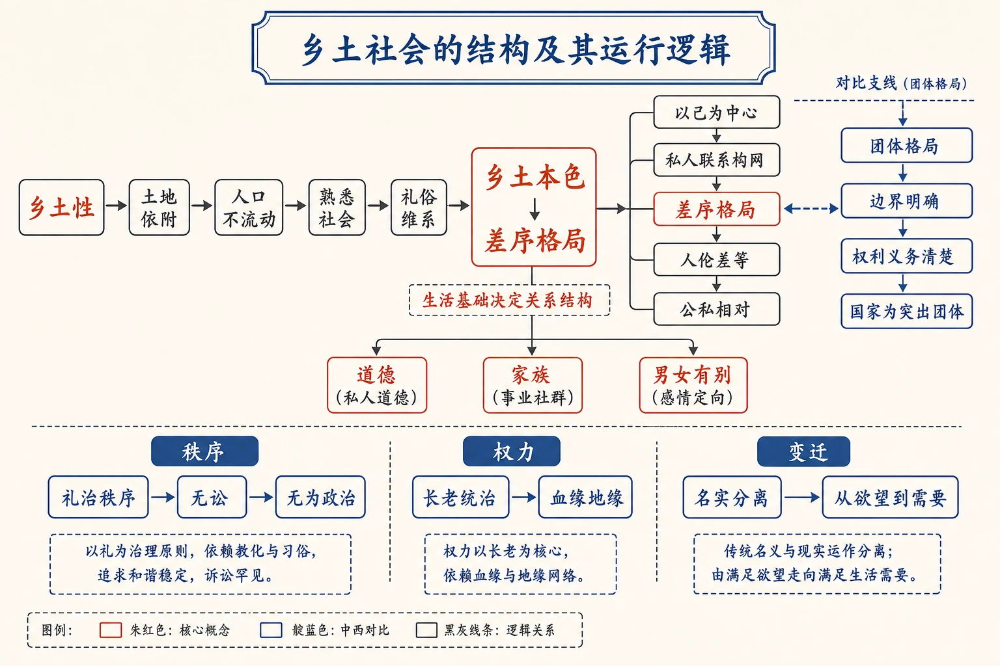

# 《乡土中国》学习导图

<!-- 图片描述：章节整体知识结构图。以“乡土社会的结构及其运行逻辑”为中心，左侧起点为“乡土性”，依次连接“土地依附—人口不流动—熟悉社会—礼俗维系”；右侧由“熟悉社会”递进到“以己为中心—私人联系构网—差序格局—人伦差等—公私相对”，并以对比支线呈现“团体格局—边界明确—权利义务清楚—国家为突出团体”。中部由差序格局延伸出“道德（私人道德）、家族（事业社群）、男女有别（感情定向）”分支；下部按“秩序—权力—变迁”展开：礼治秩序—无讼—无为政治—长老统治—血缘地缘—名实分离—从欲望到需要。在“乡土本色→差序格局”箭头上标注“生活基础决定关系结构”，用朱红突出核心概念、靛蓝标出中西对比，米白纸面、黑灰线条、中文标注、留白充足，符合语文文本精读风格。 -->

## 阅读入口

- [[05-乡土本色|05 乡土本色]]：从土地、定居和熟悉关系出发，说明中国基层社会为什么具有“乡土性”，提出“礼俗社会/法理社会”的总纲。
- [[06-文字下乡|06 文字下乡]]：从空间格局（面对面的社群）论证乡下人不识字是“知识问题不是智力问题”，乡土社会无需文字。
- [[07-再论文字下乡|07 再论文字下乡]]：从时间阻隔（今昔之隔、世代之隔）论证乡土社会“有语言而无文字”，辨析学习、记忆、象征体系与文化。
- [[08-差序格局|08 差序格局]]：从“私”的社会现象切入，说明传统社会关系如何以“己”为中心、按亲疏远近一圈圈推出。
- [[09-维系着私人的道德|09 维系着私人的道德]]：由差序格局推出中国道德体系的特点——以“己”为中心、孝悌忠信为私人要素，“仁”只是其共相。
- [[10-家族|10 家族]]：用“小家族”概念说明乡土社会基本社群的结构——单系扩大、绵续性的事业社群，主轴在父子婆媳（纵）。
- [[11-男女有别|11 男女有别]]：用阿波罗式/浮士德式文化模式解释乡土社会“求稳定→男女有别→感情偏于同性”的感情定向。
- [[12-礼治秩序|12 礼治秩序]]：说明乡土社会秩序的维持靠“礼”——靠传统维持、从教化养成、人主动服膺。
- [[13-无讼|13 无讼]]：从纠纷解决看礼治秩序——教化与调解代替折狱，并分析“司法下乡”破坏礼治而未建法治的困境。
- [[14-无为政治|14 无为政治]]：区分横暴权力与同意权力，以经济剩余与分工解释乡土社会“名义专制、实际无为”的权力结构。
- [[15-长老统治|15 长老统治]]：提出第三种权力——教化权力（长老统治），发生于社会继替，既非横暴又非同意。
- [[16-血缘和地缘|16 血缘和地缘]]：说明血缘是身份社会的基础、地缘是契约社会的基础；商业在血缘之外发展，从血缘到地缘是社会性质的大转变。
- [[17-名实的分离|17 名实的分离]]：区分社会继替与社会变迁，提出第四种权力——时势权力，分析“注释”机制导致的名实分离。
- [[18-从欲望到需要|18 从欲望到需要]]：辨析欲望与需要，提出“欲望是文化事实”，现代社会以“功能”与理性计划取代欲望，知识即权力。

## 知识主线

### 一、生活基础：乡土性

[[05-乡土本色#二、整体内容与结构线索|乡土性的论证链条]]从“土”开始：农业依赖土地，使人口不轻易流动；长期定居和聚村而居形成地方性，也使人与人经过反复接触成为“熟人”。因此，乡土社会更依赖内化的礼俗和经验，而不是面向陌生人的契约与法律。[[06-文字下乡#三、课文原文与逐段/逐句解读|文字下乡]]从空间格局说明：面对面的社群直接接触，无需文字，不识字是知识问题而非智力问题。[[07-再论文字下乡#三、课文原文与逐段/逐句解读|再论文字下乡]]从时间维度补充：乡土社会经验“无需累积，只需保存”，口口相传即可，故“有语言而无文字”。

### 二、关系结构：差序格局

[[08-差序格局#知识点一：团体格局与差序格局|差序格局]]承接“熟悉社会”的人际基础。传统社会中的亲属、街坊和交情并非边界固定的团体，而是以个人为中心、按关系亲疏和势力厚薄伸缩的网络。水波纹比喻把这种结构的三个要点变得可见：

1. 每个人都是自己关系网络的中心；
2. 关系由近及远，越推越薄；
3. 圈子会随时间、地点、身份和势力变化。

### 三、价值秩序：人伦、道德与私人关系

差序格局生成“伦”的差等次序和“推己及人”的道德路径。因为群己界线随圈层改变，所以“公”和“私”具有相对性。[[09-维系着私人的道德#三、课文原文与逐段/逐句解读|维系着私人的道德]]指出：道德要素附着在每一条私人联系上（孝悌忠信），没有一个超乎私人关系的统一道德，“仁”只是其共相。

### 四、基本社群：家族与感情安排

[[10-家族#三、课文原文与逐段/逐句解读|家族]]把差序格局落到基本社群：中国“家”是单系扩大、绵续性的事业社群，主轴在父子婆媳（纵），夫妇只是配轴；事业求效率→讲纪律→排斥私情。[[11-男女有别#三、课文原文与逐段/逐句解读|男女有别]]进一步说明：乡土社会为求稳定取阿波罗式，实行男女有别，感情定向偏于同性，家族因此取代家庭成为基本社群。

### 五、秩序维持：礼治、无讼与权力

- [[12-礼治秩序#三、课文原文与逐段/逐句解读|礼治秩序]]：乡土社会是“礼治”社会——礼靠传统维持、从教化中养成敬畏、人主动服膺；礼治以“传统能有效应付生活问题”为前提。
- [[13-无讼#三、课文原文与逐段/逐句解读|无讼]]：礼治社会的纠纷处理靠教化与调解而非诉讼；司法下乡因与乡土伦理冲突，破坏礼治而未建立法治。
- [[14-无为政治#三、课文原文与逐段/逐句解读|无为政治]]：横暴权力（冲突）受剩余限制、同意权力（合作）受分工限制，故乡土权力结构“名义专制、实际无为”。
- [[15-长老统治#三、课文原文与逐段/逐句解读|长老统治]]：第三种权力——教化权力发生于社会继替，既非横暴又非同意，是“长老统治”。

### 六、变迁分析：血缘地缘、名实与时势权力

- [[16-血缘和地缘#三、课文原文与逐段/逐句解读|血缘和地缘]]：血缘是身份社会的基础，地缘是契约社会的基础；商业在血缘之外发展，从血缘到地缘是社会性质的大转变。
- [[17-名实的分离#三、课文原文与逐段/逐句解读|名实的分离]]：社会继替（人物流动）与社会变迁（结构变动）并存；变迁中出现时势权力（文化英雄）；长老权力下“反对”被冲淡成“注释”，导致名实分离。
- [[18-从欲望到需要#三、课文原文与逐段/逐句解读|从欲望到需要]]：乡土社会靠欲望行事（欲望是文化事实），现代社会发现“功能”、以需要与理性计划行为，知识即权力（时势权力）。

## 核心概念关系

| 概念 | 核心内涵 | 与其他概念的关系 |
| --- | --- | --- |
| 乡土性 | 依赖土地、人口不流动、地方性强 | 形成熟悉社会的生活基础 |
| 熟悉社会 | 人际关系在长期反复接触中生成 | 为礼俗秩序和私人联系提供条件 |
| 差序格局 | 以“己”为中心、由近及远、可伸缩的关系网络 | 解释人伦差等、私人道德与公私相对性 |
| 团体格局 | 团体边界清楚，成员资格及权利义务明确 | 与差序格局形成结构性对照 |
| 小家族 | 单系扩大、绵续性的事业社群，主轴纵 | 差序格局在基本社群上的落实 |
| 礼治秩序 | 礼靠传统维持、人主动服膺 | 由熟悉社会与差序格局推出 |
| 教化权力 | 发生于社会继替的“爸爸式”权力 | 礼治秩序的权力面向（长老统治） |
| 时势权力 | 发生于社会变迁、以文化英雄为载体的权力 | 现代“知识即权力”的对应物 |
| 名实分离 | 形式维持、内容经“注释”改变 | 长老权力下社会变迁的变形方式 |
| 欲望与需要 | 欲望是文化事实；需要是自觉的生存条件 | 从乡土到现代的变迁里程碑 |

## 阅读方法

- 先抓作者提出的社会现象，再追问其背后的结构原因。
- 留意“捆柴”“水波纹”“蜘蛛网”“逆旅”“生活谱”等比喻，它们不是装饰，而是概念模型。
- 比较概念时按“边界、中心、成员关系、伸缩性、权利义务”五个维度作答（如差序格局vs团体格局）。
- 分析引用儒家经典的作用时，要说明它如何证明“以己为中心、向外推展、亲疏有别”的关系结构。
- 全书由“生活基础→关系结构→道德与社群→秩序与权力→变迁”逐层推进，阅读时注意每章承接上章的“引子”。

## 复习路径

先读[[05-乡土本色|《乡土本色》]]，理解“熟悉社会”从何而来；再读[[06-文字下乡|《文字下乡》]]与[[07-再论文字下乡|《再论文字下乡》]]，理解面对面社群与时间阻隔下为何无需文字；随后读[[08-差序格局|《差序格局》]]，理解熟悉社会中的关系如何组织；沿“道德（09）—家族（10）—男女有别（11）”读社群，沿“礼治（12）—无讼（13）—无为政治（14）—长老统治（15）”读秩序与权力，最后沿“血缘地缘（16）—名实分离（17）—从欲望到需要（18）”读变迁，把“生活基础—关系结构—秩序权力—社会变迁”连成完整解释链。
