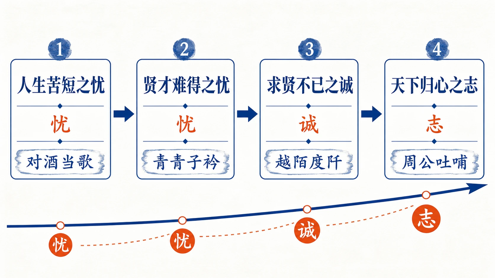
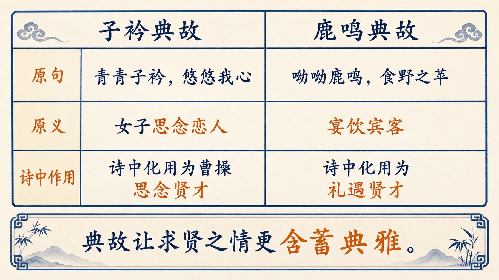
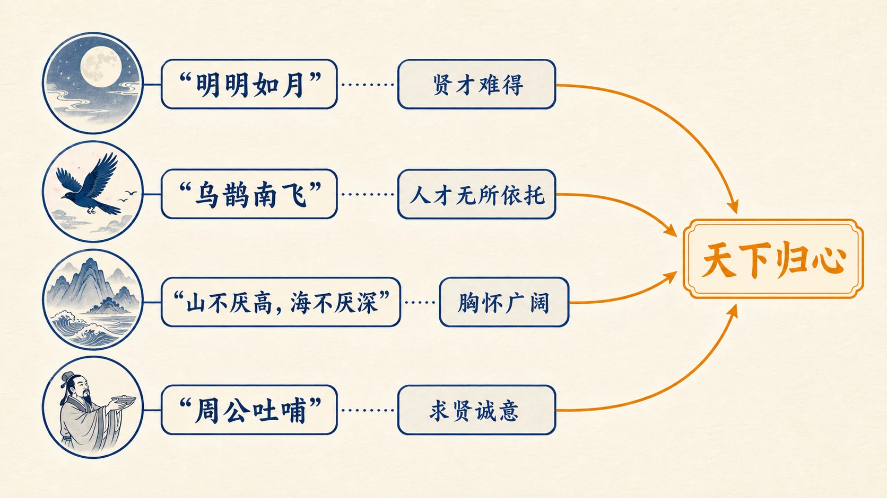
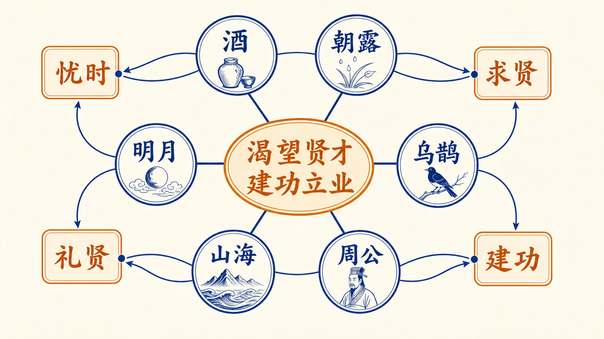

# 01 短歌行


<!-- 图片描述：本节整体知识信息结构图。展示《短歌行》的四大学习板块：左侧为诗歌基本信息（作者曹操、建安文学、四言古诗体裁、乐府旧题）；中部为诗歌四层情感结构（人生苦短之忧→求贤若渴之思→既得之忧欢→天下归心之志），箭头串联四层表示情感递进；右侧为三大艺术手法（比兴、用典、设问/比喻），每项下列具体诗句示例；底部为考试考点（典故识别、意象分析、情感把握、手法鉴赏）。使用米白纸面背景、黑灰主线条、朱红标重点词汇、靛蓝标情感线索。版式克制、留白充足。 -->

## 本节学习目标

1. 了解曹操的生平经历与建安文学的时代背景，掌握「知人论世」的鉴赏方法。
2. 诵读并背诵全诗，体会四言古诗的节奏韵律与慷慨沉雄的语言风格。
3. 梳理诗歌的情感脉络，理解从「忧思」到「归心」的情感发展过程。
4. 辨识诗中运用的比兴手法与典故出处（《诗经》《管子》《史记》），理解化用典故的表达效果。
5. 把握诗人求贤若渴、渴望建功立业的志向，感受建安风骨的慷慨悲凉之美。
6. 能够运用「手法 + 内容 + 情感/效果」的答题模板鉴赏诗歌语言。

## 核心知识点讲解

### 一、文本基本信息与学习任务

**作者**：曹操（155—220），字孟德，沛国谯县（今安徽亳州）人。东汉末年杰出的政治家、军事家、文学家。他在政治上「挟天子以令诸侯」，统一北方；在文学上是建安文学的代表人物，「三曹」（曹操、曹丕、曹植）之首。他的诗歌继承汉乐府传统，语言质朴沉雄，风格慷慨悲凉，代表作有《短歌行》《观沧海》《龟虽寿》《蒿里行》等。

**文体**：四言古诗，乐府旧题。《短歌行》是汉乐府《相和歌·平调曲》的旧题，「行」为古诗的一种体裁。全诗三十二句，每四句为一解（乐府诗的结构单位）。

**创作背景**：此诗约作于建安十三年（208）赤壁之战前后，或更早的求贤时期。曹操为实现统一天下的政治抱负，广招天下贤才。诗中集中表达了对人才的渴望和对建功立业的追求。

**学习任务**：本诗是高考必背篇目，学习时要重点掌握典故的出处与化用手法、比兴的表达效果，以及诗歌情感的多层递进结构。单元学习任务要求以「比兴手法和典故表述心志」为切入点，写文学短评。

### 二、整体内容与结构线索

《短歌行》以「忧思」为情感起点，以「天下归心」为情感终点，形成由低沉到高昂的情感抛物线。全诗可依情感起伏分为四层：

| 层次 | 诗句范围 | 核心情感 | 关键意象/典故 |
|------|----------|----------|---------------|
| 第一层 | 对酒当歌…唯有杜康 | 人生苦短之忧 | 朝露、杜康 |
| 第二层 | 青青子衿…鼓瑟吹笙 | 求贤若渴之思 | 子衿、鹿鸣（《诗经》） |
| 第三层 | 明明如月…心念旧恩 | 求贤不得之忧与既得之欢 | 明月、阡陌 |
| 第四层 | 月明星稀…天下归心 | 纳贤建功之志 | 乌鹊、周公（《史记》） |

情感脉络：**人生之忧 → 求贤之切 → 忧喜交织 → 壮志豪情**。


<!-- 图片描述：诗歌四层情感结构流程图。竖向排列四个圆角矩形，从上到下依次为「第一层：人生苦短之忧」「第二层：求贤若渴之思」「第三层：忧喜交织」「第四层：天下归心之志」。矩形之间用向下箭头连接，箭头旁标注情感变化关键词（「转」「深」「升」）。每层矩形右侧用小字标注代表性诗句。第四层矩形用朱红色边框强调情感顶点。整体使用米白纸面、黑灰线条、朱红/靛蓝标注。 -->

### 三、课文原文与逐层解读

> **第一层：人生苦短之忧**

**原文：**
> 对酒当歌，人生几何！譬如朝露，去日苦多。
> 慨当以慷，忧思难忘。何以解忧？唯有杜康。

**解读：**

- **「对酒当歌，人生几何」**：开篇以设问直抒胸臆。面对美酒与歌舞，诗人却发出人生短暂的慨叹。这本是宴饮欢歌的场合，诗人却生出悲凉之感，形成强烈的反差，奠定了全诗慷慨悲凉的情感基调。
- **「譬如朝露，去日苦多」**：运用比兴手法，以「朝露」比喻人生的短暂易逝——露水日出即干，人生亦如朝露般匆匆。「去日苦多」中的「苦」字极有分量，表达了对逝去时光的痛惜，而非简单的感伤。
- **「慨当以慷，忧思难忘」**：歌声激昂慷慨，但内心的忧思始终挥之不去。「慨当以慷」即「慷慨」，指歌声激越不平，与内心的「忧思」形成张力。
- **「何以解忧？唯有杜康」**：以设问引出「杜康」（酒的代称），表面说借酒消愁，实则暗示酒不能真正消解忧思——诗人的「忧」并非个人哀愁，而是功业未竟的深沉之虑。

> **第二层：求贤若渴之思**

**原文：**
> 青青子衿，悠悠我心。但为君故，沉吟至今。
> 呦呦鹿鸣，食野之苹。我有嘉宾，鼓瑟吹笙。

**解读：**

- **「青青子衿，悠悠我心」**：直接化用《诗经·郑风·子衿》成句。原诗写女子思念情人，曹操借用来表达对贤才的深切思慕。「青青子衿」是周代读书人的青色衣领，代指贤才；「悠悠」形容思虑悠长不断。这种将情诗转化为求贤诗的化用手法，赋予典故全新的政治含义。
- **「但为君故，沉吟至今」**：「君」指贤才，「沉吟」指深情地沉思吟味。直接道明因为渴慕贤才，才如此念念不忘。口吻诚恳真挚，如对故人倾诉。
- **「呦呦鹿鸣，食野之苹。我有嘉宾，鼓瑟吹笙」**：完整引用《诗经·小雅·鹿鸣》首章。《鹿鸣》本是宴饮嘉宾的乐歌，曹操借此表达：若贤才来归，必将以礼相待，鼓瑟吹笙，盛情款待。从「思贤」到「待贤」，情感自然推进。
- 这两处《诗经》典故的连用，前引《子衿》表思念之切，后引《鹿鸣》表礼遇之诚，一思一行，相得益彰。


<!-- 图片描述：《诗经》两处典故对照表。左栏列出「青青子衿，悠悠我心」（出处《诗经·郑风·子衿》），右栏列出「呦呦鹿鸣…鼓瑟吹笙」（出处《诗经·小雅·鹿鸣》）。每栏下设三行：原诗含义（爱情/宴饮）、曹操借用含义（思慕贤才/礼遇贤才）、表达效果（化用贴切，赋予新意）。底部用靛蓝箭头串联两栏，标注「思贤→待贤」的情感推进。 -->

> **第三层：求贤不得之忧与既得之欢**

**原文：**
> 明明如月，何时可掇？忧从中来，不可断绝。
> 越陌度阡，枉用相存。契阔谈讌，心念旧恩。

**解读：**

- **「明明如月，何时可掇」**：以明月比喻贤才之高洁难求。「掇」意为摘取，明月可望而不可掇，正如贤才难得。这一比喻承上启下，将求贤的渴望推向更深的焦虑。
- **「忧从中来，不可断绝」**：「中」指内心。求贤不得的忧虑从心中涌出，绵延不断。这与开头的「忧思难忘」遥相呼应，但此时的「忧」已从人生之忧深化为求贤之忧，情感更加具体。
- **「越陌度阡，枉用相存」**：「陌」为东西向田间小路，「阡」为南北向。意谓贤才不辞辛劳，穿过纵横小路屈驾来访。「枉」为敬辞，表达对贤才的尊重。「存」意为问候探望。
- **「契阔谈讌，心念旧恩」**：「契阔」指久别重逢。久别的故人欢饮畅谈，心中感念旧日的情谊。这四句从忧思陡转为欢欣，写出贤才既来之喜，情感跌宕起伏。

> **第四层：天下归心之志**

**原文：**
> 月明星稀，乌鹊南飞。绕树三匝，何枝可依？
> 山不厌高，海不厌深。周公吐哺，天下归心。

**解读：**

- **「月明星稀，乌鹊南飞。绕树三匝，何枝可依」**：这是全诗最富画面感的比兴。月明之夜，乌鹊南飞，绕树盘旋找不到栖身之枝。以「乌鹊择木」比喻贤才择主——天下大乱，贤才彷徨不知所归。暗含的意思是：来吧，我这里就是你们可以依靠的「枝」。这一比喻委婉而有力，既是呼唤，又是承诺。
- **「山不厌高，海不厌深」**：化用《管子·形势解》「海不辞水，故能成其大；山不辞土石，故能成其高；明主不厌人，故能成其众」。以山海不嫌高深比喻明主广纳贤才的胸怀。「厌」意为满足。
- **「周公吐哺，天下归心」**：用《史记·鲁周公世家》典故。周公（姬旦）辅佐成王，礼贤下士，吃饭时若有士人来访，便吐出食物急忙接见，一顿饭曾「三吐哺」。曹操以周公自比，表明自己将如周公般殷勤待士，实现「天下归心」的政治理想。
- 结尾两句是全诗情感的顶点：从开篇的「人生几何」之悲，一路上升到「天下归心」之壮，完成了由沉郁到昂扬的情感飞跃。


<!-- 图片描述：第四层核心意象与典故关系图。中心为「天下归心」，向外放射四条连线，分别连接四个意象/典故圈：「乌鹊南飞」（比喻贤才择主，标注：委婉召唤）、「山不厌高」（化用《管子》，标注：胸怀气度）、「海不厌深」（同上，标注：人才积累）、「周公吐哺」（用典《史记》，标注：以周公自比）。每个圈内标注出处、原意、诗中含义。底部用朱红大字标「情感顶点」。 -->

### 四、关键语句、意象与典故精读

**1.「忧」字的三重内涵**

全诗「忧」字反复出现，构成情感主轴。但三处「忧」的内涵各有侧重：

| 位置 | 诗句 | 忧的内涵 | 层次 |
|------|------|----------|------|
| 开头 | 忧思难忘 | 人生苦短、功业未竟之忧 | 个体生命层面 |
| 中间 | 忧从中来 | 求贤不得之忧 | 政治抱负层面 |
| 整体 | — | 时不我待、壮志未酬的深沉忧思 | 统一层面 |

从个人之忧到天下之忧，情感逐步升华，「忧」是通向「志」的情感动力。

**2. 化用典故的艺术手法**

曹操引用典故不是简单的搬运，而是创造性转化：

- **《子衿》原写男女相思 → 化为求贤若渴**：赋予儿女私情以宏大的政治内涵，思贤之情因源自《诗经》而显得典雅深沉。
- **《鹿鸣》原写宴饮嘉宾 → 化为礼遇贤才之诺**：不是空谈渴望，而是用「鼓瑟吹笙」的画面给出具体承诺。
- **《管子》原论治国 → 化为纳贤胸怀**：将治国大道理凝练为「山不厌高，海不厌深」的形象表达。
- **周公吐哺 → 以周公自比**：既宣示了政治理想，又表达了谦恭待士的姿态，含蓄而有力。

**3. 核心意象解读**

| 意象 | 含义 | 手法 |
|------|------|------|
| 朝露 | 人生短暂易逝 | 比兴 |
| 杜康 | 借酒消愁（酒不能真解忧） | 借代 |
| 明月 | 贤才高洁而难求 | 比喻 |
| 乌鹊 | 彷徨无依的贤才 | 比兴 |
| 山海 | 明主广纳贤才的胸怀 | 比喻/用典 |
| 周公 | 以古贤自比的理想人格 | 用典 |


<!-- 图片描述：全诗意象关系网图。中心写「忧 → 志」的情感主线。左侧列出第一、二层的意象（朝露→人生短暂、杜康→借酒消愁、子衿→思慕贤才、鹿鸣→礼遇嘉宾），右侧列出第三、四层的意象（明月→贤才难求、乌鹊→贤才择主、山海→纳贤胸怀、周公→理想人格）。左右两侧之间用水平虚线连接表示情感发展的对应关系。用朱红色标注「忧」，靛蓝色标注「志」。 -->

### 五、语言风格与表达手法

**（1）四言句式，古朴有力**

全诗以四言为主，句式整饬而有力。四言相比五言、七言更加质朴简练，契合曹操「古直悲凉」的语言风格。同时，诗中也灵活嵌入了五言句式（「唯有杜康」「何时可掇」等），使节奏在整齐中有变化。

**（2）比兴手法的运用**

- 「譬如朝露」——以朝露易晞兴起人生短暂
- 「明明如月」——以明月难掇兴起贤才难得
- 「月明星稀，乌鹊南飞」——以乌鹊择木兴起贤才择主

比兴使抽象的情感变得具体可感，且符合《诗经》以来的诗歌传统。

**（3）设问与反问**

- 「人生几何？」「何以解忧？」「何时可掇？」「何枝可依？」

连续设问形成跌宕起伏的节奏感，既表达内心的焦虑，又引导读者的思考。从自问自答到不言自明，设问的力度逐步增强。

**（4）语言风格总结：慷慨悲凉**

曹操诗歌被钟嵘《诗品》评为「曹公古直，甚有悲凉之句」。「古直」体现在语言的质朴无华、不事雕琢；「悲凉」体现在情感的真挚深沉——不是无病呻吟，而是功业未竟者的真实慨叹。


<!-- 图片描述：表达手法分类图。三栏并列，依次为「比兴」「用典」「设问」。比兴栏列出「朝露」「明月」「乌鹊」三例，每例标注「喻体→本体」的对应关系；用典栏列出四处典故及出处，《子衿》《鹿鸣》《管子》《史记》，注明转化方向；设问栏列出四句设问，用箭头标注情感递进关系。底部统一标注「共同效果：慷慨悲凉」。 -->

### 六、主题思想、情感态度与文化理解

**主题思想**：诗人通过对酒当歌的宴会场景，抒发了人生苦短、时不我待的深沉忧思，表达了求贤若渴、广纳人才的迫切愿望，最终归结为以周公为榜样、实现天下归心的宏伟志向。

**情感的多层递进**：

```
人生苦短 → 借酒消忧（第一层：低回）
    ↓
求贤若渴 → 礼遇贤才（第二层：上升）
    ↓
求而不得 → 既得之喜（第三层：起伏）
    ↓
乌鹊择木 → 天下归心（第四层：高昂）
```

**「建安风骨」的典范**：汉末建安年间，以曹操父子为核心的文人群体形成了慷慨悲凉、刚健有力的创作风格，被称为「建安风骨」。本诗正是建安风骨的代表作——既有对人生短暂的深沉慨叹，又有渴望建功立业的昂扬志气，悲而不颓，壮而有骨。

**文化理解**：曹操的求贤体现了乱世中的人才观——「唯才是举」，打破门第限制广纳贤才。这种用人理念与诗中「山不厌高，海不厌深」的博大胸怀一脉相承，至今仍有启示意义。

### 七、阅读答题与写作迁移

**诗歌鉴赏答题模板（适用于古诗词主观题）**：

> **手法 + 内容 + 情感/效果**

示例——鉴赏「月明星稀，乌鹊南飞。绕树三匝，何枝可依」：
> 这四句运用了比兴手法（**手法**），描绘了月明之夜乌鹊绕树而飞、无处栖身的画面（**内容**），比喻天下贤才在乱世中彷徨无依、渴望择主而事，委婉地表达了诗人呼唤贤才归附的迫切愿望（**情感/效果**）。

**文学短评写作指引**（对应单元学习任务三）：

本诗的文学短评可从以下角度切入：
1. **典故的创造性运用**：分析四处典故如何从原意转化为求贤主题，体会化用的艺术。
2. **情感线索的变化**：追踪「忧」的三重内涵和从低沉到高昂的情感曲线。
3. **比兴与比喻的层递关系**：分析朝露、明月、乌鹊三个比兴意象如何层层推进主题。

## 重点梳理

| 维度 | 核心内容 |
|------|----------|
| 作者 | 曹操，字孟德，东汉末年政治家、军事家、文学家，建安文学代表 |
| 体裁 | 四言古诗，乐府旧题《短歌行》 |
| 必背 | ✅ 高考必背篇目 |
| 情感主线 | 忧思 → 求贤 → 归心（由低沉到高昂） |
| 核心意象 | 朝露（人生短暂）、明月（贤才高洁）、乌鹊（贤才择主）、山海（纳贤胸怀） |
| 四处典故 | 《子衿》《鹿鸣》（《诗经》）、《管子·形势解》、《史记·鲁周公世家》 |
| 主要手法 | 比兴、用典、设问、比喻 |
| 语言风格 | 古直悲凉、慷慨沉雄（建安风骨） |
| 核心名句 | 「对酒当歌，人生几何」「周公吐哺，天下归心」 |
| 单元要求 | 体会比兴手法和典故表述心志；写800字文学短评 |

## 难点突破

### 难点一：「忧」与「志」的关系——悲而不颓

**常见困惑**：开头写「人生几何」「去日苦多」，似乎很消极，为什么结尾又是「天下归心」的豪迈？

**突破要点**：
- 曹操的「忧」不是个人生命的虚无感，而是功业未竟的焦虑。正因为感到人生短暂（「譬如朝露」），才更觉得时不我待，更要抓紧时间建功立业。
- 「忧」是「志」的情感动力——越忧人生短暂，越渴望有所作为；越忧贤才不至，越急切招纳人才。
- 这是建安风骨的核心特征：承认生命的悲哀但绝不沉沦，在慷慨悲凉中迸发出积极向上的力量。

### 难点二：典故的「化用」与「引用」的区别

**常见困惑**：同样是用了古人的话，为什么有的叫「引用」，有的叫「化用」？

**突破要点**：
- **引用**：直接借用原句，含义基本不变。如「呦呦鹿鸣…鼓瑟吹笙」基本保持了《诗经·鹿鸣》宴饮嘉宾的原始含义。
- **化用**：借用原句但赋予新的含义或语境。如「青青子衿，悠悠我心」从女子思慕情人化为君主思慕贤才，含义发生了根本性转化。
- 本诗中《子衿》属于创造性化用，《鹿鸣》属于直接引用但服务于新主题，两者共同服务于求贤这一核心主题。

### 难点三：四言古诗的节奏特点

**常见困惑**：四言诗每句只有四个字，会不会显得单调？

**突破要点**：
- 四言诗节奏鲜明，一般为「二二」节拍：对酒/当歌，人生/几何。读来铿锵有力。
- 曹操在整齐中求变化：嵌入了少量五言句（「唯有杜康」「何时可掇」），使节奏在整齐中有起伏。
- 配合设问句的运用（「人生几何？」「何以解忧？」），使句式在陈述之外增加了疑问的变化。

## 例题讲解

### 例题一（选择题）

下列对《短歌行》的赏析，不正确的一项是（ ）

A. 「对酒当歌，人生几何」表达了诗人对人生短暂的慨叹，奠定了全诗沉郁的情感基调。

B. 「青青子衿，悠悠我心」引用《诗经·郑风·子衿》成句，以女子思念情人之意表达对贤才的渴慕。

C. 「月明星稀，乌鹊南飞」以乌鹊绕树比喻贤才择主，暗示天下贤才应归附曹操。

D. 「周公吐哺，天下归心」用周公礼贤下士的典故，表达诗人要取代周天子、建立新王朝的野心。

**分析**：
- A项正确，「人生几何」的慨叹确实奠定了沉郁基调。
- B项正确，准确说明了典故的出处和转化含义。
- C项正确，乌鹊比兴是呼唤贤才的委婉表达。
- D项错误。曹操用「周公吐哺」的典故是表达要以周公为榜样礼贤下士，而非「取代周天子」。原文无此意，属于过度解读。

**答案**：D

### 例题二（简答题）

诗中「忧」字反复出现，请分析诗中「忧」的三层内涵及其情感递进关系。

**解题步骤**：

1. **定位三处「忧」**：开头「忧思难忘」—中间「忧从中来」—整体基调。
2. **分析每层内涵**：
   - 第一层（开头）：人生苦短的个体生命之忧
   - 第二层（中间）：求贤不得的政治抱负之忧
   - 第三层（整体升华）：从个人之忧到家国之忧，成为渴望建功立业的情感动力
3. **梳理递进关系**：个人之忧 → 求贤之忧 → 天下之忧（情感由低到高、由私到公）
4. **点明效果**：使诗歌情感由沉郁走向豪迈，体现建安风骨悲而不颓的特质。

**参考答案**：

诗中的「忧」有三层递进内涵：首先是面对「对酒当歌」却感叹「人生几何」的个体生命之忧；其次是用典求贤而「忧从中来，不可断绝」的求才之忧；最终升华为以「周公吐哺」为榜样、期盼「天下归心」的天下之忧。三层之忧从个体走向国家，从消极走向昂扬，使诗歌情感在慷慨悲凉中完成由低沉到高昂的飞跃，体现了建安风骨的核心特征。

### 例题三（文学短评片段练习）

仿照以下格式，以《短歌行》的「用典艺术」为切入点，写一段 150 字左右的短评片段。

**写作指引**：
1. 亮明观点：点出用典的总体特征
2. 选两个典故展开：分别说明出处、原意、转化、效果
3. 总结点题

**示例答案**：

> 《短歌行》的用典艺术达到了「陈古讽今、推陈出新」的高度。诗人化用《诗经·子衿》「青青子衿，悠悠我心」，将女子思慕之情转化为君主求贤之意，赋予儿女私情以宏大的政治内涵；又借用《鹿鸣》「我有嘉宾，鼓瑟吹笙」的宴饮画面，将求贤的渴望化为具体的礼遇承诺。两处《诗经》典故一写思贤之切、一写待贤之诚，使诗歌典雅而不晦涩，深情而不浮泛，这正是建安风骨「古直悲凉」的典范体现。

## 易错点整理

| 序号 | 常见错误 | 错误原因 | 正确理解 |
|------|----------|----------|----------|
| 1 | 认为「唯有杜康」是在宣扬及时行乐 | 脱离全诗只看单句 | 「杜康」不能真正解忧，诗人的「忧」是功业未竟的深沉之虑 |
| 2 | 混淆《子衿》与《鹿鸣》两个典故的出处 | 对《诗经》不熟 | 《子衿》出《郑风》，《鹿鸣》出《小雅》；前者表思慕，后者表宴饮 |
| 3 | 将「周公吐哺」理解为曹操想当皇帝 | 对历史典故理解偏差 | 周公是辅佐成王的贤臣典范，曹操以之自比是表达礼贤下士、忠于汉室（或辅佐天下）的志向 |
| 4 | 把「比兴」简单等同于「比喻」 | 概念混淆 | 比兴是先言他物以引起所咏之词，有起兴和联想两层功能，比纯粹的比喻更复杂 |
| 5 | 认为诗歌情感从头到尾都是悲伤的 | 没有把握情感的动态变化 | 全诗经历了忧—思—喜—壮的四层起伏，结尾是昂扬的 |
| 6 | 默写时将「青青子衿」写成「青青子衾」或「子襟」 | 字形相近混淆 | 「衿」为衣领（衤 + 今），不是被子（衾）或衣襟（襟） |

## 考点考证点整理

### 考点一：名句默写与理解性默写

- **出题思路**：给上句默下句，或给语境提示默写对应诗句。理解性默写常要求依据给定的情感或手法写出对应句子。
- **关键条件**：注意易错字「衿」「掇」「讌」「哺」「匝」；注意「慨当以慷」的语序（非「慷慨」）；注意「契阔谈讌」中「讌」通「宴」。
- **解答要点**：准确书写，不增不减不改字；理解性默写先定位情感线索再匹配诗句。
- **易扣分点**：写错「衿」为「襟」；遗漏或颠倒字序；将「何时可掇」写成「何时可辍」。

### 考点二：典故的识别与赏析

- **出题思路**：给出诗句，要求指出典故出处、原意和在诗中的含义，或分析典故的表达效果。
- **关键条件**：题目会直接给诗句，需要准确匹配典故；或要求比较两处典故的异同。
- **解答要点**：必须写明典故出处（如「化用《诗经·郑风·子衿》」）→ 原意（女子思慕情人）→ 转化（君主渴慕贤才）→ 效果（赋予深沉的思贤之情，典雅含蓄）。
- **易扣分点**：只写「用了典故」不写出处；将出处写错；只说原意不说转化；遗漏表达效果的分析。

### 考点三：诗歌意象的赏析

- **出题思路**：选取诗中一个或多个意象（朝露、明月、乌鹊、山海），要求分析其含义和表达效果。
- **关键条件**：题目可能要求聚焦某一意象，也可能要求比较多个意象的异同与层递关系。
- **解答要点**：意象名称 → 字面画面 → 深层含义 → 与主题的关系 → 表达效果（使用模板：「手法 + 内容 + 情感/效果」）。
- **易扣分点**：只解释字面意义不分析深层含义；将多个意象混为一谈；不联系诗歌主题。

### 考点四：诗歌情感脉络的梳理

- **出题思路**：要求概括全诗情感变化的过程，或分析某一联在全诗情感发展中的作用。
- **关键条件**：把握四层结构（忧→思→喜忧交织→豪壮）；注意情感转换的关键节点。
- **解答要点**：必须体现情感的变化过程而非静态描述；写出变化的因果；最后点出情感总体特征（慷慨悲凉、悲而不颓）。
- **易扣分点**：只说「忧」不说情感变化；将情感简单概括为「悲伤」或「豪迈」的单一结论；不结合诗句说明。

### 考点五：语言风格与建安风骨

- **出题思路**：要求分析本诗体现的建安风骨特征，或与建安其他诗人（如曹植、王粲）的作品比较。
- **关键条件**：理解建安风骨的核心特征——慷慨悲凉、刚健有力；能结合具体诗句说明。
- **解答要点**：建安风骨的定义 → 本诗如何体现（语言古直、情感深沉、情绪由悲转壮）→ 具体诗句佐证。
- **易扣分点**：空谈「建安风骨」不结合诗句；将「风骨」等同于「豪放」；忽略「悲凉」的一面。

## 练习题

### 基础理解

**1.** 下列加点词的解释，不正确的一项是（ ）

A. 对酒当歌（对着）　去日苦多（逝去的）
B. 但为君故（但是）　青青子衿（衣领）
C. 何时可掇（摘取）　枉用相存（问候）
D. 山不厌高（满足）　天下归心（归服）

**2.** 下列对诗歌内容的理解，不正确的一项是（ ）

A. 「对酒当歌，人生几何」以设问开篇，表达了诗人对人生苦短的深沉慨叹。
B. 「青青子衿，悠悠我心」借《诗经》成句表达对贤才的渴慕，将恋情化为求贤之情。
C. 「月明星稀，乌鹊南飞」以景结情，描绘了一幅清冷孤寂的秋夜图，与下文无关联。
D. 「周公吐哺，天下归心」用典收束全诗，将个人求贤上升到天下大治的政治理想。

### 文本分析

**3.** 全诗的情感经历了怎样的变化？请用简洁的语言概括，并各举一例诗句说明。

**4.** 诗中「忧」字出现了三次（「忧思难忘」「何以解忧」「忧从中来」），这三次「忧」的内涵是否相同？请结合上下文分析。

**5.** 分析「月明星稀，乌鹊南飞。绕树三匝，何枝可依」四句运用的手法及其表达效果。

### 鉴赏评价

**6.** 清代沈德潜《古诗源》评价曹操诗「沉雄俊爽，时露霸气」。请结合《短歌行》的具体诗句，谈谈你对这一评价的理解。（100 字左右）

**7.** 本诗多处化用《诗经》成句，有论者认为这是「点铁成金」的艺术创造。请从诗中选取一处典故，分析曹操是如何「点铁成金」的。

### 迁移写作

**8.** （对应单元学习任务三）以「《短歌行》中的比兴手法与情感表达」为切入点，写一则 200 字左右的文学短评片段。

## 练习题答案

### 1. B

**解析**：「但为君故」中的「但」意为「只是」，不是转折连词「但是」。全句意为「只是为了您的缘故」。「青青子衿」中「衿」确实指衣领，此处代指贤才（周代读书人穿青色交领衣服）。

### 2. C

**解析**：「月明星稀，乌鹊南飞」并非「与下文无关联」。这四句以乌鹊择木比喻贤才择主，与下文「山不厌高，海不厌深」「周公吐哺，天下归心」一脉相承——正因为贤才彷徨无依，诗人才要广纳人才、使天下归心。

### 3.

全诗情感经历了四层变化：
- **第一层（低回）**：人生苦短之忧。如「对酒当歌，人生几何！譬如朝露，去日苦多」。
- **第二层（上升）**：求贤若渴之思。如「青青子衿，悠悠我心。但为君故，沉吟至今」。
- **第三层（起伏）**：求贤不得之忧与既得之欢。如「忧从中来，不可断绝」到「契阔谈讌，心念旧恩」。
- **第四层（高昂）**：天下归心之志。如「周公吐哺，天下归心」。

情感总体特征：由低沉忧思逐步上升到慷慨豪迈，体现了建安风骨「悲而不颓」的特质。

### 4.

三次「忧」的内涵有层次递进关系，不完全相同：

- **「忧思难忘」**（开头）：以「对酒当歌」的场景起兴，表达的是人生短暂、时不我待的个体生命之忧，悲叹「去日苦多」。
- **「何以解忧」**（开头）：紧承上句，表面说借酒消愁，实际暗示此忧非酒能解——因为这不是个人愁绪，而是功业未竟的深沉之虑。
- **「忧从中来」**（中间）：在化用《诗经》典故表达求贤渴望之后，求贤不得的焦虑从内心涌出。此时「忧」已从人生之忧深化为求贤之忧，将个人感叹与政治抱负紧密相连。

三次「忧」由个体到天下，从感叹到行动，层层深入。正是这不断深化的「忧」，推动情感最终升华为「天下归心」的壮怀。

### 5.

这四句运用了比兴手法。诗人描绘了月明之夜乌鹊南飞、绕树三匝而找不到栖身之枝的画面（**内容**），以乌鹊择木而栖比喻贤才在乱世中彷徨无依、渴望择明主而事（**手法分析**）。「何枝可依」以反问收束，既表达了对贤才处境的深切同情，又委婉地呼唤贤才来投——我就是你们可以依靠的那根「枝」（**情感/效果**）。这一比喻画面感强、意蕴深远，是比兴手法在四言诗中的经典运用。

### 6.

沈德潜评价曹操诗「沉雄俊爽，时露霸气」在《短歌行》中有鲜明体现。「沉雄」体现在全诗以「人生几何」的深沉忧思开篇，情感真挚而凝重；「俊爽」体现在从「忧」到「天下归心」的情感飞跃，豪迈昂扬；「霸气」则见于「周公吐哺，天下归心」的自比，以周公自许的气魄吞吐天地。整首诗忧而不伤、壮而有节，兼具慷慨沉雄与纵横捭阖的气度。（评分要点：三个关键词各对应诗句分析，不架空谈论。）

### 7.

曹操化用《诗经·郑风·子衿》「青青子衿，悠悠我心」堪称「点铁成金」的典范。原诗写女子对情人的思念，属于儿女私情的范畴；曹操将其引入求贤诗中，以「青青子衿」指代贤才，以「悠悠我心」表达思贤之情的深厚绵长，并续以「但为君故，沉吟至今」将情感进一步落实。这一转化有三重妙处：其一，借《诗经》的经典地位赋予求贤以文化厚度；其二，以男女之情比拟君臣之义，含蓄典雅而不直露；其三，思念之情的「悠悠」特质天然适用于表达求贤若渴的深沉心态。从「情诗」到「求贤诗」，一字未改而意趣全新，正是「点铁成金」的艺术创造。

（评分要点：出处准确 → 原意说明 → 转化方式 → 多重效果分析。）

### 8. 文学短评示例

> 《短歌行》以比兴手法构筑了一条从低回到高昂的情感通道，使抽象的「忧志之辨」变得可感可触。开篇「譬如朝露」以露水易晞兴起人生短暂，将个体生命的焦虑具象化；继以「明明如月」写贤才如明月般高洁而不可掇，将求贤的渴望推向焦虑的深处；终以「月明星稀，乌鹊南飞」的苍茫画面，将天下贤才的彷徨与诗人广纳人才的胸襟一并呈现。三个比兴意象——朝露、明月、乌鹊——依次对应人生的短暂、贤才的高远、时代的动荡，层层推进，最终汇聚于「天下归心」这一情感与志向的双重顶点。比兴不仅是修辞，更是情感发展的阶梯。

（约 200 字，聚焦比兴手法与情感表达的关系，叙议结合，有具体诗句分析。）
