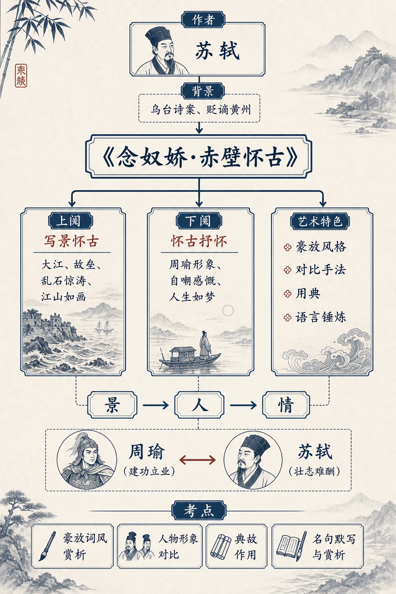
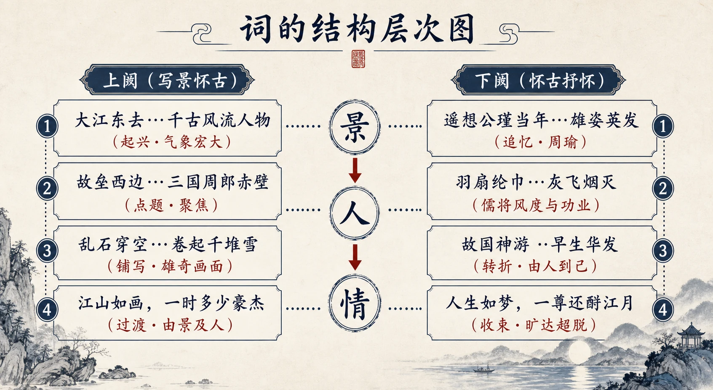
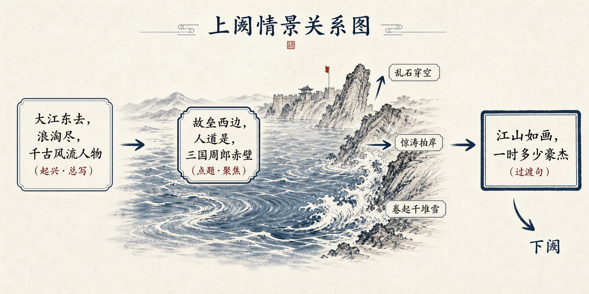
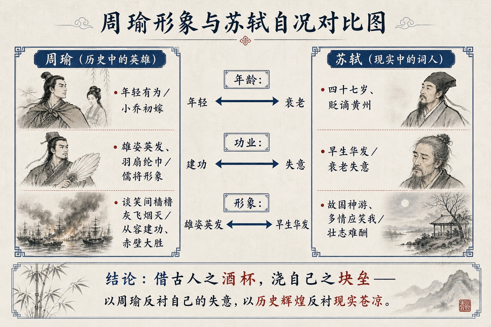
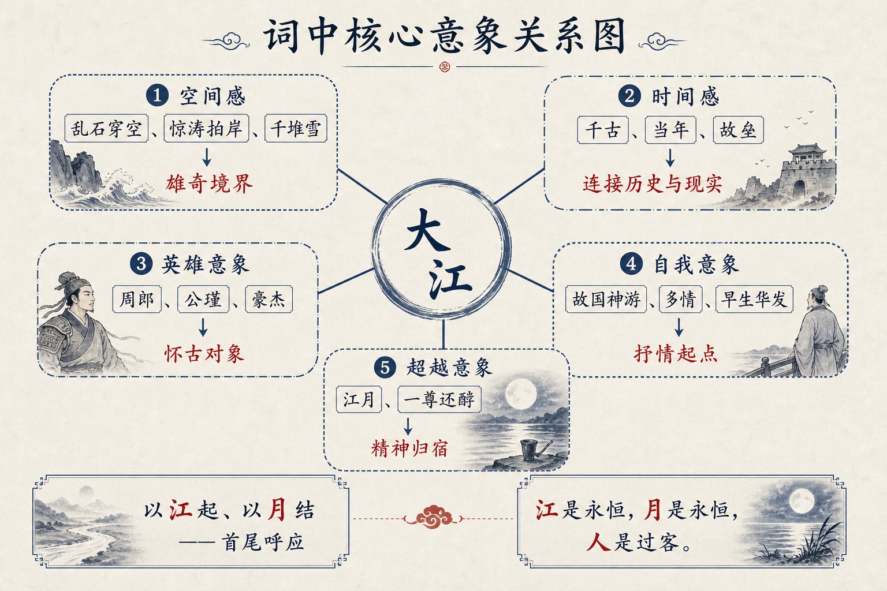
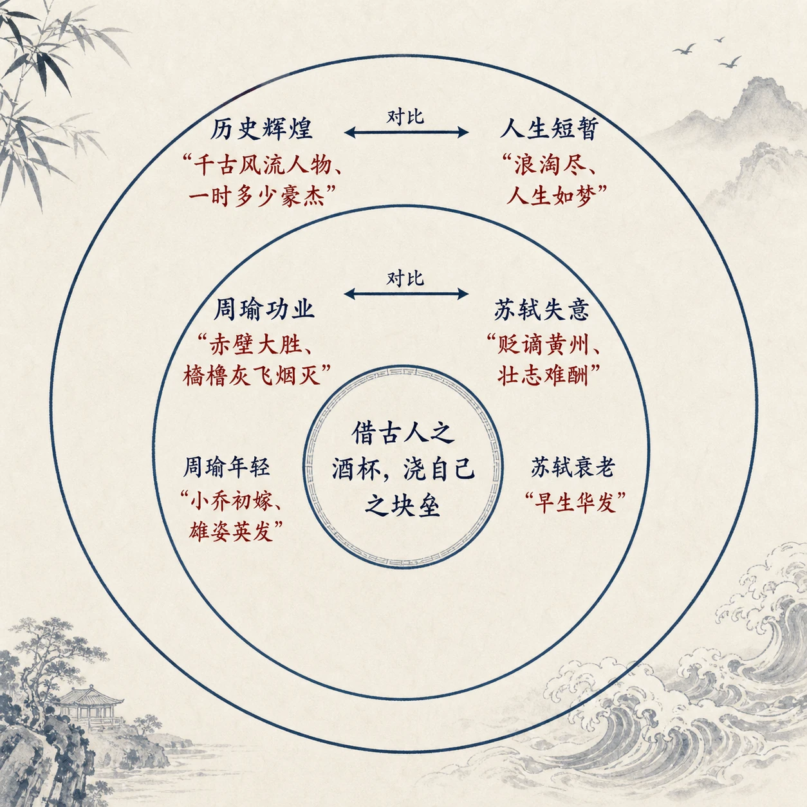

## 相关知识

[[01-短歌行]]
[[03-梦游天姥吟留别]]
[[04-登高]]

# 06 念奴娇·赤壁怀古


<!-- 图片描述：本节整体知识信息结构图——以"念奴娇·赤壁怀古"为中心主题，向上连接作者苏轼及其生平、写作背景（乌台诗案、贬谪黄州），向下分出三大分支：上阕（写景怀古——大江、故垒、乱石惊涛、江山如画）、下阕（怀古抒怀——周瑜形象、自嘲感慨、人生如梦）、艺术特色（豪放风格、对比手法、用典、语言锤炼）。各分支再细分具体知识点，以箭头标注上下阕的"景→人→情"递进关系和"周瑜（建功立业）↔苏轼（壮志难酬）"的对比关系。图的下方标注本词的核心考点：豪放词风赏析、人物形象对比、典故作用、名句默写与赏析。米白纸面背景，黑灰主线条，朱红标注重点，靛蓝标注对比关系。 -->

## 知识关系导航

- 相关知识点：[[01-短歌行#五、语言风格与表达手法|以典故述志]]（曹操借周公、苏轼借周瑜，同以历史人物典故寄寓人生志向）
- 对比知识点：[[03-梦游天姥吟留别#六、主题思想、情感态度与文化理解|傲岸不事权贵的人生态度]]（苏轼旷达自解、李白傲岸拒贵，皆由际遇写出精神出路）
- 相关知识点：[[04-登高#二、整体内容与结构线索|悲景与壮景的意境对照]]（赤壁壮景「江山如画」与夔州悲景，同以借景抒情写胸襟）

## 本节学习目标

学完本节后，你应能：

1. **背诵并默写**全词，理解词中关键字词的含义和读音。
2. **了解苏轼生平**，特别是"乌台诗案"后被贬黄州的创作背景，理解这首词在苏轼词作中的代表性地位。
3. **把握词的章法结构**：上阕写景怀古、下阕怀古抒情的双阕布局，以及"景—人—情"的递进线索。
4. **赏析周瑜形象**：理解词中塑造的"雄姿英发""羽扇纶巾"的儒将形象，把握作者借周瑜抒己怀的用意。
5. **分析对比手法**：周瑜的年轻有为与自己的早生华发、周瑜的功成名就与自己的壮志难酬之间的多重对比。
6. **体会豪放词风**：感受"大江东去"的气魄、"乱石穿空，惊涛拍岸"的雄奇画面，以及豪放中见旷达的情感特质。
7. **解读"人生如梦"**：理解词末的旷达与超脱并非消极，而是苏轼面对人生困境的精神升华。
8. **掌握鉴赏答题方法**：能够从意象、手法、情感等角度完成诗歌鉴赏题目。

## 核心知识点讲解

### 一、文本基本信息与学习任务

| 项目 | 内容 |
|------|------|
| **篇名** | 念奴娇·赤壁怀古 |
| **作者** | 苏轼（1037—1101），字子瞻，号东坡居士，北宋文学家、书画家，"唐宋八大家"之一 |
| **体裁** | 词（豪放词） |
| **词牌** | 念奴娇（双调一百字，上阕四十九字，下阕五十一字） |
| **创作时间** | 宋神宗元丰五年（1082年）七月 |
| **创作地点** | 黄州（今湖北黄冈） |
| **选本** | 《东坡乐府笺》卷二 |

**创作背景**：元丰二年（1079），苏轼因"乌台诗案"被捕入狱，后被贬为黄州团练副使。这是他人生中最重大的转折之一。到黄州后，苏轼在城东的坡地开荒种田，自号"东坡居士"。元丰五年，他游览黄州城外的赤鼻矶（并非三国赤壁大战的真正古战场），触景生情，写下了这首千古绝唱。此时的苏轼已四十七岁，政治上失意，但文学创作却达到了巅峰。

**学习任务**：本词是豪放词的代表作，也是高考必背篇目。学习重点是理解词中的景物描写与情感抒发的关系、周瑜形象与作者自况的对比，以及豪放中见旷达的独特风格。

### 二、整体内容与结构线索

这首词共一百字，分上下两阕，结构清晰、章法严谨：

```
上阕（写景怀古）：
  大江东去…千古风流人物    → 起兴：以壮阔之景引入历史感怀
  故垒西边…三国周郎赤壁    → 点题：聚焦赤壁、聚焦周瑜
  乱石穿空…卷起千堆雪      → 铺写：赤壁的雄奇壮丽之景
  江山如画，一时多少豪杰    → 过渡：由景及人，引出下阕

下阕（怀古抒怀）：
  遥想公瑾当年…雄姿英发    → 追忆：正面描写周瑜形象
  羽扇纶巾…灰飞烟灭        → 渲染：周瑜的儒雅与功业
  故国神游…早生华发        → 转折：由怀古转入自伤
  人生如梦，一尊还酹江月    → 收束：旷达超脱的感悟
```


<!-- 图片描述：词的结构层次图——左侧标注"上阕（写景怀古）"，纵向排列四层，每层配原文关键词和功能标注："大江东去…千古风流人物（起兴·气象宏大）→ 故垒西边…三国周郎赤壁（点题·聚焦赤壁与周瑜）→ 乱石穿空…卷起千堆雪（铺写·雄奇画面）→ 江山如画，一时多少豪杰（过渡·由景及人）"。右侧标注"下阕（怀古抒怀）"，纵向排列四层："遥想公瑾当年…雄姿英发（追忆·正面刻画周瑜）→ 羽扇纶巾…灰飞烟灭（渲染·儒将风度与功业）→ 故国神游…早生华发（转折·由人到己）→ 人生如梦，一尊还酹江月（收束·旷达超脱）"。上下阕之间用箭头标注"景→人→情"的递进关系。米白纸面背景，黑灰主线条，朱红标注核心词语，靛蓝标注过渡关系。 -->

这首词的线索是**由景及人、由人及情**：从长江赤壁的壮丽景色，联想到三国英雄周瑜的辉煌功业，再由周瑜反观自己的失意人生，最终以"人生如梦"的旷达感悟收束全篇。全词以"大江"起，以"江月"结，首尾呼应，结构圆融。

### 三、课文原文与逐段/逐句解读

> 本词是苏轼豪放词的代表作。词中大量使用典故和历史人物，借古抒怀，气势磅礴而情感深沉。以下按上阕、下阕逐句解读。

---

**上阕：写赤壁之景，引出怀古之情**


<!-- 图片描述：上阕情景关系图——画面中央一条横贯的大江，江左侧标注"大江东去，浪淘尽，千古风流人物"（起兴·总写），江中标注"故垒西边，人道是，三国周郎赤壁"（点题·聚焦），江岸绘制"乱石穿空"（向上箭头）、"惊涛拍岸"（波浪冲击岸壁）、"卷起千堆雪"（白色浪花），画面右侧标注"江山如画，一时多少豪杰"并加粗边框（过渡句），从右下方延伸箭头指向下阕。整体构图为从左到右的视觉流动。米白纸面背景，黑灰主线条，朱红标注关键词，靛蓝标注箭头。 -->

> **大江东去，浪淘尽，千古风流人物。**

**【解读】** 这是词的开篇三句，落笔惊人。

- **"大江东去"**：只四个字，就写出了长江的浩瀚与永恒。"大"字写出江面之宽，"东去"写出江流之远，简练而气象万千。
- **"浪淘尽"**："淘"是冲洗的意思。滚滚长江的浪花，冲洗掉了一切——这里用了一个隐喻：历史的长河也如长江之水，无情地冲刷、淘汰着过往的一切。
- **"千古风流人物"**："风流人物"指那些在历史上留下英名的杰出人物。然而即使是这些英雄豪杰，也终将被时间的长河"淘尽"。
- **整体把握**：这三句从空间（大江）和时间（千古）两个维度展开，营造出一种苍茫辽阔的时空感。"大江东去"是写眼前实景，"浪淘尽"是由景入理，"千古风流人物"是由理入情。三句之间从大到小、从具体到抽象、从景物到人事，一气呵成，奠定了全词雄浑苍凉的基调。
- **修辞手法**：起兴、比喻（以江水喻历史长河）。

> **故垒西边，人道是，三国周郎赤壁。**

**【解读】** 由全景收束到具体地点。

- **"故垒西边"**："故垒"指旧时军队营垒的遗迹。视线从"大江"收拢到西边的古战场遗迹上。
- **"人道是"**：有人说这里是……这三个字很妙——苏轼其实知道黄州赤鼻矶并非真正的赤壁古战场，但他说"人道是"，保留了文学想象的空间，不必拘泥于历史地理的考证。这是一种诗意的"将错就错"。
- **"三国周郎赤壁"**：点出时代（三国）、人物（周郎）、地点（赤壁）。"周郎"是对周瑜的亲昵称呼——周瑜二十四岁即被任命为建威中郎将，吴中人皆称其为"周郎"，可见其年少有为。
- **整体把握**：这三句完成了由泛写历史到聚焦特定人物和事件的转换，为下文对周瑜的刻画做了铺垫。词人特意选择周瑜而不是赤壁之战的其他人物（如诸葛亮、曹操），是因为周瑜的年轻有为与自己的中年失意形成了最强烈的对照。

> **乱石穿空，惊涛拍岸，卷起千堆雪。**

**【解读】** 这三句是写景的名句，用极具画面感的语言描绘赤壁的雄奇景象。

- **"乱石穿空"**：陡峭不平的岩石直插天空。"乱"写石之形貌参差，《穿》字写石之高耸险峻，有力量感。（注：教材作"穿空"，另本作"崩云"或"穿云"，含义相近。）
- **"惊涛拍岸"**：汹涌的波涛拍打着江岸。"惊"字赋予波涛以人的情感和气势，"拍"字写出浪涛冲击的力量。
- **"卷起千堆雪"**：浪花如千堆白雪被卷起。以"雪"喻白色的浪花，是古典诗词中常见的比喻，但"千堆"二字将雪浪的数量和气势放大到极致，与前面"大江""千古"的宏大意象相匹配。
- **整体把握**：这三句分别从高（穿空）、低（拍岸）、近（千堆雪）三个角度描写赤壁江景，有仰视、有平视、有俯视，空间层次丰富。"穿""拍""卷"三个动词精准而有力度，是全词语言的精华所在。这种雄奇壮阔的景象为下阕英雄人物的出场做好了环境铺垫——正是在这样险峻的战场上，周瑜创造了惊天动地的功业。
- **修辞手法**：夸张（穿空）、拟人（惊涛）、比喻（千堆雪）。

> **江山如画，一时多少豪杰。**

**【解读】** 上阕的收束句，承上启下。

- **"江山如画"**：总结上文——这样壮美的江山，如同一幅画卷。四字短句，简洁有力。
- **"一时多少豪杰"**：在那个时代（三国），涌现了多少英雄豪杰啊！"一时"指三国时期，"豪杰"既指周瑜，也包括诸葛亮、曹操、孙权等风云人物。
- **整体把握**：这两句起到了过渡作用。"江山如画"收住上文写景，"一时多少豪杰"开启下文怀古。从"多少豪杰"到下文专写周瑜一人，是从面到点的聚焦过程。

---

**下阕：怀古抒怀，以周瑜反观自身**


<!-- 图片描述：周瑜形象与苏轼自况的对比图——画面分为左右两栏。左栏标题"周瑜（历史中的英雄）"，内容：年轻有为（与小乔初嫁并列）、雄姿英发·羽扇纶巾（儒将形象）、谈笑间樯橹灰飞烟灭（从容建功·赤壁大胜）。右栏标题"苏轼（现实中的词人）"，内容：四十七岁·贬谪黄州、早生华发（衰老失意）、故国神游·多情应笑我（壮志难酬）。两栏之间用双向箭头标注三组对比："年龄对比（年轻↔衰老）""功业对比（建功↔失意）""形象对比（雄姿英发↔早生华发）"。底部标注："借古人之酒杯，浇自己之块垒——以周瑜反衬自己的失意，以历史的辉煌反衬现实的苍凉。" 米白纸面背景，黑灰主线条，朱红标注对比关键词，靛蓝标注过渡关系。 -->

> **遥想公瑾当年，小乔初嫁了，雄姿英发。**

**【解读】** 下阕以"遥想"二字领起，进入怀古。

- **"遥想公瑾当年"**："遥想"二字将思绪拉回八百多年前的三国时代。"公瑾"是周瑜的字，称字不称名，表现出对周瑜的敬意。
- **"小乔初嫁了"**：小乔是乔公的次女，嫁给周瑜。赤壁之战发生在建安十三年（208年），而周瑜娶小乔是在建安四年（199年），中间相隔近十年。苏轼将这两件事放在一起，并非不知史实，而是用"初嫁"来衬托周瑜的年轻得意、人生美满——事业与婚姻双丰收。
- **"雄姿英发"**：姿容雄伟，英气勃发。这四个字从外貌、神态、气质三方面刻画周瑜，塑造出一个风华正茂的少年英雄形象。
- **整体把握**：这三句从周瑜的年龄、婚姻、外貌入手，为下文写他的功业做铺垫。苏轼描写周瑜越年轻、越英俊、越得意，对比之下自己的老迈、失意就越强烈。这是以乐景写哀情、以他人的辉煌反衬自己的失意。

> **羽扇纶巾，谈笑间，樯橹灰飞烟灭。**

**【解读】** 写周瑜指挥赤壁之战时的从容与功绩，是全词写周瑜最精彩的三句。

- **"羽扇纶巾"**：（手持）羽扇，（头戴）青丝带头巾。这是儒者的装束，而非武将的铠甲。"纶（guān）巾"是配有青丝带的头巾。苏轼笔下的周瑜不是披坚执锐的猛将，而是手摇羽扇、头戴纶巾的儒雅之士——儒将风度。
- **"谈笑间"**：在谈笑之间。三个字写出了周瑜指挥若定、从容不迫的气度。赤壁之战是以少胜多的大战役，但在周瑜这里，却是"谈笑间"完成的——举重若轻。
- **"樯橹灰飞烟灭"**："樯"是挂帆的桅杆，"橹"是摇船的桨，以"樯橹"代指曹操的战船（借代手法）。"灰飞烟灭"形容战船在火攻中被烧成灰烬，形象地写出曹军惨败的场景。（另本作"强虏"，指强大的敌军，两者皆通。）
- **整体把握**：这三句用极为简练的语言，写出了赤壁之战从运筹帷幄到取得胜利的全过程。"羽扇纶巾"写形象之儒雅，"谈笑间"写态度之从容，"灰飞烟灭"写战果之辉煌。三组意象层层递进，共同塑造出一个完美的英雄形象。与上阕"乱石穿空，惊涛拍岸"的激烈战场相对照，更显出周瑜"谈笑间"的举重若轻。
- **修辞手法**：借代（樯橹代战船）、夸张（灰飞烟灭）。

> **故国神游，多情应笑我，早生华发。**

**【解读】** 由怀古突然转入自伤，是全词情感的高潮与转折。

- **"故国神游"**："故国"指赤壁古战场。我的神思在古战场上游荡。"神游"二字暗示上文对周瑜的描写并非实写，而是词人的想象和神往。
- **"多情应笑我，早生华发"**：应笑我多愁善感，过早地长出了花白的头发。注意这里的语序是倒装——正常语序应为"应笑我多情，早生华发"（倒装句式）。
- **整体把握**：从"遥想公瑾当年"的沉醉中猛然醒来，回到现实——我不是周瑜，我是被贬黄州的苏轼，我已四十七岁，头发已斑白。周瑜在赤壁建立不世之功时年仅三十四岁，而苏轼此时四十七岁却一事无成。这巨大的反差让人心痛。然而苏轼没有一味沉溺于悲哀——"多情应笑我"中有一种自嘲的意味，这自嘲本身就是在消解痛苦。"笑"字看似轻松，实则沉痛。

> **人生如梦，一尊还酹江月。**

**【解读】** 词的结尾，苏轼给出了他对人生困境的回答。

- **"人生如梦"**：人生就像一场梦。这不是消极的虚无主义，而是苏轼在经历了大起大落之后对人生的深刻领悟——功名、得失、荣辱都如梦幻一般短暂而不真实。从佛道思想中汲取智慧，是苏轼化解痛苦的方式。
- **"一尊还酹江月"**：举起一杯酒，洒向江中，祭奠江中的明月。"尊"同"樽"，酒杯。"酹（lèi）"是将酒洒在地上的祭奠仪式。
- **整体把握**：祭奠什么？祭奠千古风流人物，祭奠逝去的青春与壮志，也祭奠这如画江山与永恒明月。以酒酹月，表现出苏轼的旷达与超脱——既然人生如梦，不如与天地山川同在，与明月清风共饮。这不是消沉，而是一种"看透之后的依然热爱"。
- **首尾呼应**：开篇"大江东去"写江，结句"一尊还酹江月"写江与月，首尾圆融，结构精严。

### 四、关键语句、人物/意象与细节精读

**（一）"大江东去，浪淘尽，千古风流人物"——千古名句的奥秘**

这三句何以成为千古传诵的名句？其精华在于将空间感（大江）、时间感（千古）、运动感（东去、淘尽）和人事（风流人物）熔铸于十二个字中。语言简到极致，意蕴却深到无穷。这种能力，正是苏轼"以诗为词"、将词的境界从"艳科"提升至士大夫情怀的关键。

**（二）周瑜形象的复合塑造**

词中的周瑜不是一个扁平的历史人物，而是一个多侧面、立体化的文学形象：

| 侧面 | 原文依据 | 效果 |
|------|---------|------|
| 年轻得志 | "公瑾当年""小乔初嫁了" | 人生赢家，令人艳羡 |
| 外貌英武 | "雄姿英发" | 视觉化的英雄形象 |
| 儒雅风度 | "羽扇纶巾" | 非匹夫之勇，而是儒将之智 |
| 从容自信 | "谈笑间" | 举重若轻，指挥若定 |
| 功业辉煌 | "樯橹灰飞烟灭" | 以少胜多，名垂青史 |

五个侧面共同构成了一个完美的英雄形象。而越是完美，反衬效果越强。

**（三）核心意象解读**


<!-- 图片描述：词中核心意象关系图——画面以"大江"为中心意象，辐射出五条线索：①空间感（乱石穿空、惊涛拍岸、千堆雪）→营造雄奇境界；②时间感（千古、当年、故垒）→连接历史与现实；③英雄意象（周郎、公瑾、豪杰）→怀古的对象；④自我意象（故国神游、多情、早生华发）→抒情的起点；⑤超越意象（江月、一尊还酹）→精神的归宿。每条线索用不同颜色虚线连接，标注关键词。底部左侧标注"以江起、以月结——首尾呼应"，右侧标注"江是永恒，月是永恒，人是过客"。米白纸面背景，黑灰主线条，朱红标注英雄意象，靛蓝标注自我意象，浅灰标注永恒意象。 -->

| 意象 | 出现位置 | 象征意义 |
|------|---------|---------|
| **大江** | 首句 | 历史长河、时间的永恒流动 |
| **浪** | "浪淘尽""惊涛拍岸""卷起千堆雪" | 时间的冲刷力、自然的伟力 |
| **石/岸** | "乱石穿空""故垒西边""惊涛拍岸" | 古战场的遗迹、历史的见证 |
| **月** | "一尊还酹江月" | 永恒、超脱、自然之道的象征 |
| **酒** | "一尊还酹江月" | 借酒抒怀、祭奠与和解 |

### 五、语言风格与表达手法

**（一）豪放词风的典范特征**

| 特征 | 体现 |
|------|------|
| **境界阔大** | "大江东去""千古风流人物""江山如画"——空间与时间两个维度都极致展开 |
| **气势磅礴** | "乱石穿空，惊涛拍岸，卷起千堆雪"——动词"穿""拍""卷"充满力量 |
| **情感深沉** | 从怀古的激昂到自伤的沉痛再到超脱的旷达，情感起伏大而真挚 |
| **语言精炼** | 全词仅一百字，却写尽赤壁之战、周瑜一生、词人半世，无一字多余 |
| **以诗为词** | 将诗的表现手法引入词中，突破了词以婉约为正宗的格局 |

**（二）主要艺术手法**

1. **对比手法**（全词最核心的手法）


<!-- 图片描述：词中多重对比关系图——三组同心圆。最内圈：周瑜的年轻（小乔初嫁、雄姿英发）vs 苏轼的衰老（早生华发）。中间圈：周瑜的功业（赤壁大胜、樯橹灰飞烟灭）vs 苏轼的失意（贬谪黄州、壮志难酬）。最外圈：历史的辉煌（千古风流人物、一时多少豪杰）vs 人生的短暂（浪淘尽、人生如梦）。每组对比用双向箭头连接，箭头两侧标注对比关键词。圆心标注"借古人之酒杯，浇自己之块垒"。米白纸面背景，黑灰主线条，朱红标注对比双方，靛蓝标注对比结论。 -->

- 周瑜（年轻有为、功成名就）↔ 苏轼（年老失意、壮志难酬）
- 历史的辉煌（赤壁大胜）↔ 现实的苍凉（贬谪黄州）
- 自然的永恒（大江、江月）↔ 人生的短暂（浪淘尽、人生如梦）

2. **用典**

- 赤壁之战（历史典故）——借古战场引出历史感怀
- 周瑜、小乔（人物典故）——以周瑜反衬自己

3. **借代**

- "樯橹"代指战船（以部分代整体）

4. **比喻**

- "千堆雪"比喻白色浪花
- "江山如画"比喻江山之美

5. **倒装**

- "多情应笑我，早生华发"——正常语序为"应笑我多情，早生华发"

6. **夸张**

- "乱石穿空"——岩石怎么可能穿破天空？极言其高
- "谈笑间，樯橹灰飞烟灭"——极言取胜之易

### 六、主题思想、情感态度与文化理解

**主题思想**：本词通过描绘赤壁的壮丽景色和对周瑜英雄业绩的追忆，抒发了词人功业未成、壮志难酬的深沉感慨，同时表现出参透人生后旷达超脱的胸襟。

> **单元关联**：本词与 [[01-短歌行#五、语言风格与表达手法|《短歌行》]] 同擅以典故述志——苏轼借周瑜、曹操借周公，皆以历史人物寄寓人生志向；其「人生如梦」的旷达，又与 [[03-梦游天姥吟留别#六、主题思想、情感态度与文化理解|李白傲岸不事权贵的人生态度]] 相映，三者皆由人生际遇写出精神出路；而赤壁「江山如画」的壮景，恰可与 [[04-登高#二、整体内容与结构线索|《登高》夔州悲景]] 对照，一豪放一沉郁，同以借景抒情写胸襟。

**情感发展脉络**：

```
雄浑苍凉 ──→ 激昂壮阔 ──→ 沉痛自伤 ──→ 旷达超脱
（起兴）      （怀古）      （转折）      （收束）
大江东去      遥想公瑾      早生华发      人生如梦
```

**理解"人生如梦"的文化内涵**

很多学生读到"人生如梦，一尊还酹江月"时，会认为苏轼是消极的。这是片面的理解。需要从以下三个层面理解：

1. **历史层面**：从"乌台诗案"中死里逃生的苏轼，对人生的无常和命运的不可控有切身体会。"人生如梦"是一种真实的人生感悟，而非无病呻吟。

2. **哲学层面**："人生如梦"融合了庄子的"齐物"思想和禅宗的"空"观，是苏轼精神世界的重要组成部分。认识到"人生如梦"不是放弃追求，而是放下执着。

3. **审美层面**：结尾的"一尊还酹江月"恰恰证明了苏轼并非消极——他将酒洒向江月，与永恒的天地对话。这是一种积极的自我和解，也是一种审美的超越。正如他在《赤壁赋》中所说："惟江上之清风，与山间之明月……是造物者之无尽藏也。"

**文化地位**：这首词被公认为豪放词的开山之作和巅峰之作。南宋胡仔《苕溪渔隐丛话》称："东坡'大江东去'赤壁词，语意高妙，真古今绝唱。"后人常以"大江东去""晓风残月"分别代表豪放与婉约两种词风。

### 七、阅读答题与写作迁移

**【鉴赏答题思路】**

鉴赏本词的常用角度与答题模板：

| 鉴赏角度 | 答题要点 | 示例句式 |
|---------|---------|---------|
| 意象赏析 | 选取具体意象→分析特点→说明效果 | "大江"意象写出……营造了……的意境 |
| 手法赏析 | 点明手法→结合诗句分析→说明表达效果 | 上阕"乱石穿空，惊涛拍岸"运用夸张和拟人，生动地…… |
| 情感赏析 | 指出情感→结合词句佐证→说明变化过程 | 词人由怀古的激昂转入自伤的沉痛，最后在"人生如梦"中获得超脱…… |
| 人物形象 | 概括形象特征→引用原句→分析作用 | 周瑜的形象特点是……作者这样写是为了…… |
| 语言赏析 | 指出精妙字词→分析妙处→说明整体效果 | "穿""拍""卷"三个动词准确传神，分别从……角度…… |

**【写作迁移】**

苏轼这首词对我们的写作启示：

1. **以景衬情**：写景不作为独立存在，而是为抒情服务。赤壁的雄奇景色正是为了衬托英雄的功业和词人的襟怀。
2. **以小见大**：从一次游览（小事件）引出对历史和人生的思考（大主题）。
3. **对比结构**：周瑜与苏轼的对比，使情感表达更深刻、更震撼。
4. **结尾升华**："人生如梦，一尊还酹江月"——好的结尾不只是总结，而是将情感提升到新的境界。

## 重点梳理

### 一、必背原文（全文默写）

> 大江东去，浪淘尽，千古风流人物。故垒西边，人道是，三国周郎赤壁。乱石穿空，惊涛拍岸，卷起千堆雪。江山如画，一时多少豪杰。
>
> 遥想公瑾当年，小乔初嫁了，雄姿英发。羽扇纶巾，谈笑间，樯橹灰飞烟灭。故国神游，多情应笑我，早生华发。人生如梦，一尊还酹江月。

### 二、重点字词注音与释义

| 字词 | 读音 | 释义 |
|------|------|------|
| 纶巾 | guān jīn | 配有青丝带的头巾（注意不读 lún） |
| 樯橹 | qiáng lǔ | "樯"是桅杆，"橹"是船桨，借指战船 |
| 华发 | huá fà | 花白的头发（"华"通"花"） |
| 尊 | zūn | 同"樽"，酒杯 |
| 酹 | lèi | 将酒洒在地上，表示祭奠、凭吊 |
| 故垒 |  | 旧时军队营垒的遗迹 |
| 周郎 |  | 即周瑜，字公瑾 |
| 故国 |  | 指赤壁古战场 |

### 三、词的结构（必记）

```
上阕（写景）：大江→故垒→乱石惊涛→江山如画
下阕（怀古抒怀）：周瑜形象→赤壁功业→自伤感慨→旷达收束
线索：由景及人，由人及情
情感变化：苍凉→激昂→沉痛→旷达
```

### 四、周瑜形象特征（必记）

年轻得志、雄姿英发、儒雅从容（羽扇纶巾）、战功显赫（樯橹灰飞烟灭）

### 五、核心艺术手法

对比（周瑜↔苏轼）、用典（赤壁之战）、借代（樯橹）、比喻（千堆雪）、夸张（穿空）、倒装（多情应笑我）

### 六、文化常识速记

- 苏轼：字子瞻，号东坡居士，北宋，"唐宋八大家"之一
- 词分两派：豪放派（苏轼、辛弃疾）、婉约派（柳永、李清照）
- 赤壁之战：208年，孙权、刘备联军对曹操，周瑜指挥，火攻取胜
- 乌台诗案：1079年苏轼因诗获罪，后贬黄州
- 黄州赤鼻矶：并非真正的赤壁古战场（真正的赤壁在今湖北赤壁市）

## 难点突破

### 难点一：如何理解苏轼"将错就错"写赤壁？

苏轼明知黄州赤鼻矶不是真正的赤壁古战场，却仍以此为背景创作——《念奴娇·赤壁怀古》和前后《赤壁赋》都是如此。

**突破方法**：文学作品不等于历史考证。苏轼是在借一个地名的巧合来抒发情怀。"人道是"三字已暗示他不确定此地是否为真赤壁，但诗意的想象和情感的传达远比地理考证重要。

### 难点二："人生如梦"是消极还是积极？

很多学生容易把"人生如梦"简单理解为消沉颓废。

**突破方法**：回到苏轼的人生经历和整首词的语境中去理解。

1. **境遇**：苏轼此时是被贬之身，说他有些苦闷是对事实的尊重。但正因如此，他的"旷达"才更显难能可贵——不是生活在蜜罐里的人说生活美好，而是身在低谷的人仍能发现生活的意义。
2. **下文的"一尊还酹江月"**：苏轼没有沉溺于悲伤，而是以酒酹月、与天地对话。这是一个积极的仪式性动作，象征着与自然达成和解。
3. **与同期作品对比**：同一时期的《赤壁赋》中，苏轼说"逝者如斯，而未尝往也；盈虚者如彼，而卒莫消长也"——他看到了变化的表象之下有不变的本质。这种思想与"人生如梦，一尊还酹江月"一脉相承。

**结论**："人生如梦"不是消极的厌世，而是一种看透人生真相后仍然热爱生活、与天地同在的旷达胸襟。

### 难点三："羽扇纶巾"描写的是周瑜还是诸葛亮？

在许多通俗文艺作品（如《三国演义》）中，"羽扇纶巾"是诸葛亮的标志性装束。但在这首词中，"羽扇纶巾"描写的是周瑜。

**突破方法**：

- 从史实看：三国时期，"羽扇纶巾"是儒将的常见装束，并非某人专属。周瑜是名副其实的儒将，完全符合这个形象。
- 从词意看：上文"遥想公瑾当年"，已明确这段描写的主语是周瑜（公瑾）。
- 从文学效果看：用"羽扇纶巾"描写周瑜，突出其儒雅从容，与下文"谈笑间，樯橹灰飞烟灭"构成强烈的反差效果——一个手摇羽扇的文雅之士，却能在谈笑间指挥一场决定天下格局的大战，更显其英雄本色。

### 难点四：倒装句"多情应笑我，早生华发"的语序还原

**突破方法**：逐一还原语序——

| 原句 | 正常语序 | 释义 |
|------|---------|------|
| 多情应笑我 | 应笑我多情 | 应该笑我多愁善感 |
| 早生华发 | （使我）早生华发 | 过早地长出了白发 |

两句合起来的意思：应该笑我太多愁善感，以至于过早地长出了花白的头发。

## 例题讲解

### 例题一（意象赏析）

**题目**：分析"乱石穿空，惊涛拍岸，卷起千堆雪"三句的写景特点。

**分析步骤**：
1. 确定描写对象：赤壁的江景——岩石、波涛、浪花
2. 逐一分析每句的手法与效果
3. 整体把握三句的层次和关系

**参考答案**：

这三句从不同角度描写了赤壁的雄奇景象。

"乱石穿空"写江岸的岩石，一个"穿"字用夸张手法写出了岩石陡峭高耸、直指天空的气势，给人以视觉上的震撼。

"惊涛拍岸"写江水的波涛，"惊"字用拟人手法赋予波涛以生命和气势，"拍"字写出了浪涛冲击江岸的巨大力量。

"卷起千堆雪"写浪花，用"雪"比喻白色的浪花，一个"卷"字写出了巨浪翻涌的动态，"千堆"则夸张了浪花数量之多。

三句分别从高、低、近三个视角展开，空间层次丰富；"穿""拍""卷"三个动词精准有力，将赤壁江山的壮美气势展现得淋漓尽致，为下文英雄人物的出场做了有力的环境铺垫。

### 例题二（情感分析）

**题目**：本词的情感经历了怎样的变化？请结合词句简要分析。

**分析步骤**：
1. 逐层梳理词人的情感
2. 每层找出关键原句作为依据
3. 说明情感变化的内在逻辑

**参考答案**：

本词的情感经历了"苍凉—激昂—沉痛—旷达"的变化过程。

上阕以"大江东去，浪淘尽，千古风流人物"起笔，营造出一种苍茫辽阔、历史无情的苍凉之感。随后"乱石穿空，惊涛拍岸"转向激昂壮阔，词人对英雄时代的向往之情溢于言表。

下阕"遥想公瑾当年"四句转为激昂——周瑜的丰功伟绩令人热血沸腾。但"故国神游"以下突然转折，由周瑜想到自己"早生华发"，流露出一事无成、壮志难酬的沉痛之情。

最后"人生如梦，一尊还酹江月"，词人从沉痛中走出来，以旷达超脱的态度面对人生——既然人生如梦，不如与天地山河同在。情感在起伏跌宕中得到升华。

### 例题三（人物形象）

**题目**：词中塑造了怎样的周瑜形象？作者为什么要这样写？

**分析步骤**：
1. 从原文中提取描写周瑜的词句
2. 逐一分析每句塑造的形象特征
3. 点明作者这样写的意图（对比反衬）

**参考答案**：

词中塑造了一个年轻有为、儒雅从容、功业辉煌的英雄形象。

- "小乔初嫁了"写其年轻得志，婚姻美满。
- "雄姿英发"写其外貌英武，气度不凡。
- "羽扇纶巾"写其儒将风度，文雅从容。
- "谈笑间，樯橹灰飞烟灭"写其指挥若定，一战定乾坤。

作者之所以这样大写周瑜，是为了与自己形成对比——周瑜三十四岁建立不世之功，而自己四十七岁却因贬谪一事无成。以周瑜的辉煌反衬自己的失意，使情感表达更加深沉有力。这正是"借古人之酒杯，浇自己之块垒"的写法。

## 易错点整理

| 序号 | 易错点 | 错误表现 | 正确理解 |
|------|--------|---------|---------|
| 1 | 主题理解片面 | 认为本词只是"赞美周瑜"或只是"抒发怀才不遇" | 本词通过怀古抒怀，既有对英雄的仰慕，也有对自身境遇的感慨，最终归结为旷达超脱的人生态度 |
| 2 | "人生如梦"理解不当 | 认为苏轼是消极悲观的 | 结尾的"一尊还酹江月"表明苏轼与天地达成和解，是看透后的旷达而非消沉 |
| 3 | "羽扇纶巾"人物误判 | 认为是写诸葛亮 | 从上下文看，主语是"公瑾"（周瑜），且史载周瑜本就是儒将，完全符合这一形象 |
| 4 | 手法混淆 | 把"江山如画"当拟人 | "江山如画"是比喻，"惊涛拍岸"中的"惊"才是拟人 |
| 5 | "纶"字注音错误 | 读作 lún | 正确读音为 guān（纶巾），与"经纶"的 lún 义项不同 |
| 6 | "华发"释义错误 | 理解为"华丽的头发" | "华"通"花"，华发即花白的头发 |
| 7 | "酹"字读音和释义错误 | 读作 lǚ 或 luō | 正确读音 lèi，意为将酒洒在地上表示祭奠 |
| 8 | "尊"与"樽"的关系不明 | 认为"尊"是尊敬、尊重 | 此处"尊"同"樽"，是酒杯的意思（通假字） |
| 9 | 答题语言空泛 | 只说"写得很好""很有气势"而不具体分析 | 必须结合具体词句，指出用了什么手法、如何用的、有什么效果 |
| 10 | 豪放与婉约的区分不准确 | 把苏轼所有词都归为豪放 | 苏轼也有婉约之作（如《江城子·十年生死两茫茫》），本词是他豪放词的代表作 |

## 考点考证点整理

### 考点一：名句默写

- **出题思路**：给出上句或下句，要求补全；或给出情境要求写出对应句子。
- **关键条件**：注意题目给出的情境关键词，如"写景""怀古""抒怀""周瑜形象""旷达"等。
- **解答要点**：准确默写，不能有错字、别字、漏字。特别注意"纶（guān）巾""樯橹""酹"等易错字。
- **易扣分点**：错别字（纶写成伦、酹写成捋等）、漏字、多字。

### 考点二：意象赏析

- **出题思路**：选取词中一个或多个意象（如"大江""浪""月"），要求分析其特点和表达效果。
- **关键条件**：题目通常给出具体的词句，要求结合上下文分析。
- **解答要点**：先概括意象特点，再分析其在塑造意境、抒发情感方面的作用。套用"手法 + 内容 + 效果"的答题模板。
- **易扣分点**：脱离词句空谈、"贴标签"式地只说"生动形象"而无具体分析。

### 考点三：对比手法分析

- **出题思路**：要求分析周瑜与苏轼的对比及其作用；或分析词中自然永恒与人生短暂的对比。
- **关键条件**：题目常问"作者为什么要写周瑜"或"周瑜形象在词中的作用"。
- **解答要点**：先概括对比的双方（周瑜的年轻有为↔苏轼的年老失意），再具体引用词句佐证，最后点明这种对比对表达主题的作用（以周瑜反衬自己的失意，突出壮志难酬之感）。
- **易扣分点**：只写对比不写作用、缺少词句证据。

### 考点四：情感变化分析

- **出题思路**：要求梳理全词或某部分的情感发展脉络。
- **关键条件**：题目可能限定分析范围（如上阕、下阕或全词）。
- **解答要点**：按词的结构顺序，逐一标注情感变化节点：苍凉→激昂→沉痛→旷达。每个节点用原句佐证。
- **易扣分点**：只给出"由悲到喜"之类的简单概括，缺少层次分析；引用原句不准确。

### 考点五：豪放词风赏析

- **出题思路**：要求结合本词分析豪放词的风格特征，或与婉约词进行对比。
- **关键条件**：题目可能问"本词如何体现豪放风格"。
- **解答要点**：从境界、气势、语言、情感四个维度入手——境界阔大（大江、千古）、气势磅礴（穿、拍、卷）、语言简劲（一百字写尽千古）、情感深厚（大起大落而归于旷达）。
- **易扣分点**：只有结论没有分析、混淆豪放与婉约的风格特征。

### 考点六：思想内涵探究

- **出题思路**：探究"人生如梦"的哲学意蕴；或分析苏轼在逆境中的人生态度。
- **关键条件**：可能需要结合苏轼的其他作品（如《赤壁赋》《定风波》）进行分析。
- **解答要点**：从"乌台诗案"的创作背景出发，说明"人生如梦"不是消极，而是经历苦难后的深刻领悟和精神超越。结合"一尊还酹江月"说明苏轼与自然对话、与天地同在的旷达胸襟。
- **易扣分点**：脱离创作背景空谈、简单贴"乐观"或"悲观"标签而不做辩证分析。

## 练习题

### 一、基础理解

1. 给下列加点字注音并解释：
   - 羽扇**纶**巾（  ）
   - **樯橹**（  ）
   - 早生**华**发（  ）
   - 一尊还**酹**江月（  ）

2. 苏轼，字\_\_\_\_\_，号\_\_\_\_\_\_\_\_，北宋文学家，"\_\_\_\_\_\_\_\_\_\_"之一。本词作于他被贬\_\_\_\_（地名）期间。

### 二、文本分析

3. "乱石穿空，惊涛拍岸，卷起千堆雪"三句历来为人称道，请从用词和写景角度的角度简要赏析。

4. 词中塑造的周瑜是一个怎样的形象？作者为什么要大写周瑜？

5. "大江东去，浪淘尽，千古风流人物"与"人生如梦，一尊还酹江月"在情感上有何联系？这两处对全词的结构起到了什么作用？

### 三、鉴赏评价

6. "羽扇纶巾，谈笑间，樯橹灰飞烟灭"这四句用了什么表现手法？有什么表达效果？

7. 有人说"人生如梦"流露出消极情绪，你同意吗？请结合全词内容和苏轼的生平谈谈你的看法。

### 四、迁移写作

8. 以"我眼中的苏轼"为题，写一段200字左右的短文，结合本词谈谈你对苏轼人生态度的理解。

## 练习题答案

### 第一题

1. 注音释义：
   - 纶（guān）巾：配有青丝带的头巾
   - 樯橹（qiáng lǔ）：樯是桅杆，橹是船桨，借指战船
   - 华（huá）发：花白的头发（"华"通"花"）
   - 酹（lèi）：将酒洒在地上，表示凭吊

2. 苏轼，字**子瞻**，号**东坡居士**，北宋文学家，"**唐宋八大家**"之一。本词作于他被贬**黄州**期间。

### 第二题

**赏析"乱石穿空，惊涛拍岸，卷起千堆雪"三句：**

这三句是千古传诵的写景名句，从用词和写景角度都极具功力。

**用词方面**：三句分别使用了"穿""拍""卷"三个动词。"穿"字写岩石陡峭直插天空，极富力度感；"拍"字写波涛冲击江岸的力量；"卷"字写浪花翻涌的动态。三个动词精准传神，将静态的景物赋予了强烈的动感。

**写景角度方面**：三句分别从不同视角展开——"乱石穿空"是仰望所见，"惊涛拍岸"是平视所见，"卷起千堆雪"是近观所见。高、平、近三个视角的切换，使画面层次丰富、立体感强。同时，三句综合运用了夸张（穿空）、拟人（惊涛）、比喻（千堆雪）三种修辞手法，将赤壁江山的雄奇壮丽展现得淋漓尽致，为下阕英雄人物的出场做了有力的环境铺垫。

【评分要点】"用词"占4分（三个动词各1分，整体评价1分），"写景角度"占4分（视角分析2分，修辞手法2分）。答题模板：指出动词→逐一分析→概括视角→点明修辞→说明整体效果。

### 第三题

**周瑜形象分析：**

词中塑造了一个**年轻有为、儒雅从容、功业辉煌**的英雄形象。

具体来看："小乔初嫁了"以生活细节衬托其年轻得志、人生美满；"雄姿英发"从外貌描写其英武不凡；"羽扇纶巾"写其儒将风度——不是披坚执锐的武夫，而是文雅从容的儒士；"谈笑间，樯橹灰飞烟灭"以结战果，写其指挥若定、一战定乾坤。

**作者大写周瑜的用意**：以周瑜的辉煌功业反衬自己的失意人生。周瑜三十四岁时在赤壁建立不世之功，而苏轼四十七岁却被贬黄州、一事无成。通过这种鲜明的对比，更加强烈地抒发了词人功业未成、壮志难酬的深沉感慨——这正是"借古人之酒杯，浇自己之块垒"的写法。

【评分要点】形象概括占2分，分点分析占3分，对比作用占3分。答题模板：概括形象→引用原句→逐一分析→点明对比意图。

### 第四题

**首尾两句的情感联系与结构作用：**

**情感联系**：首句"大江东去，浪淘尽，千古风流人物"传达的是一种历史无情、英雄已逝的苍凉感；尾句"人生如梦，一尊还酹江月"则是在经历怀古的激昂和自伤的沉痛后，达成的一种旷达超脱。两者在情感上经历了"苍凉→激昂→沉痛→旷达"的螺旋式上升——开篇的苍凉是被动的感慨，结尾的旷达是主动的超越。

**结构作用**：起句以"大江"开篇，结句以"江月"收束，实现了景物上的首尾呼应。同时，起句提"千古""人物"，结句点"人生""江月"，从历史的宏大叙事到个人的生命感悟，也完成了全词从外放（写景怀古）到内收（自省抒怀）的结构闭环。

【评分要点】情感联系占4分（首句情感1分，尾句情感1分，两者的变化关系2分），结构作用占4分（首尾呼应2分，结构闭环2分）。

### 第五题

**"羽扇纶巾，谈笑间，樯橹灰飞烟灭"的表现手法及效果：**

这四句综合运用了**借代**和**夸张**两种表现手法。

"樯橹"以船的部件（桅杆和船桨）代指整个战船乃至曹操的水军，是借代中的"以部分代整体"。这种写法比直接说"曹军"更具体、更有画面感。"灰飞烟灭"用夸张手法形容曹军战船被烧毁的惨状，与前面"谈笑间"形成强烈反差——周瑜在谈笑之间就完成了这样一场惊天动地的大胜。

**表达效果**：通过"羽扇纶巾"的儒雅从容与"樯橹灰飞烟灭"的辉煌战果之间的反差，更加突出了周瑜的非凡才能和英雄气概——越是轻描淡写，越显其举重若轻、指挥若定的大将风范。

【评分要点】点明手法占2分（借代1分，夸张1分），逐一分析手法占3分，概括表达效果占3分。

### 第六题

**对"人生如梦"是否消极的看法：**

不同意"人生如梦"是消极情绪的说法。理由如下：

首先，"人生如梦"是苏轼经历"乌台诗案"生死之劫后的深刻人生感悟。被贬黄州的他已经四十七岁，功业未成、壮志难酬，"人生如梦"是他对人生无常的真实体会，而非无病呻吟的矫情。

其次，从全词来看，结尾"一尊还酹江月"恰恰证明了他的积极——他没有沉溺悲伤、没有怨天尤人，而是以酒酹月、与永恒的江月对话，这是一种主动的精神和解和审美超越。

再者，联系苏轼同期的《赤壁赋》——"惟江上之清风，与山间之明月……是造物者之无尽藏也"——可以看出，"人生如梦"之后的选择是与自然同在、与天地共饮，这是一种"看透之后依然热爱"的旷达胸襟。

综上，"人生如梦"不是消极厌世，而是苏轼在饱经沧桑后获得的精神升华——既然人生短暂如梦，何不放下执念，与天地山河同在？这种态度正是苏轼人格魅力的核心所在。

【评分要点】观点明确占1分，结合创作背景分析占2分，结合词句分析占2分，结合同期作品佐证占1分，辩证总结占2分。答题模板：亮明观点→从背景分析→从文本分析→联系其他作品→总结升华。

### 第七题

**短文写作参考要点：**

"我眼中的苏轼"应包含以下要素：
- 开篇点出苏轼在你心中的核心形象（如：豁达的智者、逆境中的强者等）
- 结合本词具体词句（如"人生如梦""大江东去"）谈他的思想和态度
- 可以适当联系乌台诗案的背景说明其旷达的不易
- 结尾升华，谈苏轼人生态度对你的启示

评分侧重：观点明确、结合文本、情感真挚、语言流畅。
