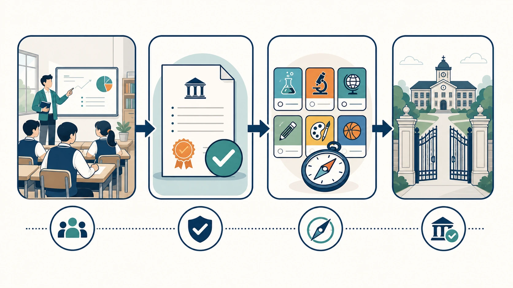
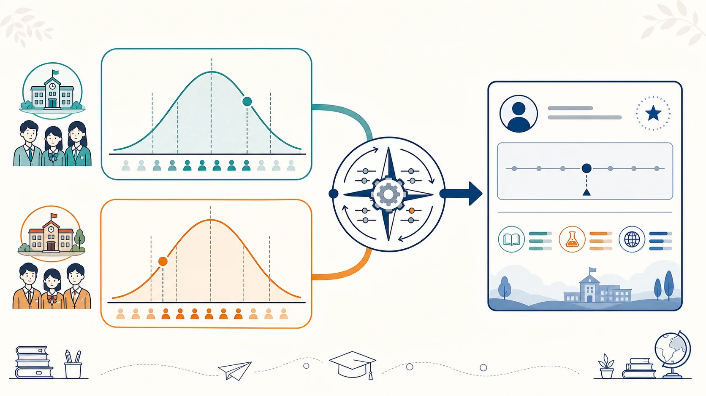

# 02 新高考选科规则完整解读

“我们是 3+3 还是 3+1+2？”“物理和历史能不能都不选？”“听说选的人少就容易赋高分，是真的吗？”

选科焦虑，很多时候不是因为学生不会选，而是因为一开始就把不同省份、不同年份、不同学校的信息混在了一起。先把规则的骨架看清，后面的学科比较和专业查询才不会走偏。

> **先说结论：** 新高考并不存在一张全国完全统一的“选科攻略”。你首先要确认的是本省采用哪种模式、学校何时组织选科、目标专业对选考科目有什么要求。理解通用框架很重要，但最终决定必须回到本省、本校和高校当年的官方信息。

## 一、先建立一张“规则地图”

理解新高考，可以先把它拆成四件事：

1. **统一高考考什么？** 通常是语文、数学、外语三门。
2. **选择性考试考什么？** 从相关科目中按本省规则选择，作为高校招生录取的重要依据。
3. **合格性考试是什么？** 它主要反映普通高中课程学习达到的基本要求，并与毕业、同等学力认定等相关；具体科目、时间和资格要求由各省安排。
4. **高校怎么使用这些成绩？** 普通高校招生录取通常依据统一高考成绩和高中学业水平选择性考试成绩，并参考综合素质评价；不同省份的投档、专业组和计划安排会有差异。

请注意：合格性考试和选择性考试不是“同一场考试换个名字”。前者关注是否达到课程学习的基本要求，后者服务于高校招生录取。学生往往需要先满足本省规定的相关条件，才能参加相应的选择性考试；具体以本省实施办法为准。

<!-- 图片注释说明：规则地图流程图。按“普通高中课程学习 → 合格性考试要求 → 选择性考试科目 → 高校招生录取”展示四步关系；在每一步下方加“以本省政策为准”的小字，不写具体省份或日期。 -->

## 二、“3+3”和“3+1+2”到底差在哪儿？

目前常见的新高考选科框架主要有两类。下表只用于建立通用概念，不替代任何省份的正式实施方案。

| 对比项 | “3+3”模式 | “3+1+2”模式 |
|---|---|---|
| “3” | 语文、数学、外语三门统一高考科目 | 语文、数学、外语三门统一高考科目 |
| 选择方式 | 常见做法是在物理、化学、生物学、思想政治、历史、地理中选 3 门 | 先在物理、历史中选 1 门，再在化学、生物学、思想政治、地理中选 2 门 |
| 理论组合数 | 常见六选三共有 20 种组合 | 物理或历史 × 四选二，共 12 种组合 |
| 招生类别提示 | 具体投档与专业组规则由省份规定 | 很多省份按物理、历史两个首选科目类别安排招生计划，但具体以本省规则为准 |
| 成绩呈现 | 选择性考试科目的计分、转换办法由本省规定 | 常见做法是首选科目计原始分，再选科目进行等级赋分；仍需核对本省细则 |

### 1. “3+3”：把选择权集中在六门科目中

在常见的“3+3”框架中，学生从物理、化学、生物学、思想政治、历史、地理六门科目中选择三门。六选三在数学上有 20 种组合，因此你会看到“物化生”“政史地”“物化地”等不同搭配。

这个模式的特点是选择空间较大。但空间大不等于随意搭配：高校专业可能提出选考科目要求，学校也可能根据师资和走班条件设置具体方案。个别省份还可能有本地课程、考试安排或报考规则，不能只凭“六选三”四个字推导所有细节。

### 2. “3+1+2”：先选物理或历史，再选两门

“3+1+2”中的“3”是语文、数学、外语；“1”是首选科目，学生在物理、历史中选择一门；“2”是再选科目，从化学、生物学、思想政治、地理中选择两门。

因此，在这个框架下：

- 不能既不选物理也不选历史；
- 也不能同时把物理和历史作为两门首选科目；
- 再选科目是在四门中选两门，不是从六门里任意挑两门。

许多家庭会把“物理类”“历史类”理解为旧式文理分科，这是不准确的。首选科目会影响部分招生计划的分类，但学生还可以在四门再选科目中形成不同组合。它比传统文理科提供了更多交叉空间，也要求你更认真地查专业要求。

<!-- 图片注释说明：对比信息图。左侧用六个科目圆点展示“3+3”的六选三；右侧先分出“物理/历史”两条主线，再连接化学、生物学、思想政治、地理四选二。只表达结构差异，不暗示任何组合优劣。 -->

## 三、合格性考试、选择性考试：别把两件事混为一谈

不少学生听到“学考”就紧张，担心每一门都要按高考难度准备。实际上，合格性考试和选择性考试的功能不同。

### 合格性考试：确认课程学习达到基本要求

合格性考试覆盖的课程范围、报名时间、考试次数和成绩使用方式，由各省具体规定。一般来说，它与高中毕业、普通高中同等学力认定等相关。有些省份还会把它作为参加相应选择性考试或高考报名资格审查的重要条件之一。

对学生而言，正确的态度不是“反正不计入高考总分就不用管”，而是：按学校进度扎实完成课程学习，留意报名与考试节点，避免因为流程疏漏给后续选择留下麻烦。

### 选择性考试：服务于高考招生录取

选择性考试科目才是选科讨论的核心。学生在规定范围内选择科目参加考试，其成绩与统一高考科目成绩共同构成招生录取的重要依据。

因此，选科时需要同时问两个问题：

- 我能否完成本省对课程学习和合格性考试的要求？
- 我选择的科目，是否满足想报考专业的要求，且有机会形成稳定成绩？

第一个问题关乎“能否顺利走完高中流程”，第二个问题关乎“高考竞争与报考选择”。二者都不能忽略。

## 四、原始分与等级赋分：为什么不能只比较卷面分？

“赋分”是选科讨论中最容易被误解的词之一。它不是额外加分，也不是“选的人少就一定占便宜”。

### 1. 什么是原始分？

原始分就是试卷卷面所得的分数。例如一张满分 100 分的试卷，考了 82 分，82 分就是原始分。

在不少“3+1+2”省份，语文、数学、外语和首选科目（物理或历史）按原始分计入总成绩；再选科目则按本省办法转换为等级分。以某些省份的公开办法为例，再选科目会先按本学科考生的原始分排序、划分等级，再在对应区间内进行转换。具体比例、区间和技术细则必须查本省文件。

### 2. 为什么再选科目常要进行等级赋分？

不同学科的试题难度、选择该科目的考生群体和成绩分布并不完全相同。若把不同学科的卷面分直接相加，可能难以公平比较。

等级赋分尝试解决的是“不同科目的成绩怎样更可比”的问题。它关注的不是单纯的 82 分，而是这 82 分在同一科目考生中的相对位置。

可以用一个不涉及具体规则的例子理解：

- 甲在某科卷面考 82 分，处在该科较靠前的位置；
- 乙在另一科也考 82 分，但该分数在该科考生中所处位置不同；
- 两人的最终转换分可能不同。

这不代表谁“被加分”或“被扣分”，而是不同学科的卷面分通过本省统一规则转为可比较的成绩。反过来说，原始分高，也不必然意味着转换后的相对优势更大。

<!-- 图片注释说明：赋分原理示意图。两条不同科目的成绩分布曲线，各自标出“同一卷面分可能对应不同相对位置”，再汇入“按本省规则转换”的结果框。不要展示固定比例、分数区间或“高分秘诀”。 -->

### 3. 赋分对选科意味着什么？

它至少提醒我们三件事：

1. 不要用“某科人少、人多”直接推断成绩结果。
2. 不能只看一次卷面分，要看长期排名、波动和学习效率。
3. 选择擅长且能稳定保持相对位置的科目，通常比追逐传闻中的“赋分红利”更可靠。

不同省份的计分方法并非完全一致。本文只解释逻辑，最终请以本省教育考试机构公布的赋分办法为准。

## 五、同样叫一个专业，为什么选考要求可能不同？

很多学生第一次查专业时会困惑：“明明都叫计算机、临床医学或金融，为什么学校不同，要求也不同？”

原因并不复杂：高校的培养方案、专业方向、招生专业组、面向不同省份的计划安排，以及招生年份，都可能不同。部分省份已经发布面向 2027 年及以后的专业选考科目要求，同时也明确提示：**实际招生院校、专业和计划仍要以高考当年公布的信息为准。**

因此，看到一张“专业选科对照表”时，不要立刻得出结论。先核对它是否写清以下字段：

| 必查字段 | 为什么要查 |
|---|---|
| 招生省份 | 同一高校在不同省份的安排可能不同 |
| 招生年份 | 专业设置、计划和要求可能调整 |
| 院校名称 | 同名专业在不同高校的培养要求可能不同 |
| 专业名称或专业组 | 志愿填报和要求往往落在具体专业（组）上 |
| 选考科目要求 | 判断自己是否具备报考资格 |
| 当年招生计划 | 有要求不代表当年一定在本省招生 |

最稳妥的查询顺序是：**先找本省教育考试机构公布的目录，再核对目标高校当年招生章程和招生计划。** 把结果填进[大学专业调查表](../09-实用工具与附录/04-大学专业调查表.md)，比收藏几张网络截图更有用。

<!-- 图片注释说明：查询步骤图。用编号 1—4 展示“确定招生省份与年份 → 查本省官方目录 → 核对高校招生章程与计划 → 填写专业调查表”；图标可用地图定位、官方文件、学校网页、表格。 -->

## 六、不同省份为什么不能照搬选科经验？

同一句“我表哥选了物化地，专业很广”，到了你这里可能只是一条参考，而不是答案。至少有五个变量会改变结论：

- **选科模式不同。**“3+3”和“3+1+2”的选择路径不同。
- **招生计划不同。** 同一专业是否在本省招生、归入哪个类别或专业组，要看当年计划。
- **赋分办法不同。** 转换规则、成绩呈现和相关条件以本省文件为准。
- **学校开班不同。** 学校的师资、走班和调整安排会影响实际学习体验。
- **专业要求不同。** 专业要求需要精确到省份、年份、学校和专业（组）。

所以，家长群里的经验可以用来提出问题，不能用来替代核验。真正可靠的信息，往往是看起来最“麻烦”的那几份官方文件。

## 七、选科前，建议保存这份官方信息清单

在学校要求提交选科前，至少找到并保存以下内容：

- [ ] 本省高考综合改革实施方案或权威政策解读
- [ ] 本省普通高中学业水平考试实施办法、报名与考试安排
- [ ] 本省选择性考试计分或等级赋分办法
- [ ] 本省发布的高校招生专业选考科目要求目录
- [ ] 学校关于选科、走班、开班和调整的书面通知
- [ ] 目标高校当年的招生章程与在本省招生计划

建议每一份资料都记下发布时间和适用年级。政策信息最怕“来源不明、年份不明、适用省份不明”。

<!-- 图片注释说明：官方信息核验卡片。以三张文件卡片展示“来源、年份、招生省份”三个必填标签，旁边放一个醒目的核验对勾；用于强调不要转发无出处截图。 -->

## 八、读完这篇，你可以立刻做什么？

- [ ] 写下自己所在省份采用的选科模式；不确定就向班主任或学校教务处核实。
- [ ] 从上面的清单中找到至少两份本省官方文件并保存链接。
- [ ] 在[大学专业调查表](../09-实用工具与附录/04-大学专业调查表.md)中先填 3 个感兴趣的专业方向。
- [ ] 暂时不要因为“某科据说好赋分”或“别人都这么选”删掉候选科目。

规则看清之后，下一步不是马上确定组合，而是观察自己与六门科目的匹配度。请继续阅读：[高中选科从什么时候开始准备？](03-高中选科从什么时候开始准备.md)。

## 重要提示与参考

本文更新于 2026 年 8 月，仅用于解释通用框架。各省实际选科模式、合格性考试安排、等级赋分办法、学校开班政策和高校专业要求，以本省教育考试机构、本校及高校当年正式发布的信息为准。

- [教育部：七省份公布高考改革实施方案](https://www.moe.gov.cn/jyb_xwfb/s5147/202109/t20210916_563605.html)
- [江苏省教育考试院：新高考方案全解读，什么是等级分？等级分如何转换？](https://gaokao.chsi.com.cn/gkxx/zc/ss/202001/20200117/1873384405.html)
- [阳光高考：各省专业选考科目要求查询入口](https://gaokao.chsi.com.cn/gkzt/tbzyzn?curtab=1)
- [上海市教育考试院：2027 年普通高校本科专业选考科目要求说明](https://gaokao.chsi.com.cn/gkxx/zc/ss/202502/20250225/2293372114.html)
