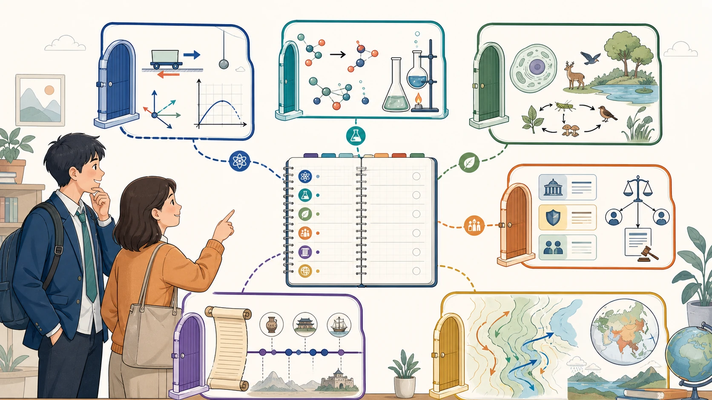
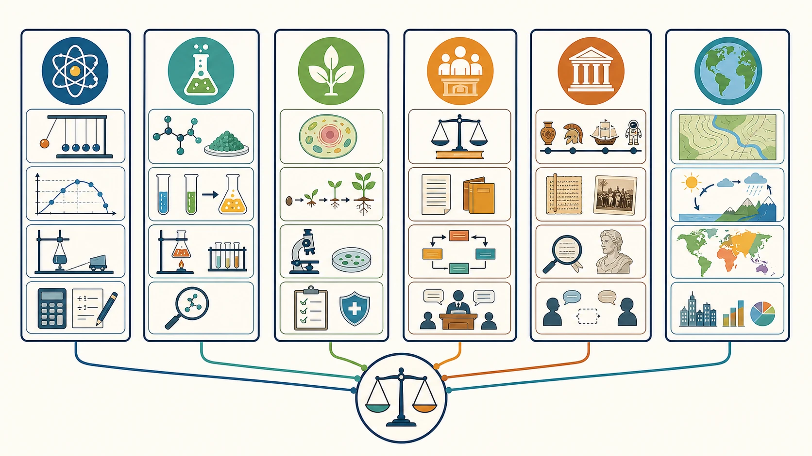

# 04 六门选考科目分别学什么？

“物理是不是最难？”“生物是不是背一背就能得分？”“历史和政治都靠记忆，选哪个差不多吧？”

高一开始讨论选科时，学生和家长最容易用几个简单标签认识六门课：物理难、化学碎、生物好背、政治看时事、历史记年代、地理像文科中的理科。标签很省事，却也最容易让人选错。

真正要面对的，不是某门科目在别人嘴里难不难，而是：**它主要研究什么、用什么方式解决问题、到了高二高三会怎样变难，你能否接受这种学习方式。**

> **先说结论：** 六门选考科目没有脱离个人条件的“难度排名”。同样是 80 分，有人靠大量时间勉强维持，有人理解后能稳定提升；同样说“喜欢”，有人只是喜欢老师和当前章节，有人遇到难题仍愿意追根究底。选科前，应当用同一套尺度比较六科，而不是拿六个网络标签作决定。

<!-- 图片描述说明：文章头图，横向知识探索场景。画面中心是一名高中生与家长共同查看一张“六科观察地图”，前方依次展开六个等大的学科入口：物理用受力箭头、实验小车和函数图像表示“模型”；化学用分子结构、反应箭头和实验装置表示“反应”；生物学用细胞、生态链表示“生命”；思想政治用材料卡片、逻辑关系图表示“社会”；历史用时间轴、史料卷轴表示“时空”；地理用等高线地图、区域流程箭头表示“区域”。六个入口并列而非排序，学生手持记录本比较学习方式；整体为明亮、理性、鼓励探索的教育信息图，不出现分数、难度星级、冠军或“最佳科目”暗示。 -->

## 一、认识一门学科，至少要看八件事

很多家庭只看“现在考多少分”和“以后能报什么专业”。这两项重要，却远远不够。建议用下面八个问题认识每一门科目。

| 比较维度 | 需要回答的问题 |
|---|---|
| 学习对象 | 这门课主要研究什么现象、规律和问题？ |
| 核心任务 | 平时最常做的是计算、实验、读图、读材料，还是论证表达？ |
| 初高中变化 | 高中阶段和初中相比，真正增加的难度是什么？ |
| 能力要求 | 要稳定学好，最依赖哪些思维和学习习惯？ |
| 常见失分 | 学生通常在哪些环节丢分？这些问题能否改进？ |
| 长期成本 | 是否需要频繁复习、持续计算、整理框架或训练表达？ |
| 适配信号 | 什么样的学习表现说明你可能适合？ |
| 专业联系 | 它可能帮助保留哪些探索方向？具体要求去哪里核验？ |

这套尺子有两个好处。

第一，它能把“我觉得”变成可观察的事实。比如，“我不喜欢物理”可以继续追问：是不喜欢计算，还是概念没补好？是长期排斥模型分析，还是刚好在某一章遇到困难？

第二，它让学生和家长说同一种语言。学生不必只用“喜欢、不喜欢”表达，家长也不必只用“有用、没用”施压，双方可以一起讨论成绩、投入、错误和未来方向。

<!-- 图片描述说明：认识选考学科的八维观察清单图。以八个围绕中心“学科适配”的等权节点展示：研究对象、核心任务、知识结构、常见题型、初高中过渡、关键能力、易错模式、专业关联；每个节点配一个简洁图标和可记录的空白信息位，外圈用细线连向六门科目的小卡片。图的作用是引导学生按同一把尺子观察六科，而不是凭网络标签或一次分数下判断；不出现难易排序、推荐指数或唯一结论。 -->

## 二、物理：把真实世界抽象成模型

物理研究运动、相互作用、能量、电磁、波与光等自然规律。高中物理不是把公式背下来再找数字代入，而是要完成一条相对完整的分析链：

**读懂情境 → 选择研究对象 → 判断过程 → 建立模型 → 选用规律 → 数学求解 → 检查结果。**

### 1. 高中物理主要学什么？

- 运动描述、力与运动、曲线运动等力学内容；
- 功和能、动量与碰撞等守恒思想；
- 电场、电路、磁场和电磁感应；
- 机械振动、波、光学和近代物理基础；
- 实验测量、数据处理、误差分析和探究设计。

### 2. 初高中最大的变化是什么？

初中物理常从直观现象和基础规律出发，高中物理更强调抽象模型、适用条件和多过程推理。同一个题目里，研究对象可能变化，运动阶段可能变化，使用的规律也可能变化。

因此，“公式都记得”不等于会做题。真正的难点往往是：你能否看出题目在描述哪个模型，能否把复杂过程拆成几段。

### 3. 哪些能力最重要？

- 抽象和建模：把小车、卫星、带电粒子等情境还原为基本过程；
- 逻辑推理：判断原因、条件和结果，不跳步骤；
- 数学与图像：进行代数运算，读懂斜率、面积和变化趋势；
- 实验意识：理解变量、测量、数据和误差，而不是只背步骤；
- 过程表达：画图、列式、说明规律，形成可检查的解题链。

### 4. 常见失分说明什么？

如果主要错在计算、单位、符号和步骤，往往可以通过规范训练改善；如果总是找不到研究对象、无法判断过程、换一个情境就不认识模型，则需要更长时间补概念和建模能力。

适合物理的学生未必每次都考最高，但通常愿意追问“为什么”，遇到复杂问题能耐心拆解，并且改错后能看见同类题的迁移。

物理与许多理学和工程技术方向联系紧密，例如物理学、计算机、电子信息、自动化、机械、电气、土木、航空航天等。但具体专业是否要求物理、是否同时要求化学，必须核查招生省份、适用年份、院校和专业。

进一步阅读：[物理学科学习解读](../03-学科讲解/09-物理学科学习解读.md)。

## 三、化学：在现象、微观粒子和符号之间切换

“化学知识点太碎了，背不完。”这是很多学生的真实感受。但化学既不是纯记忆，也不是纯计算。它常要求你在三个层面来回切换：

- **宏观层面：** 看见颜色、气体、沉淀、温度等实验现象；
- **微观层面：** 解释粒子、结构、电子和反应本质；
- **符号层面：** 用化学式、方程式、结构式和数据准确表达。

### 1. 高中化学主要学什么？

- 物质分类、离子反应、氧化还原等反应基础；
- 元素及其化合物、元素周期律；
- 物质结构、反应速率、化学平衡和电化学；
- 有机物结构、性质、转化与合成；
- 实验装置、操作、检验、分离、流程和安全。

### 2. 初高中最大的变化是什么？

高中化学的知识网络更密。某个现象不能只靠“背结论”，还要考虑反应条件、物质结构、量的关系和实验目的。到了反应原理、有机推断、工艺流程和实验综合题，多个模块常会同时出现。

因此，学生觉得“碎”，往往不是记忆力差，而是还没有把物质、性质、反应、条件和实验连成网络。

### 3. 哪些能力最重要？

- 规律理解与准确记忆并行；
- 从现象和数据推断物质或反应过程；
- 使用守恒、比例和变量关系进行计算；
- 把零散知识整理成反应网络；
- 重视条件、符号、术语和实验操作的准确性。

### 4. 常见失分说明什么？

方程式书写、符号、条件和计算失误，通常反映规范与熟练度；实验题不知道每一步“为什么做”，说明实验逻辑没有建立；同一物质换个情境就不会，往往说明知识仍是孤立记忆。

适合化学的学生，通常能接受“理解、记忆、计算、实验”四种任务并存，愿意定期整理和复现知识，而不是只靠考前突击。

化学与化学、材料、化工、能源、环境、药学、食品及部分医学和生命科学方向常有联系。近年来不少理工农医专业的选考要求会同时涉及物理和化学，但不同高校、专业及年份存在差异，不能用一句“想学医必须选某科”代替查询。

进一步阅读：[化学学科学习解读](../03-学科讲解/10-化学学科学习解读.md)。

## 四、生物学：不只是记忆，更要读图、实验和准确表达

生物学研究生命系统，从分子、细胞、个体到种群、群落和生态系统。教材中确实有大量概念和术语，但考试很少只问“这句话背过没有”。更常见的是把知识放进遗传图解、实验材料、曲线和真实情境里。

### 1. 高中生物学主要学什么？

- 细胞结构、物质运输、能量转换和细胞生命历程；
- 遗传规律、基因表达、变异和进化；
- 内环境、神经、体液和免疫调节；
- 种群、群落、生态系统和环境问题；
- 实验设计、生物技术、数据与图表分析。

### 2. 初高中最大的变化是什么？

高中生物学的概念更精细，条件和范围更重要。学生常有一种错觉：课上听懂了、课本也看熟了，考试时却在两个相近选项之间犹豫。原因通常不是完全不会，而是概念边界不清。

实验与材料题也会明显增加。题目要求你根据目的设置变量、分析结果、解释异常，而不是复述某个实验结论。

### 3. 哪些能力最重要？

- 理解概念的定义、条件、范围和关系；
- 从文字、结构图、曲线图和表格中提取信息；
- 进行遗传推理、必要的概率计算和机制分析；
- 理解实验目的、变量、对照、结果与结论；
- 用规范术语把因果链表达完整。

### 4. 常见失分说明什么？

选择题总在相近概念间摇摆，说明概念边界需整理；简答题“意思对却拿不到分”，说明术语和逻辑不够准确；遗传题只会套固定比例，说明推理链尚未建立。

适合生物学的学生往往对生命、健康、遗传和生态有持续好奇，也愿意处理细节、读长材料、复盘表达。记忆力好是帮助，但不能替代理解和实验分析。

生物学与生物科学、生物技术、生态、农学、食品及部分医学健康方向常有联系。不过，专业名称里出现“生物”或“医学”，并不意味着只选生物学就一定满足要求。

进一步阅读：[生物学学科学习解读](../03-学科讲解/11-生物学学科学习解读.md)。

## 五、思想政治：用理论框架分析真实社会

思想政治不是“背新闻”，也不是在答题纸上自由发表看法。它的基本任务是：**理解教材理论，从现实材料中识别问题，再用规范的学科语言作出有依据的分析。**

### 1. 高中思想政治主要学什么？

- 中国特色社会主义发展与制度基础；
- 经济运行、市场、分配、社会保障与高质量发展；
- 政治制度、国家治理、公民参与与法治；
- 哲学、文化、认识和价值判断；
- 法律与生活、逻辑思维及现实议题分析。

### 2. 初高中最大的变化是什么？

高中思想政治的理论框架更系统，材料更长，主观题要求更高。题目不会因为学生“观点积极”就自然得分，而要看是否找准主体、调用正确知识、结合材料并形成清晰逻辑。

时事能够帮助理解，但时事不能替代教材。只看新闻、不整理原理，常会出现“有话可说，却答不到评分点”的问题。

### 3. 哪些能力最重要？

- 理解并记住概念、主体、关系和适用范围；
- 从材料中识别主体、问题、原因、措施和影响；
- 区分事实、观点、条件和逻辑关系；
- 用“知识点＋材料对应＋结论”组织答案；
- 关注现实，同时把个人感受转化为学科分析。

### 4. 常见失分说明什么？

选择题常被绝对化表述和主体混淆干扰，说明概念边界不足；主观题写很多却分数不高，往往是设问方向没看准，或理论与材料“两张皮”。

适合思想政治的学生，通常愿意阅读社会材料，对公共议题、规则和现实机制有兴趣，也能接受持续记忆与规范表达训练。

思想政治与马克思主义理论、思想政治教育，以及部分政治学、公安、法学、公共管理等方向可能有关。尤其是公安类或其他特殊招生，需要逐校、逐专业核查，不宜凭专业名称推断。

进一步阅读：[思想政治学科学习解读](../03-学科讲解/12-思想政治学科学习解读.md)。

## 六、历史：在时间与证据中解释变化

历史当然需要记忆，但记忆只是材料。高中历史真正要求的是：把事件放进时间和空间，理解变化、原因与影响，再根据史料形成解释。

### 1. 高中历史主要学什么？

- 中国历史和世界历史的基本发展线索；
- 政治制度、经济生活、思想文化与社会变迁；
- 文明交流、国家发展和全球联系；
- 史料阅读、证据辨析、历史解释和观点论证。

### 2. 初高中最大的变化是什么？

高中历史跨度更大，专题之间的联系更复杂。选择题可能给出陌生史料，让学生判断时代背景和材料含义；材料题要求概括、比较、解释；论述题还要提出观点并用史实支持。

“知道这个事件”只是起点。你还要回答：它为什么发生？与此前有何联系？产生了哪些影响？材料能证明什么，又不能证明什么？

### 3. 哪些能力最重要？

- 建立时间线、阶段特征和空间定位；
- 在不同制度、地区和时期之间比较；
- 识别史料来源、立场、背景和有效信息；
- 用背景、原因、变化、影响等语言组织解释；
- 围绕观点选择史实，形成证据链。

### 4. 常见失分说明什么？

年代和事件混淆，说明时空框架不稳；材料题只抄材料，说明没有完成概括和解释；论述题有观点却缺证据，说明史实还没有转化为论证资源。

适合历史的学生未必只是“记性好”，更重要的是愿意阅读、整理线索、比较变化，并接受较长文字材料和论证表达。

历史与历史学、考古、文物博物馆等方向联系直接，也能为哲学、文学、教育、新闻传播和部分社会科学探索提供基础。但这些专业是否要求历史，要查具体招生信息。

进一步阅读：[历史学科学习解读](../03-学科讲解/13-历史学科学习解读.md)。

## 七、地理：在地图上理解自然与社会

地理横跨自然科学与社会科学。它既研究大气、水、地貌等自然过程，也研究人口、城市、产业、交通与区域发展。地图不是要背下来的插图，而是地理信息的重要载体。

### 1. 高中地理主要学什么？

- 地球运动、大气、水、地貌和自然环境；
- 人口、城市、农业、工业、服务业和交通；
- 区域差异、资源环境、灾害与可持续发展；
- 地图、等值线、统计图、示意图和地理实践。

### 2. 初高中最大的变化是什么？

初中地理常侧重区域位置和基础事实，高中更重视过程、联系和原因。比如，不只要知道某地降水多少，还要解释水汽从哪里来、地形怎样影响、季节为什么变化。

综合题经常需要把地形、气候、水文、资源、人口、产业和政策放在一起分析。背一套“万能模板”，如果不结合具体区域，往往得不到理想分数。

### 3. 哪些能力最重要？

- 空间定位和空间想象；
- 读地图、图表、数据和示意过程；
- 从多种条件中建立因果链；
- 理解自然过程与人类活动的相互影响；
- 用准确的地理术语说明原因、影响和措施。

### 4. 常见失分说明什么？

图表信息漏读，说明读图流程不稳；原因题只堆关键词，说明没有因果链；自然地理反复出错，可能是过程理解和空间想象不足；答案“放在哪里都能用”，说明没有回到具体区域。

适合地理的学生通常对地图、环境、城市和区域差异感兴趣，愿意同时处理图像、数据和文字，也能接受自然规律与社会经济交叉分析。

地理与地理科学、气象、海洋、地质、测绘遥感、城乡规划、资源环境等方向可能有关。不同方向的选科要求差异较大，不能简单认为“选地理就能报所有地理相关专业”。

进一步阅读：[地理学科学习解读](../03-学科讲解/14-地理学科学习解读.md)。

## 八、六科横向比较：不要找“最简单”，要找“最匹配”

下面这张表不是难度排行榜，而是学习任务速查表。

| 科目 | 核心学习方式 | 常见高频任务 | 容易被低估的难点 |
|---|---|---|---|
| 物理 | 建模、推理、计算 | 过程分析、图像、实验、综合计算 | 公式背会后仍不会识别模型 |
| 化学 | 规律、网络、实验、计算 | 反应推断、流程、原理、有机、实验 | 条件和知识关联比单点记忆更重要 |
| 生物学 | 概念、信息、实验、表达 | 图表材料、遗传、实验、简答 | 概念边界和规范表达要求高 |
| 思想政治 | 理论、材料、逻辑、表达 | 选择辨析、图表、材料论述 | 时事不能替代教材框架 |
| 历史 | 时空、史料、解释、论证 | 材料概括、比较、解释、论述 | 记住事实不等于会使用证据 |
| 地理 | 空间、过程、区域、综合 | 读图、区位、成因、影响、措施 | 需要自然与人文多因素联动 |

<!-- 图片描述说明：六科学习方式总览图，采用六张并列卡片而非排名雷达图。每张卡片用一个主图标和四个简洁的信息位呈现核心学习任务：物理突出模型、图像、实验、计算；化学突出物质、反应、实验、推断；生物学突出结构、过程、实验、调节；思想政治突出概念、材料、逻辑、表达；历史突出时空、史料、解释、论证；地理突出读图、过程、区域、综合。卡片之间用细线连接到中心的“比较学习任务”图标，强调六科是不同的能力组合；六张卡片面积、亮度和位置保持平等，不显示分数、难易、覆盖率或优劣结论。 -->

如果学生看完后说“好像每科都能学”，这是正常的。选科不是靠一篇文章立刻排除三门，而是先找出需要继续观察的科目，再用连续数据验证。

## 九、两个学生都考 82 分，适配程度可能完全不同

假设小周和小雨某次化学都考了 82 分。

小周每周额外投入 6 小时，题型一变就不会，错误集中在反应原理和实验目的；过去五次排名波动很大。小雨每周额外投入 3 小时，主要错在方程式书写和计算细节；改错后同类错误明显减少，排名较稳定。

只看这一次分数，两个人“化学一样好”。但从投入、错因、改进速度和稳定性看，小雨目前更可能形成长期优势。

这并不意味着小周必须放弃化学。更合理的下一步是：给自己 8—12 周观察期，针对反应原理和实验逻辑调整方法，再看投入是否下降、排名是否稳定、同类错误是否减少。

家长在这个过程中最有价值的作用，不是替孩子下结论，而是帮助记录事实、寻找教师反馈、核查专业要求，并提醒孩子不要因一次成绩情绪化决定。

## 十、认识六科时，最常见的六个误区

### 误区一：把记忆量等同于学科难度

需要记忆，不代表只靠记忆；计算多，也不代表只要数学好。六科都需要理解，只是理解和表达的方式不同。

### 误区二：把当前老师等同于学科本身

喜欢一位老师可以提高投入，暂时不适应教学方式也会影响成绩，但选科要面对的是几年学习和最终考试，不能只根据师生关系决定。

### 误区三：把初中表现直接外推到高中

初高中内容、题型和能力要求都会变化。初中基础有参考价值，但高一连续表现更能说明问题。

### 误区四：把专业联系当成固定报考资格

“这门科目与某专业有关”只是探索提示。最终是否能报，要看当年、所在招生省份、具体高校和专业（组）的正式要求。

### 误区五：用一次高分证明适合，用一次低分证明不适合

一次考试会受试卷难度、复习范围、状态和偶然失误影响。选科需要看趋势。

### 误区六：先认定某科“好赋分”，再倒推自己适合

赋分与相对位置有关，也受本省具体规则影响。无法可靠预测未来考生结构，更不能用传言替代自己的长期表现。

## 十一、读完这篇，先完成三项观察

- [ ] 为六科各写一句：“这门课最核心的学习任务是什么？”
- [ ] 为六科各写一句：“我能否接受它最主要的难点？证据是什么？”
- [ ] 选出 3—4 门候选科目，使用[学科优势记录表](../09-实用工具与附录/02-学科优势记录表.md)连续观察 8—12 周。

此时不要急着选出唯一组合。下一篇将进一步解决一个更关键的问题：分数、排名、兴趣和投入冲突时，怎样判断一门科目是否真的适合自己？请继续阅读：[如何判断一门科目是否真正适合自己？](05-如何判断一门科目是否真正适合自己.md)。

## 重要提示与参考

本文更新于 2026 年 8 月，介绍的是六门科目的通用学习特点，不构成任何省份的选科或专业报考结论。课程内容、考试安排、计分办法、学校开班和高校专业选考要求，请以本省教育考试机构、本校及高校当年正式信息为准。

- [教育部：普通高中课程方案和语文等学科课程标准（2017年版2020年修订）](https://www.moe.gov.cn/srcsite/A26/s8001/202006/t20200603_462199.html)
- [教育部：七省份公布高考改革实施方案](https://www.moe.gov.cn/jyb_xwfb/s5147/202109/t20210916_563605.html)
- [阳光高考：2027年各省市普通高校本科专业选考科目要求汇总](https://gaokao.chsi.com.cn/gkxx/ss/202502/20250225/2293354644.html)
